[← Home](../README.md) · [Overview](README.md)

# Amiga Hardware Models — Per-Model Architecture, Chip Inventory, and Expansion

## Overview

The Amiga line spans nine years (1985–1994), three chipset generations, and four CPU families. While every model shares the same core custom-chip architecture — a DMA-driven display system with dedicated audio, blitter, and copper coprocessors — the implementation details vary dramatically. The A1000's 256 KB Chip RAM and side-car expansion bears little resemblance to the A4000's 32-bit Zorro III bus and on-board SCSI. Understanding these differences is essential for developers writing software that must run across the entire family, for reverse engineers analyzing per-model binaries, and for hardware restorers diagnosing chipset compatibility.

This article provides a per-model architectural breakdown: which custom chips are present, how memory is mapped, what expansion options exist, and which factory jumpers or revisions affect behavior. For the underlying memory-type concepts (Chip vs Fast vs Slow RAM), see [memory_types.md](../01_hardware/common/memory_types.md). For address-space maps, see [address_space.md](../01_hardware/common/address_space.md).

---

## Quick Reference Table

| Model | Year | CPU | MHz | Chipset | Chip RAM | ROM | Expansion |
|---|---|---|---|---|---|---|---|
| A1000 | 1985 | 68000 | 7.14 | OCS | 256 KB | 256 KB | Sidecar |
| A500 | 1987 | 68000 | 7.09 | OCS | 512 KB | 256 KB | Edge connector |
| A2000 | 1987 | 68000 | 7.14 | OCS/ECS | 512 KB–1 MB | 256/512 KB | Zorro II, ISA, CPU slot |
| A500+ | 1991 | 68000 | 7.09 | ECS | 1 MB | 512 KB | Edge connector |
| A600 | 1992 | 68000 | 7.09 | ECS | 1 MB | 512 KB | PCMCIA, IDE, trapdoor |
| A3000 | 1990 | 68030 | 16/25 | ECS | 1–2 MB | 512 KB | Zorro III, ISA, SCSI |
| A1200 | 1992 | 68EC020 | 14.18 | AGA | 2 MB | 512 KB | PCMCIA, IDE, trapdoor |
| A4000 | 1992 | 68030/040 | 25 | AGA | 2 MB | 512 KB | Zorro III, IDE |
| A4000T | 1994 | 68040/060 | 25 | AGA | 2 MB | 512 KB | Zorro III, SCSI |
| CDTV | 1991 | 68000 | 7.09 | OCS | 1 MB | 256/512 KB | Internal A2000-compatible |
| CD32 | 1993 | 68EC020 | 14.18 | AGA | 2 MB | 512 KB | FMV slot (SX-1 expander) |

---

## Chipset Generations and Custom Chip Inventory

### OCS (Original Chip Set) — 1985

| Chip | Part Number | Function | Notes |
|---|---|---|---|
| **Agnus** | 8361 (NTSC) / 8367 (PAL) | DMA scheduler, blitter, copper, disk | 18-bit address (512 KB Chip RAM max) |
| **Denise** | 8362 | Display encoder, sprite DMA, mouse | 320×200 to 640×400 interlace |
| **Paula** | 8364 | Audio, floppy, serial | 4-channel DMA audio |
| **Gary** | 5718 | System glue, bus control | Present on A500/A2000 only |
| **Budgie** | — | A1000-specific glue | Replaced by Gary in later models |

### ECS (Enhanced Chip Set) — 1990

| Chip | Part Number | Function | Notes |
|---|---|---|---|
| **Agnus** | 8372 (Fat) / 8372A (Super) | DMA scheduler | Fat: 1 MB address; Super: 2 MB address |
| **Denise** | 8373 (ECS) | Display encoder | Supports 640×480 productivity modes |
| **Paula** | 8364 (unchanged) | Audio, floppy, serial | Same as OCS |
| **Gary** | 5718 | System glue | Unchanged from OCS |

### AGA (Advanced Graphics Architecture) — 1992

| Chip | Part Number | Function | Notes |
|---|---|---|---|
| **Alice** | 8374 | DMA scheduler, blitter (64-bit), copper | 2 MB Chip RAM, 64-bit blitter fetches |
| **Lisa** | 8375 | Display encoder | 24-bit color, HAM8, up to 1280×512 |
| **Paula** | 8364 (unchanged) | Audio, floppy, serial | Still 4-channel, 8-bit DMA audio |
| **Akiko** | — | CD32 only | Chunky-to-planar converter, CD-ROM glue |

---

## Per-Model Deep Dives

### A1000 (1985) — The Original

The A1000 is the progenitor. Its most distinctive feature is the **Writable Control Store (WCS)** — a 256 KB pseudo-ROM loaded from disk at boot. The Kickstart is not in a physical ROM chip; it is copied from a floppy into RAM that the CPU executes from at `$FC0000`.

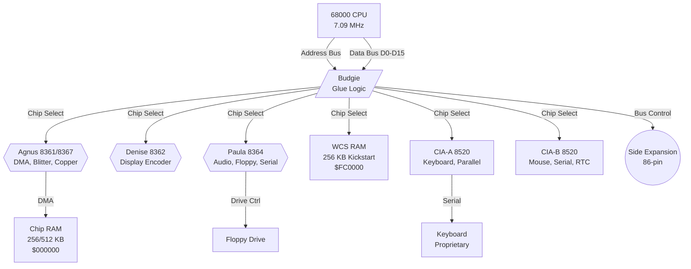

| Spec | Value |
|---|---|
| Chip RAM | 256 KB stock, 512 KB max (internal expansion) |
| Kickstart | Loaded from "Kickstart" disk to WCS; not socketed ROM |
| Expansion | Side expansion (86-pin, similar to A500 but different) |
| Video | 23-pin RGB analog + composite + monochrome |
| Keyboard | External, proprietary interface |

> **Developer note**: The A1000's WCS means `execbase->MaxLocMem` reports less than 512 KB even with full expansion, because `$FC0000`–`$FFFFFF` is occupied by WCS. Software that probes for available memory rather than hardcoding addresses will run correctly.

---

### A500 (1987) — The Icon

The best-selling Amiga model. Internally, it is an A1000 chipset repackaged into a keyboard case with a single floppy drive and a trapdoor expansion slot.

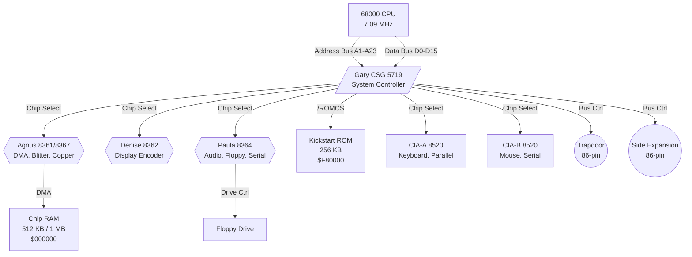

| Spec | Value |
|---|---|
| Chip RAM | 512 KB stock, 1 MB max (trapdoor expansion) |
| Slow RAM | 512 KB at `$C00000` via trapdoor (Agnus-dependent) |
| Kickstart | 256 KB ROM in socket; upgradeable to 512 KB ECS ROM |
| Trapdoor | 86-pin: Chip RAM expansion, RTC option, 68000 relocator for accelerators |
| Side slot | 86-pin: Zorro II-style expansion (A590 HD, etc.) |

**Key jumper/revision note**: Early A500s (Rev 3–5) have the **Agnus 8361** (18-bit address, 512 KB max Chip). Later revisions (Rev 6+) sometimes ship with **Agnus 8372A** (Super Fat Agnus), allowing 1 MB or 2 MB Chip RAM with modifications. The Denise chip is always 8362 (OCS) unless swapped by user.

---

### A2000 (1987) — The Big Box

The A2000 is an A500 on a larger motherboard with five Zorro II slots, an ISA bridge, and a CPU slot. It was Commodore's attempt to capture the professional desktop market.

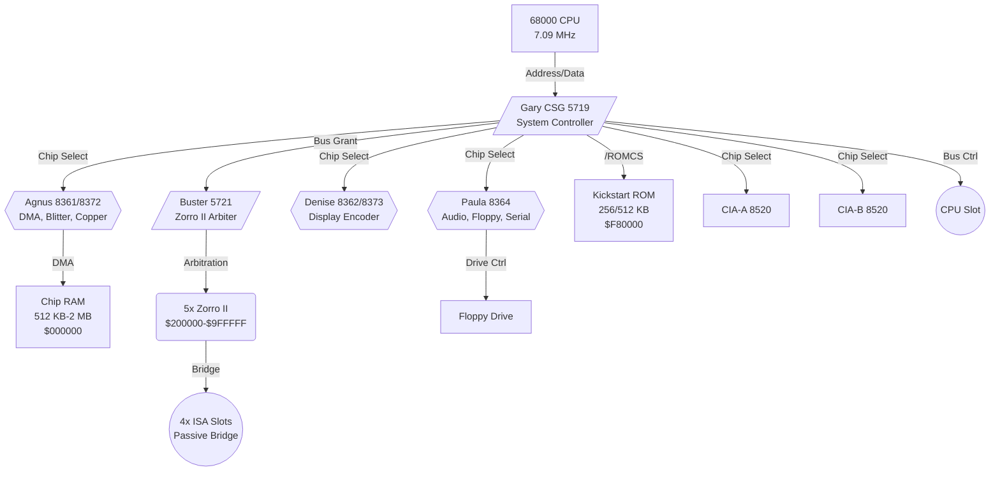

| Spec | Value |
|---|---|
| Chip RAM | 512 KB (early), 1 MB (Rev 6+ with Fat Agnus), up to 2 MB with Super Agnus mod |
| Fast RAM | Zorro II cards up to 8 MB; CPU-slot accelerators up to 128 MB |
| Kickstart | 256 KB (early), 512 KB (Rev 6+); socketed, easily swapped |
| Buster | Zorro II bus arbiter chip; Rev 7–9 fix DMA bugs |
| ISA bridge | Passive bridge; requires ISA card with Amiga driver |

**Revision history**:
- **Rev 4.x**: OCS, 512 KB Chip RAM, 256 KB ROM
- **Rev 6.x**: ECS (Fat Agnus 8372), 1 MB Chip RAM, 512 KB ROM
- **Rev 6.5**: Minor Buster fix
- **Rev 6.6**: Final Commodore revision; best compatibility

> **Developer note**: The A2000's Buster chip has known DMA arbitration bugs in early revisions. Zorro II cards that use DMA (e.g., GVP SCSI) may hang on Rev 4.x boards. Software cannot detect this; it is a hardware compatibility issue for users.

---

### A500+ (1991) — ECS in a Budget Shell

Essentially an A500 with ECS chipset and 1 MB Chip RAM standard. It was a stopgap model between the A500 and A600.

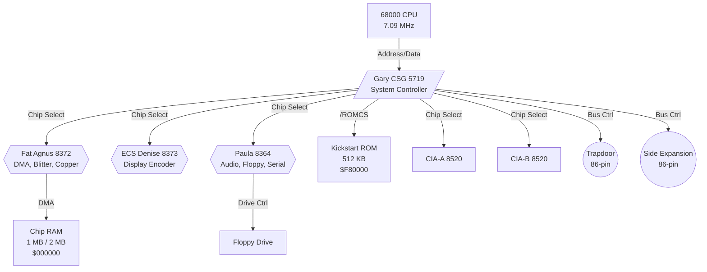

| Spec | Value |
|---|---|
| Chip RAM | 1 MB stock; 2 MB max with trapdoor mod (requires Agnus 8372A) |
| Kickstart | 512 KB ROM (Kickstart 2.04) |
| Denise | 8373 (ECS) — supports 640×480 productivity modes |
| Clock | Battery-backed RTC standard (not optional as in A500) |

**The "2 MB Chip" mod**: The A500+ can reach 2 MB Chip RAM by replacing the 8372 Fat Agnus with a **8372A Super Agnus** and adding 1 MB of RAM chips on the motherboard. The Fat Agnus supports only 1 MB addressing; Super Agnus extends to 2 MB.

---

### A600 (1992) — The Compact

Commodore's attempt at a portable-friendly Amiga. It removes the numeric keypad, uses a 2.5" hard drive, and adds PCMCIA and internal IDE.

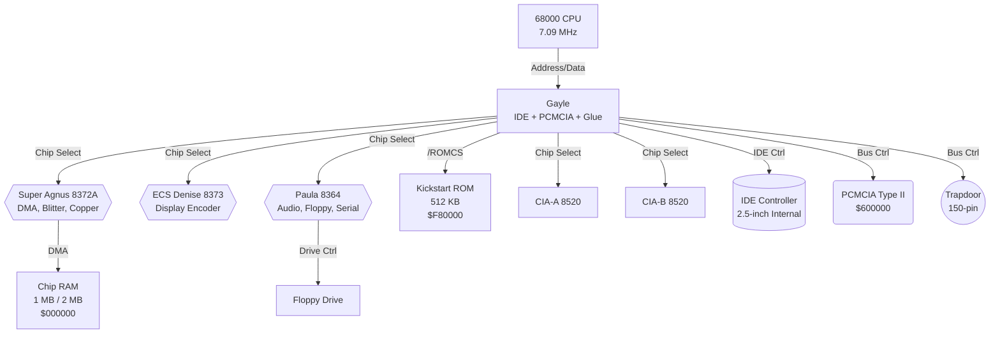

| Spec | Value |
|---|---|
| Chip RAM | 1 MB stock; 2 MB max (trapdoor accelerator or Chip RAM expansion) |
| IDE | Internal 2.5" IDE via **Gayle** chip; up to 2 devices |
| PCMCIA | Type II slot; memory cards (up to 4 MB Fast RAM), Ethernet, modems |
| Gayle | Replaces Gary; integrates IDE controller, PCMCIA interface, and memory decoding |
| Kickstart | 512 KB ROM (Kickstart 2.05) |

> **Developer note**: The A600's Gayle chip has a known bug with IDE interrupt handling under heavy DMA load. Some CF card adapters require specific driver workarounds. PCMCIA memory cards map as Fast RAM at `$600000` and can conflict with accelerator memory.

---

### A3000 (1990) — The Professional

The first 32-bit Amiga with Zorro III, built-in SCSI, and a 68030 CPU. It was designed for the UNIX workstation market and is the most expandable ECS machine.

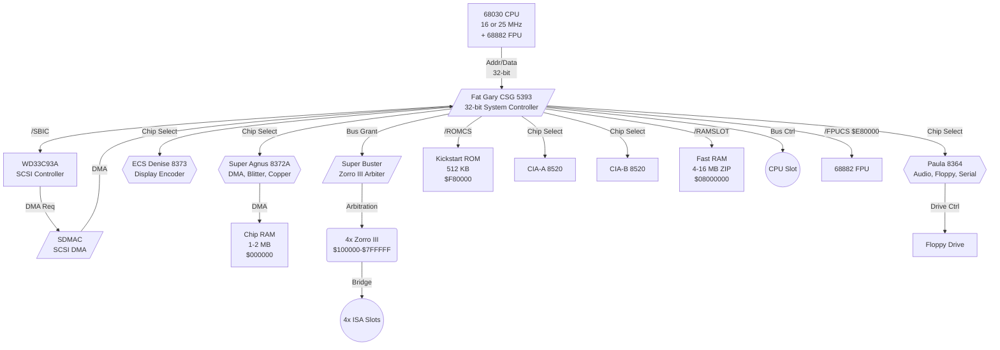

| Spec | Value |
|---|---|
| Chip RAM | 1 MB (early), 2 MB (later); fixed on-board |
| Fast RAM | 4 MB standard, 16 MB max (ZIP chips on motherboard) |
| Zorro III | 32-bit, up to 256 MB address space; backwards compatible with Zorro II |
| SCSI | WD33C93A controller; DMA-capable; internal 50-pin + external DB25 |
| Kickstart | 512 KB ROM; unique "superkickstart" mode for ROM development |
| Video | 23-pin RGB + monochrome; optional framebuffer card in Zorro III slot |

**The "Big Box" advantage**: Unlike the A500/A600, the A3000 has no trapdoor. All expansion is via Zorro III slots or the CPU slot. The on-board Fast RAM uses **ZIP (zig-zag inline package)** DRAM, which is difficult to source today — many A3000 owners use Zorro III RAM cards instead.

---

### A1200 (1992) — The Affordable AGA

The most popular AGA model. It packs Alice, Lisa, and 2 MB Chip RAM into a compact keyboard case similar to the A600.

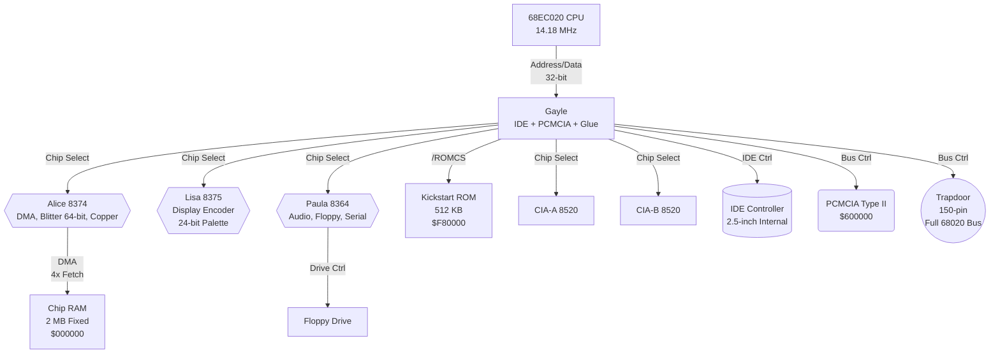

| Spec | Value |
|---|---|
| CPU | 68EC020 @ 14.18 MHz (no MMU, no FPU) |
| Chip RAM | 2 MB fixed; not expandable on motherboard |
| Fast RAM | Trapdoor accelerators (up to 256 MB); PCMCIA memory (up to 4 MB) |
| IDE | Gayle-based, same as A600; 2.5" internal + CF adapter popular |
| PCMCIA | Type II; same caveats as A600 regarding memory mapping |
| Video | 23-pin RGB (VGA-compatible scan rates) + composite; supports all AGA modes |
| Kickstart | 512 KB ROM (Kickstart 3.0/3.1) |

**The 150-pin trapdoor**: This connector carries the full 68020 bus, allowing accelerators to replace the CPU. Popular trapdoor cards include the Blizzard 1230/1240/1260 series, which provide 68030/040/060 CPUs, Fast RAM, and optional SCSI.

> **Developer note**: The A1200's 68EC020 has **no MMU**. Software using virtual memory (e.g., Enforcer, GigaMem) requires an accelerator with a full 68030/040/060. The `EC` designation means the on-chip MMU is absent.

---

### A4000 (1992) — The Desktop AGA

The A4000 is the big-box AGA counterpart to the A1200. It uses the same Alice/Lisa/Paula chipset but adds Zorro III slots, a desktop case, and either a 68030 or 68040 CPU.

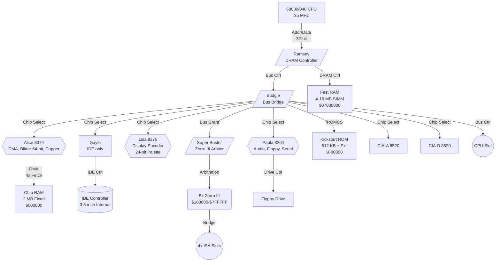

| Spec | Value |
|---|---|
| CPU | 68030 @ 25 MHz (A4000/030) or 68040 @ 25 MHz (A4000/040) |
| Chip RAM | 2 MB fixed |
| Fast RAM | 4 MB (030 model) or 16 MB (040 model) on SIMM slots |
| IDE | Gayle-based internal IDE; two 3.5" bays |
| Zorro III | 5 slots; same 32-bit bus as A3000 |
| Kickstart | 512 KB ROM; some models include 512 KB extended ROM for SCSI boot |
| Video | 23-pin RGB + monochrome; supports all AGA modes |

**A4000/040 note**: The 68040 integrates CPU, FPU, MMU, and dual 4 KB caches onto a single 1.2-million-transistor die — a remarkable achievement for 1990. But Motorola had to cut somewhere. By contrast, the separate **68882 external FPU** (available on the A3000 or A4000/030 via accelerator) implemented transcendental functions — `FSIN`, `FCOS`, `FTAN`, `FASIN`, `FACOS`, `FATAN`, `FSINH`, `FCOSH`, `FTANH`, `FLOG2`, `FLOG10`, `FLOGN`, `FETOX`, `FTWOTOX`, `FTENTOX`, plus `FMOD`/`FREM` — entirely in dedicated microcode ROM. The 68040 dropped the entire microcode ROM for these instructions to free silicon for the on-chip caches. Basic FPU operations (`FADD`, `FSUB`, `FMUL`, `FDIV`, `FSQRT`, `FMOVE`, `FCMP`) remain in hardware on both.

When the 68040 encounters a missing instruction, it raises a **Line-F exception** (vector `$2C`). The `68040.library` (which AmigaOS loads automatically at boot when `AttnFlags & AFF_68040`) installs a trap handler that catches these exceptions and **emulates the missing instructions in software** using the hardware FADD/FMUL primitives. This works transparently — applications using `FSIN()` never know it's emulated — but it is **10–100× slower** than the 68882's native microcode (~200 cycles hardware vs ~4,000 cycles emulated for FSIN). Code in performance-critical paths should use lookup tables or polynomial approximations rather than calling transcendental functions in tight loops.

> [!WARNING]
> `68040.library` is **not optional**. Without it, any FPU transcendental instruction causes an unhandled Line-F exception and an immediate Guru Meditation. The library must be present in `LIBS:` before any FPU-using software runs.

---

### A4000T (1994) — The Tower

The final Commodore Amiga. A tower-case variant of the A4000 with SCSI replacing IDE as the primary storage interface.

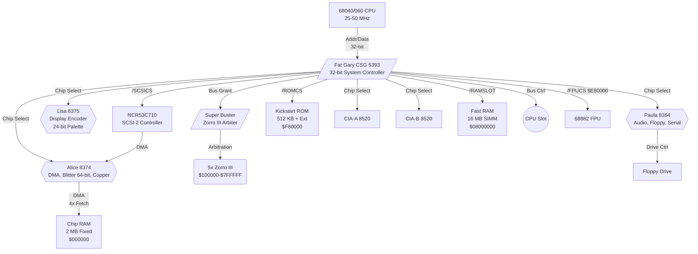

| Spec | Value |
|---|---|
| CPU | 68040 @ 25 MHz or 68060 @ 50 MHz (late production) |
| SCSI | NCR53C710 SCSI-2 controller; DMA-capable; internal + external |
| IDE | Not present as primary; some third-party tower conversions add IDE |
| Case | Full tower; 6× 5.25" + 3× 3.5" bays |
| Kickstart | 512 KB ROM + optional extended ROM for SCSI boot |

> **Developer note**: The 68060 revision of the A4000T is extremely rare. Most A4000T units are 68040-based. The 68060 requires `68060.library` for FPU emulation and cache management, similar to the 68040.

---

### CDTV (1991) — The Multimedia Pioneer

Commodore's CD-ROM-based multimedia console, based on A2000 hardware. It predates the CD32 and was aimed at the living room rather than the desktop.

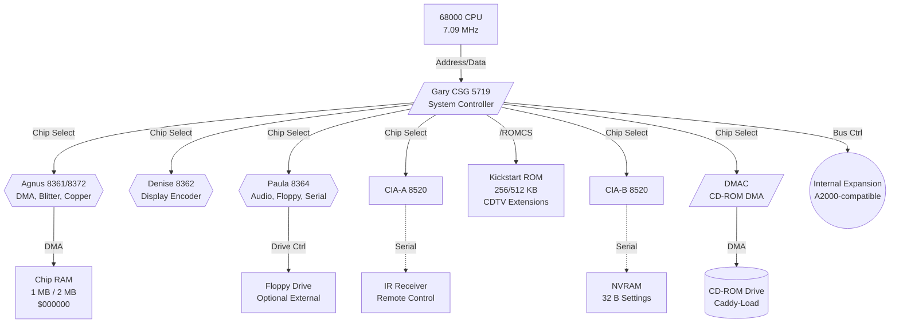

| Spec | Value |
|---|---|
| Chip RAM | 1 MB stock; 2 MB with Super Agnus mod |
| CD-ROM | Proprietary Commodore CD-ROM drive; caddy-loaded |
| NVRAM | 32 bytes battery-backed RAM for settings |
| IR | Infrared remote control; receiver on front panel |
| Kickstart | Modified Kickstart with CDTV extensions |
| Expansion | Internal A2000-compatible slots (memory, hard cards) |

---

### CD32 (1993) — The AGA Console

The world's first 32-bit game console. It is essentially an A1200 without a keyboard, with a CD-ROM drive, and the **Akiko** chip for chunky-to-planar conversion.

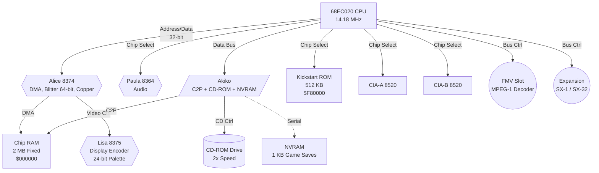

| Spec | Value |
|---|---|
| Chip RAM | 2 MB fixed |
| Akiko | Chunky-to-planar converter (C2P); accelerates 3D rendering by ~4× |
| CD-ROM | Double-speed; proprietary controller via Akiko |
| NVRAM | 1 KB battery-backed for game saves |
| Expansion | SX-1 or SX-32 add-on provides keyboard, floppy, IDE, and additional RAM |
| FMV | Full Motion Video cartridge port for MPEG-1 decoding |

> **Developer note**: The CD32's Akiko C2P is a hardware chunky-to-planar converter that transforms 8-bit indexed pixels into Amiga bitplane format. Games using this (e.g., *Doom*, *Gloom*) achieve playable frame rates impossible on a stock A1200 without Akiko. See [akiko_cd32.md](../01_hardware/aga_a1200_a4000/akiko_cd32.md) for programming details.

---

## CPU Feature Matrix

| CPU | Bus | Address | I-Cache | D-Cache | MMU | FPU | Models |
|---|---|---|---|---|---|---|---|
| 68000 | 16-bit | 24-bit | — | — | — | External 68881 | A1000, A500, A500+, A600, A2000, CDTV |
| 68EC020 | 32-bit | 32-bit | 256 B direct | — | — | — | A1200, CD32 |
| 68020 | 32-bit | 32-bit | 256 B direct | — | External 68851 | External 68881/2 | A1200 (accelerators) |
| 68030 | 32-bit | 32-bit | 256 B | 256 B | On-chip | External 68882 | A3000, A4000/030 |
| 68040 | 32-bit | 32-bit | 4 KB 4-way | 4 KB 4-way | On-chip | On-chip (partial) | A4000/040, A4000T |
| 68060 | 32-bit | 32-bit | 8 KB 4-way | 8 KB 4-way | On-chip | On-chip (partial) | A4000T (rare) |

> [!NOTE]
> 68040 and 68060 have on-chip FPUs that omit transcendental instructions. AmigaOS provides `68040.library` and `68060.library` to trap the missing opcodes via Line-F emulation. See [68040_68060_libraries.md](../15_fpu_mmu_cache/68040_68060_libraries.md).

---

## Kickstart ROM Evolution

| OS Version | ROM Size | Part | Models |
|---|---|---|---|
| 1.0 / 1.1 | 256 KB | WCS only | A1000 |
| 1.2 / 1.3 | 256 KB | Single | A500, A2000, CDTV |
| 2.04 | 512 KB | Single | A500+, A600, A3000 |
| 3.0 / 3.1 | 512 KB | Single | A1200, A4000, CD32 |
| 3.1 | 512 KB + 512 KB Ext | Pair | A4000 (with ext ROM for SCSI boot) |

---

## Chipset Detection at Runtime

Software can detect the chipset generation programmatically:

```c
#include <graphics/gfxbase.h>
#include <proto/graphics.h>

struct GfxBase *GfxBase;

void DetectChipset(void)
{
    GfxBase = (struct GfxBase *)OpenLibrary("graphics.library", 0);
    if (!GfxBase) return;

    ULONG chipRev = GfxBase->ChipRevBits;

    if (chipRev & GFXF_AA_ALICE)       /* AGA detected */
    {
        /* Alice + Lisa present: AGA features available */
    }
    else if (chipRev & GFXF_HR_DENISE) /* ECS detected */
    {
        /* ECS Denise present */
    }
    else
    {
        /* OCS only */
    }

    /* Chip RAM size via exec */
    ULONG chipTotal = AvailMem(MEMF_CHIP | MEMF_TOTAL);
    /* 256 KB, 512 KB, 1 MB, or 2 MB */

    CloseLibrary((struct Library *)GfxBase);
}
```

---

## Decision Guide: Which Model to Target?

| Target Market | Minimum Model | Recommended | Notes |
|---|---|---|---|
| **Maximum compatibility** | A500 (OCS, 512 KB) | A500 + 1 MB Chip | Runs on every Amiga ever made |
| **ECS features** | A500+ / A600 | A600 | 1 MB Chip, productivity modes |
| **AGA required** | A1200 | A1200 + Fast RAM | 2 MB Chip is baseline for AGA |
| **Professional/desktop** | A3000 | A4000 | Zorro III, SCSI, big box |
| **Console/CD-only** | CD32 | CD32 | Akiko C2P, no keyboard |

---

## Historical Context & Competitive Landscape

### 1985: The A1000 vs. Its Rivals

| Platform | CPU | RAM | Custom Chips | Multitasking | Price (1985) |
|---|---|---|---|---|---|
| **Amiga 1000** | 68000 @ 7 MHz | 256 KB | OCS (Agnus/Denise/Paula) | Preemptive (Exec) | $1,295 |
| **Atari ST** | 68000 @ 8 MHz | 512 KB | None (Shifter = simple shift register) | Cooperative (TOS) | $799 |
| **Macintosh** | 68000 @ 7.8 MHz | 128 KB | None | Cooperative | $2,495 |
| **IBM PC/AT** | 80286 @ 6 MHz | 256 KB | None (ISA bus) | None (MS-DOS) | $3,995 |

The A1000's custom chipset was unprecedented. No competitor offered hardware sprites, DMA audio, blitter graphics, and a copper coprocessor in a single integrated design. The trade-off was complexity — developers had to learn the custom chips to extract performance.

### 1992: The AGA Generation

By 1992, the market had shifted:

| Platform | CPU | RAM | Graphics | Audio | Price |
|---|---|---|---|---|---|
| **Amiga A1200** | 68EC020 @ 14 MHz | 2 MB | AGA (24-bit, HAM8) | 4ch DMA | $399 |
| **PC (VGA)** | 386SX @ 25 MHz | 4 MB | VGA 256-color | Sound Blaster 8-bit | $1,200+ |
| **Mac LC III** | 68030 @ 25 MHz | 4 MB | 512×384 16-bit | 8-bit mono | $1,349 |
| **Atari Falcon** | 68030 @ 16 MHz | 1 MB | VIDEL (16-bit) | DSP 16-bit | $799 |

The A1200 was aggressively priced but underpowered for its era. The 68EC020 at 14 MHz struggled against 386DX and 68030 systems. AGA added color depth but not raw fill-rate — the blitter remained fundamentally an OCS-era design. The CD32 console failed to find a market against the SNES and Mega Drive, which were cheaper and had larger game libraries.

---

## Modern Analogies

| Amiga Model | Modern Equivalent | Shared Concept |
|---|---|---|
| **A1000** | Original Macintosh 128K | Groundbreaking but under-RAM'd; required expansion to be practical |
| **A500** | Commodore 64 / NES | The "people's computer" — sold on price, expanded endlessly by users |
| **A2000** | IBM PC/AT with ISA slots | Big-box expandability; professional positioning |
| **A3000** | SGI Indy / NeXTStation | Professional workstation with UNIX aspirations |
| **A1200** | PlayStation 1 / 3DO | Cutting-edge for its price class, but underpowered vs. PC |
| **CD32** | 3DO / Philips CD-i | Early CD-ROM console; failed due to software library, not hardware |
| **A4000T** | Sun Ultra 1 | Rare, expensive, professional tower; end of the line |

---

## Best Practices

1. **Target A500 (OCS, 512 KB) for maximum reach** — every Amiga can run A500 software.
2. **Detect AGA at runtime** — never assume; check `GfxBase->ChipRevBits`.
3. **Probe Chip RAM size** — use `AvailMem(MEMF_CHIP | MEMF_TOTAL)` rather than hardcoding.
4. **Account for missing MMU/FPU** — 68EC020 has neither; 68040 FPU is incomplete.
5. **Test on real hardware** — emulation is accurate but timing-sensitive code (Copper, Blitter) behaves differently on real chips.
6. **Document minimum requirements** — "Requires 1 MB Chip" or "AGA only" prevents user frustration.
7. **Respect expansion slot differences** — A500 trapdoor ≠ A1200 trapdoor ≠ A600 trapdoor.

---

## Pitfalls

### 1. Assuming All A1200s Have Fast RAM

The A1200 sold with 2 MB Chip RAM and no Fast RAM. Software that allocates large buffers with `MEMF_ANY` may exhaust Chip RAM on a stock A1200 even though the machine has 2 MB. Always check `AvailMem()` before large allocations.

### 2. The A600 PCMCIA Trap

PCMCIA memory on the A600/A1200 maps to `$600000`. Some accelerators also map Fast RAM to this region, causing a conflict that disables PCMCIA. If your software detects PCMCIA Fast RAM, warn the user about potential accelerator conflicts.

### 3. A4000/040 vs A4000/030 Differences

The A4000/040 has a 68040 with on-board FPU and MMU; the A4000/030 has a 68030 with external FPU optional. Software using FPU instructions will crash on a 030 unless it checks for FPU presence via `execbase->AttnFlags & AFF_68040`.

### 4. CD32 Without Akiko

Some third-party CD32 clones and emulators omit Akiko. Games that rely solely on Akiko C2P will fail. Always provide a software fallback path for C2P operations.

---

## References

- NDK 3.9: `graphics/gfxbase.h` — `ChipRevBits` definitions
- ADCD 2.1 Hardware Manual: http://amigadev.elowar.com/read/ADCD_2.1/Hardware_Manual_guide/node0000.html
- Commodore *A1200 Technical Reference Manual*
- Commodore *A4000 Technical Reference Manual*
- Commodore *A3000 Technical Reference Manual*
- See also: [memory_types.md](../01_hardware/common/memory_types.md) — Chip RAM, Fast RAM, Slow RAM architecture
- See also: [address_space.md](../01_hardware/common/address_space.md) — Full 24-bit/32-bit memory maps
- See also: [chipset_ocs.md](../01_hardware/ocs_a500/chipset_ocs.md) — OCS custom chip details
- See also: [chipset_ecs.md](../01_hardware/ecs_a600_a3000/chipset_ecs.md) — ECS custom chip details
- See also: [chipset_aga.md](../01_hardware/aga_a1200_a4000/chipset_aga.md) — AGA custom chip details
- See also: [akiko_cd32.md](../01_hardware/aga_a1200_a4000/akiko_cd32.md) — CD32 Akiko C2P programming
- See also: [zorro_bus.md](../01_hardware/common/zorro_bus.md) — Zorro II/III expansion bus
- See also: [68040_68060_libraries.md](../15_fpu_mmu_cache/68040_68060_libraries.md) — FPU/MMU emulation on 040/060
