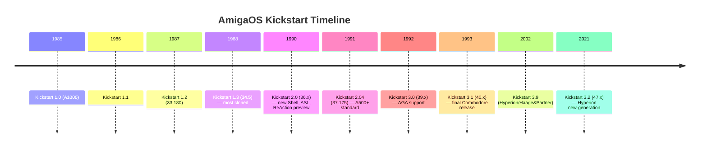

[← Home](../README.md) · [Overview](README.md)

# Amiga History & Chipset Generations

## Origins (1982–1985)

The Amiga was designed by Jay Miner's team at Amiga Corporation (originally Hi-Toro), beginning in 1982 under the codename **Lorraine**. The primary design goal was a low-cost personal computer with dedicated custom silicon handling graphics, audio, and DMA — freeing the CPU for application code. Commodore Business Machines acquired Amiga Corporation in 1984, incorporating the technology into what would ship as the **Commodore Amiga 1000** in July 1985.

The core insight was the **coprocessor paradigm**: three custom chips (Agnus, Denise, Paula) operate concurrently with the M68000, driven by a shared DMA bus arbitrated by Agnus. This allowed the Amiga to demonstrate colour animation, digitised speech, and multitasking simultaneously — capabilities competitors would not match for years.

---

## Chipset Generations

### OCS — Original Chip Set (1985–1990)

| Component | Part Numbers | Role |
|---|---|---|
| **Agnus** | MOS 8361 (PAL), 8367 (NTSC) | DMA controller, Copper, Blitter, address gen |
| **Denise** | MOS 8362 | Display: sprites, bitplanes, colour decode |
| **Paula** | MOS 8364 | Audio DMA (4 channels), disk I/O, serial I/O |

Key characteristics:
- **1 MB Chip RAM** maximum (512 KB in early A1000/A500 configs)
- 6 bitplanes → 64 colours (EHB mode) or 4096 (HAM)
- 8 hardware sprites (16px wide, 2bpp)
- Copper coprocessor: 2 registers, WAIT/SKIP/MOVE instructions
- Blitter: 3 source channels + destination, minterm logic, line mode

Machines using OCS:
- A1000 (1985) — first production Amiga
- A500 (1987) — high-volume consumer model
- A2000 (1987) — big-box, Zorro II expansion

---

### ECS — Enhanced Chip Set (1990–1992)

| Component | Part Numbers | Role |
|---|---|---|
| **Super Agnus** | MOS 8372A | Agnus + 2 MB chip RAM addressing, BEAMCON0 |
| **ECS Denise** | MOS 8373 | Denise + productivity modes, BPLCON3 |
| **Paula** | MOS 8364 (unchanged) | Same as OCS |

Key enhancements over OCS:
- **2 MB Chip RAM** with Super Agnus (1 MB or 2 MB Agnus variants exist)
- Productivity/multiscan display modes (VGA-compatible timing)
- `BEAMCON0` register for programmable sync signals
- `BPLCON3` for border blank, sprite control extensions
- Super Agnus: larger copper/bitplane DMA window
- Gary chip on A3000: bus controller, DMA, auto-config
- **Gayle** chip on A600: IDE, PCMCIA interface, interrupt routing

Machines using ECS:
- A3000 (1990) — 68030, SCSI, ECS, Zorro III
- A500+ (1991) — enhanced A500, 1 MB chip, ECS
- A600 (1992) — compact, IDE disk, PCMCIA, Gayle

---

### AGA — Advanced Graphics Architecture (1992–1996)

| Component | Part Numbers | Role |
|---|---|---|
| **Alice** | MOS 8374 | Super Agnus successor: 64-bit bus, FMODE |
| **Lisa** | — | Denise successor: 8-bit palettes, chunky assist |
| **Paula** | MOS 8364 (unchanged) | Same as OCS/ECS |

Key enhancements over ECS:
- **32-bit colour registers**: 24-bit palette (256 colours, HAM8)
- **256 colour registers** (COLOR00–COLOR255)
- HAM8 mode: 262,144 simultaneous colours
- **64-bit blitter bus** via `FMODE` register (1x/2x/4x word transfers)
- **BPLCON3 / BPLCON4**: sprite palette bank, bitplane bank select
- **DIWHIGH**: extended display window for overscan
- `FMODE`: configures DMA fetch width for blitter and bitplanes
- **68030/040** CPUs with MMU and FPU
- **Gayle** chip on A1200: IDE + PCMCIA (different pinout from A600)
- **Ramsey** chip on A4000: 32-bit SIMM controller

Machines using AGA:
- A1200 (1992) — budget AGA: 68020, Gayle, PCMCIA
- A4000 (1992) — premium AGA: 68030/040, IDE, Zorro III
- A4000T (1994) — tower, SCSI, Zorro III
- CD32 (1993) — game console, AGA, CD-ROM

---

## AmigaOS Version Timeline

---

## Key References

- **ADCD 2.1** — Amiga Developer CD, version 2.1 (OS 3.5 era): http://amigadev.elowar.com/read/ADCD_2.1/
- **Hardware Reference Manual** (3rd ed.): `Hardware_Manual_guide/` on ADCD
- **AmigaMail Vol. 2**: `AmigaMail_Vol2_guide/` on ADCD — developer newsletter with deep hardware/OS articles
- Haynie, Dave — *Amiga Hardware Reference Manual* (Addison-Wesley, 1991, ISBN 0-201-56776-8)
- Dewar, R. & Smosna, M. — *The Amiga User Interface Style Guide* (Addison-Wesley, 1992)
