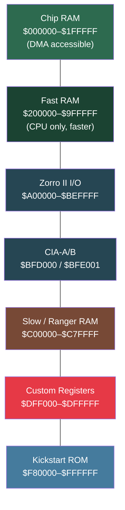

[← Home](../../README.md) · [Hardware](../README.md)

# Amiga Address Space

## Overview

The Amiga uses a **24-bit physical address bus** on OCS/ECS machines (68000/68020 effective), giving 16 MB of addressable space.

AGA machines with 68030/040/060 and 32-bit-clean software can address the full 4 GB, but Chip RAM and custom registers remain in the lower 16 MB.

## Memory Map — 24-bit (OCS/ECS: A1000, A500, A500+, A2000, A600, A3000, CDTV)

| Address Range | Size | Region |
|---|---|---|
| `$000000`–`$1FFFFF` | 2 MB max | Chip RAM (512 KB on OCS A500, 1–2 MB on ECS) |
| `$200000`–`$9FFFFF` | 8 MB | Fast RAM (Zorro II autoconfig expansion) |
| `$A00000`–`$BEFFFF` | ~2 MB | Zorro II I/O space |
| `$BFD000`–`$BFDFFF` | 4 KB | CIA-B (8520 — keyboard, floppy motor, disk side select) |
| `$BFE001`–`$BFE1FF` | 512 B | CIA-A (8520 — parallel port, serial flags, timers) |
| `$C00000`–`$C7FFFF` | 512 KB | Slow RAM ("Ranger" — on Chip bus, not DMA-visible) |
| `$C80000`–`$CFFFFF` | 512 KB | Zorro II expansion I/O (boards) |
| `$D00000`–`$D7FFFF` | 512 KB | Zorro II expansion I/O |
| `$D80000`–`$DBFFFF` | 256 KB | Reserved / board-specific |
| `$DC0000`–`$DCFFFF` | 64 KB | Real-Time Clock (MSM6242B / RF5C01A) |
| `$DD0000`–`$DEFFFF` | 128 KB | Reserved |
| `$DF0000`–`$DFFFFF` | 64 KB | Custom chip registers (`$DFF000`–`$DFF1FE`) |
| `$E00000`–`$E7FFFF` | 512 KB | Kick memory (WCS / Ranger slow RAM mirror) |
| `$E80000`–`$EFFFFF` | 512 KB | Autoconfig space (Zorro II probe) |
| `$F00000`–`$F7FFFF` | 512 KB | Extended Kickstart ROM (OS 3.1: second 256 KB) |
| `$F80000`–`$FFFFFF` | 512 KB | Kickstart ROM (primary, mirrored at top of 16 MB) |

## Memory Map — 32-bit (AGA: A1200, A4000, CD32)

| Address Range | Size | Region |
|---|---|---|
| `$000000`–`$1FFFFF` | 2 MB | Chip RAM |
| `$200000`–`$07FFFFFF` | up to 126 MB | Fast RAM (on-board via Ramsey on A4000; trapdoor/PCMCIA on A1200) |
| `$A00000`–`$BEFFFF` | ~2 MB | Zorro II I/O |
| `$BFD000` | — | CIA-B |
| `$BFE001` | — | CIA-A |
| `$C00000`–`$CFFFFF` | 1 MB | Slow RAM / board I/O |
| `$D80000`–`$D8FFFF` | 64 KB | IDE / Gayle (A1200/A4000) |
| `$DA0000`–`$DA3FFF` | 16 KB | PCMCIA attribute memory (A1200) |
| `$DC0000` | — | Real-Time Clock |
| `$DFF000`–`$DFFFFF` | 64 KB | Custom chip registers |
| `$E00000`–`$E7FFFF` | 512 KB | Kick mirror / WCS |
| `$F00000`–`$F7FFFF` | 512 KB | Extended Kickstart ROM |
| `$F80000`–`$FFFFFF` | 512 KB | Kickstart ROM |
| `$01000000`+ | up to 1.75 GB | Zorro III expansion (32-bit, A3000/A4000 only) |

## Per-Model Address Space Variations

The maps above show the common layout. Several models have unique regions:

### A1000 — Writable Control Store (WCS)

| Address Range | Size | Region |
|---|---|---|
| `$F80000`–`$FFFFFF` | 512 KB | **WCS RAM** — Kickstart is loaded from floppy into this RAM at boot (A1000 has no ROM-based Kickstart) |
| `$FC0000`–`$FFFFFF` | 256 KB | Bootstrap ROM (256-byte boot loader that loads Kickstart into WCS) |

The A1000 is the only model where Kickstart lives in **RAM**, not ROM. If power is lost, Kickstart must be reloaded from the Kickstart floppy. The WCS is write-protected after loading via a hardware latch.

### A2000 — Zorro II Bus and CPU Slot

| Address Range | Size | Region |
|---|---|---|
| `$200000`–`$9FFFFF` | 8 MB | Zorro II Fast RAM (5 expansion slots, autoconfig) |
| `$E80000`–`$EFFFFF` | 512 KB | Autoconfig space — probed at boot for each Zorro II card |
| CPU slot | — | Directly wired 68000 socket — accepts accelerators (GVP G-Force, A2630) |

The A2000 is the canonical "big-box" expandable Amiga. Its 5 Zorro II slots provide 8 MB of Fast RAM address space. Some later A2000 revisions (rev 6+) support Super Agnus for 2 MB Chip RAM.

### CDTV — CD-ROM Controller and NVRAM

| Address Range | Size | Region |
|---|---|---|
| `$000000`–`$0FFFFF` | 1 MB | Chip RAM (stock, expandable to 2 MB with Super Agnus mod) |
| `$E00000`–`$E3FFFF` | 256 KB | CDTV Extended ROM (CD filesystem, player software, DMAC) |
| `$E40000`–`$E7FFFF` | 256 KB | CDTV Extended ROM (second bank) |
| `$DC0000`–`$DC003F` | 64 B | Real-Time Clock (Oki MSM6242B) |
| `$E90000`–`$E9FFFF` | 64 KB | DMAC (WD33C93 SCSI DMA controller for CD-ROM) |
| `$F00000`–`$F3FFFF` | 256 KB | CDTV **NVRAM** (battery-backed, stores bookmarks and saves) |

The CDTV is essentially an A500 with a CD-ROM drive, IR remote, and NVRAM in a consumer set-top box form factor. It uses the OCS chipset (original Agnus) with 1 MB Chip RAM. The DMAC at `$E90000` handles DMA transfers between the CD-ROM's SCSI interface and memory.

### CD32 — Akiko Chip and Flash ROM

| Address Range | Size | Region |
|---|---|---|
| `$000000`–`$1FFFFF` | 2 MB | Chip RAM (fixed) |
| `$B80000`–`$B8FFFF` | 64 KB | **Akiko** custom chip (chunky-to-planar conversion, CD-ROM controller, NVRAM interface) |
| `$DC0000`–`$DC003F` | 64 B | Real-Time Clock |
| `$DFF000`–`$DFFFFF` | 64 KB | Custom chip registers (AGA — Alice/Lisa) |
| `$E00000`–`$E7FFFF` | 512 KB | CD32 Extended ROM (CD filesystem, boot, CDDA player) |
| `$F00000`–`$F7FFFF` | 512 KB | CD32 flash ROM (firmware, SysInfo) |
| `$F80000`–`$FFFFFF` | 512 KB | Kickstart 3.1 ROM |

The CD32's unique feature is the **Akiko** chip at `$B80000`, which provides:
- **Chunky-to-Planar (C2P) conversion**: a hardware DMA engine that converts linear 8-bit pixel arrays to planar bitplane format — the single most sought-after feature for game ports
- **CD-ROM controller**: handles the double-speed CD drive directly
- **NVRAM interface**: 1 KB battery-backed storage for game saves

> [!NOTE]
> The CD32 has no Zorro slots, no CPU slot, no trapdoor connector, and no PCMCIA port. The only expansion path is the (rare) FMV module slot or the SX-1/SX-32 expansion unit that adds a keyboard port, IDE, and PCMCIA.

## Memory Type Classification

AmigaOS classifies memory by access flags used in `AllocMem()`:

| MEMF Flag | Value | Description |
|---|---|---|
| `MEMF_ANY` | 0 | No constraint |
| `MEMF_PUBLIC` | 1<<0 | Accessible to all tasks and DMA |
| `MEMF_CHIP` | 1<<1 | Chip RAM — accessible to custom chips (DMA) |
| `MEMF_FAST` | 1<<2 | Fast RAM — CPU-only, no DMA, faster |
| `MEMF_LOCAL` | 1<<8 | Not mapped out (always present) |
| `MEMF_24BITDMA` | 1<<9 | Addressable within 24-bit space |
| `MEMF_CLEAR` | 1<<16 | Zero-fill before returning |
| `MEMF_REVERSE` | 1<<17 | Allocate from top of memory |
| `MEMF_LARGEST` | 1<<18 | Return size of largest free block |
| `MEMF_TOTAL` | 1<<19 | Return total memory of type |

### Chip RAM Requirement

Custom chip DMA can only access **Chip RAM** (`MEMF_CHIP`). This means:
- Graphics bitmaps rendered by Blitter/Copper must be in Chip RAM
- Audio sample data must be in Chip RAM
- Copper lists must be in Chip RAM
- Sprite data must be in Chip RAM

Fast RAM is **CPU-only** — generally used for code, non-DMA data structures, and stacks.

## Diagram

## Key Chip RAM Addresses

| Address | Content |
|---|---|
| $000000–$000400 | Exception vector table (copied from ROM) |
| $000004 | `SysBase` pointer (exec library base) |
| $000100 | Copper list scratch area (boot) |
| $000400–$001000 | Reserved by OS |
| $001000+ | Free Chip RAM (AvailMem result) |

> [!WARNING]
> Writing to $000000–$000400 corrupts the exception table. Writing to $000004 corrupts `SysBase`. These addresses must never be allocated by user code; exec reserves them.

## References

- NDK39: `exec/memory.h` — MEMF_ flag definitions
- ADCD 2.1 Hardware Manual: memory map chapter
- Commodore A1200/A4000 Technical Reference Manuals (local archive)
- See also: [memory_types.md](memory_types.md) — Chip RAM vs Fast RAM vs Slow RAM, DMA accessibility, per-model configurations
- See also: [chip_ram_expansion.md](../ecs_a600_a3000/chip_ram_expansion.md) — 2 MB Chip RAM with Super Agnus
- See also: [bus_architecture.md](bus_architecture.md) — Bus mechanics, register access patterns, cross-domain transfers
