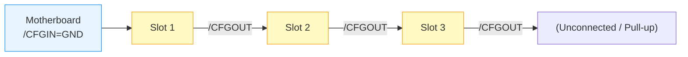
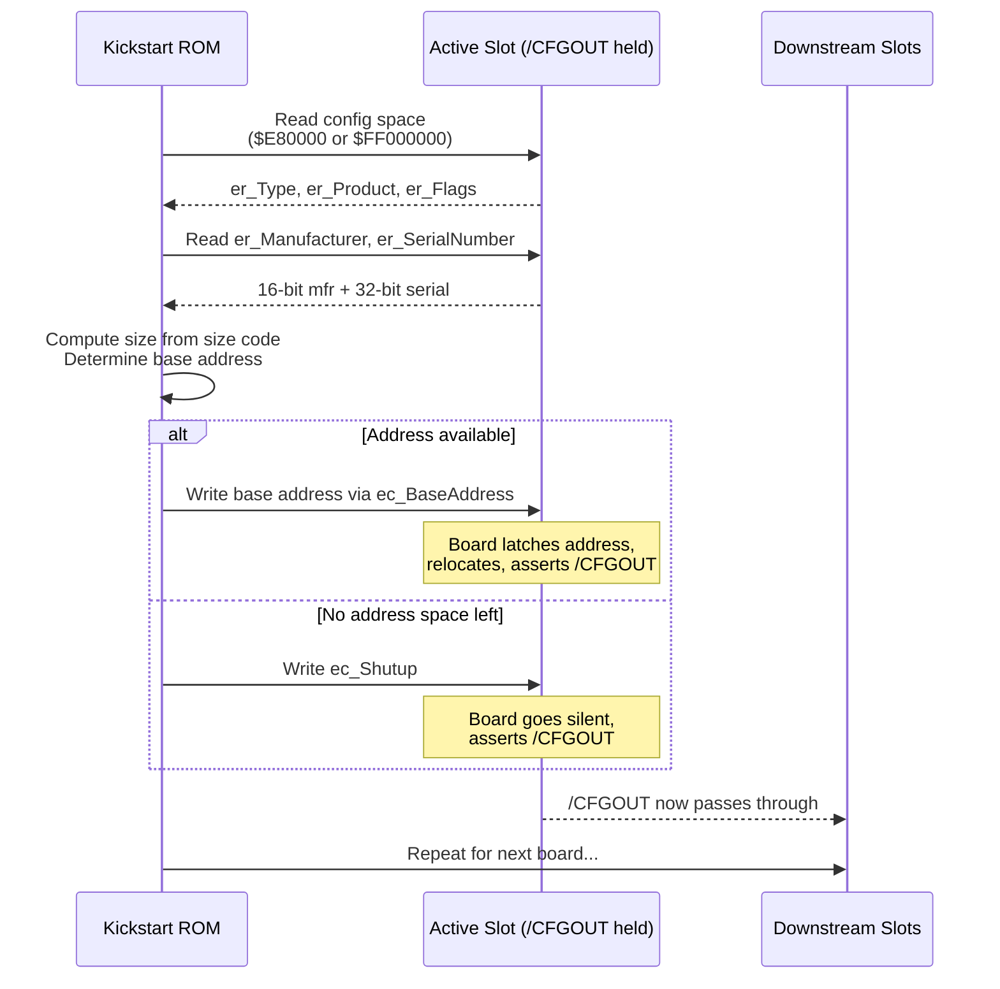

[← Home](../../README.md) · [Hardware](../README.md)

# AutoConfig Protocol — Zorro Expansion Discovery & Configuration

## Overview

In 1985, installing an expansion card meant reading a manual, setting DIP switches, and praying you didn't pick an address that collided with something else. The Amiga eliminated all of that with **AutoConfig** — a hardware-level plug-and-play protocol that let the OS discover, size, and map expansion boards without a single jumper. It predated PCI's configuration space by nearly a decade, and it worked with nothing more than a few daisy-chained logic signals and a 256-byte ROM on each card.

AutoConfig runs during early boot, before DOS exists. The Kickstart ROM walks the **CFGIN/CFGOUT** chain, reads each board's identity from a fixed configuration address, assigns it a base address in the Amiga memory map, and tells the board to relocate. Once configured, a board stops responding at the configuration address and appears at its assigned location. The entire process is deterministic, requires no user intervention, and is one of the reasons the Amiga expansion ecosystem remained compatible across three chipset generations.

See [Zorro Bus](zorro_bus.md) for electrical bus specifications and [expansion.library](../../11_libraries/expansion.md) for the software API that queries configured boards at runtime.

---

## Architecture / How It Works

### The CFGIN/CFGOUT Daisy Chain

AutoConfig relies on two active-low signals — **/CFGIN** and **/CFGOUT** — routed sequentially through every Zorro slot. Unlike the data and address buses which run in parallel to all slots, the configuration signals form a strict physical daisy chain. The chain starts at the motherboard and passes through each slot sequentially.



The protocol depends on a rigid behavioral contract from the expansion boards:
1. **Sleep Mode:** If `/CFGIN` is not asserted, the board is entirely "invisible". It does not decode addresses and completely ignores the configuration space. This prevents bus collisions from multiple boards.
2. **Awake Mode:** When `/CFGIN` is asserted, the board wakes up and responds **only** at the configuration address (`$E80000` or `$FF000000`).
3. **Configured Mode:** Once the OS writes the final nibble of the assigned base address (or writes to `ec_Shutup`), the board stops responding at the configuration address, moves to its new assigned location, and asserts its `/CFGOUT` signal.
4. **Next Board:** The asserted `/CFGOUT` feeds into the `/CFGIN` of the next slot, waking up the next board in the chain.

### Corner Cases: Empty Slots, Risers, and Broken Hardware

**1. The "Empty Slot" Problem:**
In pure theory, an empty slot would break the daisy chain because the signal wouldn't pass from `/CFGIN` to `/CFGOUT`. However, official Commodore motherboards (A2000, A3000, A4000) implement a hardware bypass. They route these signals through specific pins and use pull-ups or pass-through logic (sometimes utilizing the `/SLAVEN` signal or motherboard-level pull-ups). As a result, an empty slot acts transparently, passing the `/CFGIN` signal downstream automatically. You do *not* strictly need to populate slots sequentially on official hardware.

**2. Third-Party Backplanes and Risers:**
Unlike official hardware, some third-party backplanes, busboards (like early tower conversion kits), and Zorro risers did not faithfully recreate this bypass logic. On these systems, an empty slot physically severs the `/CFGIN` to `/CFGOUT` path. In such environments, **cards must be installed sequentially without skipping slots**, starting from the slot nearest the source of the chain, to ensure AutoConfig enumerates all devices.

**3. The "Broken CFGOUT" Hardware Bug:**
A notorious issue in the Amiga hardware ecosystem is expansion cards with faulty PAL/GAL logic or buggy firmware that fail to properly assert `/CFGOUT` after being configured. Even on an official motherboard with perfect slot-bypass logic, a card with a broken `/CFGOUT` will permanently halt the chain, rendering all downstream boards invisible to the OS.
> [!TIP]
> **Workaround:** If you have multiple boards and suspect one is terminating the chain prematurely, **place the suspected broken card in the very last physical slot of the chain**. Because it is the last board, it doesn't matter if it fails to assert `/CFGOUT`, and all properly functioning boards upstream will configure successfully.

### Configuration Address Spaces

Before a board is configured, it responds at a special "configuration" address. After configuration, it relocates to its assigned base address and stops responding at the config address.

| Bus | Config Address | Accessible Region | Notes |
|---|---|---|---|
| **Zorro II** | `$E80000` | `$E80000–$E8007F` | 128 bytes; even addresses only |
| **Zorro III** | `$FF000000` | `$FF000000–$FF0000FF` | 256 bytes; 32-bit wide |

> [!NOTE]
> Zorro II AutoConfig reads use **only even addresses** (`$E80000`, `$E80002`, ...). The hardware ignores odd-byte access. Zorro III uses full 32-bit access at `$FF000000`.

### The Four-Phase Configuration Sequence



**Phase 1 — Discovery:** The OS reads `er_Type`, `er_Product`, and `er_Flags` from the configuration address. This tells it the bus type (Zorro II or III), whether the board is RAM or I/O, and whether a DiagArea ROM exists.

**Phase 2 — Identification:** The OS reads `er_Manufacturer` (16-bit) and `er_SerialNumber` (32-bit) to uniquely identify the board.

**Phase 3 — Sizing & Assignment:** The lower nibble of `er_Type` encodes the board size. The OS computes the required address space and calls `AllocAbs()` or `ConfigBoard()` to reserve a non-overlapping region.

**Phase 4 — Latch & Relocate (or Shut-Up):** If an address is available, the OS writes the assigned base address back into the configuration space. The board latches it, removes itself from the config address, and releases `/CFGOUT` so the next board in the chain can be configured. If no contiguous region of the required size remains, the OS writes to `ec_Shutup` instead — the board goes permanently silent and the chain advances.

---

## Data Structures & Register Tables

### The Nibble-Pair Format & Logical Inversion

The configuration data is logically simple, but its physical presentation on the bus is deeply tied to retro hardware constraints. To keep expansion boards cheap (allowing the use of standard 4-bit PROMs or basic diode/resistor arrays), the 16 bytes of logical configuration data are spread across 64 bytes of physical address space.

- **Nibble Access:** Each logical byte is constructed from two separate read cycles. The hardware only presents data on the upper four data lines (`D7–D4`). The software must read the high nibble at a physical `offset`, read the low nibble at `offset + 2`, and merge them:
  ```c
  /* Reading a single logical byte from physical config space */
  UBYTE high_nibble = *(volatile UBYTE *)(config_base + offset);
  UBYTE low_nibble  = *(volatile UBYTE *)(config_base + offset + 2);
  UBYTE byte_val    = (high_nibble & 0xF0) | ((low_nibble >> 4) & 0x0F);
  ```

- **The Inversion Sanity Check:** With the exception of the very first byte (`er_Type`), all fields in the configuration ROM are stored **logically inverted** (XOR `$FF`). If the expansion slot is completely empty, the open bus floats high, causing a read to return `$FF`. By inverting this, the OS reads `$00`. Since an inverted `$00` in the size field signifies "no more boards", the OS instantly knows the chain has ended. This clever design prevents bus noise from being interpreted as a ghost board.

### ExpansionRom Logical Layout

The `struct ExpansionRom` represents the unpacked, logical data after Kickstart has read the nibbles and inverted the values. 

| Logical Offset | Name | Width | Description |
|---|---|---|---|
| `$00` | `er_Type` | Byte | Board type, size code, flags (Only field NOT inverted in ROM) |
| `$01` | `er_Product` | Byte | Product number (0–255) |
| `$02` | `er_Flags` | Byte | Memory/shutup/chain flags |
| `$03` | `er_Reserved03` | Byte | Reserved |
| `$04` | `er_Manufacturer` | Word | Manufacturer ID (16-bit, big-endian) |
| `$06` | `er_SerialNumber` | Long | 32-bit serial number |
| `$0A` | `er_InitDiagVec` | Word | Offset to DiagArea (if valid) |
| `$0C` | `er_Reserved0c` | Long | Reserved |
| `$10` | `er_Reserved10` | Long | Reserved |

*(Note: Physical registers like `ec_BaseAddress` and `ec_Shutup` exist in the `$40–$4F` physical offset range, written as nibbles by the OS during configuration, and are not part of the read-only logical structure.)*

### Physical-to-Logical Address Map (Zorro II)

For reference, the full mapping from physical even-byte offsets in the `$E80000` window to logical `ExpansionRom` fields:

| Physical Offset(s) | Nibble | Logical Field |
|---|---|---|
| `$00`, `$02` | High, Low | `er_Type` (NOT inverted) |
| `$04`, `$06` | High, Low | `er_Product` (inverted) |
| `$08`, `$0A` | High, Low | `er_Flags` (inverted) |
| `$0C`, `$0E` | High, Low | `er_Reserved03` (inverted) |
| `$10`, `$12` | High, Low | `er_Manufacturer` high byte (inverted) |
| `$14`, `$16` | High, Low | `er_Manufacturer` low byte (inverted) |
| `$18`, `$1A` | High, Low | `er_SerialNumber` byte 3 (inverted) |
| `$1C`, `$1E` | High, Low | `er_SerialNumber` byte 2 (inverted) |
| `$20`, `$22` | High, Low | `er_SerialNumber` byte 1 (inverted) |
| `$24`, `$26` | High, Low | `er_SerialNumber` byte 0 (inverted) |
| `$28`, `$2A` | High, Low | `er_InitDiagVec` high byte (inverted) |
| `$2C`, `$2E` | High, Low | `er_InitDiagVec` low byte (inverted) |
| `$40`–`$4E` | — | **Write-only:** `ec_BaseAddress` (written by OS) |
| `$4C` | — | **Write-only:** `ec_Shutup` (silences board) |

```c
/* libraries/configregs.h — NDK39 */
struct ExpansionRom {
    UBYTE  er_Type;          /* board type + size code */
    UBYTE  er_Product;       /* product number (0-255) */
    UBYTE  er_Flags;         /* capability flags */
    UBYTE  er_Reserved03;    /* must be zero */
    UWORD  er_Manufacturer;  /* manufacturer ID (16-bit, big-endian) */
    ULONG  er_SerialNumber;  /* unique serial number */
    UWORD  er_InitDiagVec;   /* offset to DiagArea boot ROM */
    APTR   er_Reserved0c;    /* reserved */
    APTR   er_Reserved10;    /* reserved */
};
```

### er_Type Bit Encoding

| Bits | Field | Values |
|---|---|---|
| `7:6` | Bus type | `11` = Zorro II, `10` = Zorro III, `01` = reserved, `00` = reserved |
| `5` | Memory flag | `1` = board is RAM (add to free mem list if bit set in er_Flags), `0` = I/O board |
| `4` | Chain bit | `1` = another board follows in this slot (chained config), `0` = last board |
| `3:0` | Size code | See size code table below |

### Size Code Table

The lower nibble of `er_Type` encodes the board size. The same code means different things on Zorro II vs Zorro III.

| Code | Zorro II Size | Zorro III Size |
|---|---|---|
| `$0` | 8 MB | 16 MB |
| `$1` | 64 KB | 32 MB |
| `$2` | 128 KB | 64 MB |
| `$3` | 256 KB | 128 MB |
| `$4` | 512 KB | 256 MB |
| `$5` | 1 MB | 512 MB |
| `$6` | 2 MB | 1 GB |
| `$7` | 4 MB | — |
| `$8-$F` | Reserved / extended | Reserved / extended |

### er_Flags Bit Encoding

| Bit | Name | Description |
|---|---|---|
| `7` | `ERFB_SHUTUP` | Board supports "shut up" — can be disabled and mapped out |
| `6` | Reserved | Must be zero |
| `5` | `ERFB_MEMLIST` | If set, board memory is added to the system free memory list |
| `4` | `ERFB_DIAGVALID` | `er_InitDiagVec` points to a valid DiagArea structure |
| `3` | `ERFB_CHAINEDCONFIG` | More boards to configure in this slot (chained) |
| `2:0` | Reserved | Must be zero |

---

## The Software Boot Sequence: expansion.library

While the hardware daisy-chain dictates *how* boards respond, the actual enumeration is driven entirely by software during the earliest stages of the AmigaOS boot process. This is the responsibility of `expansion.library`, which is initialized by `exec.library` as one of the very first resident modules.

### Boot Sequence Position

AutoConfig does not run "whenever" — its position in the Kickstart init sequence is fixed and critical:

```
1. CPU Reset → Kickstart ROM entry point
2. exec.library initializes (memory lists, interrupts, task scheduler)
3. Resident module scan — expansion.library is initialized (priority 110)
4. expansion.library runs ConfigChain() → enumerates all Zorro boards
5. DiagArea boot ROMs execute (SCSI controllers install device handlers here)
6. dos.library initializes, mounts DOS devices
7. Boot from highest-priority bootable device
```

> [!NOTE]
> Because AutoConfig runs *before* DOS, drivers that need to be present at boot time (SCSI, network boot) must use the DiagArea mechanism — they cannot be loaded from disk. See [DiagArea](#diagarea--boot-roms) below.

### Enumeration Loop

When the `expansion` module initializes, it executes a tight loop probing the configuration spaces (`$E80000` for Zorro II, `$FF000000` for Zorro III). Because the system doesn't know how many boards exist, it relies on a purely reactive polling loop:

```c
void ConfigChain(APTR config_base, APTR memory_pool) {
    while (TRUE) {
        /* Read physical $00 and $02, merge to get er_Type */
        UBYTE er_Type = ReadExpansionRom(config_base, 0x00);
        
        /* If bits 7-6 are 00, or the bus floats to $FF, the chain is done */
        if ((er_Type & ERT_TYPEMASK) == 0 || er_Type == 0xFF) {
            break;
        }

        /* Read the remaining logical bytes, applying XOR 0xFF inversion */
        struct ExpansionRom rom;
        rom.er_Type = er_Type;
        rom.er_Product = ReadExpansionRom(config_base, 0x04) ^ 0xFF;
        rom.er_Flags = ReadExpansionRom(config_base, 0x08) ^ 0xFF;
        /* ... read Manufacturer, Serial, etc ... */

        /* Allocate Base Address */
        ULONG size = ComputeSize(er_Type);
        APTR base_addr = AllocateFromPool(memory_pool, size);

        if (base_addr) {
            /* Latch the base address by writing nibbles to ec_BaseAddress */
            WriteExpansionBase(config_base, base_addr);
            
            /* Board moves to base_addr, asserts /CFGOUT */
            CreateConfigDevNode(&rom, base_addr, size);
        } else {
            /* Out of memory! Write to ec_Shutup ($4C) to silence board */
            WriteExpansionBase(config_base, E_SHUTUP);
        }
    }
}
```

The system requires no interrupt or handshake signal from the board. Once the base address is written to the board's latch, the hardware instantly updates its decoders and asserts `/CFGOUT`. The very next iteration of the `while (TRUE)` loop simply reads `$E80000` again, and magically, the next board in the chain is sitting there waiting to be configured.

### DiagArea & Boot ROMs

If `er_Flags` has the `ERFB_DIAGVALID` bit set, the board carries a **DiagArea** — an on-board ROM structure containing executable code that runs during AutoConfig, *before* DOS is available. The `er_InitDiagVec` field gives the byte offset from the board's base address to the `DiagArea` structure:

```c
struct DiagArea {
    UBYTE  da_Config;    /* DAC_WORDWIDE, DAC_BYTEWIDE, DAC_NIBBLEWIDE */
    UBYTE  da_Flags;     /* DAC_CONFIGTIME or DAC_BINDTIME */
    UWORD  da_Size;      /* total size of DiagArea in bytes */
    UWORD  da_DiagPoint; /* offset to diagnostic routine (optional) */
    UWORD  da_BootPoint; /* offset to boot code (optional) */
    char   da_Name[];    /* NUL-terminated handler name (e.g. "scsi.device") */
};
```

`da_Flags` controls *when* the code runs:
- **`DAC_CONFIGTIME`** — The diagnostic/boot code runs immediately during the `ConfigChain()` pass, while AutoConfig is still in progress. Used by SCSI controllers that need to install their `exec.device` handler before DOS mounts volumes.
- **`DAC_BINDTIME`** — The code runs later, after all boards are configured. Used by boards that depend on other hardware being present first.

DiagArea is the mechanism behind bootable SCSI controllers (A2091, GVP Series II), network boot ROMs, and accelerator patches. Without it, there would be no way to boot from expansion hardware since `dos.library` hasn't loaded any filesystem drivers yet.

See [expansion.library — DiagArea](../../11_libraries/expansion.md#diagarea--boot-roms-on-expansion-boards) for the full struct reference and FPGA implementation notes.

---

## API Reference

After configuration, the OS builds a linked list of `ConfigDev` structures. Drivers and applications query this list via `expansion.library`.

### struct ConfigDev

```c
/* libraries/configvars.h — NDK39 */
struct ConfigDev {
    struct Node      cd_Node;
    UBYTE            cd_Flags;       /* see cd_Flags table below */
    UBYTE            cd_Pad;
    struct ExpansionRom cd_Rom;      /* copy of AutoConfig ROM data */
    APTR             cd_BoardAddr;   /* assigned base address */
    ULONG            cd_BoardSize;   /* board size in bytes */
    UWORD            cd_SlotAddr;    /* slot address (config space) */
    UWORD            cd_SlotSize;
    APTR             cd_Driver;      /* driver bound to this board */
    struct ConfigDev *cd_NextCD;     /* next ConfigDev in chain */
    ULONG            cd_Unused[4];   /* reserved */
};
```

### cd_Flags Values

| Flag | Value | Description |
|---|---|---|
| `CDF_SHUTUP` | `$01` | Board has been shut up (disabled via `ec_Shutup`) |
| `CDF_CONFIGME` | `$02` | Board needs a driver — set by the OS during AutoConfig, cleared when a driver claims it via `ConfigBoard()` |
| `CDF_BADMEMORY` | `$04` | Board memory failed diagnostic and should not be added to the free pool |

`CDF_CONFIGME` is particularly important for driver authors: it tells you the board has been discovered and address-mapped by AutoConfig but no driver has claimed it yet. A well-behaved driver checks this flag, performs its initialization, then clears it.

### Key Functions — Runtime API

```c
/* Find a configured board by manufacturer and product */
struct ConfigDev *FindConfigDev(
    struct ConfigDev *oldConfigDev,  /* NULL to start, previous cd to continue */
    LONG manufacturer,               /* -1 for wildcard */
    LONG product                     /* -1 for wildcard */
);
/* LVO -72 */
```

```c
/* Bind a driver to a ConfigDev node */
void ConfigBoard(
    APTR boardAddr,
    struct ConfigDev *configDev
);
/* LVO -48 */
```

### Key Functions — Low-Level Primitives (Kickstart Internal)

These are the actual primitives used by `ConfigChain()` during the boot scan. They are exported by `expansion.library` but are not intended for application use:

```c
/* Read a board's ExpansionRom structure from the config address space.
 * Performs the nibble-pair reads and applies XOR $FF inversion.
 * Populates the provided ExpansionRom struct. */
BOOL ReadExpansionRom(
    APTR board,                     /* config base address ($E80000 or $FF000000) */
    struct ConfigDev *configDev     /* output: populated with ROM data */
);
/* LVO -96 */
```

```c
/* Write the assigned base address to the board's ec_BaseAddress register.
 * Performs the nibble-pair writes that latch the address and cause the
 * board to relocate and assert /CFGOUT. */
void WriteExpansionBase(
    APTR board,                     /* config base address */
    ULONG base                      /* assigned base address */
);
/* LVO -102 */
```

---

## Decision Guides

### RAM Board vs I/O Board Handling

| Aspect | RAM Board | I/O Board |
|---|---|---|
| `er_Type` bit 5 | `1` | `0` |
| `er_Flags` bit 5 | Must be `1` to add to system memory | N/A |
| Z2 address pool | `$200000–$9FFFFF` (8 MB expansion RAM region) | `$E90000–$EFFFFF` (448 KB I/O region) |
| Z3 address pool | `$10000000+` | `$10000000+` (shared pool) |
| OS action | Calls `AllocAbs()` then adds to MemList | Calls `AllocAbs()` only; driver must claim |
| DiagArea | Optional | Common (SCSI controllers use it for boot ROM) |

> [!NOTE]
> On Zorro II, the RAM and I/O address pools are disjoint. Memory boards are placed in `$200000–$9FFFFF`, while I/O boards are placed in `$E90000–$EFFFFF`. On Zorro III, both types share a common pool starting at `$10000000`.

### Zorro II vs Zorro III Configuration Differences

| Feature | Zorro II | Zorro III |
|---|---|---|
| Config address | `$E80000` | `$FF000000` |
| Access width | 8-bit even addresses only | 32-bit |
| Max board size | 8 MB | 1 GB |
| Address auto-sizing | No | Yes (board can report actual size < max) |
| Burst mode | No | Yes (must be negotiated) |
| `/CFGIN`/`/CFGOUT` | Same daisy-chain logic | Same daisy-chain logic |

---

## Historical Context & Modern Analogies

### Competitive Landscape (1985–1994)

| Platform | Expansion Configuration | User Intervention |
|---|---|---|
| **Amiga** | AutoConfig (hardware ROM + daisy chain) | None |
| **Atari ST** | No standard; cards used jumpers or hard-coded addresses | Manual DIP switches |
| **IBM PC/AT** | ISA bus: fixed IRQ/DMA/address jumpers | Manual configuration |
| **Apple Macintosh** | NuBus: software-configurable, but required system tools | Tools-based setup |
| **PCI (introduced 1992)** | Configuration space registers, software enumeration | None |

AutoConfig was genuinely ahead of its time. The NuBus used in the Macintosh was software-configurable but required a separate setup utility. ISA cards were a nightmare of IRQ and address conflicts. AutoConfig solved both problems in hardware with no software utility required.

### Modern Analogies

| AutoConfig Concept | Modern Equivalent | Notes |
|---|---|---|
| CFGIN/CFGOUT chain | PCI bus enumeration order | PCI uses configuration cycles rather than a physical chain |
| `$E80000` config space | PCI Configuration Space (`0xCF8/0xCFC`) | PCI config space is 256 bytes per function |
| `er_Manufacturer` + `er_Product` | PCI Vendor ID + Device ID | Same 16-bit manufacturer / 16-bit device pattern |
| `er_SerialNumber` | PCI Subsystem ID + serial | Less common in PCI; used for unique board tracking |
| DiagArea boot ROM | PCI Option ROM (Expansion ROM) | Both contain x86 or 68k boot code loaded by firmware |
| Shut-up mechanism | PCI BAR disable / bus mastering off | PCI can disable regions via command register |
| `FindConfigDev()` | `pci_find_device()`, `SetupDiEnumDeviceInterfaces()` | Same discovery-by-ID pattern |

The analogy breaks down on two points. First, PCI is software-enumerated via configuration cycles on a shared bus; AutoConfig uses a **physical daisy chain** where electrical signals gate access. Second, PCI supports multifunction devices and bridges natively; AutoConfig handles multi-board slots via the **chain bit** and sequential configuration of the same slot.

---

## Practical Examples

### Walking the ConfigDev Chain

```c
#include <exec/types.h>
#include <exec/libraries.h>
#include <libraries/expansion.h>
#include <libraries/configvars.h>
#include <clib/expansion_protos.h>
#include <stdio.h>

void list_expansion_boards(void)
{
    struct Library *ExpansionBase = OpenLibrary("expansion.library", 0);
    if (!ExpansionBase) {
        printf("Failed to open expansion.library\n");
        return;
    }

    struct ConfigDev *cd = NULL;
    while ((cd = FindConfigDev(cd, -1, -1)) != NULL)
    {
        printf("Board at $%08lx, size %lu bytes\n",
               (ULONG)cd->cd_BoardAddr, cd->cd_BoardSize);
        printf("  Manufacturer: %u, Product: %u\n",
               cd->cd_Rom.er_Manufacturer, cd->cd_Rom.er_Product);
        printf("  Serial: %lu\n", cd->cd_Rom.er_SerialNumber);

        /* Decode board type */
        UBYTE type = cd->cd_Rom.er_Type;
        printf("  Bus: %s, ", (type & ERT_TYPEMASK) == ERT_ZORROIII
               ? "Zorro III" : "Zorro II");
        printf("Type: %s\n", (type & ERTF_MEMLIST) ? "RAM" : "I/O");

        /* Check for DiagArea */
        if (cd->cd_Rom.er_Flags & ERFB_DIAGVALID) {
            printf("  Has DiagArea/boot ROM\n");
        }
        printf("\n");
    }

    CloseLibrary(ExpansionBase);
}
```

### Finding a Specific Board

```c
#include <libraries/expansion.h>

#define MANUF_INDIVIDUAL_COMPUTERS  2167
#define PROD_BUDDHA                 1

struct ConfigDev *find_buddha(void)
{
    struct Library *ExpansionBase = OpenLibrary("expansion.library", 0);
    if (!ExpansionBase) return NULL;

    struct ConfigDev *cd = FindConfigDev(NULL,
        MANUF_INDIVIDUAL_COMPUTERS, PROD_BUDDHA);

    /* cd is NULL if no Buddha card is installed */
    if (cd) {
        printf("Buddha IDE controller at $%08lx\n",
               (ULONG)cd->cd_BoardAddr);
    }

    CloseLibrary(ExpansionBase);
    return cd;
}
```

---

## Hardware That Does NOT Use AutoConfig

AutoConfig is specifically a **Zorro bus protocol**. Expansion hardware that is not on the Zorro bus uses fixed addressing or its own discovery mechanisms:

| Hardware | Address/Mechanism | Why No AutoConfig |
|---|---|---|
| **A500 Trapdoor 512 KB** | Hardcoded at `$C00000` | Not on Zorro bus — directly wired to Agnus/Gary |
| **A600/A1200 PCMCIA** | CIS (Card Information Structure) | PCMCIA has its own plug-and-play standard |
| **CPU slot accelerators** | Fixed addresses on local bus | CPU slot is a direct processor bus extension, not Zorro |
| **A1200 trapdoor (Blizzard, Apollo)** | Fixed local bus addresses | Direct connection to CPU local bus |
| **A1200 Clock Port** | `$D80001` (fixed register port) | Simple I/O register, no discovery protocol |
| **Chipset peripherals (Paula, CIAs)** | `$BFD000`/`$BFE001`/`$DFF000` | Built into the motherboard at fixed addresses |
| **Bridgeboard (PC side)** | ISA bus with own IRQ/DMA | Amiga side uses AutoConfig; ISA side uses PC conventions |

> [!NOTE]
> Some accelerators straddle both worlds: the CPU and MMU live at fixed addresses on the CPU slot, but the accelerator's **Fast RAM** often appears as an AutoConfig board on the Zorro bus so it integrates cleanly with the system memory pool.

---

## When to Use / When NOT to Use

### When to Use AutoConfig Knowledge

- **Writing a Zorro expansion card driver** — you must understand how the OS discovered and mapped your hardware.
- **Building an FPGA core** — MiSTer and other FPGA implementations must present valid AutoConfig data or the Amiga OS will ignore the emulated hardware.
- **Reverse engineering an accelerator or RTG card** — the `ConfigDev` chain reveals what hardware is present and where it lives.
- **Debugging boot failures** — a misbehaving expansion card can stall the `/CFGIN`/`/CFGOUT` chain and freeze the machine before video appears.

### When NOT to Use (Direct Hardware Access)

- **Application code** — never poke `$E80000` directly. Always use `expansion.library` and `FindConfigDev()` after boot.
- **Driver initialization** — drivers receive their `ConfigDev` via the DiagArea boot vector or are bound by `ConfigBoard()`. Do not re-scan the bus.
- **User tools** — `AvailMem()` and `exec.library` already report expansion RAM. Direct AutoConfig access is only for board-specific drivers.

---

## Best Practices & Antipatterns

### Best Practices

1. Always use `FindConfigDev()` rather than hard-coding addresses — boards can appear at different bases depending on slot order.
2. Check `cd_BoardSize` before accessing memory beyond the reported region.
3. Respect the `ERFB_SHUTUP` flag — if a board supports shut-up, your driver should handle disable requests gracefully.
4. Use `er_SerialNumber` for license key binding or unique board tracking.
5. For multi-board drivers, walk the entire chain with `-1` wildcards and filter by manufacturer/product.

### Antipatterns

**The Hardcoded Hunter:** Searching for a board at a fixed address instead of using `FindConfigDev()`.

```c
/* BAD: Assumes board is always at $400000 */
struct MyBoard *board = (struct MyBoard *)0x400000;

/* GOOD: Ask the OS where it put the board */
struct ConfigDev *cd = FindConfigDev(NULL, MANUF_ID, PROD_ID);
struct MyBoard *board = (struct MyBoard *)cd->cd_BoardAddr;
```

**The Size Code Optimist:** Trusting the size code without verifying `cd_BoardSize`.

```c
/* BAD: Assumes 2 MB because the product is known */
#define ASSUMED_SIZE (2 * 1024 * 1024)

/* GOOD: Use the actual configured size */
ULONG actualSize = cd->cd_BoardSize;
```

---

## Pitfalls & Common Mistakes

### 1. Odd-Byte Access on Zorro II Config Space

Zorro II AutoConfig reads must use **even addresses only**. Reading `$E80001` returns undefined data and may confuse some hardware.

```c
/* BAD: Byte access at odd offset */
UBYTE type = *(volatile UBYTE *)0xE80001;  /* Undefined! */

/* GOOD: Word access at even offset, mask lower byte */
UWORD type_word = *(volatile UWORD *)0xE80000;
UBYTE type = (UBYTE)(type_word >> 8);
```

### 2. Ignoring the Chain Bit

A slot can contain multiple boards chained together. If you only check one `ConfigDev` per slot, you will miss chained boards.

```c
/* BAD: Only looks at the first ConfigDev in a slot */
struct ConfigDev *cd = FindConfigDev(NULL, manuf, prod);

/* GOOD: Walk the entire chain */
struct ConfigDev *cd = NULL;
while ((cd = FindConfigDev(cd, manuf, prod)) != NULL) {
    /* Process each matching board */
}
```

### 3. Accessing Config Address After Boot

Once a board is configured, it no longer responds at `$E80000` or `$FF000000`. Attempting to read the config space after boot will return bus noise or garbage.

---

## Use Cases

- **SCSI controller drivers** — Cards like the A2091, GVP Series II, and Buddha use AutoConfig + DiagArea to install their `exec.device` handlers before DOS boot.
- **RTG graphics cards** — Picasso II/IV, CyberVision, and Retina all present AutoConfig data so `graphics.library` or Picasso96 can locate their registers and VRAM.
- **Accelerator boards** — Blizzard and CyberStorm cards use AutoConfig to map their Fast RAM into the system memory list and their control registers into I/O space.
- **RAM expansion** — Simple RAM boards set `er_Flags` bit 5 so the OS automatically adds their memory to the free pool with no driver required.
- **FPGA cores** — MiSTer cores emulating Zorro hardware must implement the full CFGIN/CFGOUT chain, present valid ExpansionRom data, and latch the assigned base address.

---

## FAQ

**Q: Can AutoConfig handle hot-plug?**
A: No. AutoConfig runs once during early boot. Zorro has no hot-plug support — adding or removing a card requires a power cycle.

**Q: What happens if two boards have the same manufacturer/product ID?**
A: The OS distinguishes them by `er_SerialNumber` and by their position in the `ConfigDev` chain. Drivers should walk the chain rather than assuming uniqueness.

**Q: Why does my Zorro III card not configure on an A2000?**
A: The A2000 only has Zorro II slots. A Zorro III card will not assert CFGOUT or respond to `$E80000` access unless it has a Zorro II fallback mode.

**Q: Can a board refuse an assigned address?**
A: No. The OS writes the address and the board must accept it. However, a board can signal that it prefers a specific alignment or address range via the size code and type bits.

**Q: What is the difference between `ERFB_MEMLIST` and the RAM bit in `er_Type`?**
A: `er_Type` bit 5 says "this is a memory board." `er_Flags` bit 5 (`ERFB_MEMLIST`) says "add this memory to the system free list." A diagnostic RAM board might set the RAM bit but clear `ERFB_MEMLIST` so the OS does not use it until a diagnostic passes.

**Q: What happens during a warm reboot (Ctrl-Amiga-Amiga)?**
A: The `/RESET` signal fires, which causes all expansion boards to de-latch their assigned addresses and return to the configuration window. AutoConfig runs again from scratch — the entire `ConfigChain()` loop executes as if the machine had been power-cycled. Board ordering is preserved since it's determined by physical slot position.

**Q: Can I run AutoConfig manually after boot?**
A: Not meaningfully. `ConfigChain()` runs once during Kickstart init. After boot, the configuration address space is inert — configured boards have already moved to their assigned addresses and no longer respond at `$E80000`. The only post-boot interface is `FindConfigDev()` to query the already-built `ConfigDev` list.

---

## References

- NDK39: `libraries/configregs.h`, `libraries/configvars.h`, `libraries/expansion.h`
- ADCD 2.1 Autodocs: `expansion` — http://amigadev.elowar.com/read/ADCD_2.1/Includes_and_Autodocs_3._guide/node025B.html
- *Amiga Hardware Reference Manual* 3rd ed. — AutoConfig and Zorro expansion chapters
- Dave Haynie: *"The Amiga Zorro III Bus Specification"* — definitive reference for Z3 extensions
- See also: [Zorro Bus](zorro_bus.md) — electrical bus architecture, bandwidth, PCI bridges
- See also: [expansion.library](../../11_libraries/expansion.md) — software API, manufacturer ID table, DiagArea details
- See also: [device_driver_basics.md](../../16_driver_development/device_driver_basics.md) — driver binding to ConfigDev
- See also: [address_space.md](address_space.md) — Amiga memory map and expansion regions
