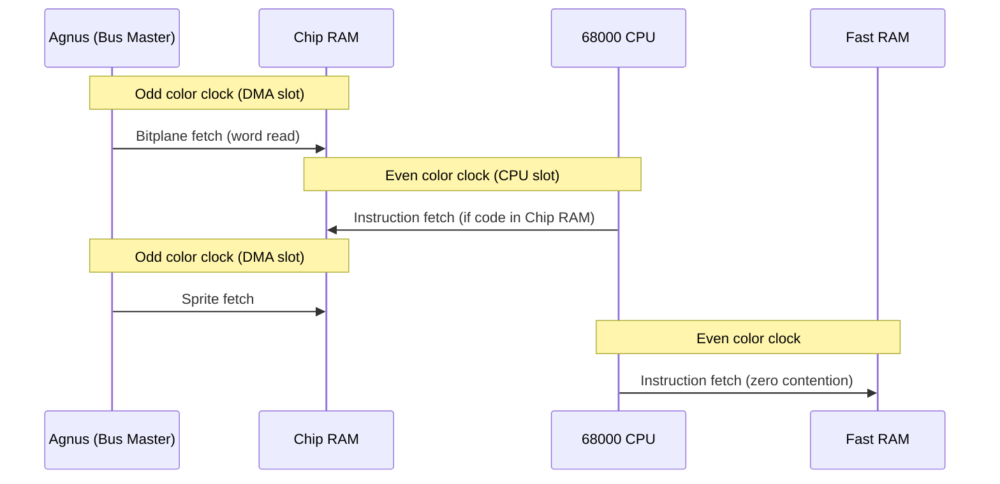

[← Home](../../README.md) · [Hardware](../README.md) · [Common](README.md)

# DMA Architecture — Scanline Slot Allocation, Bus Arbitration, and Bandwidth

## Why It Matters

Every pixel displayed, every audio sample played, every Copper instruction executed, and every Blitter copy performed is a **bus transaction** competing for the same 280 ns memory-access windows on the Chip RAM bus. The Amiga's custom chipset doesn't use interrupts or request queues to share memory — it uses a **fixed time-division schedule** where Agnus (the DMA controller) assigns each color-clock cycle of every scanline to a specific hardware channel. The CPU gets whatever is left over.

This architecture means that **your choice of display mode directly determines how fast your code runs**. A 320×256 lores display with 4 bitplanes leaves the 68000 roughly 53% of the bus; switching to hires 640×256 with 4 bitplanes drops it to ~17%. Understanding DMA slot allocation isn't optional knowledge — it's the single most important performance variable on every Amiga from the A1000 to the CD32.

> [!NOTE]
> **Modern analogy:** Think of DMA slot allocation as **GPU command buffer scheduling** crossed with **PCIe bus arbitration**. The Chip RAM bus is like a PCIe lane shared between the GPU (custom chips) and CPU, with Agnus acting as the bus arbiter that guarantees real-time display and audio never drop frames — at the expense of CPU throughput.

---

## The Scanline Budget — 227.5 Color Clocks

### Color Clock Fundamentals

The entire Amiga chipset is synchronized to a master clock derived from the video crystal:

| Parameter | PAL | NTSC |
|---|---|---|
| Master clock | 28.37516 MHz | 28.63636 MHz |
| Color clock (÷8) | 3,546,895 Hz | 3,579,545 Hz |
| Color clock period | ~282 ns | ~279 ns |
| Color clocks per line | 227.5 (alternating 227/228) | 227.5 (alternating 227/228) |
| Lines per frame | 312.5 (625 interlaced) | 262.5 (525 interlaced) |
| Frame rate | 50 Hz | ~59.94 Hz |

> **A DMA slot** is a single color-clock cycle (~280 ns). During each slot, one 16-bit word can be transferred between Chip RAM and a custom chip register. This is the fundamental quantum of all Amiga DMA — when this article says "sprites use 16 slots," it means 16 of these 280 ns windows are reserved for sprite data fetches each scanline.

### Scanline Anatomy

```
 Color Clock Position (approximate):
 0          28    53         113                            196  212    227
 ├──────────┼─────┼──────────┼──────────────────────────────┼────┼──────┤
 │  HSYNC   │RefDk│ Sprite   │      Active Display          │Spr │HBlnk │
 │  blanking│Audio│ fetch    │   (Bitplane DMA here)        │tail│      │
 │  (~28 cc)│     │          │   DDFSTRT → DDFSTOP          │    │      │
 └──────────┴─────┴──────────┴──────────────────────────────┴────┴──────┘
```

Of the 227.5 total color clocks:
- **~1.5 clocks** are consumed by sync/blanking overhead
- **~226 usable clocks** remain for DMA allocation
- These 226 slots are divided between **fixed** allocations (always reserved) and **demand-driven** allocations (used only when the channel is active)

### Even/Odd Cycle Interleaving

The 68000 CPU requires **4 master clocks** (= 2 color clocks) for a single memory access. Agnus exploits this by interleaving access:

- **Odd color clocks** → reserved for custom chip DMA (if requested)
- **Even color clocks** → available to the CPU

This interleaving means the CPU appears to run at full speed on a stock A500 with light DMA — the 68000 naturally "fits" into the even slots. Contention only occurs when **high-priority DMA channels steal even slots** (which happens with 5+ bitplanes or hires modes).

> [!IMPORTANT]
> The even/odd interleaving applies only to **Chip RAM access**. When the CPU executes code from **Fast RAM**, it runs on a completely separate bus with zero contention — the custom chips and CPU operate in true parallel. This is why adding Fast RAM is the single biggest performance upgrade for any Amiga.

---

## DMA Channel Allocation

### Fixed-Position Channels

These channels have **guaranteed, non-negotiable** slot assignments. They always consume their slots, even if the channel is disabled in DMACON — the slots simply go unused rather than being released to the CPU.

| Channel | Slots/Line | Position | DMACON Bit | Notes |
|---|---|---|---|---|
| **Memory Refresh** | 4 | Fixed (early blanking) | — (always active) | DRAM refresh; non-negotiable hardware requirement |
| **Disk** | 3 | Fixed (after refresh) | Bit 4 (`DSKEN`) | Reserved even when disk motor is off |
| **Audio** (4 ch) | 4 | Fixed (after disk) | Bits 0–3 (`AUD0EN`–`AUD3EN`) | One slot per channel; Paula reads sample words |
| **Sprites** (8 ch) | 16 | Fixed (before/after display) | Bit 5 (`SPREN`) | 2 words × 8 channels (DATA + DATB) |

**Total fixed overhead: 27 slots** — always consumed regardless of display configuration.

### Display-Dependent Channels

| Channel | Slots/Line | Position | Control | Notes |
|---|---|---|---|---|
| **Bitplane DMA** | 0–160+ | Within DDFSTRT–DDFSTOP window | Bit 8 (`BPLEN`) + `BPLCONx` | Varies by resolution and depth |

### Demand-Driven Channels

| Channel | Slots/Line | Position | Control | Notes |
|---|---|---|---|---|
| **Copper** | Variable | Any free slot | Bit 7 (`COPEN`) | Takes one free slot per instruction word |
| **Blitter** | Variable | Any free slot | Bit 6 (`BLTEN`) | Bulk consumer; 1 slot per channel per word |
| **CPU** | Remainder | Whatever Agnus doesn't claim | — | Lowest priority on the chip bus |

### Priority Hierarchy

When multiple channels want the same slot, Agnus resolves by fixed priority:

```
 ┌─────────────────────────┐
 │ 1. Memory Refresh       │  ← Highest: silicon-level, non-maskable
 │ 2. Disk DMA             │
 │ 3. Audio DMA            │
 │ 4. Bitplane DMA         │
 │ 5. Sprite DMA           │
 │ 6. Copper               │
 │ 7. Blitter              │  ← Can be promoted with BLTPRI ("Nasty")
 │ 8. CPU                  │  ← Lowest: gets leftover slots
 └─────────────────────────┘
```

> [!WARNING]
> This priority order means the **display never glitches** — bitplane and sprite DMA always get their slots. But it also means heavy display modes can **starve the CPU entirely**, leaving zero slots for code execution from Chip RAM. See the bandwidth table below.

---

## Bitplane DMA — The Bandwidth Equation

### How Bitplane DMA Works

Agnus fetches bitplane data during the **display data fetch window**, defined by two registers:

| Register | Address | Function |
|---|---|---|
| `DDFSTRT` | `$DFF092` | Display Data Fetch Start — first color clock where Agnus begins fetching bitplane data |
| `DDFSTOP` | `$DFF094` | Display Data Fetch Stop — last color clock for bitplane fetch |
| `DIWSTRT` | `$DFF08E` | Display Window Start — where Denise/Lisa **begins showing pixels** |
| `DIWSTOP` | `$DFF090` | Display Window Stop — where Denise/Lisa **stops showing pixels** |
| `BPL1MOD` | `$DFF108` | Odd-plane modulo — bytes to skip at end of each row |
| `BPL2MOD` | `$DFF10A` | Even-plane modulo — bytes to skip at end of each row |

> [!IMPORTANT]
> **Critical distinction:** `DDFSTRT`/`DDFSTOP` control **when Agnus fetches data** (DMA). `DIWSTRT`/`DIWSTOP` control **what Denise displays** (video output). They are independent — you can fetch more data than you display (for smooth scrolling) or display less than you fetch (for windowed views). Confusing these two register pairs is a common source of display bugs.

### Standard DDFSTRT/DDFSTOP Values

| Mode | DDFSTRT | DDFSTOP | Fetch Width | Fetches/Line |
|---|---|---|---|---|
| Lores (320px) | `$0038` | `$00D0` | 160 clocks | 20 words/plane |
| Hires (640px) | `$003C` | `$00D4` | 160 clocks | 40 words/plane |
| SuperHires (1280px) | `$003C` | `$00D4` | 160 clocks | 80 words/plane |

### Bitplane DMA Slots Per Mode

Each bitplane requires one word fetch per 16 pixels. The total DMA cost depends on resolution × depth:

| Display Mode | Planes | DMA Slots/Line | Fixed DMA (27) | **CPU Slots Left** | **CPU Bandwidth** |
|---|---|---|---|---|---|
| Lores 320px, 1 plane | 1 | 20 | 27 | **179** | **79%** |
| Lores 320px, 2 planes | 2 | 40 | 27 | **159** | **70%** |
| Lores 320px, 3 planes | 3 | 60 | 27 | **139** | **62%** |
| Lores 320px, 4 planes | 4 | 80 | 27 | **119** | **53%** |
| Lores 320px, 5 planes | 5 | 100 | 27 | **99** | **44%** |
| Lores 320px, 6 planes (EHB/HAM) | 6 | 120 | 27 | **79** | **35%** |
| Hires 640px, 2 planes | 2 | 80 | 27 | **119** | **53%** |
| Hires 640px, 4 planes | 4 | 160 | 27 | **39** | **17%** |
| SuperHires 1280px, 2 planes | 2 | 160 | 27 | **39** | **17%** |
| **AGA** Lores 8 planes (FMODE=0) | 8 | 160 | 27 | **39** | **17%** |
| **AGA** Lores 8 planes (FMODE=2×) | 8 | 80 | 27 | **119** | **53%** |
| **AGA** Lores 8 planes (FMODE=4×) | 8 | 40 | 27 | **159** | **70%** |

> [!CAUTION]
> **Hires 4-plane is a CPU killer.** At 160 DMA slots for bitplanes + 27 fixed = 187 slots consumed. Only 39 slots remain for CPU + Copper + Blitter. If the Blitter is running, the CPU may get **zero** Chip RAM access for entire scanlines. This is why OCS/ECS hires is practically limited to 4 colors (2 planes) for games.

### Why AGA FMODE Changes Everything

AGA's `FMODE` register (see [chipset_aga.md](../aga_a1200_a4000/chipset_aga.md)) allows Alice to fetch **2 or 4 words per DMA slot** by widening the internal data bus:

| FMODE | Fetch Width | Effect on Bitplane DMA | Effect on CPU |
|---|---|---|---|
| 0 (1×) | 16 bits | Same as OCS/ECS | Same as OCS/ECS |
| 1 (2×) | 32 bits | Half the slots for same data | ~2× more CPU time |
| 2 (4×) | 64 bits | Quarter the slots for same data | ~4× more CPU time |

This is why AGA machines can display 8 bitplanes (256 colors) without killing the CPU — 4× fetch mode reduces the DMA slot consumption to OCS 2-plane levels.

---

## Bus Arbitration Mechanics

### Agnus as Bus Master

Unlike modern systems where the CPU is the bus master and peripherals request access, the Amiga inverts the hierarchy: **Agnus owns the Chip RAM bus**. The 68000 CPU is a *client* that receives leftover bus cycles.



### Contention and Wait States

When the CPU needs Chip RAM on a cycle already claimed by DMA:

1. CPU asserts address on the bus
2. Agnus detects conflict and **holds the CPU's DTACK line** (data acknowledge)
3. CPU enters **wait state** — it freezes, burning clock cycles doing nothing
4. When the DMA slot completes, Agnus releases DTACK
5. CPU completes its access on the next available slot

On a stock A500 with no Fast RAM, **every** CPU instruction accesses Chip RAM (for both instruction fetch and data). Heavy DMA can stall the CPU for multiple consecutive cycles, creating visible performance drops that scale linearly with display complexity.

### The Fast RAM Escape

When the CPU has Fast RAM available:

| CPU Activity | Memory Bus | Contention? |
|---|---|---|
| Execute code from Fast RAM | Fast RAM bus | **None** — full speed |
| Read/write data in Fast RAM | Fast RAM bus | **None** — full speed |
| Read/write Chip RAM (DMA buffers) | Chip RAM bus | **Yes** — competes with DMA |
| Access custom chip registers ($DFFxxx) | Chip RAM bus | **Yes** — register space is on chip bus |

This is why a 68030 accelerator with 8 MB Fast RAM feels dramatically faster even though the display hardware is identical: the CPU runs from its own private bus while Agnus simultaneously feeds the display from Chip RAM. The only contention occurs when the CPU explicitly touches Chip RAM (e.g., writing to a screen buffer) or custom chip registers.

> **Optimization insight:** Game loops that keep code + data in Fast RAM and only touch Chip RAM for DMA buffer setup (sprite pointers, Copper list writes) can achieve near-100% CPU utilization regardless of display mode. The Blitter handles Chip RAM operations in parallel.

---

## Blitter-Nasty and CPU Starvation

### The BLTPRI Bit (DMACON Bit 10)

The Blitter normally operates at **low priority** — below bitplane, sprite, Copper, and audio DMA. When the Blitter needs a bus cycle and the CPU also wants one, the default behavior is:

- Blitter gets **3 consecutive slots**, then yields **1 slot** to the CPU
- This 3:1 ratio ensures the CPU isn't completely locked out during large blits

Setting `BLTPRI` (the "**Nasty**" bit) in DMACON **promotes the Blitter above the CPU**:

```asm
; Enable Blitter-Nasty
move.w  #$8400, $DFF096    ; DMACON: set BLTPRI (bit 10)

; Disable Blitter-Nasty (restore normal priority)
move.w  #$0400, $DFF096    ; DMACON: clear BLTPRI
```

With Nasty set:
- Blitter holds the bus **continuously** until its operation completes
- CPU is **completely locked out** of Chip RAM — it cannot fetch instructions, read data, or write to DMA buffers
- CPU continues to execute from Fast RAM (if available) but any Chip RAM access stalls indefinitely until the blit finishes

### OwnBlitter / DisownBlitter

AmigaOS provides mutual-exclusion wrappers for safe Blitter access:

```c
OwnBlitter();          /* Acquire exclusive Blitter access */
/* Set up and start your blit */
WaitBlit();            /* Wait for completion */
DisownBlitter();       /* Release for other tasks */
```

These calls are **mandatory** for OS-friendly programs. Without them, the OS graphics library and your program can issue simultaneous conflicting blits, corrupting both outputs. Direct hardware-banging games that take over the machine still benefit from `OwnBlitter()` to prevent interrupt-driven system code from touching the Blitter during gameplay.

### Antipattern: "The Nasty Lockout"

```c
/* ANTIPATTERN — Blitter-Nasty during audio playback */
custom->dmacon = 0x8400;  /* Set BLTPRI */
/* Start a large blit: 320×256 full-screen copy, 4 planes */
/* Duration: ~15ms at 16-bit bus width */

/* PROBLEM: During those 15ms, the CPU cannot service audio interrupts.
   Paula still DMA-feeds audio samples, but if the audio interrupt
   handler (running from Chip RAM) needs to update Paula registers
   for the next sample buffer, it can't execute. Result: audio clicks,
   pops, or silence gaps. */

/* CORRECT — Use Blitter-Nasty only for small, fast blits */
custom->dmacon = 0x8400;    /* Nasty ON */
/* Small blit: 16×16 sprite stamp — completes in ~50µs */
WaitBlit();
custom->dmacon = 0x0400;    /* Nasty OFF immediately */
```

> [!WARNING]
> **Never leave BLTPRI set across frame boundaries.** A Blitter-Nasty blit that spans the vertical blank period blocks *all* VBlank interrupt processing — CIA timer updates, keyboard scanning, serial I/O, and disk motor control all freeze.

---

## Per-Model Bus Architecture

The memory bus architecture evolved significantly across Amiga models, but the **chipset DMA mechanism remained fundamentally the same** — Agnus/Alice always controls the Chip RAM bus using the same slot-allocation scheme.

### Model Comparison

| Model | Year | DMA Controller | Chip Bus Width | Chip RAM Max | Expansion Bus | Glue/Bridge Chips |
|---|---|---|---|---|---|---|
| **A1000** | 1985 | Agnus (8367) | 16-bit | 512 KB | Side expansion | — |
| **A500** | 1987 | Agnus / Fat Agnus (8370/8371) | 16-bit | 512 KB / 1 MB | Zorro II (via sidecar) | — |
| **A2000** | 1987 | Fat Agnus → Super Agnus | 16-bit | 1 MB → 2 MB | Zorro II (5 slots) | **Buster** |
| **A3000** | 1990 | Super Agnus (8372B) | 16-bit chip + 32-bit fast | 2 MB | Zorro III (4 slots) | **Super Buster** + **Ramsey** + **SDMAC** |
| **CDTV** | 1991 | Fat Agnus (8372A) | 16-bit | 1 MB | Internal | **DMAC** (CD-ROM) |
| **A600** | 1992 | Super Agnus (8375) | 16-bit | 1 MB (2 MB upgradeable) | PCMCIA | **Gayle** |
| **A1200** | 1992 | Alice (8374) | 32-bit (AGA internal) | 2 MB | Trapdoor (clock port) | **Gayle** |
| **A4000** | 1992 | Alice (8374) | 32-bit (AGA internal) | 2 MB | Zorro III (5 slots) | **Super Buster** + **Ramsey** + **SDMAC** |
| **CD32** | 1993 | Alice (8374) | 32-bit (AGA internal) | 2 MB | FMV slot | **Akiko** |

### Key Architectural Transitions

**A500/A2000 — Pure 16-bit:**
The simplest bus architecture. Agnus directly drives the Chip RAM address/data bus. The CPU connects to the same bus through Agnus's bus arbitration. No separate Fast RAM bus exists on the A500 motherboard (expansion-only).

**A3000 — Dual-Bus Architecture:**
First Amiga with a **separate 32-bit Fast RAM bus** managed by Ramsey, alongside the 16-bit Chip RAM bus managed by Super Agnus. The CPU can access either bus, but never both simultaneously. This architecture introduced:

- **Ramsey** — DRAM controller for the 32-bit Fast RAM bus; generates refresh, provides timing for Zorro III DMA
- **Super Buster** — Zorro III bus controller; handles bus arbitration for expansion cards performing DMA. Revision history:
  - Rev 7 — original; known DMA timing bugs
  - Rev 9 — fixed some bugs, introduced new ones (DMA instability with some SCSI cards)
  - Rev 11 — production-stable; required for reliable Zorro III DMA
- **SDMAC** — SCSI DMA controller; offloads WD33C93 SCSI chip transfers from the CPU, moving data directly between SCSI bus and Fast RAM via Ramsey

**A1200 — AGA Without Expansion:**
Alice's 32-bit internal data bus connects to 2 MB Chip RAM through two 16-bit DRAM chips. The wider internal bus enables FMODE 2×/4× fetches. However, **the A1200 has no Zorro bus** — expansion is via the trapdoor slot (directly on the CPU bus) or PCMCIA via Gayle.

**A4000 — AGA + Zorro III:**
Combines Alice's 32-bit AGA bus with the A3000's Zorro III expansion architecture. Same Ramsey + Super Buster + SDMAC glue as the A3000, but with Alice instead of Super Agnus for the chipset DMA.

### Glue Chip Summary

| Chip | Found In | Role in DMA |
|---|---|---|
| **Buster** | A2000 | Zorro II bus arbiter; manages bus grant/request for expansion DMA |
| **Super Buster** | A3000, A4000 | Zorro III bus arbiter; 32-bit DMA bus mastering support |
| **Ramsey** | A3000, A4000 | Fast RAM DRAM controller; generates addresses for SDMAC and Zorro III DMA |
| **SDMAC** | A3000, A4000 | SCSI DMA; transfers between WD33C93 SCSI and Fast RAM without CPU involvement |
| **Gayle** | A600, A1200 | IDE controller + PCMCIA bridge; no Zorro bus functionality |
| **Akiko** | CD32 | Chunky-to-planar converter, CD-ROM controller, NVRAM; see [akiko_cd32.md](../aga_a1200_a4000/akiko_cd32.md) |
| **Gary / Fat Gary** | A500/A2000 / A3000 | Address decode, ROM overlay, bus timeout; see [gary_system_controller.md](../ocs_a500/gary_system_controller.md) |

> [!NOTE]
> For deep coverage of Gary/Fat Gary's role in address decoding and bus timeout, see the dedicated [Gary System Controller](../ocs_a500/gary_system_controller.md) article. The Buster, Ramsey, and SDMAC chips are candidates for future dedicated articles as the documentation suite expands.

---

## AGA FMODE — Wider Fetches, New Trade-offs

### The FMODE Register ($DFF1FC)

AGA's most transformative register changes the data bus width for DMA fetches. See [chipset_aga.md](../aga_a1200_a4000/chipset_aga.md) for register-level detail. Here we focus on the **DMA bandwidth implications**:

```
FMODE ($DFF1FC) — write-only on AGA
bits 15-14:  SSCAN2-1   — sprite scan-doubling (AGA)
bits 13-12:  reserved
bits  3- 2:  SPR_FMODE  — sprite fetch width (00=16-bit, 11=64-bit)
bits  1- 0:  BPL_FMODE  — bitplane fetch width (00=16-bit, 11=64-bit)
```

### Bandwidth Impact Table

| FMODE (BPL) | Fetch Width | Words/Slot | 6-Plane Lores Slots | 8-Plane Lores Slots | Blitter Throughput |
|---|---|---|---|---|---|
| 0 (1×) | 16-bit | 1 | 120 | 160 | 1× (OCS parity) |
| 1 (2×) | 32-bit | 2 | 60 | 80 | 2× |
| 3 (4×) | 64-bit | 4 | 30 | 40 | 4× |

At FMODE=3 (4×), an 8-bitplane 256-color lores display consumes only **40 DMA slots** — the same bus cost as a 2-bitplane OCS display. This is AGA's core performance advantage: **same visual quality, dramatically lower bus cost**.

### Alignment Requirements

Wider fetches impose stricter memory alignment:

| FMODE | Alignment Requirement | Consequence of Misalignment |
|---|---|---|
| 0 (1×) | Word-aligned (2 bytes) | Standard OCS/ECS requirement |
| 1 (2×) | Longword-aligned (4 bytes) | Display shifts by up to 16 pixels |
| 3 (4×) | 8-byte aligned | Display shifts by up to 32 pixels; hardware may fetch garbage |

```c
/* Correct AGA bitplane pointer setup */
APTR plane = AllocMem(planeSize, MEMF_CHIP | MEMF_CLEAR);
/* Verify alignment for FMODE=3: */
if ((ULONG)plane & 7) {
    /* PROBLEM: pointer is not 8-byte aligned */
    /* AllocMem should return aligned memory, but verify */
}
```

### FMODE and Sprites

FMODE also widens sprite fetches, changing sprite width and DMA cost:

| SPR_FMODE | Sprite Width | DMA Slots/Sprite | Total Sprite DMA (8 ch) |
|---|---|---|---|
| 0 (1×) | 16 pixels | 2 | 16 |
| 1 (2×) | 32 pixels | 4 | 32 |
| 3 (4×) | 64 pixels | 8 | 64 |

> [!CAUTION]
> At FMODE=3, sprite DMA consumes **64 slots** instead of 16 — quadrupling the sprite overhead. Combined with 8-plane bitplane DMA (40 slots at 4×), total DMA becomes 64 + 40 + 27(fixed) = **131 slots**, leaving 95 for CPU/Copper/Blitter. This is still better than OCS 6-plane (120 + 16 + 27 = 163), but the sprite cost increase is significant. See [AGA Sprites](../aga_a1200_a4000/aga_sprites.md) for per-mode details.

---

## FPGA and Emulation Implementation Notes

Replicating Agnus/Alice DMA behavior is one of the most critical and error-prone aspects of Amiga FPGA cores and cycle-accurate emulators. The DMA slot scheduler is effectively a **state machine** synchronized to the beam position counter.

### Core Requirements

| Requirement | Why It's Critical | Common Mistakes |
|---|---|---|
| **Cycle-accurate slot scheduler** | Copper WAITs and demo effects count exact DMA cycles; off-by-one breaks them | Implementing DMA as "request/grant" instead of fixed-position slots |
| **Even/odd interleaving** | CPU must be stalled on odd slots when DMA is active, not just "whenever" | Stalling CPU on every DMA cycle instead of only when accessing Chip RAM |
| **DDFSTRT/DDFSTOP precision** | Bitplane fetch start/stop must match the exact color clock | Starting fetch 1 clock early/late shifts the display by 16 pixels |
| **Sprite fetch positioning** | Sprite DMA occurs at fixed positions relative to HSYNC, not relative to DDFSTRT | Placing sprite DMA inside the bitplane fetch window |
| **FMODE fetch widening** | AGA wider fetches must consume 1 slot but transfer 2/4 words internally | Consuming 2/4 slots per wide fetch instead of 1 |

### Minimig Reference Architecture

The MiSTer Minimig-AGA core implements the DMA scheduler in `agnus.v` (or equivalent) as a finite state machine:

```
State Machine: DMA Slot Sequencer
─────────────────────────────────
Inputs:  hpos (horizontal position counter, 0–227)
         DMACON (enabled channels bitmask)
         DDFSTRT, DDFSTOP (fetch window)
         BPLCONx (display mode / depth)
         FMODE (AGA fetch width)

Output:  bus_owner (enum: REFRESH, DISK, AUDIO, SPRITE, BPL, COPPER, BLITTER, CPU)
         chip_ram_addr (21/23-bit address)
         chip_ram_data (16/32/64-bit)
```

Key implementation patterns:
1. **Horizontal position counter** (`hpos`) increments each color clock, wrapping at 227/228
2. **Fixed-channel lookup table** maps specific `hpos` ranges to channel owners (refresh at 0–3, disk at 4–6, audio at 7–10, etc.)
3. **Bitplane fetch logic** activates when `hpos >= DDFSTRT && hpos <= DDFSTOP && BPLEN`
4. **Demand channels** (Copper, Blitter) check remaining slots using priority arbitration
5. **CPU grant** is the default when no DMA channel claims the current slot

### SDRAM vs Async DRAM

FPGA implementations face a fundamental timing mismatch: original Amiga Chip RAM used asynchronous DRAM with ~150 ns access time, naturally fitting the ~280 ns color clock. FPGA boards use synchronous SDRAM (or DDR) with different timing:

| Challenge | Solution |
|---|---|
| SDRAM requires burst access | Pre-fetch multiple words per SDRAM burst; buffer internally |
| SDRAM has fixed latency | Pipeline DMA requests 2–3 clocks ahead of need |
| Multiple channels need SDRAM simultaneously | Time-multiplex SDRAM access within each color clock (SDRAM is much faster than the original DRAM) |

> [!TIP]
> Modern SDRAM running at 100+ MHz can service multiple Amiga DMA requests within a single 280 ns color clock. The MiSTer framework's SDRAM controller typically provides 4–8 access slots per color clock, enabling the core to satisfy all DMA channels plus CPU without contention — a luxury the original hardware never had.

### Common FPGA Bugs

1. **Bitplane over-fetch**: Fetching one word too many per scanline, causing the last word to overwrite the first word of the next plane
2. **Sprite/bitplane slot collision**: Sprite DMA and bitplane DMA overlapping at DDFSTRT boundary
3. **Blitter priority inversion**: Blitter-Nasty not correctly promoting Blitter above CPU
4. **Copper slot starvation**: Copper unable to execute between bitplane fetches in high-bandwidth modes
5. **FMODE alignment errors**: 4× fetch not enforcing 8-byte alignment, causing display glitches

---

## Bandwidth Calculation Cookbook

### The Formula

```
Available CPU slots per line = 226 - Fixed(27) - BPL_slots - SPR_slots_extra
CPU bandwidth % = Available / 226 × 100
```

Where:
- **Fixed** = 27 (4 refresh + 3 disk + 4 audio + 16 sprites at FMODE=0)
- **BPL_slots** = `(DDFSTOP - DDFSTRT + 1) × depth ÷ FMODE_multiplier`
- **SPR_slots_extra** = additional sprite slots when FMODE > 0

### Worked Examples

**Example 1: Typical OCS Game (A500, 320×256, 5 planes)**
```
Fixed DMA:     27 slots (refresh + disk + audio + sprites)
Bitplane DMA:  100 slots (20 words/plane × 5 planes)
Total DMA:     127 slots
CPU available: 226 - 127 = 99 slots (43.8%)
```
At 7.09 MHz / 2 = ~3.55 MHz effective, 43.8% gives ~1.55 MHz effective CPU throughput from Chip RAM.

**Example 2: OCS Hires Workbench (A2000, 640×256, 4 planes)**
```
Fixed DMA:     27 slots
Bitplane DMA:  160 slots (40 words/plane × 4 planes)
Total DMA:     187 slots
CPU available: 226 - 187 = 39 slots (17.3%)
```
The Workbench feels sluggish on a stock 68000 because CPU bandwidth is only 17%.

**Example 3: AGA Game (A1200, 320×256, 8 planes, FMODE=3)**
```
Fixed DMA:     27 slots (sprites at FMODE=0; assume SPR_FMODE=0)
Bitplane DMA:  40 slots (160 words ÷ 4× fetch)
Total DMA:     67 slots
CPU available: 226 - 67 = 159 slots (70.4%)
```
Full 256-color display with 70% CPU — AGA's core advantage.

**Example 4: AGA Worst Case (A1200, 640×512 LACE, 8 planes, FMODE=3, SPR_FMODE=3)**
```
Fixed:         11 slots (refresh + disk + audio)
Sprites:       64 slots (8 × 8 at 4× fetch)
Bitplane DMA:  80 slots (320 words ÷ 4× fetch)
Total DMA:     155 slots
CPU available: 226 - 155 = 71 slots (31.4%)
```
Still feasible — but add Copper + Blitter and the CPU drops to single digits.

---

## Best Practices

1. **Choose display depth based on CPU budget** — Use the bandwidth table above to determine how many bitplanes your game can afford before the CPU is starved.
2. **Put code and data in Fast RAM** — The single most impactful optimization. CPU accesses to Fast RAM never contend with DMA.
3. **Use `OwnBlitter()` / `DisownBlitter()`** — Always bracket Blitter operations. Never leave the Blitter unguarded.
4. **Avoid Blitter-Nasty for large operations** — BLTPRI is useful for tiny blits (< 100 words) where completion speed matters more than CPU starvation.
5. **Profile with `VPOSR` / beam position** — Measure how many scanlines your game loop takes per frame to detect DMA starvation early.
6. **Test on stock hardware** — A stock A500 with 512 KB Chip RAM and no Fast RAM is the worst-case DMA scenario. If it works there, it works everywhere.
7. **Understand DDFSTRT vs DIWSTRT** — Fetch window (DMA cost) and display window (visible area) are independent. Over-fetching for scroll buffers costs DMA even if the extra pixels aren't visible.
8. **On AGA, set FMODE appropriately** — Don't leave FMODE=0 if you need bandwidth. Don't set FMODE=3 if you don't need it (alignment constraints, wider sprites).

---

## FAQ

**Q: Do disabled DMA channels free their slots for the CPU?**
> Partially. Fixed-position channels (refresh, disk, audio, sprites) have **reserved** time positions — disabling them means those slots go idle, not that the CPU can use them. The CPU can only use a slot if no higher-priority channel claims it. Demand-driven channels (Copper, Blitter) release their slots when disabled.

**Q: Does the 68020/030/040 change the DMA equation?**
> No — the DMA slot allocation is controlled entirely by Agnus/Alice, which is independent of the CPU type. A 68040 at 25 MHz still gets the same number of Chip RAM slots per scanline as a 68000 at 7 MHz. The faster CPU benefits only when accessing Fast RAM (its own bus) or when it can do more work per Chip RAM access (larger caches, instruction pipeline).

**Q: Can the Copper "see" DMA slots?**
> The Copper doesn't "see" slots — it gets granted free slots by Agnus's priority arbiter. In heavy display modes, the Copper may wait several color clocks between instructions because all slots are consumed by bitplane and sprite DMA. This is why complex Copper effects are impractical in hires 4-plane mode.

**Q: Why does Fast RAM not help audio or disk DMA?**
> Audio and disk DMA channels are **hard-wired to Chip RAM** — Paula (audio/disk controller) can only read from the Chip RAM bus. There is no hardware path for Paula to access Fast RAM. Audio samples and disk buffers **must** be in Chip RAM regardless of how much Fast RAM is installed.

**Q: How does this relate to Zorro DMA bus mastering?**
> Zorro bus mastering (Zorro III on A3000/A4000) is handled by Super Buster, which arbitrates between Zorro cards and the CPU for the Fast RAM bus. This is completely separate from the Chip RAM DMA scheduler — Zorro DMA and chipset DMA operate on different buses and don't contend. See [Zorro Bus](../common/zorro_bus.md) for expansion bus DMA details.

---

## References

- *Amiga Hardware Reference Manual* 3rd ed. — Chapter 6: DMA and the Display, Figure 6-9 (DMA time slot diagram)
- ADCD 2.1: Custom chip register documentation (`DMACON`, `DDFSTRT`, `DDFSTOP`, `FMODE`)
- NDK 3.9: `hardware/custom.h`, `hardware/dmabits.h`
- Commodore A3000 Technical Reference — Ramsey, Super Buster, SDMAC chapters
- Toni Wilen, "WinUAE Chip RAM DMA Cycle Map" — reverse-engineered per-slot allocation tables
- Minimig FPGA source: `agnus.v` — reference DMA scheduler implementation

## See Also

- [OCS Chipset Internals](../ocs_a500/chipset_ocs.md) — DMACON register, Agnus DMA priority
- [AGA Chipset Internals](../aga_a1200_a4000/chipset_aga.md) — FMODE register, Alice DMA controller
- [Memory Types](memory_types.md) — Chip RAM vs Fast RAM vs Slow RAM accessibility
- [Blitter](../ocs_a500/blitter.md) — Blitter DMA channels, WaitBlit, minterm operations
- [AGA Blitter](../aga_a1200_a4000/aga_blitter.md) — 64-bit FMODE blitter details
- [Sprites](../../08_graphics/sprites.md) — Sprite DMA budget, hardware vs software sprites
- [AGA Sprites](../aga_a1200_a4000/aga_sprites.md) — FMODE impact on sprite DMA and width
- [BitMap](../../08_graphics/bitmap.md) — Planar bitplane layout, AllocBitMap, interleaving
- [Display Modes](../../08_graphics/display_modes.md) — Mode selection, DMA slot budget overview
- [Copper](../ocs_a500/copper.md) — Copper instruction timing and DMA interaction
- [Gary System Controller](../ocs_a500/gary_system_controller.md) — Bus timeout, address decode
- [Zorro Bus](zorro_bus.md) — Expansion bus DMA, Buster/Super Buster
- [Video Signal & Timing](video_timing.md) — clock derivation, beam counters, genlock, video output
