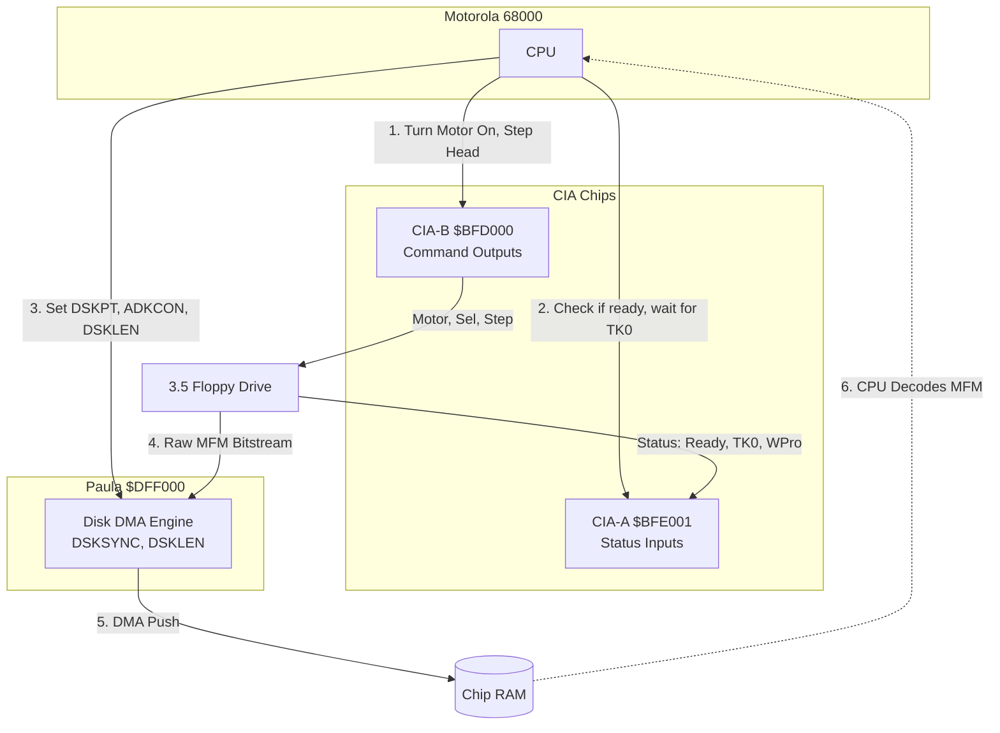

[← Home](../../README.md) · [Hardware](../README.md)

# Bare-Metal Floppy Drive Hardware

## Overview

Unlike early PCs or the ZX Spectrum, the Amiga does not use an intelligent, high-level floppy disk controller (like the NEC 765 or WD1793). Instead, floppy disk access on the Amiga is orchestrated by a combination of the **[CIA](cia_chips.md)** chips (for mechanical control) and the **[Paula](../ocs_a500/chipset_ocs.md)** custom chip (for Direct Memory Access data streaming).

This architecture provides zero-overhead background reads, but completely places the burden of sector decoding, MFM parsing, and checksum validation onto the CPU (or a reverse-engineering Imager Slave).

---

## 1. The Dual-Chip Architecture

The physical connection between the Amiga motherboard and the 3.5" floppy drive is split into mechanical logic and data lines:



---

## 2. Mechanical Control via CIA

The CIA (Complex Interface Adapter) chips handle the physical motors of the floppy drive.

### CIA-B (`$BFD000`) - The Command Register
Port A of CIA-B (`ciapra`) is used to send commands to the drive. Bits are **active low** (0 = ON, 1 = OFF).

| Bit | Name | Function |
|---|---|---|
| 7 | `/MTR` | Motor On/Off (0 = spinning). Must be set *while* selecting the drive. |
| 6-3 | `/SEL3`-`/SEL0` | Drive Select. Setting bit 3 to `0` selects DF0. |
| 2 | `/SIDE` | Head Select. `0` = Upper head (Side 0), `1` = Lower head (Side 1). |
| 1 | `/DIR` | Step Direction. `0` = Step in (towards center), `1` = Step out (towards Track 0). |
| 0 | `/STEP` | Step Pulse. A high-to-low transition physically moves the head one track. |

### CIA-A (`$BFE001`) - The Status Register
Port A of CIA-A (`ciapra`) is used to read the physical state of the drive. Bits are **active low**.

| Bit | Name | Function |
|---|---|---|
| 5 | `/RDY` | Drive Ready. `0` = Disk is inserted and spinning at full speed. |
| 4 | `/TK0` | Track 0 Sensor. `0` = The head has physically reached the outermost track. |
| 3 | `/WPRO` | Write Protect. `0` = Disk is locked (write tab open). |
| 2 | `/CHNG` | Disk Change. `0` = Disk has been removed or inserted. |

### The Stepping Flow (Assembly)
To physically seek to a track, developers bypass the OS and write directly to CIA-B.

> [!WARNING]
> Mechanical components are slow. You cannot pulse the `/STEP` bit rapidly. You must wait approximately **3 milliseconds** between step pulses, usually by polling a CIA timer or using a `DBF` delay loop, otherwise the head will jam.

```asm
; Example: Step head outward towards Track 0
    LEA     $BFD000, A0         ; CIA-B
    
    ; 1. Set Direction to OUT (Bit 1 = 1)
    BSET    #1, (A0)            

.seekLoop:
    ; 2. Check if we are at Track 0
    BTST    #4, $BFE001         ; CIA-A: Check /TK0
    BEQ     .atTrack0           ; If 0, we are at Track 0

    ; 3. Pulse /STEP (High -> Low -> High)
    BCLR    #0, (A0)            ; Step Low
    NOP                         ; Short hardware delay
    BSET    #0, (A0)            ; Step High
    
    ; 4. Wait 3ms for mechanical head movement
    BSR     Wait3ms             

    BRA     .seekLoop           ; Keep stepping

.atTrack0:
```

---

## 3. Paula's Disk DMA Engine

Once the head is at the correct track, the developer instructs Paula to start reading the magnetic flux.

### `ADKCON` (Audio/Disk Control)
Before reading, Paula must be configured via the `$DFF09E` (`ADKCON`) register.
*   **WORDSYNC** (Bit 10): If set, Paula will not start dumping data into RAM until it sees the exact 16-bit sequence specified in `DSKSYNC`. If cleared, Paula blindly dumps data immediately.
*   **MFMPREC** (Bit 9): MFM Precompensation. (Usually handled automatically by Amiga drives, set to 0 for reads).
*   **FAST** (Bit 8): Set to 0 for standard Amiga DD drives (2 µs per bit cell). Set to 1 for High Density (HD) drives.

### `DSKSYNC` (Disk Sync Register)
Located at `$DFF07E`. When `WORDSYNC` is enabled, Paula constantly monitors the incoming flux stream for this 16-bit value. 
*   The standard AmigaDOS sync word is `$4489`. 
*   **Copy protection often uses custom sync words** (e.g., `$8944`). By changing `DSKSYNC`, an Imager Slave can force Paula to lock onto proprietary, non-DOS tracks.

### `DSKPT` (Disk DMA Pointer)
Located at `$DFF020`. This is a 32-bit pointer to the Chip RAM buffer where Paula will write the data.

### `DSKLEN` (Disk Length & Trigger)
Located at `$DFF024`. This register dictates how many words Paula should transfer, and starts the DMA.
*   Bit 15 (`DMAEN`): Must be set to `1` to enable the transfer.
*   Bit 14 (`WRITE`): `0` = Read from disk, `1` = Write to disk.
*   Bits 13-0: Number of 16-bit words to transfer (usually `$1900` / 6400 words for a full DD track).

> [!IMPORTANT]
> **The Double-Write Quirk**
> To actually trigger the DMA hardware, you must write the exact same value to `DSKLEN` **twice**. This is a safety mechanism built into Paula's silicon to prevent accidental disk overwrites from random runaway code pointers.

```asm
    ; Example: Start DMA Read of a raw track
    LEA     $DFF000, A5
    
    ; 1. Set Sync Word
    MOVE.W  #$4489, $07E(A5)        ; DSKSYNC
    
    ; 2. Configure ADKCON
    MOVE.W  #$8400, $09E(A5)        ; Set WORDSYNC (Bit 15=Set, Bit 10=WORDSYNC)
    
    ; 3. Set Chip RAM Pointer
    MOVE.L  #TrackBuffer, $020(A5)  ; DSKPT
    
    ; 4. Start DMA Read (Double-Write Quirk)
    MOVE.W  #$8000|6400, $024(A5)   ; DSKLEN: Enable, Read, 6400 words
    MOVE.W  #$8000|6400, $024(A5)   ; Write AGAIN to trigger Paula
    
    ; 5. Wait for DSKBLK interrupt flag
.waitDMA:
    BTST    #1, $01F(A5)            ; INTREQR (Bit 1 = DSKBLK)
    BEQ     .waitDMA
```

---

## 4. MFM Decoding: Historical & Technical Context

Once the DMA transfer finishes, the buffer in Chip RAM is full of raw MFM (Modified Frequency Modulation) data.

### 4.1 FM vs MFM Encoding
Magnetic media cannot store a long sequence of identical bits (like `00000000`) without losing synchronization, because there would be no magnetic flux transitions to keep the drive's read circuitry locked on track. 

*   **FM (Frequency Modulation)**: Early floppy disks (like the 1973 IBM 3740 standard, used by Shugart Associates on their 8-inch SA800 drives) solved this by inserting a "clock bit" before *every single* data bit. This ensured constant magnetic transitions but was highly inefficient, known as "Single Density."
*   **MFM (Modified Frequency Modulation)**: Introduced by IBM in 1970 for hard drives (IBM 3330) and later adopted as the universal standard for "Double Density" floppy disks, MFM mathematically reduces the number of clock bits.

### 4.2 The MFM Encoding Rules
MFM doubles the storage capacity of FM by only inserting clock bits when strictly necessary to prevent magnetic desynchronization. 

The Amiga encoding algorithm translates every 1 bit of logical data into 2 bits of physical disk data (1 clock bit + 1 data bit) based on the following rules:
1.  If the data bit is `1`, the clock bit is `0`. (Physical = `01`)
2.  If the data bit is `0`, and the *previous* data bit was `1`, the clock bit is `0`. (Physical = `00`)
3.  If the data bit is `0`, and the *previous* data bit was `0`, the clock bit is `1`. (Physical = `10`)

```text
Logical Data:      1   0   1   1   0   0   0   1
Physical MFM:     01  00  01  01  00  10  10  01
                   ↑   ↑   ↑   ↑   ↑   ↑   ↑   ↑
                   Clock bits dynamically inserted based on history
```

### 4.3 Amiga CPU Decoding
Because Paula only handles the DMA transfer, the CPU must manually decode this MFM data. The CPU takes the interleaved 32-bit longs, masks out the clock bits, shifts the data bits together, and verifies the XOR checksums. 

If a game uses a custom trackloader, it intentionally breaks the AmigaDOS MFM checksum algorithm. By reading the raw bitstream via Paula, reversing the game's custom decoding loop, and writing a WHDLoad **Imager Slave**, developers can successfully extract data that the OS considers "corrupt."

---

## 5. Supported Diskette Capacities

Because Paula handles data streaming via raw DMA instead of a rigid sector controller, the Amiga OS writes entire tracks to the disk continuously. This eliminates the massive inter-sector sync gaps required by standard PC floppy formats. Consequently, the Amiga fits 11 sectors per track instead of the PC's 9, yielding higher formatted capacities on the exact same physical media.

| Disk Type | Magnetic Density | Unformatted Capacity | Standard PC Format | Amiga Format |
| :--- | :--- | :--- | :--- | :--- |
| **3.5" DD** | Double Density (MFM) | ~1.0 MB | 720 KB (9 sectors/track) | **880 KB** (11 sectors/track) |
| **3.5" HD*** | High Density (MFM) | ~2.0 MB | 1.44 MB (18 sectors/track) | **1.76 MB** (22 sectors/track) |

> [!NOTE]
> ***HD Drive Requirement**: High Density disks use a different magnetic coercivity. Standard Amiga DD drives cannot reliably format HD disks. To support 1.76 MB HD disks, later machines (like the Amiga 3000 and 4000) shipped with specialized High Density drives that literally spun at half-speed (150 RPM instead of 300 RPM) when an HD disk was inserted. This halved the data rate, allowing the standard Paula chip (designed for 250 kbit/s DD data) to read the 500 kbit/s HD flux stream without requiring an upgraded DMA controller!

---

## 6. References

*   **Encoding & Magnetic Storage:**
    *   [Modified Frequency Modulation (Wikipedia)](https://en.wikipedia.org/wiki/Modified_Frequency_Modulation)
    *   [IBM 3740 Data Entry System & FM Encoding (Wikipedia)](https://en.wikipedia.org/wiki/IBM_3740)
*   **Amiga Floppy Controller Programming:**
    *   [Amiga Hardware Reference Manual: Floppy Disk Controller](http://amigadev.elowar.com/read/ADCD_2.1/Hardware_Manual_guide/node0127.html)
    *   [WHDLoad Developer Documentation: RawDIC & Imager Slaves](http://whdload.de/docs/en/rawdic.html)
