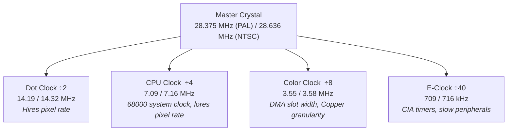
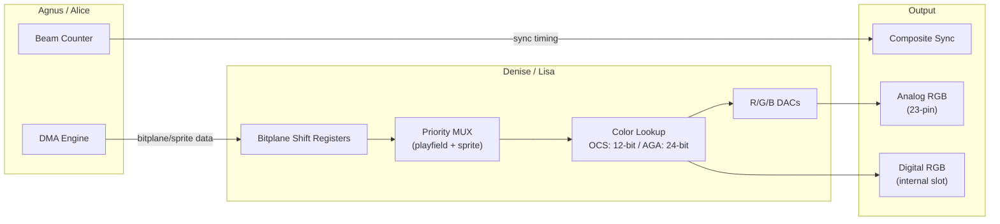
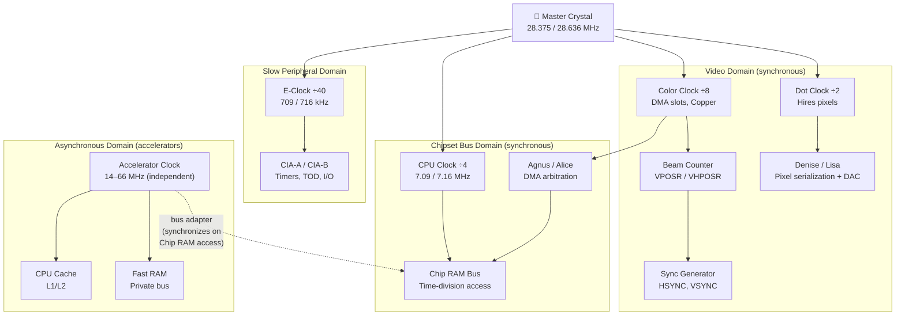

[← Home](../../README.md) · [Hardware](../README.md) · [Common](README.md)

# Video Signal & System Timing — Clock Derivation, Beam Mechanics, and Output Paths

## Why It Matters

The Amiga is a **video computer that happens to have a CPU**. Jay Miner's original design started not with a processor specification, but with a television signal: generate legal NTSC composite video, then derive every other clock in the system — including the CPU clock — from the video crystal. This single decision shaped every aspect of Amiga performance, from why the 68000 runs at 7.09 MHz instead of its rated 8 MHz, to why changing your display mode changes how fast your code executes.

This architecture has no parallel in the IBM PC world, where CPU and video clocks are independent. The closest modern equivalent is an **SoC with a unified memory architecture** — Apple's M-series or AMD APUs — where the display engine and CPU share memory bandwidth and the display refresh rate constrains available compute cycles. On the Amiga, this coupling is absolute: every DMA slot, every Copper instruction, every Blitter cycle, and every CIA timer tick traces back to a single quartz crystal oscillating at 28.375 MHz (PAL) or 28.636 MHz (NTSC).

This article documents **the complete signal path** from crystal to screen — the clock tree, beam counter mechanics, sync generation, video output, genlock overlay, and display adaptation. It is the "timing and signal" companion to [DMA Architecture](dma_architecture.md) (which covers bus bandwidth) and [Display Modes](../../08_graphics/display_modes.md) (which covers the OS API layer).

> [!NOTE]
> **What this article covers vs. existing references:**
> - **Clock derivation and signal generation** — primary coverage here
> - **DMA slot allocation and bandwidth** — see [DMA Architecture](dma_architecture.md)
> - **ModeID selection and OS display API** — see [Display Modes](../../08_graphics/display_modes.md)
> - **Copper instruction programming** — see [Copper Programming](../../08_graphics/copper_programming.md)

---

## The Clock Tree — From Crystal to CPU

### Master Oscillator

Every Amiga contains a single quartz crystal that serves as the **master timing reference** for the entire system. The frequency is chosen to produce a legal television color subcarrier:

| Parameter | PAL | NTSC |
|---|---|---|
| Master crystal | **28.37516 MHz** | **28.63636 MHz** |
| Relationship to color subcarrier | 4 × 4 × PAL Fsc | 8 × NTSC Fsc |
| PAL color subcarrier (Fsc) | 4.433619 MHz | — |
| NTSC color subcarrier (Fsc) | — | 3.579545 MHz |

### Division Hierarchy

All system clocks are derived by integer division from the master crystal. No PLL, no frequency synthesis — just dividers:



### Complete Clock Domain Table

| Clock | Divisor | PAL Frequency | NTSC Frequency | Period | Drives |
|---|---|---|---|---|---|
| Master | ÷1 | 28.37516 MHz | 28.63636 MHz | ~35 ns | Internal chipset logic |
| Dot clock | ÷2 | 14.18758 MHz | 14.31818 MHz | ~70 ns | Hires/superhires pixels, shift registers |
| CPU / System | ÷4 | 7.09379 MHz | 7.15909 MHz | ~141 ns | 68000 CLK input, lores pixels |
| Color clock (CCK) | ÷8 | 3.54690 MHz | 3.57955 MHz | ~282 ns | DMA slots, Copper WAIT resolution |
| E-clock | ÷40 | 709,379 Hz | 715,909 Hz | ~1.41 µs | CIA-A/B timers, 6502-bus peripherals |

### Why the 68000 Runs Below Its Rating

The Motorola 68000 in the Amiga is rated for **8 MHz** but clocked at ~7.09 (PAL) or ~7.16 (NTSC) MHz. This is not a cost-saving measure — it's a **mathematical necessity**. The CPU clock must be an exact integer fraction (÷4) of the master crystal to maintain synchronous bus access with the custom chipset. Agnus, Denise, and the 68000 all share Chip RAM on a time-division basis, and any frequency mismatch would corrupt DMA transfers.

> [!NOTE]
> **Fast RAM is not constrained by video timing.** Accelerator boards with 68020/030/040/060 processors run at independent frequencies (14, 25, 33, 40, 50, 66 MHz) because Fast RAM lives on a separate bus that doesn't participate in DMA arbitration. The video-derived clock only constrains Chip RAM access.

### The E-Clock — CIA Timer Reference

The E-clock is the **slowest derived clock**, running at 1/10th of the CPU clock (or 1/40th of the master crystal). Its unusual duty cycle — 4 clocks high, 6 clocks low (40/60) — comes directly from the 68000's legacy 6800-bus compatibility mode. The CIA chips (8520A) use the E-clock as their timer input:

| CIA Timer | E-Clock Ticks | Duration (PAL) | Typical Use |
|---|---|---|---|
| 1 tick | 1 | 1.41 µs | Minimum timer resolution |
| 1 scanline (~227 CCK) | ~57 | ~80 µs | Raster timing reference |
| 1 frame (PAL) | ~17,734 | 20 ms | VBL interval |
| CIA-B TOD | counts VSYNC | 20 ms/tick | Time-of-day clock |

### XCLK — External Clock Override

The master crystal can be **overridden** via the XCLK pin (pin 1 of the 23-pin video connector, active when /XCLKEN on pin 2 is asserted). Genlock devices use this to slave the entire Amiga clock tree to an external video source's timing, enabling frame-accurate overlay. When XCLK is active, the CPU clock, DMA timing, CIA timers, and all video generation shift to match the external reference — the entire machine runs at a slightly different speed.

---

## Anatomy of a Scanline

A single horizontal scanline is the fundamental timing unit of the Amiga display. Understanding its internal structure is essential for Copper programming, DMA budget calculation, and genlock synchronization.

### Horizontal Timing Structure

Each scanline consists of **227.5 color clocks** (alternating 227 and 228 per line to maintain half-line interlace timing). The scanline is divided into distinct regions:

```
 ←────────────────── 227.5 color clocks ──────────────────→

 ┌──────┬──────┬─────────┬──────────────────────┬──────────┐
 │ SYNC │BLANK │  Back   │    Active Display     │  Front   │
 │      │      │  Porch  │  (visible pixels)     │  Porch   │
 └──────┴──────┴─────────┴──────────────────────┴──────────┘
 H=0                     H=$81                         H=$E3
         ← HBLANK →      ← DDFSTRT...DDFSTOP →
```

### Color Clock Position Map

The beam's horizontal position is measured in **color clocks** (each = 2 lores pixels = 4 hires pixels). Position $00 is the start of HSYNC:

| H Position (hex) | Region | Notes |
|---|---|---|
| $00–$03 | HSYNC | Sync pulse generation |
| $04–$08 | Back porch | Color burst inserted here (composite only) |
| $09–$18 | Left blanking | Off-screen, DMA active (refresh, disk, audio, sprites) |
| $19–$27 | Left border | Visible if overscan enabled, no bitplane data |
| $28–$D7 | Active display | Bitplane DMA region (standard: $38–$D0) |
| $D8–$E2 | Right border | Visible if overscan, no bitplane data |
| $E3 | Front porch | Line ends, wraps to next |

### Mapping Positions

Color clocks, pixels, and DMA slots are all synchronized:

| Unit | Per Scanline | Relationship |
|---|---|---|
| Master clocks | 1,820 | = 227.5 × 8 |
| Dot clocks (hires pixels) | 910 | = 227.5 × 4 |
| CPU clocks (lores pixels) | 455 | = 227.5 × 2 |
| Color clocks | 227.5 | **Base unit** — 1 CCK = 1 DMA slot |
| DMA slots (even+odd) | 227 | Available for allocation (see [DMA Architecture](dma_architecture.md)) |

### Beam Position to Screen Coordinates

The Copper and the CPU see beam positions in color clocks. Converting to pixel coordinates:

```
Lores pixel X  = (H_position - DDFSTRT) × 2
Hires pixel X  = (H_position - DDFSTRT) × 4
Screen pixel 0 = H position $81 (standard non-overscan)
```

The Copper's WAIT instruction compares against the beam position with **2-pixel (1 color clock) horizontal granularity** — it cannot distinguish individual lores pixels within the same color clock.

### HBLANK Registers (ECS/AGA)

On ECS and AGA machines, horizontal blanking boundaries are programmable via [BEAMCON0](#programmable-sync--beamcon0-ecsaga):

| Register | Address | Function |
|---|---|---|
| `HBSTRT` | $DFF1C8 | Horizontal blank start position |
| `HBSTOP` | $DFF1CA | Horizontal blank stop position |
| `HSSTRT` | $DFF1C4 | Horizontal sync start |
| `HSSTOP` | $DFF1C6 | Horizontal sync stop |
| `HTOTAL` | $DFF1C0 | Total color clocks per line − 1 |

On OCS, these values are hardwired in Agnus and cannot be changed.

---

## Anatomy of a Frame

### Vertical Structure

A complete video frame follows the same sync-blank-active-blank pattern vertically as a scanline does horizontally. The number of lines differs between PAL and NTSC:

| Parameter | PAL (non-interlaced) | NTSC (non-interlaced) | PAL (interlaced) | NTSC (interlaced) |
|---|---|---|---|---|
| Total lines/field | 312 or 313 | 262 or 263 | 625 (2 fields) | 525 (2 fields) |
| Active display lines | 256 (standard) | 200 (standard) | 512 | 400 |
| VBLANK lines | ~56 | ~62 | ~56/field | ~62/field |
| Frame rate | 50 Hz | ~59.94 Hz | 25 Hz | ~29.97 Hz |
| Frame duration | 20.0 ms | 16.7 ms | 40.0 ms | 33.4 ms |

### Vertical Regions

```
Line 0 ──────────── VSYNC pulse (2–3 lines)
Line 3 ──────────── Post-equalization / blanking
Line ~26 ─────────── Active display begins (DIWSTRT vertical)
Line ~282 ────────── Active display ends (DIWSTOP vertical)
Line ~300 ────────── Pre-equalization
Line 312 ────────── Frame ends, beam retraces to top
```

The vertical blank interrupt (INTREQ bit 5, VERTB) fires at **line 0** — the start of VSYNC — giving software the entire VBLANK period (~56 lines × ~64 µs ≈ 3.6 ms on PAL) to perform buffer swaps, input polling, and game logic before the beam reaches active display.

### Interlace — Long Frame and Short Frame

Standard television produces **interlaced** images by alternating two fields: one draws even-numbered lines, the other draws odd-numbered lines. The Amiga implements this through the **Long Frame (LOF) / Short Frame** mechanism:

- **Short frame**: 312 lines (PAL) / 262 lines (NTSC) — the beam returns to exactly the same starting position
- **Long frame**: 313 lines (PAL) / 263 lines (NTSC) — the extra half-line shifts the beam by half a scanline height

In non-interlaced mode, every frame is a short frame (the beam always starts at the same position). In interlaced mode (BPLCON0 bit `LACE` set), Agnus alternates long and short frames automatically. The display hardware presents **two different copper lists** — `LOFlist` and `SHFlist` — allowing different bitplane pointers for even and odd fields.

### The LOF Bit — Field Identification

**VPOSR** ($DFF004) bit 15 is the **Long Frame (LOF)** flag:

| LOF Value | Meaning | Current Field |
|---|---|---|
| 0 | Short frame | Odd lines (field 1) |
| 1 | Long frame | Even lines (field 2) |

Software that performs double-buffering in interlaced mode must check LOF to synchronize buffer swaps with the correct field. Writing to VPOSW can force LOF, but this is dangerous — it desynchronizes the interlace sequence and produces visible jitter.

### Why Interlace Flickers

On a CRT, each field illuminates only half the lines. The phosphor on the non-illuminated lines decays between fields, producing visible **30/25 Hz flicker** on high-contrast horizontal edges. This is a physical property of the display, not a chipset limitation — LCDs and FPGA scalers eliminate it entirely by buffering both fields.

> [!NOTE]
> **Flicker fixers** (Commodore A2320, Indivision, modern scandoublers) solve interlace flicker by capturing both fields into a frame buffer and displaying the combined 512-line image at 50/60 Hz progressive scan. See [Scandoublers & Flicker Fixers](#scandoublers-flicker-fixers--modern-display) below.

---

## Beam Counters and Position Registers

### VPOSR — Vertical Position Read ($DFF004)

```
Bit 15:     LOF      — Long Frame flag (1 = long frame / even field)
Bits 14-8:  ID[6:0]  — Agnus chip ID (read-only)
Bit 0:      V8       — Bit 8 of vertical beam position (lines 256+)
```

The Agnus ID field identifies the chipset generation:

| ID Bits [14:8] | Chip | Chipset |
|---|---|---|
| $00 | 8361 (Agnus, DIP) | OCS (A1000) |
| $00 | 8367 (Agnus, PLCC) | OCS (A500/A2000) |
| $20 | 8372A (Fat Agnus) | OCS (1 MB Chip) |
| $20-$22 | 8375 (Super Agnus) | ECS (A3000/A600) |
| $20-$23 | 8374 (Alice) | AGA (A1200/A4000) |

### VHPOSR — Combined Beam Position ($DFF006)

```
Bits 15-8:  V[7:0]  — Vertical position (low 8 bits)
Bits 7-0:   H[7:0]  — Horizontal position (in color clocks)
```

Combined with V8 from VPOSR, this gives the full beam position as a 9-bit vertical (0–312) and 8-bit horizontal (0–227) value.

### Reading Beam Position — The Atomic Pattern

Reading VPOSR and VHPOSR separately risks a race condition at line boundaries (the vertical counter can increment between the two reads). The standard safe pattern reads both as a single longword:

```asm
; Safe beam position read — single longword access
    move.l  $DFF004, d0     ; d0 = VPOSR:VHPOSR (atomic longword read)
    ; d0 bits 24-16: V[8:0] (9-bit vertical line number)
    ; d0 bits 7-0:   H[7:0] (horizontal color clock position)
```

### Wait for Specific Line

```asm
; Wait for beam to reach line 44 ($2C)
.wait:
    move.l  $DFF004, d0
    and.l   #$1FF00, d0     ; mask to vertical bits
    cmp.l   #$2C00, d0      ; line $2C shifted into position
    bne.s   .wait
```

> [!WARNING]
> **Busy-waiting wastes CPU cycles.** For game loops, prefer the VBL interrupt (INTREQ bit 5) or a Copper interrupt at the target line. Busy-waits also fail if system interrupts are enabled — interrupt handlers can cause the polling loop to miss the target line entirely.

### VPOSW / VHPOSW — Write Registers ($DFF02A / $DFF02C)

These write-only registers can **force the beam position**. Legitimate uses:

- **Forcing LOF**: toggling bit 15 of VPOSW to select the interlace field
- **Genlock synchronization**: aligning the beam to an external source

> [!CAUTION]
> Writing arbitrary values to VPOSW/VHPOSW corrupts the display timing. The beam counter is the master clock for all DMA scheduling — moving it desynchronizes bitplane fetch, sprite fetch, and audio DMA. Only genlock hardware and the OS should write these registers.

### Raster Profiling — The Color-Change Trick

A classic demoscene technique for measuring CPU time consumption: change the background color at the start and end of a code section, then observe how many scanlines the color band spans:

```asm
    move.w  #$0F00, $DFF180     ; COLOR00 = red (start marker)
    bsr     ExpensiveRoutine
    move.w  #$000F, $DFF180     ; COLOR00 = blue (end marker)
```

Each visible scanline of red represents ~64 µs of CPU time (PAL). This technique is visible on real hardware, in WinUAE, and on MiSTer — it remains the fastest way to profile Amiga code.

---

## Programmable Sync — BEAMCON0 (ECS/AGA)

### OCS Limitation — Fixed Timing

On OCS (Agnus 8361/8367/8372), sync timing is **hardwired**. The horizontal total, sync pulse width, and blanking boundaries are fixed in silicon — the only things software can control are the display window (DIWSTRT/DIWSTOP) and data fetch positions (DDFSTRT/DDFSTOP). This means OCS machines can only produce 15 kHz PAL or NTSC compatible signals.

### ECS Revolution — BEAMCON0 ($DFF1DC)

Super Agnus (8375) and Alice (8374) introduce **BEAMCON0**, a write-only register that switches horizontal and vertical timing from hardwired to programmable. This is how the Amiga gained support for productivity monitors, VGA-compatible output, and multiscan display modes.

### BEAMCON0 Bit Map

| Bit | Name | Function |
|---|---|---|
| 15 | HARDDIS | Disable hardwired limits (required for custom timing) |
| 14 | LPENDIS | Disable lightpen latch |
| 13 | VARVBEN | Variable vertical blank enable |
| 12 | LOLDIS | Long line disable |
| 11 | CSCBEN | Composite sync / blank enable |
| 10 | VARVSYEN | Variable VSYNC enable — use VSSTRT/VSSTOP |
| 9 | VARHSYEN | Variable HSYNC enable — use HSSTRT/HSSTOP |
| 8 | VARBEAMEN | Variable beam counter enable — use HTOTAL/VTOTAL |
| 7 | DUAL | Dual playfield beam counter mode |
| 6 | PAL | PAL/NTSC select (1 = PAL) |
| 5 | VARCSYEN | Variable composite sync enable |
| 4 | BLANKEN | Blank enable |
| 3 | CSYTRUE | CSYNC true polarity |
| 2 | VSYTRUE | VSYNC true polarity |
| 1 | HSYTRUE | HSYNC true polarity |
| 0 | — | Reserved |

### Associated Timing Registers

When VARBEAMEN is set, Agnus/Alice uses these registers instead of hardwired values:

| Register | Address | Function | Default PAL |
|---|---|---|---|
| `HTOTAL` | $DFF1C0 | Total H clocks per line − 1 | $E3 (227) |
| `HSSTRT` | $DFF1C4 | H sync start | $0F |
| `HSSTOP` | $DFF1C6 | H sync stop | $19 |
| `HBSTRT` | $DFF1C8 | H blank start | $01 |
| `HBSTOP` | $DFF1CA | H blank stop | $21 |
| `VTOTAL` | $DFF1C2 | Total V lines per frame − 1 | $137 (311) |
| `VSSTRT` | $DFF1E6 | V sync start | $02 |
| `VSSTOP` | $DFF1E8 | V sync stop | $04 |
| `VBSTRT` | $DFF1E4 | V blank start | $000 |
| `VBSTOP` | $DFF1EA | V blank stop | $01C |
| `HCENTER` | $DFF1E2 | H position for V sync in interlace (long field) | $71 |

### Productivity / Multiscan Modes

By programming these registers to produce **31 kHz horizontal / 60 Hz vertical** timing, ECS/AGA machines generate VGA-compatible signals. The A3000 was the first Amiga to ship with a multisync monitor as standard — its "productivity mode" (640×480 @ ~57 Hz) uses BEAMCON0 to generate the non-standard timing. See [ECS Productivity Modes](../ecs_a600_a3000/productivity_modes.md) for register programming examples.

AGA extends this with **DBLPAL** (31.25 kHz, 50 Hz, 640×512) and **DBLNTSC** (31.47 kHz, 60 Hz, 640×400) scan-doubled modes that use BEAMCON0 internally.

> [!WARNING]
> **BEAMCON0 can damage hardware.** Incorrect sync timing values can produce signals outside a CRT monitor's operating range, potentially causing overheating of deflection circuits. Always validate timing against the target monitor's specifications. Modern flat panels are safe — they simply refuse to sync.

---

## Video Output Signals — From Denise to the World

### Signal Generation Pipeline

The Amiga's video output is a collaboration between Agnus (timing + DMA) and Denise/Lisa (pixel serialization + DAC):



### 23-Pin Video Connector (DB-23)

All Amigas from the A1000 through the A4000 use a female 23-pin D-subminiature connector for video output:

| Pin | Signal | Description |
|---|---|---|
| 1 | XCLK | External clock input (genlock) |
| 2 | /XCLKEN | External clock enable (active low) |
| 3 | RED | Analog red (0–0.7 V) |
| 4 | GREEN | Analog green (0–0.7 V) |
| 5 | BLUE | Analog blue (0–0.7 V) |
| 6 | DI (intensity) | Digital intensity / OCS digital green MSB |
| 7 | DB | Digital blue |
| 8 | DG | Digital green |
| 9 | DR | Digital red |
| 10 | CSYNC | Composite sync |
| 11 | HSYNC | Horizontal sync |
| 12 | VSYNC | Vertical sync |
| 13 | GND | Ground |
| 14 | /PIXELSW | Pixel switch — genlock overlay control |
| 15 | C1 | CCK clock phase 1 |
| 16 | GND | Ground |
| 17 | GND | Ground |
| 18 | +5V | Power (active low, some models) |
| 19 | GND | Ground |
| 20 | GND | Ground |
| 21 | −5V | Negative supply (active low, some models) |
| 22 | +12V | Positive supply (active low, some models) |
| 23 | −12V | Negative supply (A1000 only) |

### Analog RGB Output

The primary video output is **analog RGB** on pins 3–5. The DAC resolution evolved with each chipset:

| Chipset | DAC Resolution | Color Depth | Voltage Range |
|---|---|---|---|
| OCS (Denise 8362) | 4-bit per channel | 12-bit (4096 colors) | 0–0.7 V |
| ECS (Super Denise 8373) | 4-bit per channel | 12-bit (4096 colors) | 0–0.7 V |
| AGA (Lisa 4203) | 8-bit per channel | 24-bit (16.7M colors) | 0–0.7 V |

The analog output drives 75 Ω impedance loads directly — no external amplification needed for standard monitors. The A520 modulator (sold with the A500) converts the RGB output to composite NTSC/PAL for televisions.

### Composite and S-Video

The Amiga does not natively generate composite video or S-Video on the 23-pin connector. These require external encoding:

- **A520 RF Modulator** — converts RGB to composite NTSC/PAL + RF (channel 3/4)
- **Commodore A520** — external dongle, significant quality loss
- **A3000/A4000 internal encoder** — some revisions include a composite encoder on the motherboard
- **Third-party cables** — passive cables that combine sync with luma for S-Video-like output

### Internal Video Slot (A2000/A3000/A4000)

The "big box" Amigas provide direct access to the chipset's **digital RGB bus** via an internal expansion slot:

| Machine | Connector | Digital Bus Width | Purpose |
|---|---|---|---|
| A2000 | 2 × 36-pin edge | 12-bit (4 bits/channel) | Genlock, flicker fixer, Video Toaster |
| A3000 | 2 × 36-pin edge | 12-bit (4 bits/channel) | Same + productivity video |
| A4000 | 36-pin + 54-pin | 24-bit (8 bits/channel) | AGA full-depth digital output |

The video slot carries the raw digital pixel data **before DAC conversion**, system clocks (C1, CDAC, 7MHz), and sync signals. This is why the Video Toaster requires a big-box Amiga — it intercepts the digital stream for real-time switching and effects processing that would be impossible through the analog output alone.

---

## Genlock, Video Overlay & Production

### What Genlock Means

**Generator Locking** (genlock) is a broadcast television technique where one device slaves its timing to another's sync signal, ensuring both produce frames at exactly the same rate with zero phase offset. On the Amiga, this means replacing the internal crystal oscillator with an external reference derived from a video source — typically a camera, VTR, or character generator.

When genlocked, the Amiga's **entire clock tree** (CPU, DMA, CIA timers) shifts to match the external source's timing. The machine runs at a slightly different speed than its native PAL/NTSC rate.

### The Overlay Mechanism

The Amiga was designed from the start to support video overlay — Jay Miner specifically included the genlock signals in the A1000's video connector. The overlay works through two mechanisms:

**1. Clock Synchronization (XCLK / /XCLKEN)**

The genlock device feeds a substitute master clock into pin 1 (XCLK) and asserts pin 2 (/XCLKEN) to activate it. Agnus's internal oscillator is bypassed, and the entire system locks to the external frequency. The PLL in the genlock device adjusts the XCLK frequency to maintain phase lock with the incoming video signal.

**2. Pixel-Level Keying (/PIXELSW)**

Pin 14 (/PIXELSW) is an active-low output from Denise/Lisa that indicates **Color 0** (the background/transparent color) on a per-pixel basis. The genlock device uses this as a keying signal:

| /PIXELSW State | Displayed Source |
|---|---|
| LOW (asserted) | External video (Amiga pixel is Color 0 = transparent) |
| HIGH (deasserted) | Amiga RGB (opaque pixel) |

This creates a **hardware chroma-key** effect where any pixel drawn in Color 0 becomes transparent and the external video shows through — without any CPU involvement or software compositing.

### Software Control — BPLCON0 Genlock Bits

| BPLCON0 Bit | Name | Function |
|---|---|---|
| Bit 1 | ERSY | Enable external resync — allow genlock to control beam |
| Bit 3 | LPEN | Lightpen/genlock mode |
| Bit 9 | GENLOCK_VIDEO | Enable genlock video output |
| Bit 10 | GENLOCK_AUDIO | Enable genlock audio mixing |

### Genlock Device Catalog

| Device | Connection | Features | Market |
|---|---|---|---|
| **A2300** | Internal (A2000) | Basic overlay, auto-config | Commodore OEM |
| **SuperGen** | 23-pin external | Broadcast-grade, manual sliders, fade control | US broadcast |
| **GVP G-Lock** | 23-pin + video slot | Software-controllable, multi-input, genlock + TBC | Professional |
| **Hama 292** | SCART-based | Simple overlay, PAL-optimized | European market |
| **Mimetics AmiGen** | 23-pin external | Budget consumer genlock | Home/prosumer |

### NewTek Video Toaster

The Video Toaster is not merely a genlock — it is a **complete broadcast production system** that uses the A2000's video slot to:

- **Switch** between 4 video inputs in real time (production switcher)
- **Apply effects** — wipes, dissolves, and 3D page turns computed in custom hardware
- **Generate CG** — broadcast-quality character generation (title overlay)
- **Capture frames** — single-frame digitization to Chip RAM

The Toaster requires the **internal video slot** because it intercepts the raw 12-bit digital RGB bus, performs real-time switching in hardware, and feeds the composited result back to the output. This cannot work through the analog 23-pin connector due to DAC latency and analog noise. The later **Video Toaster Flyer** added non-linear editing capability, making the A2000+Toaster combination a complete post-production system used in broadcast television (notably Babylon 5, SeaQuest DSV, and hundreds of local TV stations worldwide).

### Timing Side Effects of Genlock

When genlocked to an external source, the system clock deviates slightly from its nominal frequency:

- **CIA TOD counter**: counts VSYNC pulses, so the time-of-day clock tracks the external field rate. If the external source runs at 59.94 Hz instead of exactly 60 Hz, the TOD counter drifts ~3.6 seconds per hour
- **Audio sample rate**: audio DMA runs from the same clock tree, so pitch shifts slightly when genlocked
- **Game timing**: any VBL-locked game loop runs at the external field rate instead of the native rate

---

## Scandoublers, Flicker Fixers & Modern Display

### The 15 kHz Problem

All OCS/ECS/AGA native display modes produce **15.625 kHz (PAL) / 15.734 kHz (NTSC) horizontal scan rates** — standard broadcast television frequencies. Modern displays (VGA monitors, HDMI TVs, computer monitors) require minimum 31 kHz horizontal scan. This makes the Amiga incompatible with virtually all modern displays without signal conversion.

A secondary problem is **interlace flicker**: Workbench in high-resolution (640×512 interlaced) flickers visibly on CRTs due to 25/30 Hz per-field phosphor decay.

### Commodore's Own Solutions

| Solution | Era | Method | Output |
|---|---|---|---|
| **A2320 Deinterlacer** | 1991 | Internal card for A2000 video slot; captures both fields, outputs progressive | 31 kHz VGA |
| **ECS Productivity Mode** | 1991 | BEAMCON0 reprograms sync for 31 kHz native output (A3000) | 31 kHz analog |
| **AGA Scan-Doubled Modes** | 1992 | DBLPAL/DBLNTSC modes double scanlines in hardware | 31 kHz native |

AGA's scan-doubled modes are a **chipset-level** solution: Lisa reads each scanline from the frame buffer and outputs it twice, converting 15 kHz interlaced to 31 kHz progressive within the chip itself. No external hardware needed — but only available on A1200/A4000.

> [!IMPORTANT]
> **AGA scan-doubled modes are opt-in, not default.** A stock A1200 boots in PAL or NTSC (15 kHz) — the same as OCS. To get 31 kHz output you must explicitly select a DblPAL or DblNTSC **monitor driver** in Prefs (IControl or ScreenMode) and set the Workbench to a scan-doubled mode. Kickstart 3.0 (39.106) introduced DblPAL/DblNTSC support; Kickstart 3.1 (40.68) refined it. Many games and demos bypass the OS entirely and drive the chipset at 15 kHz regardless, so an A1200 connected to a VGA-only monitor will **show nothing** during boot and during most game loads unless a scandoubler/scaler is installed.

### Historical Third-Party Solutions

| Device | Type | Connection | Amiga Models |
|---|---|---|---|
| **MicroWay Flicker Fixer** | Deinterlacer | A2000 video slot | A2000 |
| **GVP Spectrum** | Scan doubler + 24-bit card | Zorro II + video slot | A2000/A3000 |
| **ICD Flicker Free Video** | Scan doubler | A2000 video slot | A2000 |
| **3-State Megachip** | Chip RAM expander + scan doubler | Internal | A500/A2000 |

### Modern Display Solutions

| Device | Technology | Installation | Target Models | Output |
|---|---|---|---|---|
| **Indivision ECS** | FPGA over Denise socket | Internal (Denise replacement) | A500/A600/A2000 | HDMI/VGA |
| **Indivision AGA MK3** | FPGA over Lisa socket | Internal (Lisa replacement) | A1200/A4000/CD32 | HDMI/VGA |
| **RGB2HDMI** | RPi Zero + CPLD | Internal (Denise tap) | A500/A600/A2000 | HDMI |
| **OSSC** | External line multiplier | 23-pin SCART/RGB | Any (external) | HDMI |
| **OSSC Pro** | Advanced FPGA scaler | SCART/VGA/component | Any (external) | HDMI 2.0 |
| **GBS-Control** | Budget external scaler | 23-pin SCART/RGB | Any (external) | HDMI/VGA |
| **RetroTINK 5X Pro** | External scaler + deinterlacer | SCART/component/S-Video | Any (external) | HDMI |
| **RetroTINK-4K** | Next-gen external scaler | SCART/component/S-Video | Any (external) | HDMI 2.1 (4K) |
| **Retro Access cables** | High-quality RGB SCART/BNC | 23-pin → SCART/BNC | Any (cable only) | — |

### How They Work — Architecture Comparison

**Internal tap solutions** (Indivision, RGB2HDMI) connect directly to the Denise/Lisa chip's digital output pins — they see the same 12/24-bit digital pixel data as the video slot, but at the chip level. This provides:

- **Zero analog noise** — no DAC conversion artifacts
- **Pixel-perfect capture** — exact 1:1 digital samples
- **Mode detection** — can identify PAL/NTSC, lores/hires, interlaced/progressive from sync signals
- **V-Sync alignment** — FPGA solutions can lock output to input for tear-free scrolling

**External solutions** (OSSC, OSSC Pro, GBS-Control, RetroTINK 5X/4K) process the analog RGB output from the 23-pin connector. Quality depends on the analog cable and the scaler's ADC precision. The OSSC Pro and RetroTINK-4K represent the current state-of-the-art — both handle the Amiga's unusual 15 kHz PAL/NTSC signals with minimal latency and support advanced features like per-game profiles and adaptive scan rate detection.

### Choosing an Adapter

| Your Amiga | Best Internal | Best External | Notes |
|---|---|---|---|
| A500 / A2000 (OCS) | RGB2HDMI or Indivision ECS | OSSC | RGB2HDMI is cheapest, Indivision is highest quality |
| A600 (ECS) | RGB2HDMI | OSSC | Same as A500 |
| A1200 (AGA) | Indivision AGA MK3 | OSSC | Indivision supports all AGA modes including RTG |
| A3000 (ECS) | A2320 (original) | OSSC | Built-in productivity mode reduces need |
| A4000 (AGA) | Indivision AGA MK3 | OSSC | Video slot also available for period-correct solutions |
| CD32 (AGA) | Indivision AGA MK3 | OSSC | Internal Indivision is the cleanest option |

---

## Timing Relations — The Unified View

### From Crystal to Every Subsystem

The following diagram shows how the single master crystal drives every timing domain in the system:



### The Architectural Split — Synchronous vs. Asynchronous

The original A1000/A500/A2000 architecture is **fully synchronous**: the 68000 runs at the video-derived clock and shares every bus cycle with the custom chipset. There is exactly one clock domain — everything traces to the crystal.

This changed fundamentally with **accelerator boards**:

| Generation | CPU Clock | Bus Relationship | Memory Architecture |
|---|---|---|---|
| **A500/A2000 stock** | 7.09 MHz (= crystal ÷ 4) | Fully synchronous | Chip RAM only (shared bus) |
| **A3000 stock** | 25 MHz (68030) | Asynchronous with bus adapter | Fast RAM on CPU local bus, Chip RAM via Gary |
| **Accelerator (e.g., Blizzard 1230)** | 50 MHz (68030) | Asynchronous + cache | 32-bit Fast RAM private bus, Chip RAM access throttled to 7 MHz |
| **A4000/040 stock** | 25 MHz (68040) | Asynchronous, burst-capable | Fast RAM on local bus, Chip RAM via Ramsey + bus adapter |
| **Accelerator (e.g., Cyberstorm 060)** | 50/66 MHz (68060) | Fully asynchronous | Private SIMM bus, Chip RAM access incurs ~10:1 penalty |

**What changed and what didn't:**

- ✅ **CPU and Fast RAM became asynchronous** — running at independent, higher frequencies on a private bus with no DMA contention
- ❌ **The chipset stayed synchronous** — Agnus/Alice, Denise/Lisa, Copper, Blitter, sprite DMA, audio DMA, and disk DMA all remain locked to the video crystal at 3.55/7.09 MHz
- 🔄 **Chip RAM access bridges two domains** — when an accelerated CPU reads or writes Chip RAM, the bus adapter forces it to wait for a free DMA slot at the chipset's native clock rate. This is the "Chip RAM penalty" that makes Fast RAM 5–10× faster for CPU-intensive code

This dual-domain architecture is why Amiga programming advice consistently says: **"put code and data in Fast RAM, put only DMA-visible buffers (screens, samples, copper lists) in Chip RAM."** The chipset can't see Fast RAM at all, and the CPU pays a heavy synchronization penalty to access Chip RAM.

### Per-Frame Time Budgets

| Budget Item | PAL (50 Hz) | NTSC (60 Hz) | Notes |
|---|---|---|---|
| **Total frame** | 20.0 ms | 16.7 ms | 100% of available time |
| **VBL period** | ~4.5 ms | ~4.1 ms | No display DMA — CPU gets full bandwidth |
| **Active display** | ~15.5 ms | ~12.6 ms | DMA contention reduces CPU throughput |
| **CPU cycles (0 bitplanes)** | ~142,000 | ~119,000 | Full bus — no display overhead |
| **CPU cycles (4 planes lores)** | ~75,000 | ~63,000 | ~53% of bus available |
| **CPU cycles (6 planes hires)** | ~24,000 | ~20,000 | ~17% of bus — severely constrained |

> [!TIP]
> **Frame budget math**: for a 50 Hz game with 4-plane lores, you have ~75,000 CPU cycles per frame. A 68000 `move.l (a0)+,(a1)+` takes 20 cycles, so you can copy ~3,750 longwords (15 KB) per frame through the CPU. The Blitter — which uses DMA slots, not CPU cycles — can move far more data but also competes for bus bandwidth. See [DMA Architecture](dma_architecture.md) for full bandwidth calculations.

---

## Best Practices

### Timing-Related Development Guidelines

1. **Use VBL interrupts for frame synchronization** — never busy-wait on VHPOSR for frame boundaries. The VBL interrupt fires reliably at the start of vertical blank and doesn't waste CPU cycles.

2. **Read beam position atomically** — always read VPOSR:VHPOSR as a single `move.l $DFF004,Dn` to avoid race conditions at line boundaries.

3. **Never hardcode PAL/NTSC line counts** — check `GfxBase->DisplayFlags & PAL` or read VPOSR to determine the video standard at runtime. Games that assume 200 lines break on PAL; games that assume 256 lines break on NTSC.

4. **BEAMCON0: validate against monitor specs** — when programming custom sync timing, ensure H-rate and V-rate are within the target monitor's advertised range. CRT monitors can be damaged by out-of-spec signals.

5. **Account for genlock clock drift** — if your software must run genlocked, test CIA timer accuracy. TOD and timer intervals shift with the external clock source.

6. **Place DMA buffers in Chip RAM, everything else in Fast RAM** — this is the single most impactful performance optimization on accelerated Amigas. The chipset cannot see Fast RAM, and the CPU pays a ~10:1 penalty accessing Chip RAM on a 50 MHz accelerator.

7. **Profile with the color-change trick** — `move.w #color,$DFF180` before and after critical sections gives instant visual feedback on time consumption. Works on real hardware, WinUAE, and MiSTer.

---

## Frequently Asked Questions

**Q: Why does my game run faster on NTSC than PAL?**

A: If the game loop is VBL-locked (one logic update per frame), NTSC runs at 60 Hz vs PAL's 50 Hz — 20% faster. The CPU clock is also slightly faster (7.16 vs 7.09 MHz), adding ~1%. Games designed for one standard often have timing bugs on the other.

**Q: Can I switch PAL↔NTSC in software?**

A: On OCS, no — the crystal is soldered to the motherboard. On ECS/AGA, BEAMCON0 bit 6 (PAL) selects the timing standard, but composite color encoding still depends on the physical crystal. Software PAL/NTSC switching produces correct sync timing but incorrect color subcarrier — composite output may be black-and-white or have wrong colors. RGB output is unaffected.

**Q: Why is composite output black-and-white after a crystal mod?**

A: If you install an NTSC crystal in a PAL machine (or vice versa), the color subcarrier frequency is wrong for the TV's decoder. The sync timing works (picture is stable) but chrominance decoding fails. RGB monitors don't care — they receive the color channels directly.

**Q: My interlaced Workbench flickers horribly — is this a hardware defect?**

A: No — interlace flicker is an inherent property of CRT displays. Each field illuminates half the lines, and phosphor decay between fields creates visible 25/30 Hz flicker on high-contrast edges. Use a flicker fixer (Indivision, A2320) or an LCD/FPGA display to eliminate it.

**Q: How timing-accurate does a MiSTer/FPGA core need to be?**

A: For basic display, ±10 ns per clock edge is sufficient. For genlock compatibility, sub-nanosecond phase accuracy to the color subcarrier is required. For cycle-accurate demo/game compatibility, every DMA slot must fire at the correct beam position — this is why accurate Amiga cores take years to develop.

---

## References

### Primary Sources

- **Amiga Hardware Reference Manual** (HRM) — Appendix A: Signal Timing, Video Connector
- **A3000 Technical Reference Manual** — Display Timing, BEAMCON0 Programming
- **AGA Hardware Reference** — Lisa/Alice additions, scan-doubled modes
- **NDK 3.9** — `hardware/custom.h` (register definitions), `graphics/gfxbase.h`
- **Motorola MC68000 User Manual** — E-clock specification, bus cycle timing

### Community References

- [Amiga Dev Docs — Custom Chip Registers](http://amiga-dev.wikidot.com/hardware:custom-chip-registers) — comprehensive register map
- [Big Book of Amiga Hardware](http://www.bigbookofamigahardware.com/) — genlock and video adapter database
- [EAB (English Amiga Board)](https://eab.abime.net/) — hardware modification and timing discussions
- [MiSTer FPGA Amiga Core](https://github.com/MiSTer-devel/Minimig-AGA_MiSTer) — cycle-accurate timing implementation

---

## See Also

- [DMA Architecture](dma_architecture.md) — scanline slot allocation, bus arbitration, bandwidth calculations
- [Display Modes](../../08_graphics/display_modes.md) — ModeID system, OS display API, chipset comparison
- [Copper Programming](../../08_graphics/copper_programming.md) — beam-synchronized register writes
- [Copper — UCopList](../../08_graphics/copper.md) — system copper list management
- [ECS Productivity Modes](../ecs_a600_a3000/productivity_modes.md) — BEAMCON0 programming examples
- [CIA Chips](cia_chips.md) — E-clock, timers, TOD counter
- [Memory Types](memory_types.md) — Chip RAM vs Fast RAM, DMA visibility
- [OCS Chipset](../ocs_a500/chipset_ocs.md) — Agnus/Denise architecture
- [ECS Chipset](../ecs_a600_a3000/chipset_ecs.md) — Super Agnus/Super Denise enhancements
- [AGA Chipset](../aga_a1200_a4000/chipset_aga.md) — Alice/Lisa architecture
