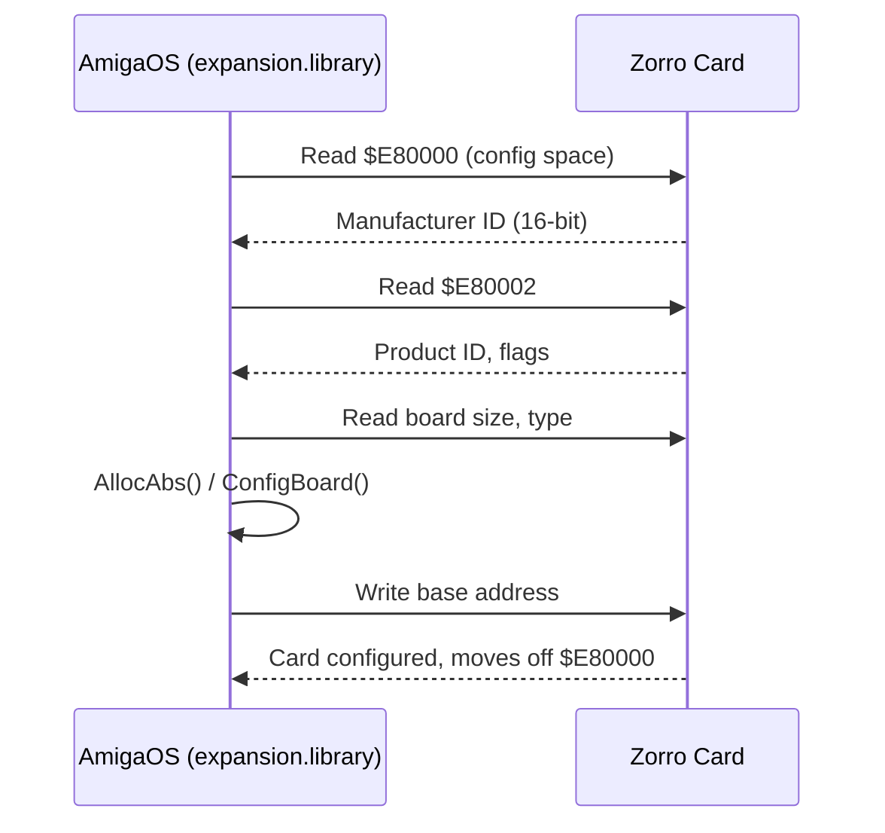

[← Home](../../README.md) · [Hardware](../README.md)

# Zorro Bus — Expansion Architecture

## Overview

The Amiga uses the **Zorro** expansion bus for add-on cards. There are two generations:

- **Zorro II** — 16-bit, 24-bit addressing, 7 MHz, compatible with A2000/A3000/A4000
- **Zorro III** — 32-bit, 32-bit addressing, up to 33 MHz burst, A3000/A4000 only

Zorro uses **AutoConfig** — a standardised plug-and-play configuration protocol that predates PCI by several years.

## Zorro II

| Parameter | Value |
|---|---|
| Data bus | 16-bit |
| Address bus | 24-bit |
| Clock | 7.14 MHz (bus cycle ≈ 280 ns) |
| Max transfer | ~5 MB/s (DMA) |
| Address space | $A00000–$EFFFFF (I/O), $200000–$9FFFFF (RAM) |
| Slots | 5 (A2000), 3 (A3000) |

Zorro II cards appear in the 16 MB address space. RAM cards are configured into $200000–$9FFFFF. I/O cards use $A00000–$DEFFFF.

## Zorro III

| Parameter | Value |
|---|---|
| Data bus | 32-bit |
| Address bus | 32-bit |
| Clock | Up to 33 MHz burst |
| Max transfer | ~40 MB/s (DMA) |
| Address space | $01000000 and above |
| Slots | 4 (A3000), 5 (A4000) |

Zorro III extends into the 32-bit address space, allowing large RAM cards (32–128 MB) and fast peripherals. Requires a 32-bit CPU (68030+) and OS support.

## AutoConfig Protocol

AutoConfig allows the OS to discover and configure cards without jumpers:



**Key AutoConfig registers** (read from $E80000–$E8007F before configuration):

| Offset | Content |
|---|---|
| $00 | er_Type (board type: RAM/IO, Zorro II/III) |
| $02 | er_Product (product ID) |
| $04 | er_Flags |
| $06 | er_Reserved03 |
| $08–$0A | er_Manufacturer (16-bit) |
| $0C–$0F | er_SerialNumber |
| $10–$11 | er_InitDiagVec (diagnostic ROM vector) |

**Board types** (`er_Type` bits):
```c
#define ERT_TYPEMASK   0xC0
#define ERT_ZORROII    0xC0   /* Zorro II card */
#define ERT_ZORROIII   0x80   /* Zorro III card */
#define ERTB_MEMLIST   5      /* board is RAM, add to free list */
#define ERTB_DIAGVALID 4      /* DiagArea ROM is valid */
#define ERTB_CHAINEDCONFIG 3  /* more boards to configure */
```

## expansion.library

AmigaOS provides `expansion.library` to manage Zorro configuration:

```c
#include <libraries/expansion.h>
#include <clib/expansion_protos.h>

/* Find a configured board by manufacturer/product */
struct ConfigDev *cd = NULL;
while ((cd = FindConfigDev(cd, MANUF_ID, PROD_ID)) != NULL) {
    APTR base = cd->cd_BoardAddr;
    ULONG size = cd->cd_BoardSize;
    /* use board at base */
}
```

**Key structures:**
```c
struct ConfigDev {
    struct Node    cd_Node;
    UBYTE          cd_Flags;
    UBYTE          cd_Pad;
    struct ExpansionRom cd_Rom;   /* copy of autoconfig ROM area */
    APTR           cd_BoardAddr;  /* configured base address */
    ULONG          cd_BoardSize;
    UWORD          cd_SlotAddr;
    UWORD          cd_SlotSize;
    APTR           cd_Driver;
    struct ConfigDev *cd_NextCD;
    ULONG          cd_Unused[4];
};
```

## DiagArea — Card ROM

Cards with `ERTB_DIAGVALID` have a small ROM (DiagArea) that the OS calls during boot:

```c
struct DiagArea {
    UBYTE da_Config;     /* flags */
    UBYTE da_Flags;
    UWORD da_Size;
    UWORD da_DiagPoint; /* offset to diagnostic code */
    UWORD da_BootPoint; /* offset to boot code */
    UWORD da_Name;      /* offset to name string */
    UWORD da_Reserved01;
    UWORD da_Reserved02;
};
```

The boot vector is called by `ConfigChain()` during the early boot sequence — this is how SCSI controllers install their filesystem handlers.

## References

- NDK39: `libraries/expansion.h`, `libraries/configregs.h`, `libraries/configvars.h`
- ADCD 2.1 Autodocs: `expansion` — http://amigadev.elowar.com/read/ADCD_2.1/Includes_and_Autodocs_3._guide/node025B.html
- *Amiga Hardware Reference Manual* 3rd ed. — AutoConfig chapter
- Dave Haynie's Zorro III specification documents
