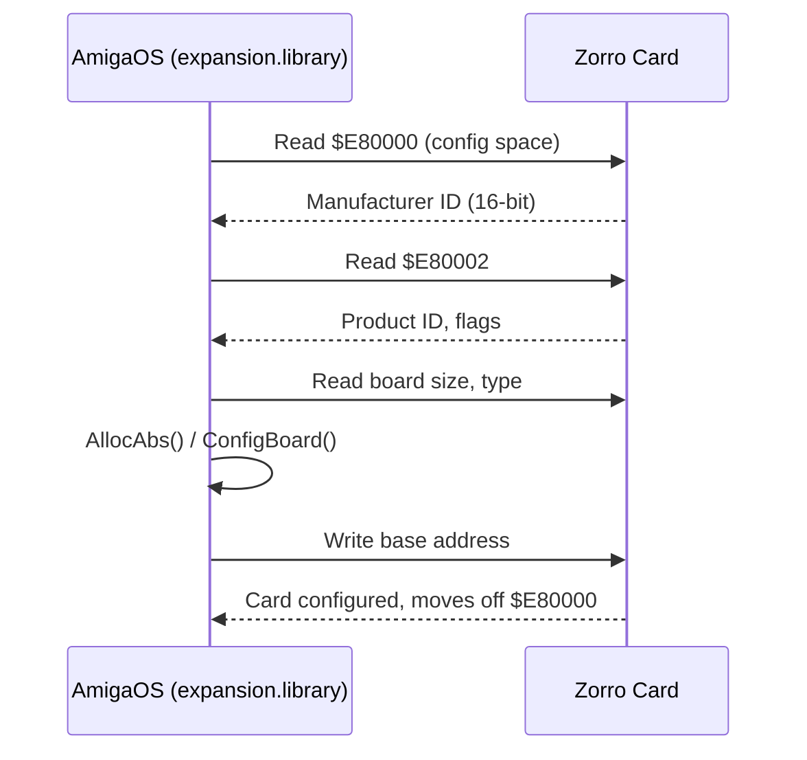

[← Home](../../README.md) · [Hardware](../README.md)

# Zorro Bus — Expansion Architecture

## Overview

The Amiga uses the **Zorro** expansion bus for add-on cards. There are two generations:

- **Zorro II** — 16-bit, 24-bit addressing, 7 MHz, compatible with A2000/A3000/A4000
- **Zorro III** — 32-bit, 32-bit addressing, up to 33 MHz burst, A3000/A4000 only

Zorro uses **AutoConfig** — a standardised plug-and-play configuration protocol that predates PCI by several years.

## Zorro II

| Parameter | Value |
|---|---|
| Data bus | 16-bit |
| Address bus | 24-bit |
| Clock | 7.14 MHz (bus cycle ≈ 280 ns) |
| Max transfer | ~5 MB/s (DMA) |
| Address space | $A00000–$EFFFFF (I/O), $200000–$9FFFFF (RAM) |
| Slots | 5 (A2000), 3 (A3000) |

Zorro II cards appear in the 16 MB address space. RAM cards are configured into $200000–$9FFFFF. I/O cards use $A00000–$DEFFFF.

## Zorro III

| Parameter | Value |
|---|---|
| Data bus | 32-bit |
| Address bus | 32-bit |
| Clock | Up to 33 MHz burst |
| Max transfer | ~40 MB/s (DMA) |
| Address space | $01000000 and above |
| Slots | 4 (A3000), 5 (A4000) |

Zorro III extends into the 32-bit address space, allowing large RAM cards (32–128 MB) and fast peripherals. Requires a 32-bit CPU (68030+) and OS support.

## AutoConfig Protocol

AutoConfig allows the OS to discover and configure cards without jumpers:



**Key AutoConfig registers** (read from $E80000–$E8007F before configuration):

| Offset | Content |
|---|---|
| $00 | er_Type (board type: RAM/IO, Zorro II/III) |
| $02 | er_Product (product ID) |
| $04 | er_Flags |
| $06 | er_Reserved03 |
| $08–$0A | er_Manufacturer (16-bit) |
| $0C–$0F | er_SerialNumber |
| $10–$11 | er_InitDiagVec (diagnostic ROM vector) |

**Board types** (`er_Type` bits):
```c
#define ERT_TYPEMASK   0xC0
#define ERT_ZORROII    0xC0   /* Zorro II card */
#define ERT_ZORROIII   0x80   /* Zorro III card */
#define ERTB_MEMLIST   5      /* board is RAM, add to free list */
#define ERTB_DIAGVALID 4      /* DiagArea ROM is valid */
#define ERTB_CHAINEDCONFIG 3  /* more boards to configure */
```

## expansion.library

AmigaOS provides `expansion.library` to manage Zorro configuration:

```c
#include <libraries/expansion.h>
#include <clib/expansion_protos.h>

/* Find a configured board by manufacturer/product */
struct ConfigDev *cd = NULL;
while ((cd = FindConfigDev(cd, MANUF_ID, PROD_ID)) != NULL) {
    APTR base = cd->cd_BoardAddr;
    ULONG size = cd->cd_BoardSize;
    /* use board at base */
}
```

**Key structures:**
```c
struct ConfigDev {
    struct Node    cd_Node;
    UBYTE          cd_Flags;
    UBYTE          cd_Pad;
    struct ExpansionRom cd_Rom;   /* copy of autoconfig ROM area */
    APTR           cd_BoardAddr;  /* configured base address */
    ULONG          cd_BoardSize;
    UWORD          cd_SlotAddr;
    UWORD          cd_SlotSize;
    APTR           cd_Driver;
    struct ConfigDev *cd_NextCD;
    ULONG          cd_Unused[4];
};
```

## DiagArea — Card ROM

Cards with `ERTB_DIAGVALID` have a small ROM (DiagArea) that the OS calls during boot:

```c
struct DiagArea {
    UBYTE da_Config;     /* flags */
    UBYTE da_Flags;
    UWORD da_Size;
    UWORD da_DiagPoint; /* offset to diagnostic code */
    UWORD da_BootPoint; /* offset to boot code */
    UWORD da_Name;      /* offset to name string */
    UWORD da_Reserved01;
    UWORD da_Reserved02;
};
```

The boot vector is called by `ConfigChain()` during the early boot sequence — this is how SCSI controllers install their filesystem handlers.

## Real-World Performance & Bottlenecks

While the theoretical speeds are high, real-world Zorro performance is often gated by the Amiga's system bus controller and motherboard design.

### The "Buster" Bottleneck
In the A3000 and A4000, the **Buster** chip manages Zorro III traffic. 
- **Revision 9**: Contained bugs that made Zorro III DMA unstable or slow.
- **Revision 11**: The "Golden" revision. It fixed several timing bugs and allowed for reliable **Burst Mode** transfers, which are essential for reaching speeds above 10 MB/s.

### Bandwidth Comparison (Real-World)

| Interface | Effective CPU-to-VRAM | Notes |
|---|---|---|
| **Zorro II** | ~2.5 – 3.5 MB/s | Gated by 7 MHz 68000 bus timing. |
| **Zorro III** | ~10 – 15 MB/s | Requires Buster 11 and a 68040/060. |
| **PCI Bridge** | ~20 – 30 MB/s | Limited by the Zorro-to-PCI bridge interface. |
| **Local Bus** | **~60 – 80 MB/s** | Bypasses Zorro; uses CPU-slot (CyberStorm PPC). |

### 2. PCI Bridgeboards (Mediator, G-REX, Prometheus)
PCI bridges allowed the Amiga to break out of the aging Zorro ecosystem and tap into the vast, cheap pool of PC hardware.

#### Hardware Architecture
*   **Mediator (Elbox)**: The most popular solution. It consists of a "Logic Board" (containing GALs/CPLDs) and a "Busboard." It uses a **Memory Windowing** technique (typically 8MB) to map the vast 4GB PCI address space into the Amiga's 24-bit or 32-bit space.
*   **G-REX (DCE)**: Designed for high-end PowerPC systems. It connects directly to the **CPU local slot** of a BlizzardPPC or CyberStormPPC. Unlike the Mediator, it uses **Linear Mapping**, making the entire PCI memory space directly addressable without window switching, resulting in superior performance.
*   **Prometheus (Mayap/Individual Computers)**: A simpler Zorro III-to-PCI bridge using a single PLX bridge chip.

#### Software & Libraries
*   **pci.library**: The standard API for PCI hardware on the Amiga. It handles resource allocation (BARs), interrupt routing, and device discovery.
*   **OpenPCI**: An open-source alternative library designed to provide a unified driver interface across different bridge brands.
*   **Mediator Multimedia CD**: The proprietary driver suite from Elbox, required for many of their advanced features (like using a graphics card's VRAM as system Fast RAM).

#### Supported PCI Cards
| Category | Supported Models | Notable Drivers |
|---|---|---|
| **Graphics** | 3dfx Voodoo 3/4/5, ATI Radeon 9200/9250, S3 ViRGE | Picasso96, CyberGraphX v4 |
| **Sound** | Sound Blaster 128, ESS Solo-1, ForteMedia FM801 | AHI (Amiga Hardware Interface) |
| **Networking** | Realtek 8139 (10/100 Mbps) | SANA-II (Roadshow, Genesis) |
| **USB** | NEC-based cards (e.g., Elbox Spider) | Poseidon USB Stack |
| **TV/Video** | Brooktree Bt848/878 based cards | TVPaint, VGR |

> [!TIP]
> **Mediator VRAM trick**: One of the most powerful features of the Mediator is the ability to use the 128MB+ of RAM on a Radeon card as system Fast RAM. While slower than local motherboard RAM, it is significantly faster than swapping to a hard drive.

### 3. FPGA-Based Modern Cards
Modern Zorro cards like the **MNT ZZ9000** use an FPGA to provide RTG, Ethernet, and USB. They often include an ARM processor or specialized hardware logic to perform operations (like JPEG decoding) locally on the card, reducing the amount of raw data that needs to be sent over the Zorro bus.

*   **Product Page**: [MNT ZZ9000](https://mntre.com/zz9000)
*   **Official Sources (GitLab)**: [Firmware & Drivers](https://source.mnt.re/amiga)

## References

- NDK39: `libraries/expansion.h`, `libraries/configregs.h`, `libraries/configvars.h`
- ADCD 2.1 Autodocs: `expansion` — http://amigadev.elowar.com/read/ADCD_2.1/Includes_and_Autodocs_3._guide/node025B.html
- *Amiga Hardware Reference Manual* 3rd ed. — AutoConfig chapter
- Dave Haynie's Zorro III specification documents
- Mediator PCI Technical Reference — http://www.elbox.com/mediator_tech.html
