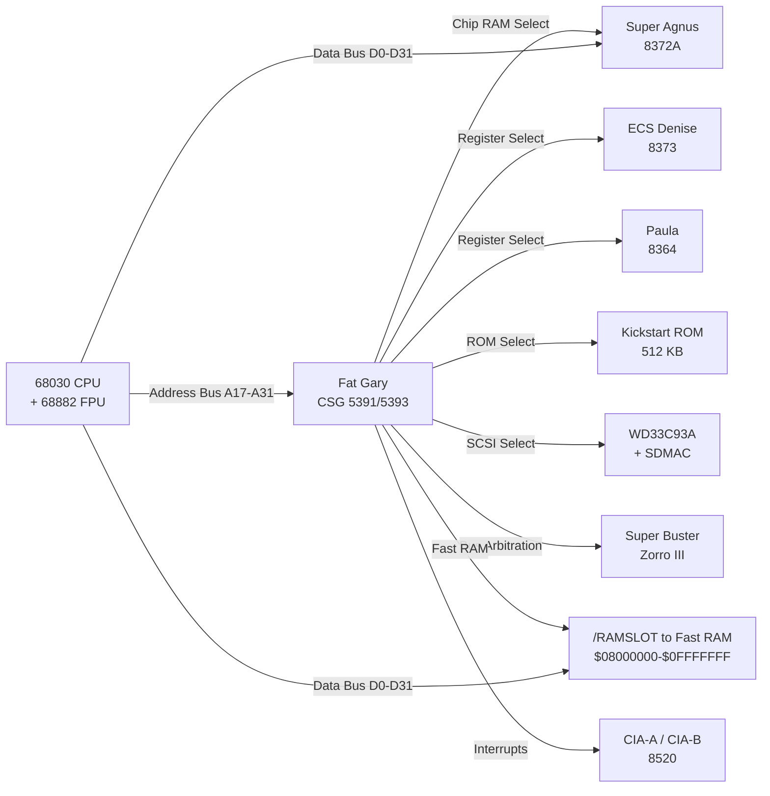

[← Home](../../README.md) · [Hardware](../README.md) · [ECS](README.md)

# Gary & Fat Gary — Amiga System Controller Gate Array

## Overview

The **Gary** chip (CSG 5719, "Gate Array") is a custom ASIC that consolidates the system glue logic which, in the original Amiga 1000, required dozens of discrete 74-series TTL ICs and PAL devices. It was first deployed in the Amiga 500 and Amiga 2000 (revision 4.x+) in 1987. Its 32-bit successor, **Fat Gary** (CSG 5391/5393, Commodore P/N 390540-02), debuted in the Amiga 3000 (1990) to support the 68030's full 32-bit address and data busses alongside Zorro III expansion. Together, these two chips span the entire Amiga lineup from the A500 through the A4000T.

Gary is **not directly programmable by user software** — it has no memory-mapped registers that applications can read or write. Its behavior is determined by hardware strapping resistors (pull-ups/pull-downs on specific pins at power-on) and the Kickstart ROM initialization sequence. This makes it fundamentally different from Agnus or Paula, which have rich register files at $DFFxxx.

> [!NOTE]
> The A4000 desktop model does **not** use Gary. It uses **Ramsey** (DRAM controller), **Budgie** (bus bridge), and **Super Buster** (Zorro III arbitration). The A4000T uses Fat Gary. The A600/A1200 use **Gayle** (which integrates IDE and PCMCIA control on top of Gary-like logic).

---

## Architecture — Where Gary Sits

Gary is the central "traffic cop" between the CPU, custom chips, expansion bus, and peripherals. It decodes the upper address lines (A17–A23 on original Gary, A24–A31 on Fat Gary) to generate chip-select signals for every device on the motherboard:



**Key principle**: Gary does NOT sit on the data bus — it only watches address lines and generates control strobes. Data flows directly between the CPU and the selected device. This is the classic "address decoder + chip select" pattern used in all Northbridge chips.

---

## Gary vs Fat Gary — Evolution

| Feature | Original Gary (CSG 5719) | Fat Gary (CSG 5391/5393) |
|---|---|---|
| **Package** | 48-pin DIP | 84-pin PLCC (or PGA) |
| **Address bus** | 24-bit (A1–A23) | 32-bit (A0–A31) |
| **Data bus support** | 16-bit (68000 bus) | 32-bit (68030/68040 bus) |
| **Machines** | A500, A2000 (rev 4.x+), CDTV | A3000, A3000T, A4000T |
| **Zorro support** | Zorro II (via Buster 5721) | Zorro III (via Super Buster) |
| **SCSI glue** | None (external controller needed) | WD33C93A + SDMAC chip selects |
| **FPU decode** | Not supported | Dedicated FPU chip select |
| **Cache control** | None | /CIIN line for cache-inhibit |
| **Fast RAM decode** | Via Zorro II only | /RAMSLOT at $08000000–$0FFFFFFF |
| **Clock input** | 3.58 MHz (C1), 7.16 MHz (NCDAC) | 25–50 MHz (68030 bus clock) |
| **Interrupt lines** | IPL0–IPL2 (standard 68K) | /INT2, /INT6 + encoded /IPL0–/IPL2 |
| **Power** | 500 mW at 5 V | ~2 A at 5 V (bus driving) |

### Why "Fat" Gary?

Commodore's naming convention was characteristically informal. The original Gary (CSG 5719) handled the 68000's 24-bit address space. When the A3000 needed a 32-bit version, the engineers called it "Fat Gary" — it was the same gate array concept but with a wider bus interface, more pins, and additional decode logic for the 68030-specific features (FPU chip select, cache-inhibit, burst-mode awareness). The name stuck internally and entered community usage through Dave Haynie's developer notes.

---

## What Gary Decodes — Address Map

The following table shows the address ranges decoded by Fat Gary in the A3000. Original Gary uses a subset (no $08000000 range, no SCSI, no FPU).

| Address Range | Size | Selected Device | /CS Signal | Notes |
|---|---|---|---|---|
| `$000000–$1FFFFF` | 2 MB | Chip RAM | Via Agnus | Controlled by Agnus, not Gary directly |
| `$002000–$07FFFF` | ~0.5 MB | Custom Chip Registers | /CxREG | $DFF000–$DFF1FE (ECS), $DFF000–$DFFxxx (AGA) |
| `$080000–$0FFFFF` | 8 MB | Motherboard Fast RAM | /RAMSLOT | Fat Gary only; up to 8 MB on A3000 motherboard |
| `$100000–$7FFFFF` | 7 MB | Zorro III Expansion Space | Via Buster | Configuration + I/O + memory space |
| `$800000–$BFFFFF` | 4 MB | Zorro II I/O Space | Via Buster | Legacy Zorro II compatibility |
| `$C00000–$DFFFFF` | 2 MB | Internal I/O | Various | CIA, RTC, SCSI, UART (A3000) |
| `$E00000–$E7FFFF` | 512 KB | Reserved / Coprocessor | — | Often unused on A3000 |
| `$E80000–$EFFFFF` | 512 KB | FPU (68881/68882) | /FPUCS | Fat Gary only; decoded from A19–A23 |
| `$F00000–$F7FFFF` | 512 KB | Kickstart ROM (first half) | /ROMCS0 | ROM overlay at boot |
| `$F80000–$FFFFFF` | 512 KB | Kickstart ROM (second half) | /ROMCS1 | Extended ROM or second 256 KB |

> [!NOTE]
> The FPU at `$E80000` is decoded by Fat Gary, not by the 68030 itself. The 68030 does not have a dedicated coprocessor chip select — it treats the 68881/68882 as a memory-mapped peripheral. Gary generates /FPUCS when it sees an address in `$E80000–$EFFFFF` during a CPU bus cycle. This is why the FPU appears at this address on the A3000 rather than at the coprocessor ID space that the 68030 natively supports.

---

## Bus Arbitration

Gary manages the fundamental challenge of the Amiga architecture: multiple bus masters contending for a single shared bus.

### Arbitration Hierarchy

| Priority | Master | Bus Grant Signal | Can Be Stalled? |
|---|---|---|---|
| 1 (Highest) | Custom Chip DMA (Agnus) | /CDMAC → /BGACK | Never — display/audio/disk must run in real time |
| 2 | 68030 CPU | /BR → /BG from Gary | Yes — held off during DMA cycles |
| 3 | Zorro III Bus Masters | Via Super Buster → Gary | Yes — lowest priority |
| 4 | 68882 FPU | Shares CPU /BR signal | Yes — FPU is coprocessor to CPU |

### DMA Contention Mechanics

When Agnus needs a bus cycle (e.g., to fetch bitplane data for the next scanline pixel), the following sequence occurs:

1. **Agnus asserts /CDMAC** — a dedicated DMA request line to Gary
2. **Gary asserts /BR** (Bus Request) to the 68030
3. **68030 finishes current bus cycle**, asserts /BG (Bus Grant), floats address/data busses
4. **Gary asserts /BGACK** to hold the 68030 off, then grants Agnus its cycle
5. **Agnus performs one DMA word transfer** — takes ~280 ns (2 CPU cycles at 7.14 MHz)
6. **Agnus releases /CDMAC** — Gary de-asserts /BGACK, 68030 resumes

This cycle repeats for every bitplane fetch, sprite fetch, audio sample, and disk byte. At high resolutions (640×256×4 bitplanes ≈ 128 DMA slots per scanline), the 68030 can lose 30–40% of its bus bandwidth to DMA contention. This is why A3000 accelerators that move execution to a local Fast RAM card (off the shared bus) see dramatic performance gains — the CPU runs unimpeded while DMA cycles occur on the motherboard bus.

> [!WARNING]
> Accelerator cards on the A3000 CPU slot **must** correctly implement the /BR, /BG, and /BGACK protocol with Gary. Cards that ignore /BGACK and continue driving the bus during DMA cycles cause screen corruption (garbage pixels from double-driven data lines) and can physically damage bus transceivers. This is a known failure mode with some early third-party accelerators.

### Fat Gary's Arbitration Precision

The Fat Gary specification (390540-02) specifies **20 ns resolution** for arbitration timing. This means Gary can switch bus mastership in a single 50 MHz clock cycle. Compared to original Gary's discrete-TTL-era timing (which was measured in hundreds of nanoseconds), this is essential for the A3000's 25 MHz 68030 — the bus can be handed back and forth quickly enough that neither CPU nor DMA starves.

---

## Interrupt Controller

Gary encodes interrupt signals from multiple sources into the 68030's three encoded interrupt level lines (/IPL0, /IPL1, /IPL2).

| Interrupt Source | Gary Input | Encoded Level | Priority |
|---|---|---|---|
| Vertical Blank | /INT2 (from Agnus) | Level 2 | Low (68K vector $68) |
| CIA-A / CIA-B | /INT6 (from CIAs) | Level 6 | High (68K vector $78, shared) |
| SCSI Controller | /INT2 via SDMAC | Level 2 | Shared with VBlank |
| Zorro III Cards | /INT2 or /INT6 (via Buster) | Level 2 or 6 | Per-card configuration |
| External Interrupt | /EINT (from CPU slot) | Level 2 or 6 | Accelerator use |

**Key detail**: On the original Gary (A500/A2000), Paula handles some interrupt encoding. On Fat Gary (A3000), the interrupt routing is more centralized through Gary, with Paula's IRQ output feeding into Gary's interrupt encoder. This is why the A3000 interrupt latency can be slightly different from the A500 — the additional gate delay through Gary adds ~5–10 ns of propagation time.

### Interrupt Acknowledge Cycle

When the 68030 receives an interrupt, it performs an **IACK cycle** (Interrupt Acknowledge) — a special bus cycle where the CPU reads the vector number from the interrupting device. Gary participates in this cycle by:

1. Detecting the IACK cycle (FC2–FC0 = 111 on the 68030 function code lines)
2. Routing the IACK to the highest-priority pending interrupt source
3. Ensuring the vector number ($64–$78) appears on D0–D7 during the acknowledge

This is handled transparently — Amiga software never interacts with Gary's interrupt logic directly.

---

## A3000 SCSI Integration

### The Two-Chip SCSI Subsystem

The A3000's built-in SCSI uses two chips that Gary glues together:

| Chip | Part | Function | Gary Role |
|---|---|---|---|
| **SBIC** | WD33C93A | SCSI Bus Interface Controller — handles SCSI protocol (arbitration, selection, command/status/data phases) | Decodes /SBIC chip select at $DD0040 |
| **SDMAC** | Commodore custom | SCSI DMA Controller — transfers data directly between SCSI chip and Chip RAM without CPU involvement | Decodes /SDMACCS, routes DMA cycles through bus arbitration |

> [!NOTE]
> The A3000's SDMAC is a **different chip** from the A2091/CDTV DMAC, despite both interfacing with WD33C93 SCSI controllers. The register layouts are incompatible. The SDMAC supports 32-bit addressing and can DMA to any address in the A3000's 2 MB Chip RAM window; the A2091 DMAC is limited to 24-bit addressing.

### SCSI Boot Integration

Gary's role at boot is critical for SCSI:

1. At power-on, Gary asserts /ROMCS0 to map Kickstart ROM at $F00000
2. Kickstart initializes exec.library, then scans for resident modules
3. `scsi.device` (in ROM) probes the WD33C93A via Gary's /SBIC chip select
4. Gary decodes the probe address and routes it to the SCSI chip
5. If a SCSI disk is found, Kickstart reads the RDB from block 0
6. Gary's bus arbitration handles the DMA transfer from SDMAC transparently

The entire boot sequence works because Gary decodes the SCSI addresses without any software initialization — it's "on" from the moment power stabilizes.

---

## AutoConfig Controller

Gary orchestrates the Zorro expansion bus AutoConfig sequence at boot. The process:

1. **Kickstart probes Zorro space** starting at $E80000 (Zorro II) or $100000–$7FFFFF (Zorro III)
2. **Gary decodes the probe address** and routes it to Super Buster via the bus grant lines
3. **Super Buster asserts /CFGIN** to the first card in the daisy chain
4. **Each card responds** with its AutoConfig ROM (product ID, manufacturer, memory requirements, driver code)
5. **Kickstart assigns address space** and writes the base address back to the card's configuration register
6. **Gary generates /CFGOUT** to pass configuration to the next card in the chain
7. Repeat until no card responds to /CFGIN

Gary does NOT read the AutoConfig data — it only generates the chip select and configuration strobes. The actual AutoConfig protocol is implemented by Kickstart software and Super Buster hardware. Gary is the address decoder and bus-cycle router.

---

## Chip Variants and Machine Assignment

| CSG Part # | Commodore P/N | Name | Package | Machines | Notes |
|---|---|---|---|---|---|
| 5718 | — | Gary | 48-pin DIP | A2000 (early rev 4.x) | Original version; some early boards |
| 5719 | 318070-01 | Gary | 48-pin DIP | A500, A2000 (rev 6+), CDTV | Standard version; most common |
| 5391 | 390540-01 | Fat Gary (Level 1) | 84-pin PLCC | A3000 (early rev) | Pre-production; rare |
| 5393 | 390540-02 | Fat Gary (Level 2) | 84-pin PLCC | A3000 (rev 6+), A3000T, A4000T | Production version; full Zorro III |

**Revision identifiers**: The Level 2 Fat Gary (5393) is marked with die revision "13H" or later. Early Level 1 chips (5391) lack full Zorro III asynchronous cycle support and may have issues with certain Zorro III DMA cards.

---

## Detecting Gary at Runtime

Since Gary has no readable registers, software must identify it **indirectly**:

### Method 1: ExecBase AttnFlags (Coarse Detection)
```c
/* From exec/execbase.h */
struct ExecBase *SysBase = *((struct ExecBase **)4);

if (SysBase->AttnFlags & AFF_68030) {
    /* 68030 present → likely A3000 → Fat Gary */
    /* But could also be an A2000 with 68030 accelerator — not conclusive */
}
```

### Method 2: Graphics ChipRevBits0 (ECS Detection)
```c
/* From graphics/gfxbase.h */
struct GfxBase *GfxBase = (struct GfxBase *)OpenLibrary("graphics.library", 37);

if (GfxBase->ChipRevBits0 & GFXB_HR_AGNUS) {
    /* Super Agnus present → ECS → could be A3000 or A600 */
    /* Still not conclusive for Gary-specific detection */
}
```

### Method 3: AutoConfig Product ID (Conclusive)
```c
/* Scan Zorro expansion for known A3000-specific resources.
 * The A3000's motherboard resources (SCSI, RAM, etc.) appear
 * as AutoConfig entries with manufacturer ID 0x0202 (Commodore). */

struct ExpansionBase *ExpansionBase;
struct ConfigDev *cd = NULL;

ExpansionBase = (struct ExpansionBase *)OpenLibrary("expansion.library", 37);
if (ExpansionBase) {
    while ((cd = FindConfigDev(cd, 0x0202 /* CBM */, -1 /* any product */))) {
        /* A3000 motherboard SCSI: product 0x03 */
        /* A3000 motherboard RAM: product 0x02 */
        if (cd->cd_Rom.er_Manufacturer == 0x0202 &&
            cd->cd_Rom.er_Product == 0x03) {
            /* SCSI controller found → Gary or Fat Gary is present */
        }
    }
    CloseLibrary((struct Library *)ExpansionBase);
}
```

### Method 4: Probe Known Addresses (Hack — Use Sparingly)

Gary controls the FPU chip select at $E80000. You can test whether an FPU is present at this address:

```asm
; 68k: probe for FPU via Gary's $E80000 decode
; This ONLY works on A3000/A4000T with Fat Gary + 68881/68882
; Returns: D0 = 0 (no FPU), nonzero (FPU present)

    moveq   #0,d0           ; assume no FPU
    lea     $E80000,a0      ; Fat Gary FPU decode address
    moveq   #0,d1
    pmove   d1,fpcr         ; attempt FPU instruction
    tst.b   (a0)            ; probe — if FPU absent, bus error
    moveq   #1,d0           ; reached → FPU present
    rts
; WARNING: bus error if no FPU — requires trap handler
```

> [!NOTE]
> There is no universally reliable way for software to detect "Gary is present" vs "Gayle is present" vs "Ramsey+Budgie is present." The AmigaOS device driver model was designed so that software never needs to know which system controller chip is in use — it talks to `scsi.device`, `expansion.library`, and `timer.device`, not to Gary directly.

---

## Gary vs Gayle vs Ramsey/Budgie/Buster — Decision Guide

| Criterion | Gary (A500/A2000/CDTV) | Fat Gary (A3000) | Gayle (A600/A1200) | Ramsey+Budgie (A4000) |
|---|---|---|---|---|
| **When to target** | Writing for OCS machines, floppy-only code | Writing A3000-specific SCSI or FPU code | IDE hard disk access on wedge models | A4000 motherboard Fast RAM or Zorro III DMA |
| **Address bus width** | 24-bit | 32-bit | 24-bit (but with 32-bit CPU) | 32-bit |
| **Direct register access** | None — opaque | None — opaque | /GAYLE_ID at $DE0000 (read-only ID byte) | Ramsey DRAM config registers at $C00000 |
| **SCSI support** | None | WD33C93A + SDMAC | None (IDE instead) | NCR 53C710 + A4091 (A4000T) |
| **OS version required** | Any (1.2+) | 1.4+ (A3000 shipped 1.4/2.0) | 2.05+ (A600), 3.0+ (A1200) | 3.0+ |
| **FPGA implementation difficulty** | Low (simple address decoder) | Medium (arbitration timing, 20 ns precision) | Medium (IDE timing emulation) | High (DRAM controller, refresh cycles) |

---

## When to Care About Gary / When NOT to

### When to Care

- **Writing an accelerator card**: Must correctly implement /BR, /BG, /BGACK handshake with Gary
- **Porting Kickstart to new hardware**: Must configure Gary's board-strap options (ROM overlay, FPU presence, RAM size)
- **Building an FPGA Amiga core (MiSTer/Minimig)**: Gary's arbitration timing is precision-critical — 20 ns resolution
- **Debugging A3000 SCSI issues**: The WD33C93A ↔ SDMAC ↔ Gary interaction is a known source of DMA problems
- **Writing system-level diagnostics**: Knowing which chip decodes what address helps narrow hardware failures
- **Understanding A3000 vs A4000 differences**: Gary vs Ramsey/Budgie explains why some accelerators work on one but not the other

### When NOT to Care

- **Writing application software**: Use `scsi.device`, `graphics.library`, `expansion.library` — never touch Gary directly
- **Writing a filesystem**: Use `dos.library` / `exec.library` I/O — the filesystem handler has no visibility into Gary
- **Porting between Amiga models**: The OS abstractions insulate you from Gary vs Gayle vs Ramsey — this is by design
- **Writing a game that only uses Chip RAM**: Agnus handles all DMA; Gary is invisible to game code
- **Writing a CLI tool**: Nothing at the shell level depends on the system controller chip

---

## Best Practices

1. **Never depend on Gary-specific behavior** — use OS abstractions (devices, libraries) that work across all Amiga models
2. **Probe SCSI via `expansion.library`**, not by hard-coding addresses — the AutoConfig database tells you what's present
3. **On A3000 accelerators, implement the full /BR→/BG→/BGACK handshake** — do NOT hold /BGACK indefinitely or you'll starve DMA
4. **Check `SysBase->AttnFlags` for CPU type**, but don't equate "68030" with "Fat Gary" — an A2000 with a 68030 accelerator has a 68030 but NOT Fat Gary
5. **Respect the FPU address at $E80000** — this is a Fat Gary convention; on A4000 the FPU lives at a different address decoded by Ramsey
6. **When emulating Gary in FPGA, simulate the 20 ns arbitration resolution** — coarser timing breaks SCSI DMA and Zorro III card initialization
7. **Test with both Level 1 (5391) and Level 2 (5393) behavior** if you're building FPGA logic — early A3000s with Level 1 have known quirks
8. **If writing a boot ROM, do not assume Gary is present** — A4000 uses Ramsey; A1200 uses Gayle; design for the AutoConfig protocol, not the chip

## Antipatterns

### 1. The Hard-Coded FPU Address

**Bad**:
```c
/* Assumes FPU is at $E80000 (Fat Gary only!) */
volatile unsigned long *fpu_base = (unsigned long *)0x00E80000;
```

**Good**:
```c
/* Use mathieeesingbas.library — it knows where the FPU lives */
struct MathIeeeSingBasBase *MathIeeeSingBasBase;
MathIeeeSingBasBase = (void *)OpenLibrary("mathieeesingbas.library", 37);
if (MathIeeeSingBasBase) {
    /* FPU is available; library handles addressing */
}
```

**Why it breaks**: On A4000 (Ramsey), the FPU decode is different. On A1200 (Gayle, no FPU), this address is unmapped and causes a bus error.

### 2. The Accelerator Ghost

**Bad**:
```c
/* Assume all 68030 systems have Gary's SCSI at $DD0040 */
UBYTE scsi_read = *(volatile UBYTE *)0x00DD0040;
```

**Good**:
```c
/* Open scsi.device and send HD_SCSICMD */
struct IOStdReq *io = CreateIORequest(port, sizeof(struct IOStdReq));
OpenDevice("scsi.device", 0, (struct IORequest *)io, 0);
/* ... use io for SCSI operations ... */
```

**Why it breaks**: An A2000 with a 68030 accelerator has NO SCSI at $DD0040 (unless an A2091 is installed). The address is unmapped.

### 3. The Bus Grant Hog

**Bad** (on accelerator firmware):
```asm
; Take the bus and keep it
        bset    #0,board_control_reg  ; assert /BR, get /BG
.loop   move.l  (a0)+,(a1)+           ; fast copy — but DMA is dead!
        subq.l  #1,d0
        bne     .loop
        bclr    #0,board_control_reg  ; release /BG
```

**Good**:
```asm
; Release bus periodically for DMA
        move.w  #256,d1               ; copy 256 longs, then yield
.copy   move.l  (a0)+,(a1)+
        subq.w  #1,d1
        bne     .copy
        bclr    #0,board_control_reg  ; release /BG
        bsr     wait_one_scanline     ; let DMA run for ~64 µs
        bset    #0,board_control_reg  ; re-acquire /BG
        sub.w   #256,d0
        bgt     .copy
```

**Why it breaks**: Holding /BGACK indefinitely starves Agnus of DMA slots. The display freezes, audio stops, and the floppy drive motor runs dry. On the A3000, SCSI DMA also stalls — disk transfers hang.

---

## Pitfalls

### 1. A4000 CPU Slot Assumptions

Some A3000 CPU slot accelerators were marketed as "A3000/A4000 compatible." They are not — the A4000 uses Ramsey for DRAM control and Super Buster for bus arbitration, while the A3000 uses Fat Gary for both. An accelerator that assumes Fat Gary-style arbitration will fail on the A4000.

**Symptom**: Accelerator works perfectly on A3000, produces black screen on A4000.

**Fix**: Check for Gary vs Ramsey at firmware init by probing the AutoConfig database or testing for the presence of Ramsey's DRAM configuration registers at $C00000.

### 2. SCSI Timeout Cascade

The WD33C93A + SDMAC + Gary combination can produce a cascading timeout failure:

1. SCSI drive is slow to respond → WD33C93A asserts /DRQ (Data Request)
2. Gary routes /DRQ to SDMAC
3. SDMAC asserts bus request, Gary grants, SDMAC starts DMA
4. If the SCSI drive stalls mid-transfer, SDMAC holds the bus indefinitely
5. Gary cannot revoke /BGACK from SDMAC (design limitation)
6. 68030 is locked off the bus → system hang

**Workaround**: The `scsi.device` in Kickstart 2.0+ implements a watchdog timer that resets the WD33C93A after ~2 seconds of inactivity. Third-party SCSI controllers (GVP, FastLane) use their own DMA engines and bypass this issue entirely.

### 3. ROM Overlay Boot Failure

At power-on, Gary maps Kickstart ROM at `$000000` (overlaying Chip RAM) so the 68030 can fetch the initial stack pointer and program counter from vectors 0 and 4. After Kickstart initializes, it writes to a **board strap register** (a write-only latch addressed at a Gary-decoded location) to disable the overlay and expose Chip RAM at `$000000`.

If the strap register write fails (e.g., a bad connection on the data bus, or a Gary revision that uses a different address), the overlay stays active and Chip RAM is never visible at `$000000`. Kickstart appears to boot but crashes when it tries to use ExecBase or any absolute address in low memory.

**Diagnosis**: The system shows a dark gray or light gray screen and hangs.

**Repair**: Re-seat Gary in its PLCC socket; check data bus continuity to the strap register latch.

---

## Use Cases

### What Kind of Software Needs Gary Awareness?

| Category | Example | Why Gary Matters |
|---|---|---|
| **Accelerator firmware** | CyberStorm, WarpEngine, GVP A3001 | Must implement bus arbitration protocol that Gary expects |
| **Zorro III card firmware** | Picasso IV, A4091 SCSI, Toccata audio | Must respond to AutoConfig strobes generated by Gary via Buster |
| **SCSI host adapter firmware** | A3000 motherboard SCSI, FastLane Z3 | DMA engine must handshake with Gary's bus arbitration |
| **Kickstart ROM development** | Custom Kickstart builds, AROS/m68k | Must write to Gary's board strap register to disable ROM overlay |
| **Hardware diagnostics** | DiagROM, Amiga Test Kit | Probes Gary-decoded addresses to isolate motherboard faults |
| **FPGA Amiga implementation** | Minimig, MiSTer, FPGA Arcade | Must replicate Gary's arbitration timing with nanosecond precision |

### Known Software That Probes Gary

- **DiagROM**: Tests /ROMCS0 and /ROMCS1 chip selects by reading ROM at mirrored addresses
- **WhichAmiga**: Detects A3000 vs A4000 by probing for Gary-typical resources (SCSI at $DD0040)
- **SysInfo**: Identifies motherboard model by scanning AutoConfig entries; uses Gary's presence as one input
- **AmigaAMP / mpega.library**: Detects FPU at $E80000; the presence and address of the FPU confirms Fat Gary

---

## Historical Context

### The Glue Logic Problem

The Amiga 1000 (1985) used approximately **30 discrete TTL chips** for system glue logic: address decoding, bus arbitration, interrupt encoding, and peripheral chip selects. This was expensive (board real estate, assembly time, failure points) and slow (signal propagation through multiple TTL gates).

Commodore's solution was the Gary gate array, designed by the Amiga hardware team led by **Dave Haynie** and fabricated by **Commodore's CSG (Commodore Semiconductor Group)**. By collapsing ~30 chips into one 48-pin ASIC, Gary:
- Reduced motherboard cost by ~$15–20 per unit
- Shrunk the A500 motherboard from the A1000's large form factor to the compact "wedge" design
- Reduced power consumption by ~2 W
- Improved reliability: fewer socketed chips, fewer solder joints, fewer field failures

### Competitive Landscape (1990)

| Platform | System Controller | Year | Integration Level |
|---|---|---|---|
| **Amiga 3000 (Fat Gary)** | CSG 5393 — custom gate array | 1990 | Single chip: address decode + arbitration + interrupt + SCSI glue |
| **Macintosh IIfx** | Custom ASICs + discrete PALs | 1990 | Multiple chips: separate address decoder, interrupt controller, SCSI controller |
| **IBM PS/2 Model 70** | Intel 82380 + discrete logic | 1988 | Two-chip solution: 82380 DMA/interrupt + external decode PALs |
| **Atari TT030** | MC68882 + discrete TTL | 1990 | No integrated system controller — all glue in discrete logic |
| **NeXTcube** | Custom "PSC" (Peripheral Subsystem Controller) | 1990 | Single ASIC — similar philosophy to Fat Gary but much more complex |

Fat Gary was competitive but not revolutionary — it was a cost-reduction measure that happened to enable the A3000's compact motherboard. NeXT's PSC chip was more sophisticated (integrated SCSI, DSP interface, and Ethernet).

### The Ramsey / Budgie Fork

By 1992, Commodore knew the A4000 needed more than Fat Gary could provide:
- The A4000's interleaved DRAM banks required a real **DRAM controller** with refresh timers (Ramsey)
- The A4000 needed a bridge between the 32-bit CPU bus and the 16-bit Chip bus (Budgie)
- Zorro III arbitration was split off to **Super Buster** (revision 11), removing that burden from the system controller

This is why the A4000 system controller architecture is **3 chips** (Ramsey + Budgie + Super Buster) while the A3000 does everything with **1 chip** (Fat Gary + Super Buster for Zorro). The A4000's approach is more modular but more expensive; the A3000's approach is more integrated but harder to upgrade.

---

## Modern Analogies

| Amiga Concept | Modern Equivalent | Why the Analogy Holds | Where It Breaks |
|---|---|---|---|
| **Fat Gary** | **Northbridge** (Intel P45, AMD 990FX) | Both decode address ranges into chip selects, manage bus arbitration between CPU/DMA, and route interrupts | Modern Northbridges have configuration registers (PCI config space); Gary is hard-wired with no software interface |
| **Gary's AutoConfig strobes** | **PCI Express enumeration** (BIOS/UEFI) | Both probe the bus, assign address space, and load option ROMs | PCIe uses in-band messaging (TLP packets); Gary uses out-of-band sideband signals (/CFGIN, /CFGOUT) |
| **Board strap register** | **GPIO strap pins / devicetree** | Both set hardware configuration at boot via static pin states | Modern straps are read by firmware and stored in variables; Gary's strap register is write-once and read-never |
| **Gary's bus arbitration** | **Intel QPI / AMD HyperTransport arbitration** | Both manage shared bus access among multiple masters with priority levels | QPI uses distributed arbitration with credit-based flow control; Gary uses a centralized priority encoder |
| **A3000 SCSI DMA via Gary+SDMAC** | **AHCI / NVMe DMA engine** | Both offload data transfer to a dedicated DMA controller transparent to the CPU | Modern DMA engines have descriptor rings and scatter-gather lists; SDMAC is a simple continuous linear DMA |

---

## Impact on FPGA / Emulation

### Critical Timing Requirements

Gary's arbitration protocol is **timing-sensitive**, not just logic-correct. An FPGA implementation must:

1. **Respect 20 ns arbitration resolution**: Gary switches bus ownership in one CPU clock cycle (50 MHz A3000). If the FPGA's state machine takes longer, DMA slots are missed, causing display glitches (flickering pixels, missing scanlines).
2. **Match propagation delays**: The original Gary has ~7 ns gate delay from address inputs to chip-select outputs. If the FPGA is too fast, chip selects may assert before address lines stabilize. If too slow, SCSI DMA may miss its transfer window.
3. **Simulate /BGACK assertion timing**: /BGACK must assert within 1.5 clock cycles of /BG being received. Coarser timing causes the 68030 to proceed with a bus cycle that Gary intended to block — data corruption.

### Known FPGA Implementations

| FPGA Core | Gary Model | Status | Notes |
|---|---|---|---|
| **Minimig** (Dennis van Weeren) | Original Gary (5719) | Working | Used in OCS/ECS Minimig cores; timing relaxed for TG68K |
| **MiSTer Minimig** | Original Gary (5719) | Working | ECS support; Fat Gary not yet implemented (no A3000 SCSI simulation) |
| **FPGA Arcade Replay** | Fat Gary (5393) | Partial | A3000 mode in development; arbitration timing is the main challenge |
| **Apollo 68080 (Vampire)** | N/A | N/A | Does not emulate Gary — the SAGA chipset replaces all custom chips with a modern architecture |

### Emulation Test Checklist

For FPGA developers implementing Fat Gary:

- [ ] SCSI DMA transfers complete without timeout (WD33C93A → SDMAC → Gary arbitration)
- [ ] Zorro III cards enumerate correctly via AutoConfig
- [ ] ROM overlay disabled correctly after Kickstart init (check Chip RAM visible at $000000)
- [ ] FPU accessible at $E80000 when 68882 is configured
- [ ] Interrupt acknowledge cycles return correct vectors ($64–$78)
- [ ] /BGACK released within one scanline (63.5 µs) to prevent display corruption
- [ ] Level 2 (5393) behavior: all Zorro III asynchronous cycles work

---

## FAQ

### Q: Can I read Gary's configuration from software?

No. Gary has no readable registers. Its configuration is set at power-on by hardware strapping (resistor pull-ups/downs on specific pins). There is no way for software to query Gary's state.

### Q: How do I know if my A3000 has a Level 1 or Level 2 Fat Gary?

Open the case and read the chip marking. Level 1 is CSG 5391 (or marked "390540-01"). Level 2 is CSG 5393 (or marked "390540-02", die rev 13H+). If you can't open the case, install a Zorro III DMA card — Level 1 Gary will show data corruption under heavy DMA; Level 2 will work.

### Q: Does the A3000T use a different Gary from the A3000 desktop?

No. Both use the same Fat Gary (CSG 5393, P/N 390540-02). The A3000T differs only in form factor and drive bays, not in core logic.

### Q: Can I replace Gary with Gayle?

No. They are pin-incompatible (48-pin DIP vs surface-mount), functionally different (Gayle adds IDE/PCMCIA), and designed for different bus architectures (16-bit 68000 vs 32-bit 68030).

### Q: Why does the A4000 desktop NOT use Gary but the A4000T DOES?

The A4000T was a tower variant produced by Commodore's subcontractor (originally designed as the "A3500" prototype, then repurposed). It reused the A3000's motherboard logic (Fat Gary + Super Buster) rather than the A4000 desktop's Ramsey/Budgie design. This is why the A4000T is sometimes described as "an A3000 with AGA" — the system controller is identical to the A3000's.

### Q: Is Gary responsible for the A3000's "SCSI lockup" problem?

Indirectly. The SCSI lockup is caused by the WD33C93A stalling mid-transfer and the SDMAC holding /BGACK indefinitely. Gary cannot revoke /BGACK from SDMAC — this is a design limitation, not a bug. The workaround is to use a third-party SCSI controller (GVP, FastLane) with its own DMA engine or to upgrade to Kickstart 2.0+ which includes a watchdog timer in `scsi.device`.

### Q: Can I use Gary's /FPUCS at $E80000 for other peripherals?

No. The FPU chip select is hard-wired to decode $E80000–$EFFFFF. There is no GPIO or programmable address window on Gary. If you install a custom board in the FPU socket, it will be decoded at this address — but standard AmigaOS expects a 68881/68882 FPU there, and `mathieeesingbas.library` will try to use it.

---

## References

- **Commodore A3000 System Specification** — The 1991-07-17 document detailing Fat Gary's signal list and timing
- **Fat Gary Specification (390540-02)** — Commodore internal datasheet; PDF at `megaburken.net/~patrik/A3000/`
- **A3000/A4000 Hardware Developer Notes v1.11** — Commodore engineering notes on Gary arbitration and Zorro III timing
- **ADCD 2.1** — Hardware Manual, A3000 chapter
- **NDK 3.9**: `exec/execbase.h` (AttnFlags), `graphics/gfxbase.h` (ChipRevBits0), `expansion/expansionbase.h` (ConfigDev)
- **Grokipedia: Amiga custom chips** — Gary and Fat Gary overview: `https://grokipedia.com/page/Amiga_custom_chips`
- **Dave Haynie interview (2003)** — Historical context on Gary's development: `https://landley.net/history/mirror/commodore/haynie.html`

## See Also

- [Gayle — IDE & PCMCIA](../common/gayle_ide_pcmcia.md) — A600/A1200 successor integrating IDE and PCMCIA
- [Zorro Bus](../common/zorro_bus.md) — Zorro II/III expansion managed by Gary via Buster
- [ECS Chipset](chipset_ecs.md) — Super Agnus + ECS Denise (A3000)
- [CPU 030/040](../aga_a1200_a4000/cpu_030_040.md) — Accelerators that must interoperate with Gary's bus arbitration
- [SCSI Device](../../10_devices/scsi.md) — Software interface to the SCSI hardware Gary enables
- [Bus Architecture](../common/bus_architecture.md) — Bus hierarchy, register access patterns, accelerator bridge, cache coherency
