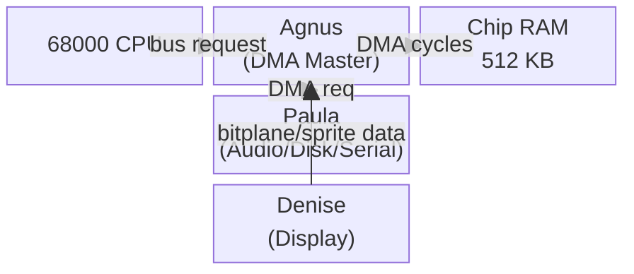

[← Home](../../README.md) · [Hardware](../README.md) · [OCS](README.md)

# OCS Chipset Internals

## Architecture

The three OCS chips share a common **chip bus** (also called the chip bus or DMA bus). Agnus is the bus master — it arbitrates between the CPU, Copper, Blitter, and DMA channels.



## DMA Channels and Priorities

Agnus schedules DMA cycles across a fixed priority scheme within each horizontal raster line (228 colour clocks per line, PAL):

| Priority | DMA Channel | Register Bits |
|---|---|---|
| 1 (highest) | Disk | `DMACONR[4]` DSKEN |
| 2 | Sprite | `DMACONR[2]` SPREN |
| 3 | Bitplane | `DMACONR[8]` BPLEN |
| 4 | Copper | `DMACONR[7]` COPEN |
| 5 | Blitter | `DMACONR[6]` BLTEN |
| 6 | Audio ch 0–3 | `DMACONR[0..3]` AUD0–AUD3 |
| 7 (lowest) | CPU | Remaining cycles |

The CPU only gets cycles not consumed by DMA — this is why heavy DMA usage (e.g., full-screen bitplanes + sprites + audio) can starve the CPU noticeably on OCS.

## DMACON Register

Write `$DFF096` (DMACON), read `$DFF002` (DMACONR):

```
bit 15: SET/CLR  — write: 1=set bits, 0=clear bits (read: always 0)
bit 14: BBUSY    — blitter busy (read only)
bit 13: BZERO    — blitter zero flag (read only)
bit 10: (reserved)
bit  9: MASTER   — master DMA enable (must be set for any DMA)
bit  8: BPLEN    — bitplane DMA
bit  7: COPEN    — Copper DMA
bit  6: BLTEN    — Blitter DMA
bit  5: SPREN    — Sprite DMA
bit  4: DSKEN    — Disk DMA
bit  3: AUD3EN   — Audio channel 3 DMA
bit  2: AUD2EN   — Audio channel 2 DMA
bit  1: AUD1EN   — Audio channel 1 DMA
bit  0: AUD0EN   — Audio channel 0 DMA
```

Enable all standard DMA:
```asm
move.w  #$8380,DMACON    ; SET + MASTER + BPLEN + COPEN
move.w  #$800F,DMACON    ; SET + AUD0-3
```

## INTENA / INTREQ — Interrupt System

Write `$DFF09A` (INTENA), read `$DFF01C` (INTENAR):
Write `$DFF09C` (INTREQ), read `$DFF01E` (INTREQR):

```
bit 14: INTEN   — global interrupt enable (INTENA only)
bit 13: EXTER   — external/CIA interrupt (IPL6)
bit 12: DSKSYNC — disk sync (IPL5)
bit 11: RBF     — serial receive buffer full (IPL5)
bit 10: AUD3    — audio channel 3 (IPL4)
bit  9: AUD2    — audio channel 2 (IPL4)
bit  8: AUD1    — audio channel 1 (IPL4)
bit  7: AUD0    — audio channel 0 (IPL4)
bit  6: BLIT    — blitter finished (IPL3)
bit  5: VERTB   — vertical blank (IPL3)
bit  4: COPPER  — copper interrupt (IPL3)
bit  3: PORTS   — CIA-A port interrupts (IPL2)
bit  2: SOFT    — software interrupt (IPL1)
bit  1: DSKBLK  — disk block finished (IPL1)
bit  0: TBE     — serial transmit buffer empty (IPL1)
```

To enable vertical blank interrupt:
```asm
move.w  #$C020,INTENA   ; SET + INTEN + VERTB
```

## Agnus: Bitplane DMA Timing

During each scan line, Agnus fetches bitplane data for the current line. For a 320-pixel wide, 4-bitplane display, Agnus takes 40 DMA cycles per line for bitplane fetch. On a standard PAL line with 227 clock cycles, this leaves ~187 cycles for CPU + other DMA.

**Bitplane DMA pointers** (set at start of each frame or via Copper):
```
BPL1PTH/BPL1PTL  $DFF0E0/$DFF0E2   Bitplane 1 pointer (high/low word)
BPL2PTH/BPL2PTL  $DFF0E4/$DFF0E6
... up to BPL6 for OCS (6 bitplanes max)
```

## References

- ADCD 2.1 Hardware Manual — Agnus/DMA chapters
- NDK39: `hardware/dmabits.h`, `hardware/intbits.h`, `hardware/custom.h`
- *Amiga Hardware Reference Manual* 3rd ed.
