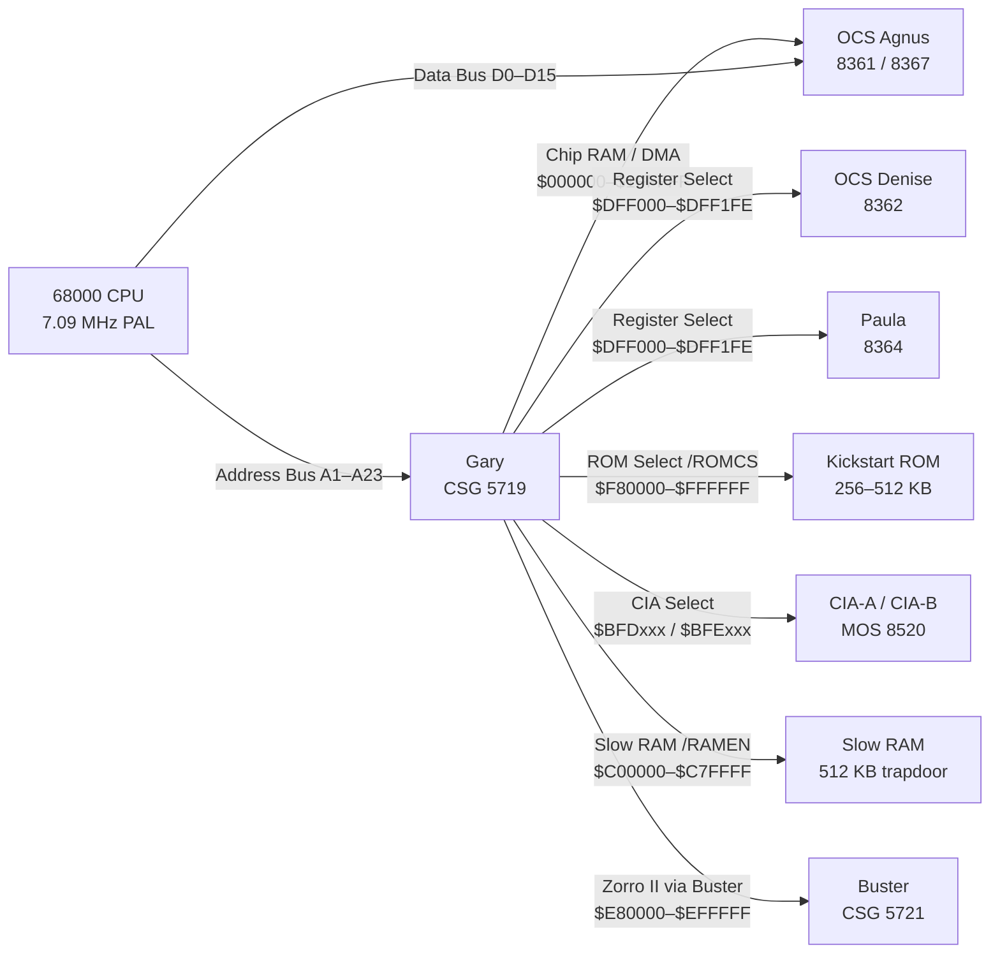

[← Home](../../README.md) · [Hardware](../README.md) · [OCS](README.md)

# Gary — OCS System Controller — Address Decode, Bus Arbitration, and Peripheral Glue (A500 / A2000 / CDTV)

## Overview

The **Gary** chip (CSG 5719, "Gate Array") is a custom ASIC that replaced approximately 30 discrete 74-series TTL ICs and PAL devices used for system glue logic in the Amiga 1000. Deployed in the Amiga 500 and Amiga 2000 from 1987, Gary decodes the upper address lines (A17–A23) of the 68000's 24-bit bus to generate chip-select signals for every device on the motherboard — Agnus, Denise, Paula, the CIA pair, Kickstart ROM, Slow RAM, and the Zorro II expansion bus. Gary is a pure **address decoder and bus arbiter**: it never touches the data bus, has no memory-mapped registers, and is configured entirely by hardware strap resistors at power-on. This makes it opaque to software but essential to every bus cycle the system performs. Its 32-bit successor, **Fat Gary** (CSG 5391/5393), debuted in the A3000 — see [ecs_a600_a3000/gary_system_controller.md](../ecs_a600_a3000/gary_system_controller.md) for that chip.

---

## Architecture — Where Gary Sits

Gary sits on the 68000 address bus and watches A17–A23 to produce chip-select strobes. Data flows directly between the 68000 and the selected device — Gary is never on the critical data path.



**Key principle**: Gary does not sit on the data bus — it only watches address lines and generates control strobes. Data flows directly between the CPU and the selected device.

---

## What Gary Decodes — Address Map

| Address Range | Size | Device | /CS Signal | Notes |
|---|---|---|---|---|
| `$000000–$1FFFFF` | 2 MB | Chip RAM (via Agnus) | Via Agnus | OCS Agnus addresses 512 KB; Fat Agnus 8370/8372 addresses 1 MB |
| `$BFD000–$BFDFFF` | 4 KB | CIA-B | /CIABCSn | Disk motor, serial, parallel port direction |
| `$BFE001–$BFEFFF` | 4 KB | CIA-A | /CIAACSn | Keyboard, parallel data, power LED, OVL overlay bit |
| `$C00000–$C7FFFF` | 512 KB | Slow RAM | /RAMEN | Trapdoor expansion; chip-speed bus, not DMA-accessible |
| `$DC0000–$DCFFFF` | 64 KB | Real-Time Clock | /RTCCS | A2000 battery-backed Oki MSM6242B; absent on base A500 |
| `$DFF000–$DFF1FE` | 512 B | Custom Chip Registers | /OCS | OCS register set for Agnus, Denise, and Paula |
| `$E80000–$EFFFFF` | 512 KB | Zorro II AutoConfig | /CFGINn | Card configuration window; first Zorro II card gets /CFGIN |
| `$F80000–$FFFFFF` | 512 KB | Kickstart ROM | /ROMCS | 256 KB at $FC0000 (Kickstart 1.x); full 512 KB for 2.0+ |

> [!NOTE]
> At power-on, Gary also maps Kickstart ROM at `$000000–$07FFFF` (the **ROM overlay**) so the 68000 can read initial stack pointer and program counter from vectors 0 and 4. This overlay is cleared by CIA-A Port A bit 0 (OVL) after Kickstart initializes.

```
$000000 ┌─────────────────────────────┐ ─┐
        │ Chip RAM (via Agnus)        │  │
        │ 512 KB OCS / 1 MB Fat Agnus │  │ 2 MB window
$1FFFFF └─────────────────────────────┘ ─┘
$200000 ┌─────────────────────────────┐
        │ Zorro II Auto Fast RAM      │
        │ or reserved                 │
$9FFFFF └─────────────────────────────┘
$A00000 ┌─────────────────────────────┐
        │ CIA space                   │
        │ ($BFDxxx CIA-B / $BFExxx A) │
$BFFFFF └─────────────────────────────┘
$C00000 ┌─────────────────────────────┐
        │ Slow / Ranger RAM           │
        │ (512 KB trapdoor expansion) │
$C7FFFF └─────────────────────────────┘
$C80000 ┌─────────────────────────────┐
        │ Reserved / RTC ($DC0000)    │
$DFFFFF └─────────────────────────────┘
$DFF000 ├ ─ ─ ─ ─ ─ ─ ─ ─ ─ ─ ─ ─ ─┤
        │ Custom Chip Registers       │
$DFF1FE └ ─ ─ ─ ─ ─ ─ ─ ─ ─ ─ ─ ─ ─┘
$E00000 ┌─────────────────────────────┐
        │ Reserved                    │
$E7FFFF └─────────────────────────────┘
$E80000 ┌─────────────────────────────┐
        │ Zorro II AutoConfig window  │
$EFFFFF └─────────────────────────────┘
$F00000 ┌─────────────────────────────┐
        │ Reserved / A500+ Extended   │
$F7FFFF └─────────────────────────────┘
$F80000 ┌─────────────────────────────┐
        │ Kickstart ROM               │
        │ 256 KB (1.x) / 512 KB (2+) │
$FFFFFF └─────────────────────────────┘
```

---

## Bus Arbitration

Gary manages the 68000's bus arbitration — the protocol by which multiple bus masters share a single address and data bus.

### Arbitration Hierarchy

| Priority | Master | Signals | Can Be Stalled? |
|---|---|---|---|
| 1 (Highest) | Custom Chip DMA (Agnus) | /CDMAC → /BGACK | Never — display, audio, and disk DMA are real-time |
| 2 | 68000 CPU | /BR → /BG | Yes — held off during every DMA cycle |
| 3 | Zorro II Bus Masters | Via Buster CSG 5721 → Gary | Yes — lowest priority |

### DMA Contention Mechanics

When Agnus needs a bus cycle — for example, a bitplane fetch for the current scanline:

1. **Agnus asserts /CDMAC** — dedicated DMA request line to Gary
2. **Gary asserts /BR** (Bus Request) to the 68000
3. **68000 completes its current bus cycle**, asserts /BG (Bus Grant), floats address and data busses
4. **Gary asserts /BGACK** to hold the 68000 off the bus, then grants Agnus the cycle
5. **Agnus performs one 16-bit DMA word transfer** — approximately 280 ns (2 CPU cycles at 7.09 MHz PAL)
6. **Agnus releases /CDMAC** — Gary de-asserts /BGACK, 68000 resumes

At 7.09 MHz PAL, each horizontal raster line contains 228 color clocks. With four bitplanes active (OCS maximum in lores), 64 of those slots are consumed by DMA, leaving the 68000 roughly 35% of bus time. Enabling sprites, audio, and disk DMA reduces that further.

> [!WARNING]
> Any hardware on the A500 expansion port that drives the bus without correctly implementing /BR → /BG → /BGACK will corrupt memory and can physically damage bus transceivers. This is the primary failure mode of incorrectly designed trapdoor expansions.

### /DTACK and Wait States

Unlike the 68030 on the A3000, the 68000 relies on **/DTACK** (Data Transfer Acknowledge) to complete bus cycles — the CPU inserts wait states until /DTACK is asserted. Gary (or the addressed device) drives /DTACK. Slow RAM and Kickstart ROM run at chip bus speed (~140 ns minimum cycle), inserting 0–1 wait states. This is why code in Fast RAM (Zorro II card) executes measurably faster than equivalent code in ROM or Chip RAM — no DMA contention and no wait-state overhead.

---

## Interrupt Controller

Gary encodes interrupt signals from multiple sources into the 68000's three encoded interrupt level lines (/IPL0, /IPL1, /IPL2). Paula handles primary interrupt encoding on the A500; Gary routes the encoded /IPL lines to the 68000. This contrasts with Fat Gary, which centralizes more interrupt logic internally.

| Interrupt Source | Gary Input | Encoded Level | 68K Vector |
|---|---|---|---|
| Vertical Blank | /INT2 (from Agnus) | Level 2 | $68 |
| Copper | /INT2 (from Agnus) | Level 2 | $68 (shared) |
| Blitter Done | /INT2 (from Agnus) | Level 2 | $68 (shared) |
| Audio channels 0–3 | via Paula | Level 2 or 4 | $68 / $70 |
| Serial port | /INT5 (from Paula) | Level 5 | $74 |
| CIA-A / CIA-B | /INT6 (from CIAs) | Level 6 | $78 (shared) |
| External (expansion) | /INT2 or /INT6 | Level 2 or 6 | Per-card |

### Interrupt Acknowledge Cycle

When the 68000 recognizes an interrupt it performs an **IACK cycle** (FC2–FC0 = 111 on the function code pins). Gary detects this and routes the acknowledge to the highest-priority pending interrupt source, which places its vector number on D0–D7. Amiga software never interacts with Gary's interrupt routing directly — use `exec.library` `SetIntVector()` and `AddIntServer()`.

---

## ROM Overlay

At power-on, the 68000 reads the initial stack pointer (vector 0) and program counter (vector 4) from address `$000000`. Since Chip RAM is uninitialized at reset, Gary maps Kickstart ROM at `$000000` instead, overlaying the Chip RAM window.

**Overlay sequence:**
1. Power-on — Gary asserts /ROMCS for both `$F80000` and `$000000`
2. 68000 reads reset vectors from `$000000` (Gary redirects to ROM)
3. Kickstart initializes hardware, builds ExecBase
4. Kickstart writes CIA-A Port A (`$BFE001`), clearing bit 0 (OVL) to 0
5. Gary detects OVL=0 and removes the ROM overlay — Chip RAM is now visible at `$000000`

Gary monitors the OVL output of CIA-A continuously. This is the only runtime input Gary responds to after power-on; all other behavior is fixed by board strap resistors.

> [!NOTE]
> The OVL bit lives at CIA-A Port A (`$BFE001`) bit 0. If Gary fails to respond to OVL=0 — bad socket contact, failing CIA-A, or a damaged Gary — Chip RAM never appears at `$000000` and Kickstart crashes while writing ExecBase to low memory.

---

## AutoConfig — Zorro II Expansion

Gary coordinates the Zorro II AutoConfig sequence that assigns address space to expansion cards at boot.

1. Kickstart probes at `$E80000`
2. Gary decodes the address and routes it to **Buster CSG 5721** via expansion bus control lines
3. Buster asserts /CFGIN to the first card in the daisy chain
4. The card responds with its AutoConfig ROM: product ID, manufacturer ID, memory/IO requirements, option ROM
5. Kickstart assigns the card's base address by writing to the card's configuration register
6. Gary (via Buster) asserts /CFGOUT to pass configuration authority to the next card
7. Repeat until no card responds to /CFGIN

Gary does not read AutoConfig data — it generates the address decode and bus signals. Kickstart software and Buster hardware implement the actual protocol. This separation means Gary works identically with any standards-compliant Zorro II card.

The original Gary supports **Zorro II only** (16-bit bus, up to 8 MB address space). Fat Gary on the A3000 adds Zorro III (32-bit) via Super Buster. See [zorro_bus.md](../common/zorro_bus.md) for the full AutoConfig protocol.

---

## Chip Variants and Machine Assignment

| CSG Part | Commodore P/N | Name | Package | Machines | Notes |
|---|---|---|---|---|---|
| 5718 | — | Gary | 48-pin DIP | A2000 (early rev 3.x–4.x) | Pre-production; minor Zorro II timing differences; rare |
| 5719 | 318070-01 | Gary | 48-pin DIP | A500, A2000 (rev 4.x–6.x), CDTV | Standard production version; the chip this article covers |

Both 5718 and 5719 are pin-compatible and functionally equivalent for software purposes. The 5718 has known issues with some Zorro II timing edge cases on early A2000 boards; 5719 is the reliable production revision. All A500 boards shipped with 5719.

---

## Detecting Gary at Runtime

Gary has no readable registers. Software must detect its presence indirectly.

### Method 1: CPU Type via ExecBase (Coarse)

```c
/* From exec/execbase.h */
struct ExecBase *SysBase = *((struct ExecBase **)4);

if (!(SysBase->AttnFlags & AFF_68020)) {
    /* 68000 system → original Gary or Gayle (A600)
     * Not conclusive on its own — A600 also has 68000 */
}
```

### Method 2: AutoConfig Database (Conclusive for A2000/CDTV)

```c
#include <proto/expansion.h>
#include <libraries/configvars.h>

struct ExpansionBase *ExpansionBase;
struct ConfigDev *cd = NULL;
BOOL found_cbm_device = FALSE;

ExpansionBase = (struct ExpansionBase *)OpenLibrary("expansion.library", 37);
if (ExpansionBase) {
    /* A2000 + A2091 SCSI shows manufacturer 0x0202, product 0x09.
     * CDTV DMAC shows manufacturer 0x0202, product 0x02.
     * Absence of 68020+ in AttnFlags + Commodore AutoConfig = Gary system. */
    while ((cd = FindConfigDev(cd, 0x0202 /* Commodore */, -1))) {
        found_cbm_device = TRUE;
        break;
    }
    CloseLibrary((struct Library *)ExpansionBase);
}
```

### Method 3: Probe the Slow RAM Window

```c
/* Present only on A500 with trapdoor RAM installed.
 * Confirms A500 hardware topology but not Gary specifically.
 * REQUIRES a bus error trap — unmapped on base A500. */
volatile UWORD *slow_test = (volatile UWORD *)0x00C00000;
UWORD saved = *slow_test;
*slow_test = 0x1234;
BOOL has_slow_ram = (*slow_test == 0x1234);
*slow_test = saved;
```

### Method 4: Gayle ID Register (Negative Test)

```c
/* Gayle (A600/A1200) exposes a readable ID byte at $DE0000.
 * If this read returns a known Gayle ID (0xD0 or 0xD1),
 * the system controller is Gayle, not Gary. */
volatile UBYTE *gayle_id = (volatile UBYTE *)0x00DE0000;
UBYTE id = *gayle_id;
BOOL is_gayle = (id == 0xD0 || id == 0xD1);
BOOL is_gary  = !is_gayle && !(SysBase->AttnFlags & AFF_68020);
```

> [!NOTE]
> There is no universally reliable software method to identify Gary by positive detection. The Gayle negative test combined with `AttnFlags` gives a practical working heuristic for A500/A2000/CDTV vs A600 distinction.

---

## Gary vs Fat Gary vs Gayle — Decision Guide

| Criterion | Gary CSG 5719 | Fat Gary CSG 5393 | Gayle (A600 / A1200) |
|---|---|---|---|
| **Target machines** | A500, A2000, CDTV | A3000, A3000T, A4000T | A600, A1200 |
| **CPU** | 68000 @ 7 MHz | 68030 @ 25 MHz | 68000 (A600) / 68020 (A1200) |
| **Address bus** | 24-bit | 32-bit | 24-bit (A600), 32-bit (A1200) |
| **Data bus** | 16-bit | 32-bit | 16-bit |
| **SCSI glue** | None | WD33C93A + SDMAC | None — IDE instead |
| **IDE** | None | None | Yes — /GAYLE_ID at `$DE0000` |
| **PCMCIA** | None | None | Yes |
| **FPU decode** | None | /FPUCS at `$E80000` | None |
| **Readable registers** | None | None | /GAYLE_ID (read-only ID byte) |
| **Expansion bus** | Zorro II via Buster 5721 | Zorro III via Super Buster | None |
| **Package** | 48-pin DIP | 84-pin PLCC | Surface-mount |
| **FPGA difficulty** | Low — simple decode | Medium — 20 ns arbitration | Medium — IDE timing emulation |

---

## When to Care About Gary

### When to Care

- **Writing an A500 trapdoor expansion**: Must correctly implement /BR → /BG → /BGACK handshake with Gary
- **Porting Kickstart to new A500 hardware**: Must clear CIA-A OVL bit to expose Chip RAM at `$000000`
- **Building a Minimig or MiSTer OCS core**: Gary's arbitration timing determines correct DMA slot assignment
- **Debugging A500 boot failures**: ROM overlay, CIA-A OVL, and /ROMCS are the first points to check
- **Writing A500 hardware diagnostics**: Probing Gary-decoded addresses isolates motherboard faults
- **Developing A2000 ISA bridgeboard firmware**: Must coexist with Gary's Zorro II arbitration

### When NOT to Care

- **Writing application software**: Use `graphics.library`, `dos.library`, `exec.library` — Gary is invisible
- **Writing a game using only Chip RAM**: Agnus manages all DMA; Gary is transparent to game logic
- **Porting between A500 and A1200**: OS abstractions insulate you from Gary vs Gayle differences
- **Writing a filesystem handler**: `dos.library` packet I/O has no visibility into Gary
- **CLI tools and scripts**: Nothing at shell level depends on the system controller chip

---

## Best Practices

1. **Never depend on Gary-specific behavior** — use OS abstractions that work across all Amiga models
2. **Clear OVL via CIA-A Port A bit 0, not by patching Gary directly** — CIA-A is the correct mechanism; this is the only runtime control Gary accepts
3. **On expansion hardware, implement the full /BR → /BG → /BGACK handshake** — do NOT hold /BGACK indefinitely or Agnus DMA starves and the display corrupts
4. **Probe Zorro II devices via `expansion.library`**, not hard-coded base addresses — the AutoConfig database is authoritative
5. **Do not equate "68000 CPU" with "Gary present"** — the A600 also has a 68000 but uses Gayle; use the Gayle ID negative-probe method
6. **When emulating Gary in FPGA, validate /DTACK timing** — the 68000 bus cycle requires /DTACK assertion within specific setup windows relative to /AS
7. **Allocate DMA targets with `MEMF_CHIP`**, not `MEMF_PUBLIC` — Slow RAM at `$C00000` is not DMA-accessible regardless of what OS 1.3 may return from `AllocMem(MEMF_CHIP)`

---

## Antipatterns

### 1. The Hard-Coded Slow RAM Address

**Bad**:
```c
/* Assumes A500 trapdoor RAM is always present at $C00000 */
UBYTE *scratch = (UBYTE *)0x00C00000;
scratch[0] = 0x42;  /* Bus error on base A500 with no trapdoor! */
```

**Good**:
```c
/* Ask exec — it knows what memory is actually installed */
UBYTE *scratch = (UBYTE *)AllocMem(1, MEMF_PUBLIC | MEMF_CLEAR);
if (scratch) {
    scratch[0] = 0x42;
    FreeMem(scratch, 1);
}
```

**Why it breaks**: `$C00000` is unmapped on a base A500 with no trapdoor expansion. Accessing an unmapped Gary-decoded range causes a bus error that crashes the system. On an A2000 with a different expansion memory layout, `$C00000` may map to entirely different hardware.

### 2. The Bus Grant Hog

**Bad** (on A500 expansion firmware):
```asm
; Seize the bus and hold it for a bulk copy — DMA dies
        bset    #0,board_ctrl   ; assert /BR, grab /BG from Gary
.loop   move.l  (a0)+,(a1)+    ; display freezes, audio stops
        subq.l  #1,d0
        bne     .loop
        bclr    #0,board_ctrl   ; release — screen is already corrupted
```

**Good**:
```asm
; Copy in bursts, yielding to DMA every horizontal blank
.outer  move.w  #128,d1         ; copy 128 longwords per burst
        bset    #0,board_ctrl   ; acquire /BG
.inner  move.l  (a0)+,(a1)+
        subq.w  #1,d1
        bne     .inner
        bclr    #0,board_ctrl   ; release — let Agnus DMA run
        bsr     wait_hblank     ; wait ~64 µs (one PAL scanline)
        sub.l   #128,d0
        bgt     .outer
```

**Why it breaks**: Holding /BGACK indefinitely starves Agnus of DMA slots. Every bitplane fetch, sprite fetch, audio sample, and disk byte fails. Even holding for two scanlines produces visible horizontal tearing. On the A500, this is the fastest way to produce the infamous "black bars" screen corruption.

### 3. The Slow RAM / Chip RAM Confusion

**Bad**:
```c
/* AmigaOS 1.3 may return Slow RAM for MEMF_CHIP on expanded A500.
 * Audio DMA to Slow RAM silently fails. */
UBYTE *sample_buf = (UBYTE *)AllocMem(sample_size, MEMF_CHIP);
LoadSample(sample_buf);
StartAudioDMA(sample_buf);  /* no sound — DMA cannot reach $C00000 */
```

**Good**:
```c
/* MEMF_CHIP guarantees DMA-accessible Chip RAM on OS 2.0+.
 * On OS 1.3, explicitly verify the pointer is below $200000. */
UBYTE *sample_buf = (UBYTE *)AllocMem(sample_size, MEMF_CHIP | MEMF_CLEAR);
if (sample_buf && (ULONG)sample_buf >= 0x00200000) {
    /* Got Slow RAM — free it and fail gracefully */
    FreeMem(sample_buf, sample_size);
    sample_buf = NULL;
}
```

**Why it breaks**: Slow RAM at `$C00000` is connected to the chip bus and accessible by the 68000, but is **not reachable by custom chip DMA**. Agnus's DMA engine can only address memory it has direct bus access to (true Chip RAM). Under OS 1.3 on an expanded A500, `AllocMem(MEMF_CHIP)` may return a pointer into Slow RAM because the OS misidentifies it; the audio, blitter, and disk DMA channels then silently fail or read garbage.

---

## Pitfalls

### 1. ROM Overlay Stuck Active

At power-on, Gary maps ROM at `$000000`. Kickstart clears CIA-A OVL to remove it. If OVL clearing fails — a cold solder joint on CIA-A, a damaged Gary socket pin, or a CIA-A with a stuck Port A line — the overlay stays active. Chip RAM never appears at `$000000`.

**Symptom**: Kickstart color indicators appear (green/yellow power LED flash), then the system hangs at a gray screen. The CPU is executing Kickstart from ROM and crashes when it tries to write ExecBase to low Chip RAM, which is still mapped to ROM (read-only — writes are silently ignored).

**Repair**: Re-seat Gary in its 48-pin DIP socket. Check CIA-A Port A (pin 10) continuity to the data bus. Test CIA-A independently; a failing CIA-A Port A is a common cause of this fault on aged A500 boards.

### 2. Zorro II Card Timeout During AutoConfig

Gary drives /CFGIN to the first Zorro II card. If a card holds /CFGIN asserted without returning an AutoConfig response in the expected time window, Buster 5721 may lock the expansion bus. The symptom is a boot hang — the system freezes during the Kickstart card enumeration phase with no display output from Kickstart's progress indicators.

**Diagnosis**: Boot with all Zorro II cards removed. Add cards one at a time to find the offending card. If the system boots cleanly without expansion hardware, the problem is a card with incompatible AutoConfig timing or a shorted /CFGIN line.

**Workaround**: Some A2000 boards have an AutoConfig bypass jumper (J500 on rev 6.2 boards) that skips Zorro II enumeration. This allows booting for diagnostics without the offending card blocking /CFGIN.

### 3. Trapdoor RAM Not Detected by OS

An A500 trapdoor expansion at `$C00000` is only recognized by AmigaOS if it passes the memory test during Kickstart's memory scan. Kickstart writes a pattern to `$C00000`, reads it back, and if correct, adds the memory to the free list via `AddMemList()`. If the trapdoor RAM has marginal DRAM chips (weak refresh, wrong CAS latency), the test may pass at cold boot but fail after warm-up — producing random crashes after a few minutes of use.

**Symptom**: The system boots, `AvailMem(MEMF_PUBLIC)` shows 1 MB instead of 512 KB, but random crashes occur under memory pressure within minutes.

**Diagnosis**: Run a RAM tester (Amiga Test Kit, DiagROM) immediately after boot before the RAM warms up and the failure window closes. Replace DRAM chips on the trapdoor board.

---

## Use Cases

### What Kind of Software Needs Gary Awareness?

| Category | Example | Why Gary Matters |
|---|---|---|
| **Trapdoor expansion firmware** | 512 KB RAM + clock (Datel, Cumana, Vortex) | Must implement /BR → /BG → /BGACK handshake; must not hold /BGACK across DMA slots |
| **Zorro II card firmware** | GVP Series II, Supra WordSync, A2091 SCSI | AutoConfig ROM must respond to Gary-via-Buster /CFGIN within spec timing |
| **Custom boot ROMs** | DiagROM, custom Kickstart builds | Must clear CIA-A OVL bit to disable ROM overlay before accessing Chip RAM at `$000000` |
| **Hardware diagnostics** | Amiga Test Kit, DiagROM | Probes Gary-decoded addresses (`$BFE001`, `$DFF000`, `$F80000`) to isolate motherboard faults |
| **FPGA Amiga cores (OCS)** | Minimig, MiSTer OCS/ECS | Must replicate Gary's DMA arbitration timing to pass all OCS display modes correctly |
| **A2000 ISA bridgeboards** | A2088 (8088), A2286 (286) | Must coexist with Gary's Zorro II arbitration while bridging the ISA bus for PC peripherals |

### Known Software That Interacts with Gary

- **DiagROM**: Tests /ROMCS by reading ROM at mirrored addresses; tests CIA-A OVL clear; verifies Chip RAM at `$000000` after overlay removal
- **Kickstart 1.2–3.2**: Clears OVL bit during cold boot; enumerates Zorro II cards via AutoConfig
- **SysInfo**: Identifies A500 vs A2000 by detecting Zorro II resources and checking CPU type against machine topology
- **A-Max II (Mac emulator)**: Mapped its own 128 KB Mac ROM into `$400000–$5FFFFF` — a range Gary does not decode — to avoid conflicting with Kickstart ROM at `$F80000`
- **Enforcer**: Probes known Gary-decoded addresses to identify unmapped regions that should generate bus errors; uses these to detect illegal memory accesses

---

## Historical Context

### The Glue Logic Problem

The Amiga 1000 (1985) used approximately **30 discrete TTL chips** for system glue: address decoding, bus arbitration, interrupt encoding, and peripheral chip selects. Each additional chip was a PCB cost, a power draw, a potential failure point, and a propagation delay in the critical path from CPU address output to device chip select.

Commodore's hardware team — including **Dave Haynie** and **Bob Raible** at Commodore's West Chester facility — designed Gary as a single 48-pin ASIC that collapsed all that discrete logic. First deployed in the A500 (April 1987):
- Reduced motherboard cost by approximately **$12–18 per unit** at 1987 component prices
- Enabled the A500's compact **"wedge" form factor** — the A1000 motherboard was significantly larger
- Reduced power consumption by approximately **1.5–2 W**
- Eliminated roughly **15 solder joint failure points** from the board

### Competitive Landscape (1987)

| Platform | System Controller | Year | Integration Level |
|---|---|---|---|
| **Amiga 500 (Gary)** | CSG 5719 — custom gate array | 1987 | Single chip: address decode + DMA arbitration + interrupt routing + ROM overlay |
| **Atari ST (Glue)** | Custom ASIC ("Glue") | 1985 | Single chip: address decode + interrupt control; DMA handled separately by DMA chip |
| **Apple IIGS (Mega II)** | Custom ASIC ("Mega II") | 1986 | Single chip: Apple II bus emulation + IIgs bus bridge; similar scope to Gary |
| **IBM PC AT** | Intel 8288 + discrete PALs | 1984 | Multi-chip: separate bus controller, interrupt controller (8259A), DMA (8237A) |
| **Macintosh SE** | Discrete PALs + VLSI chips | 1987 | Multiple chips: no single Gary-equivalent; address decode spread across multiple devices |

Gary was ahead of the PC world in single-chip glue integration by approximately two to three years. Intel would not produce a comparable single-chip PC chipset until the 82C206/82C207 "NEAT" chipsets of 1988.

---

## Modern Analogies

| Amiga Concept | Modern Equivalent | Why the Analogy Holds | Where It Breaks |
|---|---|---|---|
| **Gary** | **Northbridge** (Intel 440BX, VIA Apollo Pro) | Both decode address ranges into chip selects, manage bus arbitration among CPU and DMA, route interrupts | Modern Northbridges have PCI configuration registers (in-band config space); Gary has no software interface at all |
| **Gary's AutoConfig strobes** | **PCI bus enumeration** (BIOS Plug and Play) | Both probe the bus, assign address space, and load option ROMs | PCI uses in-band messaging (config cycles); Gary uses sideband signals (/CFGIN, /CFGOUT daisy chain) |
| **OVL bit via CIA-A** | **GPIO strap pins / firmware early-boot flags** | Both switch the boot memory map after initial CPU execution, then lock down | Modern straps are one-time fuses or NVRAM; Gary's OVL is a real-time input that Gary monitors continuously |
| **Gary's bus arbitration** | **PCI bus master arbitration (REQ/GNT)** | Both grant and revoke bus ownership among multiple masters at defined priority levels | PCI uses a distributed, pipelined arbiter with multiple REQ/GNT pairs; Gary is a centralized priority encoder |
| **Slow RAM at $C00000** | **Uncached DRAM region (MTRR WC)** | Both are CPU-accessible but excluded from coherent DMA | Modern uncached regions are defined by page table attributes (MTRRs, PAT); Gary's exclusion is hard-wired in silicon |

---

## Impact on FPGA / Emulation

### Critical Timing Requirements

An FPGA Gary implementation must satisfy:

1. **68000 /DTACK timing**: The 68000 requires /DTACK to be asserted no later than the falling edge of S4 in a normal bus cycle (≈ 140 ns at 7.09 MHz PAL). Gary must generate /DTACK (or ensure the target device does) within this window or insert wait states precisely; inserting too many wait states degrades performance and breaks timing-sensitive floppy I/O.
2. **DMA slot boundaries**: The A500's DMA slot schedule is fixed within each horizontal line — Gary must assert /BGACK on exact color-clock boundaries. Granting the bus one color clock early or late produces bitplane horizontal scroll errors (image shifted one pixel left or right relative to sprites).
3. **CIA-A OVL decoding**: Gary must monitor CIA-A Port A bit 0 and switch ROM overlay state within one bus cycle of the CIA-A write. A delayed response corrupts the Kickstart boot sequence because the CPU reads from the wrong memory.

### Known FPGA Implementations

| FPGA Core | Gary Model | Status | Notes |
|---|---|---|---|
| **Minimig** (Dennis van Weeren) | CSG 5719 | Working | Reference Verilog implementation in `rtl/gary.v` |
| **MiSTer Minimig** | CSG 5719 | Working | Full ECS support; most widely deployed OCS/ECS core |
| **FPGA Arcade Replay** | CSG 5719 | Working | Alternative implementation for the Replay board |
| **UAE / WinUAE** | Software emulation | Working | Gary logic in `custom.c`; definitive reference for timing edge cases |

### Emulation Test Checklist

For FPGA developers implementing Gary (CSG 5719):

- [ ] ROM overlay active at reset: `$000000` reads Kickstart ROM, not Chip RAM
- [ ] OVL=0 (CIA-A PRA bit 0 cleared) removes overlay within one bus cycle: `$000000` now shows Chip RAM
- [ ] `$DFF000–$DFF1FE` asserts /OCS and selects custom chips
- [ ] `$F80000–$FFFFFF` asserts /ROMCS for 256 KB or 512 KB ROM depending on configuration strap
- [ ] `$BFD000` selects CIA-B; `$BFE001` selects CIA-A
- [ ] `$E80000` AutoConfig probe reaches Buster 5721 / first Zorro II card via /CFGIN
- [ ] /BGACK asserted within one bus cycle of /BG receipt from 68000
- [ ] /BGACK released within one scanline (63.5 µs PAL) to prevent horizontal display corruption
- [ ] Slow RAM at `$C00000–$C7FFFF` asserts /RAMEN when trapdoor expansion is configured
- [ ] Bus error generated for accesses to unmapped regions (no /DTACK fallback)

---

## FAQ

### Q: Does the A500 Gary differ from the A2000 Gary?

Functionally no. Both A500 and A2000 (rev 4.x+) use the same CSG 5719. The A2000 adds a larger board with five Zorro II slots, ISA slots, and a video slot, but Gary's behavior is identical across both machines. Early A2000 boards (rev 3.x) used CSG 5718, which is functionally equivalent but has minor Zorro II timing differences on some card combinations.

### Q: Why is Slow RAM called "Slow RAM" if the A500's CPU is already slow by modern standards?

The name contrasts with **Fast RAM** (Zorro II expansion memory), not with modern CPU speeds. Slow RAM at `$C00000` runs at chip bus speed (7.09 MHz, with DMA contention). Fast RAM on a Zorro II card has no DMA overhead and the 68000 accesses it at its full 7.09 MHz synchronous speed — no wait states from DMA slot arbitration. "Slow" and "Fast" are relative terms within the A500's memory hierarchy.

### Q: Can I replace a failed Gary in an A500?

Yes. Gary is socketed in a 48-pin DIP socket on all A500 revisions. Replacement CSG 5719 chips can be harvested from dead A500 or A2000 boards. There is no commercial FPGA drop-in replacement for the 48-pin DIP Gary as of 2025, but FPGA-based A500 replacements (ReAmiga boards) implement Gary logic in an FPGA alongside all other custom chips.

### Q: Is Gary responsible for A500 "black screen of death"?

Gary-related failures typically produce a **gray screen** (Kickstart loaded from ROM but crashed writing ExecBase to Chip RAM that is still overlaid with ROM), not a black screen. A completely black screen usually indicates dead Agnus (no video output regardless of CPU state), a dead 68000, or missing Kickstart ROM. If the screen is gray and the floppy does not spin after initial seeking, suspect Gary or CIA-A OVL.

### Q: Does Gary control the power LED?

No. The power LED is driven by CIA-A Port A bit 1 (`$BFE001` bit 1). Gary decodes the CIA address range and generates the CIA chip select, but the LED logic is entirely within CIA-A. Bit 1 = 0 lights the LED at full brightness; bit 1 = 1 lets the LED be controlled by CIA-A timer output (dimming effect used by some disk access indicators).

### Q: Can the A500 run without Gary?

No. Gary generates every chip-select signal on the board. Without Gary, the 68000 address bus drives nothing — no ROM chip select means no ROM overlay at boot, so the CPU fetches garbage reset vectors and immediately executes undefined instructions. Gary is as fundamental to the A500 as Agnus.

---

## References

- *Amiga Hardware Reference Manual*, 3rd ed. (Addison-Wesley, 1991) — Sections 5–8: custom chip bus, address map, CIA, bus arbitration
- **ADCD 2.1 Hardware Manual** — Chapter 2: Memory Map; Chapter 4: Bus Arbitration — http://amigadev.elowar.com/read/ADCD_2.1/Hardware_Manual_guide/
- **Amiga 500 Schematics** (rev 5 and rev 6) — Full Gary pinout and strap resistor network; available at `amigapcb.org`
- **Minimig RTL source** — `rtl/gary.v` implements CSG 5719 in Verilog: `github.com/rkrajnc/minimig-mist`
- **UAE/WinUAE source** — `custom.c` and `memory.c` document Gary address decode and timing behavior: `github.com/tonioni/WinUAE`
- **NDK 3.9** — `exec/execbase.h` (AttnFlags), `hardware/cia.h` (CIA-A OVL bit), `libraries/configvars.h` (AutoConfig structures)
- **Dave Haynie developer notes (1990–1993)** — Context on Gary design decisions and the transition to Fat Gary

## See Also

- [Fat Gary (A3000)](../ecs_a600_a3000/gary_system_controller.md) — 32-bit successor with SCSI glue, Zorro III, FPU chip select, and 20 ns arbitration precision
- [OCS Chipset Internals](chipset_ocs.md) — DMA priorities, Agnus bus mastering, Copper and Blitter contention
- [Custom Chip Registers](custom_registers.md) — Full OCS register map at `$DFF000–$DFF1FE` that Gary's /OCS line enables
- [Zorro Bus](../common/zorro_bus.md) — Zorro II expansion protocol, AutoConfig, Buster 5721 arbitration
- [CIA Chips](../common/cia_chips.md) — CIA-A Port A OVL bit, interrupt lines, and timer outputs that Gary routes to the 68000
- [Address Space](../common/address_space.md) — Complete A500/A2000 memory map with all Gary-decoded regions annotated
- [Bus Architecture](../common/bus_architecture.md) — Bus hierarchy, register access patterns, accelerator bridge, cache coherency
