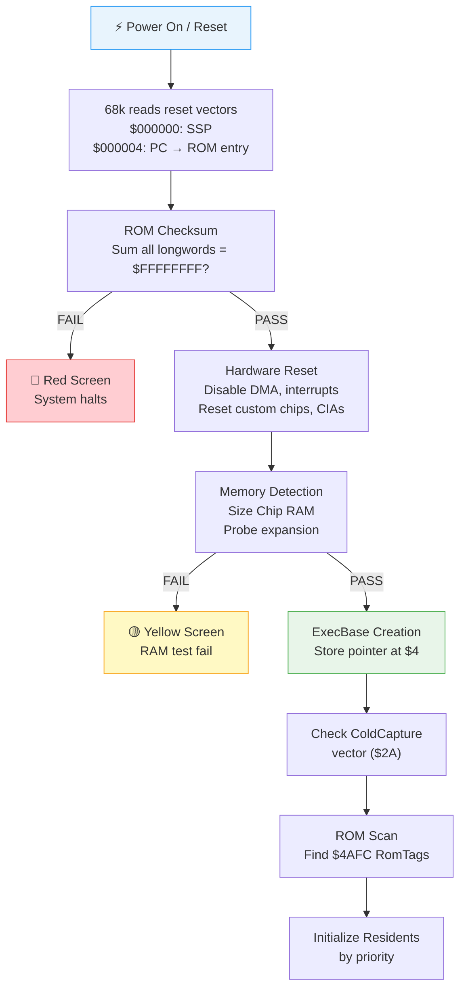

[← Home](../README.md) · [Boot Sequence](README.md)

# Cold Boot — Power-On to Kickstart

## Overview

When the Amiga powers on or is reset (Ctrl-Amiga-Amiga), the 68000 CPU begins execution from the ROM. The boot process progresses from raw hardware initialization through to a fully running AmigaOS desktop in approximately 3–8 seconds. This document covers everything that happens from the moment power is applied to the moment the Kickstart ROM hands control to the OS initialization code.

---

## Boot Timeline



---

## Step 1: CPU Reset Vector Fetch

The 68000 CPU has a hardwired reset sequence:

1. Enters supervisor mode, sets interrupt mask to level 7 (all masked)
2. Reads a longword from address `$000000` → loads into SSP (Supervisor Stack Pointer)
3. Reads a longword from address `$000004` → loads into PC (Program Counter)
4. Begins executing from the PC address

On the Amiga, addresses `$000000–$000007` map to Kickstart ROM during reset (via the OVL — overlay — signal from Gary/Gayle). Once the boot code runs a few instructions, it clears the OVL pin, remapping `$000000` to Chip RAM.

```asm
; ROM at $F80000 (512 KB Kickstart):
$F80000: dc.l    $00000400     ; Initial SSP = $400 (supervisor stack in low memory)
$F80004: dc.l    $F80008       ; Initial PC = next instruction in ROM

; First instruction executed:
$F80008: LEA     $F80000,A0    ; Load ROM base
         ...                    ; Begin boot sequence
```

### The OVL (Overlay) Mechanism

| State | Address $000000 maps to | Purpose |
|---|---|---|
| OVL = 1 (reset) | ROM ($F80000) | CPU reads SSP/PC from ROM |
| OVL = 0 (cleared) | Chip RAM | Normal operation — exception vectors in RAM |

The boot code clears OVL by writing to CIA-A PRA (bit 0) within the first few instructions, switching $000000 back to Chip RAM. This allows the OS to install its own exception vectors.

---

## Step 2: ROM Checksum Verification

Immediately after gaining control, the boot code verifies ROM integrity:

```c
/* ROM checksum algorithm */
ULONG checksum = 0;
ULONG *rom = (ULONG *)ROM_BASE;
ULONG rom_size = ROM_SIZE / 4;  /* longword count */

for (ULONG i = 0; i < rom_size; i++)
{
    ULONG old = checksum;
    checksum += rom[i];
    if (checksum < old)  /* carry occurred */
        checksum++;       /* add carry back (ones' complement addition) */
}

if (checksum != 0xFFFFFFFF)
{
    /* FAIL — display solid red screen */
    custom.color[0] = 0x0F00;  /* Red background */
    for (;;) ;  /* Halt — no recovery */
}
```

### Checksum Details

| ROM Type | Size | Base Address | Checksum Location |
|---|---|---|---|
| Kickstart 1.x | 256 KB | `$FC0000` | `$FFFFE8` (last LW before vectors) |
| Kickstart 2.0+ | 512 KB | `$F80000` | `$FFFFF8` |
| Kickstart 3.1 | 512 KB | `$F80000` | `$FFFFF8` |

The checksum is a **ones' complement additive checksum** — the sum of all longwords in the ROM, including carries, must equal `$FFFFFFFF`. The ROM builder calculates a complement value and places it near the end of the ROM image to ensure this.

> **For FPGA developers**: If your ROM image produces a red screen, the checksum is wrong. Recalculate it with the complement value at the correct offset for your ROM size.

---

## Step 3: Hardware Reset

The boot code puts all hardware into a known safe state:

```asm
; Disable everything before touching any hardware
    MOVE.W  #$7FFF,INTENA      ; Clear all interrupt enable bits
    MOVE.W  #$7FFF,INTREQ      ; Clear all pending interrupt requests
    MOVE.W  #$7FFF,DMACON      ; Disable all DMA channels
    MOVE.W  #$7FFF,ADKCON      ; Clear audio/disk control

; Reset CIA chips
    MOVE.B  #$00,CIAA_CRA      ; Stop CIA-A Timer A
    MOVE.B  #$00,CIAA_CRB      ; Stop CIA-A Timer B
    MOVE.B  #$00,CIAB_CRA      ; Stop CIA-B Timer A
    MOVE.B  #$00,CIAB_CRB      ; Stop CIA-B Timer B
    MOVE.B  #$7F,CIAA_ICR      ; Disable all CIA-A interrupts
    MOVE.B  #$7F,CIAB_ICR      ; Disable all CIA-B interrupts

; Set CIA-A port directions
    MOVE.B  #$03,CIAA_DDRA     ; PA0=OVL(out), PA1=LED(out), rest input
    MOVE.B  #$FF,CIAA_DDRB     ; Port B = parallel data (output)

; Clear OVL — remap $000000 to Chip RAM
    BCLR    #0,CIAA_PRA        ; Clear OVL bit → Chip RAM now at $0
```

### Hardware State After Reset

| Subsystem | State | Register |
|---|---|---|
| All DMA | Disabled | DMACON = $0000 |
| All interrupts | Disabled | INTENA = $0000 |
| All interrupt requests | Cleared | INTREQ = $0000 |
| CIA timers | Stopped | CRA/CRB = $00 |
| Blitter | Idle | — |
| Copper | Idle | — |
| Audio | Silent | — |
| Floppy motor | Off | — |
| Video | Black screen | COLOR00 = $000 |

---

## Step 4: Memory Detection

The ROM probes for available memory by writing test patterns and reading them back:

### Chip RAM Detection

```c
/* Test pattern write/read at progressively higher addresses */
/* Typical patterns: $AAAAAAAA / $55555555 (alternating bits) */

ULONG chip_size = 0;
ULONG test_addrs[] = { 0x040000, 0x080000, 0x100000, 0x200000 }; /* 256K, 512K, 1M, 2M */

for (int i = 0; i < 4; i++)
{
    volatile ULONG *p = (ULONG *)test_addrs[i];
    *p = 0xAAAAAAAA;
    if (*p == 0xAAAAAAAA)
    {
        *p = 0x55555555;
        if (*p == 0x55555555)
            chip_size = test_addrs[i];
    }
}
```

### Memory Probing Order

| Step | Address Range | Memory Type | How Detected |
|---|---|---|---|
| 1 | `$000000–$03FFFF` | Chip RAM (256 KB min) | Test patterns |
| 2 | `$040000–$07FFFF` | Chip RAM (512 KB) | Test patterns |
| 3 | `$080000–$0FFFFF` | Chip RAM (1 MB) | Test patterns |
| 4 | `$100000–$1FFFFF` | Chip RAM (2 MB) | Test patterns |
| 5 | `$C00000–$C7FFFF` | Ranger/Slow RAM (A500) | Test patterns |
| 6 | `$200000–$9FFFFF` | Fast RAM (trapdoor/PCMCIA) | Test patterns |
| 7 | `$E80000–$EFFFFF` | Zorro II Autoconfig | Autoconfig protocol |
| 8 | `$07000000+` | Zorro III (32-bit) | Autoconfig protocol |

### Autoconfig (Zorro II/III)

Expansion boards are detected via the **Autoconfig** protocol:

```c
/* Autoconfig space: $E80000 */
/* Read manufacturer ID, product ID, board size from config registers */
/* Assign board a base address */
/* AddMemList() to register any RAM found on the board */

struct ConfigDev *cd;
while ((cd = FindConfigDev(cd, -1, -1)) != NULL)
{
    if (cd->cd_Rom.er_Type & ERTF_MEMLIST)
    {
        /* This board has RAM — add to system memory pool */
        AddMemList(cd->cd_BoardSize, MEMF_FAST | MEMF_PUBLIC,
                   0, cd->cd_BoardAddr, "expansion memory");
    }
}
```

## Step 5: ROM Self-Test and Diagnostic Indicators

The Amiga has a multi-layered diagnostic system that uses screen colours, power LED patterns, and keyboard LED blink codes to communicate status. Understanding these signals is essential for FPGA core development and hardware debugging.

### Normal Boot Colour Sequence

A healthy boot cycles through these colours rapidly (total <1 second on 68000):

```
┌─────────┐    ┌──────────┐    ┌───────────┐    ┌───────────┐    ┌──────────┐    ┌─────────┐
│  BLACK  │───→│ DARK GREY│───→│ MED GREY  │───→│LIGHT GREY │───→│  WHITE   │───→│  GREEN  │
│  $000   │    │  $444    │    │  $888     │    │  $AAA     │    │  $FFF    │    │  $0F0   │
│ CPU init│    │ ROM OK   │    │ RAM sized │    │ Exec init │    │ Residents│    │ DOS boot│
└─────────┘    └──────────┘    └───────────┘    └───────────┘    └──────────┘    └─────────┘
```

If the sequence **stops** at any colour, that colour identifies the failure point.

### Screen Colour Diagnostic Table

| Colour | Hex | Phase | Indicates | What Failed |
|---|---|---|---|---|
| Black (stuck) | `$000` | Pre-init | CPU not executing | No clock, dead CPU, no ROM addressing |
| Dark grey | `$444` | Post-checksum | ROM checksum passed | (Normal — transient) |
| Medium grey | `$888` | Memory test | Chip RAM sized OK | (Normal — transient) |
| Light grey | `$AAA` | Exec init | ExecBase created | (Normal — transient) |
| White | `$FFF` | Resident scan | Modules initializing | (Normal — transient) |
| Green flash | `$0F0` | DOS boot | dos.library starting | (Normal — transient) |
| **Red** (stuck) | `$F00` | **Checksum** | **ROM checksum failed** | Bad ROM chip, wrong image, bit rot |
| **Yellow** (stuck) | `$FF0` | **RAM test** | **Chip RAM failed** | Dead RAM chips, Agnus addressing fault |
| **Green** (stuck) | `$0F0` | **Custom chips** | **Chipset failure** | Denise, Paula, or Agnus not responding |
| **Blue** (stuck) | `$00F` | **Exception** | **Alert / Guru** | CPU exception before handler installed |
| **Magenta** (stuck) | `$F0F` | **Exception** | **Hardware trap** | Unexpected interrupt or bus error |
| **Cyan** (stuck) | `$0FF` | **Misc** | **CIA or clock** | Timer initialization failure |

### How the ROM Sets Diagnostic Colours

```asm
; The boot code writes COLOR00 at each milestone:
; After ROM checksum passes:
    MOVE.W  #$0444,$DFF180        ; Dark grey → "ROM OK"

; After Chip RAM test passes:
    MOVE.W  #$0888,$DFF180        ; Medium grey → "RAM OK"

; On failure — set error colour and halt:
RomChecksumFailed:
    MOVE.W  #$0F00,$DFF180        ; Red screen
.hang:
    BRA.S   .hang                  ; Infinite loop — no recovery

RamTestFailed:
    MOVE.W  #$0FF0,$DFF180        ; Yellow screen
.hang:
    BRA.S   .hang
```

### Power LED Behaviour

| Pattern | Meaning |
|---|---|
| Solid ON | Normal operation |
| Slow blink (~1 Hz) | Low memory condition (filter signal) |
| Fast blink (~4 Hz) | Critical failure during boot |
| OFF | Power supply failure or CPU not running |
| Dim | Audio filter enabled (normal — controlled by CIA-A PA1) |

> **Note**: The power LED's brightness is controlled by CIA-A PRA bit 1. The LED is active-low — writing 0 turns it ON, writing 1 turns it OFF. The "dim" state is actually the audio low-pass filter indicator.

### Keyboard LED Blink Codes

The Amiga keyboard has its own 6500/1 microcontroller that performs a self-test on power-up. Failures are reported via the Caps Lock LED:

| Blinks | Failure |
|---|---|
| 1 | Keyboard ROM checksum error |
| 2 | Keyboard RAM test failed |
| 3 | Watchdog timer failure |
| 4 | Short circuit between key matrix lines |
| None (LED off) | Keyboard OK — or keyboard not connected |

The keyboard communicates with the main system via a synchronous serial protocol through CIA-A. If the keyboard passes self-test, it sends a power-up key stream (`$FD` = initiate power-up, then `$FE` = terminate power-up).

### Normal vs Abnormal Boot Behaviour

**Normal boot** (A500/A1200 with Kickstart 3.1):

```
0 ms:    Black screen
~5 ms:   Dark grey (ROM checksum calculating)
~600 ms: Medium grey (checksum done, RAM test running)
~650 ms: Light grey (ExecBase init)
~700 ms: White (resident scan starting)
~900 ms: Colors flash rapidly (graphics.library init, display setup)
~1.2 s:  Kickstart hand/checkmark animation appears
~1.5 s:  Green (dos.library booting)
~2.0 s:  Insert Disk screen (A500) or boot from HD (A1200)
~3-8 s:  Workbench desktop appears
```

**Abnormal indicators — troubleshooting guide:**

| Symptom | Diagnosis | Action |
|---|---|---|
| Solid black, no LED | No power or CPU not clocking | Check PSU, clock crystal, CPU socket |
| Solid red screen | ROM checksum fail | Reseat ROM chips; verify ROM image (FPGA) |
| Solid yellow screen | All Chip RAM failed | Check Agnus chip (provides RAM addressing); reseat RAM |
| Flashing red/yellow alternating | Intermittent RAM | Replace RAM chips; check address bus traces |
| Solid green screen | Custom chipset failure | Test Denise, Paula; check crystal oscillator |
| Blue screen with Guru | OS exception during init | Check for corrupted ROM modules; RAM address issues |
| White screen, hangs | Resident module crash | A specific library/device init is failing — try DiagROM |
| Boot logo appears but hangs | Trackdisk/filesystem issue | Check DF0: drive; boot without startup-sequence |
| Keyboard Caps Lock blinking | Keyboard failure | Keyboard self-test failed — replace keyboard controller |
| Screen rolls vertically | Wrong display mode | Check PAL/NTSC crystal; Agnus chip matches motherboard |
| Garbled display | Denise/Lisa failure | Check video output chip; RAM addressing |
| Audio noise/hum during boot | Paula or filter issue | Normal during init; persistent = check audio circuit |

### DiagROM — Alternative Diagnostic ROM

For machines that can't boot Kickstart, **DiagROM** (by Diagrom.com) is a replacement ROM that provides comprehensive hardware testing:

- Tests CPU instructions and addressing modes
- Tests all Chip RAM with multiple patterns (march test, checkerboard)
- Tests custom chips individually (Agnus, Denise, Paula)
- Tests CIA timer accuracy
- Outputs diagnostics via serial port (for headless debugging)
- Tests keyboard, mouse, joystick
- Provides audio test tones

> **For FPGA developers**: DiagROM is the gold standard for verifying your core's hardware implementation. If DiagROM passes all tests, your custom chip implementations are correct.

---

## Step 6: ColdCapture / CoolCapture / WarmCapture

Before and after ExecBase creation, the boot code checks three capture vectors. These are hooks that allow persistent code (memory-resident programs, hardware debuggers) to survive resets:

| Vector | ExecBase Offset | When Called | Typical Use |
|---|---|---|---|
| `ColdCapture` | `$002A` | Before ExecBase init | Hardware debuggers (e.g., Action Replay), MMU setup |
| `CoolCapture` | `$002E` | After ExecBase init, before residents | Virus code (!), system patches, RAM disk preservation |
| `WarmCapture` | `$0032` | During warm reset (Ctrl-A-A) | Preserve state across resets |

### How Captures Survive Reset

Captures are stored in ExecBase, which is in Chip RAM. During a warm reset, the boot code:

1. Reads the old ExecBase pointer from `$4`
2. Validates the old ExecBase (checksum `ChkBase` at offset `$26`)
3. If valid, reads `ColdCapture`/`CoolCapture`/`WarmCapture` from the old ExecBase
4. Calls them at the appropriate time

During a **cold** reset (power cycle), RAM contents are undefined — captures are lost. But on a warm reset (Ctrl-Amiga-Amiga), RAM is preserved, so captures persist.

```c
/* Typical ColdCapture installer (e.g., a trainer or freezer cartridge) */
SysBase->ColdCapture = MyColdHandler;
SumKickData();  /* Update ExecBase checksums so it survives reset */
```

> **Security note**: The `CoolCapture` vector was historically exploited by boot block viruses to survive warm resets. AntiVirus tools check this vector.

---

## ROM Layout

### 256 KB ROM (Kickstart 1.2/1.3)

```
$FC0000 ┌─────────────────────────┐
        │ Reset vectors (SSP, PC) │  8 bytes
$FC0008 ├─────────────────────────┤
        │ ROM header              │  24 bytes
        │  - version              │
        │  - ROM size             │
$FC0020 ├─────────────────────────┤
        │ exec.library RomTag     │  ← First resident module
        ├─────────────────────────┤
        │ expansion.library       │
        ├─────────────────────────┤
        │ ... more residents ...  │
        ├─────────────────────────┤
        │ Boot code               │
        ├─────────────────────────┤
        │ Diagnostic code         │
        ├─────────────────────────┤
$FFFFE8 │ Checksum complement     │  4 bytes
$FFFFFC │ ROM end marker          │  4 bytes
$FFFFFF └─────────────────────────┘
```

### 512 KB ROM (Kickstart 2.0–3.2)

```
$F80000 ┌─────────────────────────┐
        │ Reset vectors (SSP, PC) │  8 bytes
$F80008 ├─────────────────────────┤
        │ ROM header              │  24 bytes
$F80020 ├─────────────────────────┤
        │ exec.library RomTag     │  ← First resident
        ├─────────────────────────┤
        │ expansion.library       │
        │ graphics.library        │
        │ layers.library          │
        │ intuition.library       │
        │ dos.library             │
        │ cia.resource            │
        │ timer.device            │
        │ keyboard.device         │
        │ input.device            │
        │ trackdisk.device        │
        │ console.device          │
        │ gameport.device         │
        │ audio.device            │
        │ ramlib                  │
        │ strap (bootstrap)       │
        │ ... more ...            │
        ├─────────────────────────┤
        │ Fonts (topaz 8/9)       │
        ├─────────────────────────┤
$FFFFF8 │ Checksum complement     │  4 bytes
$FFFFFC │ ROM end marker          │  4 bytes
$FFFFFF └─────────────────────────┘
```

### ROM Header

```c
/* At ROM_BASE + 8 */
struct RomHeader {
    UWORD  rh_Magic;        /* $1114 or $1111 */
    UWORD  rh_SizeKB;       /* ROM size in KB (256 or 512) */
    UWORD  rh_Flags;        /* ROM type flags */
    UWORD  rh_Version;      /* Kickstart version */
    /* ... */
};
```

---

## Cold Boot vs Warm Reset

| Aspect | Cold Boot (Power On) | Warm Reset (Ctrl-A-A) |
|---|---|---|
| RAM contents | Undefined (random) | Preserved |
| ColdCapture | Lost | Survives (if ExecBase valid) |
| CoolCapture | Lost | Survives |
| WarmCapture | Lost | Survives |
| ROM checksum | Always performed | Always performed |
| Memory detection | Full probe | May skip if ExecBase valid |
| Boot device | Highest priority | Highest priority |
| Timing | 3–8 seconds | 2–5 seconds |

### Forcing a Cold Boot

```
Power cycle (turn off/on) → guaranteed cold start
Ctrl-A-A with both mouse buttons → invokes Early Startup Control
```

---

## Timing

Approximate boot timing on a 7.09 MHz 68000 (A500):

| Phase | Duration | Notes |
|---|---|---|
| Reset vector fetch | ~1 µs | Hardware |
| ROM checksum (256 KB) | ~300 ms | 64K longword additions |
| ROM checksum (512 KB) | ~600 ms | 128K longword additions |
| Hardware reset | ~5 ms | Register writes |
| Chip RAM detection | ~50 ms | Pattern tests |
| Expansion autoconfig | ~100 ms | Per-board |
| ExecBase creation | ~10 ms | Memory allocation + init |
| Resident scan | ~200 ms | ROM scan for $4AFC |
| Resident initialization | ~1–3 s | Library/device init |
| **Total to DOS prompt** | **~3–5 s** | A500 with floppy |
| **Total to Workbench** | **~5–8 s** | Including LoadWB |

On a 68040/50 MHz (A4000): checksum is ~10× faster, total boot ~2–4 s to Workbench.

---

## References

- Motorola: *MC68000 Family Programmer's Reference Manual* — reset processing
- RKRM: *Hardware Reference Manual* — reset chapter
- NDK39: `exec/execbase.h` — ColdCapture, CoolCapture, WarmCapture fields
- See also: [Kickstart Init](kickstart_init.md) — ExecBase creation and resident module init
- See also: [Address Space](../01_hardware/common/address_space.md) — memory map
