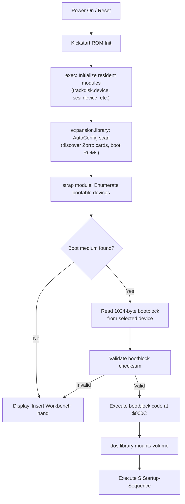
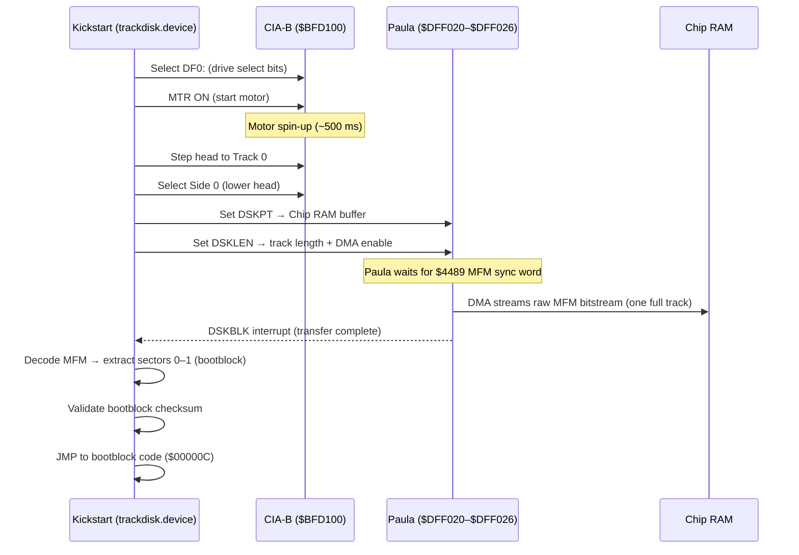
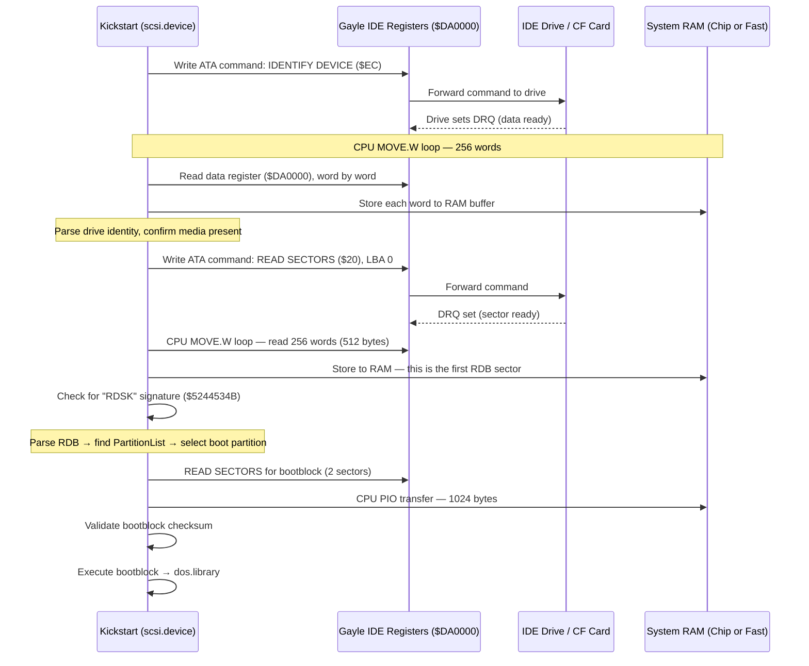
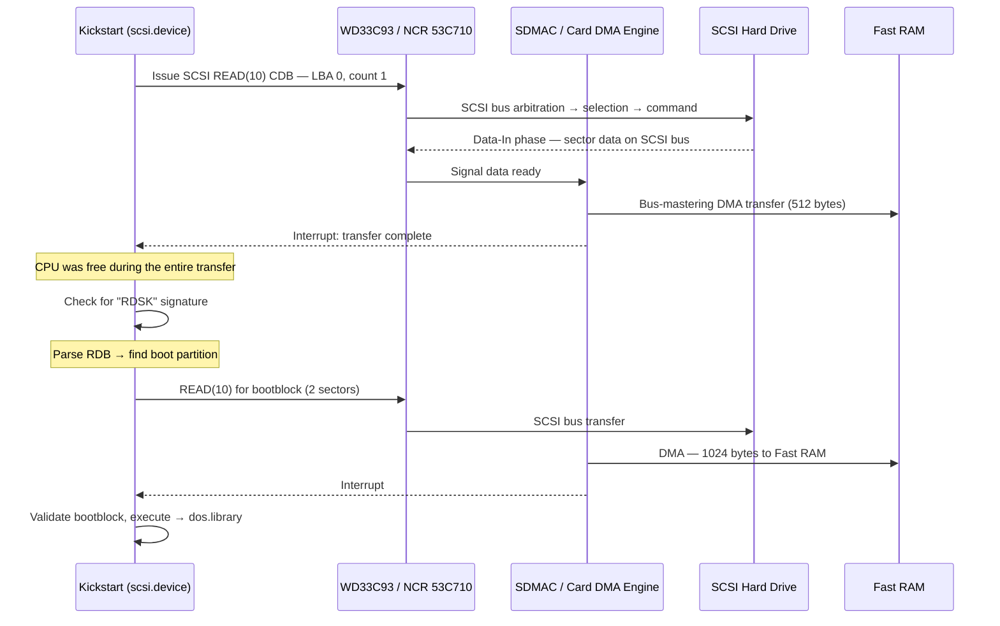

[← Home](../README.md) · [Boot Sequence](README.md)

# Disk Boot — Floppy, Hard Drive, and Storage Media

## Overview

The Amiga's disk boot process is orchestrated by the Kickstart ROM, transitioning the system from hardware initialization into a running operating system. After the CPU resets and `exec.library` initializes the system, resident device drivers (like `trackdisk.device` for floppies and `scsi.device` for internal IDE/SCSI) are brought online. The `expansion.library` then performs the AutoConfig scan, executing boot ROMs on expansion cards which parse Rigid Disk Blocks (RDB) and mount hard drive partitions into the system.

Finally, the `strap` module orchestrates the boot process by enumerating all discovered boot nodes, sorting them by priority, and attempting to read a 1024-byte bootblock from the highest-priority device. The physical journey to fetch this bootblock differs significantly depending on the media. Floppy disks rely on CPU-driven MFM decoding and direct hardware control of the CIA and Paula chips. Hard drives use a smart controller (SCSI or IDE) that abstracts the media behind a block-device interface. Despite these differences, both the floppy and hard drive paths converge at the same bootblock execution and subsequent `dos.library` handoff.

Understanding these two paths — and the ecosystem of controllers, drivers, and modern storage media that surrounds them — is essential for anyone working with real hardware, FPGA cores, emulators, or disk image tooling. This article covers the physical details of floppy and hard drive boot, RDB partitioning, the controller/driver landscape, CompactFlash as a modern replacement, and practical workflows for preparing disk images.

**Prerequisites:** [Cold Boot](cold_boot.md) (what happens before media is touched), [Kickstart Init](kickstart_init.md) (how resident modules and device drivers are initialized).

**What happens next:** [DOS Boot](dos_boot.md) (how the bootblock hands off to `dos.library` and the Startup-Sequence).

---

## The Generic Boot Flow

Regardless of whether the boot medium is a DD floppy, a 4 GB SCSI hard drive, or a CompactFlash card plugged into a Gayle IDE port, every Amiga boot passes through the same high-level phases. The differences are in *how* each phase discovers and reads the medium — not in *what* it does with the data once loaded.



The critical insight is that the bootblock is always **1024 bytes** (two 512-byte sectors), always loaded into a **dynamically allocated memory buffer** (typically Chip RAM as requested by the boot node), and always **checksummed identically** — whether it came off a floppy track via MFM DMA or off an IDE drive via a CPU PIO loop. The boot code in the bootblock itself doesn't know or care what physical medium it was read from. This abstraction is what makes the Amiga's boot architecture elegant: the complexity is in the *path to the bootblock*, not in the bootblock itself.

### What Does the Bootblock Code Actually Do?

A common misconception is that the 1024-byte bootblock contains the filesystem driver (e.g., FFS or PFS3) or complex logic to read the disk. It does not. 

For standard AmigaOS bootable disks, the bootblock code is **completely identical** regardless of whether the disk is formatted as OFS, FFS, Directory Caching (DC-FFS), or International FFS. The standard bootblock (written by the Workbench `Install` command) contains less than 100 bytes of 68000 assembly code. Its sole purpose is to bridge the gap between the low-level `strap` module and the higher-level operating system.

When `strap` executes the bootblock at offset `$000C`, the code performs a very specific, minimal handoff:
1. It uses `exec.library` to locate `dos.library` in the ROM.
2. On OS 2.0+, it opens `dos.library`, sets a specific initialization flag in the library's base structure, and closes it.
3. It locates `expansion.library` (or `dos.library` on OS 1.3) and extracts the pointer to its `rt_Init` (ROM initialization) vector.
4. It returns this pointer to `strap` (in CPU register `A0`), along with a success code (`D0 = 0`).
5. `strap` then executes a direct `JMP` to that ROM routine, handing off control to the OS to mount the boot volume and execute `S:Startup-Sequence`.

Because this standard boot code only manipulates ROM pointers and does no actual disk I/O, it is **filesystem-agnostic** and **medium-agnostic**. The actual filesystem driver used to read `S:Startup-Sequence` is either resident in the Kickstart ROM (for FFS/OFS) or was previously loaded into RAM from the Rigid Disk Block during the AutoConfig scan (for third-party filesystems like PFS3).

*(Note: Custom bootblocks, such as those used by trackloading games or the demoscene, replace this standard code entirely to bypass `dos.library` and take direct control of the hardware. See [Custom Loaders and DRM](../05_reversing/custom_loaders_and_drm.md) for details.)*

For the detailed bootblock format, checksum algorithm, and `dos.library` handoff sequence, see [DOS Boot](dos_boot.md).

---

## Booting from Floppy (DF0:)

### The Hardware Chain

Floppy boot is the most hardware-intimate boot path on the Amiga. There is no smart controller, no command protocol, and no abstraction layer between the CPU and the spinning magnetic disk. The system uses three chips in concert:

| Component | Role |
|---|---|
| **CIA-B** ($BFD000) | Motor control, drive select, head stepping, side select, /DSKCHANGE detection |
| **Paula** ($DFF000) | Disk DMA engine — streams raw MFM bitstream to/from Chip RAM |
| **CPU** | Decodes MFM data, validates checksums, executes bootblock |

The Kickstart ROM's `trackdisk.device` orchestrates this hardware. It is a true device driver in the exec sense — it responds to `CMD_READ`, `TD_MOTOR`, `TD_CHANGESTATE` — but internally it is doing bare-metal register manipulation, not issuing commands to a smart controller.

### Step-by-Step Physical Process



### MFM Encoding — What the Hardware Actually Sees

The magnetic surface of an Amiga floppy does not store bytes. It stores a continuous stream of **flux transitions** — magnetic polarity changes that Paula's disk DMA reads as a raw bitstream. The data is encoded using **Modified Frequency Modulation (MFM)**, which interleaves clock bits between data bits to ensure the bitstream never has too many consecutive zeros (which would cause the read head to lose synchronization).

Each Amiga sector on disk is preceded by a **sync word**: `$4489`. Paula's hardware is specifically designed to watch for this pattern in the raw MFM stream. When it detects `$4489`, it knows the next bits are the start of a sector header. This is a hardware-level pattern match — Paula has a dedicated sync register at `$DFF07E` (DSKSYNC) that holds the word to watch for.

The encoding works as follows:

| Data Bit | MFM Encoding Rule |
|---|---|
| 1 | Always preceded by clock bit 0: → `01` |
| 0 (after a 1) | No clock needed: → `00` |
| 0 (after a 0) | Clock bit inserted: → `10` |

This means every data byte expands to 16 MFM bits (2 bytes on disk). A DD floppy track stores 11 sectors × 512 bytes = 5632 data bytes, which become ~12,668 bytes of MFM-encoded data (including sector headers, gaps, and checksums) — fitting within the ~12,800 raw bytes per track that the drive physically supports at 300 RPM.

> [!NOTE]
> `trackdisk.device` reads an entire track into a Chip RAM buffer as raw MFM, then decodes it in software to extract individual sectors. It does not read individual sectors — the granularity of the DMA transfer is always one full track. This is why AmigaDOS floppy access is track-oriented, and why reading a single byte from a floppy still reads 5.5 KB of data into the track buffer.

### Custom Trackloaders and the Floppy's Unique Property

The floppy boot path has a property that no other Amiga boot medium shares: **the bootblock code can bypass DOS entirely**. Because `trackdisk.device` provides raw sector access and the bootblock executes with full supervisor privileges, game developers routinely replaced the standard bootblock with custom trackloaders that read non-standard disk formats (extra sectors per track, long tracks, modified MFM encoding) directly via Paula's DMA registers. This is the foundation of Amiga game copy protection and the demoscene's disk-based intros.

For an in-depth treatment of custom trackloaders, non-standard disk formats, and physical DRM tricks, see [Custom Loaders and DRM](../05_reversing/custom_loaders_and_drm.md).

---

## Booting from Hard Drive

### The Smart Device Paradigm

Hard drive boot is architecturally the opposite of floppy boot. Instead of the CPU directly controlling motors and reading raw bitstreams, a **smart controller** handles all physical media interaction. The CPU communicates with the controller through a command/response protocol — either ATA task file registers (for IDE) or SCSI command descriptor blocks (for SCSI). The controller translates these high-level commands into the low-level operations needed to read sectors from the physical media.

This abstraction means the CPU never sees MFM encoding, head positioning, or rotational timing. It sends a command ("read sector at LBA N"), waits for the controller to signal completion, and then retrieves the data. The data path from controller to RAM is where the critical architectural distinction lies — and where the existing documentation in this repository had an error that needs correcting.

### PIO vs DMA — The Critical Distinction

> [!WARNING]
> **Stock Commodore IDE controllers have no DMA.** The Gayle chip (A600, A1200) and the A4000 motherboard IDE interface are strictly PIO (Programmed I/O). The CPU executes a `MOVE.W` loop to transfer every word of data between the IDE data register and system RAM. This consumes 100% of the CPU during disk I/O. Only SCSI controllers (A3000, A4000T, Zorro cards) and the third-party FastATA Zorro IDE card have DMA capability. This distinction is fundamental to understanding Amiga storage performance.

| Transfer Method | How It Works | CPU Load | Controllers |
|---|---|---|---|
| **PIO (Programmed I/O)** | CPU reads/writes every word via `MOVE.W` loop between device register and RAM | **100%** during transfer | Gayle IDE (A600/A1200), A4000 IDE, Buddha, Catweasel, TF1260 |
| **DMA (Direct Memory Access)** | Controller's DMA engine transfers data to/from RAM autonomously; CPU is free | **~0%** during transfer | A3000 SCSI (SDMAC), A4000T SCSI, A2091, GVP Series II, A4091, FastATA |

### IDE Boot — Step by Step (PIO Path)

This is the boot path for the most common Amiga hard drive setup: an A1200 or A600 with a 2.5" hard drive or CompactFlash card connected to the Gayle IDE port.



Note the key difference from floppy boot: there is no MFM decoding, no motor control, and no DMA from the disk subsystem. But there is also no DMA *to* RAM — every word passes through a CPU register. On a stock 68020 at 14 MHz (A1200), this yields approximately 1.5 MB/s sustained throughput, regardless of how fast the drive itself is.

### SCSI Boot — Step by Step (DMA Path)

This is the boot path for an A3000 with its onboard WD33C93/SDMAC SCSI controller, or a big-box Amiga with a Zorro SCSI card.



The key advantage: the CPU is idle during data transfer. On a system with a 68040 or 68060 doing background computation (rendering, decompression), SCSI DMA means disk I/O doesn't stall the CPU. This is why the A3000's SCSI architecture was considered superior to the later A4000's cost-reduced IDE — despite IDE drives being cheaper and more readily available.

### AutoConfig and Boot ROMs — How Controllers Appear

Before any hard drive can boot, its controller must be discovered and its device driver must be loaded. For onboard controllers (Gayle IDE, A3000 SCSI), the drivers are resident modules in the Kickstart ROM — they initialize automatically during the RomTag scan. For Zorro expansion cards, the process is more involved:

1. **AutoConfig scan** — `expansion.library` walks the Zorro bus, reading each card's configuration registers to determine manufacturer ID, product ID, and memory requirements. See [AutoConfig](../01_hardware/common/autoconfig.md).

2. **DiagArea check** — If a card's AutoConfig ROM contains a **DiagArea** structure, the Kickstart copies it into RAM and calls its `da_DiagPoint` routine. This is where SCSI controllers install their device driver (`scsi.device`, `gvpscsi.device`, etc.) into the exec device list — *before* any boot device is selected.

3. **Boot ROM execution** — If the DiagArea also contains a boot vector (`da_BootPoint`), the card can participate in the boot device selection process. The boot ROM typically scans the attached SCSI bus for drives, reads their RDB, and registers bootable partitions with the strap module.

This DiagArea mechanism is what allows a GVP SCSI card to boot an Amiga 2000 from a SCSI drive without any software on a floppy — the card's ROM contains both the device driver and the boot code.

> [!NOTE]
> The TF1260 accelerator's IDE port is a notable exception to this pattern. It has **no boot ROM** — the `ehide.device` driver is not in the card's ROM or the Kickstart ROM. You must boot from another device (typically the A1200's internal Gayle IDE port) and load the driver with `LoadModule DEVS:ehide.device` during the Startup-Sequence. This means TF1260 IDE storage is never the primary boot device.

---

## RDB Partitioning — From the Boot Perspective

The **Rigid Disk Block (RDB)** is the Amiga's partitioning standard — a self-describing, linked-list structure that is far more flexible than the PC's contemporary MBR scheme. Understanding how the Kickstart interprets the RDB at boot time is essential for setting up bootable hard drives.

For the complete RDB on-disk structure (field offsets, checksums, PartitionBlock layout, FileSysHdr format), see [Filesystem — RDB section](../07_dos/filesystem.md).

### The RDB Scan — Blocks 0 Through 15

When a hard drive device driver reports a drive to the Kickstart, the boot code doesn't just read block 0. It scans **blocks 0 through 15** (`RDB_LOCATION_LIMIT`), looking for the 4-byte signature `RDSK` (`$5244534B`) at offset `$00` of each block. This range exists for three reasons:

1. **Coexistence with other schemes** — If the RDB were locked to block 0, it would conflict with PC MBR partitioning. Allowing it at blocks 1–15 enables dual-format disks.

2. **Bad block resilience** — If block 0 develops a physical defect, the RDB at block 1 (or 2, etc.) remains accessible. The partition map survives a single-block failure.

3. **Layout flexibility** — Some controllers reserve block 0 for their own use. The 16-block scan accommodates this.

In practice, most tools (HDToolBox, `rdbtool`) write the RDB to block 0 (or block 2 for legacy SCSI compatibility). The scan is a safety net, not a routine necessity.

### Boot Priority — How Kickstart Picks a Partition

Once the RDB is found, the Kickstart walks the PartitionBlock linked list (starting from `rdb_PartitionList`) and collects every partition that has:

- The **`PBF_BOOTABLE`** flag set (bit 0 of `de_Flags`)
- The **`PBF_AUTOMOUNT`** flag set (bit 1 of `de_Flags`)

These partitions are sorted by their **`de_BootPri`** field (a signed 8-bit value, range −128 to +127). The partition with the highest BootPri wins. Ties are broken by list order (first in the RDB's linked list wins).

| BootPri | Typical Use |
|---|---|
| 5 | Default for DH0: (Workbench partition) |
| 0 | Default for secondary partitions (DH1:, DH2:) |
| −128 | Never auto-boot (data-only partition) |
| ≥ 15 | Overrides floppy boot (floppy BootPri is typically 5 on KS 2.0+) |

> [!IMPORTANT]
> Floppy drives (DF0:) have a **built-in boot priority** that varies by Kickstart version. On KS 1.3, the floppy always boots first if a disk is inserted. On KS 2.0+, the floppy's effective BootPri is around 5, so a hard drive partition with BootPri ≥ 6 boots first even with a floppy inserted. Setting a partition's BootPri to 15 or higher guarantees it boots before any floppy — useful for CF card setups where you never want floppy boot.

### Filesystem Loading from RDB

The RDB can store **complete filesystem driver binaries** inline — this is how third-party filesystems like PFS3 and SFS work without modifying the Kickstart ROM. The mechanism:

1. The RDB's `rdb_FileSysHdrList` field points to a chain of **FileSysHdr** blocks, each containing a DosType identifier and the binary code for a filesystem handler.

2. Each PartitionBlock's `de_DosType` field specifies which filesystem to use (e.g., `DOS\1` for FFS, `PFS\3` for PFS3).

3. At boot time, the Kickstart matches each partition's DosType to a FileSysHdr in the RDB. If a match is found, it loads the filesystem binary from the RDB into RAM and uses it to mount the partition.

4. If no match is found in the RDB, the Kickstart falls back to the ROM-resident filesystem (FFS from the Kickstart ROM).

This design means you can install PFS3 on a brand-new hard drive using HDToolBox, and the drive will boot with PFS3 even though the Kickstart ROM knows nothing about PFS3 — the filesystem binary is stored on the drive itself, in the RDB reserved area before the first partition.

### HDToolBox — The Standard Partitioning Tool

HDToolBox is the Workbench utility for creating and editing RDB partition tables. It ships on the Workbench Install floppy (OS 2.0+) and in the `Tools` drawer of a Workbench installation. Key operations:

- **Read Configuration** — detect drive geometry (cylinders, heads, sectors)
- **Partition Drive** — create, resize, and delete partitions
- **Change Filesystem** — add filesystem binaries (PFS3, SFS) to the RDB
- **Set Boot Priority** — configure which partition boots first
- **Save Changes to Drive** — write the RDB and partition blocks to disk

> [!NOTE]
> HDToolBox requires the correct device driver name in its `SCSI_DEVICE_NAME` ToolType (accessible via the Workbench Icon > Information menu). For Gayle IDE, this is `scsi.device`. For GVP cards, it's `gvpscsi.device`. For WinUAE emulated drives, it's `uaehf.device`. Getting this wrong is the most common reason HDToolBox shows "no drives found."

---

## Controllers and Drivers — The Ecosystem

The Amiga storage ecosystem spans Commodore's own controllers, dozens of Zorro expansion cards, and accelerator-integrated interfaces. Each has its own device driver, performance characteristics, and boot behavior.

### Commodore Native Controllers

| Controller | Models | Device Driver | Transfer | DMA? | Boot? | Peak Throughput |
|---|---|---|---|---|---|---|
| **Gayle IDE** | A600, A1200 | `scsi.device` (v43+) | PIO mode 0 | ❌ No | ✅ Yes (ROM driver) | ~1.5 MB/s (68020@14 MHz) |
| **A4000 IDE** | A4000, A4000T | `scsi.device` | PIO | ❌ No | ✅ Yes (ROM driver) | ~2.5 MB/s (68030@25 MHz) |
| **A3000 SCSI** | A3000, A3000T | `scsi.device` (v39) | SCSI-1 | ✅ SDMAC | ✅ Yes (ROM driver) | ~3.5 MB/s |
| **A4000T SCSI** | A4000T | `scsi.device` | SCSI-2 | ✅ NCR 53C710 | ✅ Yes (ROM driver) | ~5 MB/s |

The confusing naming — both the IDE and SCSI interfaces use drivers called `scsi.device` — is a historical accident. Commodore named the A600/A1200 IDE driver `scsi.device` for compatibility with existing RDB tools that hardcoded the name. Despite the name, the Gayle `scsi.device` speaks ATA, not SCSI. See [SCSI](../10_devices/scsi.md) for the full driver interface specification.

For Gayle IDE hardware details — register layout, byte-lane mapping, interrupt routing via CIA-A — see [Gayle IDE & PCMCIA](../01_hardware/common/gayle_ide_pcmcia.md).

### Zorro Expansion SCSI Cards

| Card | Chip | Device Driver | Bus | DMA? | Peak Throughput | Notes |
|---|---|---|---|---|---|---|
| **A2091** | WD33C93 | `scsi.device` | Zorro II | ✅ Yes | ~2.5 MB/s | Commodore. 14 MHz clock hack popular |
| **A2090** | WD33C93 | `scsi.device` | Zorro II | ✅ Yes | ~1.5 MB/s | Earlier design, less reliable |
| **GVP Series II** | WD33C93A | `gvpscsi.device` | Zorro II | ✅ DPRC | ~3.5 MB/s | Proprietary driver — incompatible with Commodore `scsi.device` |
| **GVP HC+8** | WD33C93A | `gvpscsi.device` | Zorro II | ✅ DPRC | ~3.5 MB/s | 8 MB RAM onboard. No termpower — issue with modern SCSI emulators |
| **A4091** | NCR 53C710 | `2nd.scsi.device` | Zorro III | ✅ Yes | ~8–10 MB/s | Fastest stock Commodore SCSI. ReA4091 open-source revival |
| **Blizzard SCSI Kit** | NCR 53C80 | `BlizkitSCSI.device` | Accelerator bus | ✅ Yes | ~3 MB/s | Plugs into Blizzard 1230/1260 |
| **Cyberstorm SCSI** | NCR 53C710/720 | `cybscsi.device` | Accelerator bus | ✅ Yes | ~10 MB/s | Phase5 accelerator boards |

> [!NOTE]
> GVP cards use a proprietary DPRC (Dual-Port RAM Controller) chip and require GVP-specific partitioning software (FaaastPrep or ExpertPrep). They are **not compatible** with Commodore's HDToolBox or `scsi.device`. If you're working with a GVP card, you must use `gvpscsi.device` in all tooltype and script references.

### Third-Party IDE Controllers (Zorro)

| Card | Device Driver | Bus | DMA? | Peak Throughput | Notes |
|---|---|---|---|---|---|
| **Buddha** | `buddha.device` | Zorro II | ❌ PIO | ~2 MB/s | 2 IDE ports. Popular for big-box Amigas |
| **FastATA** | `fastatahd.device` | Zorro II | ✅ DMA | ~6–8 MB/s | **Only Amiga IDE card with DMA** — UDMA/33 support |
| **Catweasel** | `catweasel.device` | Zorro II | ❌ PIO | ~2 MB/s | Also includes floppy controller for HD/ED disks |

### Accelerator-Integrated Storage

| Accelerator | Interface | Device Driver | Boot? | Notes |
|---|---|---|---|---|
| **TF1260** (TerribleFire) | IDE | `ehide.device` | ❌ **No autoboot** | Driver not in ROM. Must boot from Gayle IDE first, then `LoadModule DEVS:ehide.device` |
| **Blizzard 1230/1260** | SCSI (optional kit) | `BlizkitSCSI.device` | ✅ DiagArea boot ROM | NCR 53C80 based |
| **Cyberstorm MK II/III** | SCSI (onboard) | `cybscsi.device` | ✅ DiagArea boot ROM | NCR 53C710/720. High performance |
| **ACA-1233n** | — | — | — | No onboard storage interface |
| **Warp 1260** | — | — | — | No onboard storage interface |

#### TF1260 IDE — The LoadModule Workaround

The TerribleFire TF1260 accelerator for the A1200 includes an onboard IDE port, but it **cannot autoboot** because the `ehide.device` driver is not stored in the card's flash ROM. The setup workflow:

1. Install your primary boot volume on the A1200's **internal Gayle IDE** port (typically a CF card via adapter)
2. Copy `ehide.device` to `DEVS:` on the boot volume
3. Add to `S:Startup-Sequence` (before `SetPatch`):
   ```
   C:LoadModule >NIL: DEVS:ehide.device
   ```
4. Connect a second drive to the TF1260 IDE port — it will appear as an additional device after boot

> [!WARNING]
> The TF1260 IDE interface can be temperamental. It is recommended to remove capacitors E123C and E125C from the A1200 motherboard for stability, and to use high-quality 3.3V CompactFlash cards. Some users create custom Kickstart ROMs that include `ehide.device` to enable autobooting from the TF1260 port.

---

## CompactFlash — The Modern Boot Medium

CompactFlash cards have become the standard storage medium for classic Amigas, replacing mechanical hard drives in virtually all modern setups. The reason is simple: CF cards implement **True IDE mode** — they present themselves as standard ATA devices, speak the same command protocol as a hard drive, and plug into the same 44-pin or 40-pin IDE connector via a passive adapter (no active electronics needed).

### Why CF Works

| Property | Mechanical HDD | CompactFlash |
|---|---|---|
| Interface protocol | ATA (IDE) | ATA (True IDE mode) — identical |
| Seek time | 8–20 ms | ~0.1 ms (no moving parts) |
| Power consumption | 2–5 W | 0.1–0.5 W |
| Noise | Audible | Silent |
| Shock resistance | Fragile | Solid-state |
| Availability (2020s) | Extinct (2.5" PATA) | Widely available |

### Practical Setup

For an A1200 with Gayle IDE:

1. **Adapter** — A 44-pin 2.5" IDE to CF adapter. Passive adapters work; no active electronics needed. Ensure the adapter supports the correct voltage (3.3V for most modern CF cards).

2. **Card selection** — Not all CF cards work reliably. Industrial-grade cards with genuine True IDE mode are preferred. Some consumer cards implement only a subset of ATA commands, causing compatibility issues.

3. **MaxTransfer setting** — This is the most common CF pitfall.

> [!WARNING]
> **The MaxTransfer gotcha**: The Gayle IDE interface can corrupt data if a single transfer exceeds a certain size. You **must** set `MaxTransfer` to `$0001FE00` (130,560 bytes) in the RDB PartitionBlock for every partition. In HDToolBox, this is under the partition's "Advanced Options." Failure to set this correctly causes **silent data corruption** — files appear to write successfully but contain garbage. This applies to all Gayle-connected devices (hard drives and CF cards alike). See [ATAPI](../10_devices/atapi.md) for a detailed explanation.

### SD Cards and MicroSD

SD and MicroSD cards can be used with IDE-to-SD adapters, but these adapters contain active bridge electronics (SD uses a different protocol from ATA). Compatibility is less reliable than with CF cards, and some adapters introduce latency or compatibility issues. CF remains the recommended solid-state option for classic Amiga IDE.

---

## Preparing Disk Images and Media

Whether you're setting up a CF card for real hardware, building an HDF for an emulator, or creating an ADF floppy image, there are three distinct workflows available — each suited to different situations.

### amitools — Modern Cross-Platform Workflow

The `amitools` Python package provides `rdbtool` and `xdftool` for creating and manipulating Amiga disk images entirely from a modern computer (macOS, Linux, Windows). This is the fastest workflow for headless/scripted setups.

**Installation:**

```bash
pip install amitools
```

**Complete recipe — Create a bootable HDF from scratch:**

```bash
# 1. Create a 500 MB HDF file and initialize the RDB
rdbtool work.hdf create size=500Mi + init

# 2. Add two partitions: DH0 (100 MB, bootable) and DH1 (rest)
rdbtool work.hdf add size=100Mi name=DH0 bootable=True boot_pri=5 \
  + add name=DH1

# 3. (Optional) Add PFS3 filesystem to the RDB
rdbtool work.hdf fsadd pfs3aio dos_type=PFS3 version=19.2

# 4. Format partitions with FFS (DOS\3 = FFS + International mode)
xdftool work.hdf open part=DH0 + format "Workbench" ffs intl
xdftool work.hdf open part=DH1 + format "Work" ffs intl

# 5. Pack a Workbench installation into DH0
xdftool work.hdf open part=DH0 + pack ./wb31_files/

# Verify the RDB:
rdbtool work.hdf info
rdbtool work.hdf list

# Verify the filesystem:
xdftool work.hdf open part=DH0 + list
```

**ADF floppy images:**

```bash
# Create a blank DD floppy image
xdftool blank.adf create

# Format it
xdftool blank.adf format "MyDisk" ofs

# Pack files
xdftool blank.adf pack ./my_files/

# List contents
xdftool blank.adf list
```

> [!NOTE]
> `rdbtool` creates the RDB and partition table; `xdftool` handles the filesystem layer (formatting, file operations). For PFS3 partitions, `rdbtool` can add the filesystem binary to the RDB (`fsadd`), but the partition must be quick-formatted from within a booted Amiga or WinUAE — `xdftool` cannot write PFS3 filesystem structures, only FFS/OFS.

### WinUAE — GUI-Based Workflow

WinUAE provides the most complete disk preparation workflow because it runs a real AmigaOS instance, giving you access to HDToolBox and all native formatting tools. This is the recommended approach when you need PFS3, complex partition layouts, or when preparing a CF card for real hardware.

**Creating an HDF image:**

1. In WinUAE, go to **Settings → Hard Drives → Add Hardfile**
2. Set the size (e.g., 500 MB), choose a filename, click **Create**
3. Set controller to **UAE** or **IDE (Auto)**
4. Boot from a Workbench Install ADF
5. Open HDToolBox (see below for ToolType setup)
6. Partition, format, and install Workbench

**Partitioning with HDToolBox in WinUAE:**

1. Select HDToolBox in the `Tools` drawer — **do not double-click yet**
2. Open **Icon → Information** and change the `SCSI_DEVICE_NAME` ToolType:
   - For UAE hardfiles: `uaehf.device`
   - For real CF cards accessed via WinUAE: `uaehf.device`
3. Double-click HDToolBox — it should detect your drive
4. **Change Drive Type → Define New → Read Configuration** (auto-detect geometry)
5. **Partition Drive** — create your partitions, set BootPri, select filesystem
6. **Save Changes to Drive** — writes the RDB
7. Reboot the emulation for partitions to appear

**Writing to a real CF card from WinUAE:**

1. Insert CF card into a USB card reader
2. On Windows, open an **Administrator Command Prompt**:
   ```
   diskpart
   list disk          (identify your CF card by size)
   select disk N      (replace N with CF card number)
   clean              (removes all Windows partitions)
   exit
   ```
3. Launch WinUAE **as Administrator** (right-click → Run as Administrator)
4. Go to **Hard Drives → Add Hard Drive** and select the physical CF card
5. Set controller to **IDE0** and ensure **Read/Write** is checked
6. Boot and use HDToolBox with `SCSI_DEVICE_NAME=uaehf.device`

> [!WARNING]
> When using `diskpart clean`, double-check the disk number. Selecting the wrong disk will erase your Windows drive. Always verify by disk size.

**Transferring an HDF to a CF card:**

On **Windows**, use `Win32DiskImager` to write the `.hdf` file directly to the CF card. On **macOS/Linux**:

```bash
# Identify the CF card device (e.g., /dev/disk4 on macOS, /dev/sdc on Linux)
# WARNING: Triple-check the device — writing to the wrong device destroys data

# macOS:
diskutil list                    # identify CF card
diskutil unmountDisk /dev/diskN  # unmount
sudo dd if=work.hdf of=/dev/rdiskN bs=1m

# Linux:
lsblk                           # identify CF card
sudo dd if=work.hdf of=/dev/sdX bs=1M status=progress
sync
```

### Native Amiga Workflow

If you're working on a running Amiga with a hard drive already installed, you can prepare additional drives or partitions natively.

**HDToolBox (partitioning):**

```
; From Workbench: open the Tools drawer, run HDToolBox
; Or from Shell:
1> SYS:Tools/HDToolBox scsi.device
```

**Install (write bootblock):**

```
; Make a partition bootable by writing a standard bootblock:
1> Install DH0:
```

**Format (from Shell):**

```
; Quick format a partition:
1> Format DRIVE DH1: NAME "Work" FFS INTL QUICK
```

**Format (from Workbench):**

Select the partition icon → **Icons → Format Disk** → choose Quick Format.

### Decision Guide — Which Workflow to Use

| Scenario | Recommended Workflow |
|---|---|
| **Building an HDF for an emulator** | `amitools` (fast, scriptable, no GUI needed) |
| **Preparing a CF card for real hardware** | WinUAE (full HDToolBox access, PFS3 support) |
| **Creating an ADF floppy image** | `amitools xdftool` (simplest) |
| **Adding PFS3 to an existing drive** | WinUAE or native HDToolBox (PFS3 requires Amiga-side formatting) |
| **Automated/CI disk image builds** | `amitools` (fully scriptable, headless) |
| **Repartitioning a drive on a running Amiga** | Native HDToolBox |
| **Mass-producing identical CF cards** | `amitools` to create master HDF → `dd` to clone |

---

## Physical Failure Modes

### Floppy Failures

| Failure | Symptom | Cause | Recovery |
|---|---|---|---|
| **No boot (hand icon)** | Kickstart shows "Insert Workbench" | Bootblock corrupt, disk unformatted, or wrong filesystem ID | Re-install bootblock with `Install DF0:` |
| **Read errors (blinking drive light)** | Repeated retries, eventual failure | Dirty heads, media degradation, demagnetization | Clean heads with isopropyl alcohol; disk may be unrecoverable |
| **Track 0 failure** | Drive clicks repeatedly, never boots | Track 0 sensor misalignment or physical media damage at track 0 | Replace drive mechanism |
| **Alignment drift** | Reads own disks but not disks from other drives | Stepper motor calibration drift | Realign with reference disk (Amiga Test Kit) |
| **Motor doesn't spin** | No activity | CIA-B failure, broken belt (rare on Amigas), or power supply issue | Check CIA-B; replace drive |

### Hard Drive / IDE Failures

| Failure | Symptom | Cause | Recovery |
|---|---|---|---|
| **No drive detected** | HDToolBox shows no drives | Wrong device driver name in ToolType, cable issue, drive DOA | Verify `SCSI_DEVICE_NAME`, check cable, test drive in another system |
| **RDB not found** | Drive detected but no partitions | RDB corrupted or overwritten (e.g., by a PC partitioning tool) | Restore RDB from backup; or re-partition (data lost) |
| **Filesystem validation on every boot** | "Validating DH0:" message on every reboot | Unclean shutdown with FFS, bitmap corruption | Let validation complete; switch to PFS3 for instant recovery |
| **Data corruption (silent)** | Files contain garbage | `MaxTransfer` not set correctly on Gayle IDE | Set `MaxTransfer=$0001FE00` in RDB; re-copy affected files |
| **Spin-up timeout** | Drive detected intermittently | Power supply insufficient for mechanical drive spin-up | Use a powered CF adapter, or replace with CF card |

### CompactFlash-Specific Failures

| Failure | Symptom | Cause | Recovery |
|---|---|---|---|
| **Incompatible card** | Drive not detected or read errors | Card lacks True IDE mode, or uses incompatible ATA commands | Try a different CF brand (industrial-grade recommended) |
| **Write protect** | Writes fail silently or with errors | CF card's internal write-protect activated | Replace card, or check adapter switch |
| **Capacity mismatch** | Partition extends beyond physical media | HPA (Host Protected Area) reduces reported size | Disable HPA with `hdparm` or equivalent tool |
| **Wear-out (rare)** | Increasing bad sectors over time | Flash cell exhaustion after millions of write cycles | Replace card; industrial CF rated for 2M+ cycles |

---

## Floppy vs Hard Drive vs CompactFlash — Summary

| Property | DD Floppy (DF0:) | IDE Hard Drive (DH0:) | CompactFlash (DH0:) |
|---|---|---|---|
| **Capacity** | 880 KB | 20 MB – 4 GB (FFS limit) | 512 MB – 4 GB (FFS), 128 GB (PFS3) |
| **Boot discovery** | Bootblock at sectors 0–1 | RDB scan → partition → bootblock | Same as IDE HDD (True IDE mode) |
| **Transfer method** | Paula DMA (MFM → Chip RAM) | PIO (CPU `MOVE.W` loop) | PIO (same as IDE HDD) |
| **DMA?** | Yes (Paula disk DMA, but MFM-encoded) | No (stock Gayle/A4000 IDE) | No (same interface) |
| **CPU load during I/O** | Moderate (DMA reads, CPU decodes MFM) | 100% (CPU transfers every word) | 100% (same as IDE) |
| **Throughput** | ~50 KB/s | ~1.5 MB/s (A1200), ~2.5 MB/s (A4000) | Same as IDE (limited by interface, not card) |
| **OS bypass possible?** | Yes (custom trackloaders) | No (always goes through device driver and RDB) | No |
| **Partitioning** | None (whole disk = one volume) | RDB (multiple partitions, boot priority) | RDB (same as HDD) |
| **Filesystem options** | OFS, FFS | OFS, FFS, PFS3, SFS | Same as HDD |
| **Removable at runtime?** | Yes (trackdisk.device tracks /DSKCHANGE) | No (hot-removal = data loss) | No (treated as fixed disk) |
| **Failure mode** | Media degradation, alignment | Mechanical failure, spin-up timeout | Wear-out (rare), incompatibility |

---

## Historical Context and Modern Analogies

### How Competitors Handled Disk Boot

The Amiga's RDB/AutoConfig/DiagArea architecture was remarkably advanced for its era. Contemporary systems used much simpler (and more limited) approaches:

| System | Partitioning | Boot Discovery | Driver Loading |
|---|---|---|---|
| **Amiga (1985+)** | RDB — linked-list, unlimited partitions, embedded filesystem drivers | RDB scan → BootPri sort | AutoConfig DiagArea boot ROM |
| **IBM PC (1981+)** | MBR — 4 primary partitions, 446-byte bootloader | INT 13h BIOS calls → MBR → VBR | BIOS provides basic INT 13h; OS loads its own drivers |
| **Atari ST (1985+)** | Boot sector only — no partition table on floppies; AHDI for HDD | Read boot sector → execute | No expansion bus; driver in boot sector |
| **Mac (1984+)** | Apple Partition Map — tagged partitions | SCSI Manager → boot blocks | ROM-resident SCSI Manager; no expansion ROM support until NuBus |

### Modern Analogies

| Amiga Concept | Modern Equivalent |
|---|---|
| **RDB** | GPT (GUID Partition Table) — both use linked structures, both allow many partitions, both store metadata |
| **AutoConfig + DiagArea** | UEFI Option ROMs — expansion cards install their drivers into the firmware's driver database at boot |
| **`trackdisk.device`** | Linux block device layer (`/dev/sdX`) — abstraction over physical media |
| **FileSysHdr in RDB** | Linux initramfs — filesystem drivers loaded from disk before the root filesystem is mounted |
| **BootPri** | UEFI Boot Order — numbered priority list determining which device boots first |
| **HDToolBox** | `gdisk`/`parted` — partition table editors |
| **`amitools rdbtool`** | `sgdisk` — scriptable partitioning from the command line |

---

## MiSTer / FPGA Notes

FPGA Amiga cores (MiSTer, Minimig, PiStorm) emulate the Gayle IDE interface to present `.hdf` files stored on an SD card as virtual hard drives.

- **HDF compatibility** — MiSTer expects RDB-partitioned `.hdf` files. Create them with `rdbtool` or WinUAE. The core maps the HDF file to the emulated Gayle registers at `$DA0000`.

- **ADF mounting** — Floppy images (`.adf`) are mapped to the emulated `trackdisk.device` — Paula's disk DMA reads from the ADF file as if it were a physical track.

- **SCSI emulation** — Some cores provide a virtual SCSI controller for higher performance; this bypasses the Gayle PIO bottleneck and can theoretically deliver higher throughput since the "DMA" is just a memory copy on the FPGA.

- **MaxTransfer** — The Gayle `MaxTransfer` issue applies to MiSTer's Gayle emulation too. Set `$0001FE00` in the RDB to avoid corruption, even though the "hardware" is emulated.

---

## References

- **NDK 3.9**: `devices/trackdisk.h`, `devices/scsidisk.h`, `dos/filehandler.h`
- **ADCD 2.1**: `Devices_Manual_guide/TrackDisk`, `Devices_Manual_guide/SCSI`
- **amitools**: https://github.com/cnvogelg/amitools — `rdbtool`, `xdftool`, `romtool`
- See also: [Cold Boot](cold_boot.md) — what happens before disk access
- See also: [DOS Boot](dos_boot.md) — bootblock format and `dos.library` handoff
- See also: [Kickstart Init](kickstart_init.md) — how device drivers are initialized
- See also: [Early Startup](early_startup.md) — manual boot device selection
- See also: [Gayle IDE & PCMCIA](../01_hardware/common/gayle_ide_pcmcia.md) — Gayle register layout
- See also: [AutoConfig](../01_hardware/common/autoconfig.md) — Zorro bus and expansion ROM protocol
- See also: [SCSI](../10_devices/scsi.md) — `scsi.device` driver interface and `HD_SCSICMD`
- See also: [ATAPI](../10_devices/atapi.md) — ATA protocol, ATAPI packets, CF card details
- See also: [Filesystem](../07_dos/filesystem.md) — RDB structure, FFS/OFS block layout, PFS3/SFS comparison
- See also: [Custom Loaders and DRM](../05_reversing/custom_loaders_and_drm.md) — custom floppy trackloaders
