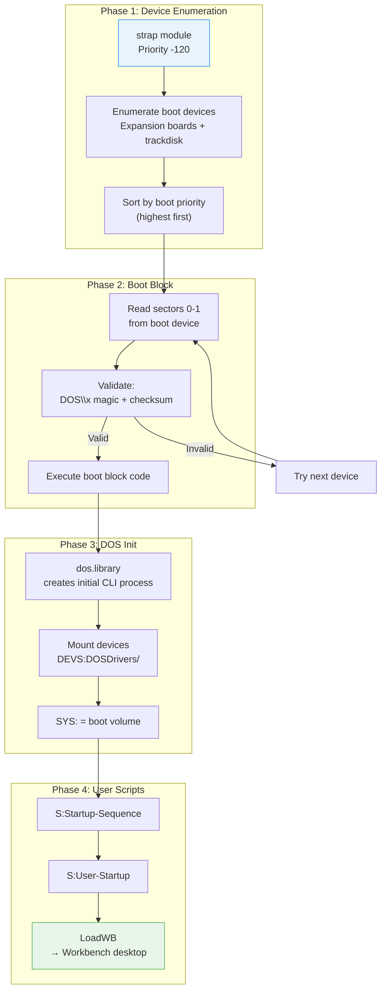

[← Home](../README.md) · [Boot Sequence](README.md)

# DOS Boot — Bootstrap, Boot Block, Mount List, Startup-Sequence

## Overview

After the Kickstart ROM initializes the kernel and resident modules, the `strap` (bootstrap) module takes over. It enumerates bootable devices, reads and executes the boot block, mounts filesystems, and runs the user's startup scripts. This phase transitions the system from "kernel initialized" to "fully running desktop."

---

## Architecture



---

## Phase 1: The strap Module

The `strap` module (bootstrap) is the last resident initialized by Kickstart. It bridges ROM init and disk boot:

```c
/* strap pseudo-code: */
void StrapInit(void)
{
    /* 1. Build list of bootable devices */
    struct BootNode *bootList = NULL;

    /* Check expansion boards (Zorro) for bootable devices */
    struct ConfigDev *cd = NULL;
    while ((cd = FindConfigDev(cd, -1, -1)) != NULL)
    {
        if (cd->cd_Flags & CDF_BOOTABLE)
        {
            /* Add to boot list with priority from RDB */
            AddBootNode(cd->cd_BootPri, cd->cd_BootFlags,
                        cd->cd_DeviceNode, cd->cd_ConfigDev);
        }
    }

    /* Always add DF0: (trackdisk unit 0, boot priority 5) */
    AddBootNode(5, 0, df0_DeviceNode, NULL);

    /* 2. Sort boot list by priority (highest first) */
    SortBootNodes(&bootList);

    /* 3. Try each device in order */
    struct BootNode *bn;
    for (bn = bootList; bn; bn = bn->bn_Next)
    {
        if (TryBootDevice(bn) == SUCCESS)
            break;  /* Booted successfully */
    }

    /* 4. If nothing bootable: "Insert Disk" screen */
    if (!bn)
        ShowInsertDiskScreen();
}
```

### Boot Priority

| Device | Default Priority | Source |
|---|---|---|
| DF0: | 5 | Hardcoded in trackdisk.device |
| DH0: | 0 | Set in RDB (Rigid Disk Block) partition table |
| DH1: | −5 | Set in RDB |
| DF1: | −10 | Hardcoded |
| CD0: | −20 | SCSI/IDE CD-ROM |

Higher priority = tried first. A floppy in DF0: (pri 5) boots before a hard disk DH0: (pri 0) unless the hard disk partition has a higher boot priority set in HDToolBox.

### Changing Boot Priority

```
; In HDToolBox:
;   1. Select partition → "Change..." → set Boot Priority
;   2. Priority > 5 = boots before floppy

; From CLI (OS 3.1+):
1> Assign SYS: DH0:
; (Does not change boot priority — only the current session)
```

---

## Phase 2: Boot Block

### Boot Block Format

The first 2 sectors (1024 bytes total) of a bootable disk:

```
Offset   Size   Field            Description
──────────────────────────────────────────────────
$000     4      DiskType         "DOS\0" through "DOS\7"
$004     4      Checksum         Ones' complement checksum of all 256 longwords
$008     4      RootBlock        Root block number (usually 880 for DD floppy)
$00C     1012   BootCode         68000 machine code — entry point at $00C
```

### Disk Type Identifiers

| ID Bytes | String | Hex | Filesystem | Features |
|---|---|---|---|---|
| `444F5300` | `DOS\0` | $00 | OFS | Original File System |
| `444F5301` | `DOS\1` | $01 | FFS | Fast File System |
| `444F5302` | `DOS\2` | $02 | OFS+I | OFS + International characters |
| `444F5303` | `DOS\3` | $03 | FFS+I | FFS + International characters |
| `444F5304` | `DOS\4` | $04 | OFS+DC | OFS + Directory Cache |
| `444F5305` | `DOS\5` | $05 | FFS+DC | FFS + Directory Cache |
| `444F5306` | `DOS\6` | $06 | OFS+LFN | OFS + Long Filenames (OS 3.2) |
| `444F5307` | `DOS\7` | $07 | FFS+LFN | FFS + Long Filenames (OS 3.2) |
| `4B49434B` | `KICK` | — | Kickstart disk | A1000 WCS boot floppy |
| Non-DOS | — | — | Custom | Game/demo custom bootblock |

### Boot Block Checksum

```c
/* Boot block checksum calculation */
ULONG ComputeBootChecksum(ULONG *block)
{
    ULONG sum = 0;
    ULONG saved = block[1];   /* Save current checksum */
    block[1] = 0;              /* Clear for calculation */

    for (int i = 0; i < 256; i++)   /* 256 longwords = 1024 bytes */
    {
        ULONG old = sum;
        sum += block[i];
        if (sum < old)         /* Carry */
            sum++;
    }

    block[1] = saved;          /* Restore */
    return ~sum;               /* Ones' complement */
}

/* Verify: */
if (ComputeBootChecksum(bootBlock) == bootBlock[1])
{
    /* Checksum valid — execute boot code */
}
```

### Boot Block Execution

```c
/* The strap module loads sectors 0-1 into Chip RAM and calls the code: */

/* Entry conditions for boot block code: */
/* A0 = pointer to boot block buffer in memory */
/* A1 = pointer to IOStdReq used to read the boot block */
/* A6 = SysBase (ExecBase) */
/* D0 = 0 */

/* The boot block code typically: */
/* 1. Finds dos.library */
/* 2. Calls dos.library's boot entry point */
/* Return value: 0 = success, non-zero = failure (try next device) */
```

### Standard DOS Boot Block Code

```asm
; Standard AmigaDOS boot block (abbreviated):
BootEntry:
    LEA     DosName(PC),A1      ; "dos.library"
    JSR     -96(A6)              ; FindResident(A1) [exec LVO -96]
    TST.L   D0
    BEQ.S   .fail

    MOVE.L  D0,A0
    MOVE.L  22(A0),A0            ; rt_Init
    MOVEQ   #0,D0
    RTS                           ; Return to strap — which calls rt_Init

.fail:
    MOVEQ   #-1,D0
    RTS

DosName:
    DC.B    'dos.library',0
    EVEN
```

### Custom Boot Blocks (Games/Demos)

Games bypass the standard boot block to take full control of the hardware:

```asm
; Typical game boot block:
BootEntry:
    ; Disable interrupts and DMA
    MOVE.W  #$7FFF,$DFF09A       ; INTENA = all off
    MOVE.W  #$7FFF,$DFF096       ; DMACON = all off

    ; Load the game's loader from disk
    LEA     $80000,A0            ; Destination in Chip RAM
    MOVEQ   #10,D0               ; Load 10 sectors
    BSR     ReadSectors           ; Custom disk reading routine

    ; Jump to game code
    JMP     $80000

; The game now has full hardware control — no OS running
```

> **Note**: Non-DOS boot blocks are why some games don't work with hard disk installers — they expect to take over the hardware immediately.

---

## Phase 3: DOS Initialization

Once the standard boot block returns successfully, `dos.library` takes over:

### Initial CLI Process

```c
/* dos.library creates the initial CLI process: */
/* 1. Create a Process (struct Process) — the "Initial CLI" */
/* 2. Set up stdin/stdout to the boot console */
/* 3. Set SYS: assign to the boot volume */
/* 4. Set C:, S:, L:, LIBS:, DEVS:, FONTS: assigns */
/* 5. Execute S:Startup-Sequence */
```

### Mount List Processing

Devices are mounted from two sources:

#### DEVS:MountList (Legacy)

```
/* DEVS:MountList format (text file): */
DH1:       Handler = L:FastFileSystem
           Priority = 5
           Stacksize = 4000
           GlobVec = -1
           BufMemType = 1
           Device = scsi.device
           Unit = 1
           Flags = 0
           Surfaces = 4
           BlocksPerTrack = 63
           LowCyl = 200
           HighCyl = 400
           Buffers = 50
           BootPri = -5
           DosType = 0x444F5301
#
```

#### DEVS:DOSDrivers/ (Modern — OS 2.0+)

Each file in `DEVS:DOSDrivers/` is a mount specification for one device. These are auto-mounted at boot:

```
; DEVS:DOSDrivers/DH1 (icon file with tooltypes):
HANDLER  = L:FastFileSystem
DEVICE   = scsi.device
UNIT     = 1
FLAGS    = 0
SURFACES = 4
BLOCKSPERTRACK = 63
LOWCYL   = 200
HIGHCYL  = 400
BUFFERS  = 50
DOSTYPE  = 0x444F5301
BOOTPRI  = -5
STACKSIZE = 4000
GLOBVEC  = -1
ACTIVATE = 1
```

### System Assigns

After mounting, the boot process sets up standard logical device assignments:

| Assign | Points To | Purpose |
|---|---|---|
| `SYS:` | Boot volume root | System root |
| `C:` | `SYS:C` | System commands |
| `S:` | `SYS:S` | Scripts and startup files |
| `L:` | `SYS:L` | Handlers and loaders |
| `LIBS:` | `SYS:Libs` | Shared libraries |
| `DEVS:` | `SYS:Devs` | Device drivers and mount info |
| `FONTS:` | `SYS:Fonts` | System fonts |
| `T:` | `RAM:T` | Temporary files |
| `CLIPS:` | `RAM:Clipboards` | Clipboard data |
| `ENV:` | `RAM:ENV` | Environment variables (volatile) |
| `ENVARC:` | `SYS:Prefs/Env-Archive` | Env variables (persistent) |

---

## Phase 4: Startup-Sequence

### Standard Startup-Sequence (OS 3.1)

```
; S:Startup-Sequence — master boot script
; Executed by the initial CLI process

C:SetPatch QUIET                  ; Apply ROM patches for this OS version
C:Version >NIL:                   ; Display version (redirected to NIL:)
FailAt 21                         ; Don't abort on warnings (error level < 21)

; Create RAM: directories
MakeDir RAM:T RAM:Clipboards RAM:ENV RAM:ENV/Sys

; Copy persistent environment to volatile RAM:
Copy >NIL: ENVARC: RAM:ENV ALL NOREQ

; Set up logical assignments
Assign >NIL: T:        RAM:T
Assign >NIL: CLIPS:    RAM:Clipboards
Assign >NIL: REXX:     S:
Assign >NIL: PRINTERS: DEVS:Printers
Assign >NIL: KEYMAPS:  DEVS:Keymaps
Assign >NIL: LOCALE:   SYS:Locale
Assign >NIL: LIBS:     SYS:Classes ADD
Assign >NIL: HELP:     LOCALE:Help DEFER

; Initialize preferences
C:IPrefs

; Start clipboard daemon
ConClip >NIL:

; Run user's custom startup
IF EXISTS S:User-Startup
    Execute S:User-Startup
ENDIF

; Launch Workbench
LoadWB

; End the initial CLI — Workbench takes over
EndCLI >NIL:
```

### Startup-Sequence Commands Explained

| Command | Purpose |
|---|---|
| `SetPatch` | Patches known bugs in ROM libraries for this OS version |
| `FailAt 21` | Continue script even if commands return warning codes (1–20) |
| `Copy ENVARC: RAM:ENV` | Copy persistent prefs to fast volatile RAM for speed |
| `IPrefs` | Apply system preferences (screen mode, fonts, palette, input) |
| `ConClip` | Clipboard manager daemon — enables cut/paste between apps |
| `LoadWB` | Start Workbench — opens the desktop, mounts icons |
| `EndCLI` | Close the initial CLI window — Workbench is now primary UI |

### User-Startup

`S:User-Startup` is the user's personal script — runs after system init but before LoadWB:

```
; S:User-Startup — user customizations
Assign WORK: DH1:
Path SYS:Tools ADD
Path WORK:Bin ADD

; Start background daemons
Run >NIL: C:CrossDOS
Run >NIL: C:PCTaskX

; Load custom keymaps
SetKeyboard usa1
```

---

## Error Handling During Boot

| Error | Symptom | Recovery |
|---|---|---|
| No bootable disk | "Insert Disk" animation | Insert bootable floppy in DF0: |
| Bad boot block checksum | Skips device, tries next | Fix boot block with `Install` command |
| dos.library not found | Guru Meditation | Corrupted ROM — reflash |
| Startup-Sequence error | CLI prompt with error message | Fix script manually |
| Assign to missing volume | "Please insert volume X" requester | Insert disk or skip |
| LoadWB fails | CLI remains visible | Check `SYS:System/Workbench` exists |

### Emergency Recovery

```
; Boot with no Startup-Sequence (hold both mouse buttons):
;   → Early Startup Control → "Boot With No Startup-Sequence"
;   → Get a CLI prompt with SYS: mounted

; Fix corrupt startup:
1> ED S:Startup-Sequence

; Reinstall boot block:
1> Install DF0:
; or for hard disk:
1> Install DH0:
```

---

## References

- NDK39: `dos/dosextens.h`, `dos/filehandler.h`
- ADCD 2.1: `BootStrap`, `AddBootNode`, `MakeDosEntry`
- See also: [Kickstart Init](kickstart_init.md) — what happens before strap
- See also: [Early Startup](early_startup.md) — boot menu options
- See also: [Filesystem](../07_dos/filesystem.md) — FFS/OFS block layout
- *Amiga ROM Kernel Reference Manual: Exec* — boot chapter
