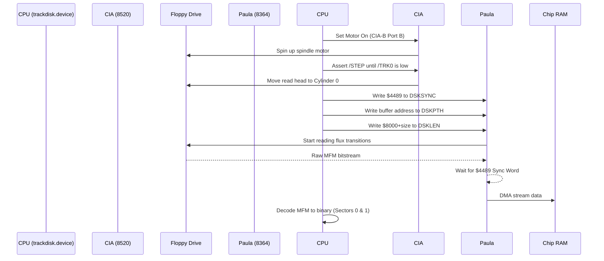
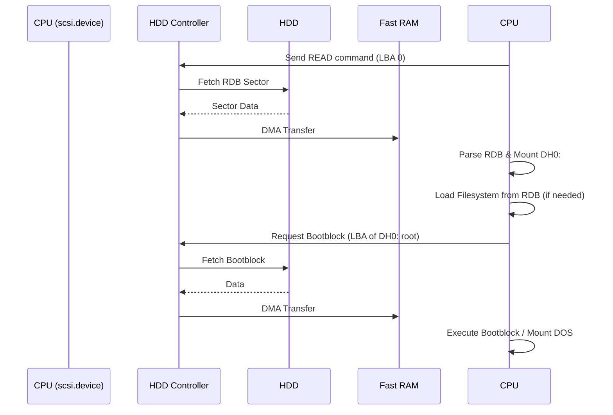

[← Home](../../README.md) · [Boot Sequence](../README.md)

# Physical Boot Process: Floppy vs Hard Drive

While [DOS Boot](dos_boot.md) covers the logical software handoff (from Kickstart to `dos.library` to the Startup-Sequence), it's equally important to understand the *physical* hardware mechanisms involved when an Amiga boots from a storage medium.

The physical boot sequence dictates how raw data is pulled from magnetic media into Chip RAM before the CPU ever sees a `DOS\0` signature or an executable bootblock. This is especially relevant when analyzing [Custom Trackloaders](../05_reversing/custom_loaders_and_drm.md) which bypass the OS and interact with the hardware directly.

---

## 1. Booting from Floppy (DF0:)

The Amiga's floppy drive interface is entirely "dumb." Unlike a modern SATA drive with its own onboard microcontroller, the Amiga CPU and custom chips must manually control the floppy drive's motors and decode its raw magnetic data.

### 1.1 The Hardware Handoff
When the Kickstart ROM's `strap` module decides to boot from `DF0:`, it invokes `trackdisk.device`. This device driver issues commands directly to the CIA (Complex Interface Adapter) and Paula chips.

### 1.2 Step-by-Step Physical Process

1. **Spin Up**: The CPU toggles a bit on CIA-B Port B (`$BFD100`) to turn on the floppy drive motor. It waits a few milliseconds for the spindle to reach a stable 300 RPM.
2. **Seek Track 0**: The CPU pulses the `/STEP` line while monitoring the `/TRK0` sensor. The drive clicks as the read/write head physically moves to the outermost cylinder (Track 0).
3. **MFM DMA Read**: The CPU configures Paula for a disk read:
   - Sets the sync word in `DSKSYNC` (`$4489`).
   - Points `DSKPTH` (Disk Pointer) to an empty buffer in Chip RAM.
   - Writes to `DSKLEN` to start the DMA transfer.
4. **Data Streaming**: Paula watches the raw magnetic flux stream coming from the drive. The moment it sees the magnetic pattern for `$4489`, it starts streaming the subsequent MFM data straight into Chip RAM via DMA.
5. **Software Decode**: `trackdisk.device` reads the MFM data from RAM and runs an EOR/Bit-shift loop to convert the MFM bits back into standard binary bytes. It extracts the first two sectors (the 1024-byte bootblock).
6. **Execution**: If the bootblock is executable, the CPU jumps to it. At this exact moment, **Custom Trackloaders** (used by games) will typically execute `Forbid()` and `Disable()`, permanently locking out `trackdisk.device` and manually repeating steps 2-5 for the rest of the game's data.

---

## 2. Booting from Hard Drive (IDE / SCSI)

Unlike floppies, Hard Disk Drives (HDDs) are "smart." They have onboard controllers that handle physical head stepping, sector addressing (LBA or CHS), and error correction automatically. The Amiga simply asks the drive for a specific block of data.

However, the Amiga's architecture means it doesn't intrinsically know how to read an HDD upon power-up.

### 2.1 The AutoConfig Phase
Before an HDD can boot, the Amiga must discover its controller.

1. **Zorro / AutoConfig**: During early startup, Kickstart probes the expansion bus.
2. **ROM Mapping**: The HDD controller board (e.g., A2091 SCSI or A1200 internal IDE) responds. Kickstart maps the controller's onboard ROM into the Amiga's memory space.
3. **Driver Initialization**: The controller's ROM contains the device driver (e.g., `scsi.device`). Kickstart runs the initialization code in this ROM, which binds the driver to the OS.

### 2.2 Reading the RDB
The Amiga does not use PC-style MBR (Master Boot Record) or GPT. It uses the **Rigid Disk Block (RDB)**.

1. **RDB Scan**: `scsi.device` asks the drive to read Block 0. If it doesn't find the ASCII signature `RDSK`, it checks blocks 1 through 15 until it finds it.
2. **Partition Discovery**: The RDB contains a linked list of partitions (e.g., `DH0:`, `DH1:`).
3. **Filesystem Loading**: Crucially, the Amiga supports loadable filesystems. If `DH0:` uses a custom filesystem (like PFS3 or SFS) that isn't in Kickstart, the RDB actually contains the *binary code for the filesystem itself*. `scsi.device` loads the filesystem code from the RDB into RAM and initializes it.

### 2.3 Step-by-Step Physical Process

Unlike floppies, HDD DMA transfers can typically go directly into **Fast RAM**, bypassing the chipset entirely (depending on the controller). Once the partition's bootblock is loaded and executed, control passes to `dos.library` and the `Startup-Sequence` exactly as it does for a floppy.

---

## 3. What Can Go Wrong (Failure Modes)

Because physical boot sequences rely on moving parts and magnetic media, they are prone to specific physical failure states.

### 3.1 Floppy Failures
*   **Track 0 Sensor Failure**: If the drive's `/TRK0` microswitch is dirty or broken, the drive will repeatedly slam the read head against the physical stop, producing a loud, rapid "grinding" or "machine gun" noise. It cannot find sector 0.
*   **Alignment Drift**: Over time, the stepper motor can drift. The drive's head will physically rest between two tracks, reading a garbled mix of flux transitions. Paula will never see the `$4489` sync word. The system hangs or presents a "Not a DOS disk" error.
*   **Dirty Read Heads**: Dust on the magnetic head weakens the flux signal. The hardware reads the `$4489` sync word, but random bits in the payload flip. The software MFM decode loop succeeds, but the Bootblock Checksum fails, kicking the user back to the Kickstart screen.

### 3.2 Hard Drive Failures
*   **Spin-Up Timeout**: Older SCSI drives take up to 15 seconds to reach operational RPM. If the Kickstart ROM's wait loop times out before the drive asserts the `READY` signal, the Amiga will boot to the Kickstart screen, ignoring the HDD entirely. (Fixed by pressing `Ctrl-Amiga-Amiga` for a warm reboot after the drive is spinning).
*   **RDB Corruption**: If the RDB sectors are overwritten, `scsi.device` will scan blocks 0-15, find nothing, and report the drive as unformatted/empty, even if all partition data is perfectly intact.
*   **Filesystem Validation**: If the Amiga was powered off during a write, the filesystem's bitmap (which tracks free space) is left in an inconsistent state. On the next boot, `dos.library` locks the partition as Read-Only and launches a background "Validator" process. The hard drive LED will blink rapidly for minutes while it rebuilds the bitmap. If validation fails, the drive remains Read-Only.

---

## 4. Summary

| Feature | Floppy (DF0:) | Hard Drive (IDE/SCSI) |
|---|---|---|
| **Hardware Control** | CPU directly controls motors & head stepping | Onboard controller handles mechanics |
| **Data Encoding** | Raw MFM (decoded by CPU in software) | Hardware handles sector decoding |
| **Boot Discovery** | Hardcoded to Track 0, Sector 0 | Scans blocks 0-15 for RDB (Rigid Disk Block) |
| **DMA Target** | Must go to Chip RAM | Usually goes to Fast RAM |
| **OS Bypass** | Trivial (Custom Trackloaders) | Rare (Requires full IDE/SCSI driver implementation) |
