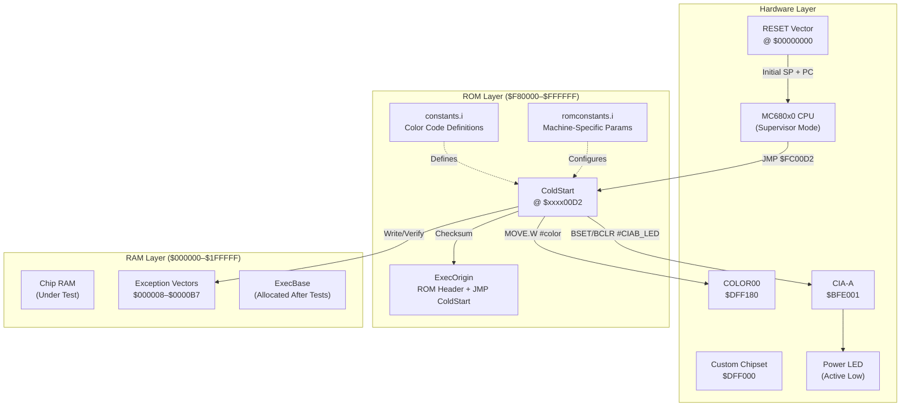
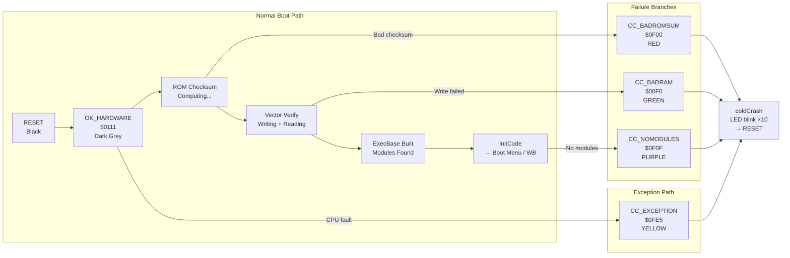
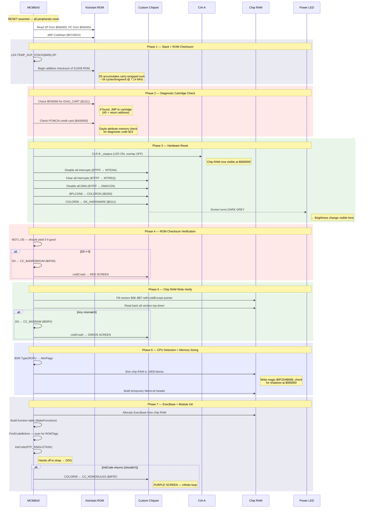
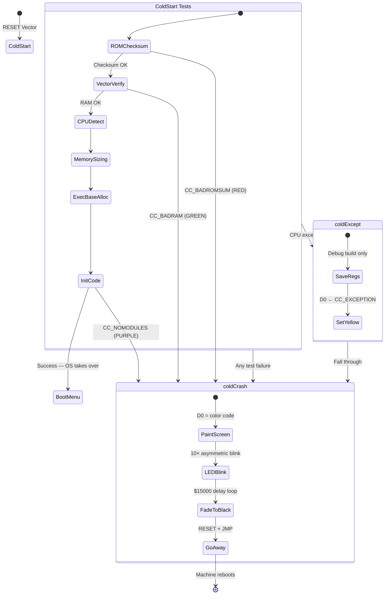
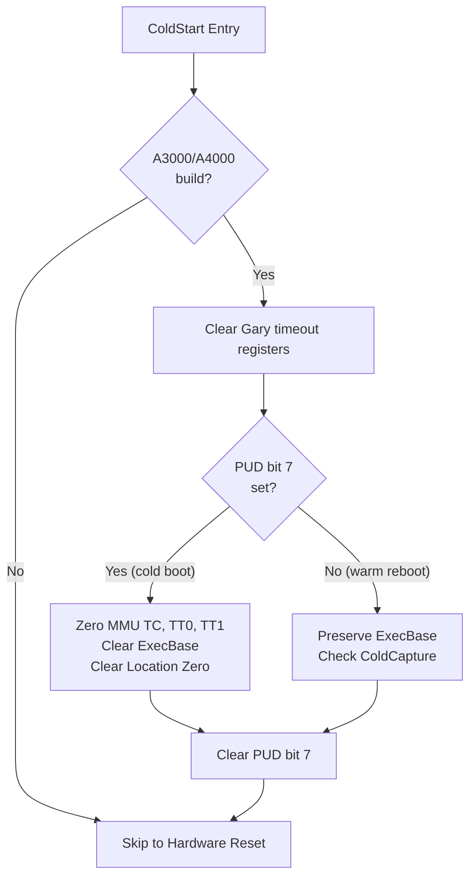
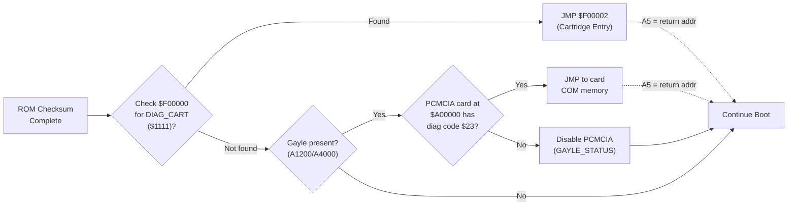
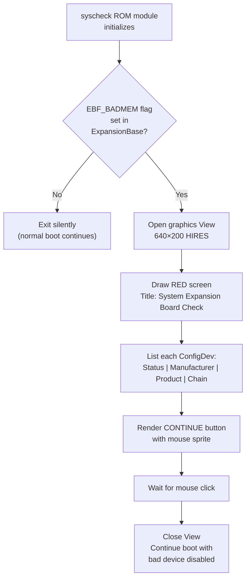
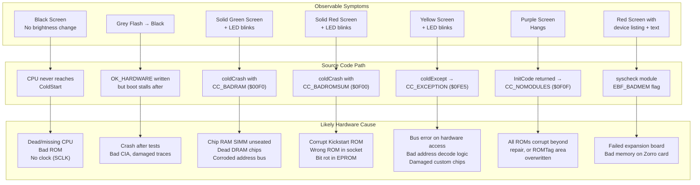

[← Home](../README.md) · [Boot Sequence](README.md)

# Kickstart Boot Diagnostics: Color Screen Self-Test

> **Amiga OS 3.x (V40) — Exec ColdStart Power-On Self-Test**
>
> Source: `os-source/v40_src/kickstart/exec/coldstart.asm`, `constants.i`, `romconstants.i`, `startexec.asm`

---

## Executive Summary

Every Amiga boot begins with a silent conversation between hardware and software — one conducted entirely through screen colors. Before a single library is loaded, before Intuition draws its first pixel, Exec's `ColdStart` routine subjects the machine to a gauntlet of integrity checks. Each test gates the next; failure at any stage halts the boot and paints the entire display a specific diagnostic color while blinking the power LED.

This document provides a complete architectural walkthrough of that self-test sequence as implemented in the Kickstart 3.x ROM, traced directly from the Commodore source code. It is intended for engineers performing board-level repair, emulator authors requiring cycle-accurate boot fidelity, and historians preserving the engineering decisions of the original Amiga team.

---

## Table of Contents

- [1. Architectural Overview](#1-architectural-overview)
- [2. The Color Code Dictionary](#2-the-color-code-dictionary)
- [3. The ColdStart Sequence — Phase by Phase](#3-the-coldstart-sequence--phase-by-phase)
- [4. The coldCrash Handler](#4-the-coldcrash-handler)
- [5. Machine-Specific Variants](#5-machine-specific-variants)
- [6. The Diagnostic Cartridge Intercept](#6-the-diagnostic-cartridge-intercept)
- [7. Post-ColdStart Diagnostics](#7-post-coldstart-diagnostics)
- [8. Troubleshooting Cross-Reference](#8-troubleshooting-cross-reference)
- [9. Historical Context & Competitive Landscape](#9-historical-context--competitive-landscape)
- [10. Source File Map](#10-source-file-map)
- [11. References](#11-references)

---

## 1. Architectural Overview

The boot diagnostic system operates in the narrow window between hardware RESET and the first multitasking context.

At this point, no operating system exists — there is no memory allocator, no interrupt handler, no stack beyond a hardcoded temporary at `$000400`. The CPU is in supervisor mode, and the only output device available is the Amiga custom chipset's color register at `$DFF180` (COLOR00).

This constraint dictates the architecture: **the entire diagnostic vocabulary is a single 12-bit RGB value written to a memory-mapped hardware register**. No text, no graphics, no blitter — just raw color.



### The First Instruction

The 68000 family reads two longwords (2x4 bytes) from address `$00000000` on RESET: the initial Supervisor Stack Pointer and the initial Program Counter. Because the ROM overlay maps Kickstart ROM into this space, the CPU begins execution at the address stored in the ROM header — which is always `ColdStart` at offset `$D2` from the ROM base.

```
ExecOrigin:  DC.W  BIG_ROMS        ; ROM identification ($1114)
             DC.W  JMPINSTR        ; $4EF9 — JMP absolute
             DC.L  ColdStart       ; Must be $FC00D2 or $F800D2
```

> **Why $D2?** A quirk of history. In environments with virtual-memory ROM remapping (SuperKickstart), a software RESET re-maps the physical ROM to low memory. Unless the ColdStart entry point is at a fixed offset that matches across both the physical and virtual address spaces, the machine crashes. The offset `$D2` is that hardcoded contract.

---

## 2. The Color Code Dictionary

All diagnostic color constants are defined in `exec/constants.i` (lines 13–23). They use the Amiga's native 12-bit RGB format (`$0RGB`), written directly to the COLOR00 register at `$DFF180`.

#### 12-bit to 24-bit Color Conversion

The Amiga stores color as a 16-bit word, but only the low 12 bits are used in OCS/ECS: four bits per channel (`$0RGB`). To convert each 4-bit nibble (0–F) to its 8-bit equivalent (0–255), multiply by 17:

| 4-bit | 0 | 1 | 2 | 3 | 4 | 5 | 6 | 7 | 8 | 9 | A | B | C | D | E | F |
|---|---|---|---|---|---|---|---|---|---|---|---|---|---|---|---|---|
| **8-bit** | `00` | `11` | `22` | `33` | `44` | `55` | `66` | `77` | `88` | `99` | `AA` | `BB` | `CC` | `DD` | `EE` | `FF` |

The formula: `8bit_value = nibble × $11` (or `nibble × 17` in decimal). For example:

| Amiga `$0RGB` | Breakdown | 24-bit `#RRGGBB` | Approximate Color |
|---|---|---|---|
| `$0000` | R=0, G=0, B=0 | `#000000` | Black |
| `$0111` | R=1, G=1, B=1 | `#111111` | Dark Grey |
| `$0F00` | R=F, G=0, B=0 | `#FF0000` | Red |
| `$00F0` | R=0, G=F, B=0 | `#00FF00` | Green |
| `$0FE5` | R=F, G=E, B=5 | `#FFEE55` | Yellow |
| `$0F0F` | R=F, G=0, B=F | `#FF00FF` | Magenta |
| `$000F` | R=0, G=0, B=F | `#0000FF` | Blue |
| `$0FFF` | R=F, G=F, B=F | `#FFFFFF` | White |

> **AGA note:** The AGA chipset (A1200/A4000) extends COLOR00 to 24-bit (8 bits per channel) when `BPLCON3` bit `LOCT` = 1. In that mode the 12-bit conversion table above does not apply — each channel uses its full 8-bit value directly. Kickstart diagnostics always run in 12-bit mode since they execute before any AGA-specific setup.

### 2.1 Progress Indicators (Normal Boot)

These colors appear momentarily during a healthy boot, each signaling successful completion of a test phase. The grey intensifies as boot progresses — a deliberate design choice that gives the power-on sequence a visible "warming up" feel.

| Constant | Value | Color | Meaning | When Set |
|---|---|---|---|---|
| `OK_HARDWARE` | `$0111` |  Dark Grey | First software action after RESET | After disabling interrupts/DMA |
| `OK_SOFTWARE` | `$0888` |  Mid Grey | Chip RAM tests passed | After exception vector verify |
| `OK_RESLIST` | `$0AAA` |  Light Grey | All resident modules found | After `FindCodeBefore` |
| `OK_RESSTART` | `$0CCC` |  Bright Grey | About to start resident chain | Just before `InitCode` |

> **Design note:** In the production V40 ROM, only `OK_HARDWARE` survives — the intermediate grey stages (`OK_SOFTWARE`, `OK_RESLIST`, `OK_RESSTART`) were present in earlier revisions (visible in the RCS history of `constants.i`) but consolidated. The screen transitions from dark grey directly through to whatever the boot menu or Workbench draws. On a healthy machine, the grey flash is barely perceptible — lasting only the time it takes to checksum 512KB of ROM and verify chip RAM.

### 2.2 Fatal Diagnostic Colors (Boot Halted)

When any test fails, the color is loaded into `D0` and execution branches to `coldCrash`, which paints the screen and blinks the power LED before resetting.

| Constant | Value | Color | Failure | Source Test |
|---|---|---|---|---|
| `CC_BADROMSUM` | `$0F00` |  **Red** | Kickstart ROM checksum invalid | Additive wraparound-carry sum ≠ $FFFFFFFF |
| `CC_BADRAM` | `$00F0` |  **Green** | Chip memory not writable | Exception vector write-back verify failed |
| `CC_EXCEPTION` | `$0FE5` |  **Yellow** | CPU exception before software setup | Bus/Address error or illegal instruction |
| `CC_NOMODULES` | `$0F0F` |  **Purple** | `InitCode(RTF_COLDSTART)` returned | No bootable resident modules found |
| `CC_BADCHIPS` | `$000F` |  **Blue** | Custom chip register test failed | *(Commented out in V40 — was for early hardware)* |

### 2.3 Special Modes

| Constant | Value | Color | Meaning |
|---|---|---|---|
| `OK_DEBUG` | `$000F` |  Blue | Debug/development mode — fire button held at boot |
| `COLORON` | `$0200` | *(control)* | Written to `BPLCON0` to enable color burst output |

### 2.4 Color Progression Diagram



---

## 3. The ColdStart Sequence — Phase by Phase

The following sequence diagram traces the exact order of operations from `RESET` through to `InitCode`. Every arrow represents a real instruction boundary in `coldstart.asm`.



### Phase 1: Stack Initialization + ROM Checksum (lines 296–420)

The very first instruction sets the supervisor stack to `$000400` — a fixed address below the allocatable chip RAM region. The comment in the source reveals a concern:

```asm
LEA.L  TEMP_SUP_STACK,SP    ;:TODO: Do games use this area?
                             ;(I attempt to stay clear...)
```

Simultaneously, the ROM checksum begins. For 512KB ROMs (`ROM_SIZE = $80000`), this is a double-nested `DBRA` loop performing an additive wraparound-carry checksum across 131,072 longwords:

```asm
lea.l   ExecOrigin,a0
moveq.l #-1,d1                     ; first DBRA — 64K longwords
moveq.l #((ROM_SIZE/4)-1)>>16,d2   ; second DBRA — handles >256K
moveq   #0,d5                      ; accumulator

cs_chksum:
    add.l   (a0)+,d5       ; 12 cycles (nominal)
    bcc.s   cs_nooverflow  ; 12 cycles
    addq.l  #1,d5          ; carry wraparound
cs_nooverflow:
    dbra    d1,cs_chksum   ; 10 cycles
    dbra    d2,cs_chksum
```

The ROM is checksummed such that the final value in `D5` should be `$FFFFFFFF`. A `NOT.L D5` converts this to zero; any non-zero result triggers `CC_BADROMSUM`.

> **Timing:** At ~34 cycles per longword on a 68000 at 7.14 MHz, checksumming 512KB takes approximately **620 ms** — the bulk of the visible grey-screen duration on a stock A500/A2000.

### Phase 3: The Grey Screen Moment (line 576)

This is the earliest visible output from the CPU, and it's the exact moment that tells a technician whether the processor is alive:

```asm
LEA.L   _custom,A4               ; chipset base = $DFF000
MOVE.W  #$7FFF,D0
MOVE.W  D0,intena(A4)            ; kill all interrupts
MOVE.W  D0,intreq(A4)            ; clear pending interrupts
MOVE.W  D0,dmacon(A4)            ; kill all DMA
MOVE.W  #BAUD_9600,serper(A4)    ; debug serial @ 9600 baud

MOVE.W  #COLORON,bplcon0(A4)     ; enable color burst
MOVE.W  #0,bpldat(A4)            ; clear bitplane data (can't use CLR.W!)
MOVE.W  #OK_HARDWARE,color(A4)   ; ← DARK GREY SCREEN
```

> **The `CLR.W` trap:** The 68000's `CLR` instruction performs a read-modify-write cycle. For write-only hardware registers like `BPLDAT`, this read triggers undefined behavior. The Commodore engineers use `MOVE.W #0` instead — a write-only operation. This detail is explicitly called out in the source comment.

### Phase 5: The Chip RAM Test (lines 730–750)

The chip RAM test is deliberately minimal. Rather than a comprehensive memory sweep (which would be slow and complicated by cache coherency issues), ColdStart uses the exception vector table as a proxy:

```asm
; Fill vectors $08 through $B7 with a known pointer
move.l  #BusErrorVector,a0       ; A0 = $00000008
move.w  #($B4>>2),d1             ; 45 vectors
lea.l   coldExcept(pc),a1        ; known good ROM address

cs_fillExcept:
    move.l  a1,(a0)+
    dbra    d1,cs_fillExcept

; Now verify — read back top-down
move.w  #CC_BADRAM,d0            ; pre-load GREEN in case of failure
move.w  #($B4>>2),d1

cs_checkExcept:
    cmp.l   -(A0),A1             ; tops down!
    bne     coldCrash            ; → GREEN SCREEN
    dbf     D1,cs_checkExcept
```

The comment in the source explains the philosophy:

> *"This is a cheap power-on-only test for bad chip memory. On soft reboot the caches might invalidate this test. Oh, well."*

The test writes 45 longwords (180 bytes) into the lowest 184 bytes of chip RAM and reads them back. If even one bit flips, the entire machine is declared dead. This is the test that produces the **green screen** — the most commonly observed diagnostic color on faulty Amigas.

---

## 4. The coldCrash Handler

When any diagnostic test fails, execution converges on a single handler: `coldCrash`. This routine is the Amiga's equivalent of a PC's POST beep code — a last-resort communication channel when the system cannot boot.

### 4.1 The Handler — Annotated Source

```asm
; coldstart.asm, ~line 1185
;
; Entry: D0.W = diagnostic color code (e.g., CC_BADRAM, CC_BADROMSUM)
; Environment: Supervisor mode, no stack safety, no OS
;
coldCrash:
    LEA     _custom,A4              ; A4 = $DFF000
    MOVE.W  #COLORON,bplcon0(A4)    ; enable color output
    MOVE.W  #0,bpldat(A4)           ; blank bitplanes (solid color fill)
    MOVE.W  D0,color(A4)            ; PAINT THE SCREEN with diagnostic color

    ;------ blink the LED 10 times:
    MOVEQ   #10,D1                  ; outer loop: 10 blinks
    MOVEQ   #-1,D0                  ; inner loop: 65535 iterations
cc_on:
    BSET.B  #CIAB_LED,_ciaapra      ; LED OFF (active low!)
    DBF     D0,cc_on                ; ~590ms delay
    LSR     #2,D0                   ; D0 = $3FFF — shorter OFF phase
cc_off:
    BCLR.B  #CIAB_LED,_ciaapra      ; LED ON
    DBF     D0,cc_off               ; ~150ms delay
    DBF     D1,cc_on                ; repeat 10 times

    ; Fall through to CrashReset...
```

### 4.2 The LED Blink Pattern

The asymmetric duty cycle produces a distinctive blink pattern. The CIA-A LED is **active low** — `BSET` (set bit) turns it OFF (dark), `BCLR` (clear bit) turns it ON (bright). The code spends `$FFFF` iterations in the OFF (dark) phase (~590 ms) and only `$3FFF` iterations in the ON (bright) phase (~150 ms):

```
LED:  ░░░░█░░░░█░░░░█░░░░█░░░░█░░░░█░░░░█░░░░█░░░░█░░░░█░░░░█
      DARK  BRIEF  DARK  BRIEF  ...                          fade
      ~590ms ~150ms                                        to black
```

Total blink duration: approximately **7.4 seconds** on a 68000 (faster on 68020+). After the blink sequence, the screen fades to black and the machine resets via `GoAway` (which executes the `RESET` instruction followed by `JMP` to the ROM entry point).

### 4.3 State Machine



### 4.4 The coldExcept Path

If the CPU takes a bus error, address error, or illegal instruction *before* the real exception handlers are installed, execution lands in `coldExcept` (~line 1150). This handler:

1. Saves all registers to fixed memory locations (`REG_STORE` at `$180`, `USP_STORE` at `$1C0`) — but only in debug builds
2. Loads `CC_EXCEPTION` (`$0FE5`, yellow) into `D0`
3. Falls through to `coldCrash`

In production ROMs, the register dump is compiled out, and the yellow screen is the only output.

---

## 5. Machine-Specific Variants

The boot test sequence is configured at assembly time via `romconstants.i`, which selects parameters based on the target machine. The color diagnostic system itself is identical across all platforms — but the *context* surrounding it differs.

### 5.1 Configuration Matrix

| Machine | Symbol | ROM Base | Checksum | A3000 Logic | Cold-PUD | Overlay |
|---|---|---|---|---|---|---|
| A500/A600/A2000 | `MACHINE_A2000` | `$F80000` | ✅ | No | No | CIA-A bit 0 |
| A3000 | `MACHINE_A3000` | `$F80000` | ✅ | Yes | Yes | Gary chip |
| A4000 | `MACHINE_A4000` | `$F80000` | ✅ | Yes (reused) | Yes | Gary chip |
| A1200 | `MACHINE_A1200` | `$F80000` | ✅ | No | No | CIA-A bit 0 |
| CDTV/CD32 | `MACHINE_CDGS` | `$F80000` | ✅ | No | No | CIA-A bit 0 |
| ReKick (soft-kick) | `MACHINE_A2000 + LOC_20` | `$200000` | ✅ | No | No | Pre-loaded |

### 5.2 A3000/A4000 Power-Up Detection (coldstart.asm, ~line 600)

These machines have a hardware register (`A3000_PUD`, bit 7) that distinguishes cold power-on from warm reset. On cold boot, ColdStart:

1. Clears the bus timeout registers in the Gary chip
2. Disables the data cache (`MOVEC D0,CACR`)
3. Zeros the MMU translation control register (`PMOVE (a0),TC`)
4. Clears `ABSEXECBASE` and `LOCATION_ZERO`
5. Clears the PUD bit for next time



> **Why this matters for diagnostics:** On an A4000 showing a **black screen** (no grey flash at all), the PUD path is suspect. If Gary's bus timeout registers are corrupted (common with battery leakage near U177), the CPU may never reach the `OK_HARDWARE` color write — producing the "black screen, no brightness change" symptom described in Hertell's troubleshooting guide.

---

## 6. The Diagnostic Cartridge Intercept

Between the ROM checksum and the hardware reset, ColdStart checks for diagnostic cartridges — external ROM modules that can intercept the boot process before the operating system initializes.

### 6.1 Intercept Points



Two cartridge types are supported:

1. **Expansion ROM cartridge** ($F00000): The classic diagnostic cartridge slot. ColdStart checks for the magic word `DIAG_CART` (`$1111`) at `$F00000`. If found, it jumps to `$F00002` with the return address in `A5`.

2. **PCMCIA card** ($A00000): On Gayle-equipped machines (A1200, A600, A4000), ColdStart reads the PCMCIA attribute memory at `$A00000` looking for a specific tuple sequence: `$91, $05, $23` (diagnostic function code). If matched, it extracts a 4-byte offset from the following bytes and jumps to `CREDIT_COM + offset` (`$600000 + offset`).

> **Engineering note:** The diagnostic cartridge runs *before* chip RAM is verified. It has access to the ROM checksum result in `D5` and the return address in `A5`, but no stack, no RAM guarantees, and no operating system. Third-party diagnostic ROMs (like the "Logica Diagnostic ROM" or "DiagROM" mentioned in Hertell's troubleshooting) replace the Kickstart ROMs entirely and implement their own test suites.

---

## 7. Post-ColdStart Diagnostics

After `ColdStart` successfully hands off to `InitCode`, two additional diagnostic systems operate at higher levels of the boot process.

### 7.1 System Expansion Board Check (syscheck)

**Source:** `kickstart/bootmenu/old/syscheck/`

A ROM-tag module (`RTF_SINGLETASK`, priority set to run after expansion.library but before boot devices) that checks for expansion board memory failures during the autoconfig process.



This is the **red diagnostic screen** with the device listing — distinct from the `CC_BADROMSUM` solid red screen. The `syscheck` screen has text, rendered using the graphics library's `Text()` call with a custom `RastPort`. It specifically flags devices whose `ConfigDev` structure has the `CDF_BADMEMORY` flag set.

> **Trigger mechanism:** Can also be forced by holding both mouse buttons during the boot cycle (noted in the source as "will be taken out before final release, or maybe it won't" — it wasn't).

### 7.2 The Alert System (alert.asm)

After ColdStart completes and the OS is running, hardware and software failures are reported through Exec's `Alert()` function — the infamous red/yellow "Guru Meditation" screen. This is architecturally separate from the ColdStart color diagnostics:

| Feature | ColdStart Colors | Alert System |
|---|---|---|
| **When** | Before OS exists | After OS is running |
| **Output** | Solid screen color | Red/yellow bars with hex error code |
| **Text** | None | Alert number + "Software Failure" / "Recoverable Alert" |
| **Recovery** | Always reboots | Recoverable (yellow) or dead-end (red) |
| **Source** | `coldstart.asm` | `alert.asm` |
| **Requires RAM** | No | Yes (for Copper list) |

---

## 8. Troubleshooting Cross-Reference

This section maps observable symptoms to the specific source code paths that produce them, cross-referenced with Hertell's A4000 hardware guide.

### 8.1 Symptom → Source Code → Hardware



### 8.2 Quick Reference: The Power LED Test

The power LED brightness change (described in Hertell's guide as the first check for CPU activity) maps directly to the `OK_HARDWARE` color write:

| LED Behavior | Meaning | Source Code Location |
|---|---|---|
| No brightness change at all | CPU never executed `ColdStart` | Before line 576 |
| Brief brightness change → black | CPU reached Phase 3 but crashed after | After line 578, before `coldCrash` |
| Brightness change + rapid blinks | Test failed, `coldCrash` handler running | Lines 1185–1218 |
| Brightness change → normal boot | All tests passed | Line 578 → `InitCode` |

### 8.3 Caps Lock Diagnostic (Not in ColdStart)

The "press Caps Lock 20–30 times" test mentioned in Hertell's guide is **not** part of the Kickstart diagnostic system. It exploits the fact that the keyboard controller (an independent 6500/1 microcontroller) toggles the Caps Lock LED autonomously. If the main CPU has crashed but the keyboard MPU is alive, Caps Lock will still toggle. If it stops responding after a few presses, the keyboard buffer is full because the CPU isn't draining it — confirming a CPU hang rather than a total system death.

---

## 9. Historical Context & Competitive Landscape

The Amiga's color-code POST system was designed in 1985 — an era when every home computer needed some way to communicate boot failures without a working display. The approach each platform chose reveals its hardware philosophy:

### Contemporary Comparison (1985–1994)

| Platform | Diagnostic Method | Granularity | User-Friendly? | Service Tool? |
|---|---|---|---|---|
| **Amiga 1000–4000** | Full-screen solid color + LED blink | 5 colors (ROM, RAM, exception, modules, chips) | No — requires lookup table | Yes — maps to specific failed component |
| **IBM PC/AT (BIOS)** | POST beep codes via PC speaker | Dozens of codes (1-long-3-short = video, etc.) | Moderate — audible, documented in BIOS manuals | Yes — extensive service manuals map each code |
| **Macintosh 128K/512K** | "Sad Mac" icon + error code + chime variant | Chime type (normal, death chime) + hex code | Moderate — iconic Sad Mac face is recognizable | Yes — error codes map to specific hardware tests |
| **Atari ST** | None — silent boot | No diagnostics | N/A | No — technicians rely on scope/logic probe |
| **Commodore 64** | Black screen on failure, blue screen on success | Binary: works or doesn't | No — no codes | No — requires hardware troubleshooting |
| **Acorn Archimedes** | POST beep codes (similar to PC) | Multiple codes | Moderate | Yes |

**What made the Amiga approach unique:**

1. **Full-screen color fill** — not a beep, not a text code, but the entire display painted a single diagnostic color. This is immediately visible even on a monitor with dead sync or misadjusted brightness.

2. **No audio hardware needed** — the color system uses only the Denise/Lisa color register and CIA-A LED. The Paula audio chip, serial port, and floppy controller are all unverified at POST time. A beep-based system would require working audio DACs and speakers.

3. **LED blink confirmation** — the asymmetric blink pattern (long dark, brief bright) provides a secondary diagnostic channel independent of the display. If the monitor is disconnected, the LED pattern alone confirms the CPU reached `coldCrash`.

### Modern Analogies

| Amiga Concept | Modern Equivalent | Why the Analogy Holds | Where It Breaks Down |
|---|---|---|---|
| Grey screen flash (`OK_HARDWARE`) | UEFI firmware splash logo | Both confirm CPU executed first code | UEFI has a full framebuffer; Amiga has 12-bit color |
| Red/Green/Yellow/Purple screens | Motherboard 7-segment debug LEDs ("debug codes") | Both map specific codes to specific failures | 7-segment shows 2-digit hex; Amiga shows 1 color |
| `coldCrash` LED blink | Q-Code display on ASUS boards | Both provide secondary visual channel without display | Q-Code is numeric; Amiga blink is just presence/absence |
| ROM checksum (additive carry) | UEFI Secure Boot signature validation | Both verify firmware integrity before execution | Secure Boot uses PKI cryptography; checksum is trivially forgeable |
| Diagnostic cartridge ($F00000) | IPMI/BMC out-of-band management | Both allow external tools to intercept boot | BMC runs on a separate SoC; cartridge shares the main CPU |
| Exception vector test | RAM training / margin testing | Both validate memory before trusting it | Modern RAM training is per-DIMM, per-frequency; Amiga tests 180 bytes |
| `syscheck` expansion screen | Windows Device Manager yellow-bang | Both flag faulty hardware but allow boot to continue | `syscheck` disables the device; Windows may BSOD |
| Guru Meditation (post-boot) | Windows BSOD / Linux kernel panic | Both are last-resort crash displays | Guru shows hex alert number; BSOD shows driver name + stack trace |

> **Key design insight:** The Amiga POST uses the absolute minimum hardware — one color register, one CIA bit — because it must work when *everything else is broken*. Modern UEFI systems achieve the same goal with dedicated BMC chips and debug LEDs, but the principle is identical: diagnose using the simplest output path that could possibly work.

---

## 10. Source File Map

All files are relative to `os-source/v40_src/kickstart/exec/`.

| File | Role in Diagnostics |
|---|---|
| `coldstart.asm` | **Primary.** Contains `ColdStart`, `coldCrash`, `coldExcept`, ROM checksum, chip RAM test, chip RAM sizing, ExecBase allocation, and `InitCode` dispatch. |
| `constants.i` | Defines all `CC_*` and `OK_*` color constants, `TEMP_SUP_STACK`, cookie values. |
| `romconstants.i` | Machine-specific parameters: `ROM_SIZE`, `CHECKSUM_ROM`, memory bounds, ROM ID codes (`DIAG_CART`, `BIG_ROMS`, etc). |
| `startexec.asm` | Second-stage init. Contains the `RTF_COLDSTART` `InitCode` call and the second `CC_NOMODULES` purple-screen fallback. |
| `alert.asm` | Post-boot alert system (Guru Meditation). Architecturally separate from ColdStart diagnostics. |
| `errors.i` | Defines `IOERR_SELFTEST` (`-7`) for device-level self-test failures. |
| `../bootmenu/old/syscheck/init.c` | Expansion board diagnostic screen (red screen with device listing). |
| `../bootmenu/old/syscheck/syscheck.doc` | Documentation for the System Expansion Board Check display. |
| `../kickmenu/source/makekick/sumrom.asm` | `SumROM` — standalone ROM checksum utility + `ColdReboot` for soft-kick. |

---

## 11. References

### Cross-References

- [Cold Boot](cold_boot.md) — full boot sequence from RESET to Workbench
- [Kickstart ROM](kickstart_rom.md) — ROM binary structure, module inventory, extraction tools
- [Kickstart Init](kickstart_init.md) — ExecBase creation, resident module scan, 4-phase initialization
- [ExecBase](../06_exec_os/exec_base.md) — ExecBase structure, function table, global variables
- [Memory Management](../06_exec_os/memory_management.md) — MemHeader, MemList, chip/Fast RAM allocation
- [Exceptions & Traps](../06_exec_os/exceptions_traps.md) — exception vector table layout ($08–$B7)
- [CIA Chips](../01_hardware/common/cia_chips.md) — CIA-A register map, LED control, overlay bit
- [Custom Registers](../01_hardware/ocs_a500/custom_registers.md) — COLOR00, BPLCON0, DMACON register details

### External Resources

- **Hertell's A4000 Hardware Guide** — [wordpress.hertell.nu](https://wordpress.hertell.nu/?page_id=218) — board-level troubleshooting with color-screen diagnosis
- **AmigaLove Boot Color Checklist** — [amigalove.com](https://www.amigalove.com/viewtopic.php?t=324) — community-maintained color screen reference
- **Amiga Hardware Reference Manual** (HRM), 3rd Edition — Chapter on boot sequence
- **DiagROM** — [diagrom.com](https://diagrom.com/) — community diagnostic ROM replacement

---

