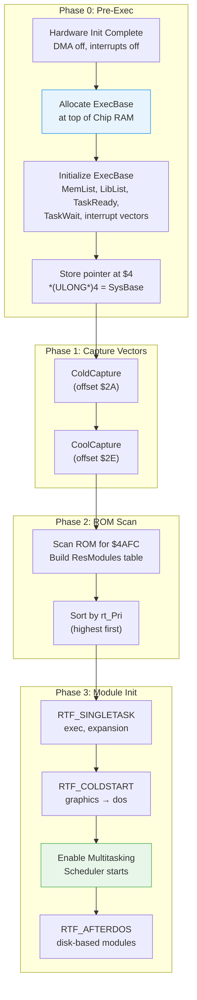

[← Home](../README.md) · [Boot Sequence](README.md)

# Kickstart Initialisation — ExecBase, ROM Scan, Resident Modules

## Overview

After hardware init and ROM checksum pass, the Kickstart ROM creates `ExecBase` and scans for **resident modules** — the OS components embedded in ROM. This process builds the entire OS kernel from tagged structures in the ROM image, progressing through three initialization phases before handing control to the bootstrap module.

---

## Architecture



---

## ExecBase Creation

### Memory Allocation

ExecBase is allocated at the **top of Chip RAM**, below the supervisor stack:

```
Top of Chip RAM (e.g., $200000 for 2 MB):
    ┌─────────────────────┐ $1FFFFF
    │ Supervisor Stack    │ ~1 KB
    ├─────────────────────┤
    │ ExecBase            │ ~632 bytes (struct ExecBase)
    ├─────────────────────┤
    │ exec.library JMP tbl│ ~1.5 KB (negative offsets)
    ├─────────────────────┤
    │ Interrupt vectors   │ saved copies of $000–$400
    ├─────────────────────┤
    │ Available Chip RAM  │
    │ (for AllocMem)      │
    └─────────────────────┘ $000000
```

### Initialization Sequence

```c
/* Pseudo-code — what the ROM boot code does: */

/* 1. Determine Chip RAM size */
ULONG chipSize = ProbeChipRAM();    /* 256K, 512K, 1M, or 2M */

/* 2. Allocate ExecBase at top of Chip RAM */
APTR execBase = (APTR)(chipSize - EXECBASE_SIZE - SSP_SIZE);

/* 3. Clear ExecBase to zero */
memset(execBase, 0, EXECBASE_SIZE);

/* 4. Initialize the Library header */
execBase->LibNode.lib_Node.ln_Type = NT_LIBRARY;
execBase->LibNode.lib_Node.ln_Name = "exec.library";
execBase->LibNode.lib_Version = 40;        /* Kickstart 3.1 */
execBase->LibNode.lib_Revision = 70;

/* 5. Initialize system lists */
NewList(&execBase->MemList);
NewList(&execBase->LibList);
NewList(&execBase->DeviceList);
NewList(&execBase->ResourceList);
NewList(&execBase->IntrList);
NewList(&execBase->PortList);
NewList(&execBase->SemaphoreList);
NewList(&execBase->TaskReady);
NewList(&execBase->TaskWait);

/* 6. Set up memory — add Chip RAM as first memory region */
AddMemList(chipSize - RESERVED_TOP,
           MEMF_CHIP | MEMF_PUBLIC | MEMF_LOCAL,
           0,            /* priority 0 */
           (APTR)0,      /* starts at address 0 */
           "chip memory");

/* 7. Initialize nesting counters */
execBase->IDNestCnt = -1;     /* Interrupts enabled */
execBase->TDNestCnt = -1;     /* Task switching enabled */

/* 8. Set Quantum */
execBase->Quantum = 4;        /* 4 ticks = ~80 ms at 50 Hz */

/* 9. Detect CPU type */
execBase->AttnFlags = ProbeCPU();  /* Test for 010/020/030/040/060/FPU */

/* 10. Set VBlank frequency */
execBase->VBlankFrequency = IsPAL() ? 50 : 60;
execBase->PowerSupplyFrequency = IsPAL() ? 50 : 60;

/* 11. Install exception vectors */
InstallExceptionVectors(execBase);

/* 12. Store ExecBase pointer at absolute address $4 */
*(ULONG *)4 = (ULONG)execBase;

/* 13. Add exec.library to LibList */
AddLibrary((struct Library *)execBase);
```

### ExecBase Validation (Warm Reset)

On warm reset, the boot code checks if a valid ExecBase already exists:

```c
/* Read candidate from $4 */
struct ExecBase *old = *(struct ExecBase **)4;

/* Validate using ChkBase checksum */
ULONG sum = 0;
UWORD *p = (UWORD *)&old->SoftVer;
for (int i = 0; i < (offsetof(ExecBase, ChkSum) - offsetof(ExecBase, SoftVer)) / 2; i++)
    sum += *p++;

if (sum == 0xFFFF)  /* Valid checksum */
{
    /* ExecBase survived reset — preserve ColdCapture, etc. */
    coldCapture = old->ColdCapture;
    coolCapture = old->CoolCapture;
    warmCapture = old->WarmCapture;
    kickMemPtr  = old->KickMemPtr;
    kickTagPtr  = old->KickTagPtr;
}
```

---

## Capture Vector Processing

### ColdCapture ($002A)

Called very early — before ExecBase is fully initialized:

```c
if (coldCapture)
{
    /* Jump to capture code in supervisor mode */
    /* The capture code MUST return to continue boot */
    ((void (*)(void))coldCapture)();
}
```

**Use cases**: Action Replay / HRTmon cartridges, MMU pre-initialization, hardware debugger setup.

### CoolCapture ($002E)

Called after ExecBase is initialized, before resident modules:

```c
if (coolCapture)
{
    ((void (*)(void))coolCapture)();
}
```

**Use cases**: System patches that must load before libraries, memory-resident disk preservation, virus persistence (historically exploited).

### WarmCapture ($0032)

Called only during warm reset (Ctrl-Amiga-Amiga):

```c
if (warmCapture && isWarmReset)
{
    ((void (*)(void))warmCapture)();
}
```

**Use cases**: Preserving application state across resets.

### KickTagPtr / KickMemPtr — Resident Extensions

These fields allow modules loaded into RAM to survive warm resets:

```c
/* KickTagPtr points to an array of Resident pointers in RAM */
/* KickMemPtr points to MemList entries that must be preserved */

/* Used by: */
/* - SetPatch (patches modules in RAM) */
/* - RAD: (recoverable RAM disk) */
/* - Memory-resident applications */
```

---

## Resident Module Scan

### Scan Algorithm

```c
/* The ROM scanner searches for RomTag markers */
struct Resident **resTable = AllocMem(MAX_RESIDENTS * sizeof(APTR), MEMF_CLEAR);
int count = 0;

UWORD *addr = (UWORD *)ROM_BASE;
UWORD *romEnd = (UWORD *)(ROM_BASE + ROM_SIZE);

while (addr < romEnd)
{
    if (*addr == 0x4AFC)  /* RomTag magic */
    {
        struct Resident *res = (struct Resident *)addr;

        /* Verify self-pointer */
        if (res->rt_MatchTag == res)
        {
            resTable[count++] = res;
            /* Skip past this module */
            addr = (UWORD *)res->rt_EndSkip;
            continue;
        }
    }
    addr++;  /* Next word (must be word-aligned) */
}

/* Also scan KickTagPtr list (RAM-resident modules from previous boot) */
if (SysBase->KickTagPtr)
{
    struct Resident **kt = (struct Resident **)SysBase->KickTagPtr;
    while (*kt)
    {
        if ((ULONG)*kt & 0x80000000)
        {
            /* Bit 31 set = pointer to another KickTag array (chaining) */
            kt = (struct Resident **)((ULONG)*kt & 0x7FFFFFFF);
            continue;
        }
        resTable[count++] = *kt++;
    }
}

/* Store table in ExecBase */
SysBase->ResModules = resTable;
```

### Sorting

After scanning, modules are sorted by `rt_Pri` (descending). Higher priority = initialized first:

```
Priority 126: exec.library        ← First
Priority 120: expansion.library
Priority 105: 68040.library
Priority 100: utility.library
...
Priority  -50: dos.library
Priority -120: ramlib / strap     ← Last
```

---

## Initialisation Phases

### Phase 1: RTF_SINGLETASK

Before multitasking starts. Only the boot task exists:

```c
for (int i = 0; i < count; i++)
{
    if (resTable[i]->rt_Flags & RTF_SINGLETASK)
    {
        InitResident(resTable[i], NULL);
    }
}
```

| Priority | Module | What It Does |
|---|---|---|
| 126 | exec.library | Already running — just builds JMP table |
| 120 | expansion.library | Scans Zorro bus, configures Autoconfig boards, adds RAM |

### Phase 2: RTF_COLDSTART

The bulk of the OS. Still single-task context:

| Priority | Module | What It Does |
|---|---|---|
| 105 | 68040.library | Installs Line-F trap handler for FPU instruction emulation |
| 100 | utility.library | TagItem parsing, hooks, date/time |
| 96 | mathieeesingbas.library | IEEE single-precision math |
| 70 | graphics.library | Initializes chipset, builds display, allocates bitmaps |
| 60 | layers.library | Window clipping layer system |
| 55 | cia.resource | CIA chip interrupt management |
| 50 | intuition.library | GUI subsystem, screen/window management |
| 40 | timer.device | VBLANK and ECLOCK timer services |
| 35 | keyboard.device | Keyboard serial protocol handler |
| 30 | gameport.device | Mouse and joystick input |
| 20 | input.device | Merges keyboard/mouse events into input stream |
| 10 | trackdisk.device | Floppy disk controller — motor, read/write, MFM |
| 5 | audio.device | DMA audio channel allocation |
| 0 | console.device | Text console — escape sequences, cursor |
| −50 | dos.library | File system, CLI, process management |
| −50 | filesystem (FFS) | Fast File System handler |
| −120 | ramlib | Loads disk-based libraries/devices on demand |

### Phase 3: Enable Multitasking

After all COLDSTART modules are initialized:

```c
/* The boot task becomes the first schedulable task */
/* TDNestCnt transitions from -1 (disabled) to -1 (enabled, unnested) */
/* The scheduler begins running at the next VBL interrupt */
```

### Phase 4: RTF_AFTERDOS

Modules that require DOS (file access):

```c
for (int i = 0; i < count; i++)
{
    if (resTable[i]->rt_Flags & RTF_AFTERDOS)
    {
        InitResident(resTable[i], NULL);
    }
}
```

Typically: disk-based fonts, locale, workbench.library.

---

## Bootstrap (strap) Module

The `strap` module is the last thing Kickstart initializes. It bridges the gap between ROM init and the disk-based boot:

```c
/* strap module: */
/* 1. Enumerate bootable devices (from expansion boards + trackdisk) */
/* 2. Sort by boot priority */
/* 3. Read boot block (sectors 0-1) from highest-priority device */
/* 4. Validate boot block checksum */
/* 5. Execute boot block code — which typically calls dos.library */
/* 6. dos.library runs S:Startup-Sequence */
```

See [DOS Boot](dos_boot.md) for the complete boot block and startup-sequence flow.

---

## Timing Reference

| Phase | A500 (7 MHz) | A1200 (14 MHz) | A4000/040 (25 MHz) |
|---|---|---|---|
| ExecBase creation | ~10 ms | ~5 ms | ~2 ms |
| ROM scan ($4AFC) | ~200 ms | ~100 ms | ~30 ms |
| expansion.library init | ~100 ms | ~50 ms | ~20 ms |
| graphics.library init | ~300 ms | ~150 ms | ~60 ms |
| intuition.library init | ~200 ms | ~100 ms | ~40 ms |
| dos.library init | ~100 ms | ~50 ms | ~20 ms |
| **Total to strap** | **~1.5 s** | **~700 ms** | **~300 ms** |

---

## References

- NDK39: `exec/resident.h`, `exec/execbase.h`
- ADCD 2.1: `InitResident`, `FindResident`, `AddLibrary`
- See also: [Cold Boot](cold_boot.md) — hardware init before this phase
- See also: [ExecBase](../06_exec_os/exec_base.md) — structure reference
- See also: [Resident Modules](../06_exec_os/resident_modules.md) — RomTag structure
- See also: [Kickstart ROM](kickstart_rom.md) — ROM binary format and module layout
- *Amiga ROM Kernel Reference Manual: Exec* — initialization chapter
