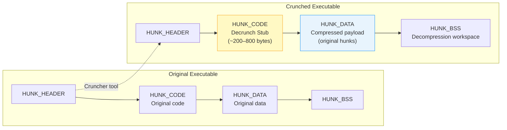
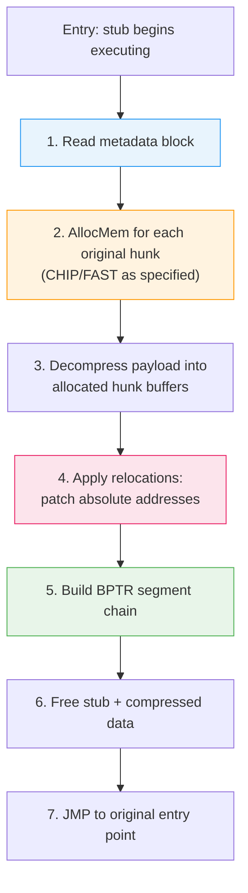

[← Home](../README.md) · [Loader & HUNK Format](README.md)

# Executable Crunchers — Compression, Decrunch Stubs, and Internals

## Overview

**Executable crunchers** (packers) compress AmigaOS executables while keeping them directly runnable. The crunched file is a valid HUNK executable — when launched, a tiny **decrunch stub** runs first, decompresses the original program in memory, then jumps to its real entry point. The user sees a brief colour-cycling delay (the "decrunch colours"), then the program runs normally.

This was essential in the floppy era: a 200 KB program crunched to 120 KB loads significantly faster from a slow 880 KB floppy *and* frees disk space on capacity-constrained media.

---

## Architecture

### Two-Phase Execution Model

A crunched executable goes through **two loading phases**:

1. **Phase 1 — OS loads the wrapper** (`LoadSeg` handles the crunched HUNK file normally)
2. **Phase 2 — Stub rebuilds the original program** (acting as a mini-`LoadSeg` inside the running process)



### Phase 1: What the OS Loader Sees

The crunched file is a perfectly valid HUNK executable. `LoadSeg()` processes it like any other program:
- Reads `HUNK_HEADER`, allocates 2–3 segments (stub code, compressed data, BSS workspace)
- Applies the wrapper's own `HUNK_RELOC32` entries (minimal — just the stub's internal references)
- Links the segments into a BPTR chain and returns the segment list
- `CreateProc()` sets up a task and jumps to hunk 0 offset 0 — the decrunch stub

At this point the OS is done. It thinks it loaded a normal program. The original executable's structure, memory types, relocations — all of that is **inside the compressed payload** and invisible to the OS.

### Phase 2: What the Stub Must Reconstruct

The decrunch stub must rebuild everything `LoadSeg` would have done for the original executable:



#### Step 1: Metadata — Preserving the Original Structure

The compressed payload includes a **metadata block** that captures the original executable's structure. This is stored either at a fixed offset in the compressed data or appended after it:

```c
/* What the cruncher preserves in the metadata: */
struct CrunchMetadata {
    ULONG num_hunks;         /* original hunk count */
    ULONG hunk_sizes[];      /* size of each original hunk (bytes) */
    ULONG hunk_memflags[];   /* MEMF_CHIP, MEMF_FAST, MEMF_ANY per hunk */
    ULONG hunk_types[];      /* HUNK_CODE, HUNK_DATA, HUNK_BSS */
    /* Relocation data follows (format varies by cruncher) */
};
```

Without this metadata, the stub cannot allocate memory correctly — a bitmap hunk that needs Chip RAM would end up in Fast RAM and be invisible to the custom chip DMA.

#### Step 2: Memory Allocation — Chip vs Fast Separation

This is the critical step most people miss. The original executable might have had:

```
Hunk 0: HUNK_CODE  → MEMF_FAST (68000 code — any memory)
Hunk 1: HUNK_DATA  → MEMF_CHIP (bitmaps, audio samples — MUST be DMA-reachable)
Hunk 2: HUNK_BSS   → MEMF_ANY  (zero-filled workspace)
```

The stub must call `AllocMem()` **individually** for each original hunk with the correct memory type flags:

```asm
; Stub allocates each original hunk separately:
    MOVEA.L 4.W, A6               ; SysBase
    ; Hunk 0: code — any memory is fine
    MOVE.L  code_size, D0
    MOVE.L  #MEMF_PUBLIC, D1
    JSR     -198(A6)               ; AllocMem
    MOVE.L  D0, hunk_bases+0       ; save base address

    ; Hunk 1: data — MUST be Chip RAM for DMA
    MOVE.L  data_size, D0
    MOVE.L  #MEMF_CHIP|MEMF_PUBLIC, D1
    JSR     -198(A6)               ; AllocMem
    MOVE.L  D0, hunk_bases+4       ; save base address

    ; Hunk 2: BSS — just clear memory
    MOVE.L  bss_size, D0
    MOVE.L  #MEMF_PUBLIC|MEMF_CLEAR, D1
    JSR     -198(A6)               ; AllocMem
    MOVE.L  D0, hunk_bases+8
```

> [!IMPORTANT]
> If a cruncher loses the CHIP/FAST distinction (merging everything into one hunk), programs with bitmap/audio data in data hunks will **silently fail** — the DMA hardware can only access Chip RAM. Symptoms: garbled graphics, no audio, or Guru Meditation on access.

#### Step 3: Decompress — Fill the Allocated Hunks

The decompressor reads from the compressed payload (in the wrapper's data hunk) and writes to the freshly allocated original hunks. For programs with multiple hunks, the decompressor either:
- Decompresses into a flat temp buffer, then copies to individual hunks (Method 1)
- Decompresses directly to each hunk in sequence, using stored boundaries (Method 2)

#### Step 4: Apply Relocations

The original HUNK_RELOC32 tables are **embedded in the compressed data** — they were part of the original file. After decompression, the stub must patch all absolute addresses to reflect the actual allocation addresses. See the [Relocation Handling](#relocation-handling) section below for the three strategies.

#### Step 5: Build the Segment Chain

AmigaDOS tracks loaded programs as a BPTR-linked segment list. The stub must construct this chain so `UnLoadSeg()` can free the memory later:

```c
/* Each segment has a 4-byte BPTR link at offset -4: */
/*   [alloc_size][-4]  [BPTR→next][0]  [hunk data...][4+] */

/* Stub builds the chain: */
for (int i = 0; i < num_hunks - 1; i++)
{
    BPTR *link = (BPTR *)(hunk_bases[i]);  /* offset 0 = BPTR to next */
    *link = MKBADDR(hunk_bases[i + 1]);     /* point to next segment */
}
/* Last segment's link = 0 (NULL) — end of chain */
*(BPTR *)(hunk_bases[num_hunks - 1]) = 0;
```

> **Why this matters**: If the stub doesn't build a valid segment chain, `UnLoadSeg()` (called when the program exits) will crash or leak memory. Some simple crunchers skip this step entirely — the program runs fine but its memory is never freed.

#### Step 6: Free the Wrapper, Jump to Original

The stub frees the wrapper's own memory (compressed data, BSS workspace) and `JMP`s to the original entry point at hunk 0, offset 0 (after the BPTR link word):

```asm
    ; Free wrapper hunks
    ; (some stubs skip this and accept the memory leak)

    ; Restore registers to match what the OS originally passed
    MOVEM.L (SP)+, D0-D7/A0-A6

    ; Jump to original program entry
    MOVEA.L hunk_bases+0, A0
    ADDQ.L  #4, A0              ; skip BPTR link at offset 0
    JMP     (A0)
```

### The Segment List Handoff Problem

There's a subtle issue: the OS gave the process a segment list pointing to the **wrapper** hunks. But the actual program now lives in **newly allocated** hunks. When the program exits, `UnLoadSeg()` will try to free the wrapper's segment list, which the stub may have already freed — double-free crash.

Sophisticated crunchers solve this by:
1. **Patching the process's `pr_SegList`** to point to the new segment chain
2. **Or** keeping the wrapper allocated and linking it into the chain
3. **Or** replacing the wrapper's content in-place (overwriting stub+compressed with decompressed code)

---

## Major Amiga Crunchers

| Cruncher | Era | Algorithm | Stub Size | Typical Ratio | Notes |
|---|---|---|---|---|---|
| **PowerPacker** (PP20) | 1989–1994 | LZ77 + configurable efficiency | ~280 bytes | 50–60% | Most popular; `powerpacker.library` for data files |
| **Imploder** (IMP!) | 1990–1993 | LZSS variant | ~400 bytes | 45–55% | Multiple modes: Normal, Pure, Library, Overlayed |
| **Turbo Imploder** | 1991–1993 | Enhanced LZSS | ~420 bytes | 42–52% | Faster crunch, same decrunch |
| **ByteKiller** | 1988–1991 | LZ77 (simple) | ~160 bytes | 55–65% | Early; position-independent stub; used for raw data too |
| **Titanics Cruncher** (ATN!) | 1991–1993 | LZ77 | ~350 bytes | 55–65% | Fast decrunch |
| **CrunchMania** (CrM!) | 1992–1995 | LZ + range coding | ~500 bytes | 40–50% | Many registered/customised versions — format variants |
| **Shrinkler** | 2014+ | Context-model + range coder | ~250 bytes | 30–40% | Modern; best ratio; used in 4K/64K demo intros |
| **PackFire** | 2016+ | Shrinkler derivative | ~200 bytes | 30–40% | Optimised for size-limited compos |
| **XPK** | 1992+ | Framework (multiple sub-packers) | varies | varies | Library-based; supports NUKE, SMPL, SQSH, etc. |

---

## Binary Structure of a Crunched Executable

### What the Cruncher Produces

The cruncher tool reads the original executable, compresses its contents, and wraps them in a new HUNK executable:

```
HUNK_HEADER ($3F3)
  num_hunks = 2 or 3
  hunk_sizes:
    [0] = stub code size + compressed data (or split across hunks)
    [1] = workspace BSS (decompression buffer)

HUNK_CODE ($3E9)
  <decrunch_stub>           ; 200–800 bytes of 68000 code
  <compressed_payload>      ; the original executable, compressed
  <metadata>                ; original hunk count, sizes, memory types

HUNK_RELOC32 ($3EC)         ; relocations for the stub itself (minimal)

HUNK_BSS ($3EB)             ; workspace for decompression
  <size>                    ; typically = original uncompressed size

HUNK_END ($3F2)
```

### Alternate Layout (Multi-Hunk)

Some crunchers split the stub and payload into separate hunks:

```
Hunk 0: HUNK_CODE — decrunch stub only (~300 bytes)
Hunk 1: HUNK_DATA — compressed payload + metadata
Hunk 2: HUNK_BSS  — decompression workspace
```

---

## PowerPacker PP20 — Format Deep Dive

PowerPacker (by Nico François) is the most widely used Amiga cruncher. It exists in two forms: a **data file format** (for `powerpacker.library`) and an **executable wrapper** (for crunched .exe files).

### PP20 Data Format

```
Offset  Size  Field
──────  ────  ─────────────────────────────
$00     4     Signature: "PP20" ($50503230)
$04     4     Efficiency table: 4 bytes controlling LZ bit-depth
              e.g. $09090909 = "Fast", $0A0B0C0D = "Best"
$08     N     Compressed bitstream data
$08+N   4     Decrunch info: 24-bit original size (big-endian) + checksum byte
              Byte layout: [size_hi] [size_mid] [size_lo] [checksum]
```

### Efficiency Table

The 4-byte efficiency table controls how many bits are used for offset/length encoding in different compression modes:

| Mode | Efficiency Bytes | Description |
|---|---|---|
| Fast | `$09 09 09 09` | Smaller window, faster crunch |
| Mediocre | `$09 0A 0A 0A` | Balance |
| Good | `$09 0A 0B 0B` | Better ratio |
| Very Good | `$09 0A 0B 0C` | Near-best |
| Best | `$09 0A 0C 0D` | Maximum compression, slowest |

The decompressor reads these 4 bytes to initialize its internal offset/length bit-allocation tables before starting the main decompression loop.

### Decrunch Colours

The PowerPacker decrunch stub famously modifies custom chip colour registers during decompression to provide visual feedback — the background colour cycles through shades of grey or colour gradients, signalling that decrunching is in progress. This is the characteristic "decrunch effect" visible on real hardware:

```asm
; Visual feedback during decrunch:
    MOVE.W  D0, $DFF180        ; COLOR00 — background colour
    ; D0 increments with each decompressed block
```

---

## Shrinkler — Modern State-of-the-Art

Shrinkler (by Blueberry/Loonies) is the current gold standard for Amiga executable compression, achieving 30–40% ratios. It's open-source and widely used in the demo scene.

### Algorithm: Context-Modelling + Range Coder

Unlike older LZ77-based crunchers, Shrinkler uses:

1. **Adaptive context model** — maintains 1536 probability contexts (`NUM_CONTEXTS = 1536`). Each context tracks the probability of the next bit being 0 or 1, updated after every decoded bit
2. **Range coder** — an arithmetic coding variant that encodes bits using interval subdivision based on the context probabilities
3. **LZ matching** — literal bytes and back-references are intermixed, with the context model predicting which type comes next

### Shrinkler Data Header

```
Offset  Size  Field
──────  ────  ─────────────────────────────
$00     4     Signature: "Shri" ($53687269)
$04     1     Major version
$05     1     Minor version
$06     2     Header size (remaining bytes)
$08     4     Compressed data size
$0C     4     Uncompressed data size
$10     4     Safety margin (for in-place decompression)
$14     4     Flags: bit 0 = FLAG_PARITY_CONTEXT
```

The **parity context** flag (`FLAG_PARITY_CONTEXT`) enables a special mode that maintains separate probability models based on the byte position parity, exploiting statistical properties of 68000 machine code (even/odd byte patterns in opcode words).

### 68000 Decompressor Core (from Shrinkler source)

The actual decompressor fits in approximately 100 instructions:

```asm
; Register usage:
;   D2 = Range value
;   D3 = Interval size
;   D4 = Input bit buffer (reads bytes from compressed stream)
;   D6 = Context index
;   D7 = Parity context flag (0 or 1)
;   A4 = Compressed data source pointer
;   A5 = Decompressed data destination pointer

INIT_ONE_PROB = $8000          ; Initial probability: 50/50
ADJUST_SHIFT  = 4              ; Probability adaptation rate
NUM_CONTEXTS  = 1536           ; Context table size

ShrinklerDecompress:
    movem.l d2-d7/a4-a6,-(a7)
    ; Init range decoder state
    moveq.l #0,d2              ; Range value = 0
    moveq.l #1,d3              ; Interval size = 1
    moveq.l #-$80,d4           ; Input buffer (triggers first byte read)

    ; Init all 1536 probabilities to 50% ($8000)
    move.l  #NUM_CONTEXTS,d6
.init:
    move.w  #INIT_ONE_PROB,-(a7)  ; Push WORD onto stack
    subq.w  #1,d6
    bne.b   .init
    ; Context table is now on the stack (3072 bytes)

    ; Main decompression loop
.lit:
    ; Decode literal byte bit-by-bit using context model
    addq.b  #1,d6
.getlit:
    bsr.b   GetBit             ; Get one bit from range coder
    addx.b  d6,d6              ; Shift bit into D6
    bcc.b   .getlit            ; Loop until byte complete
    move.b  d6,(a5)+           ; Write decompressed byte

.switch:
    bsr.b   GetKind            ; Is next item literal or reference?
    bcc.b   .lit               ; Literal → decode another byte

    ; Reference: decode offset and length
    ; ... (LZ match copy loop)
```

### Stack-Based Context Table

A distinctive Shrinkler technique: the 1536-entry probability table (3072 bytes) is allocated **on the stack** — each entry is a WORD pushed during initialization. This avoids needing a separate AllocMem call and keeps the decompressor self-contained.

---

## Compression Algorithms

### LZ77 / LZSS (PowerPacker, Titanics, ByteKiller, Imploder)

The dominant algorithm family. The compressed stream is a sequence of control bits followed by either literal bytes or back-references:

```
[flag bit]
  0 → literal byte follows (copy 1 byte verbatim)
  1 → match reference: (offset, length)
       offset = how far back in already-decompressed data to copy from
       length = how many bytes to copy from that position

Decompression pseudo-code:
  while (output_pos < original_size):
      bit = read_bit()
      if bit == 0:
          output[output_pos++] = read_byte()       # literal
      else:
          offset = read_bits(offset_bits)           # back-reference
          length = read_bits(length_bits) + min_len
          copy(output, output_pos - offset, length) # copy from history
          output_pos += length
```

The **efficiency setting** (PowerPacker) or **mode** (Imploder) controls how many bits are allocated to offset and length fields — more offset bits = larger search window = better compression but slower.

### Context Modelling + Range Coding (Shrinkler, PackFire)

Modern crunchers replace fixed-bit-width encoding with probability-based arithmetic coding:

1. For each bit position, the **context model** estimates: "probability that this bit is 1"
2. The **range coder** encodes the bit using that probability — high-probability bits use fewer output bits
3. After encoding/decoding, the context probability is **updated** based on the actual bit value

This achieves near-optimal compression but decompression is slower (~2–5 seconds on a 7 MHz 68000 for a typical executable).

---

## Relocation Handling

The original executable had HUNK_RELOC32 entries that patch absolute addresses. After decompression, these must be reapplied. Crunchers use three strategies:

### Method 1: Compress Everything Including Relocs

The entire original file (all hunks + relocation tables) is compressed as a blob. The decrunch stub acts as a mini-`LoadSeg`:
1. Decompress to a temp buffer
2. Parse the HUNK stream
3. Allocate individual hunks with correct memory types
4. Copy data and apply relocations
5. Free the temp buffer

### Method 2: Pre-Relocated + Delta Table

1. Cruncher pre-applies relocations assuming base address 0
2. Stores a compact **delta table** — sorted list of byte-offset deltas between relocation sites
3. After decompression, the stub walks the delta table and adds actual base addresses

```c
/* Delta table: each entry is the offset-delta to the next reloc site */
UWORD reloc_deltas[] = {
    0x0006,  /* first reloc at offset 6 */
    0x0014,  /* +0x14 → next at offset 0x1A */
    0x0008,  /* +0x08 → next at offset 0x22 */
    0x0000   /* terminator */
};
/* More compact than storing absolute offsets */
```

### Method 3: Merge and Self-Relocate

All hunks merged into a single code hunk. Inter-hunk references resolved at crunch time. The result needs minimal or no relocation.

**Drawback**: Loses CHIP/FAST memory separation — all data ends up in the same memory type. Problematic for programs that need Chip RAM for bitmaps or audio.

---

## Memory Layout During Decompression

```
BEFORE (crunched exe loaded by OS):

  ┌──────────────────────┐  Hunk 0 (CODE)
  │ Decrunch stub (300B) │
  │ Compressed data (80K)│
  │ Metadata             │
  └──────────────────────┘
  ┌──────────────────────┐  Hunk 1 (BSS)
  │ Workspace (200K)     │  ← decompression buffer
  └──────────────────────┘

DURING (stub is executing):

  ┌──────────────────────┐  Hunk 0 — still alive
  │ Stub + compressed ───│──→ reading from here
  └──────────────────────┘
  ┌──────────────────────┐  AllocMem'd by stub
  │ Original Hunk 0 CODE │──→ writing decompressed data
  └──────────────────────┘
  ┌──────────────────────┐  AllocMem'd by stub
  │ Original Hunk 1 DATA │
  └──────────────────────┘

AFTER (stub jumps to original entry):

  ┌──────────────────────┐  (freed or abandoned)
  │ [freed stub memory]  │
  └──────────────────────┘
  ┌──────────────────────┐  Original program running
  │ Original Hunk 0 CODE │  ← PC here
  └──────────────────────┘
  ┌──────────────────────┐
  │ Original Hunk 1 DATA │
  └──────────────────────┘
```

> **In-place decompression**: Some crunchers (including Shrinkler) support decompressing over the compressed data — the `safety_margin` field in the Shrinkler header reserves extra space so the decompressor's write pointer never overtakes the read pointer. Data is decompressed from end to start.

---

## Detection and Identification

### Magic Signatures

| Cruncher | Signature | Hex | Location |
|---|---|---|---|
| PowerPacker | `PP20` | $50503230 | Start of compressed data |
| Imploder | `IMP!` | $494D5021 | Start of compressed data |
| Turbo Imploder | `IMP!` | $494D5021 | Same — version in stub differs |
| Titanics | `ATN!` | $41544E21 | Start of compressed data |
| CrunchMania | `CrM!` / `CrM2` | $43724D21 / $43724D32 | Start of compressed data |
| Shrinkler | `Shri` | $53687269 | Data file header (exe uses stub pattern) |
| ByteKiller | (no magic) | — | Detected by stub pattern only |
| XPK Framework | `XPKF` | $58504B46 | File header |

> [!WARNING]
> **Fake headers** are extremely common in the Amiga cracking scene. A file claiming to be `IMP!` may have a spoofed header to frustrate analysis. If standard tools reject it, the header is likely fake — use a debugger to capture the decrunched memory image instead.

### Detecting Crunched Executables in RE

1. **Tiny code hunk + large data hunk** — unusual ratio signals packing
2. **AllocMem + decompression loop** at entry point — not the normal `c.o` startup pattern
3. **No `MOVE.L 4.W,A6` / `OpenLibrary` sequence** — stub goes straight to decompression
4. **Custom chip register writes** (`$DFF180` colour changes) — decrunch colour feedback
5. **Magic bytes** in the data hunk — scan for known signatures
6. **Self-modifying code** — stub may overwrite its own memory during in-place decompression

```python
# Quick detection script:
import struct

MAGICS = {
    b'PP20': 'PowerPacker',
    b'IMP!': 'Imploder',
    b'ATN!': 'Titanics Cruncher',
    b'CrM!': 'CrunchMania',
    b'CrM2': 'CrunchMania 2',
    b'Shri': 'Shrinkler (data)',
    b'XPKF': 'XPK Framework',
}

def detect_cruncher(filename):
    with open(filename, 'rb') as f:
        data = f.read()
    for magic, name in MAGICS.items():
        if magic in data:
            off = data.index(magic)
            print(f"  {name} detected at offset ${off:04X}")
            return name
    # Check for valid HUNK with suspicious layout
    if data[:4] == b'\x00\x00\x03\xf3':  # HUNK_HEADER
        print("  Valid HUNK — check for stub pattern at entry point")
    return None
```

---

## Decrunching Tools

### AmigaOS Native

| Tool | Description |
|---|---|
| `xfdmaster.library` | Universal decruncher — modular architecture with "slave" plugins in `LIBS:xfd/` |
| `xfdDecrunch` | CLI front-end: `xfdDecrunch packed.exe unpacked.exe` |
| `xfdScan` / `xfdList` | Identify cruncher type; list installed slave modules |
| `powerpacker.library` | PP20 data file decompression: `ppLoadData()` |

### Cross-Platform

| Tool | Description |
|---|---|
| **Ancient** (C++) | Modern portable library — supports ByteKiller, Imploder, CrunchMania, PP20, and many more. GitHub: `temisu/ancient` |
| `ppunpack` | PP20 only: `ppunpack packed.exe unpacked.exe` |
| Shrinkler `-d` | Shrinkler data files: `shrinkler -d packed unpacked` |

### xfdmaster — Modular Architecture

xfdmaster does not have a hardcoded format list. It loads **slave modules** from `LIBS:xfd/` at runtime, each handling one or more cruncher formats:

```
LIBS:xfd/
  PowerPacker         ; handles PP20
  Imploder            ; handles IMP!
  CrunchMania         ; handles CrM!, CrM2
  ByteKiller          ; stub-pattern detection
  Titanics            ; handles ATN!
  ...                 ; 100+ supported formats
```

```c
/* Using xfdmaster.library to decrunch any format: */
struct xfdBufferInfo *xbi = xfdAllocObject(XFDOBJ_BUFFERINFO);
xbi->xfdbi_SourceBufLen = filesize;
xbi->xfdbi_SourceBuffer = filebuf;

if (xfdRecogBuffer(xbi))
{
    printf("Detected: %s\n", xbi->xfdbi_PackerName);
    if (xfdDecrunchBuffer(xbi))
    {
        /* xbi->xfdbi_TargetBuffer = decrunched data */
        /* xbi->xfdbi_TargetBufSaveLen = decrunched size */
    }
}
xfdFreeObject(xbi);
```

### Debugger-Based Extraction (Last Resort)

For unknown or custom crunchers, the most reliable method is to load the executable in a hardware-level debugger (HRTMon, ASM-One, or an emulator's monitor), set a breakpoint at the end of the decrunch stub (typically the final `JMP` instruction), and capture the memory image once decompression is complete:

```
; In HRTMon:
> d $entry_point          ; disassemble entry
; Find the final JMP at the end of the stub
> bpx $stub_end_jmp       ; set breakpoint
> g                        ; run
; When breakpoint hits, the decrunched program is in memory
> sm $dest $dest+size "decrunched.bin"  ; save memory
```

---

## Impact on FPGA / Emulation

| Concern | Detail |
|---|---|
| **Timing-sensitive stubs** | Imploder has tight loops that may fail on accelerated CPUs; some stubs poll `$DFF006` (VHPOSR) for timing |
| **Memory allocation** | Stub requires working `exec.library AllocMem` — must have a functional memory list |
| **Chip RAM specificity** | If original hunks need CHIP RAM, stub must request `MEMF_CHIP` — DMA-accessible memory required for graphics/audio |
| **Self-modifying code** | In-place decompression writes over instruction bytes — 68020+ instruction cache must be invalidated (`CacheClearU`) |
| **Custom chip access** | Decrunch colour writes to `$DFF180` require a working Denise/colour register |
| **Boot-block crunchers** | Trackloaders (game boot blocks) use custom crunchers without HUNK format — completely different mechanism, no OS involvement |

---

## References

- PowerPacker documentation (Nico François, 1989)
- Shrinkler source: https://github.com/askeksa/Shrinkler — `decrunchers/ShrinklerDecompress.S`
- Ancient decompression library: https://github.com/temisu/ancient — portable C++ decompressors
- xfdmaster.library — Aminet `util/pack/xfdmaster.lha` (Dirk Stöcker)
- See also: [HUNK Format](hunk_format.md) — the container format crunchers wrap
- See also: [Exe Load Pipeline](exe_load_pipeline.md) — how LoadSeg handles the crunched HUNK
- See also: [Overlay System](overlay_system.md) — another approach to large-program memory management
