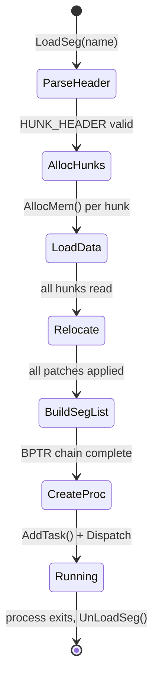

[← Home](../README.md) · [Loader & HUNK Format](README.md)

# Executable Load Pipeline

## Overview

This document traces the complete path from user request to a running process: `LoadSeg()` → memory allocation → relocation → `CreateProc()` → execution.

---

## Entry Points

| Function | Library | Description |
|---|---|---|
| `LoadSeg(name)` | dos.library | Load named file, return segment list |
| `InternalLoadSeg(fh, table, funcarray, stack)` | dos.library | Low-level load from open file handle |
| `NewLoadSeg(name, tags)` | dos.library (3.1+) | Tagged version of LoadSeg |
| `UnLoadSeg(seglist)` | dos.library | Free segment list |
| `CreateNewProc(tags)` | dos.library | Create process from segment list |
| `RunCommand(seg, stack, args, len)` | dos.library | Run segment in current process context |

---

## Phase 1: Parsing HUNK_HEADER

`InternalLoadSeg` opens the file and reads the header:

```c
1. Read magic word — must be $000003F3 (HUNK_HEADER)
2. Read resident library list (always 0 for standard executables)
3. Read num_hunks, first_hunk, last_hunk
4. Read size table: num_hunks longwords
   Each longword: bits[31:30] = memory type, bits[29:0] = size in longs
```

The loader allocates one memory block per hunk using `AllocMem()`:
- Memory type from size longword bits → `MEMF_CHIP`, `MEMF_FAST`, or `MEMF_ANY`
- Size = longword_count × 4 bytes

---

## Phase 2: Memory Allocation

For each hunk (from first_hunk to last_hunk):

```c
ULONG size_longs = size_table[i] & ~0xC0000000;
ULONG mem_type   = (size_table[i] >> 30) & 3;
ULONG memf;

switch (mem_type) {
    case 0: memf = MEMF_PUBLIC; break;
    case 1: memf = MEMF_CHIP;   break;
    case 2: memf = MEMF_FAST;   break;
    case 3: /* extended: read additional longword for MEMF_ flags */
}

APTR seg_mem = AllocMem(size_longs * 4 + sizeof(BPTR), memf | MEMF_CLEAR);
```

Each allocation is **4 bytes larger** than the hunk data to hold the BPTR link to the next segment.

---

## Phase 3: Loading Hunk Data

For each hunk, the loader reads hunks sequentially from the file:

```
while not HUNK_END:
    switch (hunk_type):
        HUNK_CODE, HUNK_DATA:
            read num_longs × 4 bytes into segment memory
        HUNK_BSS:
            already zero-filled by AllocMem(MEMF_CLEAR)
        HUNK_RELOC32:
            store for Phase 4 (apply after all hunks loaded)
        HUNK_SYMBOL, HUNK_DEBUG:
            read and discard (or pass to debugger hook)
        HUNK_END:
            advance to next hunk
```

---

## Phase 4: Relocation Pass

After all hunks are loaded and their base addresses are known:

```
for each HUNK_RELOC32 in hunk H:
    for each (target_hunk, offsets[]):
        base = segment_base[target_hunk]
        for each offset:
            patch = (ULONG *)(segment_base[H] + offset)
            *patch += base      /* add actual load address */
```

This two-pass approach (load all, then relocate) is required because `HUNK_RELOC32` entries may reference any hunk, including ones not yet loaded when the reloc entry is encountered.

---

## Phase 5: Segment List Construction

The segments are chained as a **BPTR list**:

```
Segment 0 memory:
  [BPTR → seg1]   (4 bytes)
  [code data...]

Segment 1 memory:
  [BPTR → 0]      NULL = end of list
  [data...]
```

`LoadSeg()` returns `MKBADDR(seg0_mem)` — a BPTR to the first segment (the memory address right-shifted by 2, as required by the BCPL pointer convention).

Converting BPTR to real address:
```c
APTR addr = BADDR(seglist);   /* = seglist << 2 */
```

---

## Phase 6: Process Creation

`CreateNewProc()` (or the old `CreateProc()`) takes the segment list and creates a new AmigaOS process:

```c
struct Process *proc = CreateNewProcTags(
    NP_Seglist,   seglist,
    NP_Name,      "MyProgram",
    NP_StackSize, 8192,
    NP_Priority,  0,
    NP_CommandName, cmd_string,
    TAG_DONE);
```

Internally this calls `exec.library MakeNode()` and initializes:
- `Process->pr_SegList` — the segment list BPTR
- Stack: allocated via `AllocMem(NP_StackSize, MEMF_PUBLIC)`, stored in `pr_Stack`
- `tc_SPLower` / `tc_SPUpper` — stack bounds
- `tc_SPReg` — initial stack pointer (top of stack)
- `pr_GlobVec` — global vector (BCPL compat, not used by C programs)
- `pr_CLI` — CLI structure if launched from Shell

---

## Phase 7: Entry Point

The process starts executing at the **first word of hunk 0** (the first loaded segment). This is not `main()` — it is the startup code (`_start` / `c.o`):

```asm
; c.o (SAS/C startup):
_start:
    MOVE.L  4.W, A6          ; SysBase
    MOVE.L  A0, _CommandStr  ; raw command line from dos.library
    BSR     __main           ; C runtime init
    ...
    MOVE.L  _ExitCode, D0    ; return value
    RTS
```

---

## CLI vs Workbench Launch

| Parameter | CLI Launch | WBStartup |
|---|---|---|
| `pr_CLI` | Non-NULL, points to CLI struct | NULL |
| `pr_WBenchMsg` | NULL | Pointer to WBStartup message |
| A0 at entry | Command string pointer | NULL |
| A1 at entry | NULL | Pointer to WBStartup message |
| Return | `dos.library` handles exit | Must `Forbid(); ReplyMsg(wb_msg)` |

Startup code detects the launch type:
```c
if (pr->pr_CLI) {
    /* CLI launch: use command string */
} else {
    /* WB launch: wait for and reply to WBenchMsg */
    WaitPort(&pr->pr_MsgPort);
    WBMsg = (struct WBStartup *)GetMsg(&pr->pr_MsgPort);
}
```

---

## State Machine Diagram



---

## UnLoadSeg — Freeing Memory

```c
UnLoadSeg(seglist);
/* Walks the BPTR chain, FreeMem() each segment block */
```

The 4-byte BPTR header in each segment block records the size (stored by the loader before the data):
```
seg_mem - 4    : size of this allocation in bytes
seg_mem + 0    : BPTR to next segment
seg_mem + 4    : hunk data
```

---

## Hunk Types Reference

Complete enumeration of all hunk type codes as defined in `NDK39: dos/doshunks.h`. Types are listed in numeric order. The **Context** column indicates where each hunk may legally appear: **Exec** = loadable executable, **Obj** = relocatable object file (HUNK_UNIT stream), **Both** = either.

| Hex | Dec | Name | Context | Purpose | Typical Content | Notes / Limits |
|---|---|---|---|---|---|---|
| `$3E7` | 999 | `HUNK_UNIT` | Obj | Marks the start of a relocatable object file unit | 1 longword = name length in longs, then the unit name string (padded to longword boundary) | Must be the first record in every `.o` file. Not present in final executables. |
| `$3E8` | 1000 | `HUNK_NAME` | Obj | Names a section within a HUNK_UNIT | 1 longword = name length, then the section name string | Optional; precedes the code/data/BSS hunk it names. Linker uses for diagnostics. |
| `$3E9` | 1001 | `HUNK_CODE` | Both | Machine-code section | 1 longword = size in 32-bit longs; then *size×4* bytes of 68k opcodes | Loaded into RAM. Bits 30–29 of the type word select memory type (see HUNKF_* flags). Max size: ~1 GB (29-bit field = 512 M longs). |
| `$3EA` | 1002 | `HUNK_DATA` | Both | Initialized read/write data section | 1 longword = size in longs; then *size×4* bytes of raw data | Same memory-type flags as HUNK_CODE. Pointer tables here require HUNK_RELOC32 fixups. |
| `$3EB` | 1003 | `HUNK_BSS` | Both | Uninitialized (zero-filled) data section | 1 longword = size in longs | No data follows — the loader's `AllocMem(MEMF_CLEAR)` zeroes the block. Bitmap/audio buffers use this. |
| `$3EC` | 1004 | `HUNK_RELOC32` / `HUNK_ABSRELOC32` | Both | Absolute 32-bit address fixup table | Pairs of `(num_offsets, target_hunk)` followed by *num_offsets* longword byte-offsets; terminated by `num_offsets=0` | Each patch site: `*(ULONG*)(hunk_base+offset) += target_base`. Offsets must be longword-aligned. Unlimited entries. Most common reloc type. |
| `$3ED` | 1005 | `HUNK_RELOC16` / `HUNK_RELRELOC16` | Obj | PC-relative or absolute 16-bit fixup | Same structure as HUNK_RELOC32 but patches a UWORD | Rarely generated. The 68k only supports 16-bit displacements in `Bcc`/`BSR`; linkers prefer PC-relative code instead. |
| `$3EE` | 1006 | `HUNK_RELOC8` / `HUNK_RELRELOC8` | Obj | 8-bit fixup | Same structure, patches a UBYTE | Extremely rare. Only useful for short-branch offsets inside a single hunk. |
| `$3EF` | 1007 | `HUNK_EXT` | Obj | External symbol table (imports + exports) | Sequence of `(type_namelen, name, value/refs)` entries; terminated by longword `$00000000` | **Not present in executables** — linker resolves all externals into HUNK_RELOC32 at link time. See EXT_DEF, EXT_REF32, EXT_COMMON sub-types in [hunk_ext_deep_dive.md](hunk_ext_deep_dive.md). |
| `$3F0` | 1008 | `HUNK_SYMBOL` | Both | Local (non-exported) symbol table for debugging | Pairs of `(name_len, name, value)`; terminated by `name_len=0` | Ignored by the OS loader; used only by debuggers (MonAm, wack, IDA). Strip with `slink NODBG` or `m68k-amigaos-strip --strip-debug`. No limit on entry count. |
| `$3F1` | 1009 | `HUNK_DEBUG` | Both | Arbitrary debugger data block | 1 longword = size in longs; then *size×4* bytes of opaque data | First longword is often a format tag: `$3D415053` = SAS/C stabs, `$3D474343` = GCC stabs. Ignored by loader. Can hold DWARF, stabs, or proprietary data. |
| `$3F2` | 1010 | `HUNK_END` | Both | Marks the end of one logical hunk | No data — bare type longword only | **Required** after every code/data/BSS + its reloc/symbol records. Loader advances to the next segment slot when this is seen. |
| `$3F3` | 1011 | `HUNK_HEADER` | Exec | Executable file header — magic number + segment size table | Resident-lib list (always 0), num_hunks, first_hunk, last_hunk, then one size longword per hunk | **Must be the very first record** in a loadable executable. Object files use HUNK_UNIT instead. Each size longword: bits 31–30 = memory type, bits 29–0 = size in longs. |
| `$3F5` | 1013 | `HUNK_OVERLAY` | Exec | Overlay table — describes on-demand swap-in groups | 1 longword = overlay data size; then the overlay tree structure (node count, per-node hunk counts and sizes) | Follows the resident hunks in the file. Obsolete in modern Amiga software; replaced by `OpenLibrary()`. AmigaOS `InternalLoadSeg` supports it but it is rarely seen after 1990. |
| `$3F6` | 1014 | `HUNK_BREAK` | Exec | End-of-overlay-tree sentinel | No data | Immediately follows the overlay tree data. Required for `InternalLoadSeg` to know where the overlay definition ends. |
| `$3F7` | 1015 | `HUNK_DREL32` | Both | Compact 32-bit base-relative relocation (word-sized fields) | Pairs of `(num_offsets:WORD, target_hunk:WORD)` followed by *num_offsets* WORDs; terminated by WORD `0` | Used by BLink and some third-party linkers. More compact than HUNK_RELOC32 for small programs (all offsets fit in 16 bits, hunks < 64 KB). Supported by `InternalLoadSeg`. |
| `$3F8` | 1016 | `HUNK_DREL16` | Obj | Compact 16-bit base-relative relocation | Same word-field structure as HUNK_DREL32, patches UWORD | Very rare; primarily in object files from BLink-family toolchains. |
| `$3F9` | 1017 | `HUNK_DREL8` | Obj | Compact 8-bit base-relative relocation | Same word-field structure, patches UBYTE | Essentially unused in practice. |
| `$3FA` | 1018 | `HUNK_LIB` | Obj | Static library archive container | Sequence of embedded HUNK_UNIT blocks (each a full `.o`) preceded by their individual sizes | Output of `ar`-equivalent tools (`ar68k`, AmigaOS `join`). The linker extracts individual units from this container as needed. Not executed directly. |
| `$3FB` | 1019 | `HUNK_INDEX` | Obj | Symbol index for a HUNK_LIB archive | String table + per-unit symbol-name / hunk-number mappings | Allows the linker to locate a specific symbol without scanning all units. Immediately follows HUNK_LIB. |
| `$3FC` | 1020 | `HUNK_RELOC32SHORT` | Both | Compact 32-bit absolute relocation (word-sized offsets) | Same compact word-field structure as HUNK_DREL32 but semantically identical to HUNK_RELOC32 | Added in AmigaOS 3.x era. Reduces reloc-table file size when all patch offsets fit in 16 bits. Some linkers (e.g., vasm/vlink) emit this by default. |
| `$3FD` | 1021 | `HUNK_RELRELOC32` | Both | PC-relative 32-bit relocation | Same longword-field structure as HUNK_RELOC32; patches a 32-bit displacement rather than an absolute address | Used by GCC `-fPIC` output and shared-library position-independent code. Patch: `*(LONG*)(base+offset) += target_base − (base+offset+4)`. |
| `$3FE` | 1022 | `HUNK_ABSRELOC16` | Both | Absolute 16-bit relocation | Same longword-field structure as HUNK_RELOC32, patches a UWORD with the lower 16 bits of the target address | Required when code uses `MOVE.W #abs_addr, Dn` with a truncated 16-bit address constant. Rare in well-structured programs. |

### Memory-Type Flags (Bits 30–29 of Hunk Type Word)

These flags may be ORed into the type longword of `HUNK_CODE`, `HUNK_DATA`, and `HUNK_BSS` to control memory placement:

| Bit 30 | Bit 29 | Meaning | AllocMem flag |
|---|---|---|---|
| 0 | 0 | Any memory (default) | `MEMF_PUBLIC` |
| 1 | 0 | Chip RAM required | `MEMF_CHIP` |
| 0 | 1 | Fast RAM preferred | `MEMF_FAST` |
| 1 | 1 | Extended — next longword specifies full `MEMF_*` flags | See note |

Example: `HUNK_CODE` forced into Chip RAM = `$C00003E9` (`HUNK_CODE | HUNKF_CHIP`).

### HUNKB_ADVISORY (Bit 29 of the *type word itself*)

When **bit 29** is set in an otherwise-unknown hunk type, AmigaOS `InternalLoadSeg` treats it like `HUNK_DEBUG` (reads and discards the block) instead of failing with an error. This allows future hunk types to be added without breaking older loaders.

---

## References

- NDK39: `dos/dos.h`, `dos/dosextens.h` — Process, CLI structures
- ADCD 2.1 Autodocs: `LoadSeg`, `InternalLoadSeg`, `CreateNewProc`
- http://amigadev.elowar.com/read/ADCD_2.1/Libraries_Manual_guide/node0150.html
- *Amiga ROM Kernel Reference Manual: Libraries* — AmigaDOS chapter
