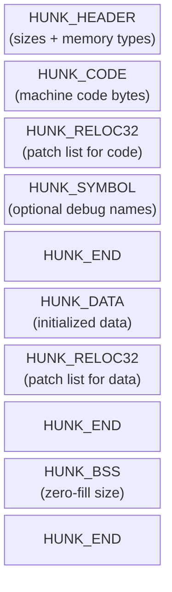

[← Home](../README.md) · [Loader & HUNK Format](README.md)

# HUNK Binary Format — Complete Specification

## Overview

The **HUNK** format is the binary container format used throughout AmigaOS. It is **not** a single file type — it covers two very different kinds of file that happen to share the same record structure:

| File kind | Extension | First longword | Can be executed? |
|---|---|---|---|
| **Executable** — program, shared library, device driver | *(none)*, `.library`, `.device` | `$000003F3` (`HUNK_HEADER`) | ✅ Yes — loaded directly by `dos.library LoadSeg()` |
| **Object file** — compiler/assembler output, needs linking | `.o` | `$000003E7` (`HUNK_UNIT`) | ❌ No — must be linked first to produce an executable |
| **Static library archive** — collection of object files | `.lib` | `$000003FA` (`HUNK_LIB`) | ❌ No — linker input only |

An object file (`.o`) is **intermediate output** from a compiler. It contains relocatable code and unresolved external references. A linker (`slink`, `vlink`) combines one or more `.o` files with library archives into a final executable.

The format is a linear stream of **hunk records**, each identified by a 32-bit type word followed by type-specific data.

---

## Magic Number — All Valid First Longword Values

Tools and the OS identify a HUNK file by reading its **first 32-bit longword**. There are exactly three valid opening values:

| First longword | Hex | Dec | Constant | File type | Who reads it |
|---|---|---|---|---|---|
| `$000003F3` | `0x3F3` | 1011 | `HUNK_HEADER` | **Loadable executable** — program, `.library`, `.device` | `dos.library InternalLoadSeg()` |
| `$000003E7` | `0x3E7` | 999 | `HUNK_UNIT` | **Relocatable object file** (`.o`) — compiler/assembler output | Linker (`slink`, `vlink`) |
| `$000003FA` | `0x3FA` | 1018 | `HUNK_LIB` | **Static library archive** (`.lib`) — collection of `.o` files | Linker only |

Any other first longword means the file is **not a valid HUNK file**. `InternalLoadSeg` will return an error.

> [!NOTE]
> Only `HUNK_HEADER` files can be passed to `LoadSeg()`. Passing a `.o` object file or a `.lib` archive to `LoadSeg()` will fail — those are consumed exclusively by the linker at build time, never at runtime.

### What `$000003F3` means exactly

The value `$000003F3` = decimal 1011 = the constant `HUNK_HEADER`. Nothing about this value is arbitrary — it is the hunk type code for the header record, used as the magic number because the header is always the first hunk in an executable.

### What `$000003E7` means exactly

The value `$000003E7` = decimal 999 = `HUNK_UNIT`. This marks the start of one relocatable compilation unit. A `.o` file may contain multiple `HUNK_UNIT` records, one per independently-compiled module (though most compilers emit exactly one per file).

### Checking the magic yourself

```bash
# Check file type from the command line:
python3 -c "
import struct, sys
data = open(sys.argv[1], 'rb').read(4)
tag  = struct.unpack('>I', data)[0]
names = {0x3F3:'HUNK_HEADER (executable)', 0x3E7:'HUNK_UNIT (object file)', 0x3FA:'HUNK_LIB (library archive)'}
print(f'{sys.argv[1]}: {names.get(tag, f\"UNKNOWN ({tag:#010x})\")}')
" mybinary
```

---

## Hunk Type Codes

> Source header: **`dos/doshunks.h`** (NDK 3.9). Every hunk record starts with one of these 32-bit tag values. The file is a linear stream — the loader reads tag → payload → next tag, until the file ends.

---

### Terminology

| Term | Meaning |
|---|---|
| **longword** | 32-bit (4-byte) value — the native word size of the 68000 |
| **BPTR** | BCPL pointer — byte address **right-shifted by 2** (always longword-aligned). Dereference: `real_addr = bptr_value << 2` |
| **ULONG** | Unsigned 32-bit integer |
| **UBYTE** | Unsigned 8-bit byte |
| **size in longs** | Content length as a count of 4-byte longwords. Bytes = longs × 4 |
| **Exec** | Appears in loadable executables only (starts with `HUNK_HEADER`) |
| **Obj** | Appears in relocatable object files only (starts with `HUNK_UNIT`) |
| **Both** | Valid in either context |

---

### Group 1 — Object File Framing

> These two tags appear **only in `.o` files**. Never in a final linked executable.

| Hex | Dec | Constant | Wire format | Description |
|---|---|---|---|---|
| `$3E7` | 999 | `HUNK_UNIT` | `[tag] [name_len_longs] [name_bytes…]` | **Start of a relocatable object unit.** Always the very first record in a `.o` file — the object-file equivalent of `HUNK_HEADER`. The name field names the compilation unit (e.g. `"main.o"`). A single `.o` file may contain multiple `HUNK_UNIT` records. |
| `$3E8` | 1000 | `HUNK_NAME` | `[tag] [name_len_longs] [name_bytes…]` | **Section name label.** Optional; assigns a human-readable name to the following section. The linker uses it for map files and diagnostics. |

---

### Group 2 — Content Sections

> Carry actual program data. Valid in **both** executables and object files. The type longword may have `HUNKF_CHIP` / `HUNKF_FAST` ORed into its upper bits — see [Memory Placement Flags](#memory-placement-flags).

| Hex | Dec | Constant | Payload | Description |
|---|---|---|---|---|
| `$3E9` | 1001 | `HUNK_CODE` | `[tag] [size_longs] [code_bytes × size×4]` | **Machine-code section.** The loader allocates RAM, copies the bytes, then applies any `HUNK_RELOC32` that follows. Holds 68k instructions — never data. |
| `$3EA` | 1002 | `HUNK_DATA` | `[tag] [size_longs] [data_bytes × size×4]` | **Initialized read/write data.** Global variables with non-zero values, string literals, jump tables, etc. Any embedded pointers to other hunks require `HUNK_RELOC32` fixups. |
| `$3EB` | 1003 | `HUNK_BSS` | `[tag] [size_longs]` *(no data bytes)* | **Uninitialized data (zero-fill).** Only the size is stored — no bytes in the file. The loader calls `AllocMem(..., MEMF_CLEAR)`. A 64 KB zero array costs 4 bytes on disk. **No relocation follows BSS hunks** — there are no initialized values to fix up. |

> [!NOTE]
> **HUNK_DATA trailing space:** Data hunks have been observed with trailing `ds.width` variables that do not contribute to the local hunk length declared in the `HUNK_DATA` header, but are accounted for in the `HUNK_HEADER` size table. The OS loader allocates based on the header size table, so the extra space is available at runtime even though the hunk's own `num_longs` field doesn't include it.

---

### Group 3 — Relocation Records

> Tell the loader which longwords inside the current hunk need to be patched with the actual load address of another hunk. Without relocation, all cross-hunk pointers would point to wrong addresses after the OS places code at a non-zero address.

| Hex | Dec | Constant | Alias | Field width | Description |
|---|---|---|---|---|---|
| `$3EC` | 1004 | `HUNK_RELOC32` | `HUNK_ABSRELOC32` | LONG (32-bit) | **Absolute 32-bit fixup — the most common type.** Wire format: `[tag] { [count] [hunk_idx] [offset_0] … [offset_n] } … [0]`. Each offset points to a longword in the current hunk; `*(ULONG*)(base+offset) += target_hunk_base`. Terminated by `count=0`. |
| `$3ED` | 1005 | `HUNK_RELOC16` | `HUNK_RELRELOC16` | LONG (32-bit) | **16-bit absolute fixup.** Same format as above but patches a UWORD. Rare — 68k branch displacements are PC-relative and need no reloc. |
| `$3EE` | 1006 | `HUNK_RELOC8` | `HUNK_RELRELOC8` | LONG (32-bit) | **8-bit fixup.** Patches a UBYTE. Essentially unused — no 68k instruction has an 8-bit absolute address field. |
| `$3F7` | 1015 | `HUNK_DREL32` | — | WORD (16-bit) | **Compact 32-bit reloc.** Same semantics as `HUNK_RELOC32` but count, hunk index, and offsets are stored as 16-bit WORDs, halving the table size. Valid only when all hunk offsets fit in 16 bits (hunk < 64 KB). Generated by BLink. |
| `$3F8` | 1016 | `HUNK_DREL16` | — | WORD (16-bit) | Compact 16-bit reloc with WORD-sized fields. Very rare. |
| `$3F9` | 1017 | `HUNK_DREL8` | — | WORD (16-bit) | Compact 8-bit reloc with WORD-sized fields. Essentially unused. |
| `$3FC` | 1020 | `HUNK_RELOC32SHORT` | — | WORD (16-bit) | **Compact absolute 32-bit reloc with WORD offsets.** Semantically identical to `HUNK_RELOC32` with WORD fields. Default output of vasm/vlink when all offsets fit in 16 bits. Preferred over `HUNK_DREL32` in OS 3.x-era tools. **After the table, if the total WORD count is odd, a padding WORD (`$0000`) restores longword alignment** before the next hunk record. |
| `$3FD` | 1021 | `HUNK_RELRELOC32` | — | LONG (32-bit) | **PC-relative 32-bit reloc.** Patch: `*(LONG*)(base+off) += target_base − (base+off+4)`. Used by GCC `-fPIC` and PIC shared libraries. |
| `$3FE` | 1022 | `HUNK_ABSRELOC16` | — | LONG (32-bit) | **Absolute 16-bit fixup.** Patches a UWORD with the low 16 bits of the target's absolute address. Required for `MOVE.W #abs_addr,Dn` patterns. Rare. |

---

### Group 4 — External Symbol Table

> Object files only — **never present in a linked executable**.

| Hex | Dec | Constant | Description |
|---|---|---|---|
| `$3EF` | 1007 | `HUNK_EXT` | **Import + export symbol table for a compilation unit.** A single stream encodes both sides: *exports* declare symbols defined in this hunk (type `EXT_DEF`, `EXT_ABS`, `EXT_RES`); *imports* list unresolved references the linker must satisfy from other objects (type `EXT_REF32`, `EXT_REF16`, `EXT_REF8`, `EXT_COMMON`). The linker resolves all imports and emits `HUNK_RELOC32` records in the output executable. Wire format: `[tag] { [type_and_namelen] [name_bytes…] [value_or_refcount] [ref_offsets…] } … [0]`. See [`hunk_ext_deep_dive.md`](hunk_ext_deep_dive.md) for sub-type encoding. |

---

### Group 5 — Debug and Metadata

> **Completely ignored by the OS loader.** Strip with `slink NODBG` or `m68k-amigaos-strip --strip-debug` to reduce file size.

| Hex | Dec | Constant | Payload | Description |
|---|---|---|---|---|
| `$3F0` | 1008 | `HUNK_SYMBOL` | `[tag] { [namelen_longs] [name_bytes…] [value] } … [0]` | **Local symbol table.** Maps label names → offsets within this hunk. Consumed by MonAm, wack, IDA Pro. Terminated by `namelen=0`. |
| `$3F1` | 1009 | `HUNK_DEBUG` | `[tag] [size_longs] [format_tag] [data_bytes…]` | **Opaque debug block.** The leading `format_tag` longword identifies the debug data encoding — see [Debug Format Tags](#debug-format-tags) below for the full table. See [`hunk_debug_info.md`](hunk_debug_info.md) for stabs record layout. |

#### Debug Format Tags

The first longword after the size field in a `HUNK_DEBUG` block is a 4-character ASCII **format tag** identifying the debug data encoding:

| Format tag (hex) | ASCII | Compiler / Assembler | Description |
|---|---|---|---|
| `$3D415053` | `=APS` | SAS/C 6.x | SAS/C stabs debug symbols |
| `$3D474343` | `=GCC` | GCC (m68k-amigaos) | GCC stabs debug symbols |
| `$3D574152` | `=WAR` | Storm C / Warp C | Storm C / Warp C debug symbols |
| `$48434C4E` | `HCLN` | Devpac | Devpac assembler — source file name record |
| `$48454144` | `HEAD` | Devpac | Devpac assembler — start of source file marker |
| `$4C494E45` | `LINE` | Generic / multiple | Line-number debug info (used by several assemblers) |
| `$4F444546` | `ODEF` | BAsm | BAsm assembler debug symbols |
| `$4F505453` | `OPTS` | SAS/C | SAS/C compiler options record |
| `$5A4D4147` | `ZMAG` | GNU tools (ld) | GNU ZMAGIC debug hunk (full 6-byte tag `ZMAGIC`) |

> [!NOTE]
> `dos.library` v31+ treats **any** hunk ID whose lower 29 bits exceed `HUNK_ABSRELOC16` (`$3FE` / 1022) as a `HUNK_DEBUG` block and silently skips it — unless bit 29 is set, which causes `ERROR_BAD_HUNK`. This allows compilers to emit custom debug hunk types that newer loaders ignore transparently.

---

### Group 6 — Structural Records

| Hex | Dec | Constant | Payload | Description |
|---|---|---|---|---|
| `$3F2` | 1010 | `HUNK_END` | `[tag]` only — **no payload** | **Required end-of-hunk marker.** Every code/data/BSS hunk (and all reloc/symbol records that follow it) must close with `HUNK_END`. The loader advances to the next segment slot on reading it. |
| `$3F3` | 1011 | `HUNK_HEADER` | `[tag] [0] [num_hunks] [first_hunk] [last_hunk] [size_longs × n]` | **Executable magic number and segment size table.** Must be the very first longword in a loadable executable. The zero longword is the resident-library list (always 0 in practice). `num_hunks` = total hunks; `first_hunk`/`last_hunk` = inclusive range; followed by one size-in-longs per hunk. |
| `$3F5` | 1013 | `HUNK_OVERLAY` | `[tag] [size_longs] [overlay_table_data…]` | **Overlay descriptor table.** Follows the resident hunks; describes groups of code swapped in from disk on demand. Allows programs larger than available RAM. Obsolete — prefer `OpenLibrary()`. |
| `$3F6` | 1014 | `HUNK_BREAK` | `[tag]` only — **no payload** | **End of overlay tree sentinel.** `InternalLoadSeg` needs this to know where the overlay descriptor ends and the per-overlay hunk data begins. |

> [!NOTE]
> Value `$3F4` (decimal 1012) is **unused** — the numbering skips it intentionally.

---

### Group 7 — Static Library Archive

> Linker input only. Never loaded by `LoadSeg()` at runtime.

| Hex | Dec | Constant | Description |
|---|---|---|---|
| `$3FA` | 1018 | `HUNK_LIB` | **Static library archive container.** A sequence of embedded `HUNK_UNIT` object files, each preceded by its size in longwords. Produced by `ar68k` or the AmigaOS `join` command. The linker extracts only the units needed to resolve outstanding `HUNK_EXT` imports. |
| `$3FB` | 1019 | `HUNK_INDEX` | **Symbol index for `HUNK_LIB`.** A packed string table plus a per-unit map of exported symbol names → unit byte offsets. Lets the linker locate a function without scanning every object in the archive. Always immediately follows the `HUNK_LIB` it describes. |


### Hunk ID Bit Masking

After the initial `HUNK_HEADER`, the OS loader (`dos.library`) only examines the **lower 29 bits** of each hunk type longword. The upper bits encode memory placement flags (see [Memory Placement Flags](#memory-placement-flags) below). This has two important consequences:

1. **Unknown hunk types become debug.** `dos.library` v31+ treats any hunk ID whose lower 29 bits exceed `HUNK_ABSRELOC16` (`$3FE` / 1022) as a `HUNK_DEBUG` block and silently skips it. This allows compilers to emit custom debug hunk types that newer loaders ignore without error.
2. **Bit 29 set → load failure.** If a hunk ID has bit 29 set but is not a recognized code/data/BSS type, the loader **fails** with `ERROR_BAD_HUNK` rather than treating it as debug.

```c
/* Typical loader logic (dos.library v31+) */
hunk_id = read_uint32(f);
if (hunk_id == HUNK_HEADER) { ... }  /* first hunk only — full 32 bits */
/* After HUNK_HEADER: mask memory flags, check range */
hunk_id &= 0x3FFFFFFF;               /* keep lower 30 bits */
if (hunk_id > HUNK_ABSRELOC16) {     /* unknown type */
    if (hunk_id & HUNKF_FAST)        /* bit 29 set? */
        return ERROR_BAD_HUNK;       /* hard error */
    /* else: treat as HUNK_DEBUG — skip silently */
}
```

> [!NOTE]
> The masking (typically `& 0x3FFFFFFF`) keeps 30 bits, not 29 as the simplified description suggests. The practical rule: after `HUNK_HEADER`, memory flag bits are stripped before the type code comparison.


### Memory Placement Flags


The type longword for these three hunks can encode a **memory placement request** in its upper bits. The loader passes the corresponding `MEMF_*` flags to `AllocMem`.

```
Bit layout of the type longword:

  31      30      29      28 ............. 0
  ┌───┐  ┌────┐  ┌────┐  ┌─────────────────┐
  │ 0 │  │CHIP│  │FAST│  │  Hunk type code  │
  └───┘  └────┘  └────┘  └─────────────────┘
```

| Bit | Constant | Value | Meaning |
|---|---|---|---|
| 30 | `HUNKF_CHIP` | `1L<<30` | Hunk **must** be in Chip RAM — required for anything the custom chips DMA from (bitmaps, audio, copper lists, sprites) |
| 29 | `HUNKF_FAST` | `1L<<29` | Hunk **prefers** Fast RAM — use for pure CPU data where DMA is not needed; avoids Chip RAM bus contention |
| 30+29 both set | *(extended)* | `0x60000000` | Next longword in the file contains full `MEMF_*` flags for `AllocMem` — allows any combination |
| neither | *(default)* | `0` | `MEMF_PUBLIC` — any available memory |

Additional helper constants:

| Constant | Value | Meaning |
|---|---|---|
| `HUNKB_CHIP` | `30` | Bit **number** (use with `bset`/`btst`) |
| `HUNKB_FAST` | `29` | Bit **number** |

**`MEMF_*` flags** used in extended mode (from `exec/memory.h`):

| Constant | Value | Meaning |
|---|---|---|
| `MEMF_ANY` | `0` | No preference — any accessible memory |
| `MEMF_PUBLIC` | `1<<0` | Must be accessible by all tasks and hardware |
| `MEMF_CHIP` | `1<<1` | Chip RAM — reachable by DMA controllers |
| `MEMF_FAST` | `1<<2` | Fast RAM — CPU-only, no chip DMA contention |
| `MEMF_CLEAR` | `1<<16` | Zero-fill on allocation |
| `MEMF_LARGEST` | `1<<17` | Return the single largest contiguous free block |
| `MEMF_REVERSE` | `1<<18` | Allocate from the top of the region (high addresses first) |
| `MEMF_TOTAL` | `1<<19` | `AvailMem`: report total installed rather than current free |

**Example:** force a code hunk into Chip RAM:

```
type longword = HUNK_CODE | HUNKF_CHIP
             = 0x000003E9 | 0x40000000
             = 0xC00003E9
```

**Why would code go in Chip RAM?** Rare, but needed on an A500 with no Fast RAM — everything including code must fit in the 512 KB Chip RAM.

---

### Quick Reference Table

| Hex | Dec | Constant | Alias | Context | Purpose |
|---|---|---|---|---|---|
| `$3E7` | 999 | `HUNK_UNIT` | — | Obj | Start of relocatable object unit |
| `$3E8` | 1000 | `HUNK_NAME` | — | Obj | Name label for the following section |
| `$3E9` | 1001 | `HUNK_CODE` | — | Both | Machine-code section |
| `$3EA` | 1002 | `HUNK_DATA` | — | Both | Initialized read/write data |
| `$3EB` | 1003 | `HUNK_BSS` | — | Both | Uninitialized data (size only, no bytes) |
| `$3EC` | 1004 | `HUNK_RELOC32` | `HUNK_ABSRELOC32` | Both | Absolute 32-bit address fixup list |
| `$3ED` | 1005 | `HUNK_RELOC16` | `HUNK_RELRELOC16` | Obj | 16-bit address fixup list |
| `$3EE` | 1006 | `HUNK_RELOC8` | `HUNK_RELRELOC8` | Obj | 8-bit fixup list |
| `$3EF` | 1007 | `HUNK_EXT` | — | Obj | Import + export symbol table |
| `$3F0` | 1008 | `HUNK_SYMBOL` | — | Both | Local debug symbol table |
| `$3F1` | 1009 | `HUNK_DEBUG` | — | Both | Opaque debug data (stabs / DWARF) |
| `$3F2` | 1010 | `HUNK_END` | — | Both | End-of-hunk marker — **required** |
| `$3F3` | 1011 | `HUNK_HEADER` | — | Exec | Executable magic number + size table |
| *(none)* | *1012* | *(unused)* | — | — | Gap in the numbering |
| `$3F5` | 1013 | `HUNK_OVERLAY` | — | Exec | Overlay group descriptor |
| `$3F6` | 1014 | `HUNK_BREAK` | — | Exec | End of overlay tree |
| `$3F7` | 1015 | `HUNK_DREL32` | — | Both | Compact 32-bit reloc (WORD-width fields) |
| `$3F8` | 1016 | `HUNK_DREL16` | — | Obj | Compact 16-bit reloc |
| `$3F9` | 1017 | `HUNK_DREL8` | — | Obj | Compact 8-bit reloc |
| `$3FA` | 1018 | `HUNK_LIB` | — | Obj | Static library archive |
| `$3FB` | 1019 | `HUNK_INDEX` | — | Obj | Symbol index for HUNK_LIB |
| `$3FC` | 1020 | `HUNK_RELOC32SHORT` | — | Both | Compact abs 32-bit reloc (WORD offsets) |
| `$3FD` | 1021 | `HUNK_RELRELOC32` | — | Both | PC-relative 32-bit reloc |
| `$3FE` | 1022 | `HUNK_ABSRELOC16` | — | Both | Absolute 16-bit address patch |

**Context key:** `Exec` = loadable executable · `Obj` = object file (HUNK_UNIT stream) · `Both` = either

```c
/* dos/doshunks.h — NDK 3.9 */

#define HUNK_UNIT           999   /* 0x3E7 — start of relocatable object (.o) */
#define HUNK_NAME          1000   /* 0x3E8 — name of this object unit/section */
#define HUNK_CODE          1001   /* 0x3E9 — machine code section */
#define HUNK_DATA          1002   /* 0x3EA — initialized data section */
#define HUNK_BSS           1003   /* 0x3EB — uninitialized data (zero-fill) */
#define HUNK_RELOC32       1004   /* 0x3EC — 32-bit absolute relocation table */
#define HUNK_ABSRELOC32    HUNK_RELOC32   /* alias */
#define HUNK_RELOC16       1005   /* 0x3ED — 16-bit relocation table */
#define HUNK_RELRELOC16    HUNK_RELOC16   /* alias */
#define HUNK_RELOC8        1006   /* 0x3EE — 8-bit relocation table */
#define HUNK_RELRELOC8     HUNK_RELOC8    /* alias */
#define HUNK_EXT           1007   /* 0x3EF — external symbol table (obj only) */
#define HUNK_SYMBOL        1008   /* 0x3F0 — local debug symbol table */
#define HUNK_DEBUG         1009   /* 0x3F1 — arbitrary debug data (stabs etc.) */
#define HUNK_END           1010   /* 0x3F2 — end-of-hunk marker */
#define HUNK_HEADER        1011   /* 0x3F3 — executable file header (magic) */
                                  /* 0x3F4 — unused */
#define HUNK_OVERLAY       1013   /* 0x3F5 — overlay tree descriptor */
#define HUNK_BREAK         1014   /* 0x3F6 — end of overlay tree */
#define HUNK_DREL32        1015   /* 0x3F7 — compact 32-bit reloc (WORD fields) */
#define HUNK_DREL16        1016   /* 0x3F8 — compact 16-bit reloc */
#define HUNK_DREL8         1017   /* 0x3F9 — compact 8-bit reloc */
#define HUNK_LIB           1018   /* 0x3FA — static library archive */
#define HUNK_INDEX         1019   /* 0x3FB — symbol index for HUNK_LIB */
#define HUNK_RELOC32SHORT  1020   /* 0x3FC — compact 32-bit absolute reloc */
#define HUNK_RELRELOC32    1021   /* 0x3FD — PC-relative 32-bit reloc */
#define HUNK_ABSRELOC16    1022   /* 0x3FE — absolute 16-bit reloc */

/* Memory placement flags — OR'd into HUNK_CODE/DATA/BSS type longword */
#define HUNKB_FAST    29           /* bit number for Fast RAM flag */
#define HUNKB_CHIP    30           /* bit number for Chip RAM flag */
#define HUNKF_FAST    (1L<<29)    /* request Fast RAM for this hunk */
#define HUNKF_CHIP    (1L<<30)    /* request Chip RAM for this hunk */
```

### Terminology used in this document

- **longword** — a 32-bit (4-byte) value; the natural word size of the 68k
- **BPTR** — a BCPL pointer: the byte address right-shifted by 2 (always longword-aligned). Convert: `byte_addr = BPTR_value << 2`
- **ULONG** — unsigned 32-bit integer (`unsigned long` on the 68k)
- **UBYTE** — unsigned 8-bit byte
- **size in longs** — the hunk content length expressed as a count of 4-byte longwords (multiply by 4 to get bytes)

### Quick Reference Table

| Hex | Dec | Name | Alias | Context | Purpose |
|---|---|---|---|---|---|
| `$3E7` | 999 | `HUNK_UNIT` | — | Obj | Start of relocatable object unit |
| `$3E8` | 1000 | `HUNK_NAME` | — | Obj | Name string for this unit/section |
| `$3E9` | 1001 | `HUNK_CODE` | — | Both | Executable machine code section |
| `$3EA` | 1002 | `HUNK_DATA` | — | Both | Initialized read/write data section |
| `$3EB` | 1003 | `HUNK_BSS` | — | Both | Uninitialized data — size only, no bytes |
| `$3EC` | 1004 | `HUNK_RELOC32` | `HUNK_ABSRELOC32` | Both | Absolute 32-bit address patch list |
| `$3ED` | 1005 | `HUNK_RELOC16` | `HUNK_RELRELOC16` | Obj | 16-bit address patch list |
| `$3EE` | 1006 | `HUNK_RELOC8` | `HUNK_RELRELOC8` | Obj | 8-bit patch list |
| `$3EF` | 1007 | `HUNK_EXT` | — | Obj | Import + export symbol table |
| `$3F0` | 1008 | `HUNK_SYMBOL` | — | Both | Local debug symbol table |
| `$3F1` | 1009 | `HUNK_DEBUG` | — | Both | Opaque debug data (stabs, DWARF) |
| `$3F2` | 1010 | `HUNK_END` | — | Both | End of this hunk — required |
| `$3F3` | 1011 | `HUNK_HEADER` | — | Exec | Executable magic + size table |
| `$3F5` | 1013 | `HUNK_OVERLAY` | — | Exec | Overlay group descriptor |
| `$3F6` | 1014 | `HUNK_BREAK` | — | Exec | End of overlay tree |
| `$3F7` | 1015 | `HUNK_DREL32` | — | Both | Compact 32-bit reloc (WORD-sized fields) |
| `$3F8` | 1016 | `HUNK_DREL16` | — | Obj | Compact 16-bit reloc |
| `$3F9` | 1017 | `HUNK_DREL8` | — | Obj | Compact 8-bit reloc |
| `$3FA` | 1018 | `HUNK_LIB` | — | Obj | Static library archive (.lib) |
| `$3FB` | 1019 | `HUNK_INDEX` | — | Obj | Symbol index for HUNK_LIB |
| `$3FC` | 1020 | `HUNK_RELOC32SHORT` | — | Both | Compact abs 32-bit reloc (WORD offsets) |
| `$3FD` | 1021 | `HUNK_RELRELOC32` | — | Both | PC-relative 32-bit reloc |
| `$3FE` | 1022 | `HUNK_ABSRELOC16` | — | Both | Absolute 16-bit address patch |

**Context key:** `Exec` = loadable executable only · `Obj` = object file (HUNK_UNIT stream) only · `Both` = valid in either

### Memory Type Flags on HUNK_CODE / HUNK_DATA / HUNK_BSS

The type longword for code, data, and BSS hunks can carry memory placement hints in its upper two bits:

```
Bits 31..0 of the type longword:
  bit 31: unused (always 0)
  bit 30: HUNKF_CHIP  — loader must use AllocMem(..., MEMF_CHIP)
  bit 29: HUNKF_FAST  — loader prefers AllocMem(..., MEMF_FAST)
  bits 28..0: the hunk type constant (e.g. 0x3E9 for HUNK_CODE)
```

| Bit 30 | Bit 29 | Meaning | `AllocMem` flags used |
|---|---|---|---|
| 0 | 0 | Any memory (default) | `MEMF_PUBLIC` |
| 1 | 0 | Chip RAM required | `MEMF_CHIP` |
| 0 | 1 | Fast RAM preferred | `MEMF_FAST` |
| 1 | 1 | **Extended** — next longword holds full `MEMF_*` flags | caller reads extra longword |

**`MEMF_*` flag constants** (from `exec/memory.h`, used in extended mode):

```c
/* exec/memory.h — NDK39 */
#define MEMF_PUBLIC   (1L<<0)   /* any accessible memory */
#define MEMF_CHIP     (1L<<1)   /* Chip RAM (DMA-reachable by custom chips) */
#define MEMF_FAST     (1L<<2)   /* Fast RAM (CPU-only; faster than Chip) */
#define MEMF_VIRTUAL  (1L<<3)   /* not used on classic AmigaOS */
#define MEMF_CLEAR    (1L<<16)  /* zero-fill the allocation */
#define MEMF_LARGEST  (1L<<17)  /* return the single largest free block */
#define MEMF_REVERSE  (1L<<18)  /* allocate from top of list (high address) */
#define MEMF_TOTAL    (1L<<19)  /* AvailMem: return total, not largest */
#define MEMF_ANY      0L        /* no preference — equivalent to MEMF_PUBLIC */
```

Example: `HUNK_CODE` forced into Chip RAM:
```
type longword = HUNK_CODE | HUNKF_CHIP
             = 0x000003E9 | 0x40000000
             = 0xC00003E9
```

---

## HUNK_HEADER — Executable Header

Appears at the very start of an executable file:

```
$000003F3           HUNK_HEADER magic
$00000000           Resident library list (always 0 for loadable executables)
<num_hunks>         Number of hunks in the executable (longword)
<first_hunk>        Index of first loadable hunk (usually 0)
<last_hunk>         Index of last loadable hunk (= num_hunks - 1)
<size_0>            Size of hunk 0 in longwords
<size_1>            Size of hunk 1 in longwords
...
<size_n>            Size of last hunk in longwords
```

**Size longword bit encoding:**
```
bits 31-30: Memory type (00=ANY, 10=CHIP, 01=FAST, 11=extended)
bits 29-0:  Size in 32-bit longwords
```

**Example header (2 hunks: code + data):**
```
Offset  Bytes           Meaning
$00:    00 00 03 F3     HUNK_HEADER
$04:    00 00 00 00     no resident library list
$08:    00 00 00 02     2 hunks
$0C:    00 00 00 00     first hunk index = 0
$10:    00 00 00 01     last hunk index = 1
$14:    00 00 00 50     hunk 0: 0x50 longwords = 0x140 bytes (code)
$18:    00 00 00 10     hunk 1: 0x10 longwords = 0x40 bytes (data)
```

---

## HUNK_CODE / HUNK_DATA

```
<type>              HUNK_CODE ($3E9) or HUNK_DATA ($3EA)
<num_longs>         Size in longwords
<data...>           Raw code or data bytes (num_longs × 4 bytes)
HUNK_END ($3F2)     End of this hunk
```

---

## HUNK_BSS

```
<type>              HUNK_BSS ($3EB)
<num_longs>         Size in longwords (allocate this many bytes, zero-filled)
HUNK_END ($3F2)     End of this hunk
```

No data follows — BSS is zero-initialized by the loader.

---

## HUNK_RELOC32

32-bit absolute relocation records. These patch addresses in the code/data that reference other hunks.

```
<HUNK_RELOC32>      $000003EC
<num_offsets>       Number of offsets to patch for the next target hunk
<target_hunk>       Index of the hunk whose base address is added
<offset_0>          Byte offset within current hunk to patch (longword)
<offset_1>
...
<num_offsets=0>     Terminator — end of relocation table
HUNK_END ($3F2)
```

**Example:** Code hunk references data hunk. Two addresses need patching:
```
$000003EC           HUNK_RELOC32
$00000002           2 offsets to patch
$00000001           target = hunk 1 (data hunk)
$00000010           patch at offset $10 in code hunk
$00000024           patch at offset $24 in code hunk
$00000000           end of reloc list
$000003F2           HUNK_END
```

At load time: `*(ULONG *)(code_base + 0x10) += data_base`

---

## HUNK_SYMBOL

Optional local symbol table for debugging:

```
<HUNK_SYMBOL>       $000003F0
<name_len>          String length in longwords (1–N)
<name...>           Symbol name (padded to longword boundary)
<value>             Symbol value (offset within hunk)
...
<0>                 Zero name_len terminates
HUNK_END ($3F2)
```

---

## Complete Executable Structure (Annotated)

```
[File start]
HUNK_HEADER
  num_hunks = 3         ; code, data, BSS
  sizes: [0x200, 0x80, 0x100]

--- Hunk 0: Code ---
HUNK_CODE
  0x200 bytes of machine code
HUNK_RELOC32
  Patches in code referencing hunk 1 (data)
  Patches in code referencing hunk 2 (BSS)
HUNK_SYMBOL              (optional)
  _main at offset 0
  _foo  at offset 0x40
HUNK_END

--- Hunk 1: Data ---
HUNK_DATA
  0x80 bytes of initialized data
HUNK_RELOC32
  Patches in data (e.g., pointer tables) referencing code hunk
HUNK_END

--- Hunk 2: BSS ---
HUNK_BSS
  0x100 longwords = 1024 bytes (zero-filled at load time)
HUNK_END

[File end]
```

---

## File Format Diagram



---

## References

- *Amiga ROM Kernel Reference Manual: Libraries* — AmigaDOS executable format chapter
- ADCD 2.1: `Libraries_Manual_guide/` — LoadSeg, InternalLoadSeg
- NDK39: `dos/doshunks.h` — hunk type constants
- http://amigadev.elowar.com/read/ADCD_2.1/Libraries_Manual_guide/node01E0.html
- Community reference: http://sun.hasenbraten.de/vlink/release/vlink.pdf (HUNK format appendix)
- http://amiga-dev.wikidot.com/file-format:hunk — HUNK format reference with Python parsing code, debug format tags, and dos.library v31+ compatibility notes
