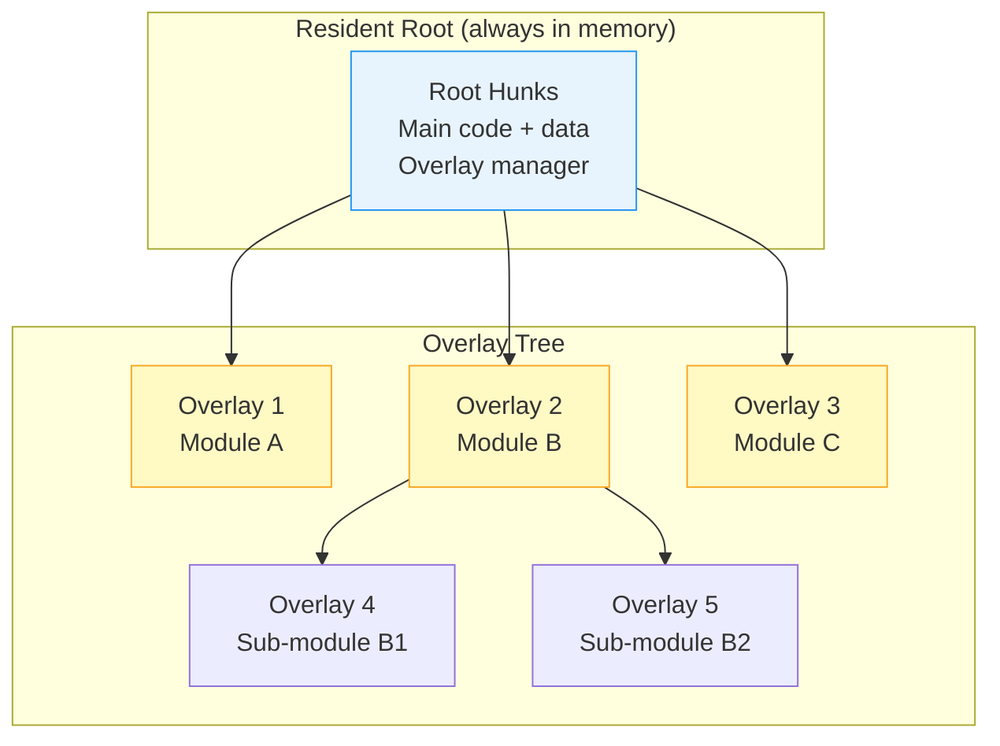

[← Home](../README.md) · [Loader & HUNK Format](README.md)

# HUNK_OVERLAY — Overlay System

## Overview

The **overlay system** allows programs larger than available RAM to run by dividing code into **segments loaded on demand** from disk. Only the resident root and one overlay branch are in memory at a time; switching to a different branch automatically unloads the previous one and loads the new one. This predates virtual memory and was essential on A500-era systems with 512 KB–1 MB RAM.

---

## Architecture



### Key Concepts

| Term | Meaning |
|---|---|
| **Root** | Hunks always resident in memory — contain the overlay manager |
| **Overlay node** | A group of hunks loaded together as a unit |
| **Overlay level** | Depth in the tree — root is level 0 |
| **Overlay branch** | Path from root to a leaf — only one branch loaded at any time per level |

---

## When Overlays Were Used

### Historical Context

| Application | Why Overlays Were Needed |
|---|---|
| Deluxe Paint | Multiple editing modes (paint, animation, text) couldn't fit simultaneously |
| SAS/C Compiler | Parser, optimizer, code generator loaded on demand |
| Professional Page | Layout engine, text editor, image handler as separate overlays |
| Large games | Different game levels or engine modules swapped in/out |

### Memory Reality (1987–1992)

| System | Available RAM | Typical Executable |
|---|---|---|
| A500 | 512 KB Chip | 80–200 KB code + data |
| A500 + 512 KB expansion | 1 MB | Up to ~600 KB usable |
| A2000 + 2 MB Fast | 2.5 MB | Overlays rarely needed |

With only 512 KB total (and Chip RAM shared with the display), a complex application simply couldn't fit all its code in memory at once.

---

## HUNK_OVERLAY Binary Format

### Executable Structure

```
HUNK_HEADER ($3F3)
  [Standard header for root hunks only]

[Root hunks — always loaded]
HUNK_CODE / HUNK_DATA / HUNK_BSS
  + HUNK_RELOC32
  + HUNK_END (for each root hunk)

HUNK_OVERLAY ($000003F5)
  <table_size_in_longs>       Total size of overlay table data
  <overlay_table_data>        Tree structure describing overlay nodes

HUNK_BREAK ($000003F6)        Marks boundary between tree and overlay hunks

[Overlay hunks — loaded on demand]
HUNK_CODE / HUNK_DATA / HUNK_BSS
  + HUNK_RELOC32
  + HUNK_END (for each overlay hunk)
```

### Overlay Table Structure

```c
/* The overlay table describes the tree topology: */
struct OverlayTable {
    LONG ot_TableSize;    /* Size of this table in longwords */
    LONG ot_MaxLevel;     /* Deepest overlay level */
    /* Array of overlay nodes: */
    struct OvlyNode {
        LONG on_NextNode;     /* Offset to next node at same level */
        LONG on_FirstChild;   /* Offset to first child node */
        LONG on_FileOffset;   /* Byte offset of this node's hunks in the file */
        LONG on_NumHunks;     /* Number of hunks in this overlay node */
        LONG on_HunkTable[];  /* Hunk sizes in longwords (parallels HUNK_HEADER) */
    } nodes[];
};
```

### Worked Binary Example

A program with 2 root hunks and 3 overlay nodes:

```
Offset   Hex                    Meaning
──────────────────────────────────────────────
$0000    00 00 03 F3            HUNK_HEADER
$0004    00 00 00 00            No resident library names
$0008    00 00 00 02            2 root hunks
$000C    00 00 00 00            First hunk = 0
$0010    00 00 00 01            Last hunk = 1
$0014    00 00 00 80            Hunk 0 size = 512 bytes (128 longs)
$0018    00 00 00 40            Hunk 1 size = 256 bytes (64 longs)

$001C    00 00 03 E9            HUNK_CODE (root hunk 0)
         [512 bytes of root code...]
$021C    00 00 03 EC            HUNK_RELOC32
         ...
$0240    00 00 03 F2            HUNK_END

$0244    00 00 03 EA            HUNK_DATA (root hunk 1)
         [256 bytes of root data...]
$0348    00 00 03 F2            HUNK_END

$034C    00 00 03 F5            HUNK_OVERLAY
$0350    00 00 00 0C            Table size = 12 longwords
         [overlay table data: 3 nodes...]

$0380    00 00 03 F6            HUNK_BREAK

$0384    00 00 03 E9            HUNK_CODE (overlay 1 code)
         [overlay 1 code...]
$0500    00 00 03 F2            HUNK_END

$0504    00 00 03 E9            HUNK_CODE (overlay 2 code)
         [overlay 2 code...]
$0700    00 00 03 F2            HUNK_END
```

---

## Runtime Overlay Management

### The Overlay Manager

The root code contains an **overlay manager** — a small runtime that handles loading and unloading overlay nodes:

```c
/* Overlay manager pseudo-code (embedded in root hunks): */

static LONG currentOverlay = -1;
static BPTR exeFile = 0;        /* File handle to the executable itself */

APTR LoadOverlay(LONG nodeIndex)
{
    struct OvlyNode *node = &overlayTable[nodeIndex];

    if (nodeIndex == currentOverlay)
        return overlayBase;  /* Already loaded */

    /* 1. Unload current overlay (if any) */
    if (currentOverlay >= 0)
    {
        /* Free memory for previous overlay hunks */
        FreeOverlayHunks(currentOverlay);
    }

    /* 2. Seek to overlay position in executable file */
    Seek(exeFile, node->on_FileOffset, OFFSET_BEGINNING);

    /* 3. Load overlay hunks (like a mini-LoadSeg) */
    for (int i = 0; i < node->on_NumHunks; i++)
    {
        ULONG size = node->on_HunkTable[i] * 4;
        APTR mem = AllocMem(size, MEMF_ANY);
        Read(exeFile, mem, size);
        /* Apply relocations for this overlay */
        ProcessRelocations(mem, i);
    }

    /* 4. Update state */
    currentOverlay = nodeIndex;

    return overlayBase;
}
```

### Calling Into an Overlay

```c
/* Application code in the root: */
void DoModuleA(void)
{
    APTR base = LoadOverlay(OVERLAY_MODULE_A);  /* Ensure Module A is loaded */
    ((void (*)(void))(base + moduleA_EntryOffset))();  /* Call into it */
}

void DoModuleB(void)
{
    APTR base = LoadOverlay(OVERLAY_MODULE_B);  /* Unloads A, loads B */
    ((void (*)(void))(base + moduleB_EntryOffset))();
}
```

### Important Constraints

| Constraint | Reason |
|---|---|
| Only one overlay per level at a time | They share the same memory region |
| Cannot call across overlays | The target overlay may not be loaded |
| Root code must manage all transitions | Overlay code cannot load another overlay |
| File must remain accessible | The executable is re-read from disk each time |
| Disk I/O on every switch | Slow on floppies (~200 ms per overlay load) |

---

## Linker Support

### SLink (SAS/C Linker)

```
slink from module_root.o + module_a.o + module_b.o + module_c.o
     to myapp
     overlay
     with myapp.ovly     ; overlay specification file
```

The `.ovly` file describes the tree:

```
; myapp.ovly — overlay specification
ROOT  module_root.o
OVERLAY
  NODE module_a.o         ; overlay node 1
  NODE module_b.o         ; overlay node 2
    NODE module_b1.o      ; child of node 2 (level 2)
  NODE module_c.o         ; overlay node 3
END
```

### BLink

BLink uses a similar mechanism with the `OVERLAY` keyword in the linker script.

---

## Modern Alternatives

The overlay system is effectively obsolete. Modern Amiga development uses these alternatives:

### Shared Libraries (Recommended)

```c
/* Split functionality into shared libraries loaded on demand */
struct Library *ModuleA = OpenLibrary("myapp_modulea.library", 1);
if (ModuleA)
{
    ModuleA_DoWork();  /* Calls through JMP table */
    CloseLibrary(ModuleA);  /* Freed when refcount = 0 */
}
```

**Advantages**: OS manages memory, multiple users, version checking, proper resource tracking.

### Separate Executables

```c
/* Run a sub-program and return */
SystemTagList("SYS:Tools/SubModule", NULL);
```

### Dynamic LoadSeg

```c
/* Manual segment loading — like overlays but simpler */
BPTR seg = LoadSeg("PROGDIR:modules/module_a");
if (seg)
{
    /* Get entry point from first code hunk */
    APTR entry = BADDR(seg) + 4;  /* Skip BPTR to next segment */
    ((void (*)(void))entry)();
    UnLoadSeg(seg);
}
```

---

## References

- *Amiga ROM Kernel Reference Manual: Libraries* — AmigaDOS overlay section
- NDK39: `dos/doshunks.h` — HUNK_OVERLAY ($3F5), HUNK_BREAK ($3F6)
- SAS/C 6.x Linker Manual — overlay chapter
- See also: [HUNK Format](hunk_format.md) — complete hunk type reference
- See also: [Exe Load Pipeline](exe_load_pipeline.md) — how LoadSeg processes hunks
- See also: [Shared Libraries](../04_linking_and_libraries/shared_libraries_runtime.md) — modern alternative
