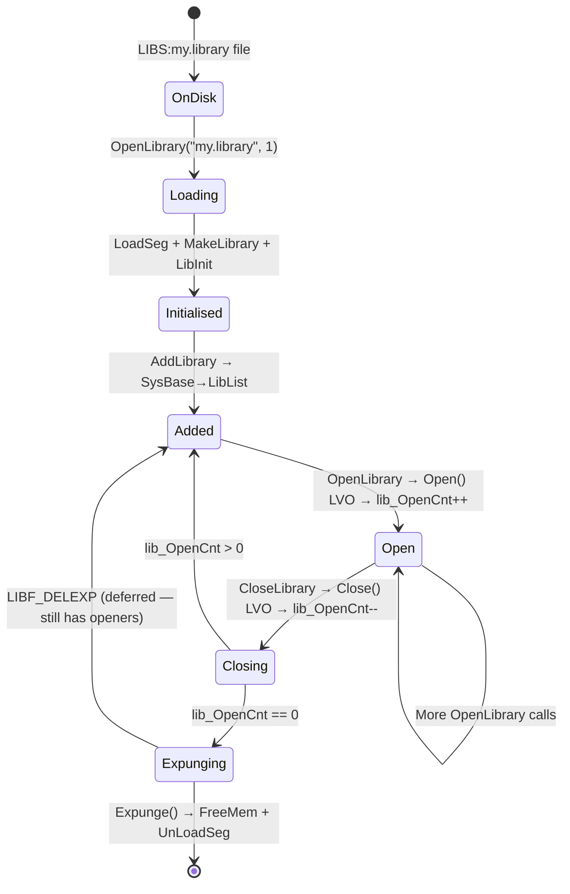

[← Home](../README.md) · [Linking & Libraries](README.md)

# AmigaOS Library Structure — Architecture, Construction, Memory Layout

## Overview

Every AmigaOS library, device, and resource is a **struct Library** preceded by a negative-offset JMP table. This document covers the complete memory layout, how `MakeLibrary()` constructs a library from scratch, the function vector table encoding, checksum verification, and how to create your own shared libraries.

---

## Memory Layout

```
Low addresses                                              High addresses
──────────────────────────────────────────────────────────────────────────

┌──────────────────────────────────┬──────────────────────────────────┐
│       JMP Table (negative)       │      Library Data (positive)     │
│                                  │                                  │
│  base - N:  JMP func_N          │  base + $00: struct Library      │
│  ...                             │  base + $22: lib_OpenCnt         │
│  base - 36: JMP func_6          │  base + $24: [private data]      │
│  base - 30: JMP func_5 (1st user)│  base + $XX: [more private]     │
│  base - 24: JMP Reserved        │                                  │
│  base - 18: JMP Expunge         │                                  │
│  base - 12: JMP Close           │                                  │
│  base - 6:  JMP Open            │                                  │
└──────────────────────────────────┴──────────────────────────────────┘
                                   ↑
                            Library Base Pointer
                         (returned by OpenLibrary)
```

### Memory Allocation

The library occupies a **single contiguous allocation**:

```c
/* Total allocation = JMP table + Library header + private data */
ULONG total = lib_NegSize + lib_PosSize;

/* AllocMem returns the start of the block */
APTR block = AllocMem(total, MEMF_PUBLIC | MEMF_CLEAR);

/* Library base pointer = block + lib_NegSize */
struct Library *lib = (struct Library *)((UBYTE *)block + lib_NegSize);
```

---

## The Library Node

```c
/* exec/libraries.h */
struct Library {
    struct Node  lib_Node;       /* +$00: linked list node (14 bytes) */
    UBYTE        lib_Flags;      /* +$0E: LIBF_ flags */
    UBYTE        lib_pad;        /* +$0F: alignment padding */
    UWORD        lib_NegSize;    /* +$10: bytes of JMP table */
    UWORD        lib_PosSize;    /* +$12: bytes of Library struct + private */
    UWORD        lib_Version;    /* +$14: major version */
    UWORD        lib_Revision;   /* +$16: minor revision */
    APTR         lib_IdString;   /* +$18: "mylib.library 1.0 (1.1.95)\r\n" */
    ULONG        lib_Sum;        /* +$1C: checksum of JMP table */
    UWORD        lib_OpenCnt;    /* +$20: current open count */
};
/* sizeof(struct Library) = 34 bytes ($22) */
```

### The Node Header

```c
/* exec/nodes.h */
struct Node {
    struct Node *ln_Succ;    /* +$00: next node in list */
    struct Node *ln_Pred;    /* +$04: previous node */
    UBYTE        ln_Type;    /* +$08: NT_LIBRARY, NT_DEVICE, NT_RESOURCE */
    BYTE         ln_Pri;     /* +$09: priority (for Enqueue) */
    char        *ln_Name;    /* +$0A: "dos.library" */
};
```

| ln_Type Value | Hex | Type |
|---|---|---|
| `NT_LIBRARY` | $09 | Standard shared library |
| `NT_DEVICE` | $03 | I/O device (trackdisk.device, etc.) |
| `NT_RESOURCE` | $08 | Hardware resource (cia.resource, etc.) |

---

## JMP Table Encoding

Each function vector is a 6-byte absolute JMP instruction:

```
Bytes: 4E F9 AA AA AA AA
        └──┘ └──────────┘
        JMP   32-bit absolute target address
        .L
```

### Why 6 Bytes?

The 68000 `JMP (xxx).L` instruction is exactly 6 bytes:
- 2 bytes: opcode `$4EF9`
- 4 bytes: 32-bit absolute address

This is the most compact way to do an indirect jump to an arbitrary address. The fixed 6-byte slot size allows the LVO to be calculated as a simple multiplication: `LVO = -(function_index × 6)`.

### Calling Through the JMP Table

```asm
; User code:
    MOVEA.L _DOSBase, A6       ; load library base into A6
    JSR     -48(A6)            ; jump to JMP table slot at base-48

; CPU executes:
;   1. Push return address onto stack
;   2. Compute effective address: A6 + (-48) = base - 48
;   3. Read 6 bytes at that address: 4EF9 AAAAAAAA
;   4. Jump to AAAAAAAA (the actual function body)
;   5. Function executes and RTS returns to caller
```

The double-jump (JSR→JMP→function→RTS) costs approximately 12 extra cycles on a 68000 — negligible compared to function execution time.

### Standard Functions (Mandatory for All Libraries)

| LVO | Index | Function | Purpose |
|---|---|---|---|
| −6 | 1 | `Open()` | Called by `OpenLibrary()` — increment refcount, return base |
| −12 | 2 | `Close()` | Called by `CloseLibrary()` — decrement refcount |
| −18 | 3 | `Expunge()` | Free resources when refcount reaches 0 |
| −24 | 4 | `Reserved()` | Must return 0 — reserved for future use |
| −30 | 5 | (first public function) | Library-specific — defined by `.fd` file |

---

## MakeLibrary() — Building a Library

```c
struct Library *MakeLibrary(
    APTR   funcArray,     /* A0: function pointer array */
    APTR   structInit,    /* A1: struct initialiser table (or NULL) */
    APTR   initFunc,      /* A2: init function (or NULL) */
    ULONG  dataSize,      /* D0: sizeof(MyLibBase) */
    BPTR   segList         /* D1: segment list (for UnLoadSeg on expunge) */
);
```

### Function Array Formats

`funcArray` can be in two formats:

**Format 1: Absolute Pointers** (most common for C libraries)

```c
/* NULL-terminated array of function pointers */
APTR myFuncArray[] = {
    (APTR)MyOpen,        /* LVO -6 */
    (APTR)MyClose,       /* LVO -12 */
    (APTR)MyExpunge,     /* LVO -18 */
    (APTR)NULL,          /* LVO -24: Reserved */
    (APTR)MyFunc1,       /* LVO -30 */
    (APTR)MyFunc2,       /* LVO -36 */
    (APTR)-1             /* terminator */
};
```

**Format 2: Relative Offsets** (used by ROM modules)

```c
/* First entry = -1 signals relative mode */
/* Following entries are WORD offsets from funcArray base */
WORD myFuncArray[] = {
    -1,                   /* flag: relative mode */
    MyOpen - funcBase,    /* WORD offset to Open */
    MyClose - funcBase,   /* WORD offset to Close */
    MyExpunge - funcBase, /* WORD offset to Expunge */
    0,                    /* Reserved = NULL (offset 0 maps to a NOP) */
    MyFunc1 - funcBase,
    MyFunc2 - funcBase,
    -1                    /* terminator */
};
```

### MakeLibrary Internals

```c
/* What MakeLibrary does internally: */

/* 1. Count functions by scanning funcArray to the terminator */
ULONG numFuncs = CountFunctions(funcArray);
ULONG negSize = numFuncs * 6;  /* 6 bytes per JMP slot */

/* 2. Allocate combined block */
ULONG posSize = MAX(dataSize, sizeof(struct Library));
APTR block = AllocMem(negSize + posSize, MEMF_PUBLIC | MEMF_CLEAR);
struct Library *lib = (struct Library *)((UBYTE *)block + negSize);

/* 3. Fill JMP table using MakeFunctions() */
MakeFunctions(lib, funcArray, NULL);
/* For each function pointer, writes:
   *(UWORD *)(slot) = 0x4EF9;         // JMP.L opcode
   *(ULONG *)(slot + 2) = funcAddr;   // target address */

/* 4. Initialize struct Library fields */
lib->lib_NegSize = negSize;
lib->lib_PosSize = posSize;

/* 5. Apply structInit table (if provided) */
if (structInit)
    InitStruct(structInit, lib, 0);

/* 6. Call init function (if provided) */
if (initFunc)
    lib = ((struct Library *(*)(struct Library *, BPTR, struct ExecBase *))
           initFunc)(lib, segList, SysBase);

/* 7. Compute and store checksum */
SumLibrary(lib);

return lib;
```

---

## Creating a Shared Library — Complete Example

### Library Source (my.library)

```c
#include <exec/types.h>
#include <exec/libraries.h>
#include <exec/resident.h>
#include <proto/exec.h>

/* Private library base — extends struct Library */
struct MyLibBase {
    struct Library lib;          /* MUST be first */
    ULONG          myPrivate;   /* library-specific data */
    BPTR           segList;     /* for Expunge to UnLoadSeg */
};

/* Forward declarations */
struct Library * __saveds MyOpen(void);
BPTR __saveds MyClose(void);
BPTR __saveds MyExpunge(void);
ULONG MyReserved(void);
LONG __saveds MyAdd(LONG a __asm("d0"), LONG b __asm("d1"));

/* Function table */
static APTR FuncTable[] = {
    (APTR)MyOpen,
    (APTR)MyClose,
    (APTR)MyExpunge,
    (APTR)MyReserved,
    (APTR)MyAdd,           /* LVO -30: first user function */
    (APTR)-1
};

/* Struct init table */
static struct MyInitData {
    /* ... InitStruct data to set lib_Node.ln_Type, ln_Name, etc. */
} InitData;

/* Init function — called once when library first loads */
struct Library * __saveds LibInit(
    struct MyLibBase *base __asm("d0"),
    BPTR segList __asm("a0"),
    struct ExecBase *sysBase __asm("a6"))
{
    base->segList = segList;
    base->myPrivate = 0;
    return (struct Library *)base;
}

/* RomTag — how exec finds us */
static struct Resident RomTag = {
    RTC_MATCHWORD,              /* $4AFC */
    &RomTag,                     /* pointer to self */
    &RomTag + 1,                /* end skip */
    RTF_AUTOINIT,               /* auto-init flag */
    1,                           /* version */
    NT_LIBRARY,                 /* type */
    0,                           /* priority */
    "my.library",               /* name */
    "my.library 1.0 (1.1.95)\r\n",
    &AutoInitTable              /* init — points to auto-init array */
};

/* Auto-init table (for RTF_AUTOINIT) */
static ULONG AutoInitTable[] = {
    sizeof(struct MyLibBase),   /* data size */
    (ULONG)FuncTable,          /* function array */
    (ULONG)&InitData,          /* struct init data */
    (ULONG)LibInit             /* init function */
};

/* LVO -6: Open */
struct Library * __saveds MyOpen(void)
{
    struct MyLibBase *base = (struct MyLibBase *)
        REG_A6;  /* library base passed in A6 */
    base->lib.lib_OpenCnt++;
    base->lib.lib_Flags &= ~LIBF_DELEXP;
    return (struct Library *)base;
}

/* LVO -12: Close */
BPTR __saveds MyClose(void)
{
    struct MyLibBase *base = (struct MyLibBase *)REG_A6;
    base->lib.lib_OpenCnt--;
    if (base->lib.lib_OpenCnt == 0 &&
        (base->lib.lib_Flags & LIBF_DELEXP))
    {
        return MyExpunge();
    }
    return 0;
}

/* LVO -18: Expunge */
BPTR __saveds MyExpunge(void)
{
    struct MyLibBase *base = (struct MyLibBase *)REG_A6;
    if (base->lib.lib_OpenCnt > 0)
    {
        base->lib.lib_Flags |= LIBF_DELEXP;
        return 0;  /* Can't expunge yet — still in use */
    }

    BPTR seg = base->segList;
    Remove(&base->lib.lib_Node);   /* Remove from LibList */
    FreeMem((UBYTE *)base - base->lib.lib_NegSize,
            base->lib.lib_NegSize + base->lib.lib_PosSize);
    return seg;  /* Return segment list for UnLoadSeg */
}

/* LVO -24: Reserved */
ULONG MyReserved(void) { return 0; }

/* LVO -30: Your first function */
LONG __saveds MyAdd(LONG a __asm("d0"), LONG b __asm("d1"))
{
    return a + b;
}
```

### Corresponding .fd File

```
##base _MyBase
##bias 30
##public
Add(a,b)(D0,D1)
##end
```

---

## Library Flags

```c
/* lib_Flags bits: */
#define LIBF_SUMMING   (1<<0)   /* Currently computing checksum */
#define LIBF_CHANGED   (1<<1)   /* JMP table was patched (SetFunction) */
#define LIBF_SUMUSED   (1<<2)   /* Checksum is valid and in use */
#define LIBF_DELEXP    (1<<3)   /* Delayed expunge — expunge when refcount=0 */
```

| Flag | Set By | Checked By |
|---|---|---|
| `LIBF_SUMMING` | `SumLibrary()` | Internal — prevents recursive sum |
| `LIBF_CHANGED` | `SetFunction()` | `ShowConfig`, virus scanners — detect patches |
| `LIBF_SUMUSED` | `SumLibrary()` | `exec` — decides if checksum valid |
| `LIBF_DELEXP` | Memory-low handler | `Close()` — triggers deferred expunge |

---

## Checksum Verification

```c
/* SumLibrary() computes checksum over the JMP table: */
void SumLibrary(struct Library *lib)
{
    lib->lib_Flags |= LIBF_SUMMING;
    ULONG sum = 0;
    UWORD *p = (UWORD *)((UBYTE *)lib - lib->lib_NegSize);
    ULONG count = lib->lib_NegSize / 2;  /* in words */
    while (count--)
        sum += *p++;
    lib->lib_Sum = sum;
    lib->lib_Flags &= ~LIBF_SUMMING;
    lib->lib_Flags |= LIBF_SUMUSED;
}

/* To verify: recompute and compare to lib_Sum */
/* If mismatch: Alert(AN_LibChkSum) — Guru Meditation */
```

> **Anti-tamper**: exec periodically validates library checksums. If `SetFunction()` patches a library, it sets `LIBF_CHANGED` so exec skips the checksum check. Direct JMP table writes (bypassing `SetFunction`) will trigger a checksum Guru on the next validation pass.

---

## Library Lifecycle



---

## References

- NDK39: `exec/libraries.h`, `exec/nodes.h`, `exec/resident.h`
- ADCD 2.1 Autodocs: `OpenLibrary`, `MakeLibrary`, `MakeFunctions`, `AddLibrary`, `SetFunction`, `SumLibrary`
- *Amiga ROM Kernel Reference Manual: Libraries* — library architecture chapter
- See also: [SetFunction](setfunction.md) — runtime patching
- See also: [LVO Table](lvo_table.md) — complete offset tables
- See also: [Shared Libraries Runtime](shared_libraries_runtime.md) — OpenLibrary internals
