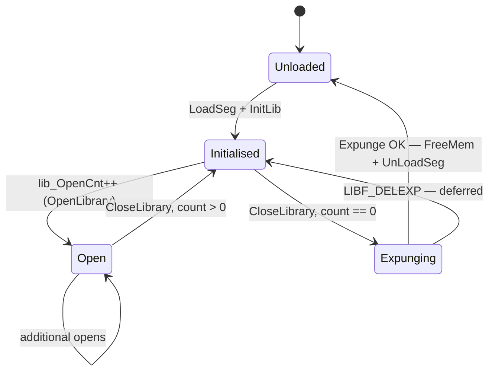

[← Home](../README.md) · [Linking & Libraries](README.md)

# Shared Library Runtime Mechanics

## Overview

AmigaOS shared libraries are **resident in memory** — once opened, the same code is shared by all tasks. The OS tracks open counts, handles version negotiation, and defers unloading until all users have closed the library.

---

## Library Discovery: `OpenLibrary()`

```c
struct Library *OpenLibrary(CONST_STRPTR libName, ULONG version);
```

`exec.library` searches for the library in this order:

1. `exec.library` LibList (already-open libraries in RAM)
2. Resident module list (ROM-resident: exec, graphics, etc.)
3. DOS path search — `LIBS:` assign — scan for `libName`
4. If found on disk: `LoadSeg()` + `InitLib` → add to LibList
5. Increment `lib_OpenCnt`
6. Call library's `Open()` vector
7. Return library base pointer (NULL on failure or version mismatch)

### Version Checking

```c
DOSBase = (struct DosLibrary *)OpenLibrary("dos.library", 36);
if (!DOSBase) { /* OS older than 2.0 — handle gracefully */ }
```

The `version` argument is the **minimum** acceptable `lib_Version`. Version 0 accepts any.

| Library | Version | OS |
|---|---|---|
| `exec.library` | 33 | OS 1.2 |
| `exec.library` | 36 | OS 2.0 |
| `exec.library` | 39 | OS 3.0 |
| `exec.library` | 40 | OS 3.1 |
| `exec.library` | 44 | OS 3.2 |

---

## Library Base Structure

```c
/* exec/libraries.h */
struct Library {
    struct Node lib_Node;     /* ln_Type = NT_LIBRARY */
    UBYTE       lib_Flags;    /* LIBF_SUMUSED, LIBF_DELEXP */
    UBYTE       lib_Pad;
    UWORD       lib_NegSize;  /* bytes of JMP table preceding base */
    UWORD       lib_PosSize;  /* sizeof(Library) + private fields */
    UWORD       lib_Version;
    UWORD       lib_Revision;
    APTR        lib_IdString; /* "dos.library 40.1 (16.7.93)" */
    ULONG       lib_Sum;      /* JMP table checksum */
    UWORD       lib_OpenCnt;  /* reference count */
};
```

The pointer returned by `OpenLibrary` points to this structure. The JMP table is **below** the base at negative offsets.

---

## Standard Library Vectors

| Offset | Function | Description |
|---|---|---|
| −6 | `Open` | Increment open count, return base |
| −12 | `Close` | Decrement count, optionally expunge |
| −18 | `Expunge` | Free library if open count == 0 |
| −24 | `Reserved` | Always NULL |
| −30 and below | Library-specific | Per `.fd` file |

---

## Open Count and Expunge Deferral

```c
/* exec.library CloseLibrary() pseudo-code */
lib->lib_OpenCnt--;
if (lib->lib_OpenCnt == 0) {
    BPTR seg = CallVector(lib, CLOSE_VEC);
    if (seg) UnLoadSeg(seg);
}
```

A library sets `LIBF_DELEXP` when it cannot unload (low memory). On the next close that drops the count to zero, expunge runs.

---

## Open/Close Lifecycle Diagram



---

## References

- NDK39: `exec/libraries.h`, `exec/nodes.h`
- ADCD 2.1 Autodocs: `OpenLibrary`, `CloseLibrary`, `MakeLibrary`
- *Amiga ROM Kernel Reference Manual: Libraries* — library creation chapter
- http://amigadev.elowar.com/read/ADCD_2.1/Libraries_Manual_guide/node0124.html
