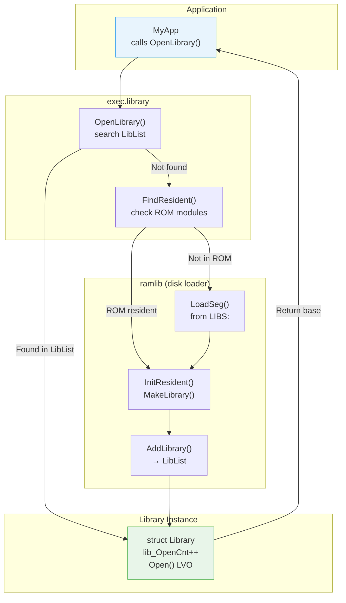
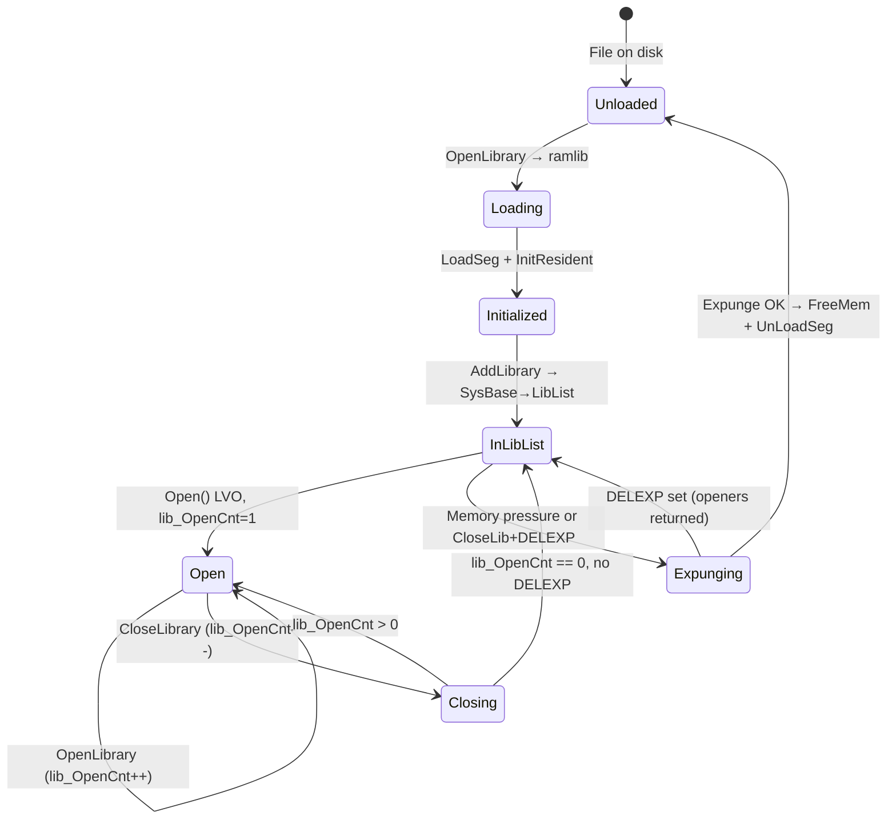

[← Home](../README.md) · [Linking & Libraries](README.md)

# Shared Library Runtime — OpenLibrary, ramlib, Version Negotiation, Expunge

## Overview

AmigaOS shared libraries are **resident in memory** — once opened, the same code and JMP table are shared by all tasks. The OS tracks open counts, handles version negotiation, can load libraries from disk on demand, and defers unloading until all users have closed the library. This document covers every aspect of the runtime lifecycle.

---

## Architecture



---

## OpenLibrary() — Complete Path

```c
struct Library *OpenLibrary(CONST_STRPTR libName, ULONG version);
/* A1 = libName, D0 = version */
/* Returns: D0 = library base pointer, or NULL on failure */
```

### Step-by-Step Resolution

```c
/* exec.library OpenLibrary() internals: */

struct Library *OpenLibrary(CONST_STRPTR name, ULONG minVersion)
{
    struct Library *lib;

    /* Step 1: Search already-loaded libraries */
    Forbid();
    lib = (struct Library *)FindName(&SysBase->LibList, name);
    Permit();

    if (lib)
    {
        /* Found — check version */
        if (lib->lib_Version >= minVersion || minVersion == 0)
        {
            /* Step 2: Call library's Open() vector */
            lib = (struct Library *)
                AROS_LVO_CALL0(struct Library *, lib, 1);
            /* lib_OpenCnt++ happens inside the Open() function */
            return lib;
        }
        /* Version too old — try loading a newer one from disk */
    }

    /* Step 3: Check ROM resident modules */
    struct Resident *res = FindResident(name);
    if (res && (res->rt_Version >= minVersion || minVersion == 0))
    {
        /* Initialize from ROM — like during boot */
        InitResident(res, 0);
        /* Now it should be in LibList */
        lib = (struct Library *)FindName(&SysBase->LibList, name);
        if (lib)
        {
            lib = (struct Library *)AROS_LVO_CALL0(struct Library *, lib, 1);
            return lib;
        }
    }

    /* Step 4: Ask ramlib to load from disk */
    /* Send a message to the ramlib process via its port "LIBS:" */
    lib = RamlibLoadLibrary(name);
    if (lib && (lib->lib_Version >= minVersion || minVersion == 0))
    {
        lib = (struct Library *)AROS_LVO_CALL0(struct Library *, lib, 1);
        return lib;
    }

    return NULL;  /* Not found or version mismatch */
}
```

### What the Library's Open() Does

```c
/* Typical Open() implementation: */
struct Library * __saveds MyOpen(void)
{
    struct MyLibBase *base = (struct MyLibBase *)REG_A6;

    base->lib.lib_OpenCnt++;
    base->lib.lib_Flags &= ~LIBF_DELEXP;  /* Cancel pending expunge */

    return (struct Library *)base;
}
```

---

## ramlib — The Disk Library Loader

`ramlib` is a hidden system process created during boot. It loads libraries and devices from disk when they're not already in memory.

### How ramlib Works

```c
/* ramlib is a Process created by strap during boot */
/* It listens on a MsgPort for load requests */

void RamlibMain(void)
{
    struct MsgPort *port = CreateMsgPort();
    port->mp_Node.ln_Name = "ramlib.port";

    for (;;)
    {
        WaitPort(port);
        struct RamlibMsg *msg = (struct RamlibMsg *)GetMsg(port);

        switch (msg->rm_Type)
        {
            case RAMLIB_LOAD_LIB:
                LoadLibraryFromDisk(msg->rm_Name);
                break;
            case RAMLIB_LOAD_DEV:
                LoadDeviceFromDisk(msg->rm_Name);
                break;
        }

        ReplyMsg((struct Message *)msg);
    }
}
```

### Disk Search Path

ramlib searches for libraries in this order:

| Priority | Path | Source |
|---|---|---|
| 1 | `LIBS:` | Standard assign — usually `SYS:Libs` |
| 2 | `LIBS:` on each mounted volume | If `LIBS:` is a multi-assign |
| 3 | Current directory of the requesting process | Fallback |

```
; Standard LIBS: assign (set during Startup-Sequence):
Assign LIBS: SYS:Libs
; Can add additional paths:
Assign LIBS: WORK:MyLibs ADD
```

### Loading Sequence

```c
void LoadLibraryFromDisk(CONST_STRPTR name)
{
    /* 1. Construct path: "LIBS:mylib.library" */
    char path[256];
    sprintf(path, "LIBS:%s", name);

    /* 2. LoadSeg the library executable */
    BPTR segList = LoadSeg(path);
    if (!segList) return;

    /* 3. Find RomTag in loaded segments */
    struct Resident *res = FindResidentInSegList(segList);
    if (!res) { UnLoadSeg(segList); return; }

    /* 4. InitResident — calls MakeLibrary + LibInit */
    InitResident(res, segList);

    /* Library is now in SysBase->LibList */
    /* The segList is stored in the library's private data */
    /* for Expunge to call UnLoadSeg later */
}
```

---

## Version Negotiation

### Version Numbers

```c
struct Library {
    /* ... */
    UWORD lib_Version;    /* Major version — matches OS release */
    UWORD lib_Revision;   /* Minor revision — bug fixes */
    /* ... */
};
```

| Library | Version | OS Release |
|---|---|---|
| exec.library | 33 | OS 1.2 |
| exec.library | 34 | OS 1.3 |
| exec.library | 36 | OS 2.0 |
| exec.library | 37 | OS 2.04 |
| exec.library | 39 | OS 3.0 |
| exec.library | 40 | OS 3.1 |
| exec.library | 44 | OS 3.1.4 |
| exec.library | 47 | OS 3.2 |

### Version Checking Patterns

```c
/* Require minimum version: */
DOSBase = (struct DosLibrary *)OpenLibrary("dos.library", 36);
if (!DOSBase)
{
    /* OS 2.0 or later not available — degrade gracefully */
    FallbackToOldAPI();
}

/* Accept any version: */
GfxBase = (struct GfxBase *)OpenLibrary("graphics.library", 0);
/* version 0 = accept anything */

/* Check for specific features at runtime: */
if (GfxBase->LibNode.lib_Version >= 39)
{
    /* OS 3.0+ features available: WriteChunkyPixels, etc. */
    UseChunkyAPI();
}
else
{
    /* Fall back to planar blitting */
    UsePlanarAPI();
}
```

### Multiple Versions on Disk

If both ROM and disk versions exist:
- ROM version is initialized during boot
- If a disk version has a **higher** version number, it can replace the ROM version
- `SetPatch` loads patched modules from disk to fix ROM bugs

```
; SetPatch loads replacement modules:
C:SetPatch QUIET
; Internally does:
;   1. LoadSeg("LIBS:exec.library")  — disk version
;   2. If newer than ROM version: patch the JMP table
;   3. ROM code remains but JMP slots point to disk code
```

---

## CloseLibrary() and Expunge

### CloseLibrary Path

```c
void CloseLibrary(struct Library *lib);
/* A1 = library base */

/* Internally: */
void CloseLibrary(struct Library *lib)
{
    if (!lib) return;

    /* Call library's Close() vector (LVO -12) */
    BPTR segList = AROS_LVO_CALL0(BPTR, lib, 2);

    /* If Close() returned a segment list, unload it */
    if (segList)
        UnLoadSeg(segList);
}
```

### The Library's Close() Implementation

```c
BPTR __saveds MyClose(void)
{
    struct MyLibBase *base = (struct MyLibBase *)REG_A6;

    base->lib.lib_OpenCnt--;

    if (base->lib.lib_OpenCnt == 0)
    {
        if (base->lib.lib_Flags & LIBF_DELEXP)
        {
            /* Delayed expunge was requested — do it now */
            return MyExpunge();
        }
    }

    return 0;  /* Don't unload yet */
}
```

### Expunge Mechanics

```c
BPTR __saveds MyExpunge(void)
{
    struct MyLibBase *base = (struct MyLibBase *)REG_A6;

    /* Can't expunge if still in use */
    if (base->lib.lib_OpenCnt > 0)
    {
        base->lib.lib_Flags |= LIBF_DELEXP;
        return 0;  /* Set flag for deferred expunge */
    }

    /* 1. Remove from system library list */
    Remove(&base->lib.lib_Node);

    /* 2. Save segment list before freeing memory */
    BPTR segList = base->segList;

    /* 3. Free the library memory (JMP table + data) */
    ULONG negSize = base->lib.lib_NegSize;
    ULONG posSize = base->lib.lib_PosSize;
    FreeMem((UBYTE *)base - negSize, negSize + posSize);

    /* 4. Return segment list — caller will UnLoadSeg() */
    return segList;
}
```

### When Does Expunge Happen?

| Trigger | Mechanism |
|---|---|
| Last `CloseLibrary()` call | If `LIBF_DELEXP` is set, expunge runs immediately |
| Memory-low condition | exec calls `Expunge()` on all libraries to free RAM |
| `AvailMem()` returns low | exec tries to reclaim memory from idle libraries |
| `RemLibrary()` | Force-removes library (dangerous — crashes if openers exist) |

### Memory-Low Expunge Sweep

```c
/* exec's memory reclamation when AllocMem fails: */
void TryFreeMemory(void)
{
    /* Walk LibList, try to expunge idle libraries */
    struct Library *lib;
    Forbid();
    for (lib = (struct Library *)SysBase->LibList.lh_Head;
         lib->lib_Node.ln_Succ;
         lib = (struct Library *)lib->lib_Node.ln_Succ)
    {
        if (lib->lib_OpenCnt == 0)
        {
            /* Try expunge — library frees its own memory */
            BPTR seg = CallExpunge(lib);
            if (seg) UnLoadSeg(seg);
        }
    }
    Permit();
}
```

---

## Open/Close Lifecycle



---

## Common Pitfalls

| Pitfall | Consequence | Prevention |
|---|---|---|
| Not checking `OpenLibrary()` return | NULL dereference → Guru | Always check for NULL |
| Mismatched `Open`/`Close` counts | Memory leak — library never expunges | Match every `OpenLibrary` with `CloseLibrary` |
| Using library after `CloseLibrary` | JMP table may point to freed memory | NULL the base pointer after close |
| Calling `OpenLibrary` from interrupt | Deadlock — ramlib uses DOS (which waits) | Only open libraries from task context |
| Not replying WBStartup message | Workbench process hangs | Always `Forbid(); ReplyMsg()` on exit |
| `RemLibrary()` while openers exist | Crash — openers call freed JMP table | Only use on libraries you own with refcount 0 |

---

## References

- NDK39: `exec/libraries.h`, `exec/execbase.h`
- ADCD 2.1 Autodocs: `OpenLibrary`, `CloseLibrary`, `MakeLibrary`, `RemLibrary`
- *Amiga ROM Kernel Reference Manual: Libraries* — library creation chapter
- See also: [Library Structure](library_structure.md) — JMP table and MakeLibrary internals
- See also: [SetFunction](setfunction.md) — runtime patching
- See also: [LVO Table](lvo_table.md) — complete offset tables
