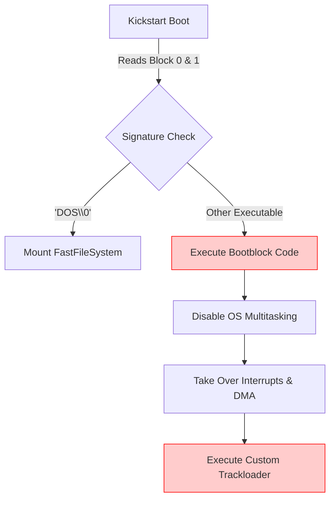
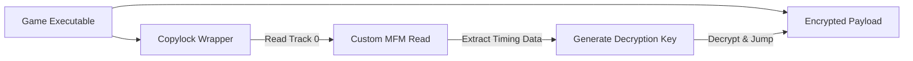

[← Home](../README.md) · [Reverse Engineering](README.md)

# Bypassing Custom Loaders and DRM Analysis

In the classic Amiga era, the vast majority of commercial games **did not use AmigaOS or `dos.library`**. Instead, they booted directly from the floppy disk's bootblock, took full control of the hardware, and used custom MFM (Modified Frequency Modulation) routines to load data directly from the floppy drive (`trackdisk.device` or direct hardware banging).

This technique, known as a **Trackloader**, allowed for faster loading, non-standard disk formats (holding >880KB), and robust copy protection (DRM). For a reverse engineer, analyzing an Amiga game almost always starts with defeating the trackloader and its associated DRM.

---

## 1. The Boot Sequence & Taking Control

When an Amiga boots from a floppy, the Kickstart ROM reads the first two sectors (1024 bytes) into memory. If the first four bytes are `DOS\0`, it treats it as a standard AmigaDOS disk. If the bootblock is executable, the ROM jumps to it.



### 1.1 The "Hardware Takeover" Pattern

Commercial games typically execute a standard sequence to disable AmigaOS and ensure uninterrupted hardware access:

```assembly
; Standard Hardware Takeover (Often found in Bootblocks)
move.w  #$7FFF, $dff09a      ; INTENA - Disable all interrupts
move.w  #$7FFF, $dff096      ; DMACON - Disable all DMA (sprites, copper, bitplane)
move.l  $4.w, a6             ; Get ExecBase
jsr     -132(a6)             ; Forbid() - Disable multitasking
jsr     -120(a6)             ; Disable() - Disable OS interrupts

; Setup custom VBlank and hardware
move.l  #my_copperlist, $dff080
move.w  #$8020, $dff096      ; Enable Sprite DMA
move.w  #$c020, $dff09a      ; Enable VBlank Interrupt
```

> [!CAUTION]
> Once the bootblock calls `Forbid()` and writes to `INTENA`, standard Amiga debuggers (like MonAM or HRTmon running under the OS) will lose control unless they are Action Replay hardware cartridges or running in emulation (WinUAE/FS-UAE).

---

## 2. Trackloader Architecture

A trackloader replaces `dos.library` with custom code that reads raw MFM data from the floppy controller (Paula).

### 2.1 MFM and Sync Words

Floppy disks store data as magnetic flux transitions. To prevent long sequences of zeros (which cause the read head to lose synchronization), data is encoded using MFM. 

To find the start of a sector, the hardware looks for a specific 16-bit **Sync Word**. The standard Amiga sync word is `$4489`.

### 2.2 Finding the Trackloader in IDA/Ghidra

When reverse engineering a game, you must locate the trackloader to extract the game's actual files. Look for these specific hardware register accesses:

| Address | Register | What it means in a Trackloader |
|---|---|---|
| `$DFF07E` | `DSKSYNC` | Setting the Sync Word (usually `$4489`) |
| `$DFF020` | `DSKPTH` | Disk DMA Pointer (where to write the read MFM data) |
| `$DFF024` | `DSKLEN` | Disk DMA Length (how many words to read, and start reading) |
| `$BFD100` | `CIAB-PRB` | CIA-B Port B: Used for floppy motor control, head stepping, and side selection. |

### 2.3 Advanced Trackloader Disk Formats

To prevent copying by standard AmigaDOS tools like X-Copy, developers altered the physical geometry and structure of the tracks on the floppy disk:

1. **Long Tracks**: A standard AmigaDOS track holds 11 sectors. Trackloaders would format tracks with 12 sectors by slightly reducing the physical gaps between sectors, fitting more data (and breaking standard sector-by-sector copying algorithms).
2. **Sync-less Formats**: Bypassing the `$4489` sync word entirely. The trackloader uses raw timing loops (via CIA timers) or completely custom bit-patterns to find the start of the data stream, preventing hardware from locking onto the track.
3. **Fuzzy/Weak Bits**: Mastering original disks with weak magnetic flux. The hardware reads the bit randomly as a 0 or a 1. When a standard drive copies the disk, it writes a "strong" 0 or 1. The DRM reads the sector multiple times; if the bit doesn't flip, it knows it's a pirated copy.

### 2.4 The Decodification Loop

After reading raw MFM data into memory, the trackloader must decode it back into binary data. This almost always involves interleaved loops using the `eor` (exclusive OR) instruction or bit-shifting to separate clock bits from data bits.

```assembly
; Typical MFM decoding loop footprint
.decode_loop:
    move.l  (a0)+, d0     ; Read MFM odd bits
    move.l  (a1)+, d1     ; Read MFM even bits
    and.l   d2, d0        ; Mask clock bits ($55555555)
    and.l   d2, d1
    lsl.l   #1, d0        ; Shift odd bits
    or.l    d1, d0        ; Combine into decoded byte
    move.l  d0, (a2)+     ; Write decoded data
    dbf     d7, .decode_loop
```

> [!TIP]
> If you find a loop utilizing the constant `$55555555` extensively near disk hardware access, you have found the MFM decoder.

---

## 3. DRM: The Rob Northen Copylock

The most famous Amiga copy protection is the **Rob Northen Copylock** (RN Copylock). It was designed to prevent cracking by encrypting the game executable and tying the decryption key to a physical flaw deliberately mastered onto track 0 of the original floppy disk.

### 3.1 Copylock Architecture



### 3.2 Trace Vector Abuse

Rob Northen's genius was preventing crackers from stepping through the decryption code by abusing the Motorola 68000 **Trace Exception** (Vector $24). By pointing the Trace vector to its own decryption routine and setting the CPU Trace bit, the code decrypts itself via hardware interrupts.

> **Deep Dive**: For a complete analysis of Copylock's trace exception abuse, CIA timer checks, and other anti-cracking techniques, see the dedicated [Anti-Debugging & Arms Race](anti_debugging.md) article.

---

## 4. Modern Analogies

| Amiga Paradigm | Modern Equivalent | Explanation |
|---|---|---|
| **Trackloader** | Custom Bootloader / Hypervisor | Bypassing the standard OS kernel to control hardware I/O directly for performance or DRM purposes. |
| **Rob Northen Trace Abuse** | Denuvo Anti-Tamper / VMProtect | Using CPU exceptions, hardware-specific timing, and virtualization to break standard debuggers (x64 SEH/Vectored Exception Handling abuse). |
| **MFM `$55555555` Decoding** | Base64 / AES Decryption loops | Transforming an obfuscated or wire-encoded stream back into executable binary code in memory before jumping to it. |

---

## 5. Reverse Engineering Best Practices

1. **Memory Dumps over Static Analysis**: Because most commercial games are packed (Imploder, PowerPacker) and encrypted (Copylock), static analysis of the binary on disk is often useless. Use WinUAE/FS-UAE's built-in debugger to let the game boot, decrypt itself into RAM, and then take a memory dump to analyze in IDA Pro.
2. **Identify `$DFF024` (DSKLEN)**: Set write breakpoints on `$DFF024` in your emulator. This is the hardware trigger to start a disk DMA read. When it hits, look at the stack to find the trackloader code.
3. **Beware of `$4.w` (ExecBase)**: If a game reads `$4.w` and immediately calls `Forbid()` (offset `-132`), it is preparing to kill the OS. Put your breakpoints *before* this happens if you are relying on an OS-level debugger.

---

## 6. FAQ

**Q: Why did games use Trackloaders instead of standard AmigaDOS files?**
A: AmigaDOS (OFS) has significant overhead. It requires memory for file buffers, wastes bytes on directory structures, and the floppy motor turns off between file reads. A custom trackloader keeps the motor spinning and reads entire raw cylinders into RAM sequentially, reducing loading times from minutes to seconds.

**Q: How do WHDLoad patches work with Trackloaders?**
A: WHDLoad is an OS-replacement system that patches games to run from hard drives. A WHDLoad "Slave" (the patch file) replaces the game's custom trackloader (which expects floppy hardware) with calls to WHDLoad's `resload_DiskLoad` API, emulating the floppy load via standard hard drive I/O. 

**Q: If Copylock relies on a physical disk flaw, how do cracked ADFs work?**
A: Cracked disk images (ADFs) contain the already-decrypted game executable, with the Copylock routine completely bypassed or stubbed out (`NOP` instructions). The physical flaw cannot be represented in a standard ADF, which is why original, uncracked games must be preserved in IPF (Interchangeable Preservation Format) instead of ADF.
