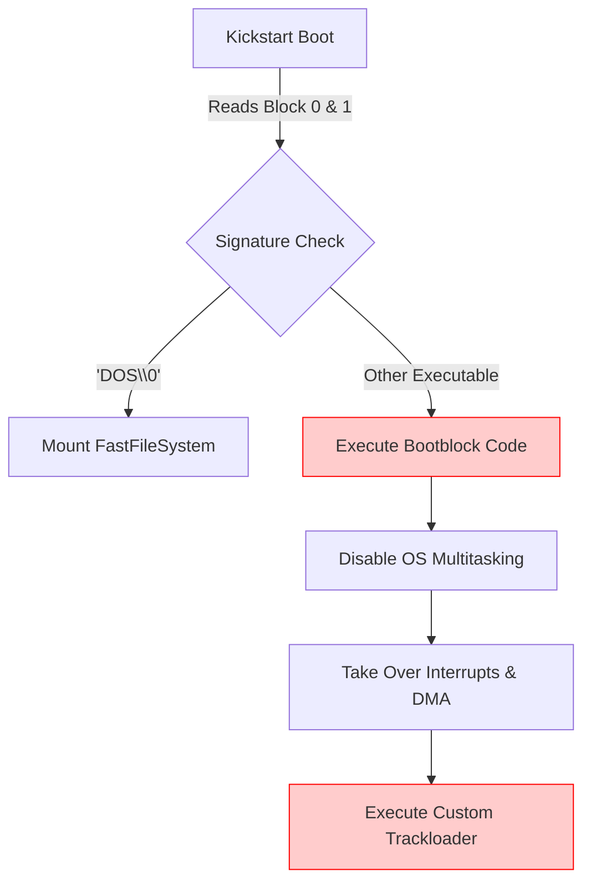
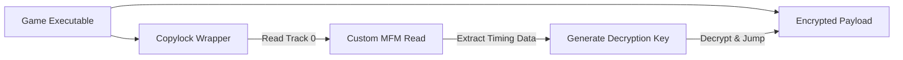
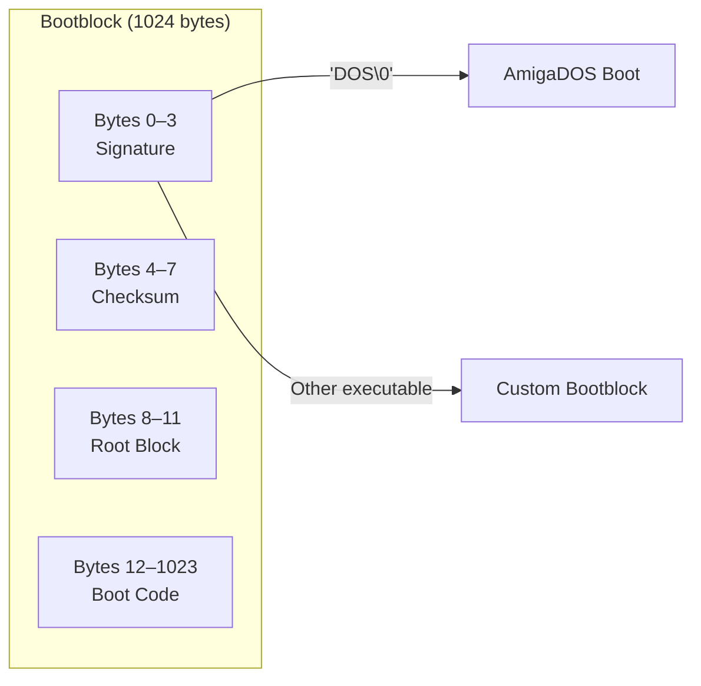
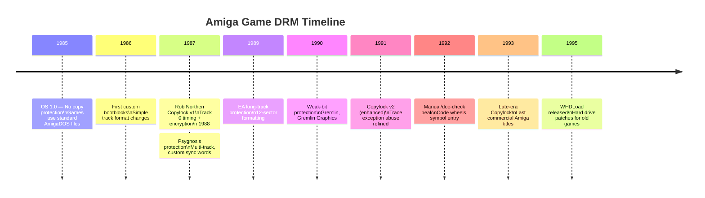

[← Home](../README.md) · [Reverse Engineering](README.md)

# Bypassing Custom Loaders and DRM Analysis

In the classic Amiga era, the vast majority of commercial games **did not use AmigaOS or `dos.library`**. Instead, they booted directly from the floppy disk's bootblock, took full control of the hardware, and used custom MFM (Modified Frequency Modulation) routines to load data directly from the floppy drive (`trackdisk.device` or direct hardware banging).

This technique, known as a **Trackloader**, allowed for faster loading, non-standard disk formats (holding >880KB), and robust copy protection (DRM). For a reverse engineer, analyzing an Amiga game almost always starts with defeating the trackloader and its associated DRM.

---

## 1. The Boot Sequence & Taking Control

When an Amiga boots from a floppy, the Kickstart ROM reads the first two sectors (1024 bytes) into memory. If the first four bytes are `DOS\0`, it treats it as a standard AmigaDOS disk. If the bootblock is executable, the ROM jumps to it.



### 1.1 The "Hardware Takeover" Pattern

Commercial games typically execute a standard sequence to disable AmigaOS and ensure uninterrupted hardware access:

```assembly
; Standard Hardware Takeover (Often found in Bootblocks)
move.w  #$7FFF, $dff09a      ; INTENA - Disable all interrupts
move.w  #$7FFF, $dff096      ; DMACON - Disable all DMA (sprites, copper, bitplane)
move.l  $4.w, a6             ; Get ExecBase
jsr     -132(a6)             ; Forbid() - Disable multitasking
jsr     -120(a6)             ; Disable() - Disable OS interrupts

; Setup custom VBlank and hardware
move.l  #my_copperlist, $dff080
move.w  #$8020, $dff096      ; Enable Sprite DMA
move.w  #$c020, $dff09a      ; Enable VBlank Interrupt
```

> [!CAUTION]
> Once the bootblock calls `Forbid()` and writes to `INTENA`, standard Amiga debuggers (like MonAM or HRTmon running under the OS) will lose control unless they are Action Replay hardware cartridges or running in emulation (WinUAE/FS-UAE).

---

## 2. Trackloader Architecture

A trackloader replaces `dos.library` with custom code that reads raw MFM data from the floppy controller (Paula).

### 2.1 MFM and Sync Words

Floppy disks store data as magnetic flux transitions. To prevent long sequences of zeros (which cause the read head to lose synchronization), data is encoded using MFM. 

To find the start of a sector, the hardware looks for a specific 16-bit **Sync Word**. The standard Amiga sync word is `$4489`.

### 2.2 Finding the Trackloader in IDA/Ghidra

When reverse engineering a game, you must locate the trackloader to extract the game's actual files. Look for these specific hardware register accesses:

| Address | Register | What it means in a Trackloader |
|---|---|---|
| `$DFF07E` | `DSKSYNC` | Setting the Sync Word (usually `$4489`) |
| `$DFF020` | `DSKPTH` | Disk DMA Pointer (where to write the read MFM data) |
| `$DFF024` | `DSKLEN` | Disk DMA Length (how many words to read, and start reading) |
| `$BFD100` | `CIAB-PRB` | CIA-B Port B: Used for floppy motor control, head stepping, and side selection. |

### 2.3 Advanced Trackloader Disk Formats

To prevent copying by standard AmigaDOS tools like X-Copy, developers altered the physical geometry and structure of the tracks on the floppy disk:

1. **Long Tracks**: A standard AmigaDOS track holds 11 sectors. Trackloaders would format tracks with 12 sectors by slightly reducing the physical gaps between sectors, fitting more data (and breaking standard sector-by-sector copying algorithms).
2. **Sync-less Formats**: Bypassing the `$4489` sync word entirely. The trackloader uses raw timing loops (via CIA timers) or completely custom bit-patterns to find the start of the data stream, preventing hardware from locking onto the track.
3. **Fuzzy/Weak Bits**: Mastering original disks with weak magnetic flux. The hardware reads the bit randomly as a 0 or a 1. When a standard drive copies the disk, it writes a "strong" 0 or 1. The DRM reads the sector multiple times; if the bit doesn't flip, it knows it's a pirated copy.

### 2.4 The Decodification Loop

After reading raw MFM data into memory, the trackloader must decode it back into binary data. This almost always involves interleaved loops using the `eor` (exclusive OR) instruction or bit-shifting to separate clock bits from data bits.

```assembly
; Typical MFM decoding loop footprint
.decode_loop:
    move.l  (a0)+, d0     ; Read MFM odd bits
    move.l  (a1)+, d1     ; Read MFM even bits
    and.l   d2, d0        ; Mask clock bits ($55555555)
    and.l   d2, d1
    lsl.l   #1, d0        ; Shift odd bits
    or.l    d1, d0        ; Combine into decoded byte
    move.l  d0, (a2)+     ; Write decoded data
    dbf     d7, .decode_loop
```

> [!TIP]
> If you find a loop utilizing the constant `$55555555` extensively near disk hardware access, you have found the MFM decoder.

---

## 3. DRM: The Rob Northen Copylock

The most famous Amiga copy protection is the **Rob Northen Copylock** (RN Copylock). It was designed to prevent cracking by encrypting the game executable and tying the decryption key to a physical flaw deliberately mastered onto track 0 of the original floppy disk.

### 3.1 Copylock Architecture



### 3.2 Trace Vector Abuse

Rob Northen's genius was preventing crackers from stepping through the decryption code by abusing the Motorola 68000 **Trace Exception** (Vector $24). By pointing the Trace vector to its own decryption routine and setting the CPU Trace bit, the code decrypts itself via hardware interrupts.

> **Deep Dive**: For a complete analysis of Copylock's trace exception abuse, CIA timer checks, and other anti-cracking techniques, see the dedicated [Anti-Debugging & Arms Race](anti_debugging.md) article.

---

## 4. Bootblock Structure

The bootblock occupies the first two sectors (blocks 0 and 1, 1024 bytes total) of an Amiga floppy disk. Kickstart reads it via the ROM's built-in trackloader and decides what to do:



| Offset | Size | Field | Description |
|--------|------|-------|-------------|
| 0 | 4 bytes | `Signature` | `DOS\0` = standard AmigaDOS; any other value = custom bootblock |
| 4 | 4 bytes | `Checksum` | Bootblock checksum (must validate for Kickstart to execute) |
| 8 | 4 bytes | `RootBlock` | Block number of the root directory (AmigaDOS only) |
| 12 | 1012 bytes | `BootCode` | 68000 executable code — the trackloader or game stub |

### Checksum Algorithm

Kickstart validates the bootblock checksum before executing. The algorithm is a simple 32-bit additive checksum with carry:

```c
/* Bootblock checksum calculation */
ULONG CalcBootChecksum(ULONG *block)
{
    ULONG sum = 0;
    for (int i = 0; i < 256; i++)  /* 1024 bytes / 4 = 256 longs */
    {
        ULONG val = block[i];
        if (val > ~sum)
            sum++;              /* carry */
        sum += val;
    }
    return ~sum;
}
```

> [!NOTE]
> For custom bootblocks, the checksum must be correct or Kickstart ignores it. Crackers would modify the boot code and recalculate the checksum.

---

## 5. DRM Systems Catalog

### 5.1 Rob Northen Copylock (1987–1993)

The most prevalent Amiga copy protection — used by **~70% of commercial games**. Over 1,500 titles shipped with Copylock.

| Aspect | Detail |
|--------|--------|
| **Creator** | Rob Northen Computing (UK) |
| **Mechanism** | Timing-based key on track 0 + encrypted executable + trace exception abuse |
| **Tracks affected** | Track 0 only (rarely track 79) |
| **Defeated by** | Reading timing data, computing decryption key, patching checks |
| **Preservation format** | IPF (CAPS) — ADF cannot represent the timing data |


### 5.2 Psygnosis Protection

Used exclusively by Psygnosis (Lemmings, Shadow of the Beast, Agony):

- **Multiple protection tracks** spread across the disk (not just track 0)
- **Non-standard sector sizes** — some tracks use 2 KB sectors instead of 512 bytes
- **Custom sync words** per track — each track has a different `$xxxy` sync
- Often combined with a **code wheel** or **manual lookup** for additional verification

### 5.3 EA (Electronic Arts) Protection

EA used several variants across their titles:

- **Long tracks** formatted to hold 12 sectors instead of 11 — standard copy tools can't reproduce
- **Bad sectors** intentionally written — the game checks that specific sectors return read errors
- **Modified header fields** — sector headers contain checksums that don't match their data

### 5.4 Gremlin Protection

Used by Gremlin Graphics (Zool, Fantasy World Dizzy):

- **Weak bits** on a specific track — the protection reads the same sector multiple times and checks that the bits flip
- If the bits are stable (copied disk), the game exits with "Software failure"

### 5.5 Software Studios / Superior Software

Common on BBC Micro ports and UK budget titles:

- **Non-standard gap lengths** between sectors
- **Sector numbering gaps** — sectors numbered 0,1,2,5,6,7 (missing 3,4)
- The game reads sector 3 by index and checks it fails

### 5.6 Manual / Doc Check

Not a disk-based protection — a "soft" DRM approach:

| Type | Example | Implementation |
|------|---------|---------------|
| **Code wheel** | Secret of Monkey Island, Indiana Jones | Rotate physical wheel, enter visible word |
| **Manual lookup** | Elite, Frontier | "Enter word 3 from paragraph 5 on page 42" |
| **Symbol entry** | Dungeon Master | Enter sequence of symbols from the manual |

These were the most annoying for users and the easiest to crack — a simple byte patch removes the check.

---

## 6. Named Antipatterns

### "The Checksum Skip" — Patching Without Verification

```c
/* BAD: When writing a custom bootblock for a cracker tool or
   WHDLoad slave, forgetting to recalculate the checksum.
   Kickstart refuses to execute the bootblock — silent failure. */
UBYTE bootblock[1024] = { /* custom code */ };
/* forgot to update checksum at offset 4-7 */
WriteBootblock(disk, bootblock);  /* won't boot! */
```

```c
/* CORRECT: Always calculate and store the checksum */
ULONG *bb = (ULONG *)bootblock;
bb[1] = 0;  /* clear old checksum before calculating */
bb[1] = CalcBootChecksum(bb);
```

### "The Motor Assumption" — Assuming Drive is Spinning

```assembly
; BAD: Many custom trackloaders assume the floppy motor is already
; spinning when they start reading. On real hardware, the motor takes
; ~500ms to reach full speed. If you jump straight to disk DMA,
; the first reads are garbage.
    move.l  #buffer, $dff020    ; DSKPTH - DMA pointer
    move.w  #$8000|SECTOR_LEN, $dff024  ; DSKLEN - start reading NOW
    ; Motor may not be up to speed — data corruption!
```

```assembly
; CORRECT: Wait for disk ready (or use a delay)
    bsr     WaitForMotor        ; spin up, wait ~500ms
    move.l  #buffer, $dff020
    move.w  #$8000|SECTOR_LEN, $dff024
    bsr     WaitForDMAComplete
```

### "The Single-Track Reliance" — All Protection on One Track

Copylock puts all protection on track 0. This is efficient (one check) but fragile:
- A single bad sector on track 0 destroys the original disk permanently
- Crackers know exactly where to look — they breakpoint on `$DFF07E` (DSKSYNC) reads
- Once the timing key is extracted, all games using Copylock fall at once

Modern DRM learned this lesson: spread verification across multiple components (Denuvo checks CPU-specific timing + OS entropy + disk serial).

### "The Plaintext Key" — Storing Decryption Keys in RAM

```assembly
; BAD: After Copylock decrypts the game, the decryption key remains
; in a CPU register or memory location. If a cracker dumps RAM after
; decryption, the key is exposed.
    bsr     GenerateKey         ; key in D0
    bsr     DecryptPayload      ; uses D0 as key
    ; D0 still contains the key! A memory dump reveals it.
```

Some Copylock variants zero the key register after use, but many don't — a common oversight that made cracking easier.

### "The Time-Bomb Check" — Fragile Timing Loops

```assembly
; BAD: Protection that relies on exact CIA timer values.
; This works on a stock A500 but fails on accelerated Amigas
; (68030/040/060) because the timing loop completes too fast.
    move.l  $bfe801, d0     ; Read CIA-A Timer A
    ; ... execute some code ...
    move.l  $bfe801, d1
    sub.l   d0, d1          ; check elapsed time
    cmp.l   #EXPECTED, d1   ; exact cycle count expected
    bne.s   .protection_fail
```

This is why many original games crash on accelerated Amigas — the timing check is CPU-speed-dependent. WHDLoad patches often fix this by NOP-ing the check.

---

## 7. Practical Cookbook: Identifying a Trackloader

Step-by-step guide to locating and understanding a game's trackloader in an emulator:

### Step 1: Set Up the Debugger

```
; In WinUAE/FS-UAE debugger:
; 1. Enable debugger (WinUAE: Misc → Enable Debugger)
; 2. Boot the game from floppy image
```

### Step 2: Break on Disk DMA

```
; Set a write breakpoint on DSKLEN ($DFF024)
; This fires every time the game starts a disk read
w dff024 2

; When it breaks, examine:
; - DSKPTH ($DFF020): where is data being read to?
; - Stack trace: where is the read initiated from?
```

### Step 3: Find the MFM Decoder

```
; Search for the MFM decode constant $55555555
; In the debugger:
m 55555555

; Or in Ghidra/IDA, search for the constant:
; The decode loop will be near disk register accesses
```

### Step 4: Map the Load Sequence

```
; Each time DSKLEN is written, note:
; - Which track is being read (from CIA-B port B: $BFD100)
; - How many words are being read (DSKLEN value)
; - Where in RAM the data goes (DSKPTH)
; - What happens after the read (decode? decrypt? direct jump?)
```

### Step 5: Dump Decrypted Executable

```
; Let the game fully boot and decrypt itself
; Then take a full RAM dump:
; WinUAE: Misc → Save Memory Dump
; Or:  save ramdump.bin 0 80000   (first 512KB)

; Now you have the decrypted game binary for static analysis
```

---

## 8. Historical Context & Modern Analogies

### Evolution of Game DRM



### The Cracking Scene

The Amiga cracking scene was one of the most active in computing history:

| Group | Notable For | Active Period |
|-------|-------------|--------------|
| **Fairlight** | Fast Copylock defeats, trained versions | 1987–1994 |
| **Crystal** | Clean cracks, minimal patches | 1988–1995 |
| **Paradroid** | Technical documentation of protections | 1989–1993 |
| **Quarantine** | First to defeat Copylock v2 enhancements | 1990–1993 |
| **Skid Row** | High-quality intros, fast releases | 1990–1996 |
| **Delight** | Late-era Amiga protection removal | 1992–1997 |

> [!NOTE]
> The cracking scene is documented here for historical and educational purposes — understanding these techniques is essential for software preservation and reverse engineering.

### Modern Analogies

| Amiga Concept | Modern Equivalent | Notes |
|--------------|-------------------|-------|
| Custom bootblock | UEFI custom boot manager / U-boot payload | Bypassing standard OS boot |
| Trackloader (raw disk I/O) | Direct NVMe/SATA register access (DMA) | Bypassing OS filesystem for raw I/O |
| MFM encoding | 8b/10b / 64b/66b line coding (PCIe/SATA) | Clock recovery encoding |
| `$4489` sync word | K28.5 comma characters (8b/10b) | Framing / synchronization marker |
| Rob Northen Copylock | Denuvo Anti-Tamper | CPU-specific timing + encrypted code |
| Trace exception abuse | SEH chain abuse (anti-debug) / `RtlDecompressBuffer` hooking | Using CPU exceptions for code execution |
| Weak bits (fuzzy bits) | TPM-bound encryption keys | Tying execution to unique hardware |
| Manual/doc check | Online activation / always-online DRM | "Something you have" verification |
| WHDLoad slave | DOSBox config / ScummVM engine patch | Compatibility layer for old software |
| IPF preservation format | MAME CHD (Compressed Hunks of Data) | Preservation-grade disk images with timing |

---

## 9. Reverse Engineering Best Practices

1. **Memory Dumps over Static Analysis**: Because most commercial games are packed (Imploder, PowerPacker) and encrypted (Copylock), static analysis of the binary on disk is often useless. Use WinUAE/FS-UAE's built-in debugger to let the game boot, decrypt itself into RAM, and then take a memory dump to analyze in IDA Pro.
2. **Identify `$DFF024` (DSKLEN)**: Set write breakpoints on `$DFF024` in your emulator. This is the hardware trigger to start a disk DMA read. When it hits, look at the stack to find the trackloader code.
3. **Beware of `$4.w` (ExecBase)**: If a game reads `$4.w` and immediately calls `Forbid()` (offset `-132`), it is preparing to kill the OS. Put your breakpoints *before* this happens if you are relying on an OS-level debugger.
4. **Use IPF, not ADF, for originals**: Standard ADF format cannot represent non-standard track formats, weak bits, or timing data. Use the SPS/IPF format for preservation-grade images.
5. **Action Replay for live debugging**: Hardware cartridges like Action Replay III can freeze the machine at any point — even after the OS is disabled. invaluable for examining custom trackloader state.
6. **Compare cracked vs. original**: Loading both an original IPF and a cracked ADF into Ghidra and diffing the code makes the protection check obvious.
7. **Check for WhdLoad slaves first**: Before reverse-engineering a game's loader, check if a WHDLoad slave already exists — it may document the load addresses and file format.

---

## 10. FAQ

**Q: Why did games use Trackloaders instead of standard AmigaDOS files?**
A: AmigaDOS (OFS) has significant overhead. It requires memory for file buffers, wastes bytes on directory structures, and the floppy motor turns off between file reads. A custom trackloader keeps the motor spinning and reads entire raw cylinders into RAM sequentially, reducing loading times from minutes to seconds.

**Q: How do WHDLoad patches work with Trackloaders?**
A: WHDLoad is an OS-replacement system that patches games to run from hard drives. A WHDLoad "Slave" (the patch file) replaces the game's custom trackloader (which expects floppy hardware) with calls to WHDLoad's `resload_DiskLoad` API, emulating the floppy load via standard hard drive I/O.

**Q: If Copylock relies on a physical disk flaw, how do cracked ADFs work?**
A: Cracked disk images (ADFs) contain the already-decrypted game executable, with the Copylock routine completely bypassed or stubbed out (`NOP` instructions). The physical flaw cannot be represented in a standard ADF, which is why original, uncracked games must be preserved in IPF (Interchangeable Preservation Format) instead of ADF.

**Q: Can I write a custom bootblock to a standard Amiga floppy?**
A: Yes — any Amiga floppy drive can write the first two sectors (the bootblock) using standard `trackdisk.device` commands (`TD_WRITE` to block 0). However, writing non-standard track formats (long tracks, custom sync words) requires direct hardware access to Paula's disk DMA.

**Q: How does the CAPS/SPS preservation project work?**
A: The Classic Amiga Preservation Society (CAPS, now SPS — Software Preservation Society) uses modified floppy drives (or KryoFlux devices) to read the raw magnetic flux transitions, not just the decoded data. This captures timing information, weak bits, and non-standard formats that ADF cannot represent. The result is stored in IPF format.

**Q: Why do some games work on some Amiga models but not others?**
A: Trackloaders that use timing loops calibrated for the 68000 (7.09 MHz) fail on faster CPUs (68020+ at 14/25 MHz). The timing loop completes too quickly, and the protection check fails. This is separate from the game logic — the game itself may run fine, but the copy protection rejects the disk.

**Q: What's the difference between ADF, IPF, and DMS formats?**
A:
- **ADF** (Amiga Disk File): Standard 880 KB image of 80 tracks × 11 sectors × 512 bytes. Cannot represent copy protection.
- **IPF** (Interchangeable Preservation Format): Preservation-grade format that stores raw MFM data with timing, weak bits, and non-standard geometry.
- **DMS** (Disk Masher System): Compressed ADF — essentially a ZIP for Amiga disks. Popular for BBS distribution but cannot represent protection either.

---

## References

### NDK Headers & Hardware

- `hardware/cia.h` — CIA timer registers (`$BFE801`, `$BFD100`)
- `hardware/custom.h` — Disk DMA registers (`DSKSYNC`, `DSKPTH`, `DSKLEN`)
- `resources/disk.h` — `disk.resource` for trackdisk.device arbitration

### Preservation & Documentation

- **SPS (Software Preservation Society)**: https://www.softpres.org — IPF preservation format specification
- **KryoFlux**: http://www.kryoflux.com — USB floppy controller for flux-level reading
- **CAPS/SPS IPF Library**: https://www.softpres.org/games — preserved original disk images

### Cracking & Reverse Engineering

- AmigaOS ROM Kernel Manual: hardware register map, boot sequence
- **WHDLoad**: https://www.whdload.de — hard drive installers for Amiga games
- **WinUAE Debugger**: built-in MC68000 debugger with hardware register breakpoints

### Related Knowledge Base Articles

- [Anti-Debugging & Arms Race](anti_debugging.md) — Copylock trace abuse, anti-cracker techniques
- [Unpacking & Decrunching](unpacking_and_decrunching.md) — PowerPacker, Imploder, TDI crunchers
- [Trackdisk Device](../10_devices/trackdisk.md) — standard floppy device, MFM encoding, track layout
- [Methodology](methodology.md) — general reverse engineering workflow
- [Static Analysis](static/) — IDA Pro, Ghidra setup and usage
- [Dynamic Analysis](dynamic/) — WinUAE debugger, HRTmon, Action Replay
- [Patching Techniques](patching_techniques.md) — binary patching, WHDLoad slave development
