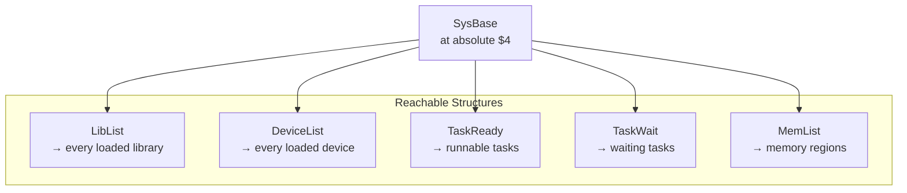

[← Home](../../README.md) · [Reverse Engineering](../README.md)

# Live Memory Probing

## Overview

The Amiga has no `Task Manager`, no `dtrace`, no `/proc`. But it has something better: **every critical OS data structure is reachable from a single pointer at absolute address `$4`.** From `SysBase`, you can walk the library list, enumerate every running task, map every memory region, and even modify kernel structures — all from a user-mode program. No debugger required.

Live memory probing means reading (and sometimes writing) exec structures directly from a running Amiga without a traditional debugger. This is how tools like Scout, SysInspector, and XOpa work. It's how you verify that a hook is installed, check if a library is loaded, or inspect task state during development. This article covers the key data structures, the traversal patterns, and the safety rules.



---

---

## SysBase: The Root of Everything

`SysBase` is always at absolute address `$4` (a pointer to the `ExecBase` structure):

```c
struct ExecBase *SysBase = *((struct ExecBase **)4);
printf("exec version: %d.%d\n",
       SysBase->LibNode.lib_Version,
       SysBase->LibNode.lib_Revision);
```

In assembly:
```asm
MOVEA.L  4.W, A6              ; A6 = SysBase (exec.library base)
MOVE.W   ($16,A6), D0         ; lib_Version
MOVE.W   ($18,A6), D1         ; lib_Revision
```

---

## Walking the Library List

```c
struct Node *n = SysBase->LibList.lh_Head;
while (n->ln_Succ != NULL) {
    struct Library *lib = (struct Library *)n;
    printf("%-30s v%d.%d  opens=%d\n",
           lib->lib_Node.ln_Name,
           lib->lib_Version, lib->lib_Revision,
           lib->lib_OpenCnt);
    n = n->ln_Succ;
}
```

This enumerates all currently loaded libraries. Useful for:
- Finding if a target library is loaded
- Reading `lib_OpenCnt` to detect if your hook is installed
- Checking `lib_Flags & LIBF_DELEXP` (expunge pending)

---

## Reading `lib_OpenCnt` Live

```c
/* Check if bsdsocket.library is loaded and its open count */
struct Library *base = FindName(&SysBase->LibList, "bsdsocket.library");
if (base) {
    printf("bsdsocket: OpenCnt=%d, Version=%d\n",
           base->lib_OpenCnt, base->lib_Version);
}
```

`FindName` scans `ln_Name` in a linked list — it is an exec function at LVO −276.

---

## Memory Region Map

`SysBase->MemList` lists all memory regions:

```c
struct MemHeader *mh = (struct MemHeader *)SysBase->MemList.lh_Head;
while (mh->mh_Node.ln_Succ) {
    printf("Region: %s  %08lx–%08lx  free=%ld\n",
           mh->mh_Node.ln_Name,
           (ULONG)mh->mh_Lower,
           (ULONG)mh->mh_Upper,
           mh->mh_Free);
    mh = (struct MemHeader *)mh->mh_Node.ln_Succ;
}
```

Output example:
```
Region: chip memory   $000000–$1FFFFF  free=524288
Region: fast memory   $200000–$9FFFFF  free=6291456
```

---

## Task List Inspection

```c
/* Running tasks: */
Forbid();
struct Task *t = (struct Task *)SysBase->TaskReady.lh_Head;
while (t->tc_Node.ln_Succ) {
    printf("Task: %-20s pri=%d state=%d\n",
           t->tc_Node.ln_Name,
           t->tc_Node.ln_Pri,
           t->tc_State);
    t = (struct Task *)t->tc_Node.ln_Succ;
}
Permit();
```

`Forbid()` / `Permit()` are mandatory — the task list must not change while walking it.

---

## Patching Memory Live (Surgical Writes)

For RE/patching: direct longword write to an OS structure:

```c
/* Example: force a library's version to 99 */
Forbid();
target_lib->lib_Version = 99;
Permit();
```

> [!CAUTION]
> Direct memory writes to OS structures bypass all synchronization. Always use `Forbid()` at minimum; use `Disable()` if modifying interrupt-visible data.

---

## Decision Guide — Safe Probing Rules

| Operation | Required Protection | Risk Without Protection |
|---|---|---|
| Reading a single field (`lib_Version`) | None — atomic word read | None on 68000–68060 |
| Walking a linked list (LibList, TaskReady) | `Forbid()` / `Permit()` | Task switch mid-walk → stale pointer → crash |
| Modifying a structure field | `Forbid()` (minimum) or `Disable()` | Other task reads half-written value |
| Allocating/freeing memory during probing | `Forbid()` only — don't `Disable()` | `Disable()` blocks interrupts, may deadlock AllocMem |
| Walking interrupt-visible data | `Disable()` / `Enable()` | Interrupt modifies structure mid-read |

---

## Named Antipatterns

### 1. "The Naked List Walk"

**What it looks like** — walking `TaskReady` without `Forbid()`:

```c
// BROKEN — task switch mid-walk
struct Task *t = (struct Task *)SysBase->TaskReady.lh_Head;
while (t->tc_Node.ln_Succ) {
    printf("%s\n", t->tc_Node.ln_Name);
    t = (struct Task *)t->tc_Node.ln_Succ;  // ← may be stale after switch!
}
```

**Why it fails:** If the current task's time slice expires during the walk, another task can add or remove nodes from `TaskReady`. The `ln_Succ` pointer you cached is now dangling — pointing to freed or moved memory.

**Correct:**

```c
Forbid();
struct Task *t = (struct Task *)SysBase->TaskReady.lh_Head;
while (t->tc_Node.ln_Succ) {
    printf("%s\n", t->tc_Node.ln_Name);
    t = (struct Task *)t->tc_Node.ln_Succ;
}
Permit();
```

### 2. "The Disable Trap"

**What it looks like** — using `Disable()` when only `Forbid()` is needed:

```c
// OVERKILL — Disable blocks ALL interrupts AND task switches
Disable();
struct Library *lib = FindName(&SysBase->LibList, "intuition.library");
UWORD ver = lib->lib_Version;  // atomic word read — Forbid is enough!
Enable();
```

**Why it fails:** `Disable()` blocks ALL interrupts — including the vertical blank interrupt that drives the system clock. Holding `Disable()` for more than a few hundred cycles causes lost time, missed serial data, and audio dropouts. Forbid is sufficient for list traversal; Disable is only needed when interrupts themselves modify the same data.

**Correct:** Use the weakest protection that covers your access pattern.

---

## Use-Case Cookbook

### Check If a Hook Is Installed

```c
BOOL is_hook_installed(struct Library *lib, LONG lvo, APTR expected_func) {
    APTR current = (APTR)(*(ULONG *)((UBYTE *)lib + lvo + 2));
    return (current == expected_func);
}
```

### Live Patch Verification Script

```c
/* Verify a library function is still at its original address */
ULONG get_jmp_target(struct Library *lib, LONG lvo) {
    UBYTE *entry = (UBYTE *)lib + lvo;
    if (*(UWORD *)entry != 0x4EF9) return 0;  // Not a JMP ABS.L
    return *(ULONG *)(entry + 2);
}

if (get_jmp_target(DOSBase, -48) != original_write_addr)
    printf("WARNING: dos.library Write() has been patched!\n");
```

---

## Cross-Platform Comparison

| Amiga Concept | Win32 Equivalent | Linux Equivalent | Notes |
|---|---|---|---|
| `SysBase` at absolute `$4` | `NtCurrentPeb()` or `fs:[0x30]` | No equivalent — kernel/user split blocks direct access | Amiga's flat memory model makes this trivially accessible |
| Walking `LibList` | `EnumProcessModules()` | `dl_iterate_phdr()` | Amiga's linked list is directly readable; Win32/Linux require API calls |
| `TaskReady` enumeration | `CreateToolhelp32Snapshot(TH32CS_SNAPPROCESS)` | `/proc/[pid]/stat` | Amiga lets you read the scheduler's run queue directly |
| `MemList` memory map | `VirtualQuery()` | `/proc/self/maps` | Same result; Amiga reads kernel memory, Linux reads a pseudo-file |
| `Forbid()`/`Permit()` protection | `EnterCriticalSection()` | `pthread_mutex_lock()` | Same purpose: prevent concurrent modification |

---

## FAQ

### Is live probing safe on 68000 (no MMU)?

Yes — and it's even simpler. On 68000, there's no memory protection at all. Any address is readable. The risks are purely logical: reading a list while it's being modified. `Forbid()` is sufficient on all CPU models.

### Can live probing crash the system?

Writing to the wrong address can corrupt OS structures and cause an immediate crash or silent data corruption. Reading is generally safe. The most common crash from reading is dereferencing a `NULL` pointer at the end of a list without checking `ln_Succ` first.

---

## References

- NDK39: `exec/execbase.h`, `exec/memory.h`, `exec/tasks.h`
- [exec_base.md](../../06_exec_os/exec_base.md) — full ExecBase offset table
- [memory_management.md](../../06_exec_os/memory_management.md) — MemHeader structure
- [setfunction_patching.md](setfunction_patching.md) — Forbid/Permit patterns
