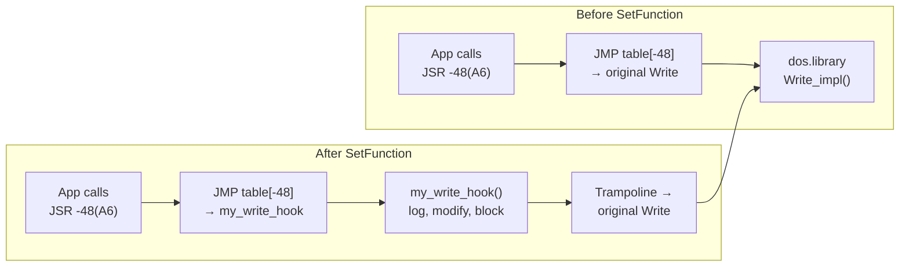
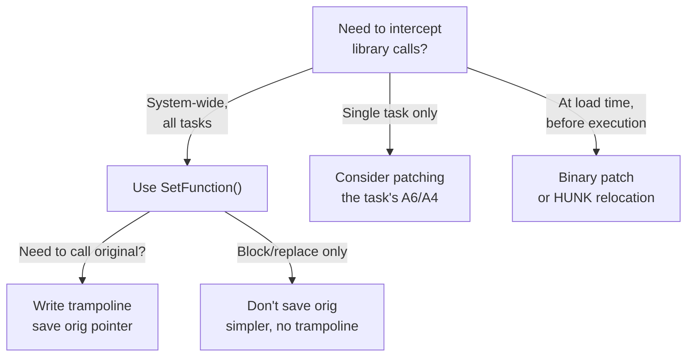

[← Home](../../README.md) · [Reverse Engineering](../README.md)

# SetFunction — Hooking Library Vectors at Runtime

## Overview

You want to know every file an application opens. Or every byte it writes. Or every memory allocation it makes — with sizes, flags, and call stacks. You could patch the binary. Or you could use the operating system's own hooking mechanism: **`SetFunction()`**.

`SetFunction()` is AmigaOS's official API for **replacing a library's JMP table entry at runtime.** It atomically swaps the target address of a specific LVO, returning the original pointer so you can construct a trampoline. Every call through that LVO — from every task, in every process — now routes through your code. This is the foundation of Amiga reverse engineering tooling: file system monitors, API tracers, memory debuggers, and anti-piracy checks all begin with `SetFunction()`.



---

---

## `SetFunction()` API

```c
/* exec/execbase.h */
APTR SetFunction(struct Library *library, LONG funcOffset, APTR newFunction);
/* Returns: pointer to OLD function */
```

- `library` — target library base (e.g., `DOSBase`)
- `funcOffset` — negative LVO offset (e.g., `-30` for `dos.library Open`)
- `newFunction` — your replacement function

---

## Installing a Hook

```asm
; Example: hook dos.library Write() at LVO -48

    MOVEA.L  _SysBase, A6
    JSR      (-120,A6)          ; Forbid() — prevent preemption during patch

    MOVEA.L  _DOSBase, A1
    MOVE.L   #-48, A0           ; LVO for Write
    LEA      _my_write(PC), A2
    JSR      (-420,A6)          ; SetFunction(DOSBase, -48, &my_write)
    MOVE.L   D0, _orig_write    ; save original function pointer

    JSR      (-126,A6)          ; Permit()
```

### C equivalent:

```c
static APTR orig_write;

void install_hook(void) {
    Forbid();
    orig_write = SetFunction((struct Library *)DOSBase, -48,
                             (APTR)my_write_hook);
    Permit();
}
```

---

## Writing a Trampoline

The hook function must:
1. Perform its instrumentation
2. Call the original via the saved pointer
3. Return with the original return value in D0

```asm
_my_write:
    ; D1 = file handle, D2 = buffer, D3 = length (Write args)
    MOVEM.L  D0-D7/A0-A6, -(SP)   ; save all (we may corrupt anything)

    ; ... instrumentation: log args, patch buffer, etc. ...

    MOVEM.L  (SP)+, D0-D7/A0-A6
    MOVEA.L  _orig_write, A0
    JMP      (A0)                  ; jump to original — not JSR; let original RTS
```

In C (with `__asm` constraints):
```c
LONG __asm my_write_hook(register __d1 BPTR fh,
                          register __d2 APTR buf,
                          register __d3 LONG len) {
    /* instrumentation */
    return ((LONG (*)(BPTR,APTR,LONG))orig_write)(fh, buf, len);
}
```

---

## Restoring on Exit

**Critical:** Always restore the original function before the program exits. Failure leaves a dangling pointer in the library JMP table, causing crashes for any subsequent users of the library.

```c
void remove_hook(void) {
    Forbid();
    SetFunction((struct Library *)DOSBase, -48, orig_write);
    Permit();
}

/* Register with atexit: */
atexit(remove_hook);
```

---

## Thread Safety Considerations

- `Forbid()` / `Permit()` disable task switching — keep the window minimal
- If the hook itself calls OS functions, use `Disable()` / `Enable()` instead only when interrupts must be excluded
- Hooks are system-global — all tasks using the library will go through your hook

---

## Common Use Cases in RE

| Use | Hook | LVO |
|---|---|---|
| Trace file access | `dos.library Open` | −30 |
| Intercept writes | `dos.library Write` | −48 |
| Monitor memory allocation | `exec.library AllocMem` | −198 |
| Log task creation | `exec.library AddTask` | −282 |
| Spy on library opens | `exec.library OpenLibrary` | −552 |

---

## Decision Guide — SetFunction vs Alternatives



| Approach | Scope | Invasiveness | Use Case |
|---|---|---|---|
| **SetFunction()** | System-wide | Low (official API) | API tracing, memory debugging, anti-piracy |
| **Direct JMP table patch** | System-wide | Medium (bypasses API) | Pre-OS 2.0 compatibility |
| **Task A6 replacement** | Single task | Medium | Per-application sandboxing |
| **Binary patch (file)** | Single binary | High (modifies disk) | Permanent behavior change, crack intros |

---

## Named Antipatterns

### 1. "The Leaky Hook"

**What it looks like** — installing a hook but never removing it:

```c
void setup(void) {
    Forbid();
    orig = SetFunction(DOSBase, -48, my_write);
    Permit();
    // No atexit() cleanup — hook lives forever
}
```

**Why it fails:** When the hooking program exits, `my_write` is unloaded from memory. But the JMP table still points to it. The next task that calls `Write()` jumps into freed memory → Guru Meditation.

**Correct:** Always register cleanup:

```c
void cleanup(void) {
    Forbid();
    SetFunction(DOSBase, -48, orig);  // restore original
    Permit();
}
// In main():
atexit(cleanup);
```

### 2. "The Forbid-Free Patch"

**What it looks like** — calling `SetFunction()` without `Forbid()`:

```c
// BROKEN — task switch during SetFunction may corrupt list
orig = SetFunction(DOSBase, -48, my_write);
```

**Why it fails:** `SetFunction()` modifies the library's `lib_OpenCnt` and may trigger expunge logic. If a task switch occurs during this modification, another task may see an inconsistent state. The result: corrupted open counts, premature expunge, or lost patches.

**Correct:** Always wrap in `Forbid()`/`Permit()`.

### 3. "The Register Stomper"

**What it looks like** — a hook that corrupts registers before calling the original:

```asm
_my_write:
    MOVEM.L  D0-D2/A0-A1, -(SP)   ; save only D0-D2/A0-A1
    JSR      _log_args
    MOVEM.L  (SP)+, D0-D2/A0-A1
    MOVEA.L  _orig_write, A0
    JMP      (A0)                  ; D3-D7/A2-A6 may contain garbage!
```

**Why it fails:** The original `Write()` expects `D1`=file, `D2`=buffer, `D3`=length. If your logging code modified D3 and you didn't save/restore it, the original function sees a corrupted length — potentially writing gigabytes or zero bytes. Even worse: the caller may rely on other registers (D4-D7, A2-A5) being preserved per the AmigaOS ABI, and your hook trashed them.

**Correct:** Save and restore ALL registers the original function might read or the caller expects preserved. The safest approach is `MOVEM.L D0-D7/A0-A6`.

---

## Use-Case Cookbook

### File Access Tracer — Log Every Open

```c
static APTR orig_Open;

LONG __asm my_Open(register __d1 STRPTR name,
                    register __d2 LONG mode) {
    LONG result = ((LONG(*)(STRPTR,LONG))orig_Open)(name, mode);
    if (result) {
        kprintf("Open: %s mode=%ld → handle=%ld\n", name, mode, result);
    }
    return result;
}

void install_file_tracer(void) {
    Forbid();
    orig_Open = SetFunction(DOSBase, -30, my_Open);
    Permit();
}
```

### Write Blocker — Prevent All Disk Writes

```c
static APTR orig_Write;
static BOOL write_blocked = TRUE;

LONG __asm my_Write(register __d1 BPTR fh,
                     register __d2 APTR buf,
                     register __d3 LONG len) {
    if (write_blocked) {
        return 0;  // pretend success, write nothing
    }
    return ((LONG(*)(BPTR,APTR,LONG))orig_Write)(fh, buf, len);
}
```

### Detect SetFunction Itself Being Called (Anti-Anti-Debug)

Some software detects patching by checking if `SetFunction` returns the expected original address. Counter-patch by hooking `SetFunction` itself:

```c
static APTR orig_SetFunction;

APTR __asm my_SetFunction(register __a1 struct Library *lib,
                           register __a0 LONG lvo,
                           register __d0 APTR newFunc) {
    if (lib == DOSBase && lvo == -48) {
        return orig_Write;  // lie: return our hook as "original"
    }
    return ((APTR(*)(struct Library*,LONG,APTR))orig_SetFunction)(lib, lvo, newFunc);
}
```

---

## Cross-Platform Comparison

| Amiga Concept | Win32 Equivalent | Linux Equivalent | Notes |
|---|---|---|---|
| `SetFunction()` | `DetourAttach()` (Microsoft Detours) | `LD_PRELOAD` + `dlsym(RTLD_NEXT)` | Same idea: intercept library calls transparently |
| JMP table modification | IAT hooking | PLT/GOT hooking | Amiga's JMP table is simpler — one 6-byte write vs multi-level indirection |
| Trampoline pattern | Detour trampoline | `dlsym(RTLD_NEXT, "write")` | Same: call original after instrumentation |
| `Forbid()`/`Permit()` | `SuspendThread` / `ResumeThread` (crude) | Signal blocking (crude) | Amiga's task-level atomicity is unique — no per-thread suspend needed |
| System-wide by default | Per-process by default | Per-process by default | Amiga's flat address space means one hook covers everything |

---

## FAQ

### Does SetFunction work on all library types?

Yes — `SetFunction()` works on any library with a standard JMP table (exec, dos, graphics, intuition, third-party). It does NOT work on ROM-based resident modules that use a different dispatch mechanism (some Kickstart modules).

### Can multiple hooks coexist on the same function?

Yes — in a chain. Each hook saves the "original" pointer (which may itself be a previous hook's trampoline). Removal must happen in reverse order: last hooked = first removed. Removing hooks out of order breaks the chain.

### Is SetFunction safe across CPU architectures?

On 68000–68060, yes. However, 68040+ systems with data cache enabled may cache the old JMP table entry. Always call `CacheClearU()` after `SetFunction()` on 040/060 to flush the data cache and ensure the new target address is visible to the instruction fetch unit.

---

## References

- NDK39: `exec/execbase.h`
- ADCD 2.1: `SetFunction` autodoc
- [live_memory_probing.md](live_memory_probing.md) — SysBase structure access
- *Amiga ROM Kernel Reference Manual: Libraries* — SetFunction chapter
