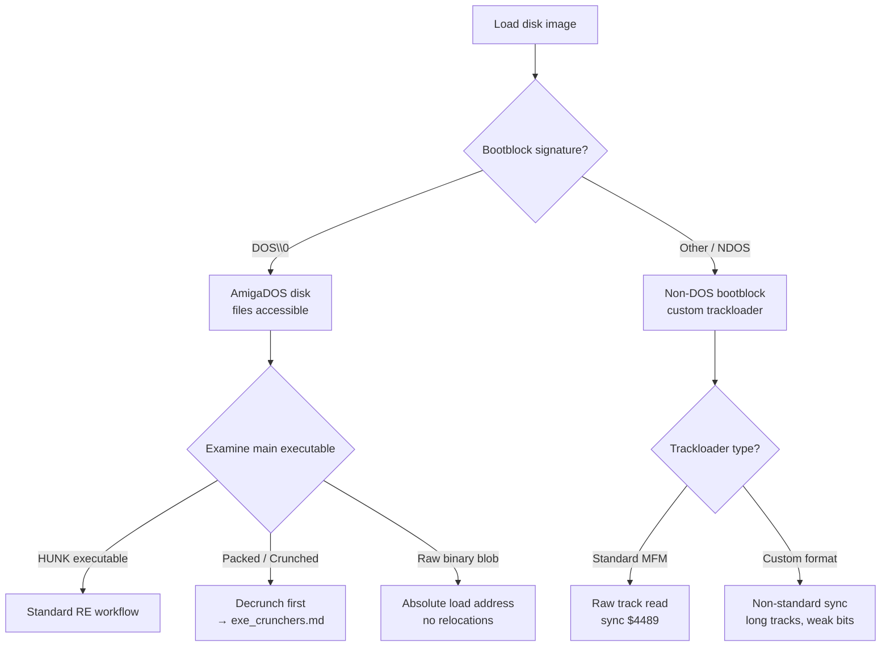

[← Home](../../README.md) · [Reverse Engineering](../README.md)

# Game Reverse Engineering — Disassembly, Modification, and Asset Extraction

## Overview

Commercial Amiga games were fortresses built from hand-written 68000 assembly, custom trackloaders, and executable packers. The OS was irrelevant — most titles booted straight from disk, seized the hardware, and never called `OpenLibrary` in their lives. Reversing them is not like reversing an AmigaOS `.library` where you anchor on `JSR -N(A6)` and follow the LVO table. You are facing raw metal: arbitrary register usage, self-modifying code, data embedded mid-instruction, and protection schemes designed by people who understood the 68000 trace exception better than Motorola's own engineers.

This article covers the complete workflow for reverse engineering Amiga games — from the first triage of an NDOS disk image to identifying the memory location that holds your lives counter, extracting sprite data, and building a patch that compiles. The techniques here apply equally to demos, bootblock intros, and any binary that bypasses AmigaOS.

> [!NOTE]
> This article assumes you are already comfortable with 68000 assembly and Amiga hardware registers. If not, start with [Hand-Written Assembly RE](../static/asm68k_binaries.md) and the [OCS Custom Registers](../../01_hardware/ocs_a500/custom_registers.md).

---

## The Game Binary Landscape

Before touching a disassembler, determine what kind of binary you are facing. The approach differs radically.



### NDOS vs DOS-Based Games

| Type | Boot Sequence | Disk Format | RE Strategy |
|---|---|---|---|
| **NDOS** | Bootblock disables OS, installs custom trackloader | Non-standard or raw MFM | Dump from emulator after boot; analyze raw memory image |
| **DOS-based** | Standard AmigaDOS boot; executable launched from disk | Standard OFS/FFS | Analyze HUNK executable directly; may still use hardware banging |
| **Hybrid** | AmigaDOS boot, but executable takes over hardware | Standard filesystem | Analyze HUNK, but expect `Forbid()` + direct register access |

Most pre-1992 games are NDOS. Most post-1992 titles (especially AGA games and CD32 ports) use AmigaDOS but still bypass the OS for graphics and audio.

### Packed vs Unpacked

Games were packed to fit on floppies. Common packers:

| Packer | Era | Signature | Decrunch Speed |
|---|---|---|---|
| **PowerPacker** | 1989–1994 | `$42` + `LEA`/`MOVE.L` pattern | Fast |
| **Imploder** | 1988–1992 | `$49` (often); ATN!Imploder header | Medium |
| **ByteKiller** | 1988–1991 | Short `BRA.S` over header, `MOVEM.L` | Very fast |
| **Shrinkler** | 1999+ | Context-mixing setup; no fixed magic | Slow (minutes on 7 MHz) |

> [!IMPORTANT]
> Always attempt automated decrunching with `xfdmaster.library` before manual analysis. See [Executable Unpacking](../unpacking_and_decrunching.md) for the full decruncher archaeology workflow.

### Copy Protection Landscape

| Scheme | Mechanism | How to Defeat |
|---|---|---|
| **Rob Northen Copylock** | Trace exception decryption tied to disk timing | Let it run in emulator; dump decrypted payload from RAM |
| **Custom trackloader** | Non-standard MFM, long tracks | Use RawDIC + Imager Slave; see [Custom Loaders](../custom_loaders_and_drm.md) |
| **Weak / fuzzy bits** | Mastered flux that reads randomly | Preserve as IPF; ADF loses the weakness |
| **Checksum loops** | Self-checksums with delayed failure | NOP out checksum routine; trace to find patch point |

---

## Tooling

### IRA — Interactive Reassembler

IRA is the native Amiga disassembler of choice for generating **re-assemblable source code**. Unlike IDA or Ghidra, which produce annotated databases, IRA outputs 68000 assembly source (`.asm`) plus a configuration file (`.cnf`) that you can refine iteratively.

**Basic workflow:**

```bash
# First pass: auto-detect code vs data
ira -A -KEEPZH -NEWSTYLE -COMPAT=bi -PREPROC MatchPatch

# Refine the .cnf file manually, then re-run with config:
ira -A -KEEPZH -NEWSTYLE -COMPAT=bi -CONFIG MatchPatch
```

| Flag | Purpose |
|---|---|
| `-A` | Show hex bytes alongside disassembly (invaluable for hex editing later) |
| `-KEEPZH` | Preserve zero hunks (empty hunks that may hold metadata) |
| `-NEWSTYLE` | Modern label naming convention |
| `-COMPAT=bi` | Big-endian compatibility mode |
| `-PREPROC` | Attempt automatic code/data separation |
| `-CONFIG` | Re-run using manual `.cnf` corrections |

**Why IRA over IDA/Ghidra for games?**
- Outputs compilable assembly source, not just annotations
- The `.cnf` file lets you add `SYMBOL` (rename labels), `LABEL` (add new labels), `COMMENT`, and `BANNER` directives, then regenerate
- Native awareness of Amiga executable quirks
- Cross-platform: compiles for Windows, macOS, and Linux (and runs much faster than on real hardware)

**Signs IRA misidentified code as data:**
- `DC.L` lines containing values like `$4E75` (`RTS`) or `$4E71` (`NOP`)
- Data areas with labels that look like subroutine names

**Signs IRA misidentified data as code:**
- Strings of `EXT_` declarations at the start of a program
- Code sections full of `ORI #0` (`$0000`)
- Sequences of hex values from `$41` to `$7A` — these are likely unidentified ASCII text

### Ghidra + ghidra-amiga

Ghidra with the `ghidra-amiga` extension provides a full HUNK loader, M68k decompiler, custom chip register mapping, and automatic LVO resolution. See [Ghidra Setup](../ghidra_setup.md) for installation and configuration.

**When Ghidra shines for games:** C-coded late-era titles, cross-reference graphs, global renaming.

**When Ghidra struggles:** Hand-written assembly with no prologues, self-modifying code, `JMP (PC, D0.W)` jump tables, and mixed code/data sections.

### IDA Pro

IDA Pro with the Amiga HUNK plugin is the traditional static analysis choice for Amiga binaries. It excels at interactive annotation, FLIRT signatures, and scripted automation. See [IDA Setup](../ida_setup.md) for configuration details.

**When IDA shines for games:** Interactive tracing, custom IDA Python scripts for jump table resolution, and hardware register enum creation.

**When IDA struggles:** No native M68k decompiler (unlike Ghidra). Heavily optimized hand-written assembly requires manual function boundary definition.

### Where to Get the Tools

| Tool | Where to Obtain | Notes |
|---|---|---|
| **IRA** | Aminet: `dev/misc/ira.lha` | Also compiles from source for Windows/macOS/Linux |
| **Ghidra** | https://ghidra-sre.org/ | Free, from NSA; v10.x+ recommended |
| **ghidra-amiga** | https://github.com/BartmanAbyss/ghidra-amiga | Load as Ghidra extension; do not unzip |
| **IDA Pro** | https://hex-rays.com/ida-pro/ | Commercial; requires separate Amiga HUNK plugin |
| **WinUAE** | https://www.winuae.net/ | Windows Amiga emulator with built-in debugger |
| **FS-UAE** | https://fs-uae.net/ | Cross-platform (macOS/Linux/Windows); debugger via `Shift+F12` |
| **xfdmaster.library** | Aminet: `util/pack/xfdmaster.lha` | Native Amiga decruncher; use via `xfdDecrunch` CLI |
| **hunkinfo** | Aminet: `dev/misc/hunkinfo.lha` | Quick hunk structure dump |
| **SPS / IPF tools** | https://softpres.org/ | For preserving copy-protected disks as IPF |
| **RawDIC** | Bundled with WHDLoad distribution | Used with custom Imager Slaves for protected disks |

> [!NOTE]
> Many of these tools are also available pre-installed in curated Amiga emulation distributions like **Amiga Forever** or pre-configured WinUAE environments from EAB.

### Emulator Debugging

Static analysis alone is often insufficient for games. You need dynamic verification.

**WinUAE / FS-UAE debugger:**

| Key | Action |
|---|---|
| `Shift+F12` | Enter debugger |
| `g <address>` | Go to address |
| `z` | Step one instruction |
| `t` | Trace (step into) |
| `W <address> <length>` | Write watchpoint |
| `R <address> <length>` | Read watchpoint |
| `m <address>` | Dump memory |
| `d <address>` | Disassemble from address |
| `s "filename" <start> <end>` | Save memory range to file |

**Critical technique — memory dump after decrunch:**
1. Boot the game in emulator
2. Enter debugger (`Shift+F12`)
3. Find the decruncher's final `JMP` to the original entry point
4. Set a breakpoint on that `JMP`
5. Let the game run — it decrunches in memory
6. When breakpoint hits, dump the entire decrunched region with `s`

---

## Pre-Flight: Research Before Disassembly

The most common mistake in game RE is failing to check if the work is already done.

1. **Search for existing analysis** — EAB (English Amiga Board) threads, GitHub repos, speedrun communities, and TCRF (The Cutting Room Floor) often document exactly what you are looking for.
2. **Check for source code releases** — Original authors sometimes release source decades later (e.g., *Frontier: Elite II* sources, various demo sources).
3. **Contact the author** — Many Amiga developers are reachable and willing to share insights or even original source.
4. **Preserve the original media** — If dealing with copy-protected disks, create IPF images (not ADF) using SPS/IPF tools. ADF loses weak-bit protection and custom track formats.

---

## Phase 1: Triage and Loading

### Step 1: Identify the Binary Type

```bash
# Check first bytes of disk image or executable
xxd game.adf | head -1
```

| First Bytes | Meaning |
|---|---|
| `44 4F 53 00` (`DOS\0`) | Standard AmigaDOS disk |
| Other executable | NDOS bootblock or custom format |
| `00 00 03 F3` | HUNK executable (file, not disk) |

### Step 2: For NDOS Disks — Extract the Bootblock

The bootblock is the first 1024 bytes (2 sectors) of the disk. It is loaded to `$7C00` by Kickstart and executed directly.

```bash
# Extract bootblock from ADF
dd if=game.adf of=bootblock.bin bs=1024 count=1
```

Analyze `bootblock.bin` at base address `$7C00`. Look for:
- `BRA` or `JMP` to the main loader
- `DSKSYNC` writes (`$DFF07E`) — indicates trackloader
- `INTENA` / `DMACON` writes — indicates OS takeover

### Step 3: For HUNK Executables — Dump Structure

```bash
hunkinfo game.exe
```

Note hunk types, sizes, and whether symbols are present. Some late-era games shipped with debug symbols accidentally left in — these are gold.

### Step 4: Detect Packing

Scan the first CODE hunk for packer signatures. See [Executable Unpacking](../unpacking_and_decrunching.md) for the full signature table.

---

## Phase 2: Finding Anchors

A 500 KB game binary is overwhelming. You need **anchors** — known values or patterns that let you orient yourself.

### Anchor 1: Text Strings

Games contain strings for menus, cheat codes, status messages, and file names.

```bash
# Extract strings from binary
strings game.exe > strings.txt

# Or with IRA:
ira -TEXT=1 -A -PREPROC game.exe
```

**String types and what they reveal:**

| String Pattern | Likely Meaning |
|---|---|
| `"graphics.library"` | Game uses OS graphics (unusual) |
| `"dos.library"` | Game uses OS file I/O |
| `"FORM"`, `"ILBM"`, `"8SVX"` | Embedded IFF assets |
| `"MATCHPATCH"`, `"ZOOL"` | Game title or internal project name |
| File paths like `"worlds/nif2txt.dat"` | Level data loading routines nearby |
| `"CHEAT ENABLED"` | Cheat code handler |

> [!WARNING]
> `strings` often returns garbage from misidentified data sections. Cross-reference with the disassembly to confirm the string is actually referenced by code.

### Anchor 2: Known Numeric Values

Games contain specific numbers: starting lives, maximum health, item prices, level counts.

| Decimal | Hex (16-bit) | Hex (32-bit) | Likely Meaning |
|---|---|---|---|
| 3 | `$0003` | `$00000003` | Starting lives |
| 10 | `$000A` | `$0000000A` | Common statistic |
| 100 | `$0064` | `$00000064` | Percentage scale, health |
| 1000 | `$03E8` | `$000003E8` | Score multiplier, currency |
| 320 | `$0140` | `$00000140` | Screen width (lowres) |
| 200 | `$00C8` | `$000000C8` | Screen height (PAL lowres) |

Search for these values in hex. If you find a `MOVE.W #$0003, D0` near initialization code, you have likely found the lives setup.

### Anchor 3: Hardware Register Accesses

Even games that take over the OS usually hit hardware registers. These are unambiguous anchors.

| Register | Address | What It Reveals |
|---|---|---|
| `JOY0DAT` | `$DFF00A` | Joystick/mouse port 0 reads — player input handling |
| `JOY1DAT` | `$DFF00C` | Joystick/mouse port 1 reads |
| `AUD0LCH`–`AUD3LCH` | `$DFF0A0`–`$DFF0D0` | Audio channel setup — sound effects, music |
| `VHPOSR` | `$DFF006` | Vertical/horizontal position — RNG seeding, VBlank waits |
| `VPOSR` | `$DFF004` | Vertical position (high bits) — frame timing |
| `COP1LC` | `$DFF080` | Copper list pointer — display setup |
| `BLTCON0` | `$DFF040` | Blitter control — graphics rendering |

**Input handling identification:**

```asm
; Classic joystick read pattern:
MOVE.W  $DFF00A, D0          ; Read JOY0DAT
AND.W   #$0101, D0           ; Mask direction bits
; ... decode into game state ...
```

**Random number generator identification:**

```asm
; Common RNG seed pattern — uses beam position for entropy:
MOVE.W  $DFF006, D0          ; VHPOSR = current raster position
; ... shuffle with ROXR ...
```

The `ROXR` (rotate right with extend) instruction is a dead giveaway for RNG routines. Once you find the RNG, every caller is potentially a game mechanic.

### Anchor 4: AmigaOS Library Calls

Some games, especially later titles and CD32 ports, use AmigaOS for initialization or file I/O.

```asm
; OpenLibrary call pattern:
MOVEA.L 4.W, A6              ; SysBase
LEA     graphics_name(PC), A1
MOVEQ   #33, D0              ; minimum version
JSR     -552(A6)             ; OpenLibrary
```

| LVO | Library | Function | Game RE Relevance |
|---|---|---|---|
| `-552` | exec | `OpenLibrary` | Loading libraries |
| `-30` | dos | `Open` | File loading — level data, save games |
| `-42` | dos | `Read` | Reading data into memory — reveals file→memory mapping |
| `-48` | dos | `Write` | **Save games and high scores** — critical for state analysis |
| `-36` | dos | `Close` | File cleanup |

**Save game exploitation:** `Write` calls in games are almost always save games or high scores. The data written holds persistent game state (inventory, stats, level progress). Finding the `Write` call reveals the in-memory structure of the save game, enabling editor construction.

### Anchor 5: File Read Patterns

```asm
; File read pattern — reveals memory destinations:
JSR     -30(A6)              ; Open(file_name, MODE_OLDFILE)
MOVEA.L D0, D1               ; FileHandle
MOVEA.L #buffer, D2          ; Destination address
MOVE.L  #size, D3            ; Bytes to read
JSR     -42(A6)              ; Read(FileHandle, buffer, size)
```

The `buffer` address is the in-memory location of that file's data. Cross-reference this with string anchors (e.g., `"worlds/nif2txt.dat"`) to map file contents to memory layout.

---

## Phase 3: Mapping Game Mechanics

Once anchored, trace outward to reconstruct the game's logic.

### Finding the Main Game Loop

Games need to synchronize to the display refresh (50 Hz PAL / 60 Hz NTSC). Look for:

```asm
; VBlank wait pattern — the heartbeat of the game:
wait_vblank:
    MOVE.W  $DFF006, D0      ; VHPOSR
    AND.W   #$FF00, D0       ; Mask vertical position
    CMP.W   #$0000, D0       ; Wait for line 0 (start of frame)
    BNE.S   wait_vblank
```

Or the more common VPOSR check:

```asm
wait_frame:
    MOVE.W  $DFF004, D0      ; VPOSR
    AND.W   #$01FF, D0       ; Mask vertical position bits
    CMP.W   #303, D0         ; Wait for bottom of PAL frame
    BNE.S   wait_frame
```

The code immediately following the VBlank wait is the **main game loop**.

### Identifying Score and Lives

1. **Hex search**: Search for the starting value (e.g., 3 lives = `$0003`).
2. **Cross-reference**: Find all instructions that write this value. One is initialization; others are decrement (lose life) or increment (gain life).
3. **Verify with emulator**: Patch the value at the memory location and run the game. If you start with 99 lives, you found it.

### Identifying the RNG

```asm
; Typical Amiga game RNG (seeded from beam position):
rng_seed:
    MOVE.W  $DFF006, D0      ; VHPOSR
    EOR.W   D0, rng_state    ; Mix with current state
    ROXR.W  #1, rng_state    ; Shuffle
    MOVE.W  rng_state, D0    ; Return random value
    RTS
```

**Key signatures:**
- Read from `$DFF006` or `$DFF004`
- `ROXR` or `ROR` instruction
- Called from combat, item drops, enemy spawn, or any probabilistic mechanic

### Audio as a Navigation Aid

Audio register writes reveal what the code is doing:

```asm
; Sound effect trigger:
MOVE.L  #bullet_sample, $DFF0A0   ; AUD0LCH/LCL = sample pointer
MOVE.W  #period, $DFF0A6          ; AUD0PER = playback period
MOVE.W  #volume, $DFF0A8          ; AUD0VOL = volume
```

If you extract the sample referenced by `bullet_sample` and hear a gunshot, you have found the shooting code. From there, trace back to find collision detection, enemy damage, and scoring.

---

## Phase 4: Modification and Patching

### Hex Editing Known Values

Once you have identified a value's location in the binary:

1. Note the file offset and original bytes from the IRA `-A` output
2. Open the binary in a hex editor
3. Search for the unique byte sequence surrounding the value
4. Patch and test

| File Offset | Original | Patched | Effect |
|---|---|---|---|
| `$0001A4` | `66 0A` | `4E 71 4E 71` | Replace `BNE` with two `NOP`s (defeat branch) |
| `$003210` | `03` | `63` | Change starting lives from 3 to 99 |

> [!WARNING]
> Patched bytes must preserve instruction alignment. A 16-bit `MOVE.W` patch that changes length will shift all subsequent code and break absolute addresses.

### Building a Re-Assemblable Patch

For complex modifications, IRA's output is ideal:

1. Disassemble with IRA to get `game.asm` and `game.cnf`
2. Edit `game.asm` directly (e.g., change `MOVEQ #3, D0` to `MOVEQ #99, D0`)
3. Assemble with vasm or AsmOne
4. Test on emulator

### Trainer / Cheat Menu Construction

A trainer is a small patch that installs a hotkey handler to modify game state at runtime:

```asm
; Minimal trainer hook — intercepts keyboard and grants lives
    MOVE.W  $BFEC01, D0         ; Read keyboard data port (CIAA)
    NOT.B   D0
    ROR.B   #1, D0              ; Decode raw keycode
    CMP.B   #$45, D0            ; F1 key?
    BNE.S   .no_cheat
    MOVE.B  #99, lives_counter  ; Grant 99 lives
.no_cheat:
```

Install this in the VBlank interrupt or keyboard handler. See [SetFunction Patching](../dynamic/setfunction_patching.md) for runtime hook techniques.

---

## Phase 5: Asset Extraction

### Text and Strings

Use the IRA `-TEXT=1` option or `strings` to find all text. For games with custom text encoding (e.g., compressed or shifted character sets), identify the font rendering routine and reverse the encoding table.

### Graphics — IFF Extraction

Amiga games often store graphics in IFF format (`FORM ILBM`) or raw planar bitmaps.

**IFF detection:** Search for `FORM` (`$464F524D`) and `ILBM` (`$494C424D`) signatures in the binary or memory dump. The IFF header gives you width, height, depth, and palette.

**Raw planar extraction:**
1. Find `BPL1PT`–`BPL5PT` writes in the copper list or code
2. The pointers reveal bitmap base addresses in memory
3. Dump the memory range; decode as planar (interleaved or non-interleaved based on `BPLMOD`)

### Audio — Sample and Module Extraction

| Format | Signature | Extraction |
|---|---|---|
| **8SVX** | `FORM` + `8SVX` | IFF audio chunk; playable directly |
| **Protracker MOD** | `M.K.`, `FLT4`, `4CHN` | Standard 31-sample + pattern data format |
| **Raw PCM** | None — identified via `AUDxLCH` writes | Mono 8-bit signed; import to Audacity as raw 8-bit signed, ~8000–28000 Hz |

---

## Decision Guide: Choosing Your Toolchain

| Scenario | Recommended Tool | Why |
|---|---|---|
| Need re-assemblable source | **IRA** | Outputs `.asm` + `.cnf`; iterative refinement |
| Need C pseudocode / cross-references | **Ghidra + ghidra-amiga** | Decompiler, global renaming, xref graph |
| Heavy OS library usage (late games) | **Ghidra** | Automatic LVO resolution |
| Pure assembly, no OS calls | **IRA + emulator** | Ghidra decompiler gives up; IRA + dynamic trace works better |
| Packed / protected game | **Emulator debugger first** | Let protection run, dump decrypted memory, then load into static tool |
| Quick value patch (lives, score) | **Hex editor** | Fastest for one-byte changes |
| Bootblock analysis (1024 bytes) | **IRA or raw disassembly** | Small enough to read linearly |

---

## Historical Context

### Why Games Bypassed the OS

| Factor | Impact |
|---|---|
| **7 MHz CPU** | Every CPU cycle mattered. `graphics.library` added overhead (layer locking, clipping checks). |
| **512 KB Chip RAM** | OS structures consumed precious DMA-accessible memory. Games needed every byte for sprites and sound. |
| **Disk speed** | 880 KB floppy at ~50 KB/s effective. Custom trackloaders achieved 2–3× speed by reading raw tracks sequentially. |
| **Copy protection** | AmigaDOS disks were trivially copyable with X-Copy. NDOS + custom formats + weak bits made mass duplication harder. |
| **Demoscene culture** | Assembly was the standard. Using a C compiler for a game engine was seen as lazy until the mid-1990s. |

### The NDOS-to-DOS Transition

- **1985–1990**: Almost all commercial games are NDOS, hand-written assembly, custom trackloaders.
- **1990–1993**: Hybrid era. Games boot from AmigaDOS but take over hardware after loading. Some use `dos.library` for file I/O.
- **1993–1996**: AGA and CD32 era. Larger budgets, more C code, AmigaDOS-based loading. WHDLoad emerges to patch games for hard drive installation.

---

## Modern Analogies

| Amiga Game RE Concept | Modern Equivalent | Where It Holds / Breaks |
|---|---|---|
| NDOS bootblock takeover | UEFI bootkit / custom bootloader | Holds: bypasses OS entirely. Breaks: bootblock is 1024 bytes, UEFI is MBs. |
| Custom trackloader | Direct NAND flash controller access | Holds: raw media access for speed. Breaks: no MFM encoding on flash. |
| Executable packer | UPX, VMProtect packing | Holds: runtime decompression + jump to OEP. Breaks: modern packers use virtualization. |
| Rob Northen Copylock | Denuvo anti-tamper | Holds: trace/exception abuse, timing checks. Breaks: Copylock is 68000-specific; Denuvo uses x64 VM. |
| Hardware register banging | Embedded MCU programming (STM32, Arduino) | Holds: direct MMIO register access. Breaks: Amiga chips are video/audio-specific. |
| Memory patch (lives counter) | Cheat Engine / GameGuardian | Holds: scan for known value, patch at runtime. Breaks: modern games use encrypted/process-isolated memory. |

---

## Best Practices

1. **Always preserve original media as IPF before modifying** — ADF loses copy protection and custom formats.
2. **Try automated decrunching first** — `xfdmaster.library` can save hours.
3. **Document every patch with file offset, original bytes, and rationale** — you will forget why you changed something.
4. **Use the `-A` flag in IRA** — seeing raw hex bytes alongside disassembly is essential for building patch tables.
5. **Verify anchors dynamically** — a suspected lives counter may actually be a loop iterator. Patch and test in emulator.
6. **Build a register map as you trace** — hand-written assembly has no ABI. Document what each register means in each routine.
7. **Save memory dumps at key moments** — after decrunch, after level load, after title screen. Compare dumps to find dynamic data structures.
8. **Trace audio register writes to locate game events** — sound effects are the most reliable event markers in assembly.
9. **Cross-reference file reads with string anchors** — `"level1.dat"` + `dos.library Read` = level data structure.
10. **Work iteratively** — name one function, trace its callers, name them too. Do not attempt to understand the entire binary in one pass.

---

## Antipatterns

### 1. The Linear Reading Trap

**Wrong**: Opening the disassembly at offset 0 and reading top-to-bottom expecting to understand the game.

**Why it fails**: Hand-written assembly is non-linear. The entry point sets up interrupts and copper lists, then the real game logic lives in ISR chains and event handlers scattered across the binary.

**Right**: Start from anchors (strings, hardware registers, known values) and trace outward using cross-references.

### 2. The Compiler Assumption

**Wrong**: Expecting `A6` to be a library base, `D0`/`D1` to be scratch, and `LINK`/`UNLK` function boundaries.

**Why it fails**: Games are hand-written assembly. `A6` might hold the hardware base pointer. `D6` might be the frame counter. Functions may have no prologue.

**Right**: Treat every register as unknown until proven otherwise. Document the actual convention per routine.

### 3. The OS Dependency Delusion

**Wrong**: Searching extensively for `JSR -N(A6)` library calls to anchor analysis.

**Why it fails**: Most games make zero OS calls after initialization. The action is at `$DFF000` and `$BFE001`, not in `exec.library`.

**Right**: Scan for hardware register constants (`$DFF`, `$BFE`) first. If none appear, then check for OS calls.

### 4. The Phantom String

**Wrong**: Assuming every readable ASCII sequence in the binary is a meaningful string.

**Why it fails**: Random data bytes can decode as printable ASCII. A string with no code cross-reference is likely not a string.

**Right**: Always verify that code actually references the string address (via `LEA string(PC), A0` or similar).

### 5. The In-Place Patch Disaster

**Wrong**: Changing a `MOVE.W #3, D0` to `MOVE.W #99, D0` without checking instruction length.

**Why it fails**: `MOVEQ #3, D0` is 2 bytes. `MOVE.W #99, D0` is 4 bytes. The patch overflows into the next instruction, corrupting the code stream.

**Right**: Use equivalently-sized instructions. `MOVEQ #99, D0` is invalid (`MOVEQ` range is -128 to +127, so `#99` is fine and still 2 bytes). For larger values, `MOVE.W` is required but check alignment.

---

## Pitfalls & Common Mistakes

### 1. Misidentifying Data as Code

Mixed code/data is the norm in game binaries. Copper lists, sprite data, and audio samples often reside in CODE hunks.

```asm
; This looks like instructions:
OR.B    #$80, D0
OR.B    #0, D0
OR.B    #$82, D0
OR.B    #$FF, D0

; But it is actually a copper list:
; DC.W $0180, $0000  = COLOR00 = $0000
; DC.W $0182, $0FFF  = COLOR01 = $0FFF
```

**Fix**: Search for `COP1LC` writes to find copper list addresses. Force-define those ranges as data arrays, not code.

### 2. Ignoring Relocation State

When you dump decrunched memory from an emulator, absolute addresses have already been patched by the decrunch stub. If you try to run that dump at a different load address, it crashes.

**Fix**: Note the load address used by the emulator. If re-assembling, either use the same base address or reconstruct PC-relative addressing.

### 3. Debugging After OS Death

Games call `Forbid()` and disable interrupts early. If your debugger relies on AmigaOS (like MonAm or HRTmon), it stops working the moment the game takes over.

**Fix**: Use emulator built-in debuggers (WinUAE/FS-UAE `Shift+F12`) or hardware cartridges (Action Replay) that trap via NMI, not OS services.

### 4. Overlooking Self-Modifying Code

Copy protection and optimization both use SMC. The disassembly shows one instruction; the runtime executes another.

```asm
; Static disassembly shows:
MOVE.W  D0, D0           ; This gets patched at runtime

; Init routine overwrites it:
MOVE.W  #$4E71, (patched+2, PC)   ; Patch in a NOP
```

**Fix**: Set write breakpoints on CODE hunk addresses in the emulator. If anything writes there during init, you have SMC.

### 5. Confusing VBlank Wait with Game Logic

The VBlank wait loop is easy to find but tells you nothing about *what* the game does each frame.

**Fix**: Trace forward from the VBlank wait exit. The next block is usually the frame update routine. Set a breakpoint there and step through one full frame.

---

## Use Cases

### Speedrun Research

Reverse engineering reveals frame-perfect mechanics: RNG seeds, hitbox dimensions, level transition triggers. Documenting the `RNG_seed` routine and its callers lets speedrunners manipulate luck.

### Translation Projects

Finding the text rendering routine and font data enables text replacement. Games with embedded ASCII strings are trivial; games with custom encoding require reversing the blit-based font routine.

### Save Game Editors

The `dos.library Write` call that saves game state reveals the exact memory structure of the persistent state. Mapping this structure enables external save game editors.

### Modding and Enhancement

Patching the weapon damage table, adding a cheat menu, or replacing audio samples all require understanding the binary's data layout. IRA's re-assemblable output makes this sustainable.

### Preservation and Documentation

Documenting the internal structure of unreleased or poorly documented games contributes to the historical record. TCRF and similar archives rely on this work.

---

## FAQ

### Q1: IRA vs Ghidra — which should I use?

Use **IRA** when you need re-assemblable source code or are working with pure hand-written assembly. Use **Ghidra** when you need cross-references, decompilation, or the game was written in C. Many RE projects use both: Ghidra for exploration, IRA for final patch generation.

### Q2: How do I handle a game with no readable strings?

High entropy and no strings suggest encryption or compression. Let the game boot in an emulator, dump memory after decrunch/decryption, then analyze the dump. The decrypted payload will have strings.

### Q3: Can I reverse a game back to C?

Not really. Generic decompilation of hand-written 68000 assembly produces unreadable pseudocode. The only successful "decompilations" are hand-crafted rewrites based on deep understanding of the assembly (e.g., *GLFrontier*).

### Q4: How do I find the level data format?

Anchor on file read calls (`dos.library Read`) or look for large data tables referenced by the rendering code. Level data often follows audio/graphic assets in memory. Compare memory dumps between levels to find what changes.

### Q5: What if the game uses a custom trackloader I can't read?

Use WinUAE's disk DMA breakpoint (`W $DFF024 2`) to catch every disk read. Trace backward from the breakpoint to find the trackloader code. Document the sync word, sector count, and MFM decode routine. See [Custom Loaders](../custom_loaders_and_drm.md).

### Q6: How do I patch a game that checksums itself?

Find the checksum routine (usually a tight loop with `ADD.L` or `EOR.L` over a memory range). NOP it out, or recalculate the checksum to match your patch. The checksum routine is often called from multiple places — patch all callers.

### Q7: Why does my patched game crash on real hardware but work in emulator?

Emulators are more forgiving of timing violations. Your patch may have altered cycle-exact code (e.g., a copper wait or blitter poll). Verify that you haven't changed instruction timing or introduced bus errors.

---

## References

- [Hand-Written Assembly RE](../static/asm68k_binaries.md) — Pure m68k binary methodology
- [Executable Unpacking](../unpacking_and_decrunching.md) — Decruncher archaeology and memory extraction
- [Custom Loaders & DRM](../custom_loaders_and_drm.md) — Trackloaders, copy protection, RawDIC
- [Ghidra Setup](../ghidra_setup.md) — Ghidra + ghidra-amiga extension configuration
- [Anti-Debugging](../anti_debugging.md) — Trace vector abuse, NMI defeat, checksum loops
- [WHDLoad Architecture](../whdload_architecture.md) — Slave authoring and snooping
- [Copper Programming](../../08_graphics/copper_programming.md) — Copper list format
- [Blitter Programming](../../08_graphics/blitter_programming.md) — Blitter register sequences
- [Paula Audio](../../01_hardware/ocs_a500/paula_audio.md) — Audio DMA registers
- *Amiga Hardware Reference Manual* — Custom chip register reference
- *M68000 Programmer's Reference Manual* — Instruction set and cycle timing
- EAB: Small IRA Tutorial — https://eab.abime.net (search "IRA tutorial")
- ghidra-amiga: https://github.com/BartmanAbyss/ghidra-amiga
- Tetracorp Amiga RE Guide — https://tetracorp.github.io/guide/reverse-engineering-amiga.html
