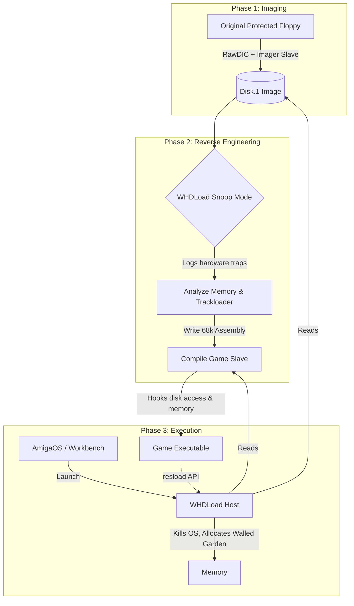
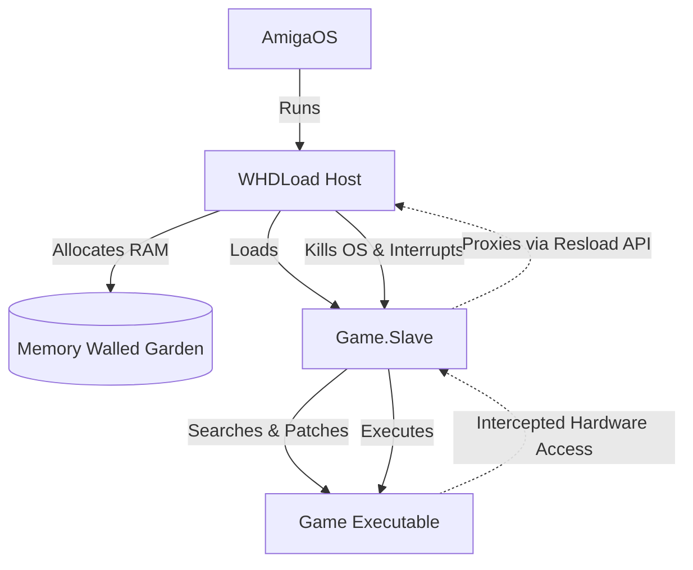
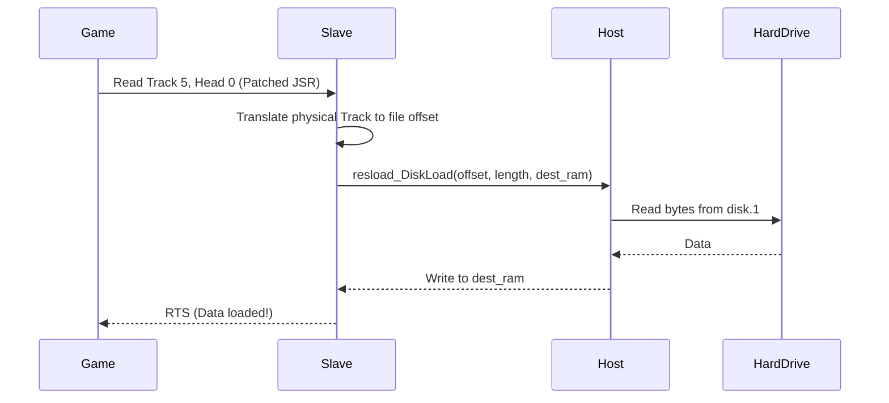

[← Home](../../README.md) · [Reverse Engineering](../README.md)

# WHDLoad Architecture & Reverse Engineering

If [Trackloaders](custom_loaders_and_drm.md) were the developers' way of taking complete control of the Amiga to bypass the OS, **WHDLoad** is the modern reverse engineer's way of taking that control *back*.

WHDLoad is essentially an AmigaOS-compliant "hypervisor" that wraps hardware-banging games, fools them into thinking they have absolute control of an Amiga 500, and intercepts their physical hardware requests to run them from modern hard drives.

Creating a WHDLoad port of a protected game is a multi-stage process involving disk imaging, execution profiling, reverse engineering, and assembly programming.

---

## 1. End-to-End Developer Workflow

Before diving into the low-level details, the entire lifecycle of creating a WHDLoad patch flows from the physical floppy disk through reverse engineering, ending in a deployable hard-drive package.

---

## 2. The Imaging Phase: From Floppy to File

Before a game can run from a hard drive, its physical floppy disks must be perfectly preserved as data files. 

### 2.1 DIC vs. RawDIC
WHDLoad provides two primary tools for imaging:
*   **DIC (Disk Image Creator)**: Used for standard AmigaDOS formatted disks. It rips the disk into standard `.iso` or `.adf` style files (usually named `Disk.1`, `Disk.2`).
*   **RawDIC**: Used for games with custom trackloaders or physical DRM (weak bits, long tracks). RawDIC does not know how to read these formats inherently.

### 2.2 Imager Slaves & The Amiga Floppy Controller

To use RawDIC on a protected game, the developer must first reverse-engineer the game's bootblock and write an **Imager Slave**. 

An Imager Slave is a **68000 Assembly language program** (never C code). Developers write the `.asm` file using the official [WHDLoad Developer Package](http://whdload.de/), which provides necessary macros (like `rawdic.i`). The source code is compiled using a standard Amiga assembler (like PhxAss or VASM) into an executable binary. 

When you run RawDIC from the command line, you pass the Imager Slave to it as an argument:
`RawDIC slave=MyGame.ISlave`

RawDIC loads the Imager Slave, which then dictates exactly how to decode the disk's specific Magnetic Flux Reversals (MFM).
To understand how RawDIC works, you must understand the Amiga's unique floppy architecture, which is radically different from a PC (NEC 765) or ZX Spectrum (WD1793). The Amiga does not use an intelligent, high-level floppy controller. It uses two custom chips:
1.  **[CIA-A / CIA-B (8520)](../01_hardware/common/cia_chips.md)**: Handles mechanical logic. The CPU writes to CIA registers to turn on the motor, select a drive, choose head direction, and send step pulses.
2.  **[Paula (8364)](../01_hardware/common/floppy_hardware.md)**: Handles data transfer via **DMA (Direct Memory Access)**. Paula does not decode sectors. It simply looks for a 16-bit "Sync Word" (standard is `$4489`) in the magnetic flux. When it sees that word, Paula blindly streams the raw, decoded MFM bitstream directly into Chip RAM, completely bypassing the CPU.

RawDIC is a **software tool** that leverages this architecture directly. It bypasses the standard AmigaOS `trackdisk.device`. Instead, it uses the CIA to mechanically step to a track, and then programs Paula's DMA registers (`DSKLEN`, `DSKPTH`, `DSKSYNC`). 

If a game uses a proprietary format (e.g., a custom sync word like `$8944` instead of `$4489`), standard AmigaDOS fails. An Imager Slave tells RawDIC exactly what custom parameters to feed Paula. RawDIC then triggers the DMA transfer, pulling the custom MFM stream into memory, where the Imager Slave executes custom 68000 routines to decode the MFM bits into a flat `Disk.1` payload file suitable for WHDLoad.

> **Note: RawDIC vs. Hardware Flux Readers**
> This process is completely separate from modern PC-based hardware devices like **KryoFlux**, **SuperCard Pro**, or **GreaseWeazle**. Those are external USB devices that capture magnetic flux at the hardware level to create archival `.scp` or `.raw` images. RawDIC, conversely, is an Amiga-native software solution that relies on Paula's DMA and the developer's Imager Slave to decode the MFM stream on-the-fly.

### 2.3 Post-Processing
If the game uses a custom filesystem, the developer might not want a massive `Disk.1` image. They might write a script to extract individual files from the raw tracks so the WHDLoad patch can load them natively via the Host OS. They also manually correct any bad checksums caused by original mastering errors.

---

## 3. The Snooping Phase (Execution Profiling)

Once the data is ripped, the developer must figure out exactly what the game is doing to the hardware. WHDLoad has built-in profiling called **Snooping** (activated via `Snoop=1` or `Snoop=2` in the `.info` tooltypes).

When Snooping is enabled, WHDLoad uses the CPU's Memory Management Unit (MMU) to trap all memory accesses. It generates a massive log of:
*   **Custom Register Violations**: Intercepts illegal byte-writes to 16-bit custom registers (which legally require word writes, with exceptions like `bltcon0l`). It also traps writes to read-only registers or reads from write-only registers.
*   **CIA Hazards**: Detects illegal read-modify-write instructions (like `BCHG`) on CIA Time of Day registers when the Alarm bit is active.
*   **Memory Bounds**: Every read/write outside the game's allocated memory.
*   **Advanced DMA Validation**: WHDLoad provides granular Snoop flags (`ChkBltSize`, `ChkBltWait`, `ChkCopCon`, `ChkAudPt`) that use instruction tracing and bounds checking to catch Copper and Blitter jobs attempting to read/write outside `BaseMem`, or the Copper illegally attempting to configure the Blitter (`custom.copcon` bit 1).

> **Warning: 68040/060 Snoop Limitations**
> On 68040 and 68060 processors, `MOVEM` (Move Multiple) instructions can sometimes bypass Snoop's Access Fault handler. This occurs because the MMU only verifies the *first* address accessed during the burst transfer, potentially allowing illegal chip accesses further down the block to slip through undetected. **Because of this hardware flaw, a 68030 with a full MMU is considered the "gold standard" hardware for accurately profiling games.**

This log becomes the developer's "To-Do" list. Every illegal or hardware-banging operation in the log must be intercepted and patched.

---

## 4. Writing the Game Slave

The **Game Slave** (`game.slave`) is a small piece of 68000 assembly code written specifically for one game. It is the core reverse-engineering patch.

### 4.1 The Walled Garden & MMU Virtualization
When WHDLoad launches, it allocates a contiguous block of RAM for the game (`BaseMem` and optionally `ExpMem`). Using the MMU, WHDLoad builds a precise translation tree that explicitly marks the following physical regions as **Valid Pages**:
*   `$00000000` through the end of allocated `BaseMem`/`ExpMem`.
*   `$dff000 - $dff200` (Custom Hardware Registers).
*   `$bfd000 - $bff000` (CIA Registers).

Every other memory page is marked as **Invalid**. Any read or write outside these explicitly defined Walled Garden boundaries immediately triggers an Access Fault Exception handled by WHDLoad. This forces the game to believe it is running at absolute address `$00000000`, with full ownership of the 512KB Chip RAM, while absolutely protecting the host OS.

### 4.2 KickEmu (OS Emulation)
Some games bypass the OS for disk access but still rely on `exec.library` or `graphics.library` for initialization. WHDLoad provides **KickEmu**, a set of pre-built modules that load actual Kickstart ROM images (1.3 or 3.1) into Fast RAM and emulate a pristine boot environment just for the game.

### 4.3 Patching the Footprint
The Slave searches the game's loaded memory for the exact byte signature of its custom trackloader. It then overwrites the original `JSR` (Jump to Subroutine) entry points with jumps to the Slave's own code.

### 4.4 Redirection to `resload_DiskLoad`
Inside the Slave's hook, the game's request (e.g., "Cylinder 5, Head 0") is translated into a byte offset within the `Disk.1` image file. 

The Slave then calls `resload_DiskLoad`, a callback function provided by the WHDLoad Host.

### 4.5 The Soft Reset (`QuitKey`)
WHDLoad requires that every game can be exited gracefully, returning the user to the AmigaOS Workbench without rebooting. 

The Slave implements this by intercepting the keyboard hardware interrupt (Level 2) or the Action Replay NMI (Level 7). When the user presses the designated `QuitKey` (often F10 or PrtScn), the Slave intercepts it and triggers a `resload_Abort` call. WHDLoad then restores the OS interrupt vectors, flushes the caches, and turns multitasking back on.

---

## 5. Hardware Virtualization & Fixes

Beyond disk access, Slaves must fix hardware incompatibilities so an A500 game runs on an A1200 or 68060 accelerator:

1. **MMU Virtualization & Traps**: WHDLoad takes over the MMU to proxy OS functions and validate memory bounds. Because of this, running debugging tools like **Enforcer** or **CyberGuard** simultaneously with WHDLoad causes machine lockups, as WHDLoad intentionally generates hundreds of MMU hits during normal operation. 
2. **SMC Defeat & The 68060 Paradox**: The 68000 had no instruction cache; the 68020+ does. Games using Self-Modifying Code (SMC) crash on newer processors because the CPU executes stale instructions. Slaves patch these areas with `resload_FlushCache`. 
    *   *The 68060 Paradox*: The Motorola 68060 introduced a "Branch Cache" that **completely ignores the MMU setup**. Even if WHDLoad marks a memory page as Non-Cacheable to protect SMC, the 68060 will *still* cache branch instructions. Game Slaves must explicitly use `resload_SetCPU` (or the historical `resload_SetCACR`) to disable or flush this cache, or the game will crash on an 060.
3. **Access Faults**: Games might try to read memory outside their allocated Chip RAM. Slaves `NOP` out these checks.
3. **Interrupt Timing**: If a game relies on the specific speed of a 68000 executing a loop for timing, it runs 10x too fast on a 68030. Slaves replace these loops with `resload_Delay` calls to normalize the speed.

---

## 6. Advanced Debugging & Profiling

### 6.1 Advanced Snooping & Memory Dumps
While basic `Snoop` logs hardware violations, developers can combine `Snoop=1`, `Expert=1`, and `DebugKey` to trigger a total system dump. Pressing the configured `DebugKey` forces WHDLoad to write the entire Walled Garden memory state, CPU registers, and custom chip states to disk.

Developers use the included **SP (Save Picture)** tool to extract raw framebuffer images directly from these dump files by parsing the captured copperlists, which is invaluable for identifying exactly when and where a game crashes or hangs during display routines.

### 6.2 System Monitors & Freezer Integration
WHDLoad directly supports specific software freezers (like HRTmon and ThrillKill). When WHDLoad detects a supported freezer in memory during startup, it modifies its MMU setup to declare the monitor's memory as valid and WriteThrough cacheable. 
It forwards all NMI (Non-Maskable Interrupts) to the monitor's vector table. If the VBR (Vector Base Register) is moved, WHDLoad compares the `FreezeKey` at each Level 7 interrupt, transforming the stackframe into an NMI stackframe to safely drop the user into the debugger without disrupting the host OS.

### 6.3 Memory Protection API & Checksum Defeat
Some games implement anti-tampering checksums that scan memory for modifications to the trackloader. Reverse engineers can easily defeat these checks using WHDLoad's `resload_ProtectRead` and `resload_ProtectWrite` APIs. 

By declaring the 4KB memory page containing the modified code as protected, WHDLoad modifies the page descriptors in the MMU translation tree. Any subsequent access to that page by the game's protection routine will instantly trigger an Access Fault exception. WHDLoad's exception handler evaluates the access; if it matches the specific patched bytes, it halts execution and drops the developer exactly at the checksum routine's Program Counter (PC), completely exposing the DRM mechanism.

---

## 7. Publishing the Container

Once the Imager Slave and Game Slave are complete, the developer packages the release. A standard WHDLoad container looks like this:

*   `Game.slave`: The compiled Game Slave binary.
*   `Disk.1`, `Disk.2`: The disk images ripped by RawDIC.
*   `Game.info`: The AmigaOS icon file containing WHDLoad Tooltypes (e.g., `Preload=1`, `QuitKey=$59`).
*   `ReadMe`: Documentation detailing what protections were removed, what hardware is required, and who wrote the Slave.

**Integrity Checking:** The Slave contains a hardcoded CRC16 or MD5 hash of the original unmodified disk images. When WHDLoad launches, it hashes the `Disk.1` file. If the user tries to use a corrupted dump or an improperly cracked ADF file downloaded from the internet, WHDLoad will throw an integrity error, ensuring that the Slave is only patching the exact bytes it was programmed for.

---

## 8. Development Resources & SDK

If you want to create your own WHDLoad installs, the official tools are freely available:

### 7.1 Acquiring the DevKit
You must download the **DEV Package** (not the USR package) from the official [WHDLoad Homepage](http://whdload.de/). The USR package only contains the runtime tools for end-users. 
*   Look for `WHDLoad_dev.lha` or the versioned archive (e.g., `WHDLoad_20.0_dev.lzx`).

### 7.2 What's in the SDK?
The DEV package is the definitive toolkit for reverse engineers:
*   **`Include/`**: Contains the critical assembly macros (`rawdic.i` for Imager Slaves, `resload.i` for the host API, and `kickemu.i` for OS faking).
*   **`Src/`**: Dozens of open-source Game Slaves and Imager Slaves that act as reference examples.
*   **`Autodoc/`**: The detailed API reference for every `resload_` function (e.g., `resload_DiskLoad`, `resload_FlushCache`).
*   **CLI Utilities**: Additional command-line tools for low-level patching and analysis:
    *   **Patcher**: A generic binary patcher to apply standard crack patches.
    *   **Reloc**: A tool to handle and relocate standard AmigaDOS executables within the Walled Garden.
    *   **Fa / Ibb / Itd**: Utilities for file analysis and track-disk debugging.

### 7.3 Official Documentation
The complete HTML documentation for WHDLoad development is available online at [http://whdload.de/docs/WHDLoad.html](http://whdload.de/docs/WHDLoad.html). It includes:
*   Memory map specifications for the Walled Garden.
*   The exact calling conventions for the `resload` API.
*   Detailed guides on configuring `Snoop` mode and using KickEmu.

### 7.4 How to Use It
1.  Extract the `WHDLoad_dev.lha` archive to your Amiga hard drive (or cross-compilation environment).
2.  Copy the `Include/` files to your assembler's standard include directory.
3.  Use a 68k macro assembler (like **VASM**, **PhxAss**, or **Barfly**) to compile your `.asm` code.
4.  To build an Imager Slave, include `rawdic.i` and compile. To build a Game Slave, include `resload.i` and compile.
