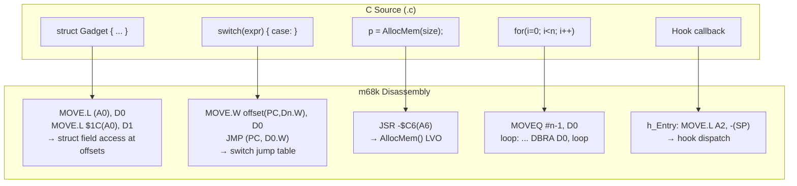
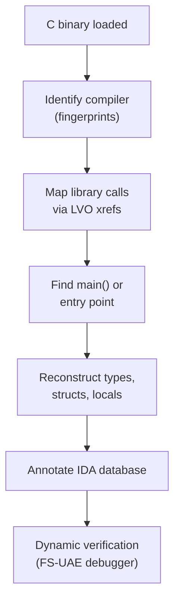

[← Home](../../README.md) · [Reverse Engineering](../README.md)

# ANSI C Reverse Engineering — Reconstructing C from m68k Assembly

## Overview

The vast majority of Amiga applications and libraries were written in C — SAS/C, GCC, VBCC, StormC, and Aztec C dominated the ecosystem from 1988 onward. Reversing C binaries means recognizing the **language semantics** underneath the compiler's code generation: struct field access patterns, switch-statement jump tables, `malloc`/`free` lifetime tracking, and control-flow reconstruction. Unlike hand-written assembly, C binaries leave a rich trail of standard-library calls, predictable stack-frame layouts, and relocatable data references that serve as anchors for reconstructing the original source-level intent.

C reverse engineering on Amiga has one huge advantage over other platforms: **the OS itself is written in C** (with assembly for hot paths). Nearly every data structure — `struct Task`, `struct MsgPort`, `struct IORequest` — is publicly documented in the NDK headers. When you see `MOVE.L $1C(A0), D0` and A0 is a library base, offset `$1C` is the `lib_OpenCnt` field. This tight coupling between disassembly patterns and known OS structures makes Amiga C RE uniquely tractable.



---

## Architecture: C-to-Assembly Mapping

### The Standard C ABI on Amiga

| Concern | Convention | Notes |
|---|---|---|
| **Return value** | D0 (32-bit), D0/D1 (64-bit), or hidden pointer in A0 | Struct returns: caller allocates space, passes pointer in A0 |
| **Scratch registers** | D0, D1, A0, A1 | Caller-saved; callee may destroy |
| **Preserved registers** | D2–D7, A2–A6 | Callee must save/restore if used |
| **Frame pointer** | A5 (SAS/C) or A6 (GCC with `-fomit-frame-pointer` skips this) | Used for local variable and argument access |
| **Stack growth** | Toward lower addresses | `LINK A5, #-N` allocates N bytes |
| **Library base** | A6 | Set to library base before `JSR LVO(A6)` |
| **Argument passing** | D0–D7, then stack (right-to-left push for SAS/C) | See [register_conventions.md](../../04_linking_and_libraries/register_conventions.md) |

### SAS/C Calling Convention Variants

SAS/C supports multiple calling conventions within a single binary. Recognizing them is essential for correct function boundary and parameter analysis:

| Convention | Keyword | Register Save | Parameter Passing | Prologue Pattern |
|---|---|---|---|---|
| **Standard** | `__stdargs` (default) | D2–D7, A2–A5 | D0, D1, then stack (right-to-left) | `LINK A5, #-N` / `MOVEM.L D2-D7/A2-A4, -(SP)` |
| **Register args** | `__reg` / `__regargs` | D2–D7, A2–A5 | First 2 integer args in D0, D1; rest on stack | Same as standard but D0/D1 hold parameters |
| **Save all** | `__saveds` | D2–D7, A2–A6 (every non-scratch register) | All on stack | `MOVEM.L D2-D7/A2-A6, -(SP)` at entry — distinctive 13-register save |
| **Interrupt** | `__interrupt` | D0–D7, A0–A6 (all registers) | All on stack | Full register save + `RTE` instead of `RTS` |
| **No stack check** | `__no_stack_check` | Varies | Varies | Omits the stack overflow check call at function entry |

**How to identify in disassembly**:

```asm
; __saveds function (typically used for interrupt handlers and callbacks):
_saveds_func:
    MOVEM.L D2-D7/A2-A6, -(SP)    ; 13 registers saved = __saveds signature
    ; ... function body ...
    MOVEM.L (SP)+, D2-D7/A2-A6    ; restore
    UNLK    A5
    RTS

; __reg function (fastcall — first args in registers):
_reg_func:
    LINK    A5, #-local_size
    MOVEM.L D2-D4, -(SP)          ; may save fewer registers
    ; D0 = first argument, D1 = second argument
    ; ... function body ...

; __stdargs function (standard C calling convention):
_std_func:
    LINK    A5, #-local_size
    MOVEM.L D2-D7/A2-A4, -(SP)    ; standard SAS/C save set
    ; Arguments on stack: (A5+8) = arg1, (A5+12) = arg2, ...
```

### Compiler-Specific Frame Layouts

| Compiler | Frame Pointer | Prologue | Epilogue | String Addressing |
|---|---|---|---|---|
| **SAS/C 6.x** | A5 | `LINK A5, #-N` / `MOVEM.L D2-D7/A2-A4, -(SP)` | `MOVEM.L (SP)+, D2-D7/A2-A4` / `UNLK A5` / `RTS` | Absolute (`MOVE.L #string, D1`) |
| **GCC 2.95.x** | A6 (optional) | `LINK A6, #-N` or `SUBQ.L #N, SP` | `UNLK A6` / `RTS` or `ADDQ.L #N, SP` / `RTS` | PC-relative (`LEA string(PC), A0`) |
| **VBCC** | None (typical) | `MOVEM.L D2-D4, -(SP)` (only used regs) | `MOVEM.L (SP)+, D2-D4` / `RTS` | PC-relative |
| **StormC** | A5 | `LINK A5, #-N` | `UNLK A5` / `RTS` | Absolute (similar to SAS/C) |
| **Aztec C** | A5 | `LINK A5, #-N` / `MOVEM.L D3-D7, -(SP)` | `MOVEM.L (SP)+, D3-D7` / `UNLK A5` / `RTS` | Absolute |

### Common C Constructs → Assembly

<!-- TODO: Expand — comprehensive pattern catalog, 30+ constructs -->

| C Construct | Typical m68k Pattern |
|---|---|
| `x = y + z` | `MOVE.L y(FP), D0` / `ADD.L z(FP), D0` / `MOVE.L D0, x(FP)` |
| `if (cond)` | `TST.L cond` / `BEQ skip` |
| `if (!ptr)` | `MOVE.L ptr, D0` / `BEQ null_case` |
| `for (i=0; i<n; i++)` | `MOVEQ #0, D7` / `loop: ...` / `ADDQ.L #1, D7` / `CMP.L n, D7` / `BLT loop` |
| `while (*p++)` | `MOVE.L (A0)+, D0` / `BNE loop` (combined load+increment+test) |
| `switch (x)` | `CMP` chain for sparse cases; `MOVE.W jt(PC, Dn.W), D0` / `JMP (PC, D0.W)` for dense |
| `struct->field` | `MOVE.L $offset(A0), D0` — offset matches `sizeof` of preceding fields |
| `array[i]` | `MOVE.L #array, A0` / `MOVE.L i, D0` / `ASL.L #2, D0` / `MOVE.L 0(A0, D0.W), D1` |
| `malloc(size)` → `AllocMem` | `MOVE.L size, D0` / `MOVE.L #MEMF_CLEAR, D1` / `JSR -$C6(A6)` |
| `free(ptr)` → `FreeMem` | `MOVE.L ptr, A1` / `MOVE.L size, D0` / `JSR -$D2(A6)` |
| `do { ... } while (cond)` | `loop: ...` / `TST cond` / `BNE loop` (test at bottom) |
| `goto label` | `BRA label` (unconditional) |
| `setjmp` / `longjmp` | `JSR _setjmp` / `JSR _longjmp` — saves/restores all registers + SP |
| `fn_ptr(args)` (function pointer call) | `MOVE.L fn_ptr, A0` / `JSR (A0)` |
| `printf(fmt, ...)` | Push args right-to-left, `JSR _printf` — no LVO, direct lib call |
| `sprintf` / `strcpy` chain | Repeated `MOVE.B (A0)+, (A1)+` with null termination check |
| `memcpy` (large) | `MOVE.L (A0)+, (A1)+` / `SUBQ.L #1, D0` / `BNE loop` |
| `memset` (zero/pattern fill) | `MOVE.L D0, (A0)+` / loop |
| `strcmp` / `strncmp` | `CMPM.B (A0)+, (A1)+` / `DBNE D0, loop` |
| `bsearch` / custom binary search | Midpoint calculation via `ADD.L`/`ASR.L`, compare, branch |
| `qsort` callback | Passes comparison function pointer; calls `JSR (A2)` per comparison |
| `static` local variable | Stored in DATA hunk (not stack); accessed via absolute or PC-relative addressing |
| `const` global (read-only data) | May be placed in CODE hunk alongside instructions |
| `volatile` access | Generates separate load/store for each access; never optimizes across register reuse |

### The BPTR: AmigaOS's Unique Pointer Type

**BPTR** (Byte Pointer) is a legacy from BCPL/Tripos that persists throughout AmigaOS. Understanding it is essential for DOS-related reverse engineering:

```c
/* BPTR definition from NDK headers:
 * A BPTR stores a word-aligned address shifted right by 2 bits.
 * BADDR(bptr) converts BPTR → real address: bptr << 2
 * MKBADDR(addr) converts real address → BPTR: addr >> 2
 */
#define BADDR(bptr)   ((APTR)((ULONG)(bptr) << 2))
#define MKBADDR(addr) ((BPTR)((ULONG)(addr) >> 2))
```

**In disassembly**:
```asm
; DOS call returning a BPTR (e.g., Lock() returns a BPTR file lock):
    JSR     -$54(A6)               ; Lock(name, mode) — returns BPTR in D0
    ; D0 now contains a BPTR, NOT a usable address!
    MOVE.L  D0, lock_bptr(FP)      ; store BPTR

; Later, to use this BPTR with another DOS call:
    MOVE.L  lock_bptr(FP), D1      ; pass BPTR directly to Examine(), UnLock(), etc.
    JSR     -$66(A6)               ; UnLock(bptr) — accepts BPTR directly

; To dereference a BPTR to access the underlying struct:
    MOVE.L  lock_bptr(FP), D0      ; D0 = BPTR
    LSL.L   #2, D0                 ; D0 = real address (BPTR << 2)
    MOVE.L  D0, A0                 ; A0 = real address of FileLock struct
    ; Now you can access A0->fl_Key, A0->fl_Volume, etc.
```

**Key RE identification**:
- `LSR.L #2, Dn` before a memory access = BPTR → address conversion (MKBADDR)
- `LSL.L #2, Dn` before a DOS call = address → BPTR conversion
- BPTRs are passed directly to DOS library calls without conversion (the library does the conversion internally)
- Common BPTR uses: file locks, directory locks, seglists (loaded executables), DOS process handles

> [!WARNING]
> Mistaking a BPTR for a real pointer and dereferencing it without the `<< 2` conversion will access the wrong address — 4× lower than intended. This is one of the most common errors in Amiga C RE.

### AmigaOS-Specific C Patterns

| OS Pattern | Disassembly Signature |
|---|---|
| **Hook callback** (`struct Hook`) | `h_Entry: MOVE.L A2, -(SP)` / ... / `RTS` — A2=object, A1=message, A0=hook |
| **Tag list processing** (`TagItem *`) | `loop: MOVE.L (A0)+, D0` / `BEQ end` — iterate `ti_Tag`+`ti_Data` pairs until `TAG_DONE` (0) |
| **BPTR dereference** | `LSL.L #2, D0` (BPTR→address) or `LSR.L #2, D0` (address→BPTR) — see BPTR section above |
| **LVO dispatch** | `JSR -$XXX(A6)` — library vector table call; offset encodes function |
| **Forbid/Permit pairs** | `JSR -$84(A6)` (Forbid) / `JSR -$8A(A6)` (Permit) — critical section markers |
| **Signal wait loops** | `MOVE.L sigmask, D0` / `JSR -$13E(A6)` (Wait) — blocking on signal bits |
| **Message port patterns** | `JSR -$180(A6)` (PutMsg) / `JSR -$174(A6)` (GetMsg) / `JSR -$17A(A6)` (WaitPort) |
| **Exec list traversal** | `MOVE.L (A0), A0` — follow `ln_Succ` (offset $00); `struct Node` / `struct List` iteration |
| **Device I/O** | `MOVE.L io, A1` / `JSR -$1C8(A6)` (DoIO) or `JSR -$1CE(A6)` (SendIO) + wait |
| **Resource tracking** | `JSR -$1E6(A6)` (OpenResource) followed by resource-specific dispatch |

---

## Decision Guide: C Binary Analysis Workflow



### When to Use C-Focused RE vs Alternatives

| Scenario | Approach |
|---|---|
| Binary has `LINK A5` / `JSR LVO(A6)` patterns | Standard C RE (this article) |
| Binary has no library calls, direct hardware access | See [asm68k_binaries.md](asm68k_binaries.md) |
| Binary has `__vtbl` references, `new`/`delete` patterns | See [cpp_vtables_reversing.md](cpp_vtables_reversing.md) |
| Binary is from AMOS, Blitz, or other non-C language | See [other_languages.md](other_languages.md) |
| Binary is packed/crunched | Unpack first; then re-evaluate |
| Binary is a shared library (.library) | Standard C RE + library structure analysis (RomTag, JMP table, MakeLibrary) |

---

## Methodology

### Phase 1: Compiler Identification

<!-- TODO: Expand — detailed cross-reference to compiler_fingerprints.md, compiler-specific prologue/epilogue catalogs, IDA Python script to auto-detect compiler from function entry patterns -->

Before anything else, determine the compiler. The register conventions, string addressing mode, and library call patterns differ substantially between SAS/C, GCC, and VBCC. See [compiler_fingerprints.md](../compiler_fingerprints.md) and [m68k_codegen_patterns.md](m68k_codegen_patterns.md) for the complete catalog.

### Phase 2: Library Call Anchoring

<!-- TODO: Expand — library call mapping walkthrough, LVO resolution, FD file cross-referencing -->

Every `JSR LVO(A6)` is an anchor point. Cross-reference the LVO offset against the [exec LVO table](../../14_references/exec_lvo_table.md) or [dos LVO table](../../14_references/dos_lvo_table.md). Once you know the function:
- **Input**: D0–D7 and stack arguments tell you the parameter types
- **Output**: D0 return value tells you what was computed
- **Context**: The surrounding code tells you *why* the call was made

### Phase 3: Struct Reconstruction

<!-- TODO: Expand — struct layout inference, offset pattern recognition, IDA struct type creation workflow -->

C struct access patterns are systematic: `MOVE.L $08(A0), D0` then `MOVE.L $0C(A0), D1` — repeated offsets that don't overlap suggest struct fields. See [struct_recovery.md](struct_recovery.md) for the complete methodology.

### Phase 4: Call Graph Reconstruction

<!-- TODO: Expand — function boundary identification, call tree, indirect call resolution, library call grouping by library -->

- **Identify function boundaries**: LINK/UNLK pairs, SUBQ/ADDQ pairs, or standalone RTS-terminated blocks
- **Build caller-callee matrix**: Every JSR target becomes a node; every JSR source is an edge
- **Resolve indirect calls**: `JSR (A0)` where A0 was loaded from a vtable or function pointer table
- **Group by library context**: Which library is A6 set to before each JSR LVO block?

### Phase 5: Type Inference

<!-- TODO: Expand — pointer vs integer disambiguation, signed/unsigned detection, struct pointer typing from field access patterns -->

- **Pointer vs integer**: A value used as a base register for offset addressing is a pointer. A value only used in arithmetic is an integer.
- **Signed vs unsigned**: `BLT`/`BGE` after compare = signed; `BCS`/`BCC` after operation = unsigned
- **Struct pointer typing**: Consistent offset patterns (+$00, +$04, +$08...) with known library struct sizes reveal the type
- **BPTR detection**: `LSR.L #2` before use as address = BPTR (BCPL byte pointer)

### Phase 6: Dynamic Verification

<!-- TODO: Expand — FS-UAE debugger: verify struct sizes, check library base values, confirm function parameter counts, breakpoint on AllocMem to track allocations -->

---

## Tool-Specific Workflows

<!-- TODO: Expand — detailed walkthroughs for each tool -->

### IDA Pro

<!-- TODO: IDA-specific: Hex-Rays decompiler output interpretation, struct type import from NDK headers, LVO enum creation, FLIRT signature generation for Amiga libraries -->

### Ghidra

<!-- TODO: Ghidra-specific: AmigaOS plugin setup, 68k decompiler quirks, struct import from C headers, script-based library call annotation -->

### FS-UAE Debugger

<!-- TODO: Dynamic verification methodology: breakpoint on specific LVOs, trace library call sequence, verify alloc/free pairing -->

---

## Best Practices

<!-- TODO: Numbered list of actionable recommendations -->

1. **Identify the compiler before anything else** — it determines your prologue/epilogue patterns, string addressing mode, and register conventions
2. **Map library calls first** — every `JSR LVO(A6)` is a documented function with known parameters; use this to type inputs and outputs
3. **Reconstruct structs from offset patterns** — consistent offset sequences reveal field layout
4. **Cross-reference NDK headers** — AmigaOS structs are publicly documented; match your discovered offsets to known structures
5. **Use the relocation table** — `HUNK_RELOC32` entries tell you exactly which absolute addresses are inter-hunk references
6. **Track A6 assignments** — each library call block sets A6 to a specific library base; identify which library is in use
7. **Decompile library calls to C prototypes** — rename `JSR -$C6(A6)` to `AllocMem()` in IDA, not `sub_1234`
8. **Verify with dynamic analysis** — breakpoint on suspicious code paths in FS-UAE to confirm your static analysis
9. **Document register conventions per function** — build a register map to catch type errors early
10. **Leverage HUNK_SYMBOL debug info** — if present, it gives you function names and sometimes local variable names

---

## Antipatterns

<!-- TODO: Add named antipatterns with broken/fixed code pairs -->

### 1. The Global Confusion

**Wrong**: Treating every absolute address as a global variable.

**Why**: SAS/C uses absolute addressing for globals (relocated at load), GCC uses PC-relative, and some addresses are actually hardware registers. Confusing `$DFF000` with a C global variable leads to nonsense decompilation.

<!-- TODO: Add bad/good code pair -->

### 2. The Void Pointer Over-Generalization

**Wrong**: Marking all unknown pointers as `void *`.

**Why**: Without type information, you lose the ability to see struct field access patterns. A pointer that's always offset by `+$08`, `+$0C`, `+$1C` is almost certainly a typed struct pointer.

<!-- TODO: Add bad/good code pair -->

### 3. The Missing Return

**Wrong**: Assuming every `RTS` marks the end of a meaningful function.

**Why**: Compilers sometimes tail-duplicate, merge epilogues, or generate multiple return points. A single C function may produce 3–5 `RTS` instructions in the assembly.

<!-- TODO: Add bad/good code pair -->

### 4. The Single-Library Assumption

**Wrong**: Assuming A6 always holds the same library base throughout the program.

**Why**: Real C programs switch A6 between exec, dos, intuition, graphics, and custom libraries. A `JSR -$C6(A6)` at one point in the code may call `AllocMem` (exec), while the same `JSR -$C6(A6)` after an A6 switch calls something entirely different. You must track A6 reloads.

<!-- TODO: Add bad/good code pair -->

### 5. The BPTR Blindness

**Wrong**: Treating `LSR.L #2, D0` / `MOVE.L (A0) based on D0` as a confusing bit-shift.

**Why**: BCPL legacy: AmigaOS uses byte pointers (BPTRs) for file handles, locks, and DOS structures. The `LSR.L #2` converts a BPTR (shifted by 2 for historical reasons) to a real word-aligned address. Missing this means you misidentify DOS API call results.

<!-- TODO: Add bad/good code pair -->

### 6. The Tag List Blind Spot

**Wrong**: Seeing a loop that processes `(A0)+` pairs and dismissing it as a custom iterator.

**Why**: Tag lists (`TagItem` arrays of `ti_Tag`/`ti_Data` pairs terminated by `TAG_DONE=0`) are used pervasively in AmigaOS. This is one of the most common patterns in Amiga C and a strong indicator you're looking at an OS API call setup.

<!-- TODO: Add bad/good code pair -->

### 7. The Signal Confusion

**Wrong**: Assuming a `Wait()` call with a magic constant is waiting on a single event.

**Why**: Signal bits are allocated dynamically via `AllocSignal()`. A `MOVE.L #$00001000, D0` / `JSR -$13E(A6)` (Wait) doesn't tell you what it's waiting for unless you trace where that signal bit was allocated and who sends it.

<!-- TODO: Add bad/good code pair -->

### 8. The Inline Copy Assumption

**Wrong**: Identifying every `MOVE.L (A0)+, (A1)+` loop as a custom `memcpy`.

**Why**: Compilers inline `memcpy` for small fixed sizes, but the same pattern also appears in struct copy operations, array initialization, and DMA buffer filling. The context (source/destination, loop count, surrounding code) tells you which.

<!-- TODO: Add bad/good code pair -->

---

## Pitfalls

### 1. Register Variable Aliasing

<!-- TODO: Add worked example -->

SAS/C with `__register` or GCC with `register` keyword may keep variables in registers across function calls, breaking the standard "arguments go on stack" mental model.

### 2. Inlined `memcpy` / `strcpy`

<!-- TODO: Add worked example — distinguishing compiler-inlined copy from hand-written copy -->

Compilers often inline small copies as `MOVE.L (A0)+, (A1)+` loops. These look like custom struct copy routines but are really compiler-generated `memcpy`.

### 3. Structure Padding

<!-- TODO: Add worked example — padding bytes creating misleading offset gaps -->

The m68k ABI aligns struct fields naturally: `UWORD` at even addresses, `ULONG` at multiples of 4. Compiler-inserted padding bytes create gaps in the offset sequence that can confuse field counting.

### 4. Compiler Optimizations That Break Pattern Recognition

<!-- TODO: Expand — tail-call optimization (JMP instead of JSR/RTS), loop unrolling, constant propagation, dead code elimination, function inlining -->

### 5. Library Base Switching

<!-- TODO: A6 changes between exec→dos→intuition→graphics; missing a reload means misidentifying every subsequent library call. Show how to detect A6 reloads (MOVE.L _IntuitionBase, A6). -->

### 6. Mixed C and Assembly in the Same Binary

<!-- TODO: Many Amiga programs use C for UI/logic and asm for performance. The boundary between C and asm sections requires switching analysis strategies. -->

### 7. SAS/C `__saveds` vs `__stdargs` vs `__reg` Calling Conventions

<!-- TODO: SAS/C supports multiple calling conventions within the same binary. `__saveds` (no register args), `__stdargs` (default), `__reg` (register params). Each generates different prologue/epilogue patterns. -->

### 8. GCC `__asm__` Inline Assembly Blocks

<!-- TODO: GCC inline asm can inject hand-tuned instructions into otherwise standard C prologue/epilogue frames. These look like compiler bugs but are intentional optimizations. -->

### 9. BSS vs DATA Confusion

<!-- TODO: BSS (zero-initialized) vs DATA (explicitly initialized) globals look identical in disassembly but differ in initialization — important for understanding program state at startup. -->

### 10. CLI vs WB Startup Path

<!-- TODO: Programs compiled for CLI (argc/argv) vs Workbench (WBStartup message) have fundamentally different entry points. Reversing the wrong path leads to misunderstanding the program's initialization. -->

### 11. SAS/C `#pragma` Anomalies

<!-- TODO: SAS/C pragmas can change code generation (amiga-align, donotcombine, etc.). Without knowing the pragmas, some codegen choices look like bugs. -->

---

## Use-Case Cookbook

### Pattern 1: Identifying `main()` Across Compilers

<!-- TODO: Step-by-step — entry point chain (startup code → main), SAS/C vs GCC vs VBCC main identification, argc/argv reconstruction. IDA Python script. -->

### Pattern 2: Reconstructing a `struct List` Traversal

<!-- TODO: Step-by-step — MinList/List identification from ln_Succ/ln_Pred offsets, loop pattern recognition, IDA struct type application. -->

### Pattern 3: Mapping AllocMem/FreeMem Pairs to Find Memory Leaks

<!-- TODO: Step-by-step — cross-reference all AllocMem calls, trace the returned pointer through the function, find matching FreeMem, flag unpaired allocations. IDA Python script. -->

### Pattern 4: Recovering `switch` Statement Cases

<!-- TODO: Step-by-step — dense vs sparse switch detection, jump table extraction, case value reconstruction from CMP chains, IDA/Ghidra switch idioms. -->

### Pattern 5: Reconstructing a Hook Callback Dispatch Chain

<!-- TODO: Step-by-step — identify Hook struct, trace h_Entry to the actual callback, map the callback parameters (A0=Hook*, A2=object, A1=message), identify what triggers the hook. -->

### Pattern 6: Identifying Open/Close Resource Pairs

<!-- TODO: Step-by-step — OpenLibrary paired with CloseLibrary, OpenDevice with CloseDevice, OpenResource with... nothing (resources are never closed). Tracking resource lifetimes. -->

### Pattern 7: Recovering the Startup Code Chain

<!-- TODO: Step-by-step — tracing from HUNK_HEADER entry to main(): startup module init (_StdOpen, _StdClose, etc.), CLI vs WB branch, argument setup, finding the real program logic. -->

### Pattern 8: Tracing Tag List Construction

<!-- TODO: Step-by-step — identifying TagItem arrays in DATA/BSS, mapping ti_Tag values to NDK constants (TAG_xxx), understanding what the tag list configures. -->

### Pattern 9: Decompiling Device I/O Sequences

<!-- TODO: Step-by-step — CreateIORequest → OpenDevice → DoIO/SendIO+WaitIO+CheckIO → CloseDevice → DeleteIORequest lifecycle reconstruction. -->

### Pattern 10: Reconstructing a Message Port Protocol

<!-- TODO: Step-by-step — CreateMsgPort → PutMsg/GetMsg → signal-based Wait → ReplyMsg → DeleteMsgPort; identifying the message format (custom struct with embedded Message). -->

### Pattern 11: Identifying SAS/C `__saveds` Functions

<!-- TODO: Step-by-step — `__saveds` prologue pattern (MOVEM.L with all regs), typical use in interrupt handlers and callback hooks, how to recognize and rename. -->

### Pattern 12: Differentiating `printf` Variants from Disassembly

<!-- TODO: Step-by-step — printf/Printf/kprintf/RawDoFmt/VPrintf — each has a different parameter convention, stack layout, and output destination. Identify which is which from the call site. -->

---

## Real-World Examples

<!-- TODO: Reference specific Amiga C applications with documented RE findings -->

### Applications

<!-- TODO: Directory Opus (SAS/C) — module system, ARexx integration; FinalWriter (SAS/C) — large C codebase with custom memory management; AmigaAMP (GCC) — plugin architecture, decoder interface; SimpleMail (VBCC) — lightweight compiled C; MUI applications (various compilers) — BOOPSI-based OOP in C. -->

### Libraries

<!-- TODO: reqtools.library, asl.library — C libraries with public FD files, good for learning library structure RE; mpega.library — GCC-compiled, FPU-heavy, decoder pipeline reconstruction. -->

### Games

<!-- TODO: "Settlers" (SAS/C) — large C game with custom blitter routines; "Frontier: Elite II" (hand-ported C) — mixed C and assembly; "Worms" (various compilers) — C core with assembly effects. -->

---

## Cross-Platform Comparison

| Platform | C RE Challenge | Amiga Difference |
|---|---|---|
| **DOS (Watcom/Borland)** | Segment juggling, near/far pointers | Amiga flat 32-bit address space simplifies pointer tracking |
| **Mac OS (MPW C)** | A5-world jump table, segmented loader | Amiga A6 per-library base is more modular |
| **Unix (GCC)** | Position-independent code (PIC), PLT/GOT | Amiga executables are non-PIC; relocations are explicit |
| **Windows (MSVC)** | `__stdcall` vs `__cdecl`, SEH frames | Amiga has single ABI; no calling convention variants |
| **Embedded ARM** | Thumb interworking, constant pools | m68k has no Thumb equivalent; constants are inline |
| **Linux (GCC)** | vDSO, IFUNC resolvers, symbol versioning | Amiga OS calls are flat JMP table; no symbol versioning |
| **Classic Mac OS (CodeWarrior)** | Transition vectors, mixed 68k/PPC | Amiga 68k is simpler; no mixed-ISA binaries until PowerUP/WarpOS |

---

## Historical Context — Why C Dominated Amiga Development

<!-- TODO: Expand — SAS/C's dominance (1988+), late arrival of GCC (mid-1990s), VBCC as lightweight alternative, Aztec C's early role, StormC bringing IDE + C/C++ integration. The transition from assembly to C as hardware got faster (68020+ made C performance acceptable). The role of NDK headers + autodocs in making C the standard Amiga programming language. -->

---

## Modern Analogies

<!-- TODO: Expand — connect Amiga C RE to modern developer experience -->

| Amiga C Concept | Modern Analogy | Where It Holds / Breaks |
|---|---|---|
| LVO dispatch table | Dynamic linker PLT/GOT | Holds: indirect function call table; breaks: LVO is static ABI, PLT is runtime-resolved |
| A6 library base | `this` pointer / vtable dispatch | Holds: base register for method/function lookup; breaks: A6 is shared, `this` is per-object |
| TagItem arrays | Named parameters / option structs in C | Holds: extensible key-value config passing; breaks: TagItems are untyped until consumed |
| BPTR | Handle / opaque pointer | Holds: abstracted pointer type; breaks: BPTR carries encoding (>>2), modern handles are transparent |
| `OpenLibrary` with version | `dlopen` with version check | Holds: runtime library loading; breaks: Amiga libraries are shared singletons |
| `Forbid`/`Permit` | `spin_lock` / `mutex_lock` | Holds: critical section entry/exit; breaks: Forbid disables ALL multitasking, not just one resource |
| Resident modules (RomTag) | Shared library constructors / `.init_array` | Holds: auto-initialized code at load time; breaks: RomTags are persistent kernel objects |

---

## FAQ

### Q1: How do I tell SAS/C from GCC output without looking at strings?

<!-- TODO -->

### Q2: Why does this function have no `LINK` but accesses locals?

<!-- TODO: Frame-pointer omission (GCC -fomit-frame-pointer, VBCC), leaf functions, register-only functions. -->

### Q3: How do I recover the original struct field names?

<!-- TODO: Match offset patterns to NDK headers; when no header exists, derive from usage context. -->

### Q4: How do I identify which library A6 currently points to?

<!-- TODO: Trace the most recent `MOVE.L _LibBase, A6` or library open sequence; use `lib_Node.ln_Name` at base+$0A if known. -->

### Q5: Why are there two different calling conventions in the same binary?

<!-- TODO: SAS/C __saveds vs __stdargs vs __reg; GCC vs asm hand-tuned sections; mixed compiler object files. -->

### Q6: How do I identify `printf` format strings in DATA?

<!-- TODO: Format string signature (%s, %d, %lx), xref from _printf call, format string argument position in the call setup. -->

### Q7: How do I decompile a BPTR-based DOS call sequence?

<!-- TODO: BPTR → real address conversion, Lock/UnLock/Examine/ExNext loop, DosPacket vs library call distinction. -->

### Q8: What does `JSR -$1CE(A6)` mean without the LVO table?

<!-- TODO: Negative offset from A6 = library LVO call. Calculate which LVO from the offset; match to exec/dos/intuition LVO tables. -->

### Q9: How do I handle programs compiled with Lattice C (pre-SAS/C)?

<!-- TODO: Lattice C 3.x/4.x patterns, differences from SAS/C 5.x/6.x, Manx Aztec C similarities. -->

### Q10: How do I identify custom `AllocMem` wrappers?

<!-- TODO: Many programs wrap AllocMem in their own allocator (pool, zone, slab). Identify the wrapper by its AllocMem call, then trace all callers to map the allocation strategy. -->

### Q11: How do I tell if a struct is from the OS or custom?

<!-- TODO: Match field offsets against NDK struct definitions; custom structs won't match known OS layouts. OS structs have predictable field orders documented in the RKRM. -->

### Q12: What are the SAS/C `#pragma` directives that affect codegen?

<!-- TODO: amiga-align, donotcombine, amicall, stackextent, etc. — how to detect their effects in disassembly. -->

---

## FPGA / Emulation Impact

<!-- TODO: Expand — compiler-emitted code assumptions about CPU speed, self-modifying code in C (rare but exists via function pointer tables in writable memory), timing-dependent code generated by older compilers, 68000 vs 68020+ code path differences in compiler output. -->

---

## References

- [compiler_fingerprints.md](../compiler_fingerprints.md) — Compiler identification
- [**Per-Compiler RE Field Manuals**](compilers/README.md) — In-depth per-compiler analysis:
  - [SAS/C](compilers/sasc.md) · [GCC](compilers/gcc.md) · [VBCC](compilers/vbcc.md) · [StormC](compilers/stormc.md) · [Aztec C](compilers/aztec_c.md) · [Lattice C](compilers/lattice_c.md) · [DICE C](compilers/dice_c.md)
- [m68k_codegen_patterns.md](m68k_codegen_patterns.md) — Code generation idiom catalog
- [struct_recovery.md](struct_recovery.md) — Struct layout reconstruction
- [api_call_identification.md](api_call_identification.md) — Library call recognition
- [asm68k_binaries.md](asm68k_binaries.md) — Hand-written assembly RE
- [cpp_vtables_reversing.md](cpp_vtables_reversing.md) — C++ OOP RE
- [register_conventions.md](../../04_linking_and_libraries/register_conventions.md) — m68k ABI on AmigaOS
- [library_structure.md](../../04_linking_and_libraries/library_structure.md) — Library internals and JMP table layout
- [startup_code.md](../../04_linking_and_libraries/startup_code.md) — CLI vs WB startup
- [exec_lvo_table.md](../../14_references/exec_lvo_table.md) — exec.library LVO offsets
- [dos_lvo_table.md](../../14_references/dos_lvo_table.md) — dos.library LVO offsets
- *Amiga ROM Kernel Reference Manual: Libraries* — Function signatures
- *Amiga ROM Kernel Reference Manual: Devices* — Device I/O protocol
