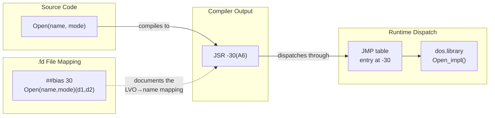

[← Home](../../README.md) · [Reverse Engineering](../README.md)

# Identifying OS API Calls in Disassembly

## Overview

You are staring at a disassembly listing of an unknown Amiga binary. You see `JSR (-$48,A6)` and have no idea what it calls. Multiply this by a thousand such instructions across the binary, and you realize: **without a systematic way to identify every OS call, reverse engineering an Amiga program is impossible.**

The AmigaOS library calling convention encodes every public function as a negative byte offset from a library base pointer — the **Library Vector Offset (LVO)**. If you know which library base lives in `A6` and what LVO is being called, you know exactly what the code does. This article covers the complete methodology: from raw `JSR (-N,A6)` to a fully annotated disassembly where every OS call is named.



---

### What is a Shared Library?

On AmigaOS, a **shared library** is a block of code loaded into RAM once and shared by every program that needs it. Programs don't link the OS code into their own executable — they call it indirectly at runtime. This keeps executables small and allows the OS to be upgraded without relinking every application.

Examples: `dos.library`, `graphics.library`, `intuition.library`.

### What is a Library Base?

When you open a library, exec returns a pointer to the **library base** — a `struct Library` that lives in RAM. Immediately *before* this pointer (at negative offsets) sits the **JMP table**: a sequence of `JMP <address>` instructions, one per library function.

```
Memory layout:

lib_base - 30:  JMP Open_impl        ← first user function
lib_base - 24:  JMP Reserved
lib_base - 18:  JMP Expunge
lib_base - 12:  JMP Close
lib_base -  6:  JMP Open (standard)
lib_base +  0:  struct Library       ← pointer returned by OpenLibrary()
lib_base +  N:  private library data
```

Every program that wants to call `dos.library Open()` stores the library base somewhere and calls `JSR -30(A6)`, where A6 holds the library base.

---

## What is an LVO?

**LVO** stands for **Library Vector Offset**. It is the negative byte offset from the library base to a specific function's JMP table slot.

The formula is:
```
LVO = −6 × (slot_index + 1)

slot 0 (Open standard):  −6
slot 1 (Close standard): −12
slot 2 (Expunge):        −18
slot 3 (Reserved):       −24
slot 4 (first user fn):  −30   ← dos.library Open()
slot 5:                  −36   ← dos.library Close()
...
```

So `JSR -30(A6)` means "call the function at LVO −30 in the library whose base is in A6." Every unique LVO in every library maps to exactly one function.

### Why Negative Offsets?

The JMP table grows **downward** in memory from the library base. Using negative offsets means programs only need to store a single pointer (the library base) and derive all function entry points from it with a constant displacement. This is the same trick used by C++ vtables.

---

## What is an .fd File?

**`.fd` files** (Function Descriptor files) are part of the Amiga NDK (Native Developer Kit). They are simple text files that declare every public function in a library: its name, argument registers, and LVO (called the **bias** in `.fd` terminology).

### Example: `dos_lib.fd` (excerpt)

```
##base _DOSBase
##bias 30
##public
Open(name,accessMode)(d1,d2)
##bias 36
Close(file)(d1)
##bias 42
Read(file,buffer,length)(d1,d2,d3)
##bias 48
Write(file,buffer,length)(d1,d2,d3)
##bias 54
Input()(-)
##bias 60
Output()(-)
##bias 138
Delay(timeout)(d1)
```

Reading this:
- `##base _DOSBase` — the global variable that holds the library base
- `##bias 30` — the **positive** bias; the actual call offset is `−30`
- `Open(name,accessMode)(d1,d2)` — function name, argument names, and the registers each argument goes in

So `##bias 30` means LVO `−30`. When you see `JSR (-30,A6)` in disassembly and A6 holds `DOSBase`, that is `dos.library Open()`.

### Where are .fd files?

In the NDK39 distribution at:
```
NDK39/
  fd/
    dos_lib.fd
    exec_lib.fd
    graphics_lib.fd
    intuition_lib.fd
    ...
```

They are plain text — open any with a text editor.

---

## The Canonical Call Pattern

Every AmigaOS library call in disassembly looks like this:

```asm
MOVEA.L  (_DOSBase).L, A6    ; (1) load the library base into A6
JSR      (-30,A6)            ; (2) call function at LVO -30 = Open()
; D0 now contains the return value
```

Sometimes the base is loaded once and reused:
```asm
MOVEA.L  (_DOSBase).L, A6
JSR      (-30,A6)     ; Open
...
; A6 still holds DOSBase — no reload needed
JSR      (-48,A6)     ; Write
```

And for `exec.library`, programs often use the fixed address `$4` directly:
```asm
MOVEA.L  4.W, A6             ; exec.library base is always at $4
MOVEQ    #40, D0             ; minimum version
LEA      _str_dos(PC), A1    ; "dos.library"
JSR      (-552,A6)           ; exec.library OpenLibrary(A1,D0)
MOVE.L   D0, _DOSBase        ; save result for later
```

---

## Step-by-Step: Tracing OS Calls in IDA Pro

### Step 1 — Find OpenLibrary calls at startup

Search for `JSR (-552,A6)` — that is always `exec.library OpenLibrary`. The instruction immediately before it loads A1 with a library name string.

```asm
LEA      (_str_dos).L, A1     ; → xref this to see "dos.library"
MOVEQ    #40, D0
MOVEA.L  4.W, A6
JSR      (-552,A6)            ; OpenLibrary("dos.library", 40)
MOVE.L   D0, (_DOSBase).L     ; ← label this global "_DOSBase"
```

Press `N` in IDA on the `_DOSBase` write to name the variable.

### Step 2 — Find all reads of that library base

Press `X` on `_DOSBase` to show all cross-references. Each xref is either a write (the open) or a read (before a JSR).

### Step 3 — Resolve each JSR to a function name

For each `JSR (-N,A6)` where A6 holds `_DOSBase`:
1. Look up `N` in `dos_lib.fd` under `##bias N`
2. Read the function name
3. Press `N` in IDA on the JSR instruction's displacement to annotate it

After annotation:
```asm
MOVEA.L  (_DOSBase).L, A6
JSR      (Open,A6)           ; was: JSR (-30,A6)
```

### Step 4 — Note argument registers

From `dos_lib.fd`:
```
Open(name,accessMode)(d1,d2)
```
So immediately before the JSR:
- `D1` is loaded with the filename pointer
- `D2` is loaded with the access mode (`MODE_OLDFILE` = 1005, `MODE_NEWFILE` = 1006)

---

## Quick LVO Reference: dos.library

| LVO | Bias | Function | Args | Return |
|---|---|---|---|---|
| −30 | 30 | `Open` | D1=name, D2=mode | D0=BPTR handle (0=fail) |
| −36 | 36 | `Close` | D1=handle | — |
| −42 | 42 | `Read` | D1=handle, D2=buf, D3=len | D0=actual (−1=fail) |
| −48 | 48 | `Write` | D1=handle, D2=buf, D3=len | D0=actual |
| −54 | 54 | `Input` | — | D0=stdin handle |
| −60 | 60 | `Output` | — | D0=stdout handle |
| −66 | 66 | `IoErr` | — | D0=last error code |
| −78 | 78 | `CreateDir` | D1=name | D0=lock |
| −84 | 84 | `CurrentDir` | D1=lock | D0=old lock |
| −90 | 90 | `Lock` | D1=name, D2=mode | D0=lock |
| −96 | 96 | `UnLock` | D1=lock | — |
| −102 | 102 | `DupLock` | D1=lock | D0=new lock |
| −108 | 108 | `Examine` | D1=lock, D2=fib | D0=bool |
| −120 | 120 | `ExNext` | D1=lock, D2=fib | D0=bool |
| −126 | 126 | `Info` | D1=lock, D2=infoblock | D0=bool |
| −132 | 132 | `Execute` | D1=string, D2=input, D3=output | D0=bool |
| −138 | 138 | `Delay` | D1=ticks | — |
| −144 | 144 | `DateStamp` | D1=datestamp | D0=datestamp |
| −150 | 150 | `Exit` | D1=returnCode | — |
| −156 | 156 | `LoadSeg` | D1=name | D0=seglist |
| −162 | 162 | `UnLoadSeg` | D1=seglist | — |

## Quick LVO Reference: exec.library (selected)

| LVO | Bias | Function | Args | Return |
|---|---|---|---|---|
| −6 | 6 | `Supervisor` | A5=func | — |
| −120 | 120 | `Forbid` | — | — |
| −126 | 126 | `Permit` | — | — |
| −132 | 132 | `Disable` | — | — |
| −138 | 138 | `Enable` | — | — |
| −168 | 168 | `FindTask` | A1=name | D0=task |
| −174 | 174 | `SetTaskPri` | A1=task, D0=pri | D0=old |
| −192 | 192 | `Signal` | A1=task, D0=signals | — |
| −198 | 198 | `AllocMem` | D0=size, D1=attrs | D0=ptr |
| −210 | 210 | `FreeMem` | A1=ptr, D0=size | — |
| −234 | 234 | `Wait` | D0=signals | D0=set |
| −270 | 270 | `AddPort` | A1=port | — |
| −276 | 276 | `FindName` | A0=list, A1=name | D0=node |
| −378 | 378 | `PutMsg` | A0=port, A1=msg | — |
| −384 | 384 | `GetMsg` | A0=port | D0=msg |
| −408 | 408 | `WaitPort` | A0=port | D0=msg |
| −420 | 420 | `SetFunction` | A1=lib, A0=lvo, D0=func | D0=old |
| −552 | 552 | `OpenLibrary` | A1=name, D0=ver | D0=base |
| −558 | 558 | `CloseLibrary` | A1=lib | — |

Full tables: [[lvo_table.md](../../04_linking_and_libraries/lvo_table.md)](../../../04_linking_and_libraries/lvo_table.md)

---

## Automated IDA Script

```python
# apply_dos_lvos.py — run from IDA's File → Script command
import idaapi, idc, idautils

DOS_LVO = {
    -30: "Open",   -36: "Close",   -42: "Read",    -48: "Write",
    -54: "Input",  -60: "Output",  -66: "IoErr",   -132: "Execute",
    -138: "Delay", -156: "LoadSeg",-162: "UnLoadSeg",
}

EXEC_LVO = {
    -120: "Forbid",   -126: "Permit", -132: "Disable",  -138: "Enable",
    -198: "AllocMem", -210: "FreeMem",-234: "Wait",
    -378: "PutMsg",   -384: "GetMsg", -408: "WaitPort",
    -420: "SetFunction", -552: "OpenLibrary", -558: "CloseLibrary",
}

def apply_lvos(lib_global_name, lvo_map):
    ea = idc.get_name_ea_simple(lib_global_name)
    if ea == idc.BADADDR:
        print(f"Global {lib_global_name} not found")
        return
    lib_ptr = idc.get_wide_dword(ea)
    for lvo, name in lvo_map.items():
        jmp_ea  = lib_ptr + lvo
        # JMP ABS.L opcode: 4EF9, target at +2
        target  = idc.get_wide_dword(jmp_ea + 2)
        if target != 0xFFFFFFFF:
            idc.set_name(target, f"{lib_global_name[1:]}_{name}",
                         idaapi.SN_NOWARN)
            print(f"  {lvo:+5d} → {name} @ {target:#010x}")

apply_lvos("_DOSBase",  DOS_LVO)
apply_lvos("_SysBase",  EXEC_LVO)
```

---

## Identifying Unknown Library Calls

If you encounter `JSR (-N,A6)` and don't know which library A6 holds:

1. Trace A6 backward in IDA (`View → Register tracking`) to its last write
2. The write is `MOVEA.L (some_global).L, A6` — name that global
3. Trace *that* global backward to its `MOVE.L D0, ...` after an `OpenLibrary` call
4. The string argument to OpenLibrary names the library
5. Look up LVO `−N` in the matching `.fd` file

---

## Decision Guide — Which Lookup Method?

When you encounter `JSR (-N,A6)`, you have multiple ways to resolve the call. Choose based on what you know:

```mermaid
graph TD
    Q[\"JSR -N,A6 —<br/>what does it call?\"/]
    Q -->|\"A6 is a known library base?\"| KNOWN["Look up N in<br/>that library's .fd file"]
    Q -->|\"A6 is unknown\"| TRACE["Trace A6 back<br/>to its source"]
    TRACE -->|\"Found global+OpenLibrary\"| ID["Identify library<br/>from string arg"]
    ID --> KNOWN
    TRACE -->|\"Can't trace\"| HEUR["Heuristic:<br/>LVO in common ranges?"]
    HEUR -->|\"-30 to -300\"| DOS["Likely dos.library"]
    HEUR -->|\"-120 to -558\"| EXEC_LIKELY["Likely exec.library"]
    HEUR -->|\"Other\"| SEARCH["Search all .fd files<br/>for matching bias"]
```

| Method | Speed | Accuracy | When to Use |
|---|---|---|---|
| **Known A6 + .fd lookup** | Instant | 100% | You've already identified the library base |
| **Trace A6 + find OpenLibrary** | ~2 min | 100% | Unknown library base, need certainty |
| **LVO range heuristic** | ~10 sec | ~80% | Quick triage, common LVOs overlap |
| **Grep all .fd files** | ~1 min | 95% | Unknown library, LVO not in common ranges |

---

## Named Antipatterns

### 1. \"The Kitchen Sink LVO Table\"

**What it looks like** — loading a massive precomputed table covering every LVO in every library into IDA, then blindly applying it without verifying A6:

```python
# BROKEN — applies ALL LVOs globally, ignores which library A6 holds
for lvo, name in ALL_LVOS.items():
    idc.set_name(base + lvo, name)  # wrong: base = Who knows?
```

**Why it fails:** A6 could hold `DOSBase`, `GfxBase`, or `IntuitionBase` at any point. An LVO `-30` means `dos.library Open()` only when A6=`DOSBase`. Applied to `GfxBase`, it's `graphics.library BltBitMap()` — completely different. You get a disassembly full of confidently wrong labels.

**Correct:** Always identify A6's library first, then apply that specific library's LVO map:

```python
if get_name(global_ptr) == "_DOSBase":
    apply_lvos(lib_base, DOS_LVO)
elif get_name(global_ptr) == "_GfxBase":
    apply_lvos(lib_base, GFX_LVO)
```

### 2. \"The Ghost Library\"

**What it looks like** — assuming the first `JSR (-N,A6)` after a `MOVEA.L 4.W, A6` uses the exec library base, but A6 was overwritten between the load and the call:

```asm
MOVEA.L  4.W, A6            ; exec base — but this is never used
MOVEA.L  (_DOSBase).L, A6   ; A6 overwritten with DOS base
JSR      (-552,A6)          ; WRONG assumption: this is NOT exec OpenLibrary
                            ; Correct: LVO -552 for dos.library is ExAll
```

**Why it fails:** The disassembler shows `JSR (-552,A6)` and annotates it as `exec.library OpenLibrary()` because that's the most common match. But A6 was reloaded with `_DOSBase` — the actual call is `dos.library ExAll()` at LVO `-552`. Same LVO, different library, completely different behavior.

**Correct:** Track A6's value at every `JSR`. Never assume A6 is static across a function.

```asm
MOVEA.L  4.W, A6            ; A6 = SysBase (verified: exec at $4)
MOVEA.L  (_DOSBase).L, A6   ; A6 = DOSBase (verified: global labeled)
JSR      (-552,A6)          ; LVO -552 in dos.library = ExAll
```

### 3. \"The Stale Base\"

**What it looks like** — calling through A6 after `CloseLibrary()`:

```c
// BROKEN
CloseLibrary(DOSBase);
if (result)
    DOSBase->DoSometime();  // DOSBase is now stale — crash or call into freed memory
```

In disassembly, you see `JSR (-N,A6)` after a `JSR (-558,A6)` (CloseLibrary). A6 becomes a dangling pointer. Any subsequent call through it hits freed memory — a crash or, worse, silent corruption.

**Correct:** After `CloseLibrary`, zero the base pointer. In the disassembly, flag any `JSR` that follows a `CloseLibrary` sequence as suspicious.

---

## Pitfalls

### 1. LVO Collisions Across Libraries

**The bug:**

```asm
MOVEA.L  (_IntuitionBase).L, A6
JSR      (-42,A6)           ; Is this Read()? No!
```

**Why:** LVO `-42` is `dos.library Read()` AND `intuition.library DrawImageState()` AND `graphics.library RectFill()`. LVOs are only unique within a single library.

**Correct:** The library base in A6 disambiguates. Always label the library base global first, then resolve LVOs.

### 2. Private LVOs in Third-Party Libraries

**The bug:** Using NDK `.fd` files to resolve calls to a third-party library (e.g., `Miami.library`, `muimaster.library`). The NDK doesn't document these — the LVO table won't match.

**Correct:** Third-party libraries require third-party `.fd` files. Search Aminet for `"libraryname" fd` or reconstruct the LVO table from the library binary itself (see [library_jmp_table.md](library_jmp_table.md)).

### 3. Inline Variants — Bypassing the JMP Table

**The bug:**

```asm
MOVEA.L  (_DOSBase).L, A6
MOVEA.L  (-30,A6), A0       ; read JMP table entry (NOT the JMP itself)
JSR      (A0)               ; call directly — you won't see LVO -30 here
```

**Why:** Some compilers (especially GCC with `-fbaserel`) inline the JMP table read. The `JSR (A0)` has no static LVO that grep can match. You must trace A0 back to the `MOVEA.L (-30,A6),A0` to recover the LVO.

**Correct:** When you see `JSR (A0)` or `JSR (An)` with a register, check the immediately preceding instruction for a `MOVEA.L (-N, A6), An` — that `-N` is your LVO.

---

## Use-Case Cookbook

### Find All File I/O Operations

To identify every file open/read/write/close in a binary:

1. Search for `JSR (-552,A6)` (exec OpenLibrary) and identify the `dos.library` open
2. Label the resulting global `_DOSBase`
3. Xref `_DOSBase` — every read is a function that uses dos.library
4. Filter for `JSR (-30,A6)` (Open), `JSR (-42,A6)` (Read), `JSR (-48,A6)` (Write), `JSR (-36,A6)` (Close)
5. Cross-reference the `D1` register before each Open call to identify **which files** are being opened

### Find All Memory Allocations

1. Search for `JSR (-198,A6)` where A6=`SysBase` (exec AllocMem)
2. Note `D0` (size) and `D1` (attributes — `MEMF_CHIP` = `$0002`, `MEMF_FAST` = `$0004`, `MEMF_CLEAR` = `$10000`)
3. Identify allocations that request Chip RAM — these are for audio buffers, copper lists, or bitplanes
4. Trace the returned pointer in `D0` to find what the allocation is used for

### Trace an Unknown Message Flow

1. Find `JSR (-378,A6)` (exec PutMsg) — identifies message senders
2. Find `JSR (-384,A6)` (exec GetMsg) — identifies message receivers
3. Find `JSR (-408,A6)` (exec WaitPort) — identifies blocking receivers
4. Trace `A0` before each `PutMsg` to identify **which port** the message targets
5. Trace `A0` before each `GetMsg` to identify **which port** the receiver listens on
6. If sender and receiver port names match, you've found a communication pair

### Map an Application's Library Dependencies

```python
# IDA Python: dump every library used by a binary
import idautils, idc

def find_library_opens():
    """Find all OpenLibrary calls and print library names."""
    for ea in idautils.Heads():
        if idc.print_insn_mnem(ea) == 'JSR':
            # Check if A6 register is used (LVO-style call)
            op = idc.print_operand(ea, 0)
            if 'A6' in op and '-552' in op:  # OpenLibrary
                # Walk back to find LEA with string
                prev = idc.prev_head(ea)
                if idc.print_insn_mnem(prev) == 'LEA':
                    str_addr = idc.get_operand_value(prev, 0)
                    lib_name = idc.get_strlit_contents(str_addr)
                    if lib_name:
                        print(f"  {idc.here():08X}: OpenLibrary({lib_name.decode()})")

find_library_opens()
```

---

## Cross-Platform Comparison

| AmigaOS Concept | Win32 Equivalent | Linux ELF Equivalent | Notes |
|---|---|---|---|
| LVO-based library call (`JSR -30(A6)`) | IAT (Import Address Table) thunk | PLT (Procedure Linkage Table) stub | Both use indirection; Amiga's is register+offset, modern OSes use memory-based tables |
| `.fd` file (function descriptor) | `.lib` import library + `GetProcAddress` | `.so` ELF symbol table | `.fd` files are human-readable text; PE/ELF symbol tables are binary |
| `OpenLibrary("dos.library", 36)` | `LoadLibrary("kernel32.dll")` | `dlopen("libc.so.6", ...)` | Same pattern: load by name, get base pointer, resolve functions |
| Library base in A6 | DLL base address in EAX/RAX | Shared object handle from `dlopen` | Amiga uses a dedicated register convention; Win32/Linux use a variable |
| JMP table at negative offsets | IAT entries at RVA offsets | `.got.plt` entries | Amiga's table grows downward from base; PE/ELF tables are at positive offsets |
| No runtime linking required (ROM libraries always present) | Delay-load DLLs | Lazy binding via `LD_BIND_NOW` | Amiga ROM libraries are always mapped — no load failure possible |

---

## FAQ

### How do I identify library calls without .fd files?

If the library is a standard AmigaOS library, `.fd` files are in `NDK39/fd/`. For third-party libraries, search the binary for the JMP table using `4EF9` (the `JMP ABS.L` opcode) clustered at regular 6-byte intervals. See [library_jmp_table.md](library_jmp_table.md).

### What if the binary uses a custom calling convention?

Some demos and games bypass the OS calling convention entirely — they call library functions directly by address (no LVO indirection). This is usually done for speed or obfuscation. In these cases, identify calls by the address falling within a known library's code segment, not by LVO pattern.

### Why does the LVO look wrong — it's not a multiple of 6?

Check the `.fd` file's `##bias` value. Bias = `|LVO|`. So `##bias 30` → LVO `−30` → slot 4 (`30÷6−1`). If you see `JSR (-$1E,A6)`, convert to decimal: `-30`. The hex `$1E` = 30 decimal. Always work in decimal when matching `.fd` biases.

### Can the same LVO appear in two different registers?

Yes. `JSR (-30,A5)` and `JSR (-30,A6)` are different calls if A5 and A6 hold different library bases. The LVO alone does not identify the call — the **register + LVO pair** does.

---

## References

- NDK39: `fd/` directory — all library `.fd` files (plain text, open in any editor)
- [lvo_table.md](../../04_linking_and_libraries/lvo_table.md) — formatted LVO tables
- `static/library_jmp_table.md` — JMP table layout and IDA scripting
- [fd_files.md](../../04_linking_and_libraries/fd_files.md) — `.fd` file format specification
- ADCD 2.1 Autodocs online: http://amigadev.elowar.com/read/ADCD_2.1/
