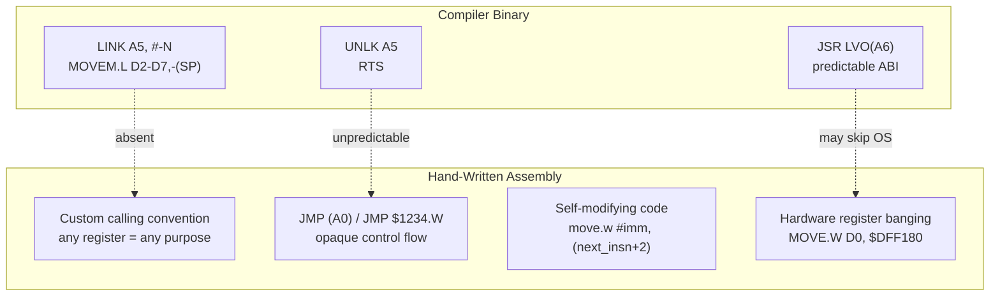
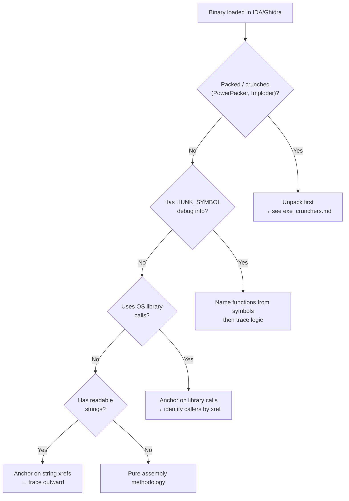

[← Home](../../README.md) · [Reverse Engineering](../README.md)

# Hand-Written Assembly Reverse Engineering — Pure m68k Binaries

## Overview

Unlike compiler-generated code with predictable prologues, frame-pointer conventions, and library-call idioms, hand-written 68000 assembly is **unconstrained**. The author may use any register for any purpose, invent ad-hoc calling conventions, self-modify code, or jump into the middle of instructions. This is the norm for Amiga demos, most pre-1990 games, trackmos, bootblock intros, and hardware-banging utilities — and it demands a fundamentally different reversing strategy than C/C++ binaries.



---

## Architecture

### What Makes Hand-Written Assembly Different

| Trait | Compiler Output | Hand-Written Assembly |
|---|---|---|
| **Function boundaries** | `LINK`/`UNLK` or `SUBQ`/`ADDQ` pairs | No universal marker; code may flow into data |
| **Calling convention** | Standard ABI (A6=lib base, D0/D1=scratch, A0/A1=scratch) | Author-defined per routine; may repurpose any register |
| **Strings** | `dc.b "text",0` with cross-reference chains | May be XOR-obfuscated, embedded mid-instruction, or stored as bitmaps |
| **Library calls** | `JSR LVO(A6)` with reloc entries | May call via absolute address, JMP table, or custom trap |
| **Loop structures** | `DBcc Dn, label` (counted) or `TST/BEQ` (conditional) | May unroll completely, use address-range compares, or rely on raster timing |
| **Data embedding** | Separate `DATA` hunk | Routinely mixed with code; data tables inside branch-not-taken paths |

### Common Environments

- **Bootblock intros** (1024 bytes, no OS): All registers free, hardware banging only
- **Trackmos / demos**: Often take over the system entirely; disable multitasking; use custom copper lists and blitter queues
- **Games (pre-1992)**: Usually bypass `graphics.library` for speed; hit hardware registers directly
- **Hardware drivers**: Heavy CIA/custom chip register manipulation; interrupt-driven
- **Virus / bootblock payloads**: Deliberately obfuscated; anti-debugging tricks
- **Cracktros / trainer menus**: Small (<4 KB), pre-launch patches to game code, often packed
- **Trackdisk loaders**: Custom DMA-driven disk reading; Rob Northen (RNC) loaders, raw MFM decoders
- **Non-HUNK binaries**: Raw absolute-load code at fixed addresses (e.g., `$C00000` for trapdoor Fast RAM)
- **ROM-resident code**: Kickstart modules, expansion ROMs (DiagROM, SCSI controller firmware)
- **Self-relocating code**: Code that copies and patches itself to run at any address

### The Assembly Author's Toolkit — Common Patterns Across the Demoscene

These patterns recur across hundreds of hand-written Amiga productions. Recognizing them accelerates function identification and purpose deduction.

#### Hardware Base Pointer Convention

Most authors dedicate a register to `$DFF000` for the entire program lifetime. The choice of register is often an **author fingerprint**:

| Register | Common Users | Notes |
|---|---|---|
| **A4** | Majority of demoscene productions | `LEA $DFF000, A4` at program start; all hardware writes use `MOVE.W Dn, $offset(A4)` |
| **A5** | Some demos, trackmos | May conflict with SAS/C A5 frame pointer convention in mixed C+asm code |
| **A6** | Rare — conflicts with exec library base | Only used when the program never calls exec and A6 is freed |

```asm
; The classic demoscene init pattern:
; Save OS registers, take over the machine
MOVE.W  $DFF01C, old_intena    ; save INTENA state
MOVE.W  #$7FFF, $DFF09A        ; disable all interrupts
MOVE.W  #$7FFF, $DFF09C        ; clear all interrupt requests
LEA     $DFF000, A4             ; A4 = custom chip base for entire program
; Now all hardware writes are: MOVE.W D0, $XXX(A4)
```

#### Custom Register Offset Tables

Precomputed address tables indexed by effect number dispatch hardware writes without runtime calculation:

```asm
; Effect dispatcher via offset table:
effect_dispatch:
    MOVE.W  effect_num(PC), D0
    ADD.W   D0, D0               ; word index
    MOVE.W  effect_offsets(PC, D0.W), D0
    JMP     (PC, D0.W)           ; jump to effect handler

effect_offsets:
    DC.W    fx_plasma - effect_offsets
    DC.W    fx_rotozoom - effect_offsets
    DC.W    fx_vector3d - effect_offsets
    DC.W    fx_tunnel - effect_offsets
```

#### Cycle-Counted Sequences

Instruction sequences timed to exact 68000 CPU cycles for per-scanline effects:

```asm
; Color change per scanline — 4-cycle loop (on 68000, fastest possible):
; Each color register write needs: MOVE.W Dn, (Am) = 8 cycles
; Plus: DBF D7, loop = 10 cycles (taken), 12 cycles (not taken)
; A full scanline is ~227 color clocks / 454 CPU cycles on PAL
; This limits color changes to ~50 per scanline at best
raster_colors:
    MOVE.W  (A0)+, (A4)          ; write next color to COLOR00 ($DFF180)
    DBF     D7, raster_colors    ; 10 cycles when taken
```

#### MOVEM.L Bulk Save/Restore

56-byte register dumps to stack for non-standard register preservation — used when a routine needs to save/restore an unusual subset of registers:

```asm
; Save D0-D7 and A0-A6 to stack (15 registers × 4 = 60 bytes):
    MOVEM.L D0-D7/A0-A6, -(SP)
    ; ... body of interrupt handler or complex effect ...
    MOVEM.L (SP)+, D0-D7/A0-A6
    RTE
```

#### Hand-Optimized Idioms That Confuse Disassemblers

| Idiom | What It Does | Disassembly Trap |
|---|---|---|
| `ADD.W Dn, Dn` | `ASL.W #1, Dn` (multiply by 2) | IDA shows `ADD.W` — the shift intent is invisible |
| `SUB.W Dn, Dn` | `MOVEQ #0, Dn` (clear register) | Same result, but reveals author style |
| `OR.B Dn, Dn` / `Scc` chain | Compare Dn to zero, then set conditionally | Disassembler shows raw ops, not intent |
| `MOVE SR, Dn` | Save CCR across branches | Used instead of recomputing flags; rare in compiler output |
| `SWAP Dn` / `MOVE.W Dn, ...` | Access upper word of 32-bit register | Common in 16-bit coordinate manipulation |
| `EXT.L Dn` | Sign-extend word to long | Indicates 16-bit signed value widening to 32-bit |
| `MOVEQ #0, Dn` over `CLR.L Dn` | Both clear Dn, but MOVEQ is 2 bytes, CLR.L is 2 bytes too | MOVEQ preserves upper bits of address registers? No — author choice |

### Control Flow Archetypes

<!-- TODO: Expand — Mermaid diagrams for each archetype -->

| Archetype | Signature Pattern | Typical In |
|---|---|---|
| **State machine via jump table** | `MOVE.W state(PC), D0` / `ADD.W D0, D0` / `MOVE.W jt(PC, D0.W), D0` / `JMP (PC, D0.W)` | Game AI, effect sequencers, menu systems |
| **VBlank-driven frame loop** | `MOVE.L $6C.W, old_vbl` / `MOVE.L #my_vbl, $6C.W` / main loop waits on flag set by VBlank | Demos, games, any framed application |
| **Copper-interrupt-driven** | `MOVE.L #copper_irq, $68.W` (Level 3 interrupt) / per-scanline effect changes | Raster bars, multiplexed sprites, palette splits |
| **Blitter-continuation via interrupt** | Sets `INTREQ` bit for blitter, interrupt handler chains to next blit in queue | Demos with complex blitter pipelines |
| **Custom event loop (no exec)** | Polling loop reading CIA / custom chip registers directly; no `Wait()` / `WaitPort()` | Games bypassing OS, bootblock intros |
| **Audio-driver callback chain** | Audio interrupt (Level 4) feeds next sample pair from custom module replayer | Protracker/Soundtracker replayers |

#### Protracker Replayer — Reference Architecture

The most commonly found audio subsystem in Amiga binaries. Understanding its internals saves hours of reverse engineering:

```asm
; Standard Protracker replayer entry points:
;
; mt_init   — initialize replayer with module data pointer
; mt_music  — call once per frame to advance pattern playback
; mt_end    — shutdown replayer, restore system state
;
; Registration pattern (CIA-based timing):

    ; Save old CIA interrupt vector
    MOVE.L  $6C.W, old_level6      ; Level 6 = CIA-B timer interrupt
    ; Install replayer interrupt
    MOVE.L  #mt_irq, $6C.W
    ; Configure CIA-B Timer A for the desired tempo
    MOVE.B  #$7F, $BFDD00          ; CIA-B ICR mask
    MOVE.B  #$81, $BFDD00          ; enable Timer A interrupt
    ; Set timer period (e.g., 125 bpm → ~17060 cycles between ticks)
    MOVE.B  #$7F, $BFDE00          ; CIA-B Timer A low byte
    MOVE.B  #$42, $BFDE00          ; CIA-B Timer A high byte

; The interrupt handler (mt_irq):
mt_irq:
    MOVEM.L D0-D7/A0-A6, -(SP)     ; save all registers
    BSR     mt_music               ; advance replayer state
    MOVEM.L (SP)+, D0-D7/A0-A6     ; restore all registers
    MOVE.W  #$0008, $DFF09C        ; acknowledge CIA-B interrupt
    RTE
```

**Key identification markers**:
- Writes to `$BFDD00`/`$BFDE00` (CIA-B registers) — CIA timer setup
- `MOVE.L #handler, $6C.W` — Level 6 interrupt vector installation
- `MOVEM.L D0-D7/A0-A6, -(SP)` in the handler — all registers saved (standard for audio ISRs)
- Audio register writes (`$DFF0A0`–`$DFF0D0`) — AUDxLCH/LCL/PER/VOL
- Signature `mt_` or `_mt_` function names in HUNK_SYMBOL if available

---

## Identification: Detecting Hand-Written Assembly

> [!WARNING]
> Skip this section if you already know the binary is hand-written. The identification rules are covered in [m68k_codegen_patterns.md](m68k_codegen_patterns.md) and [compiler_fingerprints.md](../compiler_fingerprints.md).

### Heuristics That Suggest Assembly

<!-- TODO: Expand — pattern catalog with IDA script snippets, binary scoring system -->

- **No `LINK` or `SUBQ.L #N,SP`** in the entire binary
- **No `JSR LVO(A6)` patterns** — library calls are `JSR absolute_address` or `JMP (table, Dn.W)`
- **Hardware register constants** (`$DFF000`–`$DFF200`, `$BFE000`–`$BFEF01`) appear as immediates
- **`MOVEM.L` used aggressively** for per-routine save/restore with non-standard register sets
- **`RTE` without preceding `MOVE` to SR** — custom interrupt handling
- **`ORI #$0700, SR`** / `ANDI #$F8FF, SR` — direct interrupt level manipulation
- **`JMP (A0)` or `JSR (A0)`** with dynamically computed target — jump tables, state machines
- **`LEA offset(PC), An`** used for data tables rather than `MOVE.L #absolute_address, An` — PC-relative addressing for position-independent data
- **`STOP #$2xxx`** — wait for interrupt without OS involvement
- **`MOVE USP, An` / `MOVE An, USP`** — user stack pointer manipulation, almost never generated by compilers
- **`MOVEC`** (68010+) to/from VBR, SFC, DFC — supervisor-level register access
- **`RESET` instruction** — rarely used outside hand-written hardware init code

### Binary Scoring: Assembly Confidence

<!-- TODO: Add scoring table — each heuristic contributes points toward a "hand-written confidence" score -->

---

## Decision Guide: Choosing Your Approach



### When to Use Pure Assembly Methodology vs When to Fall Back

<!-- TODO: Expand — decision matrix -->

| Scenario | Recommended Approach |
|---|---|
| Binary has zero library calls, heavy custom registers | Pure assembly methodology (this article) |
| Binary has some library calls mixed with hardware banging | Hybrid: anchor on library xrefs first, then pure asm for hardware sections |
| Binary is packed/crunched | Unpack first, then re-evaluate |
| Binary has HUNK_SYMBOL debug info | Standard RE workflow with named functions |
| Binary is a ROM module (Kickstart) | ROM-specific workflow (+ known entry points from exec Scan) |

---

## Methodology

### Phase 1: Triage

1. **Dump hunk structure**: `hunkinfo` shows CODE/DATA/BSS layout and relocation entries. Raw binaries (no HUNK header) skip directly to step 7.
2. **Scan for hardware registers**: grep for `$DFF`, `$BFE`, `$BFD` patterns. A binary that touches `$DFF000`–`$DFF1FE` directly is almost certainly hand-written or a game bypassing the OS.
3. **Find the entry point**: Resident tag `RT_MATCHWORD` ($4AFC) / `HUNK_HEADER` entry for HUNK; raw bootblock starts executing at `$7C00` in RAM after ROM loads it.
4. **Identify interrupt vectors**: `$60`–`$7C` offsets in hunk 0 — these are the m68k exception vectors (Bus Error through Level 7 Autovector). Hand-written binaries often overwrite them.
5. **Detect cruncher/packer**: Scan for known decrunch stub signatures:
   | Cruncher | Signature Bytes (at or near start) | Notes |
   |---|---|---|
   | **PowerPacker** | `$42` followed by `MOVE.L`/`LEA` pattern | Uses powerpacker.library; header contains original size |
   | **Imploder** | `$49` (often) | ATN!Imploder by Animators Of Death; smaller header than PowerPacker |
   | **Shrinkler** | Context-mixing LZ; no fixed magic | Very high compression ratio; decrunch is slow (minutes on 7 MHz) |
   | **ByteKiller** | `BRA.S` over data, then `MOVEM.L` pattern | Simple LZ variant; common in 1988–1990 productions |
   | **CrunchMania** | `CR![version]` text marker | One of the fastest decrunchers; popular for 4K intros |
   | **TetraPack** | Multi-part header | Compresses data+relocs separately |
6. **Check for overlay system**: Look for `HUNK_OVERLAY` or custom overlay loader at entry. The overlay manager swaps code segments from disk — the binary on disk is larger than what's in memory at any moment.
7. **Identify non-HUNK binary type**:
   - **Bootblock**: Exactly 1024 bytes (2 disk blocks), loaded to `$7C00` by Kickstart ROM
   - **Absolute-load blob**: Loaded to a fixed address (often `$C00000` for trapdoor Fast RAM)
   - **ROM module**: Has `RT_MATCHWORD` resident tag; part of Kickstart or expansion ROM
   - **Trackmo loader**: First sector contains a custom loader, not a bootblock — the loader then reads the rest of the demo from disk

### Phase 2: Map Control Flow

- **Chase `JMP`/`JSR` chains** from entry point outward. Mark each reached address. When you stop finding new addresses, the unreachable remainder is potential data or SMC target.
- **Identify jump tables**: `JMP (A0, Dn.W)` or `MOVE.W offset(PC, Dn.W), D0` → `JMP (PC, D0.W)`. Count table entries by looking at the range of Dn values. IDA needs manual jump table specification for these.
- **Cross-reference data tables**: values loaded via `LEA table(PC), An`. These tables are often copper lists, sprite control words, or audio sample pointers.
- **Detect self-modifying code**: Any `MOVE`/`LEA` targeting an address within the CODE hunk boundaries is an SMC candidate. Flag and verify with dynamic analysis.
- **Identify interrupt service routines**: Trace from vector table addresses. ISRs end with `RTE`, not `RTS`. They typically save/restore many registers at entry/exit.
- **Map copper list interactions**: `COP1LC`/`COP2LC` writes indicate copper list switches. A `MOVE.L #new_list, $DFF080` (COP1LC write) triggers the copper to jump to a new instruction list — this is how demos switch between effects mid-frame.
- **Trace blitter wait loops**: `BTST #6, $DFF002` / `BNE wait` — the standard "wait for blitter" pattern (polling DMAB_BLTDONE in DMACONR). Also `TST.B $DFF000` loop (wait for blitter via custom chip bus test).
- **Flag unreachable code**: Code between `RTS`/`RTE`/`JMP` that isn't directly branched to — potential data, SMC target, or second-stage code loaded later.
- **Identify Level 3 interrupt chains**: Music replayers and blitter queues commonly hook into the vertical blank interrupt (Level 3). The handler dispatches to multiple subscribers — find the dispatch loop to understand the full interrupt architecture.

### Phase 3: Reconstruct Calling Conventions

- **Map per-routine register usage**: For each identified function, track:
  - Which registers are **preserved** (saved/restored via `MOVEM.L` or stack pushes). The `MOVEM.L` save mask encodes this explicitly.
  - Which registers are **destroyed** (modified without save). These are the function's scratch/output registers.
  - Which registers hold **input parameters**. Look for registers used without prior initialization.
  - Which registers hold **return values**. D0 is conventional even in hand-written code, but not guaranteed.
- **Identify custom ABIs**: Some authors consistently use e.g., A2=data pointer → data segment base, A3=copper list cursor, A4=hardware base ($DFF000), D7=scratch counter. These conventions are stable across a single author's body of work.
- **Build a register allocation map**: Color-coded table of which registers carry which meaning across the program. This is the single most valuable artifact for understanding hand-written asm.
- **Detect authorial fingerprints**: Consistent register conventions + coding idioms (e.g., always using `MOVEQ #0, Dn` over `CLR.L Dn`) suggest a single author or codebase reuse. This matters for provenance and for predicting conventions in unreversed sections.
- **Watch for `USP` manipulation**: `MOVE USP, An` / `MOVE An, USP` is almost never generated by compilers. It indicates the author is using the User Stack Pointer for a second stack (common in context-switching code, coroutines, or task systems).

### Phase 4: Reconstruct Data Structures

<!-- TODO: Expand — struct reconstruction for non-C binaries -->

- **Copper list format**: 3-word instructions (IR1, IR2, data) or 2-word wait/move pairs
- **Sprite control words**: `SPRxPOS`/`SPRxCTL` word pairs, attached sprite mode detection
- **Blitter minterm lookup tables**: Precomputed blitter operation descriptions
- **Audio sample tables**: Period/waveform pointer/volume structures for music replayers
- **Custom module formats**: Pattern data, sample lists, effect command tables for Protracker/Soundtracker variants
- **Bitmap/bitplane layouts**: Interleaved vs linear, planar depth detection from blitter source/dest usage
- **Custom BSS-like allocations**: Large zeroed regions used as frame buffers, audio buffers, or look-up tables

### Phase 5: Hardware Interaction Mapping

<!-- TODO: Expand — custom chip register usage analysis -->

For each custom chip register touched, document:
- **Which register** (address)
- **From where** (code location)
- **In what sequence** (interaction with other register writes)
- **Purpose** (deduced from context: blitter setup, copper list switch, audio start, sprite positioning)

Build a **hardware register access matrix**:

<!-- TODO: Add table template -->

| Register | Writes From | Reads From | Deduced Purpose |
|---|---|---|---|
| `$DFF058` (BLTCON0) | `$01234`, `$05678` | — | Blitter operation setup |
| `$DFF096` (DMACON) | `$00123` | `$04567` | DMA channel enable/disable |
| ... | ... | ... | ... |

### Phase 6: Annotate

<!-- TODO: Expand — IDA/Ghidra annotation workflow for asm binaries -->

- **Rename functions**: Descriptive names based on deduced purpose (`vbl_irq_handler`, `blitter_queue_submit`, `copper_list_build`)
- **Add comments**: Document register conventions at function entry, magic constants, hardware register purposes
- **Create struct types**: For custom data structures discovered in Phase 4
- **Mark non-code regions**: Force IDA/Ghidra to treat copper lists, sprite data, audio samples as data, not code
- **Cross-reference hardware registers**: Create named constants for all `$DFFxxx`/`$BFExxx` addresses in the database
- **Build a call graph**: Mermaid diagram of the full control flow for documentation

### Phase 7: Dynamic Verification

<!-- TODO: Expand — FS-UAE debugger methodology -->

- **Breakpoint on custom chip registers**: Verify that register writes occur at expected times
- **Watchpoint on memory buffers**: Confirm copper list format, audio sample layout
- **Trace mode**: Follow execution through a single frame to verify control flow reconstruction
- **Modify-and-test**: Patch the binary and run it — if it breaks, your understanding was incomplete
- **Compare static vs dynamic**: Does the code path you predicted match what actually executes?

---

## Tool-Specific Workflows

<!-- TODO: Expand — detailed walkthroughs for each tool -->

### IDA Pro

<!-- TODO: IDA-specific: HUNK loader quirks, auto-analysis overrides, scripting for jump table resolution, dealing with data-in-code sections, creating custom register name enums -->

### Ghidra

<!-- TODO: Ghidra-specific: Amiga plugin capabilities, 68k SLEIGH processor module limitations, script-based annotation, bookmarking hardware registers -->

### FS-UAE Debugger

<!-- TODO: FS-UAE debugger: attaching to running demo, breakpoints on custom chip addresses, memory watchpoints, trace output parsing, cycle-count verification -->

### Command-Line Pre-Analysis Pipeline

<!-- TODO: hunkinfo → custom Python scanner → IDA/Ghidra import workflow -->

---

## Best Practices

<!-- TODO: Numbered list of actionable recommendations -->

1. **Never assume the ABI** — document the actual calling convention before tracing callers
2. **Start from the entry point and work outward** — don't try to understand everything at once
3. **Identify hardware register usage before control flow** — knowing which chips are used narrows the purpose
4. **Treat every `MOVE` to an absolute address as a potential self-modifying code write** — until proven otherwise
5. **Build a mermaid diagram of the control flow** — it reveals dead code, missing connections, and loop structures
6. **Cross-reference relocation entries with code** — relocs tell you which addresses matter
7. **Don't trust auto-analysis on mixed code/data sections** — manually define code/data boundaries
8. **Run the binary in an emulator** — some behaviors (self-modifying code paths, copper effects) are invisible in static analysis
9. **Look for known signatures first** — Protracker replayers, decrunch stubs, common macro libraries leave distinctive patterns
10. **Document your register map as you work** — it prevents costly re-analysis when you realize A3 was actually a struct pointer

---

## Antipatterns

### 1. The Compiler Assumption

**Wrong**: Assuming `A6` holds a library base, `D0`/`D1` are scratch, and `A0`/`A1` are pointer temps.

**Why it fails**: Hand-written code may use `A6` as a general-purpose data register, `D6` as a frame pointer, or any other non-standard assignment. The author may have declared their own calling convention documented nowhere.

<!-- TODO: Add bad/good code pair -->

### 2. The Prologue Scanner

**Wrong**: Scanning for `LINK A5` or `SUBQ.L #N,SP` to find function boundaries.

**Why it fails**: Hand-written assembly may have no standard function entry/exit markers. A routine might start with `MOVEM.L`, a label, or just fall through from the previous block.

<!-- TODO: Add bad/good code pair -->

### 3. The String Hop

**Wrong**: Assuming `LEA _string(PC), A0` means A0 points to a C string.

**Why it fails**: Hand-written code may use `LEA` to point to bytecode tables, sprite data, copper lists, or packed structures. The "string" might be a custom encoding.

<!-- TODO: Add bad/good code pair -->

### 4. The Register Reuse Confusion

**Wrong**: Assuming a register used in one context retains the same meaning throughout the program.

**Why it fails**: Hand-written asm aggressively reuses registers. The same D0 might be a loop counter in one block, an audio sample value in the next, and a scratch temporary in a third — all within 50 instructions. You must re-derive register meaning at each basic block.

<!-- TODO: Add bad/good code pair -->

### 5. The Disassembly Loop Trap

**Wrong**: Letting IDA's auto-analysis recursively disassemble from every possible entry point.

**Why it fails**: Mixed code/data sections cause IDA to decode data as instructions, creating phantom functions from copper lists or audio samples. This pollutes the symbol table with nonsense and obscures real control flow.

<!-- TODO: Add bad/good code pair -->

### 6. The Constant-as-Code Mistake

**Wrong**: Treating jump table offsets, copper list data, or sprite control words as instructions.

**Why it fails**: IDA/Ghidra don't know the difference between `$0180` (a copper WAIT for line 0) and `MOVE.B D0, D0` (which happens to encode as `$1000`). Without manual intervention, hardware data tables get disassembled into garbage.

<!-- TODO: Add bad/good code pair -->

### 7. The One-Pass Delusion

**Wrong**: Attempting linear top-to-bottom analysis and expecting to understand everything on the first pass.

**Why it fails**: Hand-written asm often uses forward references, self-modifying code patched by an earlier init routine, or data tables that only make sense after you understand the code that consumes them. Reverse engineering is inherently iterative.

<!-- TODO: Add bad/good code pair -->

### 8. The MOVEM Black Box

**Wrong**: Treating `MOVEM.L D0-D7/A0-A6, -(SP)` / `MOVEM.L (SP)+, D0-D7/A0-A6` as opaque blocks.

**Why it fails**: Understanding which registers are saved and restored tells you the function's register contract. A routine that saves D5-D7/A4-A5 preserves those across its call — they likely carry important state (frame counter, hardware base pointer, data cursor).

<!-- TODO: Add bad/good code pair -->

---

## Pitfalls

### 1. Assuming the OS Is Present

<!-- TODO: Expand — add worked example from real bootblock/demo code -->

```asm
; This works on a running system:
MOVE.L  4.W, A6            ; SysBase
JSR     LVO(-198, A6)      ; OpenLibrary
```

```asm
; But in a bootblock or demo, $4.W may contain garbage
; and libraries haven't been initialized yet.
; The code might be:
MOVE.L  #$DFF000, A5       ; custom chip base, not SysBase
JSR     _custom_init(PC)   ; custom initialization
```

### 2. Misreading Jump Tables

Hand-written jump tables frequently use PC-relative indirect jumps with custom offsets that IDA doesn't auto-resolve.

<!-- TODO: Add worked example — MOVE.W jt(PC, D0.W), D0 / JMP (PC, D0.W) walkthrough -->

### 3. Self-Modifying Code Deception

```asm
; The code you see is NOT what executes:
MOVE.W  #$4E71, (next_insn+2, PC)  ; patch a NOP into the next instruction
next_insn:
CMPI.W  #$0000, D0                  ; becomes NOP at runtime
```

<!-- TODO: Expand with detection methodology — FS-UAE trace comparison, pattern scanning -->

### 4. Copper List Misidentification

Copper instructions are 2-word pairs that look like MOVE instructions in disassembly:

```asm
; A copper list at $20000 decoded as instructions by IDA:
; DC.W $0180, $0000  → OR.B #$80, D0 / OR.B #0, D0   (garbage!)
; DC.W $0182, $0FFF  → OR.B #$82, D0 / OR.B #$FF, D0  (more garbage)
; DC.W $FFFF, $FFFE  → invalid opcode or data
;
; Correct interpretation:
; $0180, $0000 = WAIT for line 0 (VP=$00, HP=$00)
; $0182, $0FFF = WAIT for line 0, HP=$0F (standard copper wait)
; $FFFF, $FFFE = END of copper list (WAIT forever — never triggers)
```

**Detection methodology**:
1. `COP1LC`/`COP2LC` writes give you the copper list address — start your data definition there
2. Copper instructions come in **pairs of 16-bit words**. IR1 (first word) encodes the operation or register address; IR2 (second word) is the data or WAIT position.
3. **WAIT**: IR1 bit 0 = 1. Decode VP (bits 8–15 of IR1, bits 0–7 of IR2), HP (bits 1–7 of IR1, bits 8–15 of IR2).
4. **MOVE**: IR1 bit 0 = 0. IR1 is the register address ($DFFxxx), IR2 is the value to write.
5. A `$FFFF, $FFFE` pair terminates the list.
6. Mark the entire copper list address range as **data**, not code. Create an array of 4-byte copper instruction structs in IDA/Ghidra.

### 5. CIA Timer Code Confusion

CIA register access (`$BFE001`–`$BFEF01` for CIAA, `$BFD000`–`$BFDFFF` for CIAB) looks like any other memory access, but the TOD clock read sequence and timer control register patterns are distinctive:

```asm
; CIA-A Timer A setup (often used for timing in games/demos):
MOVE.B  #$7F, $BFEE01      ; CIA-A ICR — clear all pending interrupts
MOVE.B  #$81, $BFEE01      ; CIA-A ICR — enable Timer A interrupt
MOVE.B  #low_byte, $BFE401 ; CIA-A Timer A low byte
MOVE.B  #high_byte, $BFE501 ; CIA-A Timer A high byte

; CIA-B Timer A/B setup (used by Protracker replayers!):
MOVE.B  #$7F, $BFDD00      ; CIA-B ICR — clear pending
MOVE.B  #$81, $BFDD00      ; CIA-B ICR — enable Timer A
MOVE.B  #lo, $BFDE00       ; CIA-B Timer A low (adjacent to CIA-B base $BFD000)

; Common mistake:
; MOVE.B $BFE801, D0 → reading CIAA SDR (serial data register) — could be
; mistaken for keyboard data, but it's actually the serial port.
; Keyboard data is $BFEC01 (CIAA parallel port).
```

**Key CIA registers for RE identification**:
| Register | Address | Purpose |
|---|---|---|
| CIAA ICR | `$BFEE01` | Interrupt Control Register — enables/disables CIA-A interrupts |
| CIAA Timer A Lo | `$BFE401` | Timer A low byte |
| CIAA Timer A Hi | `$BFE501` | Timer A high byte |
| CIAB ICR | `$BFDD00` | Interrupt Control Register — enables CIA-B interrupts (used by Protracker!) |
| CIAB Timer A Lo | `$BFDE00` | Timer A low byte (Protracker tempo control) |
| CIAB Timer A Hi | `$BFDF00` | Timer A high byte |

### 6. Blitter Queue Confusion

Blitter register writes (`BLTCON0`, `BLTSIZE`, etc.) look like ordinary memory stores to IDA. Without understanding that these are I/O registers, the disassembly shows meaningless `MOVE.W D0, abs_addr` sequences:

```asm
; This looks like garbage writes to random addresses:
MOVE.W  #$09F0, $DFF040     ; BLTCON0 = use A,B,C channels, minterm=$F0
MOVE.W  #$0000, $DFF042     ; BLTCON1 = no fill, no line mode
MOVE.W  #$FFFF, $DFF044     ; BLTAFWM = first word mask (all bits)
MOVE.W  #$FFFF, $DFF046     ; BLTALWM = last word mask (all bits)
MOVE.L  #src, $DFF050       ; BLTAPT = source A pointer
MOVE.L  #dst, $DFF054       ; BLTDPT = destination D pointer
MOVE.W  #0, $DFF064         ; BLTAMOD = source A modulo (0 = linear)
MOVE.W  #0, $DFF066         ; BLTDMOD = dest D modulo
MOVE.W  #(h<<6)|w, $DFF058  ; BLTSIZE = start blit! (writing this triggers DMA)

; But this is a standard blitter rectangle copy. The register write ORDER
; is fixed: BLTCON0→BLTCON1→BLTAFWM→BLTALWM→Pointers→Modulos→BLTSIZE.
; BLTSIZE is always LAST — writing it starts the blit.
```

**How to identify a blitter operation**:
1. The sequence always ends with a write to `$DFF058` (BLTSIZE) — this is the trigger
2. `BLTCON0` ($DFF040) encodes the minterm and active channels (bits 8–15 = minterm, bit 12=D, bit 11=C, bit 10=B, bit 9=A)
3. Pointer registers ($DFF048–$DFF054) hold source/destination addresses — these are your key to understanding what data is being moved
4. The blit size `(h<<6)|w` in BLTSIZE: height in upper 10 bits, width in lower 6 bits (width is in words, 0 = 64 words)
5. Blitter wait: `BTST #6, $DFF002` (bit 6 of DMACONR = DMAB_BLTDONE) — polls until blitter finished

### 7. MOVEM Register Tracking Across Long Spans

<!-- TODO: A MOVEM.L save at the top of a function and a matching restore 200 instructions later is easy to miss. Missing it means you think registers survive the call when they're actually clobbered. -->

### 8. Code Embedded in Interrupt Vector Table

<!-- TODO: The vector table at $60-$7C (hunk offset) may contain short code sequences instead of pointers. A `BRA.W` at the vector location is valid — it jumps directly to the handler without an intermediate pointer. IDA may treat these as separate functions. -->

### 9. Dual-Playfield Register Set Confusion

<!-- TODO: Dual playfield uses separate sets of bitplane pointers (BPL1PT vs BPLxPT). Writes to both sets look like redundant operations but serve different playfields. -->

### 10. Stack-Based State Machines

Some hand-written code uses the stack as a state machine — pushing return addresses that represent state transitions, using `RTS` as a computed goto:

```asm
; Instead of a switch statement, the author pushes state transition addresses:
    MOVE.L  #STATE_IDLE, -(SP)    ; push initial state
    ...
STATE_DISPATCH:
    RTS                           ; "return" to the state on top of stack

STATE_IDLE:
    ; ... handle idle ...
    MOVE.L  #STATE_PLAYING, -(SP) ; push next state
    BRA     STATE_DISPATCH

STATE_PLAYING:
    ; ... handle playing ...
    MOVE.L  #STATE_PAUSED, -(SP)  ; push next state
    BRA     STATE_DISPATCH
```

This pattern breaks all standard call/return analysis because `RTS` doesn't return to a caller — it jumps to the next state. IDA/Ghidra see `RTS` as a function exit and stop disassembling.

**Detection**: Look for `MOVE.L #addr, -(SP)` or `PEA addr(PC)` (push effective address) followed by `RTS` (or a branch to an `RTS`). These are state pushes, not function call setups.

### 11. Absolute Address Dependencies

Code that assumes a fixed load address (common in non-HUNK binaries) will break if relocated. For HUNK binaries, relocation entries tell you which absolute addresses must be patched at load time. Non-HUNK binaries lack relocation metadata entirely.

```asm
; Absolute dependency example — works only at $C00000:
    LEA     $C01000, A0             ; data at fixed offset from load address
    JSR     $C00500                 ; subroutine at fixed address within binary

; For a HUNK binary, these would be:
    LEA     _data(PC), A0           ; PC-relative (no relocation needed)
    JSR     _subroutine(PC)         ; PC-relative
```

**Critical**: Bootblock code at `$7C00` uses absolute JMP/JSR within the 1024-byte range. If you relocate the code for analysis, patch all absolute addresses or analyze in-place at the original address.

---

## Use-Case Cookbook

### Pattern 1: Finding the Main Loop in a Demo

<!-- TODO: Step-by-step walkthrough — follow entry point, find VBlank handler, identify frame counter increment, trace back to main loop that waits on frame counter. IDA Python script to automate. -->

### Pattern 2: Identifying a Custom Interrupt Handler

<!-- TODO: Walkthrough — grep for writes to $6C.W/$68.W/$70.W (vector table), trace to the handler code, identify RTE, document register saving convention. IDA Python to auto-detect. -->

### Pattern 3: Reconstructing a Jump Table

<!-- TODO: Walkthrough — find MOVE.W jt(PC, Dn.W), D0 / ADD.W D0, D0 / JMP (PC, D0.W) pattern, count entries, resolve offsets, rename targets. IDA Python script. -->

### Pattern 4: Detecting Self-Modifying Code with IDAPython

<!-- TODO: Walkthrough — scan for instructions that compute addresses within the CODE segment and write to them, flag as potential SMC, cross-reference with dynamic trace. -->

### Pattern 5: Identifying a Protracker Replay Routine

The most commonly found audio subsystem in Amiga binaries. Here's the full identification workflow:

1. **Find the CIA interrupt vector write**: Search for `MOVE.L #xxx, $6C.W` — this installs the Level 6 (CIA-B timer) interrupt handler used by Protracker for tempo.
2. **Identify the CIA-B timer setup**: `MOVE.B #$7F, $BFDD00` / `MOVE.B #$81, $BFDD00` — this configures CIA-B to generate timer interrupts.
3. **Trace to the interrupt handler**: The handler saves ALL registers (`MOVEM.L D0-D7/A0-A6, -(SP)`), calls the replayer tick function, then restores all and does `RTE`.
4. **Find the audio register writes**: Look for writes to `$DFF0A0`–`$DFF0D0` (AUDxLCH/LCL/PER/VOL). The pattern `MOVE.L sample_ptr, $DFF0A0` / `MOVE.W period, $DFF0A6` / `MOVE.W vol, $DFF0A8` is the per-channel audio update.
5. **Identify effect command dispatch**: A `MOVE.W effect_cmd, D0` / `ANDI.W #$0F, D0` / `ADD.W D0, D0` / `JMP (effect_table, D0.W)` pattern dispatches to arpeggio, portamento, vibrato, etc. handlers.
6. **Map the pattern data layout**: The replayer reads pattern data via sequential `MOVE.B (A0)+` — map the track/note mapping. Standard format: 4 bytes per note (upper nibble = sample number, lower 12 bits = period).

**IDA Python script fragment** to auto-detect Protracker replayers:
```python
# Search for the Level 6 vector installation pattern:
# MOVE.L #handler, $6C.W = 21FC xxxx xxxx 006C
ea = idaapi.find_binary(0, BADADDR, "21 FC ?? ?? ?? ?? 00 6C", 16, SEARCH_DOWN)
if ea != BADADDR:
    handler = Dword(ea + 2)
    print(f"Found Level 6 interrupt handler at ${ea:08X} → ${handler:08X}")
```

### Pattern 6: Reversing a Bootblock Virus

Bootblock viruses are the ideal entry point for learning Amiga RE — they're small (1024 bytes), self-contained, and exercise key system mechanisms:

#### Lamer Exterminator (October 1989)
- **Size**: 1024 bytes (exactly 2 disk blocks)
- **Residence**: Installs itself in memory, hooks system vectors
- **Infection vector**: Writes itself to any write-enabled disk's bootblock during disk access
- **Damage routine**: After activation, overwrites victim bootblocks 84 times with the string `"LAMER!"` — this trashes the disk
- **CoolCapture**: Uses the CoolCapture vector for post-reset survival — after a warm reset, the virus re-activates from the captured state
- **Detection text**: Sometimes leaves identifiable strings in the bootblock

#### SADDAM Bootblock Virus
- **Size**: 1024 bytes
- **Residence**: Copies itself to `$7F000` in memory (just below the 512KB Chip RAM boundary)
- **Interrupt hooking**: Hooks Level 3 interrupt (Vertical Blank/Copper/Blitter) via the interrupt vector table
- **Infection trigger**: First "read Rootblock" command after a reset — this infects any disk accessed after boot
- **Stealth**: Writes the original bootblock back to disk when the rootblock is read (hiding its presence)
- **System modification**: Clears `CoolCapture`, `KickTagPtr`, and `KickCheckSum` — disables the system's ability to detect bootblock changes
- **Anti-detection text**: Contains the misleading string `"A2000 MB Memory Controller V2"` to disguise itself as a hardware ROM
- **Damage trigger**: After ~30,000 interrupt calls, crashes the system by showing an alert in a Level 3 interrupt context

#### Common Virus RE Workflow
1. **Extract the bootblock**: The first 1024 bytes of an infected disk (blocks 0–1)
2. **Determine load address**: Bootblocks are loaded to `$7C00` by the Kickstart ROM
3. **Identify the infection mechanism**: Look for `DoIO()` / `SendIO()` calls to `trackdisk.device` for writing back to disk
4. **Find the residency mechanism**: `CoolCapture`, `KickTagPtr` manipulation, or RAM copy to `$7F000` + vector hooking
5. **Trace the trigger condition**: What event activates the virus? Timer count, disk access count, specific command?
6. **Document the payload**: Does it corrupt data? Display a message? Overwrite bootblocks?

### Pattern 7: Finding the Decrunch Stub in a Packed Demo

The decrunch stub is the gateway to the real binary. Finding and understanding it is prerequisite to all further analysis:

**Identification by signature**:

| Cruncher | Magic/Pattern | Decrunch Stub Size | Notes |
|---|---|---|---|
| **PowerPacker** | `$42` followed by LEA/MOVE pattern near entry | ~200–300 bytes | Uses powerpacker.library; `ppDecrunch()` is the library call |
| **Imploder** | Entry has `MOVE.L D0, -(SP)` / `LEA xxx(PC), A0` pattern | ~300–400 bytes | ATN!Imploder; slower decompression, better ratio than early PP |
| **Shrinkler** | Entry starts with context-mixing setup code | ~2KB | Extremely high ratio; decrunch takes minutes on 7 MHz 68000 |
| **ByteKiller** | Short BRA.S over header data, then MOVEM.L pattern | ~100 bytes | Simple LZ variant; very common in 1988–1991 productions |
| **CrunchMania** | String `"CR!"` at or near entry | ~150 bytes | Fastest decruncher; popular for 4K intros |

**Decrunch strategy**:
1. Identify the stub: The first code that executes after the entry point. It reads packed data and expands it to a destination address.
2. Let the stub run in an emulator: Set a breakpoint after the decrunch loop completes (look for the `JMP` or `JSR` to the unpacked entry point).
3. Dump the decrunched memory: The real binary is now in RAM. Save it for static analysis.
4. Optionally: Write an unpacker script — for known formats, run the original cruncher's decruncher against the packed data in a standalone tool.

**Rob Northen Copylock / Trace Vector Decoder (TVD)**:
A special case that appears like a cruncher but is actually a protection system:
- Encrypted code is executed one instruction at a time using the 68000 **trace exception**
- The trace handler (interrupt vector `$24`) decrypts the next instruction, executes it, then sets the trace bit again
- This prevents static disassembly — you only see the encrypted bytes and the trace handler, not the real code
- **Detection**: `MOVE #$8000, SR` (set trace bit), `ORI #$8000, SR` in the entry code, plus a custom handler at vector `$24`
- **Solution**: Let it execute in FS-UAE with a trace logger, or single-step through and record each decrypted instruction

### Pattern 8: Identifying a Custom Memory Allocator

<!-- TODO: Walkthrough — game/demo custom heap management; find the alloc/free routines by looking for LINK-like constructs (linked list of free blocks) without library calls; track the allocation pattern to understand memory layout. -->

### Pattern 9: Reconstructing a Blitter Queue

<!-- TODO: Walkthrough — identify blitter register write sequences (BLTCON0, BLTSIZE), find the queue submission routine, map the queue data structure, trace blitter-interrupt continuation. -->

### Pattern 10: Recovering a Sprite Multiplexer

<!-- TODO: Walkthrough — copper list sprite pointer updates per raster line, sprite control word pairs, attached sprite mode detection, mapping which logical sprite occupies which scanline range. -->

### Pattern 11: Extracting a Custom Module Replayer

<!-- TODO: Walkthrough — identifying pattern data format, sample table layout, effect command dispatch; documenting the custom format to enable playback or conversion to standard Protracker MOD. -->

### Pattern 12: Tracing a Trackloader

<!-- TODO: Walkthrough — trackdisk.device bypass, raw MFM decoding in software, custom DSKSYNC-based sync word detection, multi-revolution loading strategies, Rob Northen loader identification. -->

---

## Real-World Examples

### Demo Productions — RE Challenge Highlights

| Production | Group | Year | Key RE Challenge |
|---|---|---|---|
| **Arte** | Sanity | 1993 | Dense blitter queue system; effects dispatched via jump table with per-effect copper list switching; multi-part architecture with custom module loader |
| **Desert Dream** | Kefrens | 1993 | Multi-part trackmo with per-part custom loaders; heavy copper wizardry (raster bars, palette splits, sprite multiplexing); custom Protracker variant replayer |
| **Nexus 7** | Andromeda | 1994 | 3D vector engine with custom math routines (no FPU); object system with update/render phases; blitter-filled polygons |
| **Enigma** | Phenomena | 1991 | Modular effect system — each effect is a self-contained subroutine registered in a dispatch table; custom memory management across effect transitions |
| **State of the Art** | Spaceballs | 1992 | Morphing effects, rotate-zoomer, vector balls; heavy use of precomputed tables; custom blitter queue for compositing |
| **Hardwired** | Crionics & Silents | 1991 | Early 3D vector engine; spreadsheet-generated sine tables identified by their perfect mathematical precision; copper-chunky display mode simulation |

### Games

| Title | Year | Key RE Challenge |
|---|---|---|
| **Shadow of the Beast** | 1989 | 13-level parallax scrolling using dual playfield + sprite overlays; custom blitter queues for sprite rendering; 512-color still images via palette-split copper lists |
| **Turrican II** | 1991 | Sprite multiplexer with 20+ sprites on screen; copper-driven status bar split; large state machine for enemy AI |
| **Lotus Turbo Challenge 2** | 1991 | Software road rendering with copper sky gradient; blitter-driven car sprite compositing; 2-player split-screen via copper screen split |
| **Cannon Fodder** | 1993 | OS-friendly (uses graphics.library!) but still hits hardware for scrolling; custom memory allocator for soldier/bullet objects |
| **Pinball Dreams** | 1992 | Multi-ball physics engine; copper-driven score display; custom module replayer with sound effects mixing into music channels |

### Bootblock Intros — The Art of 1024 Bytes

Bootblock intros compress entire demoscene effects into two disk sectors:
- **Red Sector Inc. (RSI)** bootblocks: Often include a simple scrolltext, starfield, and a logo — all in 1024 bytes of raw m68k
- **Tristar & Red Sector Inc. (TRSI)** bootblocks: More advanced effects (copper bars, vector objects)
- **SADDAM virus**: A case study in anti-RE techniques within a bootblock — misleading strings, interrupt hooking, stealth write-back
- **Lamer Exterminator**: The most infamous Amiga virus, studied for its CoolCapture survival mechanism

---

## Cross-Platform Comparison

| Platform | Assembly RE Challenge | Amiga Analog |
|---|---|---|
| **C64 (6502)** | Zero-page usage, self-modifying code, raster interrupts | Custom chip register banging, copper-synced code |
| **Atari ST (68000)** | Similar CPU but different hardware registers | Amiga custom chips vs ST's simpler shifter/blitter |
| **DOS (x86)** | Segment:offset addressing, BIOS/DOS interrupt vectors | Amiga library JMP tables, exec interrupt vectors |
| **NES (6502)** | Tight mapper constraints, PPU timing loops | Similar raster-sync challenges in demos |
| **Arcade (68000)** | Shared CPU family, custom hardware | Same CPU, different memory maps and custom chips |
| **SNES (65816)** | Hardware register banging, HDMA (like copper) | Copper list is the direct analog of SNES HDMA channels |
| **Genesis/Mega Drive (68000)** | Same CPU, VDP register interface, Z80 coprocessor | Closest analog — 68000 + custom video hardware, similar register-banging style |
| **Game Boy (Z80-like)** | Tight memory (8KB), scanline interrupts, OAM DMA | Similar to bootblock constraints — extreme optimization in tiny space |

---

## Historical Context — Why Hand-Written Assembly Dominated

Before 1990, there were few practical alternatives to assembly for Amiga software that needed to be fast:

| Factor | Detail |
|---|---|
| **Compiler quality** | Pre-SAS/C 5.x compilers (Lattice C, Manx Aztec C, early SAS/C) generated code 5–20× slower than hand-tuned assembly for graphics/audio |
| **Hardware gap** | A 7 MHz 68000 with 512 KB Chip RAM had zero margin for inefficient code — games and demos needed every CPU cycle |
| **OS overhead** | The AmigaOS graphics.library added measurable overhead (layer locking, clipping rectangle checks). Games bypassed it entirely and wrote directly to `$DFFxxx` registers |
| **Demoscene culture** | Assembly was the "real" language of the demoscene. Using a compiler was considered lazy — the code *itself* was the art form |
| **Size constraints** | Bootblocks (1024 bytes), 4K intros, and single-disk demos imposed hard size limits. Assembly gave precise control over every byte |
| **Custom chip intimacy** | Copper lists, blitter queues, and audio DMA are fundamentally low-level. High-level languages abstracted away the very features that made Amiga programming distinctive |

**The transition**: By 1992–1994, faster CPUs (68020+), more RAM, and mature compilers (SAS/C 6.x, GCC 2.95.x) made C viable for commercial software. But the demoscene stayed with assembly into the late 1990s — and AGA productions on 68060 accelerators continue to use hand-written assembly today.

---

## Modern Analogies

<!-- TODO: Expand — connect hand-written asm concepts to modern developer experience -->

| Hand-Written Asm Concept | Modern Analogy | Where It Holds / Breaks |
|---|---|---|
| Cycle-counted raster effects | GPU fragment shader dispatch | Holds: per-pixel/per-scanline execution; breaks: asm is imperative timing, shaders are data-parallel |
| Custom blitter queue | GPU command buffer / DMA transfer list | Holds: structured descriptor-based hardware offload; breaks: blitter is in-order, GPUs reorder |
| Hardware register banging | MMIO device drivers in embedded systems | Holds: same concept — memory-mapped I/O; breaks: Amiga registers are video/audio, not peripherals |
| Self-modifying code | JIT compilation (V8, LuaJIT, WASM) | Holds: code generation at runtime; breaks: SMC patches existing code, JIT generates new code |
| Copper list | G-sync / FreeSync adaptive refresh + shader constants per scanline | Holds: timing-sensitive display updates; breaks: copper is a programmable coprocessor, not a protocol |
| Stack-based state machine | Coroutine dispatch / async/await | Holds: non-linear control flow; breaks: stack manipulation vs language-level async |
| Position-independent code | ASLR + PIE executables | Holds: same goal (run anywhere); breaks: asm PIC is manual, modern PIC is linker/loader assisted |

---

## FAQ

### Q1: How do I know if a function is an interrupt handler vs a regular subroutine?

<!-- TODO -->

### Q2: What's the best way to detect self-modifying code?

<!-- TODO -->

### Q3: How do I handle code that mixes data and instructions?

<!-- TODO -->

### Q4: How do I tell code from data in a mixed section?

<!-- TODO: Heuristics: what does the byte sequence look like as both code and data? Which interpretation produces more cross-references? Check against known data formats (copper list, sprite, audio). -->

### Q5: How do I handle encrypted or obfuscated code?

<!-- TODO: Detection (high entropy, no readable strings), decryption routine identification (XOR loop at entry point), dynamic extraction via emulator memory dump, dealing with layered encryption (decryptor decrypts next decryptor). -->

### Q6: How do I deal with copper-synced code?

<!-- TODO: Code that runs at specific scanlines via copper WAIT; the same function may execute multiple times per frame at different raster positions; execution context matters — what's the beam position, which bitplane is being displayed, what's in the color registers? -->

### Q7: What about self-relocating code?

<!-- TODO: How to detect (code copies itself, patches absolute addresses), how to trace the relocation table, how to produce a static IDA database that matches the relocated layout. -->

### Q8: How do I identify custom chip register usage patterns?

<!-- TODO: Group registers by chip (blitter, copper, audio, sprite, bitplane), identify common write sequences (blitter setup = BLTCON0→BLTAPT→BLTBPT→...→BLTSIZE), build a state machine of expected register write order for each chip. -->

### Q9: Why do I see `MOVE.W D0, $DFF000` — absolute short addressing to custom registers?

<!-- TODO: The Amiga custom chips sit in the low 64KB of the 16MB address space, so absolute short addressing mode (sign-extended 16-bit offset) can reach them. This is an optimization — 2 bytes shorter than absolute long and 4 cycles faster. Hand-written code uses this aggressively. -->

### Q10: How do I trace blitter operations without hardware?

<!-- TODO: Blitter emulation in FS-UAE debugger; reading blitter register state at breakpoints; deriving source/dest/minterm from BLTCON0/BLTCON1; calculating blit size from BLTSIZE; understanding blitter nasty mode (BLTPRI) and its effect on CPU synchronization. -->

### Q11: What's the difference between a software interrupt and a hardware interrupt in the code?

<!-- TODO: Hardware interrupts set by custom chips (INTREQ bits), software interrupts triggered by CPU writing to INTREQ, the distinction matters for understanding the event source. TRAP #N instructions are yet another category. -->

### Q12: How do I identify which demo group or author wrote this?

<!-- TODO: Stylistic fingerprints — register conventions (e.g., A4=hardware base), macro library signatures (Photon's startup code), code layout (effects as subroutines vs inline), comment strings in the binary, known author-specific optimization tricks. -->

### Q13: How do I reverse engineer an audio driver / module replayer?

<!-- TODO: Audio interrupt (Level 4) analysis, sample period calculation, sample pointer advancement, volume/period effect command dispatch, identifying Protracker vs NoiseTracker vs Soundtracker vs custom format differences. -->

### Q14: What do I do when IDA creates 500 phantom functions from copper data?

<!-- TODO: Batch-undefine approach, scripting to identify copper list boundaries, creating a copper list data type, converting undefined bytes to copper instruction arrays. -->

---

## FPGA / Emulation Impact

<!-- TODO: Expand — timing-critical code (cycle-exact loops), self-modifying code on FPGA (cache coherency), copper-synced code verification on MiSTer, blitter timing accuracy requirements for demos that push blitter bandwidth limits, 68000 vs 68020+ behavior differences (MOVE SR is privileged on 68010+, loop mode on 68010, etc.) -->

---

## References

- [m68k_codegen_patterns.md](m68k_codegen_patterns.md) — Compiler codegen fingerprint catalog
- [compiler_fingerprints.md](../compiler_fingerprints.md) — Compiler identification at a glance
- [string_xref_analysis.md](string_xref_analysis.md) — String cross-reference methodology
- [hunk_reconstruction.md](hunk_reconstruction.md) — HUNK binary reconstruction
- [struct_recovery.md](struct_recovery.md) — Struct layout reconstruction
- [api_call_identification.md](api_call_identification.md) — Library call recognition
- [exe_crunchers.md](../../03_loader_and_exec_format/exe_crunchers.md) — Decruncher identification and unpacking
- [code_vs_data_disambiguation.md](code_vs_data_disambiguation.md) — distinguishing code bytes from data/variables
- [copper_programming.md](../../08_graphics/copper_programming.md) — Copper list format and programming
- [blitter_programming.md](../../08_graphics/blitter_programming.md) — Blitter operation reference
- [paula_audio.md](../../01_hardware/ocs_a500/paula_audio.md) — Audio hardware register reference
- [custom_registers.md](../../01_hardware/ocs_a500/custom_registers.md) — Complete custom chip register map
- *M68000 Family Programmer's Reference Manual* — Instruction set and timing
- *Amiga Hardware Reference Manual* — Custom chip register map and DMA cycles
- *Amiga Disk Drives Inside & Out* (Abt Electronics) — Trackloader and MFM encoding reference
