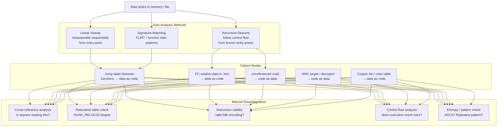
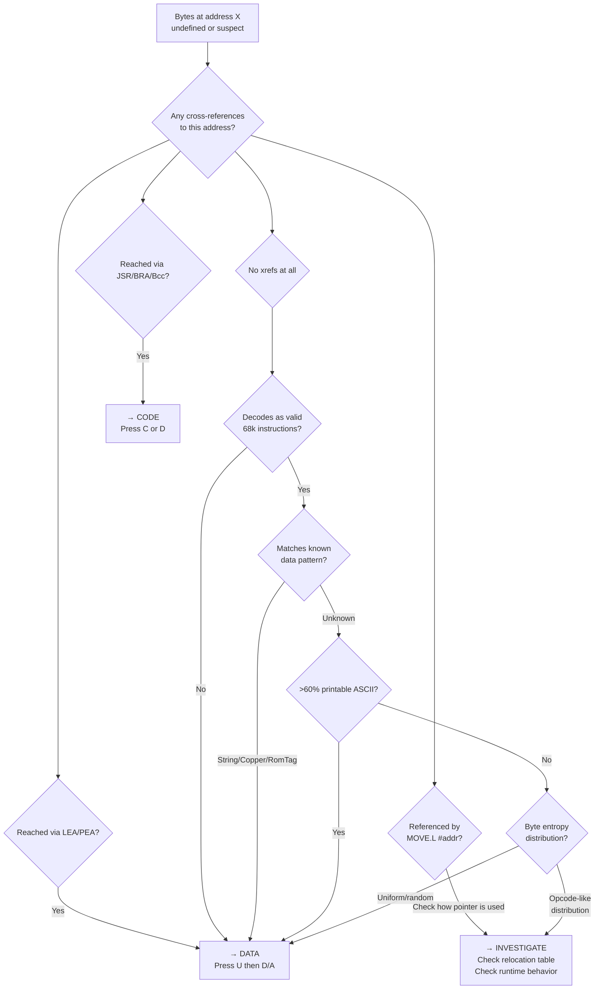

[← Home](../../README.md) · [Reverse Engineering](../README.md) · [Static Analysis](README.md)

# Code vs Data Disambiguation — Telling Instructions from Variables

## Overview

Disassemblers are not oracles. IDA Pro and Ghidra use heuristic algorithms — linear sweep or recursive descent — to decide which bytes are code and which are data. On the Amiga, these heuristics fail routinely: jump tables between functions, PC-relative strings embedded in `.text`, hand-written assembly where data lives in branch-not-taken slots, FORTH-style threaded code where the "program" is a data structure, and copper lists that happen to decode as valid 68k instructions. Every Amiga reverse engineer eventually stares at IDA and thinks: *"Is this real code, or did the disassembler just hallucinate a function out of a color table?"*

This article provides a **systematic methodology** for distinguishing code from data in Amiga m68k binaries — covering automated detection techniques, manual disambiguation workflows, Amiga-specific failure modes, and tool-specific procedures for both IDA Pro and Ghidra.



---

## How Disassemblers Decide — And Why They Fail

### Recursive Descent (IDA's Default)

Recursive descent starts from known entry points (the HUNK_HEADER entry, exported symbols, interrupt vectors) and follows all control-flow edges — `JSR`, `BRA`, `BEQ`, `RTS`, etc. Any byte not reached by tracing from an entry point is left as undefined data.

**Why it fails on Amiga binaries**:
- **Jump tables** (`JMP (PC, Dn.W)` or `MOVE.W jt(PC, Dn.W), D0` / `JMP (PC, D0.W)`) — the table entries are data, not code, but they live between code regions. IDA often misinterprets table entries as instructions unless you manually define them.
- **Computed calls** (`JSR (A0)`, `JSR $00(A0, D0.W)`) — the disassembler cannot trace through a register-indirect call. Functions reached only via function pointers are invisible.
- **Callback chains** — exec library hooks, interrupt server chains, and BOOPSI method dispatch all use indirect calls through function pointers. None are reachable via static control-flow tracing.

### Linear Sweep (Ghidra's Default, IDA Fallback)

Linear sweep disassembles everything sequentially from a starting address, instruction by instruction, regardless of control flow. If it hits a `DC.B 0` in the middle of a code section, it will decode garbage instructions from there onward.

**Why it fails on Amiga binaries**:
- **PC-relative data in `.text`** — GCC embeds strings and jump tables in the code hunk. After a function's `RTS`, the next bytes might be `DC.B "Hello, World!", 0`. Linear sweep decodes `$48 $65 $6C $6C` as `SWAP D5` / `BCS.S $+$6E` — complete nonsense.
- **Padding bytes** — SAS/C aligns functions to word boundaries. The padding byte (`$00` or `$4E71` = NOP) between functions can misalign the linear sweep if it starts at an odd address.
- **Data hunks loaded as code** — If a DATA hunk is accidentally loaded into IDA as code, linear sweep will decode global variables as instructions. A global string `"dos.library"` becomes `MOVE.B -(A5), D2` / `ORI.B #$6C, D5` — plausible-looking but meaningless.

---

## Amiga-Specific Failure Modes

### 1. Jump Tables Between Functions (SAS/C, GCC `switch`)

```asm
; SAS/C switch statement — dense case jump table:
_cmd_dispatch:
    CMPI.W  #MAX_CMD, D0
    BHI.S   .default
    ADD.W   D0, D0                   ; word index
    MOVE.W  .jt(PC, D0.W), D0        ; fetch offset from table
    JMP     (.jt+2)(PC, D0.W)        ; jump through table

.jt:
    DC.W    .case_open  - .jt        ; ← DATA, not code!
    DC.W    .case_close - .jt        ; ← DATA, not code!
    DC.W    .case_read  - .jt        ; ← DATA, not code!
    DC.W    .case_write - .jt        ; ← DATA, not code!

; If IDA treats .jt as code, it produces:
;    ORICR   #$xxxx, SR   (or some other valid-but-wrong instruction)
;    ...
```

**Why it fools disassemblers**: Jump table entries are word-aligned offsets that happen to be valid 68k opcodes. IDA's linear sweep decodes each as an instruction. Ghidra's recursive descent never sees them because no control-flow edge explicitly targets each table slot.

**Detection**: Jump tables always follow a `MOVE.W offset(PC, Dn.W), D0` / `JMP (PC, D0.W)` pattern. In IDA, manually undefine the table region (U key) and define it as words (D key → `dc.w`).

### 2. PC-Relative Data Embedded in `.text` (GCC, VBCC, DICE C)

```
GCC .text hunk layout:
┌──────────────────────┐
│ _func1:              │ ← code
│   MOVEM.L D2,-(SP)   │
│   ...                │
│   RTS                │
├──────────────────────┤
│ .LC0:                │ ← data (string constant)
│   DC.B "dos.library" │
│   DC.B 0             │
├──────────────────────┤
│ .LC1:                │ ← data (jump table)
│   DC.L .L5           │
│   DC.L .L6           │
├──────────────────────┤
│ _func2:              │ ← code
│   LINK A6, #-$10     │
│   ...                │
└──────────────────────┘
```

**Why it fools disassemblers**: The string `"dos.library"` ($64 $6F $73 $2E ...) decodes as `BCC.S` / `LEA` / `BCC.S` — valid 68k instructions. Linear sweep marches straight through strings into whatever follows, creating phantom functions.

**Detection**: 
1. Check if the "instruction" sequence decodes to printable ASCII (`$20`–`$7E` range, null-terminated)
2. Cross-reference backwards — is a `LEA xxx(PC), An` pointing at this exact address? If yes, it's a string.
3. Check HUNK_RELOC32 — if no relocations point here, it's less likely to be code (but not guaranteed)

### 3. Branch-Not-Taken Data (Hand-Written Assembly)

```asm
; Classic hand-written asm pattern: data after unconditional branch
    CMPI.W  #MAX_ENTRIES, D0
    BCC.S   .invalid
    ADD.W   D0, D0
    MOVE.W  .data_table(PC, D0.W), D1
    RTS

.data_table:                         ; ← never executed — reached only via PC-relative load
    DC.W    $0120                    ; these ARE data
    DC.W    $0340
    DC.W    $0560
    BRA.S   .data_table              ; ← wait, is this code? No — it's still data
; But linear sweep would decode $0120, $0340, $0560 as BTST, ROL, etc.
```

**Detection**: Look for `RTS` / `RTE` / `JMP` / `BRA` instructions. Anything after an unconditional control transfer that isn't the target of a branch elsewhere is suspect data.

### 4. Unreferenced Valid Code (Callback, Interrupt Handler)

The opposite problem: **real code that looks like data** because no static control flow reaches it.

```asm
; Interrupt handler — installed at runtime via SetIntVector()
; No JSR/BRA in the binary points here. IDA sees unreferenced bytes.
_vblank_handler:
    MOVEM.L D0-D7/A0-A6, -(SP)      ; valid code!
    MOVE.W  #$0020, $DFF09C          ; clear VBlank interrupt
    ...
    MOVEM.L (SP)+, D0-D7/A0-A6
    RTE

; This handler is referenced ONLY by a runtime MOVE.L #_vblank_handler, $6C.W
; The $6C.W absolute address write is a data write — IDA doesn't trace through it.
```

**Detection**: Search for `MOVE.L #$XXXXXXXX, $6C.W` or `MOVE.L #$XXXXXXXX, $XXXX.W` — these are vector table installations. The `$XXXXXXXX` is a function pointer. Also search `HUNK_SYMBOL` for callback-named symbols (e.g., `h_Entry`, `intr_code`, `isr_`).

### 5. Copper Lists — The Ultimate Data-as-Code Trap

```asm
; A perfectly valid copper list:
    DC.W    $0180, $0000             ; COLOR00 = black
    DC.W    $0182, $0FFF             ; COLOR01 = white
    DC.W    $FFFF, $FFFE             ; WAIT for line 256

; Linear sweep decodes:
    MOVE.B  D0, $0000                ; ?! (valid instruction, nonsensical)
    MOVE.B  D2, $0FFF                ; ?! (valid but accesses ROM)
    ; $FFFF, $FFFE is not decodable as an instruction — finally, IDA gives up
```

**Detection**: Copper lists are always pairs of `DC.W` values where the first word matches Copper move/WAIT opcode patterns (`$0xxx` = MOVE, `$FFxx` = WAIT). A string of `DC.W` in a CODE hunk, especially near `$DFF080` writes (COP1LC), is almost certainly a copper list.

### 6. Self-Modifying Code (SMC) Targets

```asm
; Decryptor writes instructions into a buffer, then jumps to it
    LEA     .encrypted_code(PC), A0
    LEA     _decrypt_buffer, A1
    MOVE.L  (A0)+, D0
    EOR.L   #$12345678, D0          ; decrypt
    MOVE.L  D0, (A1)+               ; write to buffer
    ...
    JMP     _decrypt_buffer          ; jump to decrypted code

.encrypted_code:
    DC.L    $DEADBEEF, $CAFEBABE    ; ← DATA that BECOMES code at runtime
```

**Detection**: Look for loops that read from one address and write to another in a tight pattern (`MOVE.L (A0)+, (A1)+` / `DBRA`). The source is encrypted code, the destination is a runtime code buffer. Also look for calls to `CacheClearU()` before a `JMP`/`JSR` to a writable memory region.

---

## Systematic Detection Techniques

### Technique 1: Cross-Reference Analysis (Most Reliable)

```
If a byte is:
  - The target of a JSR/BRA/Bcc → CODE
  - The target of a LEA/PEA → DATA (or code-as-data, e.g., callback pointer)
  - The target of a MOVE.L #xxx, An → Could be either; check how An is used
  - Not referenced at all → Indeterminate; use other techniques

In IDA: View → Open Subviews → Cross References
In Ghidra: Right-click → References → Show References to Address
```

> [!NOTE]
> Zero cross-references does NOT mean "definitely data." Interrupt handlers, callback functions, and dynamically-dispatched code may have no static references.

### Technique 2: Relocation Table Analysis

Amiga HUNK binaries contain explicit relocation entries (`HUNK_RELOC32`) that tell the loader which longwords to patch. This is a powerful disambiguation tool:

| Hunk Type | Relocs Point To | Implication |
|---|---|---|
| **CODE** | Other CODE hunks | Cross-module call → likely code |
| **CODE** | DATA hunk | Global variable reference → likely code reading data |
| **DATA** | CODE hunk | Function pointer in vtable/callback array → the target IS code |
| **DATA** | DATA hunk | Pointer chain (e.g., linked list head) → data |

```bash
# Dump relocations with hunkinfo:
hunkinfo binary.exe | grep RELOC32
# Shows: source_hunk, source_offset → target_hunk, target_offset
```

**Key insight**: If a longword in the DATA hunk has a `HUNK_RELOC32` pointing into the CODE hunk, that longword is a **function pointer**. The CODE hunk target IS real code.

### Technique 3: m68k Instruction Validity Check

Not all 32-bit values are valid 68k instructions. A quick validity filter:

| Check | Code Indicator | Data Indicator |
|---|---|---|
| **First word decodes?** | Valid 68k opcode in first 16 bits | Invalid opcode (e.g., $Fxxx, $Axxx in user mode) |
| **Length consistency?** | Variable: 2, 4, 6, 8, 10 bytes | Random distribution of word values |
| **Address register usage?** | Reasonable A0-A6 use | Random An register selection |
| **Branch targets?** | Target exists and is word-aligned | Target in data section or misaligned |
| **Privileged instructions?** | Only in supervisor-mode code (ROM, interrupt handlers) | `MOVE to SR`, `STOP`, `RESET` in user code → likely data |

```python
# Python: quick opcode validity check
def looks_like_code(bytes_48):
    """Check if 48 bytes look like plausible 68k code."""
    import re
    
    # Common 68k prologue patterns:
    # LINK Ax, #-N   → 4E5x xxxx
    # MOVEM.L xxx, -(SP) → 48Ex xxxx
    # MOVEQ #N, Dx   → 70xx-7Fxx
    # LEA xxx(PC), Ax → 41FA xxxx / 43FA xxxx / etc.
    
    code_indicators = 0
    data_indicators = 0
    
    # Check word alignment of branch targets
    # Check for NULL bytes (rare in code, common in data)
    if b'\x00\x00' in bytes_48:
        data_indicators += 1
        
    # Check for ASCII sequences
    ascii_count = sum(1 for b in bytes_48 if 0x20 <= b <= 0x7E)
    if ascii_count > len(bytes_48) * 0.6:
        data_indicators += 3  # strong ASCII signal
    
    # Check for common opcode prefixes
    if bytes_48[0:2] in (b'\x4E\x5x', b'\x48\xE7', b'\x4E\x75', b'\x4E\x73'):
        code_indicators += 2
        
    return code_indicators > data_indicators
```

### Technique 4: Entropy Analysis

Code and data have different byte-value distributions:

| Property | Typical Code | Typical Data |
|---|---|---|
| **Null bytes ($00)** | Rare (only in `MOVEQ #0`, `ORI.B #0`, `DC.B 0` padding) | Common (NULL terminators, zero-initialized fields, BSS region) |
| **ASCII characters ($20–$7E)** | ~30–40% of bytes (instruction encodings include ASCII-range values) | >80% for strings, <20% for binary data |
| **Repeated patterns** | Rare (compiler unrolling creates repetition but not identical sequences) | Common (array of identical structs, lookup tables) |
| **$4E byte (opcode prefix)** | Very common (~15–20% of instructions: `4E75`=RTS, `4E71`=NOP, `4E56`=LINK, `4EBA`=JSR) | Random distribution |

**Quick IDA check**: Select a region, View → Open Subviews → Histogram. If the byte distribution is uniform, it's likely compressed/encrypted data. If it clusters around specific opcode values, it's likely code.

### Technique 5: Structural Pattern Matching

Certain structures are unambiguous:

```
DC.B "string", 0           → ASCII > 80%, zero-terminated → DATA (string)
DC.L addr1, addr2, -1      → Valid addresses + -1 terminator → DATA (function table)
$4AFC addr, addr, ...      → RomTag structure → DATA (resident tag)
$000003F3 size, hunks...   → HUNK_HEADER → DATA (file header)
```

---

## IDA Pro Workflow — Manual Disambiguation

### Undefine and Redefine

```
U key     → Undefine (removes code/data designation)
C key     → Convert to Code (forces disassembly)
D key     → Convert to Data (cycles: db → dw → dd)
A key     → Convert to ASCII string
P key     → Create Procedure (function)
Alt+P     → Edit Function (adjust bounds)
```

### Batch Operations

```python
# IDA Python: find and undefine all jump tables after switch statements
import idautils, idc

def undefine_jump_tables():
    """Find MOVE.W xxx(PC,Dn.W), D0 / JMP xxx(PC,D0.W) patterns
       and undefine the offset table."""
    for seg_ea in idautils.Segments():
        if idc.get_segm_name(seg_ea) != 'CODE0':
            continue
        ea = seg_ea
        end = idc.get_segm_end(seg_ea)
        while ea < end:
            mnem = idc.print_insn_mnem(ea)
            if mnem == 'JMP':
                op0 = idc.print_operand(ea, 0)
                if 'PC' in op0 and 'D0' in op0:
                    # Found a switch jump — look back for the table load
                    prev_ea = idc.prev_head(ea)
                    if idc.print_insn_mnem(prev_ea) == 'MOVE':
                        # Found the pair — now find the table
                        # (implementation depends on addressing mode)
                        pass
            ea = idc.next_head(ea, end)
```

### Creating Data Structures from Code

When you identify a data region within a code hunk:

1. **Jump table**: Undefine (`U`), then define as words (`D` key twice → `dc.w`)
2. **String table**: Undefine, then place cursor on first byte, press `A`
3. **Function pointer table**: Undefine, then define as doublewords (`D` key 3 times → `dc.l`), then manually create offsets (`Ctrl+R` → select target segment)
4. **Copper list**: Undefine, define as words (`dc.w`), add comment "Copper list — N entries"

---

## Ghidra Workflow — Manual Disambiguation

```
C key         → Clear code/data (undefine)
D key         → Disassemble (force code)
F key         → Create Function
T key         → Cycle data type (undefined → byte → word → dword → pointer → ...)
Ctrl+↑/↓      → Navigate forward/backward
Right-click   → Data → Choose Data Type
```

### Ghidra-Specific: Bookmark Restoration

Ghidra's auto-analysis sometimes "over-disassembles" and then later "fixes" itself. If you manually fix a region and Ghidra reverts it, lock the region:

```
Right-click → Disassemble → Lock Code/Data
```

---

## Amiga-Specific Patterns Quick Reference

### Definitely DATA

| Pattern | Why |
|---|---|
| `DC.B` with >80% printable ASCII, null-terminated | String |
| `DC.W` pairs where first word is `$0xxx` or `$FFxx` | Copper list |
| `DC.L` terminated by `-1` ($FFFFFFFF) | Function pointer table |
| `DC.L` where every entry is a valid address in CODE0 | Function pointer table (library JMP table, vtable) |
| Repeated `DC.L $00000000` for >4 entries | BSS surrogate / zero-initialized array |
| `$4AFC` followed by self-referential pointer | RomTag / resident module header |
| `$000003F3` (HUNK_HEADER) | HUNK file header |
| `$000003E9` (HUNK_CODE) / `$000003EA` (HUNK_DATA) | HUNK hunk header |

### Definitely CODE

| Pattern | Why |
|---|---|
| `$4E56 $xxxx` (LINK) | Function prologue |
| `$48E7 $xxxx` (MOVEM.L) | Register save/restore |
| `$4E75` (RTS) | Function return |
| `$4E73` (RTE) | Interrupt return |
| `$60xx` (BRA.S) / `$6000 $xxxx` (BRA) | Control flow |
| `$4EBA $xxxx` (JSR) | Function call |
| `$51C8 $FFxx` (DBRA D0) | Loop counter |
| `$4E71` (NOP) | Padding between aligned functions (but only if adjacent to code) |

### Could Be Either — Need Context

| Pattern | Why Ambiguous |
|---|---|
| `$7000–$7FFF` (MOVEQ) | MOVEQ #0 is also a common data initialization value (NULL pointer) |
| `$2xxx` (MOVE.L) | A `MOVE.L (An), Dn` instruction shares encoding with valid address constants |
| `$4AFC` (ILLEGAL on 68000) | Could be RT_MATCHWORD (RomTag) OR an intentional crash in debug code |
| Long runs of `$00000000` | Could be BSS, padding, OR a table of NULL function pointers |
| `$FFFF $FFFE` | Could be Copper WAIT or end-of-data sentinel |

---

## Named Antipatterns

### "The ASCII Instruction"

**Problem**: A string like `"AllocMem"` ($41 $6C $6C $6F $63 $4D $65 $6D) decodes as:
```asm
    LEA     -$14(A4), A0            ; $41 $6C (off by one: actually $41 = SUBA, not LEA)
    BCC.S   .+$6C                   ; $6C
    BCC.S   .+$6F                   ; $6F
    BCS.S   .+$63                   ; $63
    ...
```
Every byte of the string becomes a valid (but nonsensical) 68k instruction. The disassembler produces 10+ "instructions" from a 9-byte string.

**Fix**: Select the region, press `A` in IDA (or `T` → choose "string" in Ghidra). The disassembler will undefine the phantom code and mark the region as a string.

### "The Phantom Function"

**Problem**: A color table or copper list inadvertently decodes as a function with valid prologue/epilogue instructions:
```asm
; Color palette at $00012000:
    DC.W    $0180, $0000             ; → MOVE.B D0, ($0000).W  (valid!)
    DC.W    $4E71                    ; → NOP
    DC.W    $4E75                    ; → RTS (IDA says "this is a function!")
```
IDA sees `MOVE.B ... / NOP / RTS` and creates a function. There is no function here — it's a color table that happened to contain the NOP and RTS opcodes.

**Fix**: Check if the "function" is cross-referenced. If no `JSR`/`BSR` targets it, and it lives in what should be a data region (especially at an address written by `MOVE.L #table, $DFF080` — COP1LC), undefine it.

### "The Jump Table Desert"

**Problem**: Between two real functions, IDA shows 20 "instructions" that are actually a switch jump table. Each table entry is a 2-byte offset that happens to be a valid opcode.

**Fix**: Locate the switch pattern (`MOVE.W offset(PC, Dn.W), D0` / `JMP (PC, D0.W)`). The offset table starts at the label used by the `MOVE.W`. Undefine from that label to the next verified function start.

### "The Decryptor Blind Spot"

**Problem**: The first 256 bytes of the binary are a decryptor that unpacks the real code into RAM and jumps to it. The REAL code is stored as encrypted data — IDA sees random bytes, Ghidra sees no control flow, both fail to disassemble.

**Fix**: 
1. Analyze the decryptor manually (it's short — usually 100–300 bytes of real code)
2. Run the binary in FS-UAE with a breakpoint after the decryptor loop
3. Dump the decrypted memory region
4. Load the dump into IDA as a second binary, or patch the original in IDA

### "The Vector Table Mirage"

**Problem**: The 68k exception vector table at `$000000`–`$0003FF` contains 256 longwords. Every even longword is a valid 68k address. IDA tries to disassemble addresses as code, but the vector table ITSELF is data — it's a list of function pointers, not code.

**Fix**: The first 1024 bytes of a Kickstart ROM (or any binary loaded at `$000000`) should be defined as `dc.l` (doublewords), not code. The longwords ARE function pointers, but the table is data.

---

## Decision Flowchart



---

## Tool-Specific Scripts

### IDA Python: Find All Undefined Regions in CODE Hunk

```python
# ida_find_undefined.py
# Finds all undefined bytes between functions in the CODE hunk
# and suggests whether they're likely code or data.

import idautils, idc, idaapi

def analyze_undefined_regions():
    """Find and classify all undefined regions in CODE segments."""
    for seg_ea in idautils.Segments():
        seg_name = idc.get_segm_name(seg_ea)
        if 'CODE' not in seg_name.upper():
            continue
        
        ea = seg_ea
        end = idc.get_segm_end(seg_ea)
        
        while ea < end:
            if not idc.is_code(idc.get_full_flags(ea)):
                # Found undefined/data region in CODE
                region_start = ea
                region_end = ea
                while region_end < end and not idc.is_code(idc.get_full_flags(region_end)):
                    region_end += 1
                
                size = region_end - region_start
                if size < 4:  # skip tiny gaps
                    ea = region_end
                    continue
                
                # Classify the region
                bytes_data = idc.get_bytes(region_start, min(size, 64))
                classification = classify_bytes(bytes_data)
                
                print(f"Undefined region at ${region_start:08X}: "
                      f"{size} bytes → likely {classification}")
                
                ea = region_end
            else:
                ea = idc.next_head(ea, end)

def classify_bytes(data):
    """Classify bytes as CODE_LIKE or DATA_LIKE."""
    if not data:
        return "EMPTY"
    
    # ASCII check
    ascii_count = sum(1 for b in data if 0x20 <= b <= 0x7E)
    if len(data) > 4 and ascii_count / len(data) > 0.7:
        return "ASCII_STRING"
    
    # Copper list check
    if len(data) >= 4:
        w1 = (data[0] << 8) | data[1] if len(data) > 1 else 0
        w2 = (data[2] << 8) | data[3] if len(data) > 3 else 0
        if (w1 & 0xFF00) in (0x0000, 0x0100):  # MOVE to custom register
            return "COPPER_MOVE"
        if w1 == 0xFFFF and (w2 & 0xFF00) == 0xFF00:  # WAIT
            return "COPPER_WAIT"
    
    # -1 terminator → function table
    if len(data) >= 8:
        words = [(data[i] << 8) | data[i+1] for i in range(0, min(len(data), 32), 2)]
        if 0xFFFF in words:
            return "FUNCTION_TABLE"
    
    # Opcode prefix check
    opcode_prefixes = [0x4E, 0x48, 0x60, 0x61, 0x70, 0x2F, 0x20]
    prefix_count = sum(1 for b in data[::2] if b in opcode_prefixes)
    if prefix_count >= 2:
        return "CODE_LIKE"
    
    return "UNKNOWN_DATA"

analyze_undefined_regions()
```

### Ghidra Script: Auto-Detect Jump Tables

```java
// GhidraScript: AutoDetectJumpTables.java
// Finds JMP (PC, Dn.W) patterns and marks following offset tables as data.

import ghidra.app.script.GhidraScript;
import ghidra.program.model.lang.Register;
import ghidra.program.model.listing.Instruction;

public class AutoDetectJumpTables extends GhidraScript {
    @Override
    public void run() throws Exception {
        var listing = currentProgram.getListing();
        var instructions = listing.getInstructions(true);
        
        for (Instruction insn : instructions) {
            String mnemonic = insn.getMnemonicString();
            
            // Look for JMP (xxx, PC, Dn.W) patterns
            if (mnemonic.equals("JMP")) {
                String op0 = insn.getDefaultOperandRepresentation(0);
                if (op0.contains("PC") && op0.contains("D")) {
                    // Found a switch jump — backtrack to find the table reference
                    var prev = insn.getPrevious();
                    if (prev != null) {
                        String prevMnem = prev.getMnemonicString();
                        if (prevMnem.equals("MOVE") || prevMnem.equals("MOVEA")) {
                            // This is likely a switch. Walk forward to find table
                            // (implementation: parse the PC-relative offset
                            //  and mark the table as data words)
                            println("Potential jump table after " + prev.getAddress());
                            // TODO: Calculate table bounds and clear code
                        }
                    }
                }
            }
        }
    }
}
```

---

## Cross-Platform Comparison

| Platform | Code/Data Disambiguation | Amiga Difference |
|---|---|---|
| **x86/x86-64 (PE/ELF)** | Variable-length instructions (1–15 bytes); `.text`/`.data` section separation is strict; PLT/GOT boundaries are clear | Amiga 68k instructions are always multiples of 2 bytes — easier to scan but easier for data to masquerade as code |
| **ARM (Thumb)** | Mixed 16/32-bit instruction encoding; PC-relative literal pools are explicitly marked by assembler | m68k has no Thumb equivalent; byte-level disambiguation is simpler but tooling is less sophisticated |
| **Modern C++ (ELF)** | `.rodata` clearly separates read-only data from `.text`; CFI unwind tables provide function boundary hints | Amiga HUNK format doesn't separate read-only data from code; PC-relative strings live in CODE hunks |
| **Embedded (bare-metal)** | Vector table at fixed address, similar to 68k exception vectors; often no section separation | Same vector table disambiguation challenge; Amiga adds copper lists and custom chip register tables |
| **Classic Mac OS (68k)** | CODE resources vs DREG resources (separated by resource fork); A5-world globals | Mac resource forks provide cleaner code/data separation than Amiga HUNKs |

---

## FPGA / Emulation Impact

- **SMC detection on FPGA**: If you're implementing a MiSTer core, self-modifying code requires the 68000 instruction cache to be flushed or bypassed when code writes to a region that will later be executed. Detect SMC by monitoring writes to memory regions that also have instruction fetches.
- **Copper list execution**: Copper lists should NEVER be executed by the 68000 — they are data for the Copper coprocessor. If you see the 68000 reading from Copper list addresses as code, the address decoding in your FPGA core may be incorrectly routing Copper DMA memory to the CPU bus.
- **Code/Data bus confusion**: On real Amiga hardware, Chip RAM is shared between the CPU and custom chips. If your FPGA core incorrectly allows the Copper to read from Fast RAM (CPU-only memory), copper lists in Fast RAM might partially execute — producing phantom visual artifacts.

---

## FAQ

**Q: How do I tell if a region is a jump table or just weird code?**
A: Jump tables always follow a `MOVE.W offset(PC, Dn.W), Dn` / `JMP (PC, Dn.W)` pattern. The table entries are self-relative offsets (e.g., `.case1 - .jt`). If the "instructions" at the table location are all 2-byte opcodes with values in the range $FF00–$FFFF (i.e., negative short offsets), it's a jump table.

**Q: Why does IDA create functions at $00000000?**
A: IDA creates functions wherever it sees a code xref. If a relocation entry points to offset 0 in a hunk (because of a NULL function pointer initialization), IDA creates a function there. Undefine it — offset 0 of a HUNK_CODE is the entry point, but offset 0 of HUNK_DATA is not code.

**Q: How do I handle binaries where EVERYTHING is in one hunk?**
A: Demos, trackmos, and bootblock intros often have a single CODE hunk containing code, data, copper lists, and sample data. Use the techniques in [asm68k_binaries.md](asm68k_binaries.md) — identify hardware register writes to find copper list addresses, identify `LEA xxx(PC), An` to find data references, and trace audio register writes to find sample data.

**Q: Why does Ghidra show "Instruction not recognized" for what I know is valid 68k code?**
A: Ghidra's 68k SLEIGH specification may not cover every m68k variant instruction. Check that the language is set to "68000" (not "68020" or "ColdFire") in the project settings. Some FPU and supervisor-mode instructions are excluded from user-mode disassembly.

**Q: My binary has a hunk labeled CODE but it only contains $00 bytes. What's happening?**
A: That's a BSS hunk mislabeled as CODE, or a zero-filled overlay area that gets loaded at runtime. Check the hunk's memory flags in the HUNK_HEADER — `MEMF_CLEAR` ($00010000) means it's a BSS-like hunk that should be zeroed.

---

## References

- [asm68k_binaries.md](asm68k_binaries.md) — Hand-written assembly RE (heavy code/data mixing)
- [ansi_c_reversing.md](ansi_c_reversing.md) — C binary RE (compiler patterns help code identification)
- [compilers/README.md](compilers/README.md) — Per-compiler field manuals (prologue signatures for function detection)
- [compiler_fingerprints.md](../compiler_fingerprints.md) — Quick compiler ID for narrowing code patterns
- [hunk_format.md](../../03_loader_and_exec_format/hunk_format.md) — HUNK structure for relocation-based disambiguation
- [hunk_relocation.md](../../03_loader_and_exec_format/hunk_relocation.md) — Relocation mechanics
- [methodology.md](../methodology.md) — General RE workflow
- IDA Pro: *The IDA Pro Book* (Eagle, 2nd Edition) — Chapter 7: "Data and Code"
- Ghidra: *Ghidra Software Reverse Engineering for Beginners* — Chapter 5: "Code vs. Data"
