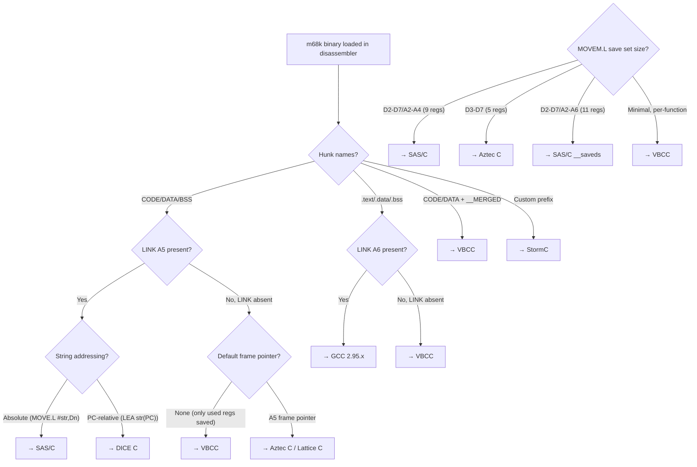

[← Home](../../../README.md) · [Reverse Engineering](../../README.md) · [Static Analysis](../README.md)

# Per-Compiler Reverse Engineering — Binary Field Manuals

## Overview

This section provides **compiler-specific reverse engineering field manuals**. Each article answers one question: *"I have a binary produced by this compiler — what does it look like in IDA/Ghidra, and how do I read it?"* Rather than discussing compiler usage (see [13_toolchain](../../../13_toolchain/README.md) for that), these articles focus exclusively on **binary output**: hunk naming conventions, prologue/epilogue patterns, stack frame layouts, string addressing modes, startup code, optimization patterns, and debug info formats.

Every article includes the **same C function compiled by each compiler** — a side-by-side comparison that reveals exactly how `for` loops, `switch` statements, struct access, and AmigaOS library calls differ at the assembly level.

## Compiler Identification Decision Flowchart



## Quick Identification Matrix

| Criterion | SAS/C 6.x | GCC 2.95.x | VBCC | StormC | Aztec C | Lattice C | DICE C |
|---|---|---|---|---|---|---|---|
| **Hunk names** | `CODE`, `DATA`, `BSS` | `.text`, `.data`, `.bss` | `CODE`, `DATA`, `BSS` + `__MERGED` | `CODE`, `DATA` (Amiga standard) | `CODE`, `DATA`, `BSS` | `CODE`, `DATA`, `BSS` | `CODE`, `DATA`, `BSS` |
| **Frame pointer** | A5 (`LINK A5, #-N`) | A6 (or none with `-fomit-frame-pointer`) | None (rarely A5) | A5 (`LINK A5, #-N`) | A5 (`LINK A5, #-N`) | A5 (`LINK A5, #-N`) | None typically |
| **String addressing** | Absolute + relocated | PC-relative | PC-relative | Absolute | Absolute | Absolute | PC-relative |
| **Register save set** | D2-D7/A2-A4 (9 regs) | D2-D3/A2 (per-function) | Only used regs | D2-D7/A2-A4 (9 regs) | D3-D7 (5 regs) | D2-D5/A2-A3 | Per-function |
| **Startup entry** | `_start` / `c.o` | `_start` / `libnix` | `_start` / `startup.o` | `_STORM_` prefix | `_start` / `aztec.o` | `_start` / `lc.o` | `_mainCRTStartup` |
| **Library call style** | `JSR -$XXX(A6)` after loading global | `JSR -$XXX(A6)` with tighter code | `JSR -$XXX(A6)` via `__reg()` | `JSR -$XXX(A6)` SAS/C-like | `JSR -$XXX(A6)` | `JSR -$XXX(A6)` | `JSR -$XXX(A6)` |
| **Era** | 1988–1996 | 1995–present | 1995–present | 1996–2000 | 1985–1992 | 1985–1989 | 1992–1995 |
| **RE article** | [sasc.md](sasc.md) | [gcc.md](gcc.md) | [vbcc.md](vbcc.md) | [stormc.md](stormc.md) | [aztec_c.md](aztec_c.md) | [lattice_c.md](lattice_c.md) | [dice_c.md](dice_c.md) |

## Articles

| File | Compiler | Key RE Distinguishing Feature |
|---|---|---|
| [sasc.md](sasc.md) | SAS/C 5.x/6.x | `LINK A5` + 9-register MOVEM.L save — the most common Amiga C prologue |
| [gcc.md](gcc.md) | GCC 2.95.x | `LINK A6` (or no frame pointer) + PC-relative strings + `__CTOR_LIST__`/`__DTOR_LIST__` arrays |
| [vbcc.md](vbcc.md) | VBCC | No frame pointer + per-function register save + `__reg()` calling convention + `__MERGED` hunks |
| [stormc.md](stormc.md) | StormC / StormC++ | A5 frame pointer + C++ vtable differences from GCC + integrated debug info |
| [aztec_c.md](aztec_c.md) | Manx Aztec C | `LINK A5` + D3-D7 only (5 regs) — distinct from SAS/C 9-reg save |
| [lattice_c.md](lattice_c.md) | Lattice C 3.x/4.x | Predecessor to SAS/C; less aggressive optimization, different startup stub |
| [dice_c.md](dice_c.md) | DICE C | No frame pointer + PC-relative strings + extremely fast compilation marker patterns |

## Cross-Compiler Comparison — Same C Function

Every per-compiler article includes this reference function compiled by that compiler:

```c
/* Reference function used in all compiler comparison tables */
ULONG CountWords(CONST_STRPTR str) {
    ULONG count = 0;
    BOOL in_word = FALSE;
    
    while (*str) {
        if (*str == ' ' || *str == '\t' || *str == '\n') {
            in_word = FALSE;
        } else if (!in_word) {
            count++;
            in_word = TRUE;
        }
        str++;
    }
    return count;
}
```

Each article shows the full assembly output, annotated with which patterns are compiler-specific and which are universal m68k idioms.

## See Also

- [compiler_fingerprints.md](../../compiler_fingerprints.md) — Quick compiler identification guide
- [ansi_c_reversing.md](../ansi_c_reversing.md) — General C reverse engineering methodology
- [m68k_codegen_patterns.md](../m68k_codegen_patterns.md) — m68k code generation idiom catalog
- [startup_code.md](../../../04_linking_and_libraries/startup_code.md) — CLI vs WB startup internals
- [13_toolchain/](../../../13_toolchain/README.md) — Compiler usage and configuration (not RE)
