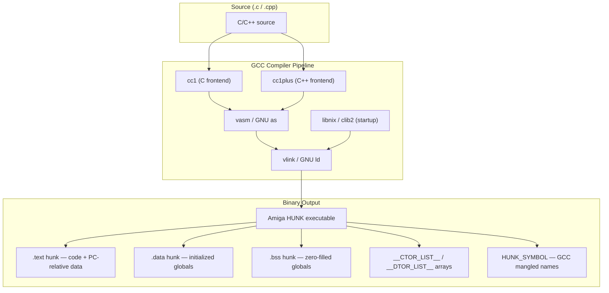

[← Home](../../../README.md) · [Reverse Engineering](../../README.md) · [Static Analysis](../README.md) · [Compilers](README.md)

# GCC 2.95.x — Reverse Engineering Field Manual

## Overview

**GCC 2.95.x** for m68k-amigaos (variants: GeekGadgets, bebbo's modern port, and the original GCC 2.95.3) is the second most common compiler encountered in Amiga reverse engineering, particularly for software from 1995 onward. Unlike SAS/C's rigid "always LINK A5" convention, GCC is far more flexible — it uses **A6** as frame pointer when enabled, defaults to **no frame pointer at all**, uses **PC-relative string addressing**, and generates per-function `MOVEM.L` save sets (saving only the registers actually used, not a fixed set).

Key constraints to internalize immediately:
- **No default frame pointer** — GCC optimizes away the frame pointer whenever possible. Locals and arguments are accessed via `$offset(SP)`. This makes function boundary detection harder initially but produces tighter code.
- **A6 is the frame pointer, not A5** — when `-fno-omit-frame-pointer` is used. This is the primary visual disambiguator from SAS/C.
- **PC-relative everything** — strings are addressed via `LEA string(PC), A0`. Constants live in the CODE hunk alongside instructions. No `HUNK_RELOC32` for string references.
- **`__CTOR_LIST__` / `__DTOR_LIST__`** — global constructor/destructor arrays unique to GCC C++ and GCC with `-finit-priority`.
- **`.text` / `.data` / `.bss` hunk names** — Unix convention, unlike SAS/C's Amiga-native `CODE`/`DATA`/`BSS`.



---

## Binary Identification — The GCC Signature

### Hunk Names (Unix Convention)

```
Hunk 0: .text   (code + read-only data including strings and jump tables)
Hunk 1: .data   (initialized global variables)
Hunk 2: .bss    (zero-initialized globals)
```

> [!NOTE]
> **The `.text` hunk name is the single fastest way to identify GCC output.** SAS/C, Aztec, Lattice, and StormC all use `CODE`/`DATA`/`BSS`. Only GCC (and sometimes VBCC with certain linker scripts) produces `.text`/`.data`/`.bss`. However, some GCC ports have been configured to emit Amiga-standard names — check multiple indicators.

### Function Prologue — The Minimalist Approach

GCC's prologue varies dramatically based on how many registers the function actually uses:

```asm
; GCC with -fomit-frame-pointer (default) — leaf function, no locals:
_leaf_func:
    ; NO prologue at all — just starts executing
    ; ... function body ...
    RTS

; GCC — function with a few locals, no calls:
_modest_func:
    MOVEM.L D2/A2, -(SP)          ; save ONLY the 2 registers actually used
    ; ... function body ...
    MOVEM.L (SP)+, D2/A2
    RTS

; GCC with -fno-omit-frame-pointer:
_frame_func:
    LINK    A6, #-N                ; A6 frame pointer — NOT A5!
    MOVEM.L D2-D3/A2-A3, -(SP)    ; only actually-used regs
    ; ... function body ...
    MOVEM.L (SP)+, D2-D3/A2-A3
    UNLK    A6                     ; UNLK A6, not UNLK A5
    RTS

; GCC — large function with many locals:
_large_func:
    MOVEM.L D2-D7/A2-A5, -(SP)    ; many regs — still not all 9
    LEA     -$400(SP), SP          ; allocate large frame (ADD/SUB alternative)
    ; ... function body ...
    LEA     $400(SP), SP
    MOVEM.L (SP)+, D2-D7/A2-A5
    RTS
```

**Key identification**: the register save set is **per-function, tailored to actual usage**. If you see `MOVEM.L D2-D3/A2, -(SP)` in one function and `MOVEM.L D2-D7/A2-A4, -(SP)` in another, it's GCC (or VBCC). SAS/C always saves the same fixed set.

### String Addressing — PC-Relative

```asm
; GCC string reference — PC-relative:
    LEA     .LC0(PC), A0            ; A0 = "Hello, World!\n"
    JSR     _Printf                 ; call Printf(A0)

; ... later in the same .text hunk:
.LC0:
    DC.B    "Hello, World!", $0A, 00
```

**Critical RE implication**: GCC strings live in `.text` next to the code that references them. In IDA, the string appears as inline data within the code segment, creating a `CODE XREF` from the `LEA` instruction. This means:
1. Strings are **not separately relocatable** — they move with the code hunk
2. String cross-references in IDA are `CODE XREF`, not `DATA XREF`
3. The `LEA` pattern is unambiguous — `LEA $XXXXXXXX(PC), An` where the target is ASCII data

---

## Debug Information — HUNK_DEBUG and Stabs

GCC 2.95.x for AmigaOS embeds debug info when compiled with `-g`. The format is **stabs** (BSD DBX format) — not DWARF2, which is disabled on this target. Debug data lives in a `HUNK_DEBUG` block (hunk type `0x3F1`) separate from `HUNK_SYMBOL`.

### Hunk Types for Symbols

| Hunk type | Hex | Contents |
|---|---|---|
| `HUNK_SYMBOL` | `0x3F0` | Linker-visible public symbol names + offsets. Present in non-stripped builds. |
| `HUNK_DEBUG` | `0x3F1` | Stabs debug info: source file names, function names, line numbers, type info. Only with `-g`. |

`HUNK_DEBUG` structure:
```
ULONG magic;          // BSD a.out magic (checked against ZMAGIC)
ULONG symsz;          // size of symbol table (N × sizeof(struct nlist))
ULONG strsz;          // size of string table
struct nlist[N];      // stabs entries
char  strings[];      // null-terminated string pool
```

### Key Stabs Entry Types

| Stab type | Decimal | Meaning |
|---|---|---|
| `N_OPT` | 60 | Compiler option — value `"gcc2_compiled."` marks GCC 2.x output |
| `N_SO` | 100 | Source file. Two consecutive `N_SO` entries = directory + filename |
| `N_SOL` | 132 | Included sub-source file (`#include`) |
| `N_FUN` | 36 | Function entry: `"name:Fdesc"` (global) or `"name:fdesc"` (static); `n_value` = start address. Empty name `""` marks function *end*. |
| `N_SLINE` | 68 | Source line: `n_desc` = line number, `n_value` = code offset from function start |
| `N_LSYM` | 128 | Local variable (stack): `"name:type"`, `n_value` = frame offset |
| `N_GSYM` | 32 | Global variable |
| `N_LBRAC` / `N_RBRAC` | 192 / 224 | Open/close scope block |

### Finding Function Names in a Debug Build

1. Locate `HUNK_DEBUG` (type `0x3F1`) in the binary
2. Read the BSD header; verify magic
3. Iterate `struct nlist` entries, looking for `n_type == N_FUN`
4. The string before the `:` in the stabs string is the function name
5. `n_value` is the function's start offset within the hunk
6. The next `N_FUN` with empty name marks the function's end

**Tooling:**
- `GccFindHit` (from `cnvogelg/m68k-amigaos-toolchain`) — reads HUNK_DEBUG and maps a crash address to source file + line + function
- `ghidra-gcc2-stabs` (GitHub: `RidgeX/ghidra-gcc2-stabs`) — Ghidra plugin that imports stabs from `HUNK_DEBUG` and creates function labels, line numbers, and local variable annotations automatically

### `gcc2_compiled.` Marker

An `N_OPT` stab with string `"gcc2_compiled."` appears before the first `N_SO` entry in every GCC 2.x debug build. It:
- Confirms GCC 2.x lineage (not SAS/C, VBCC, or GCC 3+)
- Is only present when `-g` was passed — absent in release/stripped builds
- In stripped binaries, use hunk naming (`.text`) and code patterns instead

---

## Calling Conventions

GCC uses a simpler calling convention model than SAS/C — one primary convention with variations controlled by function attributes. However, what GCC lacks in convention count it makes up for in **register allocation flexibility**: every function gets a customized stack frame and register save set based on exactly which variables the compiler decides to keep in registers.

### Primary Convention (cdecl, the GCC default)

| Aspect | GCC Convention |
|---|---|
| **Return value** | D0 (32-bit integer/pointer), D0:D1 (64-bit `long long`), FP0 (float/double on FPU systems). Structs > 8 bytes: caller allocates space, passes hidden pointer in **A0**. |
| **First 2 integer args** | D0, D1 — passed in registers. These are **caller-saved** (the callee may destroy them). |
| **All remaining args** | Pushed onto the stack **right-to-left** before the call. The **caller** cleans the stack after the call returns (cdecl convention). |
| **Callee-saved registers** | D2-D7, A2-A5 — but GCC saves **only the subset actually used** by the function. This is the key identifiability feature. |
| **Caller-saved registers** | D0, D1, A0, A1 — destroyed across calls. If the caller needs these values after a call, it must save them itself. |
| **Frame pointer** | A6 when not omitted (`-fno-omit-frame-pointer`); otherwise SP-relative access for both locals and incoming stack args. |
| **Library base** | A6 — loaded per-library at call sites. GCC neither preserves A6 across library calls nor uses A6 for any other purpose during library call sequences. |

> [!NOTE]
> Unlike SAS/C's `#pragma libcall` which bakes the register assignment into the pragma, GCC uses inline assembly stubs (`<inline/exec.h>`, `<inline/dos.h>`) or the `__asm()` keyword to set up library calls. In the binary, the result looks identical — `MOVE.L args, Dn` / `JSR -$XXX(A6)` — but the surrounding code pattern differs (GCC is tighter, fewer redundant loads).

### Parameter Passing — Detailed Breakdown

Understanding exactly which parameter lands in which register vs which stack slot is essential for reconstructing function prototypes in IDA/Ghidra.

```
Caller side (before BSR/JSR _func):
                                         Stack layout after BSR:
  MOVE.L  arg1, D0          ─┐           ┌──────────────────────┐
  MOVE.L  arg2, D1           ├ registers │ arg8 (last pushed)   │  SP+28
  MOVE.L  arg3, -(SP)       ─┐           │ arg7                 │  SP+24
  MOVE.L  arg4, -(SP)        ├ stack     │ arg6                 │  SP+20
  ...                        │           │ arg5                 │  SP+16
  MOVE.L  argN, -(SP)       ─┘           │ arg4                 │  SP+12
  BSR     _func                          │ arg3                 │  SP+8 ← first stack arg
                                         │ return address       │  SP+4
  ADD.L   #N*4, SP     ← caller cleans   │ (saved regs...)      │  SP+0
                                         └──────────────────────┘
```

**Identifying parameters in disassembly:**

| Parameter | Location in Callee | How to Find It |
|---|---|---|
| **arg1** | D0 (may be moved to a callee-saved reg immediately) | Look for `MOVE.L D0, Dn` early in the function |
| **arg2** | D1 (same — often moved to a callee-saved reg) | Look for `MOVE.L D1, Dn` after D0 is saved |
| **arg3** | `$04(SP)` or `$0C(A6)` (after return address + saved regs) | First stack arg — offset depends on prologue |
| **arg4+** | `$08(SP)`, `$0C(SP)`... or `$10(A6)`, `$14(A6)`... | Sequential 4-byte slots above arg3 |

**With frame pointer (A6):**
```asm
; Function with LINK A6, #-$10 and MOVEM.L D2-D4, -(SP):
_func:
    LINK    A6, #-$10                 ; A6 = SP, SP -= 16 (locals)
    MOVEM.L D2-D4, -(SP)             ; save 3 regs (12 bytes)

    ; Now the stack looks like:
    ;   $08(A6) = return address
    ;   $0C(A6) = arg3 (first stack arg at A6+12)
    ;   $10(A6) = arg4                ; A6+16
    ;   $14(A6) = arg5                ; A6+20

    MOVE.L  $0C(A6), D2              ; D2 = arg3 (typical: move to callee-saved)
    ; ...
    MOVEM.L (SP)+, D2-D4
    UNLK    A6
    RTS
```

**Without frame pointer (default -O2):**
```asm
; Function with only MOVEM.L D2-D3, -(SP):
_func:
    MOVEM.L D2-D3, -(SP)             ; save 2 regs (8 bytes)

    ; Now args are at:
    ;   $0C(SP) = arg3 (12 = 4 ret addr + 8 saved regs)
    ;   $10(SP) = arg4                ; SP+16

    MOVE.L  $0C(SP), D2              ; D2 = arg3
    ; ...
    MOVEM.L (SP)+, D2-D3
    RTS
```

> [!WARNING]
> **SP-relative offsets are unstable.** If the function uses `ADDQ.L/SUBQ.L` on SP, `PEA`, or pushes temporary values, the SP-relative offset for the same argument shifts. With A6-relative addressing (frame pointer enabled), offsets are constant throughout the function body.

### Special Argument Types

| Type | Convention | Disassembly Pattern |
|---|---|---|
| **64-bit `long long`** | D0:D1 (low 32 in D0, high 32 in D1). If not first param, passed on stack as 8-byte aligned pair. | `MOVE.L D0, D2` / `MOVE.L D1, D3` — pair of moves to callee-saved regs |
| **Struct ≤ 8 bytes** | Passed in D0:D1 (if first param) or on stack. | Look for byte-field extraction: `ANDI.B #$FF, D0` / `LSR.L #8, D0` |
| **Struct > 8 bytes** | Caller allocates space, passes hidden pointer in **A0**. Callee copies if needed. | `MOVEA.L A0, A2` — A0 moved to callee-saved address reg early in prologue |
| **`float` (FPU)** | FP0 (if FPU codegen enabled). With `-msoft-float`, passed as 32-bit integer in D0 or stack. | `FMOVE.S X, FP0` vs `MOVE.L #$3F800000, D0` (1.0f as integer) |
| **`double` (FPU)** | FP0 (FPU). With `-msoft-float`, passed as 64-bit pair in D0:D1 or on stack. | `FMOVE.D X, FP0` vs D0:D1 pair |

### GCC Register Allocation — Recognizing Register vs Stack Variables

GCC's register allocator is the single most important thing to understand when reading GCC output, because it determines whether a C variable appears as a persistent register value or a frame-relative stack slot.

#### How GCC Assigns Registers to Variables

GCC 2.95.x uses a **priority-based graph coloring allocator**. The heuristic, simplified:

1. **Most-referenced variables get registers first.** A loop counter used 50 times wins over a flag set once.
2. **Address-taken variables go to stack.** If a variable's address is taken (`&x`), it MUST live in memory — GCC can't keep it in a register.
3. **D2-D7 used for integer/pointer values.** Data registers are the first choice for arithmetic and pointer-sized values.
4. **A2-A5 used for pointer chasing and base addresses.** Address registers are preferred for `struct->field` access and array indexing.
5. **Register pressure causes spilling.** If a function uses more live variables than available registers, the least-frequently-used variable gets evicted to a stack slot.

#### Identifying Register Variables in Disassembly

```asm
; GCC -O2 function with register-allocated locals:
_count_words:
    MOVEM.L D2-D3, -(SP)          ; D2-D3 saved → they WILL be used as locals

    MOVE.L  D0, D2                 ; D2 = str (arg1 moved to callee-saved reg)
    MOVEQ   #0, D3                 ; D3 = count (initialized to 0, stays in D3)
    MOVEQ   #0, D1                 ; D1 = in_word (scratch — destroyed across calls)

.loop:
    TST.B   (D2)                   ; D2 used as pointer (not reloaded from stack)
    BEQ.S   .done
    CMPI.B  #' ', (D2)
    BNE.S   .not_space
    MOVEQ   #0, D1                 ; D1 modified directly — no stack write
.not_space:
    ; ...
    ADDQ.L  #1, D3                 ; D3 incremented in-register — no stack read/modify/write
    BRA.S   .loop

.done:
    MOVE.L  D3, D0                 ; return count (from D3, not from a stack load)
    MOVEM.L (SP)+, D2-D3
    RTS
```

**Key signs a variable lives in a register:**
- The register is saved in the prologue → it's being used as a named local
- The variable's value is modified with `ADDQ`, `SUBQ`, `MOVEQ` operating on that register — never with `MOVE $offset(A6), Dn` / modify / `MOVE Dn, $offset(A6)`
- The variable is read **without a preceding stack load** and written **without a following stack store**
- At function exit, the value returns from the register, not from a reload

#### Identifying Stack Variables in Disassembly

```asm
; Same function compiled -O0 (everything on stack):
_count_words_O0:
    LINK    A6, #-$08               ; 8 bytes of locals
    MOVEM.L D2-D3, -(SP)

    MOVE.L  $08(A6), D0             ; load arg1 from stack
    MOVE.L  D0, -$04(A6)            ; spill to local: str
    CLR.L   -$08(A6)                ; count = 0 (on stack)

.loop:
    MOVEA.L -$04(A6), A0            ; load str from stack
    TST.B   (A0)
    BEQ.S   .done
    ; ... modify count ...
    ADDQ.L  #1, -$08(A6)            ; count++ — READ-MODIFY-WRITE to stack slot
    BRA.S   .loop

.done:
    MOVE.L  -$08(A6), D0            ; return count (load from stack)
    MOVEM.L (SP)+, D2-D3
    UNLK    A6
    RTS
```

**Key signs a variable lives on the stack:**
- Every read is preceded by `MOVE.L $offset(A6), Dn`
- Every write follows `MOVE.L Dn, $offset(A6)`
- Increments are three instructions: load→add→store (read-modify-write)
- The same frame offset (`-$04(A6)`) appears in multiple load/store instructions
- Variables are never held in callee-saved registers across statements

#### Recognizing Spilled Registers

When register pressure exceeds available registers, GCC **spills** a variable temporarily to the stack:

```asm
; D2 holds 'count', but we need D2 for a DIVU operation:
    MOVE.L  D2, -$04(A6)            ; spill count to stack
    MOVE.L  denominator, D2
    DIVU    D2, D0                  ; D0/D2 → D0 (D2 destroyed)
    MOVE.L  -$04(A6), D2            ; reload count from stack
```

**Spill identification**: look for a `MOVE.L Dn, $offset(A6)` followed later by `MOVE.L $offset(A6), Dn` where `Dn` is used for a different purpose in between. The frame offset is typically in the local-variable area (negative offset from A6, or positive offset from SP+0).

#### Register Allocation Quick-Reference

| Pattern | Register Variable | Stack Variable | Spilled Variable |
|---|---|---|---|
| **Prologue saves it** | ✅ Saved in MOVEM | ❌ Not saved specifically | ✅ Saved in MOVEM |
| **Read pattern** | Value already in Dn — no load | `MOVE.L $offset, Dn` before every use | `MOVE.L Dn, $offset` (store) then later `MOVE.L $offset, Dn` (load) |
| **Write pattern** | `MOVEQ/ADDQ/SUBQ Dn` — register direct | `MOVE Dn, $offset` + `ADDQ $offset` or separate modify+store | `MOVE.L Dn, $offset` (spill); `MOVE.L $offset, Dn` (reload) |
| **Typical compiler** | GCC -O2, -Os, -O3 | GCC -O0; SAS/C with low optimization | GCC under register pressure; SAS/C with many locals |
| **RE effort** | Harder — must track register lifetime | Easier — named stack slot = stable location | Hardest — intermittent storage |

### Function Call Setup Patterns

GCC's call-site code reveals whether the caller passes parameters in registers or had to push to the stack:

```asm
; Calling a function with 2 or fewer args (register-only):
    MOVE.L  filename, D0           ; arg1 in D0
    MOVEQ   #MODE_OLDFILE, D1      ; arg2 in D1
    BSR     _OpenFile               ; no stack setup, no cleanup

; Calling a function with 4 args (2 register + 2 stack):
    MOVE.L  count, -(SP)            ; arg4 pushed first (right-to-left!)
    MOVE.L  buffer, -(SP)           ; arg3 pushed second
    MOVE.L  fh, D1                  ; arg2 in D1
    MOVE.L  #1024, D0              ; arg1 in D0
    BSR     _ReadData
    ADDQ.L  #8, SP                  ; caller cleans 8 bytes of stack args

; Calling a varargs function (all args on stack — no register args):
    MOVE.L  arg3, -(SP)
    MOVE.L  arg2, -(SP)
    MOVE.L  arg1, -(SP)
    BSR     _Printf
    LEA     $0C(SP), SP             ; caller cleans 12 bytes
```

> [!NOTE]
> **Varargs functions** (like `Printf`, `sprintf`, custom `Format()`) force ALL arguments onto the stack in GCC 2.95.x — even the first two. This is a reliable disambiguator: if you see a call with 3+ stack pushes and NO register args, the target is likely a varargs function.

#### Varargs Callee — `va_arg()` Expansion

Inside a varargs function, `va_list` is a plain `char *` pointer into the stack frame. `va_start` initializes it; `va_arg(ap, T)` reads the next argument and advances by `sizeof(T)` rounded to 4 bytes.

```asm
; va_arg() for a 32-bit value — canonical pattern:
    MOVEA.L -$04(A6), A0       ; load va_list (ap) from stack slot
    MOVE.L  (A0)+, D0          ; read next arg, advance ap by 4
    MOVE.L  A0, -$04(A6)       ; write back updated ap

; va_arg() inside a loop (ap kept in address register):
.va_loop:
    MOVE.L  (A2)+, D0          ; A2 = ap; read 32-bit arg, A2 += 4
    TST.L   D0
    BEQ.S   .va_done
    ; process D0 ...
    BRA.S   .va_loop
```

**Key recognition patterns:**
- `(An)+` post-increment reads in a loop — the defining mark of `va_arg` iteration
- `ap` is either kept in an address register across the loop or reloaded/stored each iteration
- 16-bit types (`short`) are promoted to 32 bits on the stack — `va_arg` still advances by 4, not 2
- Format strings for `printf`-style calls always appear as `LEA .LCx(PC), Dn` followed by `MOVE.L Dn, -(SP)` (the format string is the first stack push, last to arrive at the function)

### `__attribute__((interrupt))` — Interrupt Handler

```asm
; GCC interrupt handler:
_int_handler:
    MOVEM.L D0-D7/A0-A6, -(SP)    ; save ALL regs
    ; ... handler body ...
    MOVEM.L (SP)+, D0-D7/A0-A6
    RTE                            ; Return From Exception
```

### `__attribute__((noreturn))` — No-Return Functions

```asm
; GCC noreturn function — NO RTS at end:
_exit_func:
    ; ... cleanup ...
    JSR     _exit                   ; tail-call to exit()
    ; No RTS — compiler knows this never returns
    ; May be followed by ILLEGAL or DC.B 0 padding
```

### AmigaOS-Specific GCC Attributes

GCC 2.95.x for AmigaOS defines attribute macros that map to Amiga calling conventions. These produce fundamentally different code and must be recognized to correctly reconstruct function prototypes.

#### `__regargs` — Register-Based Argument Passing

`__attribute__((regparm(N)))` (available as the `__regargs` macro) passes the first N arguments in registers using a different layout than standard cdecl:

| Arg # | Type | Standard cdecl | `__regargs` |
|---|---|---|---|
| **arg1** | integer | D0 | D0 |
| **arg1** | pointer | D0 | **A0** |
| **arg2** | integer | D1 | D1 |
| **arg2** | pointer | D1 | **A1** |
| **arg3** | any | stack | D2 or A2 |
| **remaining** | any | stack | stack |

The critical difference: **pointer arguments arrive in address registers (A0, A1), not D0/D1**. If you assume cdecl and a function's first parameter is a pointer, you will look for it in `D0` — but with `__regargs` it arrives in `A0`.

```asm
; Standard cdecl: Write(fh, buf, len) — fh/buf/len in D0/D1/stack
    MOVE.L  #1024, -(SP)           ; len on stack
    MOVE.L  buffer, D1             ; buf in D1 (integer-sized)
    MOVE.L  fh, D0                 ; fh in D0
    BSR     _Write

; __regargs: WriteEx(fh, buf, len) — fh(int) in D0, buf(ptr) in A0, len in D1
    MOVE.L  #1024, D1              ; len in D1
    MOVEA.L buffer, A0             ; buf (pointer) → A0, not D1!
    MOVE.L  fh, D0                 ; fh in D0
    BSR     _WriteEx
```

Callee with `__regargs` — how the prologue differs:

```asm
_WriteEx:                          ; __regargs: D0=fh, A0=buf(ptr), D1=len
    MOVEM.L D2-D3/A2, -(SP)
    MOVE.L  D0, D2                 ; save fh (from D0 — same as cdecl)
    MOVEA.L A0, A2                 ; save buf from A0 — NOT from D1!
    MOVE.L  D1, D3                 ; save len from D1
```

**RE trap**: If you assume cdecl and see `MOVEA.L A0, A2` early in the prologue with no preceding `MOVEA.L D0, A2`, the function is `__regargs` and the first pointer arg arrived directly in A0.

#### `__saveds` — Small-Data Register Reload

`__attribute__((saveds))` forces the function to reload the small-data base register (A4) at entry from `__DATA_BAS`. Used for library functions callable from a different task context. Recognizable by `LEA __DATA_BAS(PC), A4` as the very first instruction before any other work:

```asm
_saveds_func:
    LEA     __DATA_BAS(PC), A4     ; reload small-data base — __saveds signature
    MOVEM.L D2/A2, -(SP)
    ; ... normal function body follows ...
```

On most AmigaOS GCC builds without `-msep-data`, `__saveds` is a no-op in the generated code — present in source for SAS/C compatibility, invisible in the binary.

#### `__chip` — Chip RAM Variable Placement

Variables declared `__attribute__((chip))` land in a `.datachip` section. The linker emits this as a separate `HUNK_DATA` block with chip-RAM flag bits set in the hunk size longword (bits 30–31 encode `MEMF_CHIP`):

```
HUNK_DATA  0x3EA  size=0x80000040   ; bit 30 set = MEMF_CHIP requested
  ; ...chip-RAM variable data...
HUNK_END
```

Accesses to chip-RAM variables in disassembly look identical to normal `.data` accesses — the `MEMF_CHIP` flag is only visible in the hunk header, not in the instructions.

---

## Library Call Patterns

### GCC Library Call Style

```asm
; GCC library call — characteristic patterns:
; 1. Library base loaded once, may be reused across calls
    MOVEA.L (_SysBase).L, A6       ; load from absolute address (or PC-relative)

; 2. Arguments set up with minimal register traffic
    MOVE.L  D3, D1                 ; arg1 already in D3, just move to D1
    MOVE.L  #$100, D2              ; immediate arg2

; 3. LVO call
    JSR     -$C6(A6)               ; AllocMem

; 4. Return value used immediately
    MOVE.L  D0, A0                 ; ptr → A0 for immediate use
```

Compared to SAS/C:
- GCC is more likely to reuse A6 across multiple library calls without reloading
- GCC uses `MOVE.L Dreg, D1` (register-to-register) where SAS/C would reload from stack
- GCC may use `LEA (xxx).L, A0` or `MOVEA.L (xxx).L, A0` for address loads

### Position-Independent Code (`-fPIC`)

```asm
; GCC -fPIC: PC-relative indirection through GOT-like table
    LEA     _GLOBAL_OFFSET_TABLE_(PC), A4    ; A4 = GOT base
    MOVEA.L (_SysBase@GOT)(A4), A6           ; load SysBase via GOT slot
    JSR     -$C6(A6)                          ; AllocMem
```

When `-fPIC` is enabled, globals are accessed through a GOT (Global Offset Table) similar to ELF shared libraries. This pattern uses `A4` as the GOT base register and `LEA xxx(PC), A4` at function entry.

---

## BOOPSI / MUI Dispatcher Pattern

BOOPSI and MUI custom class dispatchers compiled with GCC require special recognition because the OS invokes them with a **non-GCC calling convention**: arguments arrive in specific m68k registers hardcoded by the OS ABI, not in D0/D1/stack.

### OS Entry Convention vs GCC Normal

| Register | OS-mandated meaning | GCC normal cdecl meaning |
|---|---|---|
| **A0** | `IClass *cl` — the class pointer | arg1 (if pointer, with `__regargs`) |
| **A1** | `Msg msg` — message (first field = MethodID) | arg2 (if pointer, with `__regargs`) |
| **A2** | `Object *obj` — the object being operated on | callee-saved (must be preserved) |

GCC-compiled dispatchers always begin by saving A2 and remapping all three inputs to callee-saved registers before any dispatch logic:

```asm
_MyClass_Dispatcher:
    ; Entered with: A0=class, A1=msg, A2=obj  (OS convention)
    MOVEM.L D2-D3/A2-A4, -(SP)    ; save callee-saved regs (A2 saved here!)
    MOVEA.L A0, A3                  ; A3 = cl  (callee-saved)
    MOVEA.L A2, A4                  ; A4 = obj (A2 clobbered next, save first)
    MOVEA.L A1, A2                  ; A2 = msg (now A2 holds msg, not obj)

    MOVE.L  (A2), D2               ; D2 = msg->MethodID (first field)
```

### MethodID Dispatch — CMP Chain vs Jump Table

For fewer than ~8 methods, GCC emits a linear comparison chain:

```asm
    CMPI.L  #$0101, D2             ; OM_NEW?
    BEQ     .om_new
    CMPI.L  #$0102, D2             ; OM_DISPOSE?
    BEQ     .om_dispose
    CMPI.L  #$0103, D2             ; OM_SET?
    BEQ     .om_set
    CMPI.L  #$0104, D2             ; OM_GET?
    BEQ.S   .om_get
    ; ... more methods ...
    ; Default: forward to superclass
    MOVEA.L A3, A0                 ; restore cl
    MOVEA.L A4, A2                 ; restore obj
    ; A1 still = msg (or reload from A2 if clobbered)
    JMP     (_IDoSuperMethodA).L   ; tail-call superclass dispatcher
```

For dense MethodID ranges with 8+ methods, GCC may emit a jump table. The MethodID base is subtracted, range-checked, then used as a scaled index:

```asm
    MOVE.L  D2, D0
    SUB.L   #$0101, D0             ; normalize MethodID to 0-based index
    CMPI.L  #<max_method_idx>, D0
    BHI.S   .default_handler       ; out of range → superclass
    ADD.L   D0, D0                 ; scale by 2 (word offsets)
    MOVE.W  .method_table(PC,D0.L), D1
    JMP     .method_table(PC,D1.W) ; indirect branch through table
.method_table:
    DC.W    .om_new-.method_table
    DC.W    .om_dispose-.method_table
    ; ...
```

### Common MUI Method IDs

These appear in `CMPI.L #$XXXXXXXX, D2` comparisons in MUI class dispatchers:

| MethodID | BOOPSI/MUI Method | Typical handler action |
|---|---|---|
| `0x0101` | `OM_NEW` | Allocate instance data, call superclass OM_NEW |
| `0x0102` | `OM_DISPOSE` | Free resources, call superclass OM_DISPOSE |
| `0x0103` | `OM_SET` | Apply attribute list from msg |
| `0x0104` | `OM_GET` | Return attribute value |
| `0x80420006` | `MUIM_Draw` | Render the gadget |
| `0x8042000D` | `MUIM_Cleanup` | Release render resources |
| `0x80420012` | `MUIM_Setup` | Prepare for rendering |

Custom class methods use MUI-registered IDs starting at `0x80420000 + offset`. If you see a large hex constant as a CMPI operand starting with `0x8042`, it's a custom MUI method.

### `MakeClass()` / `MUI_CreateCustomClass()` Call Pattern

Class initialization code (often in a global constructor or `LibInit`):

```asm
; MUI_CreateCustomClass(NULL, superclass_name, NULL, inst_size, dispatcher):
    PEA     _MyClass_Dispatcher    ; dispatcher function pointer
    MOVE.L  #<instance_data_size>, -(SP)
    MOVE.L  #0, -(SP)             ; taglist (NULL)
    PEA     .superclass_str(PC)    ; "Group.mui" etc.
    MOVE.L  #0, -(SP)             ; base (NULL for public classes)
    JSR     _MUI_CreateCustomClass
    LEA     $14(SP), SP           ; clean 5 args × 4 bytes
    MOVE.L  D0, (_MyClass).L       ; store IClass * globally
```

**RE checklist for dispatcher identification:**
1. Function entered with no MOVEM of D0/D1 first — instead A0, A1, A2 are immediately remapped
2. First read is `MOVE.L (A2), Dn` or `MOVE.L (A1), Dn` — loading MethodID
3. A chain of `CMPI.L #$0101`…`#$0104` or larger hex values
4. At least one path ends with `JMP (_IDoSuperMethodA).L` or `BSR _DoSuperMethod`
5. Nearby global holds the result of `MUI_CreateCustomClass`/`MakeClass`

---

## C++ Support — What It Means for RE

### Global Constructors and Destructors

GCC 2.95.x emits two arrays for C++ global object initialization:

```
__CTOR_LIST__ format:
┌──────────────────────┐
│ count (N)            │  __CTOR_LIST__[0]
├──────────────────────┤
│ constructor_1        │  function pointer
├──────────────────────┤
│ constructor_2        │
├──────────────────────┤
│ ...                  │
├──────────────────────┤
│ 0x00000000           │  Terminator (NULL)
└──────────────────────┘

__DTOR_LIST__ — identical format for destructors.
```

**In disassembly**:
```asm
; The startup code processes __CTOR_LIST__ before calling main():
_do_global_ctors:
    MOVEA.L #__CTOR_LIST__, A0     ; A0 = ctor array
    MOVE.L  (A0)+, D0              ; D0 = count
    SUBQ.L  #1, D0
    BMI.S   .done

.ctor_loop:
    MOVEA.L (A0)+, A1              ; A1 = ctor function pointer
    JSR     (A1)                    ; call ctor
    DBRA    D0, .ctor_loop
.done:
    RTS
```

**RE importance**: If you see `__CTOR_LIST__` in the symbol table or a constructor-processing loop in the startup code, the binary was compiled with GCC and likely contains C++ code. SAS/C does not use this mechanism.

### Vtable Layout (GCC 2.95.x m68k C++)

See [cpp_vtables_reversing.md](../cpp_vtables_reversing.md) for the complete GCC C++ vtable/RTTI layout. Key points for compiler identification:
- Vtable symbol naming: `_ZTV6Window` (GCC mangled)
- RTTI pointer at `vtable[-1]`
- `offset_to_top` at `vtable[-2]`
- C++ name mangling follows GCC 2.95 conventions (different from StormC++)

### C++ Exception Handling — SJLJ Mechanism

GCC 2.95.x on AmigaOS uses **SJLJ (setjmp/longjmp) exception handling**. Zero-cost DWARF2 unwinding is explicitly disabled (`DWARF2_UNWIND_INFO 0` in `amigaos.h`) because AmigaOS has no OS-level stack unwinder.

Every function containing a `try` block gets an exception frame registered on a thread-local EH stack at entry and deregistered at exit:

```asm
; try-block function prologue — SJLJ EH:
_func_with_try:
    LINK    A6, #-<eh_frame_size>   ; allocate ExceptionFrame on stack
    ; ExceptionFrame layout: {jmp_buf[6], *prev_frame, *exception_type, *handler}
    MOVEM.L D2/A2, -(SP)

    LEA     -<eh_frame_size>(A6), A0  ; A0 = &ExceptionFrame
    JSR     ___sjljeh_init_handler    ; push frame onto __sjlj_eh_stack

    JSR     _setjmp                   ; setjmp into frame's jmp_buf
    TST.L   D0
    BEQ.S   .normal_path              ; D0=0: initial entry, execute try body
    ; D0≠0: returning from longjmp — exception in flight
    BRA     .catch_handler

.normal_path:
    ; ... try block body ...

.function_exit:
    JSR     ___sjljeh_remove_handler  ; pop frame from __sjlj_eh_stack
    MOVEM.L (SP)+, D2/A2
    UNLK    A6
    RTS

.catch_handler:
    ; ... catch block body ...
    BRA.S   .function_exit
```

**RE identification of try/catch blocks:**
- `JSR ___sjljeh_init_handler` — always marks the start of a try region
- `JSR _setjmp` followed immediately by `TST.L D0` / `BEQ` — the try/catch branch
- `JSR ___sjljeh_remove_handler` — always paired with init, marks the end of the guarded region
- Functions without exceptions have neither; the overhead is obvious (30+ extra instructions)

**Throw site pattern:**
```asm
; throw SomeException():
    ; allocate exception object (or use static)
    MOVE.L  D0, _current_exception  ; store exception pointer globally
    JSR     ___sjljeh_throw         ; unwind: calls longjmp on innermost frame
    ; unreachable (noreturn)
```

If you see `___sjljeh_throw` in a function, that function throws an exception. If you see `___sjljeh_init_handler` + `_setjmp`, it catches one.

---

## Optimization Level Fingerprints

| Level | Flag | Binary Characteristics |
|---|---|---|
| **-O0** | Default | Every variable on stack. No register allocation across statements. Full `LINK A6` frame. `MOVE.L D0, -4(A6)` / `MOVE.L -4(A6), D0` store-reload pairs. |
| **-O1** | `-O` | Basic register allocation. Dead code removed. Constants folded. `MOVEQ` for small values. Redundant stack traffic eliminated. |
| **-O2** | `-O2` | Aggressive CSE (common subexpression elimination). Loop invariants hoisted. `-fomit-frame-pointer` implied. Loop induction variable optimization. |
| **-Os** | `-Os` | `-O2` but favoring smaller code. May use `BSR` instead of inlining. `DBRA` loops preferred over unrolled sequences. |
| **-O3** | `-O3` | Function inlining (`-finline-functions`). `__builtin_memcpy` expansion. Aggressive loop unrolling. |

**How to identify**:
- **-O0**: Distinctive store-immediate-reload pattern. Look for `MOVE.L D0, -N(A6)` followed immediately by `MOVE.L -N(A6), D0` — the compiler stores then reloads the same value.
- **-O2+**: Variables stay in registers across compound statements. The `LINK A6` instruction is absent in most functions.
- **-O3**: You'll find expanded inline code where a function call would normally appear. Look for repeated code blocks with slightly different register assignments.

### Tail-Call Optimization

GCC aggressively applies tail-call optimization:

```asm
; Instead of:
    BSR     _helper_func
    RTS

; GCC generates:
    BRA     _helper_func          ; JMP to helper — no return, no stack growth
```

The `BRA` to another function (not a local label) is GCC's tail-call signature. SAS/C rarely does this.

---

## Startup Code — libnix vs clib2 vs ixemul

### libnix Startup (Most Common)

```asm
; libnix gcrt0.S — minimal startup:
_start:
    MOVEA.L 4.W, A6               ; SysBase
    JSR     ___startup_SysBase     ; store SysBase, init libnix internals
    
    ; Open dos.library
    LEA     .dosname(PC), A1
    MOVEQ   #0, D0
    JSR     -$228(A6)              ; OpenLibrary (LVO differs by build)

    ; Parse CLI args
    JSR     ___parse_args          ; sets up __argc, __argv globals
    
    ; Call main()
    JSR     _main
    
    ; Exit
    MOVE.L  D0, -(SP)
    JSR     ___exit

.dosname: .asciz "dos.library"
```

**Finding `main()`**: Locate `_start`, find the `JSR _main` call. In GCC/libnix binaries, the `_main` symbol is typically preserved even without debug info, because the startup code must reference it.

### ixemul Startup (Unix-like)

ixemul provides a much richer Unix-like environment. The startup code is substantially larger and includes `__init_env`, `__parse_shell_args`, and signal setup. ixemul binaries require `ixemul.library` at runtime — a unique dependency that strongly identifies the binary.

---

## Same C Function — GCC Output

```asm
; CountWords() — GCC 2.95.3, -O2, -fomit-frame-pointer:
; C prototype: ULONG CountWords(CONST_STRPTR str)

_CountWords:
    MOVEM.L D2-D3, -(SP)          ; save only D2-D3 (no LINK, no A2-A6)
    
    MOVEQ   #0, D2                 ; D2 = count
    MOVEQ   #0, D3                 ; D3 = in_word
    
    MOVEA.L $0C(SP), A0            ; A0 = str (arg at SP+12, after saved regs)
    
    BRA.S   .L2

.L5:
    CMPI.B  #' ', (A0)             ; compare immediate to memory — GCC style
    BEQ.S   .L3
    CMPI.B  #'\t', (A0)
    BEQ.S   .L3
    CMPI.B  #'\n', (A0)
    BEQ.S   .L3
    
    TST.B   D3
    BNE.S   .L4
    ADDQ.L  #1, D2
    MOVEQ   #1, D3
    BRA.S   .L4

.L3:
    MOVEQ   #0, D3                 ; in_word = 0

.L4:
    ADDQ.L  #1, A0                 ; str++

.L2:
    TST.B   (A0)
    BNE.S   .L5

    MOVE.L  D2, D0                 ; return count
    MOVEM.L (SP)+, D2-D3
    RTS
```

**GCC-specific observations**:
1. **No `LINK` instruction** — frame pointer omitted. Arg accessed as `$0C(SP)` (SP + saved regs + return address).
2. **`CMPI.B #' ', (A0)`** — compare-immediate-to-memory instruction. GCC uses `CMPI` where SAS/C uses `MOVEQ`+`CMP`. This is more compact (one instruction vs two).
3. **Minimal register save** — only `D2-D3` saved (two registers actually used). SAS/C would save 9 (or at minimum D2-D3 but with LINK).
4. **`BRA.S .L4`** — unconditional branch to common `str++` code. GCC's optimizer merges the increment code.
5. **SP-relative argument access** — `$0C(SP)` instead of `$08(A5)`. This changes as the stack grows/shrinks within the function.

**SAS/C comparison (same function)**:
| Aspect | SAS/C | GCC |
|---|---|---|
| Frame setup | `LINK A5, #-$08` + `MOVEM.L D2-D3, -(SP)` | `MOVEM.L D2-D3, -(SP)` only |
| First char compare | `MOVEQ #' ', D0` / `CMP.B (A0), D0` | `CMPI.B #' ', (A0)` |
| Arg access | `$08(A5)` — stable throughout function | `$0C(SP)` — changes if SP moves |
| Total instructions | 28 (varies by optimization) | 25 |
| Code size | ~52 bytes | ~48 bytes |

---

## Named Antipatterns

### "The Unix Hunk Assumption" — Confusing `.text` with CODE

```asm
; WRONG: treating .text hunk as just "code" and ignoring PC-relative data:
; If you see this and think "that's just a weird instruction":
    LEA     .LC0(PC), A0
; ... but .LC0 is actually a string embedded in .text:
.LC0:   DC.B "Hello", 0
; These two are in the SAME hunk. IDA may not split them properly.
```

**Fix**: After loading a GCC binary in IDA, search for `LEA xxx(PC), A0` patterns and check if `xxx` resolves to ASCII data. If so, convert the bytes at `xxx` to a string type. For strings that follow a function's `RTS` instruction, create a separate data segment in the `.text` hunk area.

### "The Missing Frame" — Assuming Every Function Has LINK

```asm
; WRONG: looking for LINK/UNLK to find function boundaries
; GCC function with no frame pointer:
_myfunc:
    MOVEM.L D2-D4, -(SP)
    ; ... 200 lines of code ...
    MOVEM.L (SP)+, D2-D4
    RTS
; If you search for LINK, you'll never find this function's boundary
```

**Fix**: Function boundaries in GCC are marked by `RTS` (return) instructions. A GCC function can start at any address after a previous `RTS`/`RTE`/`ILLEGAL`/`JMP` that terminates execution flow. Use IDA's auto-analysis or Ghidra's function detection, which look for `RTS` boundaries.

### "The A6 Confusion" — GCC Frame Pointer vs Library Base

```asm
; CRITICAL: A6 plays TWO roles in GCC binaries:
;   Role 1: Frame pointer (when -fno-omit-frame-pointer)
;   Role 2: Library base (during JSR -$XXX(A6) calls)
;
; WRONG: seeing LINK A6 and thinking A6 is the exec base:
_func:
    LINK    A6, #-$14             ; A6 = FRAME POINTER here
    MOVEM.L D2, -(SP)
    ; ...
    MOVEA.L (_DOSBase).L, A6      ; A6 = DOS BASE now (overwrites frame ptr!)
    JSR     -$2A(A6)              ; Read() via DOS base
    ; After JSR, A6 is NO LONGER VALID as frame pointer or library base
    ; GCC will RELOAD A6 from global before next library call
```

---

## Pitfalls & Common Mistakes

### 1. Misidentifying `-fomit-frame-pointer` Code as Hand-Written Assembly

```asm
; GCC -O2 output can look surprisingly like hand-optimized asm:
    MOVEM.L D2/A2, -(SP)
    LEA     .LC0(PC), A0           ; string reference
    MOVEA.L (_DOSBase).L, A6
    MOVE.L  (A1), D1
    JSR     -$2A(A6)
; The combination of PC-relative string + SP-relative access + per-function save
; looks like hand-crafted code. It's just GCC -O2.
```

### 2. Missing `__CTOR_LIST__` Means Missing C++ Globals

If the binary has `__CTOR_LIST__` / `__DTOR_LIST__` but you don't trace them, you'll miss global C++ objects that execute code before `main()` runs. These constructors can allocate memory, open resources, or register callbacks — essential for understanding program behavior.

### 3. Tail-Call Optimization Confusion

```asm
; You might incorrectly identify function boundaries here:
_funcA:
    ; ... code ...
    BRA     _funcB                  ; THIS IS A TAIL CALL, not the end of funcA
; _funcB inherits funcA's stack frame and returns directly to funcA's caller
; The call graph should show: caller → funcA → funcB (not two parallel calls)
```

---

## Use Cases

### Software Known to Be GCC-Compiled

| Application | Compiler | RE Clues |
|---|---|---|
| **AmigaAMP** | GCC 2.95.x | `.text`/.`data` hunks; PC-relative strings; libnix startup; plugin architecture via `dlopen`-like mechanism |
| **ScummVM (Amiga port)** | GCC 6.x (bebbo) | Modern GCC codegen; large `.text` hunk; C++ vtables with GCC mangling |
| **Miami TCP/IP** | GCC 2.95.x | Mixed C/asm; `libnix` startup; `__CTOR_LIST__` for global initializers |
| **AmiTCP** | GCC 2.7.x | Early GCC codegen; less aggressive optimization; no tail-call |
| **Various 1996–2000 ports** | GCC 2.95.x (GeekGadgets) | Unix-to-Amiga ports; often ixemul-dependent; `.text` hunk naming |
| **MUI 3.x custom classes** | Various, including GCC | C++ vtables need GCC-specific handling; BOOPSI dispatch patterns |

---

## Historical Context

GCC on Amiga arrived relatively late. While Lattice/SAS C dominated the late 1980s, the **GeekGadgets** project (1995) brought a complete GCC-based Unix-like environment to AmigaOS, including GCC 2.7.x and later 2.95.x. This opened the door for Unix software ports and attracted developers who preferred GCC's familiar GNU toolchain.

Key timeline:
- **1995**: GeekGadgets — first usable GCC for AmigaOS (2.7.2)
- **1996**: GCC 2.95.3 — stable, well-tested, becomes the standard
- **2000s**: Various GCC 3.x/4.x ports (limited adoption due to code size)
- **2015–present**: bebbo's GCC 6.5 cross-compiler — modern GCC for retro development

GCC's PC-relative addressing is a fundamental design difference from SAS/C. It stems from GCC's Unix heritage where position-independent code (PIC) is essential for shared libraries. On AmigaOS, PC-relative code has the practical benefit that the `.text` hunk can be loaded anywhere without relocation — the HUNK loader doesn't need to patch string references.

The A6 frame pointer choice (rather than A5) comes from the System V m68k ABI, which designated A6 as the frame pointer. GCC followed this convention because the m68k backend was shared across all m68k targets (Sun, HP, Amiga, Atari).

---

## Modern Analogies

| GCC 2.95.x Concept | Modern Equivalent | Notes |
|---|---|---|
| `-fomit-frame-pointer` | Default in modern compilers (`-O2` on x86-64 omits RBP) | Same tradeoff: faster code vs harder debugging |
| PC-relative string addressing | `-fpic` code on modern ELF systems | Same principle: load-time relocation avoidance |
| `__CTOR_LIST__` / `__DTOR_LIST__` | `.init_array` / `.fini_array` sections in ELF | Same purpose: global constructor/destructor registration; modern ELF is more structured |
| `libnix` minimal runtime | Newlib / picolibc for embedded systems | Both provide compact C runtime for constrained environments |
| `ixemul` Unix emulation | Cygwin / MSYS2 DLL (Unix-on-Windows) | Both provide Unix API layer on top of non-Unix kernel |

---

## Practical RE Workflow — Stripped Binary Analysis

Quick steps when you have a stripped GCC Amiga binary with zero symbols:

1. **Confirm compiler**: `.text` hunk name? → GCC. `LINK A5` in first function? → SAS/C. `LINK A6`? → GCC with frame pointer.
2. **Find entry**: `MOVEA.L 4.W, A6` near start of `.text` → libnix entry. Follow to `JSR _main`.
3. **Apply FLIRT**: identify C runtime, `dos.library` stubs, math functions — this names 20–40% of functions immediately.
4. **Trace call graph from `main`**: rename each function as you understand it; GCC's per-function register save sets help scope the function boundary.
5. **Look for `__CTOR_LIST__`**: if present, trace it before `main` — global constructors may initialize important state.
6. **Check for `__regargs`**: if a function's first pointer arg seemingly doesn't use D0/D1, check if it arrives in A0 (regparm convention).
7. **BOOPSI/MUI class?**: look for `MakeClass`/`MUI_CreateCustomClass` and trace to the dispatcher function.

---

## FAQ

**Q: How do I tell GCC 2.95.x from GCC 6.x (bebbo) in a binary?**
A: GCC 2.95.x uses gcc-specific HUNK_SYMBOL patterns (`.Lxxx` local labels). GCC 6.x with bebbo's toolchain uses `vasm`/`vlink` which generate `CODE`/`DATA` hunk names (Amiga standard, not `.text`). GCC 6.x also applies more aggressive optimizations — if you see heavy loop unrolling and auto-vectorization patterns on m68k, it's modern GCC.

**Q: Why are there no `__CTOR_LIST__` entries in my GCC binary?**
A: `__CTOR_LIST__` only exists if the binary uses C++ with global objects, or if compiled with `-finit-priority` in C. Pure C programs without global constructors won't have it.

**Q: How do I find `main()` in a stripped GCC binary?**
A: Search for libnix startup signature: `MOVE.L 4.W, A6` / `JSR ___startup_SysBase`. The `JSR` after `dos.library` open is `_main`. Even in stripped binaries, the startup code is typically at the beginning of `.text` and the call pattern is consistent.

---

## References

- [13_toolchain/gcc_amiga.md](../../../13_toolchain/gcc_amiga.md) — GCC setup and compilation
- [compiler_fingerprints.md](../../compiler_fingerprints.md) — Quick compiler identification
- [cpp_vtables_reversing.md](../cpp_vtables_reversing.md) — GCC C++ vtable layout and RTTI
- [startup_code.md](../../../04_linking_and_libraries/startup_code.md) — libnix/clib2 startup internals
- *bebbo's amiga-gcc*: https://codeberg.org/bebbo/amiga-gcc
- *GeekGadgets*: GCC 2.95 for AmigaOS (archived documentation)
- *adtools/amigaos-gcc-2.95.3 — amigaos.h*: https://github.com/adtools/amigaos-gcc-2.95.3/blob/master/gcc/config/m68k/amigaos.h — calling convention, attributes, EH config
- *RidgeX/ghidra-gcc2-stabs*: https://github.com/RidgeX/ghidra-gcc2-stabs — Ghidra plugin for stabs import
- *BartmanAbyss/ghidra-amiga*: https://github.com/BartmanAbyss/ghidra-amiga — Ghidra hunk loader + AmigaOS types
- *cnvogelg/GccFindHit* (stabs parser): https://github.com/cnvogelg/m68k-amigaos-toolchain/blob/master/tools/GccFindHit.c
- *cahirwpz — AmigaOS GCC regparm*: http://cahirwpz.users.sourceforge.net/gcc-amigaos/regparm.html
- *Tetracorp — Reverse Engineering Amiga*: https://tetracorp.github.io/guide/reverse-engineering-amiga.html
- *GCC 2.95 caveats*: https://gcc.gnu.org/gcc-2.95/caveats.html
- *STABS format reference*: https://sourceware.org/gdb/onlinedocs/stabs.html
- *SDI_hook.h (BOOPSI/MUI dispatcher macros)*: https://github.com/amiga-mui/betterstring/blob/master/include/SDI_hook.h
- *BOOPSI documentation*: https://wiki.amigaos.net/wiki/BOOPSI_-_Object_Oriented_Intuition
- See also: [sasc.md](sasc.md), [vbcc.md](vbcc.md) — compare with other compilers
