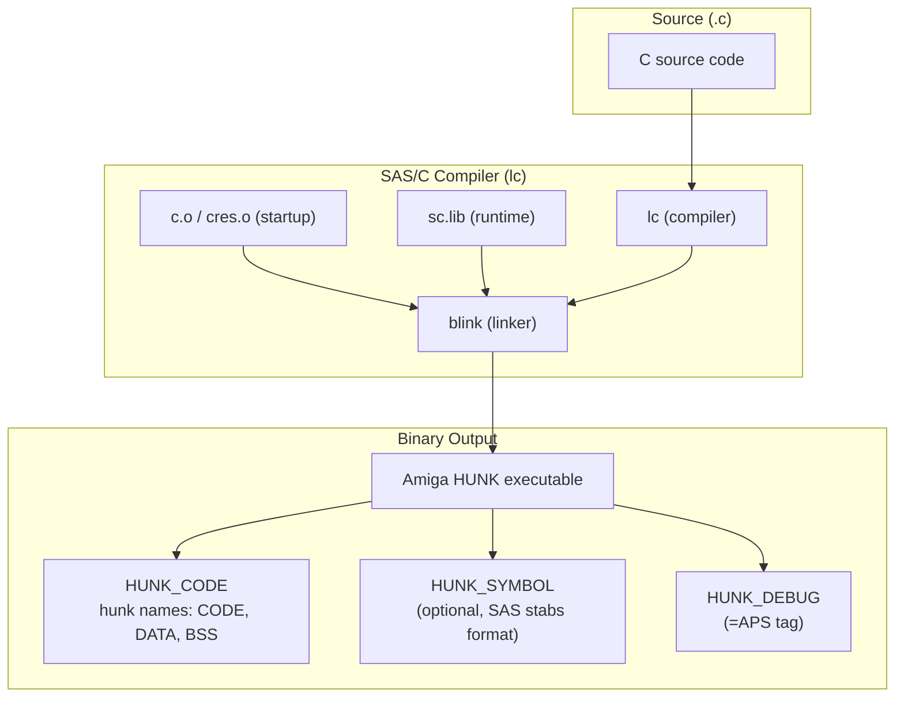

[← Home](../../../README.md) · [Reverse Engineering](../../README.md) · [Static Analysis](../README.md) · [Compilers](README.md)

# SAS/C 5.x/6.x — Reverse Engineering Field Manual

## Overview

**SAS/C** (originally Lattice C, rebranded at version 5) was the dominant commercial C compiler for AmigaOS from 1988 through 1996. Version 6.58 is the final release. An estimated **70–80% of Amiga C applications and libraries** from this era were compiled with SAS/C, making it the most common binary format a reverse engineer encounters. It produces code with a distinctive `LINK A5, #-N` + 9-register `MOVEM.L` prologue, absolute (relocated) string addressing, and library calls via `JSR -$XXX(A6)` with explicit global-to-A6 loads before each library call block.

Key constraints to internalize immediately:
- **A5 is the frame pointer** — always; SAS/C never omits the frame pointer. Arguments at positive offsets from A5 (+8, +12, ...), locals at negative offsets.
- **A4 is the small-data base** — when `-b0` (small data model) is enabled, global variables are addressed via `$offset(A4)`. When `-b1` (large data model), absolute addressing + relocation is used.
- **`__saveds` saves 13 registers** — `D2-D7/A2-A6` — the largest register save of any Amiga compiler. This is a unique fingerprint.
- **String constants are absolute-addressed** — `MOVE.L #string, Dn` — and rely on `HUNK_RELOC32` for relocation at load time. This is the opposite of GCC's PC-relative approach.



---

## Binary Identification — The SAS/C Signature

### Hunk Names

SAS/C uses standard Amiga hunk names:

```
Hunk 0: CODE   (executable code + read-only data like jump tables)
Hunk 1: DATA   (initialized global variables)
Hunk 2: BSS    (zero-initialized global variables)
```

Unlike GCC (which uses `.text`, `.data`, `.bss` per Unix convention), SAS/C uses the Amiga-native `CODE`/`DATA`/`BSS` names. This is the **first filter** — if you see `.text` as a hunk name, it's NOT SAS/C.

When `-b0` (small data model) is active, an additional `__MERGED` hunk may appear for the small-data segment.

### Function Prologue — The Canonical Pattern

The SAS/C prologue is the most recognizable pattern in Amiga reverse engineering:

```asm
; Standard SAS/C function prologue:
_function:
    LINK    A5, #-N                ; A5 = frame pointer, allocate N bytes for locals
    MOVEM.L D2-D7/A2-A4, -(SP)    ; save 9 callee-saved registers

; ... function body ...

; Standard SAS/C function epilogue:
    MOVEM.L (SP)+, D2-D7/A2-A4    ; restore registers (reverse order)
    UNLK    A5                     ; deallocate frame, restore old A5
    RTS                            ; return
```

**Frame pointer offset convention**:
```
(Saved A5)         ← A5 points here after LINK
Return address     ← +$04(A5)
Arg 1              ← +$08(A5)
Arg 2              ← +$0C(A5)
...
Local var 1        ← -$04(A5)
Local var 2        ← -$08(A5)
...
Saved D2           ← first saved register on stack (below locals)
```

> [!NOTE]
> **Fast double-check**: Count the MOVEM.L registers in the prologue. If it's `D2-D7/A2-A4` (9 registers), it's SAS/C. If it's `D3-D7` (5 registers), it's Aztec C. If it's `D2-D7/A2-A6` (11 registers), it's SAS/C `__saveds`. If there's no LINK at all, it's GCC or VBCC.

### String Addressing — The Globally Relocated Pattern

SAS/C stores string constants in the DATA hunk and references them via absolute addresses with relocation:

```asm
; SAS/C string reference:
    MOVE.L  #.string_const, D1     ; D1 = pointer to string
    ; The value #.string_const is patched by HUNK_RELOC32 at load time
    JSR     -$384(A6)              ; PutStr(D1)

; In the DATA hunk:
.string_const:  DC.B "Hello, World!", 0
```

This is the **key disambiguator** between SAS/C and GCC:
- SAS/C: `MOVE.L #string, Dn` — absolute address, requiring `HUNK_RELOC32`
- GCC: `LEA string(PC), A0` — PC-relative, no relocation needed

**In IDA/Ghidra**: SAS/C string xrefs are `DATA XREF` from the code to the DATA hunk. GCC strings appear as `CODE XREF` because the LEA references the string *within the same hunk* (GCC places strings in `.text` when PC-relative).

---

## Calling Conventions

SAS/C supports **four calling conventions** within a single binary. Recognizing each from the prologue alone is essential for correct function boundary analysis — but understanding the parameter mapping for each convention is equally critical for reconstructing function prototypes in IDA/Ghidra.

### SAS/C Register Roles — Quick Reference

| Register | `__stdargs` Role | `__reg`/`__regargs` Role | `__saveds`/`__interrupt` Role |
|---|---|---|---|
| **D0** | Return value; arg1 | Return value; arg1 | Saved (interrupt) / scratch (saveds) |
| **D1** | arg2; 64-bit return high word | arg2 | Saved (interrupt) / scratch (saveds) |
| **D2** | Callee-saved local/arg3+ | arg3 (callee-saved) | Saved |
| **D3** | Callee-saved local/arg4+ | arg4 (callee-saved) | Saved |
| **D4** | Callee-saved local | arg5 (callee-saved) | Saved |
| **D5** | Callee-saved local | arg6 (callee-saved) | Saved |
| **D6** | Callee-saved local | arg7 (callee-saved) | Saved |
| **D7** | Callee-saved local | arg8 (callee-saved) | Saved |
| **A0** | Scratch / arg pointer | arg9 (scratch) | Saved (interrupt) / scratch (saveds) |
| **A1** | Scratch / arg pointer | arg10 (scratch) | Saved (interrupt) / scratch (saveds) |
| **A2** | Callee-saved local | Callee-saved (args 11+ on stack) | Saved |
| **A3** | Callee-saved local | Callee-saved | Saved |
| **A4** | Small-data base (`-b0`) or callee-saved | Small-data base or callee-saved | Saved |
| **A5** | **Frame pointer** (LINK A5) | **Frame pointer** | Saved (callee's A5) |
| **A6** | Library base (destroyed across calls) | Library base (destroyed) | Saved (`__saveds` only) |

### 1. `__stdargs` — Standard C Calling (Default)

```asm
; __stdargs function prologue:
    LINK    A5, #-N
    MOVEM.L D2-D7/A2-A4, -(SP)    ; 9 registers

; Parameter passing:
;   D0, D1 = first two integer/pointer args (through registers)
;   (A5+8), (A5+12), ... = remaining args on stack (right-to-left push)
; Register preservation:
;   D2-D7, A2-A4 preserved across call
;   D0, D1, A0, A1 are scratch (caller-saved)
;   A4 preserved (small-data base or callee-saved)
```

**Parameter layout in the callee**:

```
After LINK A5, #-N and MOVEM.L D2-D7/A2-A4, -(SP):

  ┌──────────────────────────────┐  Higher addresses
  │ arg5                         │  $18(A5)  ← fifth stack arg
  │ arg4                         │  $14(A5)  ← fourth stack arg
  │ arg3                         │  $10(A5)  ← third stack arg
  │ arg2 (if >2 params total)    │  $0C(A5)  ← second stack arg
  │ arg1 (if >0 params total)    │  $08(A5)  ← first stack arg
  ├──────────────────────────────┤
  │ return address               │  $04(A5)
  ├──────────────────────────────┤
  │ saved A5 (caller's frame)    │  $00(A5)  ← A5 points here
  │ local var 1                  │ -$04(A5)
  │ local var 2                  │ -$08(A5)
  │ ...                          │
  │ local var N                  │ -$N(A5)
  │ saved D2                     │ -(N+4)(A5)  ← first saved register
  │ saved D3                     │
  │ ...                          │
  │ saved A4                     │
  └──────────────────────────────┘  Lower addresses (SP) = -(N+36)(A5)
```

> [!NOTE]
> **The "+8 offset rule" for `__stdargs`**: The first stack-based argument is always at `$08(A5)`, even in functions with zero parameters. This is because `$00(A5)` = saved A5, `$04(A5)` = return address, `$08(A5)` = caller's space for arg1. SAS/C always allocates space for the first two register args on the stack as well (they're at `$08(A5)` and `$0C(A5)`), even though the callee accesses them via D0/D1. This means `$10(A5)` is the third parameter (the first truly-stack-based one).

**Locating parameters in SAS/C `__stdargs` disassembly**:

| Parameter | Location | Disassembly Pattern |
|---|---|---|
| **arg1** | D0 on entry | Look for `MOVE.L D0, Dn` or `MOVE.L D0, -$XX(A5)` early in the function |
| **arg2** | D1 on entry | Look for `MOVE.L D1, Dn` immediately after arg1 is handled |
| **arg3** | `$10(A5)` | First truly-stack argument — `MOVE.L $10(A5), Dn` |
| **arg4** | `$14(A5)` | `MOVE.L $14(A5), Dn` |
| **arg5** | `$18(A5)` | `MOVE.L $18(A5), Dn` — sequential 4-byte increments |

```asm
; Example: function with 5 arguments in __stdargs convention
; C prototype: LONG Process(BPTR fh, STRPTR buf, LONG size, LONG flags, LONG mode)

_Process:
    LINK    A5, #-$10                ; 16 bytes of locals
    MOVEM.L D2-D4/A2, -(SP)        ; save 4 regs (16 bytes)

    MOVE.L  D0, D2                  ; D2 = fh (arg1 from D0)
    MOVEA.L D1, A2                  ; A2 = buf (arg2 from D1)
    MOVE.L  $10(A5), D3             ; D3 = size (arg3 from stack)
    MOVE.L  $14(A5), D4             ; D4 = flags (arg4 from stack)
    MOVE.L  $18(A5), -$04(A5)       ; mode → local (arg5 from stack)
    ; ... function body ...
```

### 2. `__reg` / `__regargs` — Register Argument Convention

```asm
; __reg function prologue:
    LINK    A5, #-N
    MOVEM.L D2-D7/A2-A4, -(SP)    ; same save set as __stdargs

; Parameter passing difference:
;   D0  = arg1     D4 = arg5     A0 = arg9
;   D1  = arg2     D5 = arg6     A1 = arg10
;   D2  = arg3     D6 = arg7     arg11+ on stack at $08(A5), $0C(A5)...
;   D3  = arg4     D7 = arg8
;   Up to 10 register arguments before stack overflow
;   More efficient for small functions with register-friendly param types
```

**`__reg` parameter-to-register mapping**:

| Param # | Register | Notes |
|---|---|---|
| 1 | D0 | Also holds return value on exit |
| 2 | D1 | Also holds 64-bit return high word |
| 3 | D2 | Callee-saved — caller must not expect D2 preserved across this call |
| 4 | D3 | Callee-saved in normal convention, but passed as arg here |
| 5 | D4 | Callee-saved in normal convention |
| 6 | D5 | Callee-saved in normal convention |
| 7 | D6 | Callee-saved in normal convention |
| 8 | D7 | Callee-saved in normal convention |
| 9 | A0 | Normally scratch — passed as arg here |
| 10 | A1 | Normally scratch — passed as arg here |
| 11+ | Stack at `$08(A5)`, `$0C(A5)`... | Same stack layout as `__stdargs` |

> [!WARNING]
> **`__reg` breaks the normal callee-saved contract.** Under `__stdargs`, D2-D7 are callee-saved — the caller can expect them to survive a function call. Under `__reg`, D2-D7 carry arguments and ARE destroyed by the callee. The SAS/C linker tracks which convention each function uses and generates correct caller-side code, but in hand-analysis this means you CANNOT assume D2-D7 survive a call unless you know the callee's convention.

**Identification**: A `__reg` function looks identical to `__stdargs` in the prologue (LINK A5 + MOVEM.L D2-D7/A2-A4). The difference is at the **call site** — `__reg` functions are called with args in many registers, while `__stdargs` uses only D0/D1 + stack. The SAS/C linker resolves the correct convention through its own internal calling-convention table.

### 3. `__saveds` — All-Registers-Saved Convention

```asm
; __saveds function — unique 13-register save:
_saveds_func:
    MOVEM.L D2-D7/A2-A6, -(SP)    ; 13 registers — the SAS/C fingerprint
    ; Note: NO LINK A5 before MOVEM.L — __saveds uses a different frame setup
    LINK    A5, #-N                ; frame pointer after register save (sometimes)

; Typical use cases:
;   - Interrupt handlers
;   - Hook callback functions (struct Hook.h_Entry)
;   - Library entry points (LibOpen, LibClose, LibExpunge)
;   - Functions called from a different task context
```

> [!WARNING]
> `__saveds` preserves A4 (the small-data base) in addition to the standard set. If you see `MOVEM.L D2-D7/A2-A6, -(SP)` (11 registers for data, 2 for address + A6), it's unequivocally SAS/C `__saveds`. No other Amiga compiler saves A6 in the callee-save set.

**`__saveds` parameter passing**: Uses the same `__stdargs` parameter convention (D0/D1 + stack). The only difference is the prologue saves 13 registers instead of 9, making the function safe to call from any context — even if the caller expects A4, A5, or A6 to be preserved.

### 4. `__interrupt` — Interrupt Handler Convention

```asm
; __interrupt handler — saves ALL registers:
_int_handler:
    MOVEM.L D0-D7/A0-A6, -(SP)    ; save every register (15 regs)
    ; ... interrupt body ...
    MOVEM.L (SP)+, D0-D7/A0-A6    ; restore all
    RTE                            ; Return From Exception (not RTS!)
```

**Critical identification**: The `RTE` instruction (not `RTS`) marks this as an interrupt handler. Search for `RTE` instructions in the binary — every one points to an interrupt handler, most of which are SAS/C `__interrupt` functions.

---

### Parameter Passing — Locating Args in the Disassembly

This section provides a systematic method for identifying function parameters in SAS/C binary output, organized by convention and argument position.

**For `__stdargs` functions (most common):**

```asm
; Function: LONG DoSomething(LONG a, LONG b, LONG c, LONG d)
;           a=D0, b=D1, c=$10(A5), d=$14(A5)

_DoSomething:
    LINK    A5, #-$08
    MOVEM.L D2-D3, -(SP)

    MOVE.L  D0, D2                  ; D2 = a (register → callee-saved)
    MOVE.L  D1, D3                  ; D3 = b (register → callee-saved)
    MOVE.L  $10(A5), -(SP)          ; push c (stack arg → push for sub-call)
    MOVE.L  $14(A5), D0             ; D0 = d (stack arg → scratch)
    ; ...
```

**For `__reg`/`__regargs` functions:**

```asm
; Function: LONG __reg DoFast(LONG a, LONG b, LONG c, LONG d, LONG e, LONG f)
;           a=D0, b=D1, c=D2, d=D3, e=D4, f=D5

_DoFast:
    LINK    A5, #$00                 ; no locals needed
    MOVEM.L D2-D5, -(SP)            ; save regs that hold args (they're callee-saved in this convention!)

    ; Note: D0-D1 are NOT saved (they're scratch + return value)
    ; D2-D5 ARE saved because __reg treats them as callee-saved AFTER receiving args
    ; This means: after the MOVEM, D2=arg3, D3=arg4, etc. are on the stack
    ; The function body must reload them if needed:
    MOVE.L  (SP), D2                ; reload arg3 from stack (was D2)
    ADD.L   4(SP), D2               ; add arg4 (was D3)
    ; ...
```

> [!NOTE]
> **The `__reg` save paradox**: In `__reg` functions, D2-D7 carry arguments on entry, BUT the callee saves them in the prologue. This means the register values are on the stack after `MOVEM.L`. If you see a `__reg` function that saves D2-D5 and then immediately reloads them from the stack, it's not redundant — it's the convention keeping the callee-save contract while using those registers for parameter passing.

### Register vs Stack Variables in SAS/C

SAS/C's register allocator differs from GCC's in important ways. Understanding how SAS/C decides between register and stack allocation is essential for tracking variable lifetimes in disassembly.

#### SAS/C Register Allocation Heuristics

| Factor | SAS/C Behavior |
|---|---|
| **Optimization level** | -O0: everything on stack. -O1: scalars to registers. -O2: loop counters and frequently-used to D6/D7. -O3: aggressive register coloring, may keep 6+ locals in registers. |
| **Variable type** | 32-bit integers and pointers preferred for D2-D7. 8/16-bit values go to D2-D7 but with masking. Structs and arrays ALWAYS on stack. |
| **Address-taken (`&x`)** | Forces stack allocation — SAS/C cannot take the address of a register. |
| **`register` keyword** | Strong hint to prefer D2-D7. SAS/C respects `register` more aggressively than GCC. |
| **Loop counters** | At -O2+, loop induction variables are placed in D6 or D7 and kept there for the loop body. Look for `DBRA D7, loop`. |
| **Spill strategy** | SAS/C spills D2 first, then D3, etc. (D2 is "least valuable" under SAS/C's cost model). A5-relative stack slots for spills are at negative offsets. |

#### Identifying Register Variables

```asm
; SAS/C -O2: count and in_word in registers
_CountWords:
    LINK    A5, #-$08              ; 8 bytes of locals (but count & in_word won't use them!)
    MOVEM.L D2-D3, -(SP)          ; D2-D3 saved → they WILL be used as named locals

    MOVEQ   #0, D2                 ; D2 = count  ← initialized in register
    MOVEQ   #0, D3                 ; D3 = in_word ← initialized in register
    MOVEA.L $08(A5), A0            ; A0 = str (arg1, loaded once)

.loop:
    ; ... D2 incremented with ADDQ.L #1, D2 — never loaded from stack
    ; ... D3 tested with TST.B D3 — always in register
    DBRA    D7, .loop

    MOVE.L  D2, D0                 ; return count from D2 (not from stack)
    MOVEM.L (SP)+, D2-D3
    UNLK    A5
    RTS
```

**Key signs of register variables in SAS/C:**
- Saved in the `MOVEM.L` prologue → the register hosts a named local for the function's lifetime
- Modified with `ADDQ`, `SUBQ`, `MOVEQ`, or `MOVE.L #imm, Dn` operating directly on the register
- Tested with `TST.B Dn`, `CMP.L Dn, Dm` without a preceding stack load
- Returned via `MOVE.L Dn, D0` at function exit
- **Absence of frame-offset references** — the `-$XX(A5)` offsets that would correspond to the variable never appear in load/store instructions

#### Identifying Stack Variables

```asm
; SAS/C -O0: everything on stack
_CountWords_O0:
    LINK    A5, #-$08              ; 8 bytes: -$04(A5) = count, -$08(A5) = in_word
    MOVEM.L D2-D7/A2-A4, -(SP)    ; full save (O0 always saves all)

    CLR.L   -$04(A5)               ; count = 0  ← direct stack write
    CLR.L   -$08(A5)               ; in_word = 0
    MOVEA.L $08(A5), A0

    ; ...
    ADDQ.L  #1, -$04(A5)           ; count++ — read-modify-write to stack
    ; ...
    MOVE.L  -$08(A5), D0           ; load in_word from stack for test
    TST.B   D0

.done:
    MOVE.L  -$04(A5), D0           ; return count from stack
    MOVEM.L (SP)+, D2-D7/A2-A4
    UNLK    A5
    RTS
```

**Key signs of stack variables in SAS/C:**
- `-$04(A5)`, `-$08(A5)`, etc. appear repeatedly in `MOVE.L` and `ADDQ.L` instructions
- Every read is a `MOVE.L $offset(A5), Dn`
- Every modification is `MOVE Dn, $offset(A5)` or read-modify-write (`ADDQ #1, $offset(A5)`)
- The same offset is used in multiple non-consecutive instructions
- At -O0: ALL locals are stack-based regardless of type

#### SAS/C Spill Recognition

SAS/C spills registers when a function has more live variables than available registers (D2-D7, A2-A4 = 9 registers max for scalars):

```asm
; 11 local variables + 3 parameters → register pressure at -O2:
_BigFunction:
    LINK    A5, #-$30              ; 48 bytes of locals (many stack-resident)
    MOVEM.L D2-D7/A2-A4, -(SP)    ; all usable regs saved

    MOVE.L  D0, D7                 ; D7 = arg1
    MOVE.L  D1, D6                 ; D6 = arg2
    ; ... D2-D5 used for 4 frequently-accessed locals ...
    ; Remaining 7 locals live on stack at -$04(A5) through -$1C(A5)

    ; Spill: D2 needed for a computation, but D2 holds 'count':
    MOVE.L  D2, -$20(A5)           ; spill count to reserved slot
    ; ... use D2 for temp computation ...
    MOVE.L  -$20(A5), D2           ; reload count
```

**Spill identification in SAS/C**:
- A register is saved in the prologue MOVEM
- Mid-function, the register's value is stored to a frame offset that appears ONLY in one store/load pair
- The register is then used for a different purpose
- Later, the value is reloaded from that same offset
- The spill slot is typically at a larger negative offset (past the named locals)

#### Optimization Level → Variable Location Quick-Reference

| Level | Register Variables | Stack Variables | Spills |
|---|---|---|---|
| **-O0** | None — D0/D1 only for expression temps | ALL locals, including loop counters | Only for `__reg` param overflow |
| **-O1** | Scalar locals with `register` keyword; simple loop counters | Arrays, structs, address-taken vars | Rare — simple functions |
| **-O2** | Most scalar locals (≤ 9); loop counters in D6/D7 | Arrays, structs, address-taken vars | Functions with >9 scalar locals |
| **-O3** | Aggressive: keeps variables in regs across basic blocks | Same as -O2 | More common due to aggressive inlining increasing register pressure |

### Function Call Site Patterns

Recognizing how callers set up arguments reveals both the callee's convention AND the caller's variable layout.

```asm
; ─── Calling a __stdargs function with 3 args ───
; C: result = Process(fh, buf, size);

    MOVE.L  -$04(A5), -(SP)         ; push size (arg3, right-to-left)
    MOVEA.L -$08(A5), A0            ; buf into scratch reg
    MOVE.L  A0, D1                  ; D1 = buf (arg2)
    MOVE.L  -$0C(A5), D0            ; D0 = fh (arg1)
    BSR     _Process
    ADDQ.L  #4, SP                  ; caller cleans stack arg
    ; D0 = return value

; ─── Calling a __reg function with 6 args ───
; C: result = DoFast(a, b, c, d, e, f);

    MOVE.L  f, -(SP)                ; arg6 on stack (args 11+, but only 6 here)
    MOVEA.L e_ptr, A1               ; A1 = arg5 (address)
    MOVE.L  d_val, D7               ; D7 = arg4 (but D7 is callee-saved!)
    MOVE.L  c_val, D6               ; D6 = arg3
    MOVE.L  b_val, D5               ; D5 = arg2  ← NOTE: D5, not D1!
    MOVE.L  a_val, D4               ; D4 = arg1  ← NOTE: D4, not D0!
    BSR     _DoFast                  ; __reg uses D0-D7 in CALLEE's parameter order
    ; No stack cleanup needed if only 1 stack arg (popped by callee or ignored)

; ─── Calling a __stdargs function with >2 args (SAS/C -O2 pattern) ───
; The classic pattern: args beyond D0/D1 pushed right-to-left

    MOVE.L  D2, -(SP)               ; arg5 — might be a register variable
    MOVE.L  $14(A5), -(SP)          ; arg4 — might be a stack variable
    MOVEA.L $10(A5), A0             ; arg3 → A0, then to stack
    MOVE.L  A0, -(SP)               ; push arg3
    MOVEA.L D3, A0                  ; arg2 → A0, then to D1
    MOVE.L  A0, D1                  ; D1 = arg2
    MOVE.L  D4, D0                  ; D0 = arg1
    BSR     _TargetFunc
    LEA     $0C(SP), SP             ; clean 12 bytes (3 stack args)
```

**Key call-site patterns by convention**:

| Convention | Register Args | Stack Args | Caller Cleanup |
|---|---|---|---|
| **`__stdargs`** | D0, D1 only | Push remaining right-to-left | `ADDQ.L #N*4, SP` or `LEA N*4(SP), SP` |
| **`__reg`/`__regargs`** | D0-D7, A0-A1 (sequential) | Push remaining right-to-left | Same as `__stdargs` |
| **`__saveds`** | D0, D1 only (uses `__stdargs` param convention) | Same as `__stdargs` | Same as `__stdargs` |
| **`__interrupt`** | N/A (called by CPU, not by code) | N/A | N/A (RTE handles stack) |

> [!NOTE]
> **The `__reg` D0/D1 anomaly**: In `__reg` functions, D0 and D1 are arg1 and arg2 — just like `__stdargs`. The difference starts at arg3: under `__stdargs` it's on the stack; under `__reg` it's in D2. This means a `__reg` call with up to 2 parameters looks IDENTICAL to `__stdargs` at the call site. Only with 3+ parameters can you distinguish them (D2 loaded with a value before the BSR means `__reg`; stack push means `__stdargs`).

## Library Call Patterns

### The Classic Library Call Sequence

SAS/C library calls follow a rigid, predictable pattern:

```asm
; Step 1: Load library base from global variable
    MOVEA.L _DOSBase, A6          ; global → A6 (absolute address + relocation)

; Step 2: Set up arguments in registers
    MOVE.L  D7, D1                ; arg1: file handle
    MOVE.L  buffer_ptr, D2        ; arg2: buffer pointer
    MOVE.L  #$100, D3             ; arg3: length

; Step 3: JSR through LVO
    JSR     -$2A(A6)              ; Read() — LVO = -$2A = -42 decimal
    ; D0 = return value (bytes read, or -1 on error)

; Step 4: Check return value
    TST.L   D0
    BMI.S   .error_handler        ; negative = error
```

**Why the explicit global load?** SAS/C does **not** cache A6 across function calls. After every `JSR`/`BSR` that might modify A6, SAS/C reloads the library base from a named global variable (`_DOSBase`, `_IntuitionBase`, `_GfxBase`, etc.) before the next library call. This creates consistent `MOVE.L _LibBase, A6` → `JSR -$XXX(A6)` pairs that IDA can use to:
1. Identify which library each call targets
2. Rename library calls from LVO offsets
3. Trace library open/close sequences

### Global Library Base Variables

| Global Name | Library | Typical Open Pattern |
|---|---|---|
| `_SysBase` | exec.library | `MOVEA.L 4.W, A6` at startup |
| `_DOSBase` | dos.library | `OpenLibrary("dos.library", 0)` |
| `_IntuitionBase` | intuition.library | `OpenLibrary("intuition.library", version)` |
| `_GfxBase` | graphics.library | `OpenLibrary("graphics.library", version)` |
| `_UtilityBase` | utility.library | `OpenLibrary("utility.library", version)` |

These names typically appear in `HUNK_SYMBOL` if debug info is present. Even without symbols, the pattern `MOVE.L $xxxxxxxx, A6` followed by `JSR -$XXX(A6)` where `$xxxxxxxx` is in the DATA hunk identifies a library base global.

### LVO Dispatch

```asm
; All library calls: JSR -$offset(A6)
; where offset = LVO * 6 (each LVO entry is 6 bytes: JMP instruction)
; LVO $01 = offset -$06
; LVO $1E = offset -$B4 (for Open)
; LVO $2A = offset -$FC (for Read)

; Common SAS/C library call frames:
    MOVEA.L _DOSBase, A6
    JSR     -$1E(A6)              ; Open()      — LVO $05
    JSR     -$24(A6)              ; Close()     — LVO $06
    JSR     -$2A(A6)              ; Read()      — LVO $07
    JSR     -$30(A6)              ; Write()     — LVO $08
    JSR     -$36(A6)              ; Seek()      — LVO $09
```

---

## Pragmas and Code Generation Effects

SAS/C `#pragma` directives alter code generation in ways visible in disassembly:

### `#pragma amicall` — Library Call Convention

```c
#pragma amicall(DOSBase, 0x1E, Open(d1, d2))
// Generates: args in D1, D2; return in D0; A6 = DOSBase
```

In disassembly, `amicall` functions are indistinguishable from `__reg` functions — they use register arguments. The difference is that `amicall` functions rely on the pragma for their calling convention rather than the `__reg` keyword.

### `#pragma amiga-align` — Struct Alignment

This pragma changes struct field alignment from the compiler default to AmigaOS natural alignment. In disassembly, it affects **struct field offsets** — without this pragma, 16-bit fields might be at odd offsets (breaking hardware register access). With it, all fields align to their natural boundaries.

**Detection**: If you see struct access at offsets consistent with `sizeof(UWORD) = 2` and `sizeof(ULONG) = 4` alignment, the code was compiled with `amiga-align`. If you see misaligned access (e.g., `MOVE.W $000F(A0)`, odd offset), alignment is off.

### `#pragma donotcombine` — Inhibit Optimization

Prevents the optimizer from combining adjacent operations. In disassembly, this produces "unoptimized-looking" code even at `-O2` — sequential loads/stores that a normal optimizer would merge into a single `MOVE.L` pair.

### `#pragma stackextent` — Stack Size Specification

```c
#pragma stackextent 8192    // 8 KB stack
// Embedded in hunk header: HUNK_HEADER stack_size field
```

Visible in the HUNK header, not the code. The `hunkinfo` tool shows the stack size. In IDA, check the hunk header fields.

---

## Optimization Levels — Reading the Tea Leaves

SAS/C optimization levels produce progressively more aggressive transformations visible in disassembly:

| Level | Flag | What Changes in the Binary |
|---|---|---|
| **-O0** (none) | No flag | Every C statement → separate instruction sequence. Redundant loads/stores. Full register save even when unused. |
| **-O1** (basic) | `-O` | Dead code elimination, constant folding. `MOVE.L #0, D0` → `MOVEQ #0, D0`. Simple peephole. |
| **-O2** (global) | `-O -O` | Common subexpression elimination. Loop-invariant code motion. `for` loop counter in register, not stack. |
| **-O3** (aggressive) | `-O -O -O` | Function inlining (small static functions). Branch optimization. `MOVE.L (A0)+, (A1)+` for struct copies. |

**How to identify optimization level from binary**:
- **-O0**: Every local variable lives at `-$XX(A5)` (on stack). Every expression is loaded, computed, stored separately.
- **-O1+**: Variables kept in registers across multiple statements. Stack traffic reduced.
- **-O2+**: Loop counters in D6/D7. `DBRA Dn, loop` patterns.
- **-O3**: Small helper functions inlined — no `BSR`/`RTS` for functions called once.

---

## Startup Code — `c.o` vs `cres.o`

### Standard Startup (`c.o` — CLI/Workbench)

```asm
; SAS/C c.o entry point — the first code in HUNK_CODE:
_start:
    MOVE.L  4.W, A6               ; SysBase = *(ULONG *)4
    MOVE.L  A6, _SysBase          ; store in global
    MOVE.L  D0, _RawCommandLen    ; save CLI arg length
    MOVE.L  A0, _RawCommandStr    ; save CLI arg pointer
    TST.L   A1                     ; A1 = NULL → CLI, non-NULL → Workbench
    BEQ.S   .cli_entry

.wb_entry:
    MOVE.L  A1, _WBenchMsg        ; save WBStartup message
    JSR     _OpenLibraries
    BSR     _main                  ; call main() — BSR, not JSR
    BRA.S   .exit

.cli_entry:
    JSR     _OpenLibraries
    BSR     _main

.exit:
    MOVE.L  D0, _ReturnCode
    JSR     _CloseLibraries
    RTS
```

**Key RE insight**: To find `main()`, locate the `_start` entry point and look for the **first `BSR`** after the library open sequence. That `BSR` target is `main()`.

### Resident Startup (`cres.o` — Libraries/ROM)

```asm
; cres.o generates a RomTag for auto-init libraries:
_romtag:
    DC.W    $4AFC                    ; RTC_MATCHWORD
    DC.L    _romtag                  ; RT_MATCHTAG (self-pointer)
    DC.L    _endskip                 ; RT_ENDSKIP
    DC.B    RTF_AUTOINIT             ; RT_FLAGS
    DC.B    39                       ; RT_VERSION (V39 = OS 3.1)
    DC.B    NT_LIBRARY               ; RT_TYPE
    DC.B    0                        ; RT_PRI
    DC.L    _libname                 ; RT_NAME
    DC.L    _idstring                ; RT_IDSTRING
    DC.L    _inittable               ; RT_INIT (InitTable)
```

---

## Debug Info — SAS Stabs Format

SAS/C uses its own stabs variant with the `=APS` tag in `HUNK_DEBUG`:

```
HUNK_DEBUG format:
  =APS tag at start of debug hunk
  Source file:  =APS filename.c
  Function:     =APS _funcname
  Line number:  =APS 123
  Local var:    =APS varname:D(0,13)  ← D0-D7 or A0-A7 (13=offset in stack)
                =APS varname:S(4)     ← S(offset) = stack-based
```

**IDA/Ghidra integration**: The Amiga HUNK loader plugin for IDA can parse SAS stabs and create local variable names. Without the plugin, the `=APS` strings are visible in the debug hunk as ASCII strings that can be manually cross-referenced.

---

## Same C Function — SAS/C Output

```asm
; CountWords() — SAS/C 6.58, -O2, -b1 (large data):
; C prototype: ULONG CountWords(CONST_STRPTR str)

_CountWords:
    LINK    A5, #-$08              ; 8 bytes for locals: count, in_word
    MOVEM.L D2-D3, -(SP)          ; save D2-D3 (only registers actually used)
    
    ; count = 0
    MOVEQ   #0, D2                 ; D2 = count (register variable)
    
    ; in_word = FALSE
    MOVEQ   #0, D3                 ; D3 = in_word (register variable)
    
    ; str → A0
    MOVEA.L $08(A5), A0            ; A0 = str (arg1)
    
    BRA.S   .loop_test

.loop_body:
    MOVEQ   #' ', D0               ; D0 = ' '
    CMP.B   (A0), D0               ; *str == ' '?
    BEQ.S   .set_not_word
    
    MOVEQ   #'\t', D0              ; D0 = '\t'
    CMP.B   (A0), D0               ; *str == '\t'?
    BEQ.S   .set_not_word
    
    MOVEQ   #'\n', D0              ; D0 = '\n'
    CMP.B   (A0), D0               ; *str == '\n'?
    BEQ.S   .set_not_word
    
    TST.B   D3                      ; in_word == TRUE?
    BNE.S   .next_char
    
    ADDQ.L  #1, D2                  ; count++
    MOVEQ   #1, D3                  ; in_word = TRUE
    BRA.S   .next_char

.set_not_word:
    MOVEQ   #0, D3                  ; in_word = FALSE

.next_char:
    ADDQ.L  #1, A0                  ; str++

.loop_test:
    TST.B   (A0)                    ; *str != '\0'?
    BNE.S   .loop_body

.return:
    MOVE.L  D2, D0                  ; return count
    MOVEM.L (SP)+, D2-D3           ; restore
    UNLK    A5
    RTS
```

**SAS/C-specific observations in this output**:
1. **`LINK A5, #-$08`** — frame pointer allocated even though locals are in registers. SAS/C always creates a frame.
2. **`$08(A5)`** — argument access at fixed positive offset from A5 frame pointer.
3. **`MOVEQ`** for small constants — SAS/C peephole optimizer converts `MOVE.L #0, Dn` to `MOVEQ #0, Dn`.
4. **Individual `CMP.B` chains** — even with `-O2`, SAS/C 6.x doesn't merge adjacent compare constants into a jump table for 3 cases. At `-O3`, it might unroll further.
5. **`BRA.S .loop_test`** — explicit branch to loop test at top. At `-O0`, the loop test would be duplicated (once at entry, once at bottom).
6. **Register variable assignment**: `D2 = count`, `D3 = in_word` — optimizer keeps loop variables in registers, not on stack.

**Compare with other compilers**:
- SAS/C uses `MOVEQ #' ', D0` → `CMP.B (A0), D0` (load constant, then compare)
- GCC uses `CMPI.B #' ', (A0)` (compare immediate to memory) — fewer instructions
- VBCC uses tail-call optimization (`BRA.S` to shared epilogue) more aggressively

---

## Named Antipatterns

### "The A6 Blind Spot" — Assuming Constant Library Base

```asm
; BAD analysis: assuming A6 = exec throughout this function
    MOVEA.L _DOSBase, A6          ; A6 = DOS
    JSR     -$1E(A6)              ; Open() — correct
    ; ... many lines later ...
    MOVEA.L _execbase, D0         ; oh wait, loaded something else
    MOVEA.L D0, A6
    JSR     -$C6(A6)              ; THIS IS AllocMem, NOT Write!
    ; If you misidentify A6, every JSR LVO after this point is WRONG
```

**Fix**: Track **every** `MOVEA.L xxx, A6` in the function. Each one potentially switches the library context. Search for `MOVE.*A6` patterns in IDA.

### "The Missing A4" — Small Data Model Confusion

```asm
; BAD analysis: treating A4-relative access as unknown offset
    MOVE.L  -$7FFC(A4), D0        ; "what is this? some struct at negative offset?"
; WRONG — this is a small-data global variable accessed via A4 base

; CORRECT identification:
; SAS/C -b0 (small data model): A4 = small-data base pointer
; -$7FFC(A4) = first global in the small-data segment
; This offset is patched at link time by blink
```

### "The Phantom RTS" — Multiple Return Points

```asm
; SAS/C functions often have multiple return points from inlined cleanup:
_func:
    LINK    A5, #-N
    MOVEM.L D2-D7/A2-A4, -(SP)
    ; ... code ...
    BEQ     .error_exit            ; early return path
    
    ; ... more code ...
    MOVEM.L (SP)+, D2-D7/A2-A4
    UNLK    A5
    RTS                            ; return point 1

.error_exit:
    MOVEQ   #-1, D0                ; error code
    MOVEM.L (SP)+, D2-D7/A2-A4
    UNLK    A5
    RTS                            ; return point 2
; Both RTS belong to the same C function!
```

---

## Pitfalls & Common Mistakes

### 1. Confusing SAS/C `__saveds` with Interrupt Handlers

```asm
; __saveds (NOT an interrupt — returns with RTS):
_saveds_func:
    MOVEM.L D2-D7/A2-A6, -(SP)    ; 13 regs — user-mode function, likely a hook
    ; ...
    MOVEM.L (SP)+, D2-D7/A2-A6
    RTS                            ; RTS, not RTE!

; __interrupt (IS an interrupt — returns with RTE):
_int_func:
    MOVEM.L D0-D7/A0-A6, -(SP)    ; 15 regs (D0-D1, A0-A1 too)
    ; ...
    MOVEM.L (SP)+, D0-D7/A0-A6
    RTE                            ; Return From Exception
```

**Key distinction**: `__saveds` saves D2-D7/A2-A6 (13 registers) and uses `RTS`. `__interrupt` saves D0-D7/A0-A6 (15 registers) and uses `RTE`. The `RTE` vs `RTS` tells you whether this runs in user or supervisor context.

### 2. Misidentifying `-b0` (Small Data) Globals as Stack Variables

```asm
; Small data model (-b0): A4-relative addressing
    MOVEQ   #0, D0
    MOVE.W  D0, -$1234(A4)        ; stores to global at offset -$1234 from A4 base
; This is NOT a stack access — A4 is NOT the stack pointer (A7/SP is)
; A4 is the small-data base, loaded once at startup and never modified
```

### 3. Overlooking `__no_stack_check` Functions

SAS/C normally inserts stack overflow checks at function entry:
```asm
; Normal function (with stack check):
    LINK    A5, #-$200             ; large frame
    JSR     ___check_stack         ; SAS/C stack probe — if missing, __no_stack_check
```

When `__no_stack_check` is in effect, the `JSR ___check_stack` call is absent. This is common in leaf functions and performance-critical code. The absence of this call is a signal that the function was compiled with `__no_stack_check`.

---

## Use Cases

### Software Known to Be SAS/C-Compiled

| Application | Version | RE Clues |
|---|---|---|
| **Directory Opus 4/5** | SAS/C 6.x | Complex module system with ARexx integration; `_DOSBase`/`_IntuitionBase` globals visible |
| **FinalWriter** | SAS/C 6.x | Large DATA hunk with relocated string tables; custom memory allocator wraps AllocMem |
| **AmigaOS 3.1 ROM** | SAS/C 6.x + assembly | `CODE`/`DATA` hunks; RomTag structures at hunk 0 start; `__saveds` library entries |
| **Deluxe Paint IV** | SAS/C 5.x | Mixed C + assembly; C modules use LINK A5 prologues between hand-tuned asm sections |
| **VistaPro** | SAS/C 6.x | Heavy math; FPU calls via 68881 coprocessor interface; `__saveds` interrupt handlers |
| **Most NDK 3.9 example code** | SAS/C 6.x | Demonstrates all conventions: `__stdargs`, `__reg`, `__saveds`, `pragma libcall` |

### Library Example — Typical .library Compiled with SAS/C

```asm
; A SAS/C-compiled shared library entry:
_romtag:
    DC.W    $4AFC
    DC.L    _romtag
    DC.L    _endskip
    DC.B    RTF_AUTOINIT
    DC.B    39                      ; V39
    DC.B    NT_LIBRARY
    DC.B    0
    DC.L    _libname                ; "mylib.library"
    DC.L    _idstring               ; "mylib 39.1 (2026-01-01)"
    DC.L    _inittable

_inittable:
    DC.L    _libsize                ; sizeof(struct MyLibBase)
    DC.L    _funcTable              ; function pointer array
    DC.L    _dataTable              ; NULL for most libraries
    DC.L    _initFunc               ; LibInit() — __saveds

_funcTable:
    DC.L    _LibOpen                ; LVO -$1E
    DC.L    _LibClose               ; LVO -$24
    DC.L    _LibExpunge             ; LVO -$2A
    DC.L    _LibReserved            ; LVO -$30
    DC.L    _MyFunc1                ; LVO -$36
    DC.L    -1                      ; terminator
```

---

## IDA Python — SAS/C Auto-Detection

```python
def detect_sasc():
    """Detect SAS/C binaries by checking for signature patterns."""
    import idautils, idc

    link_a5_count = 0
    saveds_count = 0
    interrupt_count = 0
    total_functions = 0

    for func_ea in idautils.Functions():
        total_functions += 1
        # Check first 4 instructions of each function
        ea = func_ea
        for i in range(4):
            mnem = idc.print_insn_mnem(ea)
            if mnem == 'LINK' and 'A5' in idc.print_operand(ea, 0):
                link_a5_count += 1
                break
            elif mnem == 'MOVEM.L':
                operands = idc.print_operand(ea, 0) + idc.print_operand(ea, 1)
                if 'A6' in operands:
                    saveds_count += 1
                if all(r in operands for r in ['D0', 'A0']):
                    interrupt_count += 1
                break
            ea = idc.next_head(ea)

    ratio = link_a5_count / total_functions if total_functions > 0 else 0
    if ratio > 0.7:
        print(f"SAS/C DETECTED: {ratio*100:.0f}% functions use LINK A5")
        print(f"  __saveds functions: {saveds_count}")
        print(f"  __interrupt handlers: {interrupt_count}")
        return True
    return False
```

---

## Cross-Platform Comparison

| Platform | Equivalent Compiler | Similarities to SAS/C | Key Differences |
|---|---|---|---|
| **Classic Mac OS** | MPW C / THINK C | A5-world for globals (similar to SAS/C -b0 small data); LINK A6 prologues | Mac used A5 as "current world" pointer; SAS/C uses A4 for small data |
| **Atari ST (TOS)** | Lattice C 5.x / Pure C | Same Lattice heritage; similar LINK A5/UNLK A5 patterns | Atari ST has no library LVO dispatch; TOS calls are TRAP-based |
| **DOS (real mode)** | Borland Turbo C / Microsoft C 6.0 | Same era, similar optimization levels | DOS uses BP as frame pointer (like A5), but segmented memory changes everything |
| **Unix (m68k)** | SunOS cc / System V m68k | Same CPU ISA, same register conventions (A6=FP) | Unix doesn't use LVO dispatch; shared libraries are dynamic-linked at load time |
| **Modern (x86-64)** | GCC / Clang with `-O2` | Same C language, similar optimizer passes (CSE, dead code, peephole) | x86-64 uses RBP as frame pointer, but modern compilers omit it by default (unlike SAS/C) |

---

## Historical Context

SAS/C evolved from **Lattice C** (versions 3.x and 4.x), which was the first commercial C compiler for the Amiga. When SAS Institute acquired the product in 1988, they rebranded it as SAS/C starting with version 5.0.

Key timeline:
- **1985**: Lattice C 3.0 — first Amiga C compiler
- **1988**: SAS/C 5.0 — rebranded, major optimizer improvements
- **1990**: SAS/C 5.10 — small data model (`-b0`), profiler, better debug
- **1993**: SAS/C 6.0 — global optimizer, 68040/060 support
- **1996**: SAS/C 6.58 — final release

SAS/C's dominance meant its conventions became **de facto Amiga standards**: the `LINK A5` frame pointer, the `_LibBase` global naming, the `HUNK_SYMBOL`/`HUNK_DEBUG` format with `=APS` stabs, and the `#pragma libcall` calling convention. Later compilers (StormC, even GCC bebbo to some extent) maintained SAS/C compatibility where possible.

The reason SAS/C preserves A5 as a frame pointer in **every** function (even when `-fomit-frame-pointer` would be safe) is for stack traceability: SAS/C's profiler (`sprof`) and debugger (CodeProbe) relied on the linked list of A5 frames to walk the call stack. This is a deliberate tradeoff — slightly larger/slower code in exchange for debuggability.

---

## Modern Analogies

| SAS/C Concept | Modern Equivalent | Notes |
|---|---|---|
| `LINK A5` frame pointer chain | `RBP` frame chain on x86-64 (when `-fno-omit-frame-pointer`) | Same purpose: debugger call stack unwinding; SAS/C never omits it |
| `_SysBase` / `_DOSBase` globals | GOT (Global Offset Table) entries in ELF shared libraries | Both provide indirect access to library bases; SAS/C uses named globals, ELF uses GOT slots |
| `#pragma libcall` with register encoding | `__attribute__((fastcall))` or register calling conventions | Both let C code match non-standard ABIs; SAS/C's pragma is more explicit about which registers |
| SAS stabs (`=APS`) debug info | DWARF `.debug_info` sections | Both encode source-level debug data; stabs is simpler, DWARF is far richer |
| `c.o` / `cres.o` startup modules | `crt0.o` / `crti.o` / `crtn.o` in GCC | Both provide the glue between OS loader and C `main()` |

---

## FAQ

**Q: How do I distinguish SAS/C from Lattice C in disassembly?**
A: Lattice C 3.x uses a simpler prologue (fewer saved registers, less aggressive optimization). SAS/C 5.x+ uses `MOVEM.L D2-D7/A2-A4` (9 registers). Lattice C typically saves only `D3-D7` (5 registers). Also check the startup code — SAS/C `_start` includes `_WBenchMsg` handling; Lattice C may not.

**Q: Why do SAS/C binaries have both `_main` and `_init_main` symbols?**
A: `_init_main` is called by the startup code to run C++ static constructors and initialize the C runtime (if using `cres.o`). It calls the real `_main` after initialization. Not all SAS/C binaries have both — it depends on the startup module (`c.o` vs `cres.o`).

**Q: How do I find all global variables in a SAS/C binary?**
A: Follow `HUNK_RELOC32` entries in the DATA hunk — each relocation points to a global variable. For the small data model (`-b0`), globals are accessed via `$offset(A4)` — search for `MOVE.x xxx(A4)` patterns with negative offsets.

**Q: What does `_ReturnCode` mean at the end of startup?**
A: It's the global where `main()`'s return value is stored. SAS/C startup saves D0 to `_ReturnCode` after calling `_main`, then returns that value to AmigaDOS as the process return code.

---

## References

- [13_toolchain/sasc.md](../../../13_toolchain/sasc.md) — SAS/C usage and compiler flags
- [compiler_fingerprints.md](../../compiler_fingerprints.md) — Quick compiler identification
- [startup_code.md](../../../04_linking_and_libraries/startup_code.md) — Startup code internals (c.o, cres.o)
- [register_conventions.md](../../../04_linking_and_libraries/register_conventions.md) — AmigaOS register ABI
- [pragma_format.md](../../../13_toolchain/pragmas.md) — SAS/C pragma encoding details
- [hunk_debug_info.md](../../../03_loader_and_exec_format/hunk_debug_info.md) — SAS stabs format
- *SAS/C 6.x Programmer's Guide* — Code generation appendix
- *SAS/C 6.x Linker Manual* — blink flags and hunk layout
- See also: [gcc.md](gcc.md), [vbcc.md](vbcc.md), [stormc.md](stormc.md) — compare with other compilers
