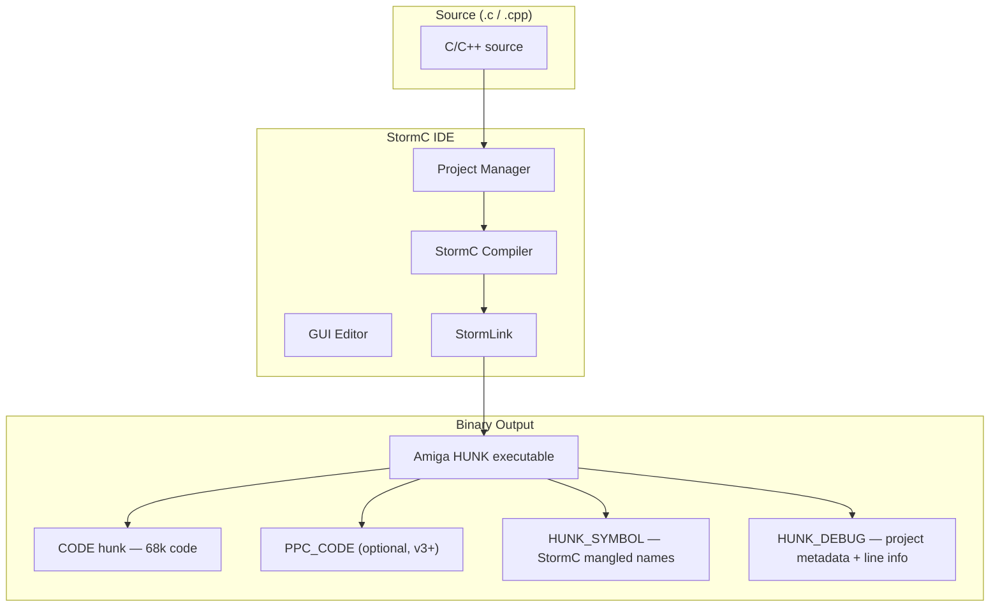

[← Home](../../../README.md) · [Reverse Engineering](../../README.md) · [Static Analysis](../README.md) · [Compilers](README.md)

# StormC / StormC++ — Reverse Engineering Field Manual

## Overview

**StormC** (by Haage & Partner, 1996–2000) was a native Amiga IDE with integrated C and C++ compiler. It occupies a unique position in Amiga RE: it's the **only native Amiga compiler with full C++ support** (exceptions, RTTI, STL), yet its C++ ABI is **incompatible with GCC's C++ ABI** — StormC uses its own name mangling, vtable layout, and exception handling mechanism. For the RE practitioner, StormC binaries look like SAS/C at the C level (A5 frame pointer, absolute strings) but diverge significantly when C++ constructs appear.

Key constraints:
- **A5 frame pointer** — StormC follows the SAS/C convention (`LINK A5, #-N`), making C-level code appear SAS/C-compatible.
- **C++ ABI is unique** — StormC's name mangling, vtable layout, RTTI, and exception handling differ from both GCC and the Itanium C++ ABI. StormC++ libraries cannot link with GCC C++ code.
- **Native IDE integration** — StormC embeds project metadata (source paths, build configs) in the binary via custom HUNK_DEBUG entries.
- **PowerPC support (v3+)** — StormC 3.0+ could target PPC (WarpOS/PowerUP). PPC code sections use a different hunk type and appear as foreign code in 68k disassembly.
- **Hunk names**: `CODE`, `DATA` (Amiga standard, SAS/C-compatible)



---

## Binary Identification

### C-Level Code (SAS/C-Compatible)

At the C level, StormC output is deliberately SAS/C-compatible:

```asm
; StormC C function (looks identical to SAS/C):
_my_c_function:
    LINK    A5, #-$10               ; A5 frame pointer
    MOVEM.L D2-D7/A2-A4, -(SP)     ; 9-reg save — same as SAS/C
    ; ... function body ...
    MOVEM.L (SP)+, D2-D7/A2-A4
    UNLK    A5
    RTS
```

**How to distinguish from SAS/C**: Without symbols, C-level StormC code is nearly indistinguishable from SAS/C. Look for:
1. **Project metadata in HUNK_DEBUG** — StormC embeds source file paths and project names
2. **StormC-specific startup code** — different library open sequence
3. **C++ markers** — if you see C++ constructs with non-GCC mangling, it's StormC

### C++ Level — Where StormC Diverges

StormC++ uses its own ABI:

```asm
; StormC++ virtual method dispatch (different from GCC!):
    MOVEA.L obj_ptr(FP), A0         ; A0 = object pointer
    MOVE.L  (A0), D0                ; D0 = vtable pointer (at offset +$00)
    MOVEA.L D0, A1
    JSR     $XX(A1)                 ; call virtual method at vtable[XX]
; No offset_to_top, no RTTI pointer before vtable!
```

### Name Mangling — StormC vs GCC

| Construct | StormC++ Mangled | GCC 2.95.x Mangled |
|---|---|---|
| `Window::Draw()` | `Draw__6Window` | `Draw__6Window` — *can be identical for simple cases* |
| `Window::SetPos(int,int)` | `SetPos__6WindowFii` | `SetPos__6Windowii` (no `F`) |
| `operator new(unsigned long)` | `__nw__FUl` | `__nw__FUl` (may match) |
| Constructor | `__ct__6Window` | `__6Window` (GCC uses different prefix) |
| Destructor | `__dt__6Window` | `__6Window` (GCC encodes in vtable entry type) |

**Key disambiguator**: StormC prepends `__ct__` and `__dt__` to constructor/destructor names. GCC encodes the constructor/destructor type in the vtable offset, not the name.

### Vtable Layout Differences

```
GCC 2.95.x vtable layout:            StormC++ vtable layout:
┌──────────────────────┐             ┌──────────────────────┐
│ offset_to_top = 0    │ vtable[-2] │ (no offset_to_top)   │
├──────────────────────┤             ├──────────────────────┤
│ RTTI pointer         │ vtable[-1] │ (RTTI pointer or 0)  │
├──────────────────────┤ ← vptr     ├──────────────────────┤ ← vptr
│ virtual destructor   │ vtable[0]  │ first virtual method │ vtable[0]
├──────────────────────┤             ├──────────────────────┤
│ virtual method 1     │ vtable[1]  │ second virtual meth  │ vtable[1]
├──────────────────────┤             ├──────────────────────┤
│ ...                  │             │ ...                  │
└──────────────────────┘             └──────────────────────┘
```

> [!WARNING]
> StormC++ vtables start at the first virtual function. There is no `offset_to_top` field at `vtable[-2]`. If your struct layout assumes the GCC layout, all vtable offsets will be wrong by 2 entries.

---

## Library Call Patterns

StormC uses SAS/C-compatible library calls:

```asm
    MOVEA.L _DOSBase, A6           ; load from global
    MOVE.L  filename, D1
    MOVE.L  #MODE_OLDFILE, D2
    JSR     -$1E(A6)               ; Open()
```

The difference is in **how** `_DOSBase` is initialized — StormC's startup code may use different symbol naming or library open order.

---

## C++ Exception Handling

StormC 3.0+ supports C++ exceptions with a custom unwinding mechanism:

```asm
; Exception handling setup (simplified):
    ; StormC registers an exception handler frame on the stack:
    PEA     .exception_handler      ; handler address
    MOVE.L  ___current_exception_frame, -(SP)
    MOVE.L  SP, ___current_exception_frame

    ; ... try block code ...

    ; Cleanup on normal exit:
    MOVE.L  (SP)+, ___current_exception_frame
    ADDQ.L  #4, SP                  ; discard handler

.exception_handler:
    ; Exception recovery code
```

This is structurally different from GCC's exception handling (which uses DWARF2 unwinding tables or setjmp/longjmp). In the binary, look for a global `___current_exception_frame` variable being pushed/popped in functions with try/catch blocks.

---

## Startup Code

StormC's startup differs from SAS/C `c.o`:

```asm
; StormC startup (typical pattern):
_start:
    MOVEA.L 4.W, A6                ; SysBase
    MOVE.L  A6, ___SysBase
    
    ; StormC may use different library open order:
    JSR     ___OpenStormCLibs       ; open DOS, Intuition, etc.
    
    ; C++ static constructors (if C++ code present):
    JSR     ___init_cpp             ; calls __ct__ functions
    
    ; Call main()
    BSR     _main
    
    ; C++ static destructors:
    JSR     ___exit_cpp             ; calls __dt__ functions
    
    ; Cleanup
    JSR     ___CloseStormCLibs
    MOVE.L  D0, ___ReturnCode
    RTS
```

---

## Same C Function — StormC Output

```asm
; CountWords() — StormC 4.0, C mode, -O2:
; (Structurally identical to SAS/C — StormC's C codegen mirrors SAS/C)

_CountWords:
    LINK    A5, #-$08
    MOVEM.L D2-D3, -(SP)
    
    MOVEQ   #0, D2                  ; count
    MOVEQ   #0, D3                  ; in_word
    
    MOVEA.L $08(A5), A0             ; str (arg1 at A5+8)
    
    BRA.S   .loop_test

.loop_body:
    MOVEQ   #' ', D0
    CMP.B   (A0), D0
    BEQ.S   .not_word
    MOVEQ   #'\t', D0
    CMP.B   (A0), D0
    BEQ.S   .not_word
    MOVEQ   #'\n', D0
    CMP.B   (A0), D0
    BEQ.S   .not_word
    
    TST.B   D3
    BNE.S   .next_char
    ADDQ.L  #1, D2
    MOVEQ   #1, D3
    BRA.S   .next_char

.not_word:
    MOVEQ   #0, D3

.next_char:
    ADDQ.L  #1, A0

.loop_test:
    TST.B   (A0)
    BNE.S   .loop_body

    MOVE.L  D2, D0
    MOVEM.L (SP)+, D2-D3
    UNLK    A5
    RTS
```

---

## Named Antipatterns

### "The GCC-C++ Assumption" — Using GCC Vtable Layout on StormC++

Applying GCC vtable offsets to StormC++ binaries will misidentify every virtual method by 2 slots and miss `offset_to_top`. Always determine the C++ compiler BEFORE applying vtable layout assumptions.

### "The StormC-C++ Silence" — Missing C++ in What Looks Like C

StormC C code looks identical to SAS/C. But if the binary was compiled with StormC++ (C++ mode), global constructors run before `main()`, exceptions unwind, and objects have vtables — all invisible at the C codegen level. Check `HUNK_SYMBOL` for `__ct__` and `__dt__` prefixes.

---

## Pitfalls & Common Mistakes

### 1. Linking StormC++ Objects with GCC Code

StormC++ and GCC C++ share NO ABI compatibility. Name mangling, vtable layout, RTTI, and exception handling all differ. If you're patching a binary and need to add C++ code, you must use the same compiler that produced the original.

### 2. PowerPC Code Sections (StormC 3+)

```asm
; In the HUNK structure, PPC code appears as a separate hunk type:
; If your disassembler only handles HUNK_CODE ($03E9), PPC sections
; will appear as unknown hunk types. StormC PPC sections use custom
; hunk types for WarpOS/PowerUP code.
```

---

## Use Cases

### Software Known to Be StormC-Compiled

| Application | Version | Notes |
|---|---|---|
| **AmigaWriter** | StormC 3/4 | Word processor with C++ document model |
| **Various MUI applications** | StormC 3+ | MUI class wizard generated C++ classes |
| **WarpOS/PowerUP software** | StormC 3+ | Mixed 68k/PPC binaries — check for PPC hunk sections |
| **Late-era Amiga games** | StormC 3/4 | C++ game engines with 68k-optimized inner loops |

---

## Historical Context

StormC arrived at a pivotal moment: the Amiga market had shrunk, SAS/C was abandoned after 6.58, and developers wanted a modern IDE. Haage & Partner (known for AmigaOS 3.5/3.9) positioned StormC as the future of native Amiga development. It offered features no other native compiler had: a GUI debugger, C++ with exceptions, PowerPC support, and integrated MUI class generation.

However, the PowerPC era fragmented quickly (WarpOS vs PowerUP), the Amiga market collapsed, and Haage & Partner ceased operations. StormC 4.0 was the last release. Today, GCC (cross-compilation) and VBCC dominate, but StormC binaries remain in the wild — particularly late-1998 to 2000 era C++ applications.

---

## Modern Analogies

| StormC Concept | Modern Equivalent |
|---|---|
| Native IDE with built-in compiler | Xcode with Clang, Visual Studio with MSVC |
| Proprietary C++ ABI | MSVC's C++ ABI (incompatible with Itanium/GCC ABI) |
| Mixed 68k/PPC binaries | Universal Binaries (Intel + ARM) on macOS |
| MUI class generation wizard | Qt Creator's class wizard, Visual Studio's MFC wizard |

---

## FPGA / Emulation Impact

- **PowerPC sections**: If the binary contains PPC hunk sections (StormC 3+), a 68k-only FPGA core cannot execute them — a PowerPC emulation layer (like WarpOS emulation in WinUAE) is required.
- **C++ exception handling**: StormC's custom exception mechanism uses a linked list of exception frames on the stack — the 68000 core must support `MOVE.L SP, An` correctly (standard ISA support, no issues).

---

## FAQ

**Q: How do I tell StormC from SAS/C if both use LINK A5?**
A: Check `HUNK_SYMBOL` — SAS/C uses `_name` with `=APS` stabs; StormC uses `__ct__`/`__dt__` prefixes for C++. Check `HUNK_DEBUG` for project metadata strings (StormC embeds source paths). Check startup code — StormC's `___OpenStormCLibs` vs SAS/C's `_OpenLibraries`.

**Q: Can I link StormC objects with SAS/C objects?**
A: For C-only code, possibly yes if the calling conventions match. For C++ code, absolutely not — the ABIs are incompatible.

**Q: Does StormC support `__saveds`?**
A: Yes — StormC supports SAS/C calling convention keywords for compatibility: `__saveds`, `__stdargs`, `__reg`, `__interrupt`.

---

## References

- [13_toolchain/stormc.md](../../../13_toolchain/stormc.md) — StormC usage and features
- [compiler_fingerprints.md](../../compiler_fingerprints.md) — Quick identification
- [cpp_vtables_reversing.md](../cpp_vtables_reversing.md) — C++ vtable layouts (GCC focus — StormC differences noted)
- See also: [sasc.md](sasc.md), [gcc.md](gcc.md) — compare with other compilers
