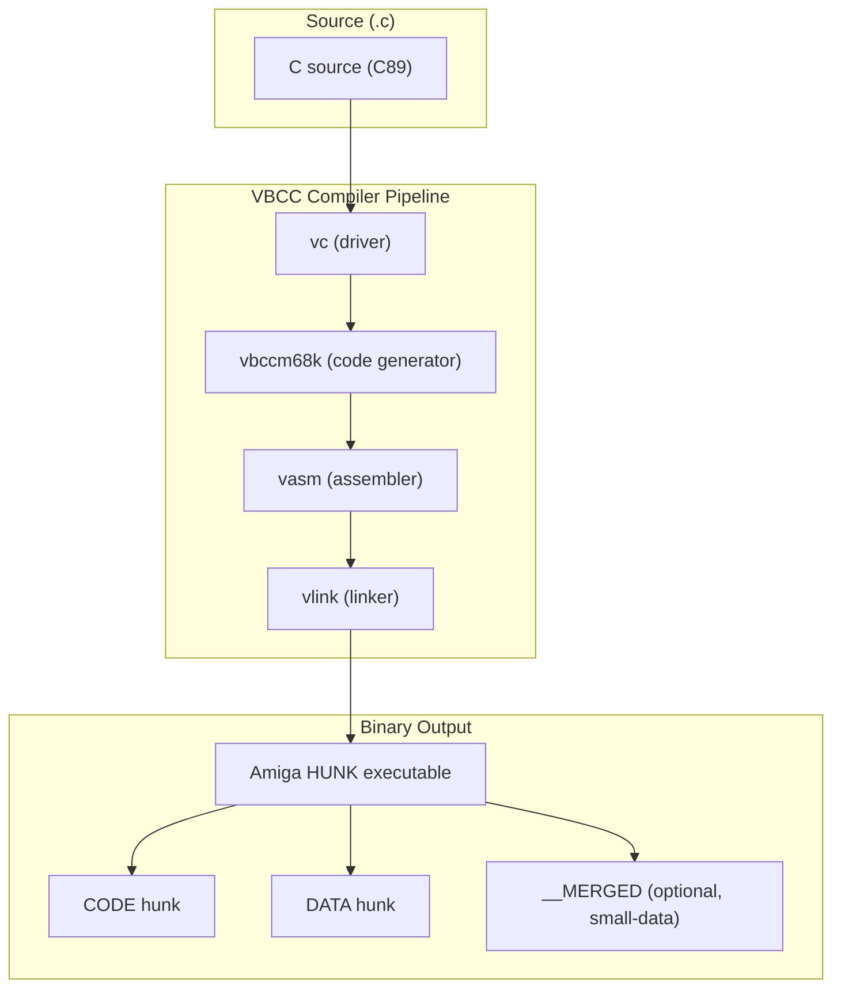

[← Home](../../../README.md) · [Reverse Engineering](../../README.md) · [Static Analysis](../README.md) · [Compilers](README.md)

# VBCC — Reverse Engineering Field Manual

## Overview

**VBCC** (Volker Barthelmann's C Compiler) is a portable, retargetable ISO C89 compiler that produces the smallest binaries among Amiga compilers. Its key RE characteristics are: **no frame pointer** (SP-relative access only), **per-function register saves** (only what's actually used), **PC-relative string addressing**, and a distinctive **`__reg()`** calling convention for AmigaOS library calls. VBCC generates clean, tight code that can look deceptively like hand-optimized assembly.

Key constraints:
- **No LINK instruction** — VBCC never uses `LINK A5` or `LINK A6`. Locals are accessed via `$offset(SP)`. Function boundaries are defined by `MOVEM.L ... -(SP)` at entry and `RTS` at exit.
- **Minimal register saves** — Unlike SAS/C (9 registers always) or GCC (per-function but often substantial), VBCC saves only the exact registers used. A leaf function with no locals has no prologue at all.
- **Tail-call optimization** — VBCC uses `BRA.S` to common epilogue blocks and `BRA` to tail-call other functions more aggressively than any other Amiga compiler.
- **`__MERGED` hunks** — VBCC sometimes merges CODE and DATA into a single hunk when the small data model is active.
- **Hunk names**: `CODE`, `DATA`, `BSS` (+ optional `__MERGED` for small-data)



---

## Binary Identification — The VBCC Signature

### Function Prologue — Nothing or Minimal

```asm
; VBCC leaf function (no locals, no calls):
_simple_func:
    ; NO prologue at all
    ; ... function body ...
    RTS

; VBCC function with locals:
_moderate_func:
    MOVEM.L D2-D3/A2, -(SP)       ; saves ONLY the 3 registers used
    ; ... function body ...
    MOVEM.L (SP)+, D2-D3/A2
    RTS

; VBCC large function:
_large_func:
    MOVEM.L D2-D5/A2-A3, -(SP)    ; per-function exact save
    LEA     -$80(SP), SP           ; allocate stack frame
    ; ... function body ...
    LEA     $80(SP), SP
    MOVEM.L (SP)+, D2-D5/A2-A3
    RTS
```

**Key differentiator from GCC**: Both VBCC and GCC use per-function register saves, but VBCC's code is consistently tighter. VBCC uses `BRA.S label` to share common epilogue/cleanup code, where GCC duplicates it. VBCC uses `MOVEQ` and `ADDQ` aggressively for small constants.

### String Addressing

Like GCC, VBCC uses PC-relative string addressing:

```asm
    LEA     .str_hello(PC), A0
    JSR     _Printf

.str_hello: DC.B "Hello", $0A, 00
```

### The `__reg()` Calling Convention — Unique VBCC Fingerprint

VBCC's `__reg()` keyword places C variables in named CPU registers without inline assembly:

```c
/* VBCC source: */
BPTR __reg("d0") MyOpen(__reg("d1") CONST_STRPTR name,
                        __reg("d2") LONG accessMode);
```

```asm
; Generated code for Open("foo", MODE_OLDFILE):
    MOVEA.L _DOSBase, A6
    LEA     .str_foo(PC), A0
    MOVE.L  A0, D1                 ; name → D1
    MOVEQ   #1002, D2              ; MODE_OLDFILE → D2
    JSR     -$1E(A6)               ; Open() LVO
```

**No other Amiga compiler generates this exact register-to-argument mapping without inline assembly stubs.** The `__reg()` assignments are visible only through the register usage pattern — functions that take args in specific registers (D1, D2, D3, etc.) without stack access.

---

## Library Call Patterns

VBCC library calls are compact and direct:

```asm
; VBCC library call — minimal code:
    MOVEA.L (_DOSBase).L, A6       ; load library base (absolute with relocation)
    MOVE.L  fh(SP), D1             ; arg from stack
    MOVE.L  buf(SP), D2
    MOVE.L  len(SP), D3
    JSR     -$2A(A6)               ; Read()

; Return value check:
    TST.L   D0
    BMI.S   .error
```

VBCC differs from SAS/C here: SAS/C would load args through A5-relative offsets (`$08(A5)`). VBCC uses SP-relative offsets. Since SP may change within the function (pushing args), VBCC carefully maintains SP offsets.

### `#pragma amicall` — VBCC Library Call Pragmas

```c
#pragma amicall(DOSBase, 0x1E, Open(d1, d2))
// VBCC pragma format is simpler than SAS/C:
// - Library base name (identifier, not a string)
// - LVO in hex
// - Function name with argument register list
```

In the binary, these pragmas produce the same `JSR -$XXX(A6)` patterns as any other compiler — the pragma just controls argument register assignment.

---

## Optimization Patterns

VBCC prioritizes **code density** over raw speed. Its signatures:

| Pattern | VBCC Style | SAS/C Equivalent |
|---|---|---|
| **Shared epilogue** | `BRA.S .epilogue` from multiple exit points | Duplicated epilogue at each return |
| **Tail calls** | `BRA _other_func` (discard own frame first) | `JSR _other_func` / `RTS` |
| **Small constant loading** | `MOVEQ #N, Dn` whenever possible | `MOVE.L #N, Dn` for some small values |
| **Stack frame** | `LEA -$N(SP), SP` (when frame > 32K or variable) | `LINK A5, #-N` |
| **Loop termination** | `DBRA Dn, loop` (when counter fits in 16 bits) | `SUBQ.L #1, Dn` / `BNE loop` |

### Cross-Module Optimization

VBCC supports cross-module optimization — when linking, `vlink` can reorder and merge functions across `.o` files. In the binary, this means function layout may NOT match source file order, and small static functions may be inlined at link time.

---

## Same C Function — VBCC Output

```asm
; CountWords() — VBCC, -O -speed:
; C prototype: ULONG CountWords(CONST_STRPTR str)

_CountWords:
    MOVEM.L D2-D3, -(SP)          ; only D2, D3 needed
    
    MOVEQ   #0, D2                 ; D2 = count
    MOVEQ   #0, D3                 ; D3 = in_word
    
    MOVEA.L $0C(SP), A0            ; A0 = str (arg at SP + 12)
    
    BRA.S   .loop_test

.loop_body:
    CMPI.B  #' ', (A0)             ; *str == ' '?
    BEQ.S   .not_word
    CMPI.B  #'\t', (A0)
    BEQ.S   .not_word
    CMPI.B  #'\n', (A0)
    BEQ.S   .not_word
    
    TST.B   D3
    BNE.S   .next_char
    
    ADDQ.L  #1, D2                 ; count++
    MOVEQ   #1, D3                 ; in_word = TRUE
    BRA.S   .next_char

.not_word:
    MOVEQ   #0, D3                 ; in_word = FALSE

.next_char:
    ADDQ.L  #1, A0                 ; str++

.loop_test:
    TST.B   (A0)
    BNE.S   .loop_body

    MOVE.L  D2, D0                 ; return count
    MOVEM.L (SP)+, D2-D3
    RTS
```

**VBCC-specific observations**:
1. **`MOVEM.L D2-D3, -(SP)`** — only 2 registers saved. Minimal.
2. **`BRA.S .loop_test`** — unconditional branch to loop condition at top.
3. **`BRA.S .next_char`** — shared increment code reached from two paths.
4. **Identical to GCC** in this function because the function is simple enough that optimization differences don't show. For more complex functions (with multiple return paths, struct access, switch statements), VBCC's shared-epilogue and tail-call patterns emerge.

```
Cross-Compiler Comparison (CountWords, bytes of code):
  SAS/C -O2:  ~52 bytes (LINK A5 + 9-reg save + epilogue overhead)
  GCC -O2:    ~48 bytes (no LINK, minimal save, CMPI.B)
  VBCC -speed:~46 bytes (no LINK, minimal save, aggressive BRA sharing)
  DICE C:     ~48 bytes (similar to VBCC)
```

---

## Named Antipatterns

### "The Missing Frame Trap" — Assuming LINK for Function Boundaries

```asm
; VBCC function boundaries are RTS-delimited, not LINK-delimited.
; If your IDA script searches for LINK to find functions, you'll miss ALL VBCC functions.

; VBCC function entry could be any of:
;   1. MOVEM.L ..., -(SP)  (most common)
;   2. LEA -$XX(SP), SP     (large frame)
;   3. First instruction after previous RTS (leaf functions)
;   4. TST.L D0 / BEQ ...   (function that doesn't save any regs)
```

### "The Register Ghost" — `__reg()` Without Symbols

Without source-level `__reg()` declarations, VBCC function arguments appear to use arbitrary register assignments. This can look like a custom ABI. The pattern is actually the VBCC `__reg()` convention encoded via `<proto/*.h>` headers during compilation.

---

## Pitfalls & Common Mistakes

### 1. Confusing VBCC and GCC Output

Both omit frame pointers and use per-function saves. Disambiguate by:
- **Hunk names**: VBCC uses `CODE`/`DATA`; GCC uses `.text`/`.data` (usually)
- **`__MERGED` hunk**: VBCC-specific — no other compiler produces this
- **Function naming**: VBCC emits names like `_funcname`; GCC emits `.Lxxx` internal labels
- **BRA density**: VBCC has more `BRA.S` instructions (shared epilogues); GCC tends to duplicate code

### 2. Misreading SP-Relative Offsets

```asm
; At function entry (after MOVEM.L D2-D3, -(SP)):
; SP points 8 bytes below entry SP (D2 and D3 pushed)
; Arg1 is at $0C(SP)  (8 bytes regs + 4 bytes return addr)
; But after LEA -$10(SP), SP:
; Arg1 is now at $1C(SP)  (8 regs + 4 ret + 16 locals)
; The offset CHANGES when SP is modified — unlike A5-relative offsets
```

Track every `LEA +/-$N(SP), SP` instruction — each one shifts ALL subsequent SP-relative offsets.

---

## Use Cases

### Software Known to Be VBCC-Compiled

| Application | Notes |
|---|---|
| **ScummVM (some ports)** | Large C codebase; VBCC's strict C89 catches portability issues |
| **Modern Amiga utilities** | Many 2000s+ CLI tools use VBCC for small binary size |
| **AROS system components** | VBCC is a supported AROS build compiler |
| **MUI 5 custom classes** | Tight BOOPSI dispatch benefits from VBCC's register allocation |
| **AmigaOS 4 system libraries** | Hyperion's SDK supports VBCC for OS4 development |

---

## Historical Context

VBCC was created by Volker Barthelmann in the mid-1990s as a lightweight alternative to GCC's growing complexity. While GCC was the "heavy" compiler with C++ support, VBCC targeted developers who wanted a fast, standards-compliant C89 compiler that produced small binaries.

Unlike SAS/C (commercial, dead since 1996) and GCC (open source but complex), VBCC occupies a unique niche: actively maintained, free for personal use, with a clean codebase. Its `vlink` linker and `vasm` assembler companion tools form a complete toolchain that has become the de facto standard for modern Amiga development alongside GCC bebbo.

---

## Modern Analogies

| VBCC Concept | Modern Equivalent |
|---|---|
| `__reg()` | `register ... asm("d0")` in GCC/Clang (GNU C extension) |
| Per-function register save | Clang's `-O2` with aggressive register allocation |
| Cross-module optimization | LTO (Link-Time Optimization) in modern compilers |
| `vlink` with `vasm` | LLVM's integrated `lld` linker with `clang` |
| Config-driven target system | LLVM's `TargetRegistry` and target description files |

---

## FPGA / Emulation Impact

- **No `LINK`/`UNLK`**: VBCC binaries don't use these instructions, reducing test coverage needs for frame pointer ops on FPGA cores.
- **Aggressive `LEA` for stack frames**: `LEA -$N(SP), SP` must correctly update SP in a single instruction — verify your FPGA core handles LEA with SP destination correctly.
- **Cross-module optimization**: No runtime impact; all inlining and merging happens at link time.

---

## FAQ

**Q: How do I distinguish VBCC from GCC output?**
A: Check hunk names — VBCC uses `CODE`/`DATA`, GCC typically uses `.text`/`.data`. Check for `__MERGED` hunk (VBCC-only). Check internal labels: VBCC uses `_name` format; GCC uses `.Lxxx`. Check BRA density — VBCC shares epilogues more aggressively.

**Q: Does VBCC support C++?**
A: No. If you find C++ constructs (vtables, `new`/`delete`, name mangling), it's NOT VBCC.

**Q: Can VBCC and GCC object files be mixed?**
A: No. They use different calling conventions for internal runtime functions. Link the entire project with one compiler. Assembly (`vasm`) can be mixed with VBCC C code using `vlink`.

---

## References

- [13_toolchain/vbcc.md](../../../13_toolchain/vbcc.md) — VBCC usage and `__reg()` details
- [compiler_fingerprints.md](../../compiler_fingerprints.md) — Quick identification
- [13_toolchain/vasm_vlink.md](../../../13_toolchain/vasm_vlink.md) — vasm/vlink toolchain
- VBCC homepage: http://sun.hasenbraten.de/vbcc/
- See also: [sasc.md](sasc.md), [gcc.md](gcc.md) — compare with other compilers
