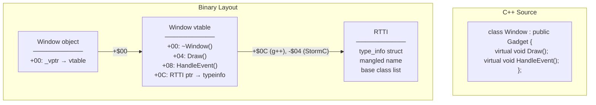
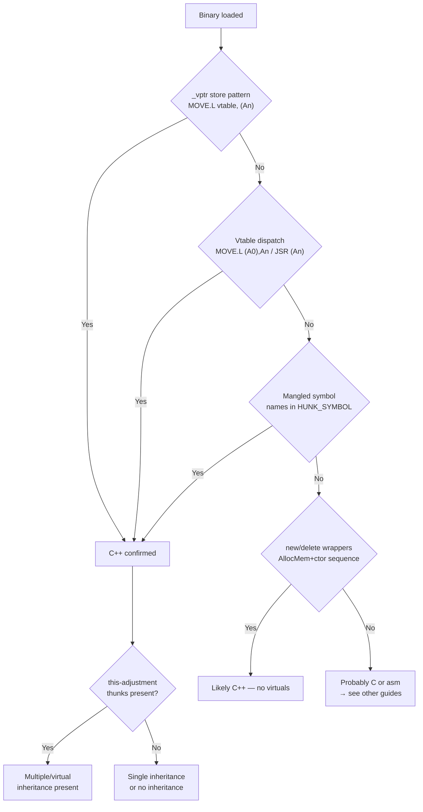

[← Home](../../README.md) · [Reverse Engineering](../README.md)

# C++ Reverse Engineering — Vtables, Inheritance, and OOP Reconstruction

## Overview

C++ on the Amiga — primarily via StormC, GCC 2.95.x, and SAS/C with limited C++ support — compiles object-oriented constructs into predictable patterns in the binary. Virtual method dispatch goes through **vtables** (arrays of function pointers at fixed offsets from the object pointer), constructors chain through inheritance hierarchies, and name mangling encodes the full class-qualified signature into linker symbols. Reversing C++ binaries means reconstructing the **class hierarchy** from these artifacts — recovering which methods are virtual, how many levels of inheritance exist, and where each class appears in the vtable dispatch graph.

Unlike modern platforms with rich RTTI and exception metadata, Amiga C++ binaries are typically **stripped and lean**. RTTI is often disabled (`-fno-rtti`), and exception support is minimal. The vtable is your primary reconstruction tool — it encodes the entire polymorphic structure of the program.



---

## Architecture: C++ to m68k Mapping

### Vtable Layout — Complete (GCC 2.95.x on m68k)

On the Amiga, GCC 2.95.x follows the Itanium C++ ABI concepts adapted for 32-bit m68k. The vtable pointer (`_vptr`) resides at object offset `+$00` and points to the **first virtual function** entry, not the start of the vtable itself.

```
Full GCC Vtable Layout (m68k, 32-bit, all entries 4 bytes):
┌─────────────────────┐  ← vtable_start (symbol address, e.g. _ZTV6Window)
│ offset_to_top = 0   │  vtable[-2] — always 0 for most-derived class
├─────────────────────┤
│ RTTI pointer        │  vtable[-1] — _ZTI6Window (type_info for Window)
├─────────────────────┤  ← _vptr points here (vtable_start + 8)
│ Window::~Window()   │  vtable[0] — virtual destructor (D1 complete)
├─────────────────────┤
│ Window::~Window()   │  vtable[1] — virtual destructor (D0 deleting)
├─────────────────────┤
│ Window::Draw()      │  vtable[2] — first user virtual method
├─────────────────────┤
│ Window::HandleEvt() │  vtable[3] — second user virtual method
├─────────────────────┤
│ ...                 │  vtable[n] — more virtual methods
└─────────────────────┘
```

| Vtable Offset (from vptr) | Vtable Offset (from start) | Contents | Notes |
|---|---|---|---|
| `-8` (vptr − 2) | `+$00` | `offset_to_top` | Always 0 for most-derived; non-zero in multiple inheritance for non-primary bases |
| `-4` (vptr − 1) | `+$04` | RTTI pointer (`type_info*`) | Points to `type_info` struct with mangled class name; NULL if `-fno-rtti` |
| `+0` (vptr + 0) | `+$08` | Destructor variant 1 | In-charge non-deleting destructor (D1); cleans up object, does NOT call FreeMem |
| `+4` (vptr + 1) | `+$0C` | Destructor variant 2 | In-charge deleting destructor (D0); cleans up AND calls operator delete |
| `+8` (vptr + 2) | `+$10` | First user virtual method | Declaration order in the class body |
| `+12` (vptr + 3) | `+$14` | Second user virtual method | ...continues for all declared virtuals |

### Virtual Method Dispatch

```asm
; In C++:  obj->Draw()
; Becomes:
MOVE.L  obj_ptr(FP), A0       ; load object pointer
MOVE.L  (A0), A1              ; dereference vtable pointer (at offset +00)
MOVE.L  $04(A1), A0           ; load Draw() from vtable[1]
JSR     (A0)                  ; call via function pointer
```

The signature pattern: **`MOVE.L (A0), An` followed by `MOVE.L $offset(An), target` then `JSR (target)`** — this is the C++ vtable dispatch fingerprint.

### Constructor Pattern — Full Lifecycle

```asm
; C++:  new Window()
; Generates:
; 1. Allocate memory (operator new → AllocMem)
; 2. Call base class constructor (Gadget::Gadget)
; 3. Store vtable pointer at object+$00
; 4. Initialize Window-specific members
; 5. Return object pointer in D0

MOVE.L  #sizeof_Window, D0
MOVE.L  #MEMF_CLEAR, D1
JSR     -$C6(A6)              ; AllocMem
MOVE.L  D0, A2                ; save object ptr
; Call base constructor (Gadget::Gadget):
MOVE.L  A2, -(SP)
JSR     _Gadget_ctor          ; calls SUPER::ctor
ADDQ.L  #4, SP
; Install vtable:
LEA     _Window_vtable, A0
MOVE.L  A0, (A2)              ; _vptr = &vtable
; Initialize Window members:
MOVE.W  #$00FF, $14(A2)       ; this->width = 255
; Return this:
MOVE.L  A2, D0
RTS
```

### Destructor Pattern — Multiple Variants

GCC generates up to **three distinct destructor functions** per class. Understanding which is which is critical for vtable reconstruction:

| Variant | GCC Suffix | Purpose | Vtable[0] or [1]? | Contains FreeMem call? |
|---|---|---|---|---|
| **D2** (not-in-charge) | `~ClassName` (base variant) | Destroys this subobject only; called by derived class destructors | Neither — called directly by derived dtors | No |
| **D1** (in-charge, non-deleting) | `~ClassName` (complete) | Destroys full object; does NOT free memory | **vtable[0]** | No |
| **D0** (in-charge, deleting) | `~ClassName` (deleting) | Destroys full object AND calls operator delete | **vtable[1]** | Yes (`JSR operator delete`) |

```asm
; D2 — Not-in-charge destructor (base subobject cleanup):
__6Window_D2:                    ; no vtable entry points here directly
    LINK    A6, #0
    ; Destroy Window-specific members
    ; CALL base class D2 destructor
    JSR     __6Gadget_D2
    UNLK    A6
    RTS

; D1 — In-charge non-deleting (cleans up, no FreeMem):
__6Window_D1:                    ; vtable[0] = this function
    LINK    A6, #0
    ; Store vtable pointer (restore to most-derived)
    LEA     _ZTV6Window, A0
    MOVE.L  A0, (A2)              ; _vptr = &Window_vtable
    ; Destroy Window-specific members
    JSR     __6Gadget_D2          ; call base D2
    UNLK    A6
    RTS                           ; NO FreeMem call!

; D0 — In-charge deleting (cleans up AND frees memory):
__6Window_D0:                    ; vtable[1] = this function
    LINK    A6, #0
    BSR     __6Window_D1          ; call D1 to do the cleanup
    ; Now free the memory:
    MOVE.L  A2, -(SP)
    JSR     operator_delete       ; calls FreeVec/FreeMem
    ADDQ.L  #4, SP
    UNLK    A6
    RTS
```

### Inheritance Hierarchy in the Binary

#### Single Inheritance

```
Gadget object:
  +00: _vptr → Gadget_vtable
  +04: gadget_member_1
  +08: gadget_member_2

Window object (extends Gadget):
  +00: _vptr → Window_vtable    ← overwrites Gadget's vptr
  +04: gadget_member_1          ← inherited
  +08: gadget_member_2          ← inherited
  +0C: window_member_1          ← new in Window
  +10: window_member_2          ← new in Window
```

#### Multiple Inheritance

<!-- TODO: Expand — full diagram of multiple base classes, multiple _vptr fields, this-adjustment thunks for each base -->

```
Window object (extends Gadget AND Drawable):
  +00: _vptr → Window_vtable (primary: Gadget subobject)
  +04: gadget_member_1
  +08: gadget_member_2
  +0C: _vptr → Window_Drawable_vtable (secondary: Drawable subobject)
  +10: drawable_member_1
  +14: window_member_1

this-adjustment thunk for Drawable::method():
  ADDQ.L  #$0C, A0              ; adjust this to Drawable subobject
  JMP     _Window_Drawable_method  ; tail-call real implementation
```

#### Virtual Inheritance (Diamond Problem)

<!-- TODO: Expand — VBASE pointer, virtual base offset table, shared subobject layout -->

### Name Mangling — GCC 2.95.x Reference

The GCC 2.95.x mangling scheme (based on the Itanium C++ ABI draft) encodes the full qualified name and parameter types into linker symbols. This is your primary source for recovering class names and method signatures:

| Source Declaration | GCC 2.95.x Mangled Symbol | Decode |
|---|---|---|
| `Window::Draw(void)` | `Draw__6Window` or `Draw__6WindowFv` | `Draw` method of class `Window` (6 chars) |
| `Window::SetPos(int, int)` | `SetPos__6WindowFii` | `SetPos` method, takes two `int` parameters |
| `Window::SetPos(long, long)` | `SetPos__6WindowFll` | Same method name, different mangling for `long` |
| `operator new(unsigned long)` | `__nw__FUl` | `new` operator, takes `unsigned long` (size) |
| `operator delete(void *)` | `__dl__FPv` | `delete` operator, takes `void*` |
| `Window::~Window(void)` | `__6Window` or `_$_6Window` | Destructor; `_$` prefix often on Amiga GCC builds |
| Static class member function | `GetCount__6WindowFv` | Same mangling as instance method — context determines `static` |
| `operator+(Window const &)` | `__pl__6WindowFRC6Window` | `__pl` = operator+, `FRC6Window` = const reference param |
| `Window::Window(int, int)` | `__6WindowFii` | Constructor — same pattern as destructor but no special prefix |

**Demangling helper** (Python):
```python
# Quick-and-dirty GCC 2.95.x demangler for Amiga symbols
import re

def demangle_gcc295(sym):
    # Example: SetPos__6WindowFii → Window::SetPos(int, int)
    m = re.match(r'(.+)__(d+)(.+?)(F.*)?$', sym)
    if m:
        method = m.group(1)
        class_len = int(m.group(2))
        class_name = m.group(3)[:class_len]
        params = m.group(4) or ''
        type_map = {'i': 'int', 'l': 'long', 'v': 'void', 'c': 'char',
                     's': 'short', 'f': 'float', 'Pv': 'void*', 'Ul': 'unsigned long'}
        return f"{class_name}::{method}(...)"
    return sym
```

### Name Mangling — StormC Differences

StormC uses a different mangling scheme from GCC:

| C++ Construct | GCC 2.95.x | StormC |
|---|---|---|
| Method `Draw()` on class `Window` | `Draw__6Window` | `Draw_Window` or `Window_Draw` |
| Operator `new` | `__nw__FUl` | `__nw_Ul` or inline to `AllocMem` |
| Destructor | `__6Window` | `_dtor_Window` or `~Window` |
| RTTI | `_ZTI6Window` | `_Type_Window` or absent |
| Vtable | `_ZTV6Window` | `_VTable_Window` or `Window_VTable` |

StormC binaries typically use **fewer mangled symbols** because StormC often inlines trivial methods and may not emit RTTI or vtable symbols with predictable names. Look for the constructor pattern (vtable store at offset +00) as an alternative anchor.

### RTTI Structure Format (GCC 2.95.x)

The `type_info` struct provides class identity and — for derived classes — the inheritance chain:

```c
/* GCC 2.95.x type_info layout on m68k: */

struct type_info {
    /* +00: vtable pointer for type_info itself (points to __class_type_info vtable) */
    void *       _vptr_type_info;
    /* +04: mangled class name (null-terminated string) */
    const char * _name;             // e.g., "6Window" (6-char prefix + "Window")
};

/* Single inheritance class type info: */
struct __si_class_type_info : public type_info {
    /* +08: pointer to base class type_info */
    const type_info * _base_type;
};

/* Multiple inheritance class type info: */
struct __vmi_class_type_info : public type_info {
    /* +08: flags (bit 0 = diamond inheritance) */
    unsigned int _flags;
    /* +0C: number of base classes */
    unsigned int _base_count;
    /* +10: array of __base_class_type_info entries */
    struct __base_class_type_info {
        const type_info * _base_type;  // pointer to base class type_info
        long _offset_flags;            // offset to base subobject within most-derived
        /* bit 0-7: offset shift, bit 8: is_virtual flag */
    } _base_info[];
};
```

> [!WARNING]
> Most Amiga C++ binaries use `-fno-rtti` to save space. RTTI is present in fewer than 25% of Amiga C++ productions. When present, it's a goldmine. When absent, rely on vtable structure and mangled names exclusively.

---

## Decision Guide



### When to Use C++ RE vs Alternatives

| Scenario | Approach |
|---|---|
| Vtable dispatch patterns present | C++ RE (this article) |
| No vtables, but name mangling suggests classes | C++ without virtual methods (use ANSI C RE as base + class struct reconstruction) |
| MUI BOOPSI class (C-implemented OOP) | C RE + BOOPSI dispatcher analysis |
| Pure C with function pointer tables | See [ansi_c_reversing.md](ansi_c_reversing.md) — not C++ vtables |

---

## Methodology

### Phase 1: Detect C++ Usage

<!-- TODO: Expand — detection heuristics, scoring system, IDA Python detector script -->

Signs of C++:
- **Vtable store**: `LEA _vtable, A0` / `MOVE.L A0, (A1)` at object construction
- **Vtable dispatch**: `MOVE.L (A0), A1` / `MOVE.L $0N(A1), A0` / `JSR (A0)`
- **Name mangling**: Symbol names containing `__` with class name and parameter type encoding
- **`new`/`delete` calls**: Wrappers around `AllocMem`/`FreeMem` with constructor/destructor calls
- **`this` pointer**: First argument passed in A0 or on stack, used as base for member access
- **this-adjustment thunks**: `ADDQ.L #offset, A0` / `JMP real_method`
- **RTTI structures**: `type_info` with `.name` pointer

### Phase 2: Reconstruct Vtables

<!-- TODO: Expand — vtable extraction methodology, IDA/Ghidra scripts -->

1. Search for `LEA xxx, A0` / `MOVE.L A0, (An)` pairs — each LEA target is a vtable candidate
2. At each vtable address, enumerate the function pointers (4-byte entries)
3. Cross-reference each function pointer back to its implementation
4. Map vtable index → method name (from mangled symbols or manual deduction)
5. Identify the destructor (vtable[0]): look for `FreeMem` calls, base destructor chains, virtual destructor helpers

### Phase 3: Recover Class Hierarchy

<!-- TODO: Expand — inheritance graph reconstruction, base class identification, root class discovery -->

- **Single inheritance**: Objects share the same `_vptr` offset (+00); derived class vtable extends base class vtable entries
- **Multiple inheritance**: Multiple `_vptr` fields at different offsets in the object; `this` adjustment thunks
- **Virtual base classes**: Shared base via pointer indirection (virtual base offset table)
- **Common base detection**: Look for identical vtable prefix sequences across multiple classes

### Phase 4: Match Constructors to Classes

<!-- TODO: Expand — constructor identification, this-pointer initialization, vtable store as constructor anchor -->

Constructors are entry points that:
1. Call a base constructor (recursive)
2. Store a vtable pointer
3. Initialize member variables after the vtable store
4. Return `this` in D0

### Phase 5: Reconstruct Class Member Layout

<!-- TODO: Expand — field offset extraction from constructor init sequences and method body access patterns, alignment rules -->

### Global Constructor & Destructor Arrays (GCC)

GCC 2.95.x emits two arrays that the startup code must process before calling `main()`:

```
__CTOR_LIST__ format:
┌──────────────────────┐
│ count (N)            │  __CTOR_LIST__[0] = number of constructor functions
├──────────────────────┤
│ constructor_func_1   │  __CTOR_LIST__[1] = function pointer
├──────────────────────┤
│ constructor_func_2   │  __CTOR_LIST__[2]
├──────────────────────┤
│ ...                  │
├──────────────────────┤
│ 0x00000000           │  Terminator (NULL)
└──────────────────────┘

__DTOR_LIST__ has the SAME format.
```

**Startup processing** (found in the startup code, before `main()` is called):
```asm
; Iterate __CTOR_LIST__ and call each constructor:
    LEA     __CTOR_LIST__, A0
    MOVE.L  (A0)+, D0              ; load count
    BEQ     no_ctors
ctor_loop:
    MOVE.L  (A0)+, A1              ; load constructor function pointer
    JSR     (A1)                   ; call it
    SUBQ.L  #1, D0
    BNE     ctor_loop
no_ctors:
```

**In the RE workflow**: If you find `__CTOR_LIST__` and `__DTOR_LIST__` in the symbol table:
1. Each function pointer in `__CTOR_LIST__` is a global object constructor — these initialize global C++ objects
2. Trace each constructor to find which class it initializes
3. The matching destructor is in `__DTOR_LIST__` at the same index
4. Destructors are called in **reverse order** at program exit by the startup code

> [!NOTE]
> `__CTOR_LIST__` and `__DTOR_LIST__` are emitted even with `-nostdlib` (as described in the RastPort article on C++ without standard library). They're part of the GCC ABI, not the standard library.

Common operator patterns in m68k disassembly:

| Operator | Assembly Signature | Notes |
|---|---|---|
| `operator=` | `CMP.L src, this` / `BEQ skip` (self-assignment guard) then member-by-member copy | Self-assignment check is the definitive marker |
| `operator new` | `MOVE.L size, D0` / `JSR AllocVec` — thin wrapper, returns `this` in D0 | Size argument is `sizeof(Class)` — confirms class identity |
| `operator delete` | `JSR FreeVec` — calls destructor first if virtual | May be a single instruction if inlined |
| `operator==` | `CMP.L` per member, `SEQ D0` / `EXT.L D0` / `RTS` — returns 0 or 1 in D0 | Boolean return in D0 is distinctive |
| `operator+` | Creates new object via `operator new`, initializes with sum of two operands, returns new object | Creates and returns new object in D0 |
| `operator[]` | `MOVE.L index, D0` / `ASL.L #element_shift, D0` / `ADD.L base, D0` then access at (D0) | Index calculation → base+offset load |
| `operator++` (prefix) | Increments member, returns `*this` in D0 | Returns reference to modified object |
| `operator++` (postfix) | Saves old value, increments member, returns old value | Postfix has dummy `int` parameter in mangling |

### Phase 7: Dynamic Verification

<!-- TODO: Expand — FS-UAE debugger: breakpoint on constructors to count live objects, trace vtable dispatch at runtime to confirm method mapping, verify object lifetimes -->

---

## Tool-Specific Workflows

<!-- TODO: Expand — detailed walkthroughs for each tool -->

### IDA Pro

<!-- TODO: Vtable struct type creation, Hex-Rays C++ decompilation quirks, class hierarchy plugin (ClassInformer equivalent for m68k), mangled name demangling script -->

### Ghidra

<!-- TODO: Ghidra C++ class recovery, structure editor for class layout, script for vtable-to-class mapping -->

---

## Best Practices

<!-- TODO: Numbered list -->

1. **Start from the vtable** — it's the most information-dense artifact in a C++ binary
2. **Identify the destructor first** — it anchors the vtable; everything else chains from it
3. **Match constructors to vtables** — each constructor stores exactly one vtable; that's your class identity
4. **Use mangled names when available** — they encode class name, method name, and parameter types
5. **Trace `this` through the function** — document which offsets are read/written; those are member fields
6. **Detect multiple inheritance by counting `_vptr` stores per constructor** — more than one store per object = multiple inheritance
7. **Don't assume RTTI is present** — it's often stripped; rely on vtable structure instead
8. **Build a class diagram as you work** — manually or via tooling; the relationships become visible from vtable sharing
9. **Verify destructor chains dynamically** — breakpoint on `FreeMem` to see which destructors run in which order
10. **Document the vtable layout in a table** — offset → method name → implementation address; this is your reconstruction artifact

---

## Antipatterns

<!-- TODO: Add named antipatterns with broken/fixed code pairs -->

### 1. The Missing Base Class

**Wrong**: Assuming a vtable with N entries represents a single class with N virtual methods.

**Why**: In single inheritance, the derived vtable contains entries from ALL base classes plus its own additions. A 12-entry vtable might be a 3-level hierarchy with 4 virtual methods per class.

<!-- TODO: Add bad/good code pair -->

### 2. The Flat Vtable Assumption

**Wrong**: Treating all vtable entries as equal without identifying the destructor.

**Why**: The destructor (first vtable entry) is the anchor. Once you identify the destructor chain, you can trace back through the constructor chain to reconstruct the class hierarchy.

<!-- TODO: Add bad/good code pair -->

### 3. The Single Inheritance Blindness

**Wrong**: Assuming `_vptr` is always at offset +00.

**Why**: In multiple inheritance, each base class subobject has its own `_vptr`. An object may have 2–3 vtable pointers at different offsets (+00, +$10, +$20).

<!-- TODO: Add bad/good code pair -->

### 4. The RTTI Assumption

**Wrong**: Relying on RTTI being present to name classes and map hierarchies.

**Why**: Most Amiga C++ projects use `-fno-rtti` to save space. RTTI is the exception, not the rule. You must reconstruct class names from mangled symbols or manual analysis.

<!-- TODO: Add bad/good code pair -->

### 5. The Thunk-as-Function Mistake

**Wrong**: Treating `this`-adjustment thunks as separate virtual methods.

**Why**: A thunk is a 2-instruction trampoline (`ADDQ.L #offset, A0` / `JMP real_method`). Adding it to the vtable count inflates the method inventory and confuses the call graph.

<!-- TODO: Add bad/good code pair -->

### 6. The Virtual Destructor Blind Spot

**Wrong**: Assuming every destructor is a standalone function.

**Why**: GCC generates up to 3 destructor variants: D0 (in-charge, deletes object), D1 (in-charge, no delete), D2 (not-in-charge, base subobject destructor). All three may appear as separate functions near each other. Missing one means missing an entire constructor chain path.

<!-- TODO: Add bad/good code pair -->

### 7. The Constructor-as-Init Confusion

**Wrong**: Assuming any function that initializes memory is a constructor.

**Why**: C-style init functions, factory functions, and reset methods all initialize objects but don't set vtable pointers. Only C++ constructors store the vtable. The vtable store is the definitive constructor marker.

<!-- TODO: Add bad/good code pair -->

### 8. The Virtual Inheritance Denial

**Wrong**: Assuming inheritance is always simple enough to reconstruct from vtable layout alone.

**Why**: Virtual inheritance (diamond problem) introduces vbase pointers and offset tables that make the object layout non-linear. Without recognizing the vbase pattern, you'll place fields at wrong offsets and misidentify base class relationships.

<!-- TODO: Add bad/good code pair -->

---

## Pitfalls

### 1. Thunk Confusion

```asm
; "this adjustment" thunk for multiple inheritance:
; When calling base2::method() through a derived pointer,
; the compiler generates:
ADDQ.L  #$10, A0              ; adjust this to base2 subobject
JMP     _base2_method         ; tail-call the real method
```

These small thunks are not real methods — they're pointer adjustments. Mistaking them for separate functions inflates the vtable count.

<!-- TODO: Add worked example — how to identify and filter thunks -->

### 2. Inline Destructor Deception

<!-- TODO: Add worked example -->

GCC sometimes inlines trivial destructors, making the vtable entry point directly to `FreeMem` with no destructor body. This looks like a bug but is correct — the class has no resources to free.

### 3. RTTI Disabled

<!-- TODO: Add worked example — how to proceed without RTTI -->

Not all C++ compilers for Amiga emitted RTTI. Don't assume `type_info` will be present — GCC `-fno-rtti` disables it, and many Amiga projects used this flag to save space.

### 4. Multiple Destructor Variants

<!-- TODO: GCC generates D0/D1/D2 destructor variants; StormC may use different numbering. Identifying which is which from disassembly alone. -->

### 5. vtable Sharing Between Classes

<!-- TODO: Related classes may share vtable sections; distinguishing shared entries from derived overrides. -->

### 6. Static Initialization Order

<!-- TODO: C++ static constructors run before main(); their initialization order matters but is invisible in static analysis. Dynamic verification needed. -->

### 7. Exception Handling Artifacts

<!-- TODO: If exceptions are enabled (rare on Amiga), frame unwind tables add data sections that look like garbage but are critical for stack unwinding. -->

### 8. Template Instantiation Code Bloat

<!-- TODO: Templates generate duplicate code for each type instantiation. Identifying which functions are template instantiations vs hand-written duplicates. -->

### 9. Compiler-Generated Default Methods

<!-- TODO: Default constructor, copy constructor, assignment operator, destructor — compilers generate these silently. They appear as functions you didn't expect but must account for in the vtable. -->

---

## Use-Case Cookbook

### Pattern 1: Extracting All Vtables from a Binary

<!-- TODO: Step-by-step — IDA Python script to scan for vtable store patterns (LEA vtable, A0 / MOVE.L A0, (An)), collect vtable addresses, enumerate entries, cross-reference implementations. -->

### Pattern 2: Reconstructing a Single Inheritance Chain

<!-- TODO: Step-by-step — start from most-derived constructor, trace vtable entries backward through base class constructors, identify shared entries, build hierarchy diagram. -->

### Pattern 3: Recovering Class Method Names from Mangled Symbols

<!-- TODO: Step-by-step — parse GCC mangled names, extract class name + method name + parameter types, apply to IDA. Python demangler script. -->

### Pattern 4: Mapping `new`/`delete` to Class Types

<!-- TODO: Step-by-step — identify operator new wrappers, trace the size argument back to sizeof(Class), cross-reference with constructor calls to confirm class identity. -->

### Pattern 5: Reconstructing Multiple Inheritance from Thunks

<!-- TODO: Step-by-step — find all this-adjustment thunks, map the offset to the correct base subobject, reconstruct the full object layout with multiple _vptr fields. -->

### Pattern 6: Identifying a MUI Custom Class (BOOPSI/C++ Hybrid)

<!-- TODO: Step-by-step — MUI classes use BOOPSI dispatch (OM_NEW/OM_SET/OM_GET etc.) but may be implemented in C++. Identifying the BOOPSI dispatcher as a vtable entry, mapping OM_xxx method IDs to vtable indices. -->

### Pattern 7: Reconstructing a StormC++ Class Hierarchy

<!-- TODO: Step-by-step — StormC-specific vtable layout, RTTI format, name mangling differences from GCC, constructor signature patterns. -->

### Pattern 8: Tracing Object Lifetimes Through Constructors/Destructors

<!-- TODO: Step-by-step — dynamic analysis: breakpoint on all constructors, log object addresses, breakpoint on destructors, verify every constructed object is destroyed. IDA + FS-UAE workflow. -->

### Pattern 9: Decompiling Virtual Method Bodies

<!-- TODO: Step-by-step — once vtable is mapped, each method body can be decompiled as a standalone C function with `this` as first parameter. Hex-Rays / Ghidra decompiler workflow for virtual methods. -->

### Pattern 10: Identifying the Root Base Class

<!-- TODO: Step-by-step — the root base class constructor does NOT call another constructor (no recursive SUPER::ctor call). Finding this constructor identifies the inheritance tree root. -->

---

## Real-World Examples

<!-- TODO: Reference specific Amiga C++ software with documented RE findings -->

### Applications

<!-- TODO: MUI custom classes — BOOPSI implemented in C++; YAM (Yet Another Mailer) — C++ with MUI, complex class hierarchy; StormC IDE itself — built with StormC++; AmigaWriter — C++ word processor; fxPaint — C++ graphics application. -->

### Games

<!-- TODO: "Foundation" / "Foundation: Gold" — large C++ game; "Earth 2140" — Amiga port using C++; any StormC++-compiled shareware games. -->

### Libraries

<!-- TODO: MUI framework classes (NList, NListview, etc.) — C++ implementations of BOOPSI gadgets; custom MUI classes from third-party developers. -->

---

## Historical Context — C++ on Amiga

C++ adoption on Amiga was limited by several factors:

| Factor | Impact |
|---|---|
| **Late compiler arrival** | StormC (1996) was the first practical Amiga-native C++ IDE. GCC 2.95.x cross-compiler arrived later. Before this, C++ on Amiga was essentially non-existent. |
| **RAM constraints** | Virtual dispatch tables, RTTI data, and template instantiations consumed RAM that a stock A500 (512KB–1MB) couldn't spare |
| **Performance overhead** | Virtual method dispatch on a 7 MHz 68000 (2 indirections + JSR) was measurably slower than a direct function call — problematic for real-time code |
| **SAS/C limited support** | SAS/C had rudimentary C++ support but no exceptions, no RTTI, and no STL. It was effectively "C with classes" |
| **StormC dominance (late 1990s)** | StormC brought a full IDE and usable C++ to Amiga. Most late-era Amiga C++ software was compiled with StormC |
| **GCC cross-compilation** | Developers targeting Amiga from Linux/Windows used GCC 2.95.x m68k cross-compilers, bringing modern C++ (templates, STL) to Amiga |
| **`-fno-rtti -fno-exceptions` were standard** | Nearly all Amiga C++ binaries disable RTTI and exceptions to save space and avoid runtime overhead |

**Notable C++ Amiga applications**:
- **YAM (Yet Another Mailer)**: C++ with MUI, complex class hierarchy — one of the most-studied Amiga C++ applications
- **StormC IDE**: Self-hosting — the StormC compiler was written in C++ and compiled with itself
- **Foundation / Foundation: Gold**: Large C++ game with custom memory management
- **fxPaint**: C++ graphics application with plugin architecture
- **MUI custom classes**: Many MUI widgets (NList, NListview, TextEditor) were implemented in C++

---

## Modern Analogies

<!-- TODO: Expand -->

| Amiga C++ Concept | Modern Analogy | Where It Holds / Breaks |
|---|---|---|
| Vtable dispatch | C++ vtable (unchanged!) | Holds: exactly the same mechanism; breaks: modern ABIs add more metadata |
| this-adjustment thunk | Multiple inheritance pointer fixup | Holds: same concept; breaks: modern compilers use more compact thunk encoding |
| Name mangling | Itanium C++ ABI mangling | Holds: GCC uses same mangling scheme; breaks: StormC uses different scheme |
| RTTI type_info | `std::type_info` / `typeid` | Holds: same structure; breaks: Amiga often stripped RTTI to save space |
| Virtual destructor | Virtual destructor (unchanged) | Holds: identical concept; breaks: Amiga compilers generate multiple destructor variants |
| operator new/delete | `operator new`/`delete` | Holds: same wrappers around allocator; breaks: Amiga wraps AllocMem/FreeMem directly |

---

## FAQ

### Q1: How do I identify the destructor in a vtable?

<!-- TODO -->

### Q2: Why are there empty "padding" entries in the vtable?

<!-- TODO: Offset-to-top values at negative vtable offsets, RTTI pointers, alignment padding. -->

### Q3: How do I tell virtual inheritance from multiple inheritance?

<!-- TODO: Virtual base offset tables vs multiple _vptr fields; diamond inheritance detection from shared base constructor calls. -->

### Q4: What does `this` adjustment look like and how do I automate detection?

<!-- TODO: ADDQ.L #offset, A0 / JMP pattern; IDA Python script to detect thunks. -->

### Q5: How do I distinguish between SAS/C C++ and GCC C++ in disassembly?

<!-- TODO: SAS/C uses different name mangling, constructor signature, and vtable layout. Detection heuristics. -->

### Q6: How do I recover the original class name without RTTI?

<!-- TODO: Name mangling in HUNK_SYMBOL, string references in constructors, library OpenLibrary calls that suggest purpose. -->

### Q7: Why do I see three destructors for one class?

<!-- TODO: GCC D0/D1/D2 destructor variants explained — in-charge deleting, in-charge non-deleting, not-in-charge (base subobject). -->

### Q8: How do I identify a C++ exception handler in the binary?

<!-- TODO: Rare on Amiga, but if present: frame unwind tables look like data arrays between functions; setjmp/longjmp used as exception primitive. -->

### Q9: How do I reconstruct template instantiations?

<!-- TODO: Templates generate code clones with different type sizes; identify by matching code structure across functions with different constant values. -->

### Q10: Can I tell if a class inherits from a BOOPSI base (MUI)?

<!-- TODO: BOOPSI dispatch method in vtable, OM_NEW/OM_SET dispatch patterns, MUI-specific method IDs. -->

### Q11: How do I handle mixed C and C++ in the same binary?

<!-- TODO: `extern "C"` functions appear without name mangling; C++ functions have mangled names. The boundary is visible in the symbol table. -->

### Q12: What's the difference between StormC++ and GCC vtable layout?

<!-- TODO: RTTI placement, destructor numbering scheme, name mangling format, this-adjustment thunk encoding. -->

---

## FPGA / Emulation Impact

<!-- TODO: Expand — vtable dispatch is pure CPU code with no custom chip interaction; no special FPGA concerns. Exception: timing-sensitive code in constructors/destructors (rare). -->

---

## References

- [ansi_c_reversing.md](ansi_c_reversing.md) — C binary reverse engineering
- [struct_recovery.md](struct_recovery.md) — Struct layout reconstruction from offsets
- [compiler_fingerprints.md](../compiler_fingerprints.md) — Compiler identification
- [m68k_codegen_patterns.md](m68k_codegen_patterns.md) — Code generation patterns
- [asm68k_binaries.md](asm68k_binaries.md) — Hand-written assembly RE
- [api_call_identification.md](api_call_identification.md) — Library call recognition
- *Itanium C++ ABI* (reference for GCC-compatible vtable layout)
- *StormC++ Manual* — Amiga-native C++ compiler documentation
- NDK 3.9: `include/exec/types.h` — Fundamental type layout
