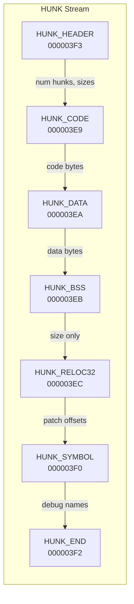

[← Home](../../README.md) · [Reverse Engineering](../README.md)

# Static Analysis — HUNK Reconstruction

## Overview

A hex dump. Four bytes: `00 00 03 F3`. That's `HUNK_HEADER` — the start of an Amiga executable. Everything that follows — code segments, data, BSS, relocations, symbols — is a stream of tagged longword records. Reading this stream by hand is the first skill every Amiga reverse engineer should develop: it reveals the skeleton of the binary before any tool touches it, and it catches corrupted files, packing wrappers, and obfuscated headers that automated loaders may silently misinterpret.

This article walks through manual HUNK parsing from a raw hex dump, covering the header, code/data/BSS segments, HUNK_RELOC32 patching, HUNK_SYMBOL extraction, and HUNK_EXT import/export resolution — all with copy-paste Python scripts.



---

---

## Step 1 — Identify Magic and Header

```bash
xxd mybinary | head -8
```

```
00000000: 0000 03f3  ← HUNK_HEADER magic
00000004: 0000 0000  ← resident library list (always 0)
00000008: 0000 0003  ← num_hunks = 3
0000000c: 0000 0000  ← first_hunk = 0
00000010: 0000 0002  ← last_hunk = 2
00000014: 0000 0200  ← hunk 0: 0x200 longs = 0x800 bytes (code)
00000018: 0000 0020  ← hunk 1: 0x20 longs = 0x80 bytes (data)
0000001c: 0000 0010  ← hunk 2: 0x10 longs = 0x40 bytes (BSS)
```

Each size longword: **bits 31–30** = memory type flag, **bits 29–0** = size in longs.

---

## Step 2 — Walk the Hunk Stream

After the header, scan longword-by-longword:

```
$000003E9  → HUNK_CODE: read next longword = size, then size*4 bytes
$000003EA  → HUNK_DATA: same
$000003EB  → HUNK_BSS: read size longword only (no data)
$000003EC  → HUNK_RELOC32: read pairs until terminator 0
$000003F0  → HUNK_SYMBOL: read (name_len, name, value) until name_len=0
$000003F1  → HUNK_DEBUG: read size longword, skip size*4 bytes
$000003F2  → HUNK_END: advance to next hunk
```

### Grep for hunk boundaries
```bash
xxd mybinary | grep -E "0003 (e9|ea|eb|ec|f0|f1|f2|f3)"
```

---

## Step 3 — Extract HUNK_SYMBOL Table

```bash
# find HUNK_SYMBOL ($3F0)
python3 - <<'EOF'
import struct, sys

data = open("mybinary", "rb").read()
i = 0
while i < len(data) - 4:
    tag = struct.unpack_from(">I", data, i)[0]
    if tag == 0x3F0:  # HUNK_SYMBOL
        print(f"HUNK_SYMBOL at offset {i:#x}")
        i += 4
        while True:
            nlen = struct.unpack_from(">I", data, i)[0]
            if nlen == 0: break
            name = data[i+4 : i+4+nlen*4].rstrip(b"\x00").decode("ascii","replace")
            val  = struct.unpack_from(">I", data, i+4+nlen*4)[0]
            print(f"  {name} = {val:#x}")
            i += 4 + nlen*4 + 4
    else:
        i += 4
EOF
```

---

## Step 4 — Resolve HUNK_EXT Imports/Exports

In object files (HUNK_UNIT), `HUNK_EXT` carries import/export tables:

```python
# Simplified HUNK_EXT parser
elif tag == 0x3EF:  # HUNK_EXT
    i += 4
    while True:
        word = struct.unpack_from(">I", data, i)[0]
        if word == 0: break
        ext_type = (word >> 24) & 0xFF
        nlen     = word & 0x00FFFFFF
        name = data[i+4 : i+4+nlen*4].rstrip(b"\x00").decode("ascii","replace")
        i += 4 + nlen * 4
        if ext_type in (1, 2):         # EXT_DEF / EXT_ABS
            val = struct.unpack_from(">I", data, i)[0]; i += 4
            print(f"  EXPORT {name} = {val:#x}")
        elif ext_type == 0x81:         # EXT_REF32
            nrefs = struct.unpack_from(">I", data, i)[0]; i += 4
            refs  = struct.unpack_from(f">{nrefs}I", data, i); i += nrefs*4
            print(f"  IMPORT {name} @ {[hex(r) for r in refs]}")
```

---

## Step 5 — Annotating Reloc Patches in IDA

After loading the HUNK file in IDA:
1. `View → Open Subviews → Fixups` — lists all HUNK_RELOC32 patch sites
2. Press `F5` on a relocated longword to see the computed address
3. Use `Edit → Operand type → Offset (data segment)` to annotate as a pointer

IDA's Amiga loader applies relocations automatically, so all cross-hunk pointers show their final resolved addresses.

---

## Decision Guide — HUNK Analysis Scenarios

| Scenario | Tool | Why |
|---|---|---|
| Quick symbol dump | `hunkinfo` or hex grep for `$3F0` | Instant, no scripting needed |
| Unknown / corrupted file | Manual hex walk (Step 1–2) | Identifies problems automated tools hide |
| Full symbol + reloc extraction | Python script (Steps 3–4) | Exports everything for external analysis |
| Standard RE in IDA | IDA Amiga HUNK loader | Automatic — no manual steps needed |
| Obfuscated / packed binary | Manual hex walk first | Detect non-standard headers before IDA silently fails |

---

## Named Antipatterns

### 1. "The Missing Relocation"

**What it looks like** — seeing `MOVE.L #$0000000, An` in a HUNK_CODE section and assuming the value is zero:

```asm
MOVE.L  #$00000000, D1    ; looks like D1 = 0
; But HUNK_RELOC32 at this offset changes it at load time!
```

**Why it fails:** `HUNK_RELOC32` replaces placeholder longwords in CODE/DATA with actual addresses at load time. A `$00000000` may become `$00123456` after relocation. Without checking the relocation table, you're reading pre-patch values — completely wrong.

**Correct:** Always cross-reference every longword in CODE/DATA against the HUNK_RELOC32 table before interpreting it as a value.

### 2. "The End-of-Hunk Confusion"

**What it looks like** — finding `000003F2` (HUNK_END) and assuming that's the end of the file:

```hex
000003F2  ← HUNK_END of hunk 0
000003E9  ← HUNK_CODE of hunk 1 — file continues!
```

**Why it fails:** `HUNK_END` marks the end of a single hunk (code segment), not the end of the file. Multi-hunk executables have multiple `HUNK_END` markers — one per segment. Stopping at the first one loses all remaining hunks.

**Correct:** Continue parsing after `HUNK_END` until you reach either EOF or the end of the header-declared hunk count.

---

## Use-Case Cookbook

### Detect a Packed Binary (Cruncher Wrapper)

Packed executables often have unusual hunk structures:

```bash
xxd mybinary | head -4
# Normal: 0000 03F3 ... (HUNK_HEADER, num_hunks = N)
# Packed: 0000 03F3 0000 0001 0000 0000 ... (single hunk, huge size)
#   → single hunks with massive CODE segments = likely decruncher stub
```

### Extract Strings from a HUNK Binary Without Loading

```python
import struct, sys
data = open(sys.argv[1], 'rb').read()
for i in range(0, len(data), 4):
    tag = struct.unpack_from('>I', data, i)[0]
    if tag in (0x3E9, 0x3EA):  # CODE or DATA
        size = struct.unpack_from('>I', data, i+4)[0] & 0x3FFFFFFF
        segment = data[i+8 : i+8+size*4]
        # Extract printable ASCII runs
        import re
        for m in re.finditer(rb'[\x20-\x7E]{4,}', segment):
            print(f'{i+8+m.start():08X}: {m.group().decode("ascii")}')
```

---

## Cross-Platform Comparison

| Amiga Concept | Win32 PE Equivalent | Linux ELF Equivalent | Notes |
|---|---|---|---|
| HUNK_HEADER | PE `MZ` + `PE\0\0` signature | ELF `\x7FELF` magic | Same: file type identifier at offset 0 |
| Hunk sizes in longs | PE section `SizeOfRawData` | ELF `p_filesz` | Amiga uses 32-bit longword units; PE/ELF use bytes |
| HUNK_RELOC32 | PE `.reloc` section | ELF `.rela.dyn` | Same purpose: load-time address patching |
| HUNK_SYMBOL | PDB debug symbols (external) | ELF `.symtab` (embedded) | Amiga debug symbols in-line; PE keeps them separate |
| HUNK_EXT import/export | PE Import/Export Directory | ELF `.dynsym` | Same concept: cross-module symbol resolution |

---

## FAQ

### Why are hunk sizes in longs, not bytes?

The Amiga's 68000 CPU is a 16/32-bit architecture where memory is naturally addressed in 16-bit words and 32-bit longwords. Using longword units for hunk sizes keeps the headers word-aligned and simplifies the loader. Multiply by 4 to get byte sizes.

### What's the difference between HUNK_UNIT and HUNK_HEADER?

`HUNK_UNIT` (`$3E7`) marks an object file (`.o`), intended for linking. `HUNK_HEADER` (`$3F3`) marks a linked executable. Object files contain HUNK_EXT symbols for unresolved references; executables have all references resolved.

---

## References

---

## References

- NDK39: `dos/doshunks.h`
- `hunk_format.md` — hunk type code reference
- `hunk_relocation.md` — HUNK_RELOC32 mechanics
- vlink documentation (HUNK appendix): http://sun.hasenbraten.de/vlink/
