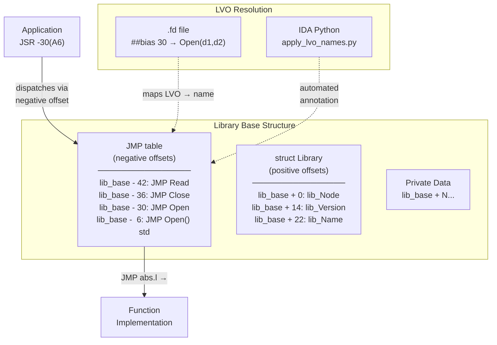

[← Home](../../README.md) · [Reverse Engineering](../README.md)

# Reconstructing Library JMP Tables

## Overview

You've loaded a shared library binary into IDA Pro. It has no symbols. The disassembly shows a block of `JMP ABS.L` instructions at a known negative offset from the structure header — but every target is labeled `sub_1234AB`, `sub_5678CD`. You're staring at the library's **JMP table** — the dispatch mechanism for every public function — and it's entirely opaque.

Reconstructing the JMP table is the critical first step in any library reverse engineering effort. Once done, every `JSR (-N,A6)` in every application that uses this library becomes readable. This article covers the complete methodology: from raw hex dump to a fully annotated JMP table with function names, argument registers, and LVO mappings.



---

---

## JMP Table Layout

```
lib_base - N*6:  JFF xxxx xxxx   ; JMP to function N (6 bytes)
...
lib_base - 24:   JMP Reserved()
lib_base - 18:   JMP Expunge()
lib_base - 12:   JMP Close()
lib_base -  6:   JMP Open()
lib_base + 0:    struct Library  ; lib_Node, lib_Version, ...
```

Each entry is a 68k `JMP (abs.l)` — opcode `4EF9` followed by a 4-byte absolute address, totalling 6 bytes. Hence LVO = `−6 × slot_index`.

---

## Finding the Library Base

### From SysBase LibList

The `exec.library` maintains a doubly-linked list at `SysBase→LibList`:

```c
struct ExecBase {
    ...
    struct List LibList;  /* offset +378 — list of open libraries */
    ...
};

/* Walk the list: */
struct Node *n = SysBase->LibList.lh_Head;
while (n->ln_Succ) {
    struct Library *lib = (struct Library *)n;
    printf("%s v%d\n", lib->lib_Node.ln_Name, lib->lib_Version);
    n = n->ln_Succ;
}
```

### In IDA Pro

After loading, `SysBase` is at `$4`. Use `Edit → Segments → Create Segment` pointed at `$4` with type `WORD` to follow the pointer to `ExecBase`. Then navigate to `LibList` at offset `+0x17A` and walk the linked list.

---

## Reading the JMP Table in IDA

1. Know the library base address (e.g., `DOSBase` from the `OpenLibrary` result)
2. Navigate to `lib_base - 6` — first user function slot
3. IDA shows `JMP sub_XXXXXX` — the target is the actual function implementation
4. Rename each `sub_` with the function name from the LVO table

### Automated Script: `apply_lvo_names.py`

```python
import idaapi, idc

LVO_DOS = {
    -30: "Open",      # LVO -30 = Open(name, mode) d1/d2
    -36: "Close",
    -42: "Read",
    -48: "Write",
    -54: "Input",
    -60: "Output",
    -126: "WaitForChar",
    -138: "Delay",
    # ... extend from dos_lib.fd
}

DOS_BASE = idc.get_name_ea_simple("_DOSBase")
dos_ptr  = idc.get_wide_dword(DOS_BASE)

for lvo, name in LVO_DOS.items():
    jmp_entry = dos_ptr + lvo
    # read the JMP target: opcode at jmp_entry is 4EF9, target at +2
    target = idc.get_wide_dword(jmp_entry + 2)
    idc.set_name(target, f"dos_{name}", idaapi.SN_NOWARN)
    print(f"LVO {lvo:+d}: {name} → {target:#010x}")
```

---

## Mapping LVO → Function via `.fd` Files

NDK39 `.fd` files define the exact register assignments and bias (LVO offset):

```
## NDK39/fd/dos_lib.fd (excerpt)
##base _DOSBase
##bias 30
##public
Open(name,accessMode)(d1,d2)
##bias 36
Close(file)(d1)
##bias 42
Read(file,buffer,length)(d1,d2,d3)
##bias 48
Write(file,buffer,length)(d1,d2,d3)
```

The `##bias` value **is** the positive LVO — the actual call offset is `−bias`.

---

## JSR −LVO(A6) Pattern in Disassembly

```asm
; Typical OS call site in disassembly:
MOVEA.L  (_DOSBase).L, A6
JSR      (-30,A6)          ; Open(d1=name, d2=mode)
; D0 = file handle (BPTR) or 0 on error
```

In IDA, this appears as `jsr ($fffffffe2,a6)` with displacement `-30` (`$FFFFFFE2` in two's complement 16-bit). Applying LVO names makes this `jsr (Open,a6)`.

---

## Common Library Bases and LVO Tables

See [lvo_table.md](../../04_linking_and_libraries/lvo_table.md) for complete LVO offset tables for:
- `exec.library`
- `dos.library`
- `graphics.library`
- `intuition.library`

---

## Reconstructing Unknown Third-Party Library Tables

When the `.fd` file is unavailable — common for third-party libraries like `muimaster.library`, `reqtools.library`, or `miami.library` — you must reconstruct the table from the binary.

### Step 1: Locate the Table by Scanning for JMP Opcodes

A JMP table is a dense cluster of `4EF9` opcodes at 6-byte intervals:

```python
# IDA Python: find JMP table clusters
def find_jmp_tables(min_entries=10):
    """Scan for clusters of JMP ABS.L (4EF9) at 6-byte spacing."""
    ea = idc.get_inf_attr(INF_MIN_EA)
    max_ea = idc.get_inf_attr(INF_MAX_EA)
    clusters = []
    while ea < max_ea:
        if idc.get_wide_word(ea) == 0x4EF9:  # JMP ABS.L
            # Check if next 6-byte offset is also 4EF9
            count = 1
            test_ea = ea - 6
            while test_ea > idc.get_inf_attr(INF_MIN_EA):
                if idc.get_wide_word(test_ea) == 0x4EF9:
                    count += 1
                    test_ea -= 6
                else:
                    break
            if count >= min_entries:
                clusters.append((test_ea + 6, count))
        ea += 2
    return clusters

for start_ea, count in find_jmp_tables():
    print(f"JMP table at {start_ea:#010x}: {count} entries")
```

### Step 2: Find the Library Base

The first JMP table entry (the Open() standard at LVO -6) sits 6 bytes before the library base. The library base itself starts with `struct Library` — identifiable by the `lib_Node.ln_Type` field (NT_LIBRARY = 9) at offset `+8`.

```c
/* Verify we found the right structure: */
BYTE type = *(BYTE *)(library_base + 8);
if (type == 9) { /* NT_LIBRARY — confirmed */ }
```

### Step 3: Extract Function Names from Debug Strings

Many libraries contain inline debug strings naming each function. Search for printable ASCII near the JMP targets:

```python
import idc

def extract_function_names_from_strings(lib_base):
    """Look for function name strings near JMP targets."""
    for lvo in range(-6, -300, -6):
        jmp_ea = lib_base + lvo
        if idc.get_wide_word(jmp_ea) == 0x4EF9:
            target = idc.get_wide_dword(jmp_ea + 2)
            # Search 64 bytes around target for a null-terminated string
            for offset in range(-32, 32):
                name = idc.get_strlit_contents(target + offset)
                if name and name.isalpha():
                    print(f"LVO {lvo:+d}: candidate name '{name}'")
                    break
```

### Step 4: Verify by Argument Register Usage

Cross-reference the reconstructed LVO names with the NDK `.fd` register assignments. If `dos_lib.fd` says `Read(file,buffer,length)(d1,d2,d3)` and the function at LVO -42 uses D1, D2, D3 as arguments, the identification is confirmed.

---

## Decision Guide — Manual vs Automated Reconstruction

| Criterion | Manual (.fd lookup) | Automated (Python script) |
|---|---|---|
| **When to use** | Known AmigaOS library with available `.fd` | Unknown or third-party library |
| **Speed** | ~5 min per library | ~30 sec (script) + verification |
| **Accuracy** | 100% (official documentation) | 80–95% (heuristic string matching) |
| **Works without .fd** | No | Yes |
| **Handles version differences** | No — single `.fd` per OS version | Yes — reads actual binary |
| **Best for** | Standard AmigaOS reverse engineering | Third-party library analysis |

---

## Named Antipatterns

### 1. "The Ghost Entry"

**What it looks like** — a JMP table entry pointing to an `RTS` instruction:

```asm
JMP     sub_RTS_only      ; LVO -156 = dos.library ???
; at sub_RTS_only:
RTS                        ; empty function — this is a stub
```

**Why it fails:** Some libraries include **private** or **reserved** LVOs that are intentionally empty stubs. Assuming every JMP entry maps to a real function produces wrong annotations. These stubs exist to reserve table slots for future expansion.

**Correct:** Check the JMP target for more than just `RTS`. If the target has no meaningful code (just `RTS` or `MOVEQ #0,D0; RTS`), mark it as `_reserved_lvo_N` rather than guessing a function name.

### 2. "The Wrong LVO Increment"

**What it looks like** — calculating LVO as `−4 × slot` instead of `−6 × slot`:

```python
# BROKEN: 4-byte entries are for AmigaOS 1.x only
lvo = -4 * slot  # wrong for all 2.0+ libraries!
```

**Why it fails:** AmigaOS 1.x ROM libraries used 4-byte JMP entries (JMP rel16). All 2.0+ libraries use 6-byte entries (JMP abs32). Using the wrong multiplier offsets every LVO after slot 0.

**Correct:** Always use `LVO = −6 × (slot + 1)`. Verify by checking the opcode at the first slot: `4EF9` = 6-byte JMP, `60xx` = 4-byte BRA rel.

### 3. "The Unsorted LVO Map"

**What it looks like** — applying LVO names in arbitrary order and getting some right, some wrong:

```python
# BROKEN: the dict iteration order may not match the table order
for lvo, name in LVO_MAP.items():  # Python 3.6+ preserves insertion order, but 3.5 doesn't
    apply_name(base + lvo, name)
```

**Why it fails:** LVO maps are inherently ordered — slot 0 maps to `-6`, slot 1 to `-12`, etc. If the map is applied out of order and a duplicate LVO exists, the wrong name gets applied last and overwrites the correct one.

**Correct:** Iterate in sorted LVO order and verify each entry against the expected JMP opcode before renaming.

---

## Use-Case Cookbook

### Dump an Unknown Library's Full LVO Table

```python
# IDA Python: extract and dump the JMP table of any library
def dump_lvo_table(lib_base_addr, num_entries=50):
    lib_base = idc.get_wide_dword(lib_base_addr)
    print(f"{'LVO':>6}  {'Offset':>10}  {'Target':>10}  {'Function'}")
    print("-" * 60)
    for slot in range(num_entries):
        lvo = -6 * (slot + 1)
        jmp_ea = lib_base + lvo
        opcode = idc.get_wide_word(jmp_ea)
        if opcode != 0x4EF9:
            break  # end of table
        target = idc.get_wide_dword(jmp_ea + 2)
        name = idc.get_name(target) or f"sub_{target:X}"
        print(f"{lvo:+6d}  {jmp_ea:#012x}  {target:#010x}  {name}")

# Usage: point to the _DOSBase global
dump_lvo_table(idc.get_name_ea_simple("_DOSBase"))
```

### Cross-Reference All Callers of a Specific Library Function

Once the JMP table is annotated, every `JSR (-30,A6)` in the disassembly where A6=`DOSBase` resolves to `dos_Open`. To find all callers:

1. Xref the `dos_Open` function implementation (the target of the JMP entry)
2. Filter to only those references from `JSR` instructions (not data)
3. Each caller is a function that opens files — trace D1 (filename) to see which files

### Verify a Reconstructed Table Against the Real .fd File

```bash
# Host-side script: compare IDA output against NDK .fd
python3 << 'EOF'
import re, sys

fd_lvos = {}
with open("NDK39/fd/dos_lib.fd") as f:
    bias = 0
    for line in f:
        m = re.match(r"##bias\s+(\d+)", line)
        if m:
            bias = int(m.group(1))
        m = re.match(r"(\w+)\(", line)
        if m and bias:
            fd_lvos[-bias] = m.group(1)

# Compare with your reconstruction...
print(f"Found {len(fd_lvos)} functions in dos_lib.fd")
EOF
```

---

## Cross-Platform Comparison

| Amiga Concept | Win32 Equivalent | Linux ELF Equivalent | Notes |
|---|---|---|---|
| JMP table at negative offsets | COM vtable (always at offset 0) | `.plt` section entries | Amiga's negative-offset design allows the library base pointer to serve double duty |
| 6-byte JMP ABS.L entries | 4-byte function pointers in vtable | 16-byte PLT stubs (x86-64) | Amiga entries are executable code, not data pointers |
| LVO = −6 × slot | vtable index (0-based) | GOT entry offset | Amiga uses byte offsets; COM uses index; ELF uses memory offsets |
| `.fd` file maps LVO→name | `.idl` / `.h` COM interface definition | ELF symbol table `.dynsym` | `.fd` is human-readable text; COM/ELF use binary metadata |
| Library base from `OpenLibrary()` | `CoCreateInstance()` returns interface ptr | `dlopen()` returns handle | Same pattern: opaque handle resolves to function table |

---

## FAQ

### How do I know when the JMP table ends?

The table ends when the pattern `4EF9` at 6-byte spacing breaks. The last valid entry is followed by the `struct Library` header at offset 0. The total number of entries is `lib_NegSize / 6` (stored in the library structure itself at a library-specific offset).

### What if the library uses 4-byte JMP entries (AmigaOS 1.x)?

1.x libraries (e.g., Kickstart 1.2/1.3 ROM) use `JMP rel16` (4 bytes: opcode `60xx` + 2-byte offset). To handle both: check the opcode at the first entry. `4EF9` = 6-byte, `60xx` = 4-byte. Adjust your LVO formula accordingly: `LVO = −4 × (slot + 1)` for 4-byte entries.

### Can SetFunction() break my JMP table reconstruction?

Yes. `SetFunction()` modifies the JMP table in RAM — the `4EF9` target address changes. If you're analyzing a RAM dump rather than a disk binary, some entries may point to patches rather than original functions. Always note whether your analysis target is a cold binary or a live memory snapshot.

---

## References

- NDK39: `fd/` directory — all library `.fd` files
- [lvo_table.md](../../04_linking_and_libraries/lvo_table.md)
- ADCD 2.1: `Libraries_Manual_guide/`
- IDA Pro scripting: `idc.py` reference
