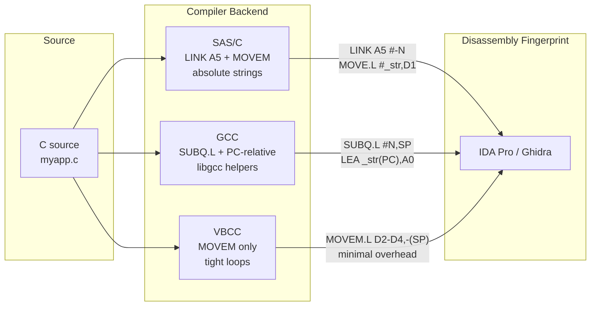
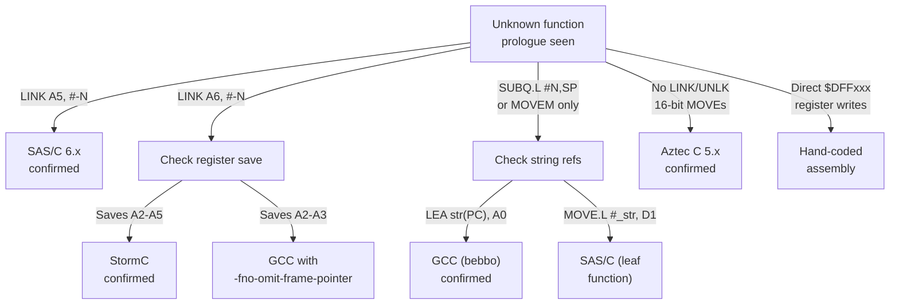

[← Home](../../README.md) · [Reverse Engineering](../README.md)

# Compiler-Specific Code Generation Patterns

## Overview

You've loaded a HUNK binary into IDA Pro. Before you can even begin tracing logic, you need to answer a basic question: **which compiler produced this code?** The answer determines everything else — whether strings are PC-relative or absolute, whether `main()` starts with `LINK A5` or `SUBQ.L #N,SP`, whether `DIVS.L` is a compiler intrinsic or a library call.

Amiga compilers — SAS/C, GCC, VBCC, StormC, Aztec C — each leave a **fingerprint** in the generated assembly. These fingerprints are consistent enough that a single function prologue can identify the compiler with >90% accuracy. This article catalogs the distinguishing patterns for each major Amiga compiler and provides a systematic methodology for compiler identification from disassembly alone.



---

## SAS/C 6.x Patterns

### Function Prologue / Epilogue

```asm
; Non-leaf function with local vars:
LINK    A5, #-N          ; allocate N bytes of locals on stack
MOVEM.L D2-D7/A2-A3, -(SP)  ; save preserved registers
...
MOVEM.L (SP)+, D2-D7/A2-A3
UNLK    A5
RTS

; Leaf function (no locals, no preserved regs):
; — no LINK, pure computation, ends in RTS
```

### D0 Save Pattern

SAS/C saves D0 at the start of functions that need it later:

```asm
MOVE.L  D0, -(SP)       ; save return value from previous call
JSR     another_func
MOVE.L  (SP)+, D0       ; restore
```

### Register Argument Passing

SAS/C passes OS call args via `#pragma amicall` register placement. Inside application functions, SAS/C uses a **stack-based C ABI** (unlike OS calls):

```asm
; C function call in SAS/C: push args right-to-left
MOVE.L  arg3, -(SP)
MOVE.L  arg2, -(SP)
MOVE.L  arg1, -(SP)
JSR     _myfunction
ADDQ.L  #12, SP         ; clean args (caller cleanup)
```

### String Constants

SAS/C places string literals in the **data hunk**, referenced via absolute addresses requiring `HUNK_RELOC32`:

```asm
MOVE.L  #_str_hello, D1   ; absolute address → RELOC32 entry
MOVEA.L _DOSBase, A6
JSR     (-48,A6)           ; Write(stdout, "hello", ...)
```

---

## GCC (m68k-amigaos / bebbo) Patterns

### PC-Relative String Access

GCC uses PC-relative addressing by default, eliminating most HUNK_RELOC32 entries:

```asm
LEA     _str_hello(PC), A0   ; PC-relative — no reloc needed
```

### No Frame Pointer (Default)

```asm
; GCC -O2 leaf function:
MOVEM.L D2/A2, -(SP)    ; only save what's used
...
MOVEM.L (SP)+, D2/A2
RTS
; No LINK/UNLK — pure register allocation
```

### GCC Function Prologues

```asm
; Non-leaf with GCC -fno-omit-frame-pointer:
LINK    A6, #-N          ; note: GCC uses A6 as frame pointer here
                         ; (conflicts with OS library base usage — rare)
; More common with -O2:
SUBQ.L  #N, SP           ; allocate locals without frame pointer
```

### Integer Division / Modulo

GCC emits calls to `__divsi3`, `__modsi3` from `libgcc`:

```asm
JSR     ___divsi3        ; 32-bit signed divide (libgcc helper)
; operands in D0:D1, result in D0
```

SAS/C uses the 68k `DIVS.L` instruction directly (available on 020+) or `DIVS.W`.

---

## VBCC Patterns

VBCC generates very tight code with minimal function overhead:

```asm
; VBCC typical function (no frame pointer, minimal saves):
MOVEM.L D2-D4, -(SP)
...
MOVEM.L (SP)+, D2-D4
RTS
```

VBCC's OS call inline expansion looks identical to GCC's inline-asm stubs.

---

## StormC 3.x / 4.x Patterns

StormC was the first native Amiga C++ IDE. It used a custom frontend (based on EDG) but generated Amiga hunk output directly.

### Function Prologue

```asm
; StormC typical function:
LINK    A6, #-N          ; StormC uses A6 as frame pointer by default
MOVEM.L D2-D7/A2-A5, -(SP)  ; aggressive register save
; ...
MOVEM.L (SP)+, D2-D7/A2-A5
UNLK    A6
RTS
```

> [!WARNING]
> StormC's use of `A6` as a frame pointer conflicts with the OS convention of `A6` = library base. In StormC-compiled code, A6 near `LINK`/`UNLK` is a frame pointer, NOT a library base. This is the #1 misidentification cause when reversing StormC output.

### Distinguishing from SAS/C

| Pattern | SAS/C | StormC |
|---|---|---|
| Frame pointer register | A5 | A6 |
| Preserved registers | D2-D7/A2-A3 | D2-D7/A2-A5 |
| Startup module | `__main` | `_main` with C++ static constructor calls |

---

## Aztec C 5.x Patterns

Aztec C (Manx) was a popular budget compiler in the late 1980s. Its code generation is primitive compared to SAS/C or GCC.

### Distinctive Features

```asm
; Aztec C function — no LINK, uses stack offset from SP directly:
MOVE.L  D2, -(SP)        ; save only what's needed
...
MOVE.L  (SP)+, D2
RTS
```

Aztec C is identifiable by **absence of LINK/UNLK** combined with **16-bit MOVE** instructions where other compilers use 32-bit (e.g., `MOVE.W D0, 4(SP)` instead of `MOVE.L`). It also generates `JSR ___ltoa` and `JSR ___printf` calls with AZTEC-prefixed helper names.

---

## Hand-Coded Assembly (Assembler)

Not all Amiga code came from a compiler. Demos, games, and high-performance libraries were often hand-written in assembler.

### Telltale Signs

| Sign | What It Means |
|---|---|
| `MOVEM.L D0-D7/A0-A6, -(SP)` | No compiler saves ALL registers — this is hand-coded |
| `BTST #6, ($BFE001)` | Direct CIA register read — compilers go through `cia.resource` or `graphics.library` |
| `MOVE.W #$4000, ($DFF09A)` | Direct custom chip register write — compilers use OS functions |
| `LEA _copperlist(PC), A0` + `MOVE.L A0, ($DFF080)` | Hardware banging with PC-relative addressing |
| `MOVE SR, D0` / `ANDI #$F8FF, SR` | Supervisor mode toggling — no compiler generates this |
| Missing startup stub | No `MOVE.L 4.W, A6` — the code runs bare-metal |

If you see direct register pokes to `$DFFxxx` or `$BFExxx` without any OS library calls, you're looking at hand-coded assembly, and standard compiler identification doesn't apply.

---

---

## Distinguishing Compiler Artefacts from Logic

| Pattern | Compiler | Meaning |
|---|---|---|
| `LINK A5, #-N` | SAS/C | Function with locals |
| `LINK A6, #-N` | GCC (rare) | Frame pointer mode |
| `JSR ___divsi3` | GCC | Software 32-bit division |
| `DIVS.L D1, D0` | SAS/C (020+) | Hardware divide |
| `MULS.L D1, D0` | SAS/C (020+) | Hardware multiply |
| `LEA str(PC), A0` | GCC | PC-relative string ref |
| `MOVE.L #_str, D1` | SAS/C | Absolute string ref (reloc'd) |
| `JSR _main` | Startup | C main() entry point |
| `MOVE.L 4.W, A6` | Startup | SysBase load |
| `JSR -552(A6)` | Any | exec.library OpenLibrary |

---

## Locating `main()` via Startup Skip

After identifying the startup stub (`MOVE.L 4.W, A6` → `JSR _OpenLibraries`):

1. Find the first `JSR` or `BSR` after library opens
2. That target is `__main` or directly `_main`
3. If `__main`: follow its internal `JSR _main` call
4. Label the target `main` in IDA

---

## Decision Guide — Compiler Identification Flowchart



| Clue | Compiler | Confidence |
|---|---|---|
| `LINK A5, #-N` + `MOVEM.L D2-D7/A2-A3` | SAS/C 6.x | >95% |
| `LINK A6, #-N` + `MOVEM.L D2-D7/A2-A5` | StormC | >90% |
| `SUBQ.L #N, SP` + `LEA (PC), An` | GCC (bebbo) | >95% |
| `JSR ___divsi3` / `JSR ___modsi3` | GCC (bebbo) | 100% |
| `DIVS.L` with no JSR | SAS/C 6.x | >90% |
| `MOVE.W D0, 4(SP)` (16-bit stack ops) | Aztec C | >80% |
| Direct `$DFFxxx` write, no OS calls | Assembler | 100% |
| `MOVEM.L D0-D7/A0-A6` | Assembler | 100% |

---

## Named Antipatterns

### 1. "The Frame Pointer Confusion"

**What it looks like** — assuming A6 always holds a library base in StormC-compiled code:

```asm
LINK    A6, #-24         ; A6 is now a FRAME POINTER, not a library base
MOVEM.L D2-D5/A2-A5, -(SP)
MOVEA.L (_DOSBase).L, A6 ; NOW A6 is a library base — but LINK changed it
JSR     (-30,A6)         ; this works only because A6 was reloaded
```

**Why it fails:** StormC uses A6 as the C frame pointer. Between `LINK A6` and the library base reload, A6 points to the stack frame, not a library. Any `JSR (-N,A6)` in that window hits the stack as a fake "JMP table" and crashes.

**Correct:** In StormC output, always verify that A6 was reloaded from a known library global before treating `JSR (-N,A6)` as a library call.

### 2. "The String Reloc Mirage"

**What it looks like** — seeing `MOVE.L #$XXXXXXXX, D1` and assuming it's an immediate value when it's actually a relocation:

```asm
MOVE.L  #$00001234, D1   ; in the raw binary, this is $00001234
                          ; after HUNK_RELOC32, it becomes actual string addr
JSR     (-48,A6)          ; Write(stdout, ???)
```

**Why it fails:** Without parsing `HUNK_RELOC32` entries, `#$00001234` looks like a constant. But it's a placeholder that exec replaces with the actual address at load time. You can't know what string it points to from static analysis alone — you need to read the relocation target.

**Correct:** Always cross-reference `HUNK_RELOC32` entries (see [hunk_reconstruction.md](hunk_reconstruction.md)) before interpreting `MOVE.L #immediate` as a value in SAS/C output.

---

## Use-Case Cookbook

### Pattern 1: Identify the Compiler from a Single Function

```ascii
┌─────────────────────────────────┐
│ 1. Look at function prologue    │
│    ├─ LINK A5? → SAS/C          │
│    ├─ LINK A6? → StormC         │
│    ├─ SUBQ.L #N,SP? → GCC       │
│    └─ None? → Continue          │
│ 2. Look at string references    │
│    ├─ LEA str(PC),An? → GCC     │
│    └─ MOVE.L #str,An? → SAS/C   │
│ 3. Look at division             │
│    ├─ JSR ___divsi3? → GCC      │
│    └─ DIVS.L? → SAS/C           │
│ 4. Look at startup stub         │
│    ├─ JSR ___main? → GCC        │
│    └─ JSR _main? → SAS/C        │
└─────────────────────────────────┘
```

### Pattern 2: Find All Functions in a Compiler-Specific Binary

SAS/C functions start with `LINK A5, #-N` followed by `MOVEM.L`. Search IDA for:
```
Search → Text → "LINK    A5"
```
Every hit is a function entry point. Press `P` on each to create an IDA function.

GCC functions start with `SUBQ.L #N,SP` or `MOVEM.L`. Search for:
```
Search → Text → "MOVEM.L"
```
Filter to those NOT preceded by `LINK` — those are GCC leaf or non-leaf functions.

### Pattern 3: Distinguish OS Glue Code from Application Logic

OS glue (the startup stub + compiler helper functions) precedes `main()` and follows a fixed pattern:

```asm
; Universal OS glue pattern:
MOVE.L  4.W, A6            ; SysBase
; ... library opens ...
JSR     _main              ; application logic starts HERE
; ... library closes ...
MOVEQ   #0, D0             ; return 0
RTS                        ; back to DOS
```

Everything before the `JSR _main` is compiler/OS glue — skip it when tracing application logic.

---

## Cross-Platform Comparison

| Amiga Concept | Win32 Equivalent | Linux ELF Equivalent | Notes |
|---|---|---|---|
| SAS/C `LINK A5` prologue | MSVC `push ebp; mov ebp, esp` | GCC `push rbp; mov rbp, rsp` | Same frame-pointer setup, different register |
| GCC PC-relative strings | Position-independent code (`/DYNAMICBASE`) | `-fPIC` + GOT-relative access | Same goal: eliminate relocations for security/performance |
| SAS/C absolute strings | Non-PIE executables | Non-PIE, absolute addresses | Relocation-heavy; simpler but slower to load |
| Compiler fingerprinting | `.rdata` section compiler strings | `.comment` ELF section | Amiga has NO embedded compiler ID — must deduce from code patterns |
| `JSR ___divsi3` (libgcc) | `__alldiv` (MSVC runtime) | `__divdi3` (libgcc) | All compilers call helper functions for complex operations |
| HUNK_RELOC32 in disassembly | PE `.reloc` section | ELF `.rela.dyn` | Same concept; Amiga relocs are embedded in the hunk stream |

---

## FAQ

### Can a single binary use multiple compilers?

Yes — and it's common. An application compiled with SAS/C may link a third-party library compiled with GCC. The startup stub and `main()` follow one compiler's pattern, but library functions (especially if statically linked) may show another compiler's fingerprints. Always identify the compiler for each code segment independently.

### What about the AmigaOS ROM itself?

The Kickstart ROM was compiled with Green Hills C (later versions) or SAS/C (earlier versions). ROM code is identifiable by its use of **absolute addresses** rather than base-relative PSI (Program Segment Independence) linking. The startup stub is absent — ROM code begins at a RomTag structure.

### How do I tell SAS/C 5.x from SAS/C 6.x?

SAS/C 6.x generates `MOVEM.L D2-D7/A2-A3` in prologues. SAS/C 5.x saves fewer registers (`MOVEM.L D2-D5`). Also, 6.x uses `LINK A5, #-.w` for small frames and `LINK A5, #-.l` for large ones; 5.x only uses the `.w` variant.

### Does this work for C++ code?

StormC is the primary Amiga C++ compiler. C++ code is identifiable by:
- `JSR ___nw__FUl` (operator new) calls
- Virtual function tables — arrays of function pointers in the data hunk
- `this` pointer in A0 (StormC convention) for method calls
- Static constructor calls in the startup sequence

## References

- SAS/C 6.x manual — code generation chapter
- GCC for m68k: https://github.com/bebbo/amiga-gcc
- VBCC manual: http://www.compilers.de/vbcc.html
- *Amiga ROM Kernel Reference Manual: Libraries* — register conventions
