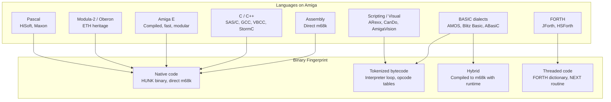
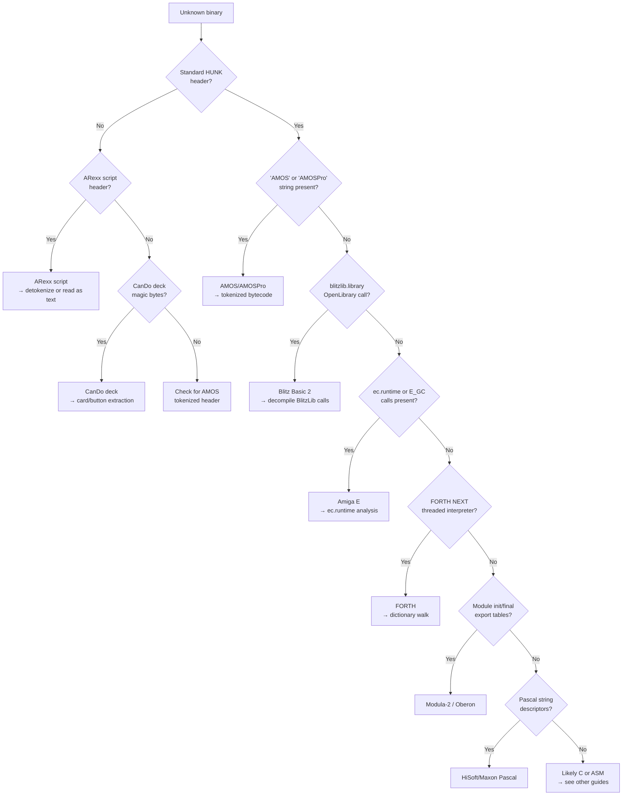

[← Home](../../README.md) · [Reverse Engineering](../README.md)

# Non-C Languages — AMOS, Blitz Basic, E, Modula-2, FORTH, and Others

## Overview

While C and assembly dominated Amiga development, a surprising number of applications and games were built in higher-level or domain-specific languages. **AMOS Professional** and **Blitz Basic 2** produced hundreds of commercial and shareware titles. **Amiga E** (by Wouter van Oortmerssen) was a fast compiled language with C-like performance and Python-like expressiveness. **Modula-2** and **Oberon** brought structured programming from ETH Zürich. **FORTH** (JForth, HSForth) powered interactive development environments and embedded systems. **ARexx** served as the system-wide scripting glue. **CanDo** and **AmigaVision** enabled non-programmers to build multimedia applications.

Each of these languages leaves a **distinctive runtime fingerprint** in the binary — an interpreter loop, a tokenized bytecode format, a compiler-specific runtime library, or a unique memory layout. Reversing these binaries requires recognizing the language first, then applying language-specific decompilation strategies that bear little resemblance to standard C reverse engineering.



---

## Architecture Overview

### Language Classification by Binary Type

| Category | Languages | Binary Format | RE Strategy |
|---|---|---|---|
| **Native Code** | Amiga E, Modula-2, Oberon, Pascal | Standard HUNK binary | Standard disassembly with language-specific runtime library recognition |
| **Tokenized Bytecode** | AMOS, ABasiC, Hisoft BASIC, CanDo | Custom executable with embedded interpreter | Extract bytecode, identify opcode table, decompile token stream |
| **Hybrid (Compiled + Runtime)** | Blitz Basic 2, AmigaVision | HUNK binary + runtime library + optional tokenized sections | Identify Blitz runtime calls; decompile library calls back to BASIC semantics |
| **Threaded Code** | JForth, HSForth, Yerk | HUNK binary with threaded interpreter | Identify NEXT routine, walk dictionary, reconstruct FORTH words |
| **Scripted / Embedded** | ARexx, Installer | ARexx macro files (.rexx), Installer scripts | Plain-text or tokenized script; host application provides runtime |

---

## Language Quick-Reference Table

| Language | Compiler / Runtime | Binary Type | Main Runtime Library | Key Identifier |
|---|---|---|---|---|
| **AMOS** | AMOSPro_Interpreter | Custom + tokenized IFF | `AMOS.library` | `AMOS` or `AMOSPro` string |
| **Blitz Basic 2** | Blitz2 compiler | HUNK native code | `blitzlib.library` | `BB_` prefixed runtime calls |
| **Amiga E** | `ec` / CreativE | HUNK native code | `ec.runtime` | `E_GC`, module export tables |
| **Modula-2** | M2Amiga | HUNK native code | M2 runtime | Module `_init`/`_final` |
| **Oberon** | AmigaOberon / OOC | HUNK native code | Oberon runtime | Type-bound procedure dispatch |
| **FORTH** | JForth, HSForth | HUNK + threaded dict | Built-in | Threaded `NEXT` interpreter |
| **ARexx** | `rexxsyslib.library` | Plain text / tokenized `.rexx` | `rexxsyslib.library` | ARexx script header |
| **ABasiC** | Metacomco ABasiC | Tokenized | ABasiC runtime | ABasiC token format |
| **Hisoft BASIC** | Hisoft compiler | HUNK native code | Hisoft runtime | Hisoft runtime calls |
| **Hisoft Pascal** | Hisoft compiler | HUNK native code | Hisoft Pascal runtime | Pascal calling convention, string descriptors |
| **Maxon Pascal** | Maxon compiler | HUNK native code | Maxon runtime | Module system, OOP extensions |
| **CanDo** | CanDo runtime | Tokenized deck format | `cando.library` | Deck file magic bytes, card/button descriptors |
| **AmigaVision** | AmigaVision runtime | Hybrid (compiled flows) | AmigaVision runtime | Flow chart bytecode, media references |
| **DevPAC** | DevPAC assembler macros | HUNK native (asm) | None (pure m68k) | DevPAC-specific include/macro signatures |

---

## Language-Specific RE Guides

### AMOS Professional / AMOS Basic

<!-- TODO: Expand — full AMOS reversing guide -->

AMOS compiles to a tokenized bytecode embedded in a custom executable wrapper. The interpreter is `AMOS.library` or the standalone `AMOSPro_Interpreter`. Tokenized programs contain:
- **Token stream**: 1-byte opcodes with inline arguments
- **Sprite/bob data**: Embedded IFF ILBM chunks
- **Sample data**: Embedded IFF 8SVX chunks
- **String table**: Pascal strings (length-prefixed)
- **Bank system**: Separate memory banks for sprites, samples, music, code — each with its own identifier

**Detection**: Look for `AMOS` or `AMOSPro` strings, or the `AMOS.library` OpenLibrary call. Tokenized executables have a distinct header with bank count and sizes.

**Decompilation methodology**:
<!-- TODO: Expand — step-by-step AMOS token extraction, opcode table reconstruction, bank extraction, IFF chunk recovery -->

**Decompilation tools**: `AMOSList` (token dumper), `AMOS2ASCII` converters exist but are incomplete.

**Key Challenge**: AMOS extensions (AMAL, AMOS 3D, TOME, etc.) add custom opcodes to the token stream. An unextended decompiler will fail on these. You must map extension opcodes to their extension name.

#### AMOS-Specific Pitfalls

<!-- TODO: Extension opcode conflicts, bank type misidentification, compressed bank data, AMOS vs AMOSPro bytecode differences -->

---

### Blitz Basic 2 / AmiBlitz

<!-- TODO: Expand — full Blitz Basic reversing guide -->

Blitz Basic 2 compiles to native m68k code linked with `BlitzLibs` (or `AmiBlitz` libraries). The compiled output:
- Uses standard HUNK format
- Links against `blitzlib.library` or specific Blitz support libraries
- Generates surprisingly efficient code for a BASIC compiler (rivals hand-written C in some cases)
- Library calls are regular `JSR LVO(A6)` but use Blitz-specific libraries
- Supports inline assembly via `[asm] ... [end asm]` blocks

**Detection**: Look for `blitzlib.library` OpenLibrary calls, or Blitz-specific runtime functions. Common BlitzLib function prefixes:

| BlitzLib Function Prefix | Purpose | Example |
|---|---|---|
| `BB_AllocMem` | Memory allocation | Blitz's internal allocator |
| `BB_FreeMem` | Memory deallocation | Matching free |
| `BB_StrCopy` | String copy | Blitz string handling |
| `BB_StrCmp` | String compare | Case-sensitive comparison |
| `BB_LoadShape` | Load IFF ILBM shape | Used with `LoadShape` statement |
| `BB_LoadSound` | Load IFF 8SVX sample | Used with `LoadSound` statement |
| `BB_DisplayShape` | Blit shape to screen | `ShowShape` / `DisplayShape` statement |
| `BB_QSprite` | QSprite (hardware sprite) management | Blitz sprite system |
| `BB_Poke` / `BB_Peek` | Direct memory access | `Poke.b`, `Peek.w` etc. |
| `BB_Print` | Text output | Blitz `Print` statement |
| `BB_Input` | Text input | Blitz `Input` / `Edit()` function |

> [!NOTE]
> Blitz Basic 2 inline assembly (`[asm]...[/asm]`) requires A4-A6 to be preserved. Look for `MOVEM.L` save/restore of A4-A6 around code blocks that contain direct hardware access — these are likely inline asm blocks within a Blitz program.

**Decompilation methodology**:
<!-- TODO: Expand — mapping BlitzLib calls back to Blitz statements, For/Next loop detection, Select/Case pattern recognition, Type/End Type struct layout recovery, NewType object system analysis -->

**Key Challenge**: Blitz inlines certain operations. A `For...Next` loop generates a `DBRA` directly. Understanding the mapping between Blitz statements and their code generation patterns is essential.

**BlitzLib to BASIC mapping table**:
<!-- TODO: Common BlitzLib calls and their corresponding Blitz BASIC statements -->

#### Blitz-Specific Pitfalls

<!-- TODO: Inline assembly boundaries in decompilation, AmiBlitz vs Blitz2 library differences, NewType object system (not vtable-based, but custom dispatch), tokenized data sections (images, shapes) embedded in DATA hunks -->

---

### Amiga E

Amiga E compiles to native m68k code via the `ec` compiler (or `CreativE`). Key characteristics:
- **Garbage collector**: `E_GC()` runtime calls interspersed in the code for conservative stack scanning
- **Module system**: `.e` modules compile to `.m` object files with specific export tables
- **Exception handling**: Try/Except generates custom stack unwinding code
- **List comprehension**: Generates iteration patterns with `E_Next()` calls
- **Object system**: Message-passing OOP (not C++ vtables) — objects have a **method table** pointer at +00, but the table maps message IDs to handlers, not fixed-offset virtual methods
- **Concurrency**: Lightweight tasks via `E_Task()` — cooperative coroutines, not exec tasks

**Amiga E Object Layout**:
```
E Object:
  +00: method_table_ptr → MethodTable
  +04: instance_var_1
  +08: instance_var_2
  ...

MethodTable:
  +00: class_name (string ptr)
  +04: parent_method_table (ptr or NULL)
  +08: message_handler_count
  +0C: message_id_0 → handler_0
  +10: message_id_1 → handler_1
  ...
```

**Critical difference from C++**: E methods are dispatched by **message ID** (a symbol/integer), not by fixed vtable offset. The method table is a key-value map, not an array. A call like `obj.method()` compiles to a search through the method table for the matching message ID, then a `JSR` to the handler. This is more dynamic than C++ and harder to reconstruct from static analysis alone.

**Detection**: Look for `ec.runtime` library calls, `E_GC`, or module export tables with `.m` format. The E runtime is typically statically linked.

**Decompilation methodology**:
<!-- TODO: Expand — E object system reconstruction (method tables, not vtables), module dependency graph from export tables, GC root tracing for memory layout, exception handler mapping, ANY type dispatch reconstruction -->

**Key Challenge**: E's syntax is so expressive that a single line of E can generate 15–20 m68k instructions. Mapping back to source-level intent requires understanding E's compilation strategies.

#### Amiga E-Specific Pitfalls

<!-- TODO: GC root misidentification (objects held by registers may not look reachable), message-passing vs function call distinction, module export vs import confusion, E's custom string format (not C strings) -->

---

### Modula-2 / Oberon

<!-- TODO: Expand — full Modula-2/Oberon reversing guide -->

Modula-2 (via the Modula-2 Development System or M2Amiga) compiles to native code with distinctive patterns:
- **Module initialization**: Each module has `_init` and `_final` procedures called at load/unload
- **COROUTINES**: `NEWPROCESS`/`TRANSFER` generate custom context-switching code
- **Opaque types**: Information hiding generates accessor functions that only appear for exported types
- **No preprocessor**: No `#include`, no macros — all dependencies are explicit IMPORT/EXPORT
- **Range-checked arrays**: Runtime bounds checking generates additional CMP/Bcc instructions
- **Set operations**: Bit-manipulation patterns for set types with `INCL`/`EXCL` (include/exclude)

Oberon (via AmigaOberon or OOC) adds:
- **Type-bound procedures** (method-like dispatch but not virtual tables like C++)
- **Garbage collection** (optional — generates GC safe-points in code)
- **Type extension** (single inheritance without vtables — uses descriptor records)
- **Dynamic arrays**: Runtime-allocated with descriptor blocks

**Detection**: Look for module init signatures, or the distinctive `M2_` / `OB_` runtime function prefixes. Modula-2 modules may use `.mod` or `.m2` file references. Oberon's type-bound procedures use descriptor-based dispatch (function pointer tables at known offsets, but not C++ vtables).

**Decompilation methodology**:
<!-- TODO: Expand — module dependency graph from import/export tables, type-bound procedure dispatch reconstruction, coroutine context-switch analysis, GC root identification (Oberon) -->

---

### FORTH (JForth, HSForth, Yerk)

<!-- TODO: Expand — full FORTH reversing guide -->

FORTH on Amiga uses **threaded code** — the binary is a dictionary of word definitions, each consisting of:
1. A header (link to previous word, name, flags)
2. A code field (pointer to native code for primitives, or to the inner interpreter for colon definitions)
3. A parameter field (list of execution tokens for colon definitions)

**Detection**: Look for the FORTH inner interpreter (`NEXT` routine) — typically:
```asm
; NEXT: (ip) → W, advance ip, jump to (W)
NEXT:
    MOVE.L  (A4)+, A5       ; load next execution token from IP, advance
    MOVE.L  (A5), A6        ; load code field address
    JMP     (A6)            ; execute it (threaded dispatch)
```

Additional detection heuristics:
- `LIT` routine (pushes inline literal to data stack)
- `EXIT` routine (pops return stack to IP — `MOVE.L (A3)+, A4` / `JMP (A4)`)
- Stack pointer registers: A3=data stack, A4=return stack in JForth convention
- Dictionary header format: link field → name length byte + name characters → code field → parameter field

**Decompilation methodology**:
<!-- TODO: Expand — dictionary walk algorithm, word name extraction, colon definition decompilation (expand execution token list to word names), primitive word catalog, vocabulary/wordlist traversal -->

**Key Challenge**: FORTH code is a data structure, not a call graph. Standard disassemblers see only the inner interpreter loop; the actual program logic is in the dictionary data, which IDA treats as data words, not code. You must write a custom dictionary walker.

**FORTH dialects on Amiga**:
<!-- TODO: JForth vs HSForth vs Yerk vs 4th — dictionary format differences, threading model (indirect vs direct vs subroutine), primitive sets -->

---

### ARexx

<!-- TODO: Expand — ARexx script format, tokenized vs source, rexxsyslib.library host interface, ARexx macro extraction from applications -->

**Detection**: ARexx scripts are plain text (`.rexx`) or tokenized by the host application. The `rexxsyslib.library` provides the interpreter. Scripts are typically found as external files, not embedded in HUNK binaries, but macros are often stored as resources inside applications.

**Decompilation methodology**:
<!-- TODO: Detokenization (if tokenized), macro extraction from application resources, ARexx command host identification -->

---

### Pascal (HiSoft Pascal, Maxon Pascal)

<!-- TODO: Expand — HiSoft Pascal compiled output analysis, Maxon Pascal OOP extensions -->

HiSoft Pascal generates native HUNK code with:
- **String descriptors**: Pascal strings are length-prefixed with a descriptor (length byte + characters)
- **Set operations**: Bit-field operations for Pascal SET types (up to 256 elements)
- **Nested procedures**: Static link chain for accessing outer procedure locals — generates `LINK A6` chains unlike C
- **Runtime checks**: Array bounds, subrange, NIL pointer checks generate conditional trap code

Maxon Pascal adds OOP extensions with:
- **Object type dispatch**: Not C++ vtables; uses method lookup tables with different layout
- **Module system**: Similar to Modula-2 with explicit IMPORT/EXPORT

**Detection**: Look for Pascal string descriptor patterns, nested procedure static links (`MOVE.L (A6), A6` chains), runtime check trap sequences, and Pascal-specific runtime library calls.

**Key Challenge**: Pascal nested procedures create non-standard call graphs where a procedure has access to its enclosing procedure's local variables via the static link. IDA/Ghidra don't natively understand this — you must trace the static link chain manually.

---

### CanDo / AmigaVision

<!-- TODO: Expand — visual programming tools, deck/card metaphor, flow chart bytecode -->

**CanDo**: A hypermedia authoring system using a "deck of cards" metaphor. Programs are stored as "deck" files containing:
- Card descriptors (background, size, color)
- Button/field objects with attached scripts
- Script bytecode (proprietary CanDo scripting language)
- Embedded media (IFF ILBM, 8SVX)

**AmigaVision**: A flowchart-based multimedia authoring tool. Programs are flow charts where nodes are actions (display image, play sound, wait, branch). Stored in a custom format with:
- Flow chart structure (node connections)
- Node type identifiers
- Parameter data per node
- Embedded media references

**Detection**: CanDo deck files have a recognizable header; AmigaVision flow files have a node count + edge table structure. Both reference `cando.library` or the AmigaVision runtime.

**Key Challenge**: These are not traditional programming languages — reversing them means understanding the runtime engine's interpretation of the data structure, not disassembling code. The logic is in the data, similar to FORTH but at a much higher abstraction level.

---

## Decision Guide: Identifying the Language



---

## Best Practices — Cross-Language RE

<!-- TODO: Numbered list -->

1. **Identify the language before disassembling** — each language has a fundamentally different binary architecture
2. **Don't treat tokenized binaries as native code** — they will confuse every standard tool
3. **For native-code languages, find the runtime library first** — it tells you the language and provides anchor xrefs
4. **FORTH requires custom tooling** — standard disassemblers cannot handle threaded code
5. **BASIC compilers leave recognizable patterns** — library calls, loop structures, string handling distinguish them from C
6. **Check for embedded media** — AMOS and Blitz binaries often contain IFF chunks (ILBM, 8SVX) that confirm the language
7. **String format is a strong differentiator** — C strings (null-terminated) vs Pascal strings (length-prefixed) vs E strings (custom format) vs FORTH counted strings
8. **ARexx macros are often plain text** — check the binary's resources for readable script text before disassembling
9. **Mixed-language programs exist** — C core + ARexx scripting + asm hot paths; analyze each section with the appropriate methodology
10. **Build language-specific IDA/Ghidra loaders** — for tokenized/threaded formats, a custom loader that pre-processes the binary saves enormous time

---

## Named Antipatterns

### 1. The C Disassembler Default

**Wrong**: Loading a Blitz Basic or AMOS binary into IDA and treating it like C.

**Why**: The token stream or interpreter loop looks like garbled code to a standard disassembler. You'll waste hours trying to make sense of what is fundamentally not native code.

<!-- TODO: Add bad/good code pair -->

### 2. The Missing Interpreter

**Wrong**: Disassembling only the HUNK code and ignoring the embedded runtime interpreter.

**Why**: AMOS tokenized programs carry a chunk of the interpreter or reference `AMOS.library`. Without understanding the opcode dispatch loop, the token stream is opaque.

<!-- TODO: Add bad/good code pair -->

### 3. The FORTH Data Wall

**Wrong**: Running standard recursive-descent disassembly on a FORTH binary.

**Why**: FORTH dictionaries are data structures, not call graphs. Standard disassembly produces one huge function (the `NEXT` loop) and treats the entire dictionary as data bytes.

<!-- TODO: Add bad/good code pair -->

### 4. The BASIC Loop Assumption

**Wrong**: Seeing `DBRA D0, loop` and assuming it's a C `for` loop.

**Why**: Blitz Basic generates `DBRA` for `For...Next` loops, but the loop variable semantics differ — BASIC loops may have different termination conditions and the counter may be used differently than in C.

<!-- TODO: Add bad/good code pair -->

### 5. The String Format Switcheroo

**Wrong**: Assuming all strings are null-terminated C strings.

**Why**: Pascal uses length-prefixed strings (1-byte length + chars). Amiga E uses a custom string format with GC metadata. FORTH uses counted strings. Reading past the actual string boundary produces garbage.

<!-- TODO: Add bad/good code pair -->

### 6. The Garbage Collector Blindness

**Wrong**: Ignoring `E_GC()` calls as irrelevant runtime noise.

**Why**: Amiga E's garbage collector roots determine which objects survive. Missing a GC root means you misunderstand object lifetimes and may think objects are leaked when they're actually reachable.

<!-- TODO: Add bad/good code pair -->

### 7. The Module Boundary Erasure

**Wrong**: Analyzing Modula-2 or E code without understanding module boundaries.

**Why**: Module `_init`/`_final` pairs and import/export tables define the program's dependency graph. Treating all functions as a flat namespace loses the architectural structure.

<!-- TODO: Add bad/good code pair -->

### 8. The ARexx-as-C Mistake

**Wrong**: Loading an ARexx script file into a hex editor and trying to find machine code.

**Why**: ARexx is a scripting language. The "binary" may be plain text with a `/*` comment header containing ARexx script. Running it through a disassembler produces garbage.

<!-- TODO: Add bad/good code pair -->

---

## Pitfalls

### 1. Mixed-Language Binaries

<!-- TODO: Add worked example -->

Many Amiga applications mix languages: C for the core + ARexx for scripting + assembler for performance-critical routines. A single binary may contain multiple RE challenges requiring different methodologies.

### 2. Custom Token Formats

<!-- TODO: Add worked example -->

Some Blitz Basic variants allow inline assembly, which gets embedded as raw m68k opcodes within the token stream. A pure token decompiler will fail at these boundaries.

### 3. Version-Specific Runtimes

<!-- TODO: Add worked example -->

AMOS 1.3, AMOS Professional, and AMOS Compiler use different token encodings. Blitz Basic 2 and AmiBlitz have different runtime library versions. Always identify the exact language version before decompiling.

### 4. FORTH Dialect Variance

<!-- TODO: JForth, HSForth, Yerk have different dictionary formats, threading models, and primitive sets. A dictionary walker for one may fail on another. -->

### 5. Pascal Static Link Chain Complexity

<!-- TODO: Nested procedures create non-trivial stack frames where A6 chains through enclosing scopes. Missing a static link distorts the entire variable access model. -->

### 6. Amiga E GC Root Misidentification

<!-- TODO: E's garbage collector uses conservative stack scanning. Objects that look unreferenced in static analysis may be held by registers at GC time. -->

### 7. Tokenized BASIC Extension Opcodes

<!-- TODO: Extensions add opcodes to the token set. Without the extension mapping, entire sections of the token stream become unreadable. -->

### 8. ARexx Host Command Context

<!-- TODO: ARexx scripts can send commands to any application. Without knowing the host application, the command set is unknown. The host is identified by the script's "ADDRESS" statement or launch context. -->

### 9. CanDo / AmigaVision Data-Driven Logic

<!-- TODO: These are not code — they're data describing visual layouts and event responses. Standard RE tools don't apply; you need format-specific parsers. -->

### 10. Oberon Type-Bound Procedure vs C++ vtable Confusion

<!-- TODO: Oberon's type-bound procedures use descriptor-based dispatch, not vtables. Applying C++ vtable analysis to Oberon binaries produces incorrect hierarchies. -->

---

## Use-Case Cookbook

### Pattern 1: Identifying AMOS Tokenized Binaries Programmatically

<!-- TODO: Step-by-step — scan for AMOS magic bytes, parse bank header, extract token stream, map opcodes. Python scanner script. -->

### Pattern 2: Walking a FORTH Dictionary

<!-- TODO: Step-by-step — identify link field format, walk from latest definition to oldest, extract word names, classify as primitive/colon/constant/variable. Python dictionary walker script. -->

### Pattern 3: Decompiling Blitz Basic Library Calls to Source Patterns

<!-- TODO: Step-by-step — map BB_ runtime calls to Blitz statements, recognize For/Next DBRA patterns, reconstruct Select/Case from jump tables, recover Type/End Type struct layouts. -->

### Pattern 4: Reconstructing Amiga E Module Dependencies

<!-- TODO: Step-by-step — parse .m export table format, trace IMPORT references, build module dependency graph. Python dependency analyzer. -->

### Pattern 5: Extracting ARexx Macros from Application Binaries

<!-- TODO: Step-by-step — locate macro strings in DATA/BSS hunks, identify ARexx script boundaries, handle tokenized vs source format, map macro names to host commands. -->

### Pattern 6: Decompiling HiSoft Pascal to Source

<!-- TODO: Step-by-step — recover nested procedure scopes from static link chains, map Pascal string descriptors, identify SET operations, reconstruct WITH statement scoping. -->

### Pattern 7: Recovering an AMOS Sprite Bank from a Tokenized Binary

<!-- TODO: Step-by-step — identify bank headers, locate IFF ILBM chunks, extract sprite data, reconstruct AMOS sprite format (hotspot, bitplanes, masks). -->

### Pattern 8: Mapping a FORTH Program's Control Flow

<!-- TODO: Step-by-step — decompile colon definitions to execution token lists, resolve IF/ELSE/THEN from branch tokens, reconstruct BEGIN/UNTIL/WHILE/REPEAT loops, identify DO/LOOP structures. -->

### Pattern 9: Reconstructing an Oberon Type Hierarchy

<!-- TODO: Step-by-step — parse type descriptors, trace type-bound procedure tables, identify type extension records, build inheritance diagram. -->

### Pattern 10: Identifying Language from an Unknown Binary (Blind Triage)

<!-- TODO: Step-by-step — systematic checklist: check magic bytes, scan for library strings, look for interpreter loops, test string formats, score each language hypothesis. -->

---

## Real-World Examples

<!-- TODO: Reference specific Amiga software for each language with documented RE findings -->

### AMOS

<!-- TODO: "Flight of the Amazon Queen" (AMOS), "Valhalla" series, shareware AMOS games — token extraction, bank recovery. -->

### Blitz Basic 2

<!-- TODO: "Skidmarks" / "Super Skidmarks" (Blitz), "Worms" (Blitz), "Gloom" (Blitz + asm) — BlitzLib call mapping. -->

### Amiga E

<!-- TODO: Amiga E compiler itself (self-hosting), "PortablE" cross-platform E, Amiga E games and utilities. -->

### FORTH

<!-- TODO: JForth development environment, HSForth applications, Yerk-based embedded systems. -->

### ARexx

<!-- TODO: ARexx scripts bundled with MUI applications, AmigaGuide ARexx integration, Directory Opus ARexx command set. -->

### Modula-2 / Oberon

<!-- TODO: ETH Oberon system on Amiga, Modula-2 shareware, AmigaOberon applications. -->

---

## Cross-Platform Comparison

| Platform | Equivalent Language | Amiga Parallel |
|---|---|---|
| **C64** | Simons' BASIC, COMAL | AMOS / Blitz Basic — tokenized BASIC with extended graphics |
| **Atari ST** | ST BASIC, GFA BASIC | Blitz Basic 2 (similar compiled BASIC approach) |
| **DOS** | QBasic, Turbo Basic | AMOS (tokenized), Blitz (compiled) |
| **Mac OS** | HyperCard, FutureBASIC | AMOS (similar ease-of-use + graphics focus), CanDo (HyperCard analog) |
| **Acorn Archimedes** | BBC BASIC V (ARM) | Blitz Basic 2 (fast compiled BASIC with inline asm) |
| **Apple IIGS** | ORCA/Pascal, TML Pascal | HiSoft/Maxon Pascal (Wirth-family languages on 16-bit) |
| **NeXT** | Objective-C | Amiga E (fast, modular, object-oriented with message-passing) |
| **Windows 3.1** | Visual Basic, ToolBook | CanDo / AmigaVision (visual programming with scripting) |

---

## Historical Context — Why So Many Languages on Amiga?

The Amiga's open architecture and lack of a "blessed" development language created a uniquely diverse programming ecosystem:

| Factor | Effect |
|---|---|
| **No official language** | Unlike Mac (Object Pascal), DOS (Turbo C/QuickBasic), or ST (GFA BASIC), Commodore didn't push a specific development tool. C, assembly, BASIC, and others coexisted as equals. |
| **Beginner accessibility** | AMOS (1990) and Blitz Basic 2 (1991) filled the gap for users who found C intimidating. AMOS alone produced hundreds of shareware games. |
| **FORTH migration** | FORTH programmers carried their development culture from 8-bit machines (C64, Spectrum) to Amiga — JForth and HSForth were mature systems. |
| **ARexx as system glue** | ARexx (1988) provided system-wide scripting that no other platform matched until AppleScript (1993). Any application could expose an ARexx port. |
| **Educational influence** | Modula-2 and Oberon (from ETH Zürich, Niklaus Wirth) brought structured programming to Amiga. HiSoft Pascal ported the Mac's dominant educational language. |
| **Multimedia authoring** | CanDo and AmigaVision made application creation accessible to non-programmers — precursors to tools like HyperCard and modern no-code platforms. |
| **Late C++ arrival** | Without early C++ compilers, E (1993) filled the niche for a modern, object-oriented compiled language — it was what C++ should have been for Amiga. |

---

## Modern Analogies

<!-- TODO: Expand -->

| Amiga Language Concept | Modern Analogy | Where It Holds / Breaks |
|---|---|---|
| AMOS tokenized bytecode | Python `.pyc` bytecode | Holds: interpreted bytecode with embedded media; breaks: AMOS bytecode is undocumented, Python's is open |
| Blitz Basic compiled output | Go (compiled, fast, runtime-linked) | Holds: compiled native code with runtime library; breaks: Blitz is tied to one platform |
| Amiga E GC + modules | Go / D (GC + fast compilation) | Holds: modern compiled language with GC; breaks: E is single-threaded |
| FORTH threaded code | WASM stack machine | Holds: stack-based execution model; breaks: FORTH is memory-mapped, WASM is sandboxed |
| ARexx system scripting | AppleScript / VBA | Holds: system-wide IPC scripting; breaks: ARexx is string-based, AppleScript is object-based |
| Oberon type-bound procedures | Go interfaces | Holds: non-inheritance-based polymorphism; breaks: Oberon uses explicit descriptors, Go uses implicit satisfaction |
| CanDo hypermedia | HyperCard / Powerpoint VBA | Holds: card-based visual programming; breaks: CanDo is a standalone runtime |

---

## FAQ

### Q1: Which language should I learn to reverse Amiga software most effectively?

<!-- TODO -->

### Q2: Is there an automatic decompiler for AMOS or Blitz Basic?

<!-- TODO -->

### Q3: How do I tell if a binary is AMOS or Blitz without running it?

<!-- TODO: String scan for interpreter/library references, check for IFF chunks (AMOS) vs HUNK headers (Blitz), look for token stream vs native code in the first 1KB. -->

### Q4: Can IDA Pro decompile FORTH binaries?

<!-- TODO: No, not natively. You need a custom loader that walks the dictionary and creates named functions/words. Python scripts available. -->

### Q5: How do I extract embedded media from an AMOS program?

<!-- TODO: IFF chunk scanner, bank header parser, ILBM/8SVX extraction. Python extraction tool. -->

### Q6: What's the difference between JForth and HSForth binary formats?

<!-- TODO: Dictionary header layout, threading model (indirect vs direct threaded), primitive word set, stack register conventions. -->

### Q7: How do I handle Amiga E binaries that mix E and C code?

<!-- TODO: Module boundary identification, calling convention differences, E_GC safe-point recognition in mixed code. -->

### Q8: Can ARexx macros be tokenized? How do I detokenize them?

<!-- TODO: Yes, by the host application. Detokenization requires the host's token table. Some hosts use standard rexxsyslib tokenization. -->

### Q9: How do I distinguish between Modula-2 and Oberon binaries?

<!-- TODO: Type-bound procedure dispatch (Oberon) vs module-only structure (Modula-2), GC safe-points (Oberon), coroutine patterns (Modula-2). -->

### Q10: Is there a Ghidra plugin for any of these languages?

<!-- TODO: Current state of Ghidra support for non-C Amiga languages. Most require custom scripts. -->

### Q11: How do I decompile a Blitz Basic program that uses inline assembly?

<!-- TODO: Inline asm boundaries are marked by BB library calls before/after; the asm block is pure m68k — treat that section with asm RE methodology. -->

### Q12: What are the most common non-C languages found in Amiga games?

<!-- TODO: Blitz Basic 2 (most common), AMOS (second), E (rare), FORTH (embedded systems), custom bytecode engines (common in adventure games). -->

### Q13: How do I reverse engineer a CanDo deck file?

<!-- TODO: Deck header format, card descriptor structure, button/field records, script bytecode mapping, embedded media extraction. -->

### Q14: What tools exist for batch language identification of unknown Amiga binaries?

<!-- TODO: Custom Python scanner that checks: HUNK header, library strings, interpreter patterns, IFF chunks, FORTH dictionary, Pascal descriptors — produces a language confidence score. -->

---

## FPGA / Emulation Impact

<!-- TODO: Expand — tokenized BASIC interpreters are timing-independent (no custom chip banging); compiled BASIC (Blitz) may hit hardware registers; FORTH execution speed depends on threading model (indirect threaded is slower); Amiga E GC pauses may cause timing issues in real-time code. -->

---

## References

- [asm68k_binaries.md](asm68k_binaries.md) — Hand-written assembly reverse engineering
- [ansi_c_reversing.md](ansi_c_reversing.md) — C binary reverse engineering
- [cpp_vtables_reversing.md](cpp_vtables_reversing.md) — C++ OOP reverse engineering
- [compiler_fingerprints.md](../compiler_fingerprints.md) — Compiler identification
- [m68k_codegen_patterns.md](m68k_codegen_patterns.md) — Code generation patterns
- [api_call_identification.md](api_call_identification.md) — Library call recognition
- [hunk_reconstruction.md](hunk_reconstruction.md) — HUNK binary reconstruction
- [rexxsyslib.md](../../11_libraries/rexxsyslib.md) — ARexx library internals
- *AMOS Professional Manual* — François Lionet, Europress Software
- *Blitz Basic 2 Manual* — Mark Sibly, Acid Software
- *Amiga E Manual* — Wouter van Oortmerssen
- *JForth Manual* — Delta Research
- *HiSoft Pascal Manual* — HiSoft
- *CanDo User Manual* — INOVAtronics
- [Amiga E Compiler Source](https://github.com/Amiga-E/ec) — Open-source `ec` compiler
