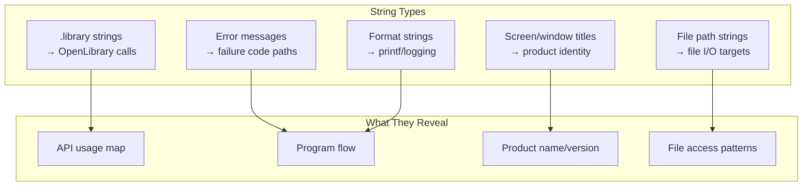

[← Home](../../README.md) · [Reverse Engineering](../README.md)

# String Cross-Reference Analysis

## Overview

A binary is a sea of bytes. Most of it is unintelligible machine code. But floating in that sea are islands of ASCII: library names, error messages, format strings, screen titles. Each string is a **label on a code path** — the first thing a reverse engineer should find, because it's the only human-readable content in the entire binary.

String cross-reference analysis is the fastest entry point into an unknown Amiga binary. Find the `.library` strings → find `OpenLibrary` calls → identify every OS API the program uses. Find error messages → find the error-handling code paths. Find format strings → find printf/logging sites → understand program flow. This article covers the complete string-driven RE methodology.



---

---

## Finding Library Name Strings

Every `OpenLibrary` call is preceded by a string reference. Search for `".library"`:

```bash
# Host: grep for library name strings in binary
strings mybinary | grep -i library
# → "dos.library", "graphics.library", "intuition.library", ...
```

In IDA:
1. `View → Open Subviews → Strings` (Shift+F12)
2. Search for `.library`
3. Press `X` on any result to see all cross-references
4. Each xref leads to a `LEA str(PC), A1` or `MOVE.L #str, A1` before a `JSR -552(A6)` (OpenLibrary)

---

## Tracing OpenLibrary Calls to Their Targets

```asm
; Pattern to find:
LEA     (_str_dos).L, A1      ; "dos.library"
MOVEQ   #36, D0               ; min version
MOVEA.L 4.W, A6               ; exec.library
JSR     (-552,A6)             ; OpenLibrary → D0 = DOSBase
MOVE.L  D0, (_DOSBase).L      ; store for later use
```

Xref `_str_dos` → find this block → identify the stored library base variable → label it `_DOSBase`.

---

## Using HUNK_SYMBOL Names as Seed Labels

If `HUNK_SYMBOL` is present (debug build), IDA auto-applies names. These seed labels help bootstrap analysis:

1. `View → Open Subviews → Names` → look for any `_` prefixed symbols
2. Named functions often call unnamed helpers nearby — work outward
3. String xrefs from named functions propagate names further

---

## Error Message Strings

Error/diagnostic strings reveal program flow:

```asm
; Common pattern:
LEA     _err_nolib(PC), A0     ; "Can't open dos.library"
MOVEA.L _DOSBase, A6
JSR     (-60,A6)               ; Output() → D0 = stdout
MOVE.L  D0, D1
LEA     _err_nolib(PC), A2
MOVE.L  A2, D2
MOVEQ   #_err_nolib_end - _err_nolib, D3
JSR     (-48,A6)               ; Write(stdout, msg, len)
```

The error string tells you exactly what this code path handles.

---

## Format String Xref Analysis (printf)

SAS/C `printf` style calls via `dos.library VPrintf`:

```asm
MOVEA.L  _DOSBase, A6
LEA      _fmt_str(PC), A0      ; "Error: %ld\n"
MOVE.L   A0, D1
MOVE.L   A1, D2                ; varargs array
JSR      (-954,A6)             ; VPrintf()
```

Format strings like `"Error: %ld\n"` or `"Processing: %s"` reveal parameter types and function purpose.

---

## Workbench Title Strings

```asm
; Typical NewScreen/OpenScreen call sequence:
LEA     _screen_title(PC), A0  ; "MyApp v1.0"
MOVE.L  A0, (NewScreen+ns_Title)
```

Screen/window title strings appear in `intuition.library` `OpenScreen` / `OpenWindow` calls and give the product name.

---

## Automated String Map

Build a complete string inventory:

```python
# IDA script: map all string xrefs
for s in idautils.Strings():
    text = str(idc.get_strlit_contents(s.ea, s.length, s.strtype))
    refs = list(idautils.XrefsTo(s.ea))
    if refs:
        for ref in refs:
            func = idc.get_func_name(ref.frm)
            print(f"{s.ea:#x} [{text!r:40s}] ← {func or 'unknown'} @ {ref.frm:#x}")

---

## Decision Guide — String-Driven Entry Points

| String Type | What to Do First | What It Tells You |
|---|---|---|
| `".library"` | Xref → find OpenLibrary | Every OS API the program uses |
| `"Error:"` / `"Can't"` / `"Failed"` | Xref → error handler | Failure code paths, rare branches |
| `"%d"` / `"%s"` / `"%ld"` | Xref → VPrintf/printf | Logging sites, parameter types |
| File paths (`"SYS:"`, `"LIBS:"`, `"PROGDIR:"`) | Xref → Open/Lock/LoadSeg | File I/O targets |
| Screen/window titles | Xref → OpenScreen/OpenWindow | Application identity, version |

---

## Named Antipatterns

### 1. "The Dead String"

**What it looks like** — finding an error string with no cross-references and assuming the code path is unreachable:

```asm
LEA     _err_fatal(PC), A0     ; "FATAL: disk error"
; No xref to this string — but it's used via computed address!
```

**Why it fails:** Some programs build string addresses dynamically (e.g., through a string table indexed at runtime). IDA won't detect these as xrefs. The string IS used — just not through a static reference.

**Correct:** For strings without xrefs, check if they're part of a larger string table (consecutive string data). If so, a function loading a base address + computed offset may reference them dynamically.

### 2. "The Null Bait"

**What it looks like** — IDA showing a 100-character "string" because it didn't stop at an embedded null:

```asm
; SAS/C strings are Pascal-style: length-prefixed, NOT null-terminated!
DC.B    $0E, "Hello, World!", 0   ; length byte = 14, then data, then null
; IDA sees only "Hello, World!" — misses the length byte
```

**Why it fails:** SAS/C uses Pascal-style strings (length byte prefix) for some internal data. IDA's C-style null-terminated string detection stops at the first null and may misinterpret string boundaries.

**Correct:** Check the byte before the string. If it equals the string length, it's a Pascal string — the string starts at that byte, not after it.

---

## Use-Case Cookbook

### Map Every OS API Call from Strings Alone

```python
# IDA Python: from .library strings → OpenLibrary → all calls
import idautils, idc

LIBRARIES = {}
for s in idautils.Strings():
    text = str(s)
    if text.endswith('.library'):
        for xref in idautils.XrefsTo(s.ea):
            # Walk forward from xref to find JSR (-552,A6)
            ea = xref.frm
            for _ in range(20):
                if idc.print_insn_mnem(ea) == 'JSR':
                    op = idc.print_operand(ea, 0)
                    if '-552' in op:
                        # Find where D0 (result) is stored
                        next_ea = idc.next_head(ea)
                        if idc.print_insn_mnem(next_ea) == 'MOVE.L':
                            dest = idc.print_operand(next_ea, 0)
                            LIBRARIES[text] = dest
                            print(f"{text} → stored at {dest}")
                ea = idc.next_head(ea)
```

### Find All Version Strings

Version strings often follow the pattern `"$VER: name version (date)"`:

```bash
strings mybinary | grep -i '\$VER:'
# Output: $VER: MyApp 1.23 (12.04.1993)
```

---

## Cross-Platform Comparison

| Amiga Concept | Win32 Equivalent | Linux Equivalent | Notes |
|---|---|---|---|
| `.library` strings → OpenLibrary | `.dll` strings → LoadLibrary | `.so` strings → dlopen | Same pattern: string identifies dynamically loaded module |
| String xref analysis | `strings.exe` + IDA cross-reference | `strings` + radare2/Ghidra xref | Universal RE technique: strings are the first foothold |
| SAS/C Pascal strings | Delphi/BCB short strings | N/A (C-dominated ecosystem) | Pascal-style strings are rare outside Amiga SAS/C |
| `$VER:` version string convention | `VS_VERSION_INFO` resource | `.comment` ELF section | Amiga's convention is informal but widely followed |

---

## FAQ

### Why do some strings have no xrefs in IDA?

Possible causes: (1) the string is referenced via a computed address (base+index), (2) the string is in a data table accessed by offset, (3) the string is dead code from a library compiled in but never called, (4) IDA's string detection split a long string incorrectly.

### How do I handle non-ASCII strings (German umlauts, etc.)?

Amiga uses ISO 8859-1 (Latin-1) encoding. Characters above `$7F` are valid Latin-1 but may display incorrectly in IDA's default ASCII view. Set IDA's string encoding to Latin-1 or use `idc.get_strlit_contents(ea, -1, STRTYPE_C_16)` for wide strings.

---

## References
```

---

## References

- IDA Pro: Strings subview (Shift+F12), Xrefs (X key)
- `static/api_call_identification.md` — resolving library base from string xrefs
- NDK39: `dos/dos.h` — `VPrintf`, `FPrintf`, error code strings
