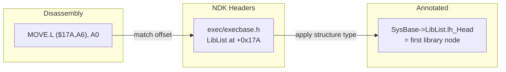

[← Home](../../README.md) · [Reverse Engineering](../README.md)

# Recovering Data Structures

## Overview

You see `MOVE.L ($17A,A6), A0` in disassembly. You know A6 is SysBase. But `+$17A` — what field is that? Without structure definitions, every offset is just a number. With them, `+$17A` becomes `SysBase->LibList` and the disassembly transforms from arithmetic to narrative.

Amiga executables are built on a deep stack of OS structures — `ExecBase`, `Node`, `List`, `Task`, `Process`, `IORequest`, `Message`, `MsgPort`. Recovering these structures in disassembly means matching **base register + constant offset** patterns against the NDK 3.9 header definitions. This article covers the methodology, the most commonly encountered structures, and the IDA Pro workflows that automate the process.



---

---

## The MOVE.L offset(An),Dm Pattern

Structure field accesses appear as:

```asm
MOVEA.L  _DOSBase, A6
MOVE.L   ($17A,A6), A0     ; SysBase->LibList at offset +0x17A
MOVE.L   (A0), A1           ; lh_Head
```

The key is the **base register** and **constant offset**. Match the offset against known structure definitions.

---

## Common Structures and Key Offsets

### `struct ExecBase` (at absolute address `$4`)

| Offset | Field | Type |
|---|---|---|
| +0 | `LibNode` | `struct Library` |
| +0x128 | `TaskReady` | `struct List` |
| +0x132 | `TaskWait` | `struct List` |
| +0x17A | `LibList` | `struct List` |
| +0x182 | `DeviceList` | `struct List` |
| +0x21E | `ChipRevBits0` | `UWORD` |
| +0x280 | `MemList` | `struct List` |

### `struct Node` (8 bytes)

| Offset | Field |
|---|---|
| +0 | `ln_Succ` (next node) |
| +4 | `ln_Pred` (prev node) |
| +8 | `ln_Type` (UBYTE) |
| +9 | `ln_Pri` (BYTE priority) |
| +10 | `ln_Name` (STRPTR) |

List traversal:
```asm
MOVEA.L  lh_Head, A0    ; first node
.loop:
    TST.L   (A0)        ; ln_Succ == NULL?
    BEQ.S   .done
    ; process node at A0
    MOVEA.L (A0), A0    ; A0 = ln_Succ
    BRA.S   .loop
```

### `struct Process` (extends `struct Task`)

| Offset | Field |
|---|---|
| +0 | `pr_Task` (struct Task) |
| +92 | `pr_MsgPort` |
| +128 | `pr_CLI` (BPTR, non-NULL if CLI) |
| +172 | `pr_SegList` (BPTR to segment list) |

Detection in disassembly:
```asm
MOVE.L  ($80,A4), D0    ; pr_CLI at offset +0x80
BEQ.S   .wb_launch      ; NULL = Workbench
```

### `struct IORequest` / `struct IOStdReq`

| Offset | Field |
|---|---|
| +0 | `io_Message` (struct Message) |
| +20 | `io_Device` |
| +24 | `io_Unit` |
| +28 | `io_Command` (UWORD) |
| +30 | `io_Flags` (UBYTE) |
| +32 | `io_Error` (BYTE) |
| +36 | `io_Length` (ULONG) |
| +40 | `io_Actual` (ULONG) |
| +44 | `io_Data` (APTR) |
| +48 | `io_Offset` (ULONG) |

---

## Annotating Structures in IDA Pro

### Define a structure type:

1. `View → Open Subviews → Local Types` → `Insert` → paste C struct definition
2. IDA parses the struct and creates a type entry
3. Navigate to the base register in disassembly
4. Press `T` (structure offset) on any `offset(An)` operand
5. Select the struct type → all accesses auto-annotated

### Import NDK39 headers:

Use `File → Load file → Parse C header file` → select `exec/execbase.h`, `exec/tasks.h`, etc. from NDK39.

---

## Decision Guide — When to Use Each Approach

| Approach | Speed | Accuracy | Best For |
|---|---|---|---|
| **`.fd` file mapping** | Instant | 100% (known libs) | Library function identification — not structure recovery |
| **Manual offset matching** | 1–5 min per struct | 100% (verified against NDK) | Small structures or one-off field identification |
| **IDA Structure subview + `T` hotkey** | 30 sec | 100% (if struct defined) | Batch annotation of known structures |
| **Parse C header file** | 1 min setup | 100% | Importing full NDK type system |
| **Heuristic: offset clustering** | ~2 min | 70–90% | Unknown structures — group accesses by register, infer field boundaries |

---

## Named Antipatterns

### 1. "The Offset Hallucination"

**What it looks like** — assuming `($1A,A6)` is always `lib_Version` because the number looks right:

```asm
MOVE.W  ($1A,A6), D0     ; looks like version?
; Actually: lib_Version is at +$14 (offset 20), NOT +$1A (offset 26)
; +$1A = lib_Node.ln_Name (upper word of STRPTR)
```

**Why it fails:** Hex offsets are deceptive. `$14` and `$1A` differ by 6 bytes — one field apart in a packed structure. Without the header definition, off-by-one-field errors are invisible until runtime.

**Correct:** Always verify against the NDK header. `lib_Version` is at `+$14` (UWORD), not `+$1A`.

### 2. "The Nested Structure Blur"

**What it looks like** — accessing `SysBase->LibList.lh_Head` but interpreting it as `SysBase->TaskWait.lh_Head`:

```asm
MOVEA.L  ($17A,A6), A0    ; +$17A = LibList (correct)
; Not: +$132 = TaskWait — that's a different list entirely
```

**Why it fails:** `SysBase` has multiple `struct List` fields. `LibList` (`+$17A`), `DeviceList` (`+$182`), `TaskReady` (`+$128`), `TaskWait` (`+$132`), `MemList` (`+$280`) — all use the same `lh_Head` access pattern. Without checking the exact offset, you'll identify the wrong list.

**Correct:** The offset is the discriminator. `+$17A` = LibList, `+$128` = TaskReady. Never guess.

---

## Use-Case Cookbook

### Recover an Unknown Allocator — Trace AllocMem → FreeMem Pair

```asm
; Find the alloc:
MOVEQ   #$1000, D0           ; size = 4096
MOVE.L  #$10002, D1          ; MEMF_CLEAR | MEMF_PUBLIC
MOVEA.L 4.W, A6
JSR     (-198,A6)             ; AllocMem → D0 = ptr
MOVEA.L D0, A4

; ... later, find the free:
MOVEA.L A4, A1
MOVEQ   #$1000, D0
JSR     (-210,A6)             ; FreeMem(A1=ptr, D0=size)
```

Trace D0 from AllocMem through the function to identify **which struct** is being allocated. If the code then accesses `($14,A4)`, you have a `struct Library` allocation.

### Batch-Annotate All ExecBase Accesses

```python
# IDA Python: apply ExecBase structure to all SysBase-relative accesses
def apply_execbase_structure():
    sid = idc.get_struc_id("ExecBase")
    if sid == idc.BADADDR:
        idc.import_type(-1, "ExecBase")
        sid = idc.get_struc_id("ExecBase")
    
    sysbase = idc.get_name_ea_simple("SysBase")
    if sysbase == idc.BADADDR:
        print("SysBase not found")
        return
    
    # Find all instructions referencing SysBase-relative offsets
    for xref in idautils.XrefsTo(sysbase):
        ea = xref.frm
        # Navigate forward looking for offset(An) operands
        for i in range(10):
            ea = idc.next_head(ea)
            for n in range(2):
                op = idc.print_operand(ea, n)
                if op and '(' in op and 'A6' in op:
                    idc.op_stroff(ea, n, sid, 0)
                    print(f"Applied ExecBase at {ea:#010x}")

apply_execbase_structure()
```

---

## Cross-Platform Comparison

| Amiga Concept | Win32 Equivalent | Linux ELF Equivalent | Notes |
|---|---|---|---|
| Structure recovery by offset matching | PDB symbol file (debug info) | DWARF debug info `.debug_info` | Amiga lacks embedded debug info — must match offsets manually |
| NDK headers as ground truth | Windows SDK headers + PDB | GLibc headers + DWARF | Same idea: header defines layout, disassembly shows access pattern |
| `MOVE.L ($14,A6), D0` | `mov eax, [esi+14h]` | `mov rax, [rbp+0x14]` | Universal pattern: base register + constant offset |
| IDA `T` hotkey for struct offset | IDA `T` on x86/ARM too | Same | IDA's struct offset annotation is platform-independent |

---

## FAQ

### How do I identify a struct when the base register changes?

Track register writes backward. If A4 holds a struct pointer but you can't tell which struct, find the last `MOVEA.L ..., A4`. If it came from `AllocMem`, the size in D0 tells you the struct size — match against known struct sizes from NDK. If it came from `OpenLibrary`, it's a library base.

### What if the OS version changed the struct layout?

Commodore maintained binary compatibility — fields were appended, never reordered. An offset that works on Kickstart 1.3 also works on 3.1, because the earlier fields are at the same positions. However, fields added in later versions only exist in those versions. Always check `lib_Version` before accessing fields added after OS 1.3.

---

## References

---

## Exec Node Traversal Loops

A recurring pattern: walking the `LibList` or `DeviceList`:

```asm
; Annotated after struct recovery:
MOVEA.L  SysBase, A6
LEA      (LibList,A6), A0     ; &SysBase->LibList
MOVEA.L  (lh_Head,A0), A1    ; first lib node
.scan:
    MOVEA.L (ln_Succ,A1), A2 ; peek next
    TST.L   A2
    BEQ.S   .not_found
    ; compare ln_Name string
    MOVEA.L (ln_Name,A1), A0
    JSR     ___strcmp
    TST.L   D0
    BEQ.S   .found
    MOVEA.L A2, A1
    BRA.S   .scan
```

---

## References

- NDK39: `exec/execbase.h`, `exec/tasks.h`, `exec/nodes.h`, `exec/io.h`
- [exec_base.md](../../06_exec_os/exec_base.md) — full ExecBase field listing
- [lists_nodes.md](../../06_exec_os/lists_nodes.md) — MinList/List traversal
- IDA Pro: Structure subview, Local Types, T hotkey for struct offset
