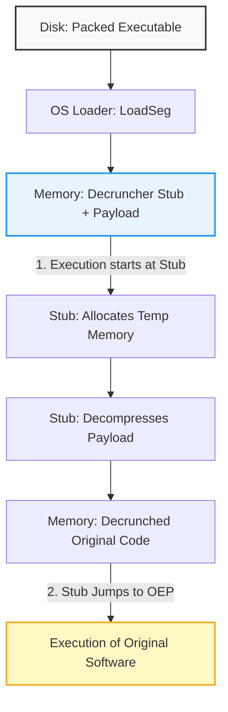

[← Home](../README.md) · [Reverse Engineering](README.md)

# Executable Unpacking — Decrunching and Memory Extraction

> [!NOTE]
> This article details how to reverse-engineer compressed Amiga binaries by extracting the underlying code from memory. See [Reverse Engineering](README.md) for the broader static analysis methodology.

## Overview

In the 1980s and 90s, disk space and RAM were brutally constrained. Commercial software, cracktros, and demos rarely shipped as standard AmigaOS HUNK executables. Instead, they were heavily compressed — "crunched" — to fit on an 880 KB floppy disk and load faster from slow media.

This was the problem executable compression solved. A packer (like ByteKiller, Shrinkler, or Imploder) would compress the original code into a payload, wrap it in a tiny "decruncher stub", and output a new executable. When run, the stub allocates memory, decompresses the payload, and jumps to the Original Entry Point (OEP) of the software. 

For reverse engineers, this is an obstacle. Standard static analysis tools like IDA Pro cannot disassemble compressed entropy; they only see the decruncher stub. To analyze the actual software, you must unpack it. This involves either using automated tools to recognize known compression formats, or manually intercepting execution immediately after the decruncher finishes, and dumping the pristine code from memory to disk.

---

## The Decruncher Architecture

Executable compression typically follows a standard two-phase lifecycle during execution.



1. **Load Phase**: AmigaOS's `LoadSeg()` loads the executable. Because the file is packed, only the decruncher stub and the packed data payload are loaded into memory.
2. **Execution Phase**: The OS jumps to the first instruction of the decruncher. The decruncher allocates necessary memory (often via `AllocMem()`), unpacks the data in a tight loop, and then executes a `JMP` to the Original Entry Point.

---

## Automated Unpacking Tools

Before attempting manual unpacking, always try to use an automated tool. If the software was compressed with a standard, recognized packer, these tools can automatically extract the original binary.

### xfdmaster.library

The standard Amiga solution for automated decrunching is `xfdmaster.library`. It provides a unified API for identifying and unpacking dozens of historical compression formats. 

- **When to use**: Standard packers like PowerPacker, Imploder, or ByteKiller.
- **Tools**: Command-line utilities like `xfdDecrunch` (available on Aminet) utilize this library to unpack files directly on the Amiga or via emulator.

### Unpacker.library

An alternative to `xfdmaster`, `Unpacker.library` provides similar functionality for recognizing and extracting packed executables.

---

## Manual Unpacking Methodology

When dealing with a custom packer, an unknown format, or heavily obfuscated code (e.g., custom cracktros or copy protection), automated tools will fail. You must unpack the code manually by letting the Amiga do the work, then freezing it at the exact moment decompression finishes.

> [!IMPORTANT]
> The Motorola 68000 is a **Big-Endian** architecture. When inspecting memory dumps in a hex editor, remember that longwords are stored most-significant-byte first.

### Step 1: Locate the Jump to OEP

The goal is to find the exact instruction where the decruncher yields control to the original software. This is almost always a `JMP (An)` or a `JSR` at the very end of the decruncher loop.

1. Open the packed executable in a disassembler (e.g., IDA Pro, ReSource, or IRA).
2. Look for the decompression loop — a tight loop doing continuous memory writes and bit-shifting.
3. Immediately following the loop, find the jump instruction transferring control.

```asm
; Typical Decruncher End
    move.l  (a7)+,d0      ; Restore registers
    movea.l (a7)+,a0      
    jmp     (a0)          ; Jump to Original Entry Point (OEP)!
```

### Step 2: Intercept Execution

You must run the executable, but prevent it from executing the original software so you can dump the memory safely.

**Using an Assembler/Debugger (e.g., AsmOne or Seka):**
1. Load the executable into memory using the assembler.
2. Place a breakpoint precisely on the `JMP (An)` instruction identified in Step 1.
3. Run the code. The decruncher will execute, decompress the payload into RAM, and then halt exactly before executing it.

### Step 3: Dump to Disk

With execution halted, the decrunched payload is now sitting in RAM in plain text (68k opcodes).

1. Identify the memory range of the decrunched payload. This is usually tracked by the address registers used in the decompression loop (e.g., the destination pointer).
2. Use the assembler/debugger's save command to write that memory range directly to a file on disk.

```
; AsmOne memory save command example
> S "RAM:unpacked.bin" $20000 $35000
```

### Step 4: Reassembly and Analysis

The resulting `unpacked.bin` is a raw memory dump. It is no longer an AmigaOS HUNK executable; the HUNK headers have been stripped away by the OS loader and the decruncher.

To analyze it:
1. Load the `.bin` file into IDA Pro as a raw binary blob.
2. Set the base address to match where it was loaded in Amiga memory (if the code is not position-independent).
3. Begin static analysis at the OEP.

---

## Pitfalls & Common Mistakes

### 1. In-Place Decrunching Corruption

Some decrunchers attempt to save memory by unpacking the data "in-place" — overwriting the packed data with the unpacked data as they go.

**The Problem:** If the unpacked data is larger than the packed data (which it always is), the write pointer will eventually overtake the read pointer, corrupting the unread packed data.

**Why it fails:** The decruncher calculates an exact offset to start unpacking from the *end* of the file backwards to prevent this, but manual interference or memory layout shifts can break this delicate balance.

```c
/* BAD: Forward in-place decrunching */
void decrunch(char *src, char *dest) {
    while(size--) {
        *dest++ = unpack_byte(src++); /* Dest will overwrite Src eventually! */
    }
}
```

```c
/* GOOD: Backward in-place decrunching */
void decrunch_safe(char *src_end, char *dest_end) {
    while(size--) {
        *--dest_end = unpack_byte(--src_end); /* Works backwards from end of buffer */
    }
}
```

### 2. Assuming Position Independence

A common mistake is dumping the raw memory, and then assuming it can be simply wrapped back into a HUNK header and executed anywhere.

**Why it fails:** AmigaOS HUNK executables rely on the OS loader to fix up absolute memory addresses (`HUNK_RELOC32`) based on where the program is loaded in RAM. When you dump the memory, the relocations have *already been applied* for that specific address. If you try to run the raw dump at a different address, every absolute `JSR` or `MOVE.L` will crash the machine.

**The Fix:** You must manually reconstruct the relocation table, or ensure the code is strictly position-independent (PC-relative), which is rare for large C/C++ applications.

---

## Summary Best Practices

1. **Always try automated tools first** — `xfdmaster.library` can save hours of manual reverse engineering.
2. **Use a native debugger** — Tools like AsmOne running in an emulator are perfectly suited for intercepting execution.
3. **Beware of relocations** — Raw memory dumps are locked to the address they were unpacked at; do not assume they are relocatable.
4. **Identify the OEP precisely** — The `JMP (An)` at the end of the decruncher is the key to successful extraction.

---

## References

- [Reverse Engineering Methodology](methodology.md)
- [Code vs Data Disambiguation](static/code_vs_data_disambiguation.md)
- Aminet: `util/pack/xfdmaster`
