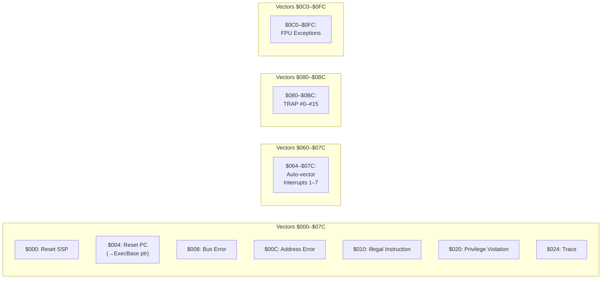

[← Home](../README.md) · [Exec Kernel](README.md)

# Exception and Trap Handling — M68k on AmigaOS

## Overview

The M68k CPU provides a **256-entry exception vector table** starting at address `$000000`. AmigaOS manages these vectors through `exec.library`, allowing both the OS and user code to install handlers for hardware interrupts, bus errors, and software traps. Understanding the exception model is essential for debugger development, system programming, and diagnosing Guru Meditations.

---

## Exception Vector Table



### Complete Vector Map

| Vector | Address | Exception | AmigaOS Handler |
|---|---|---|---|
| 0 | `$000` | Reset: Initial SSP | Boot stack pointer |
| 1 | `$004` | Reset: Initial PC | ROM entry point → later ExecBase pointer |
| 2 | `$008` | Bus Error | Guru Meditation / Enforcer |
| 3 | `$00C` | Address Error | Guru Meditation |
| 4 | `$010` | Illegal Instruction | Guru Meditation |
| 5 | `$014` | Zero Divide | Alert |
| 6 | `$018` | CHK Instruction | Alert |
| 7 | `$01C` | TRAPV | Alert |
| 8 | `$020` | Privilege Violation | Alert |
| 9 | `$024` | Trace | Debug (Wack / BareFoot) |
| 10 | `$028` | Line-A Emulator | Unused (available for soft traps) |
| 11 | `$02C` | Line-F Emulator | 68040/060.library FPU emulation |
| 12–14 | `$030–$038` | Reserved | — |
| 15 | `$03C` | Uninitialized Interrupt | Alert |
| 24 | `$060` | Spurious Interrupt | Ignored |
| 25–31 | `$064–$07C` | Auto-vector interrupts 1–7 | Exec interrupt dispatcher |
| 32–47 | `$080–$0BC` | TRAP #0–#15 | User-installable traps |
| 48–54 | `$0C0–$0D8` | FPU exceptions | 68881/68882 handlers |
| 55 | `$0DC` | FPU Unimplemented Data Type | 68040.library |
| 56–58 | `$0E0–$0E8` | MMU exceptions | 68030/040/060 |
| 59–63 | `$0EC–$0FC` | Reserved | — |
| 64–255 | `$100–$3FC` | User-defined vectors | Application-specific |

---

## Exception Stack Frames

When an exception occurs, the CPU pushes an exception stack frame onto the Supervisor Stack. The frame format varies by CPU and exception type:

### 68000 Format

```
SP → ────────────────
     │ Status Register    │ (WORD)
     ├────────────────────┤
     │ Program Counter    │ (LONG)
     ├────────────────────┤
     │ (Bus/Address Error only:)  │
     │ Access Address     │ (LONG)
     │ Instruction Register│ (WORD)
     │ R/W + Function Code│ (WORD)
     └────────────────────┘
```

### 68010+ Format

```
SP → ────────────────
     │ Status Register    │ (WORD)
     ├────────────────────┤
     │ Program Counter    │ (LONG)
     ├────────────────────┤
     │ Frame Format | Vector Offset │ (WORD)
     │ Format $0: short (4 words)   │
     │ Format $8: bus error (29 words on 68010) │
     │ Format $7: bus error on 68040 (30 words)  │
     └────────────────────┘
```

The `Frame Format` field (bits 15–12) identifies how many additional words are on the stack. This is critical for writing portable exception handlers:

| Format | CPU | Words | Exception Type |
|---|---|---|---|
| $0 | 010+ | 4 | Normal (short) — TRAP, interrupt |
| $1 | 010 | 4 | Throwaway (during instruction restart) |
| $2 | 020+ | 6 | Normal (long) — includes instruction address |
| $7 | 040 | 30 | Access fault |
| $8 | 010 | 29 | Bus error (68010) |
| $9 | 020/030 | 10 | Coprocessor mid-instruction |
| $A | 020/030 | 16 | Short bus error |
| $B | 020/030 | 46 | Long bus error |

---

## TRAP Instructions — Software Exceptions

`TRAP #n` (n = 0–15) generates a software exception via vectors 32–47 ($080–$0BC):

| TRAP | Vector | AmigaOS Use |
|---|---|---|
| `TRAP #0` | `$080` | `exec.library Supervisor()` — enter supervisor mode |
| `TRAP #1–#14` | `$084–$0B8` | Available for user programs |
| `TRAP #15` | `$0BC` | Remote debugger breakpoint (Wack / BareFoot) |

### Using TRAP for System Calls (Supervisor Mode)

```c
/* exec.library Supervisor() — execute a function in supervisor mode */
ULONG result = Supervisor((APTR)mySuperFunc);

/* mySuperFunc runs at supervisor level: */
ULONG __asm mySuperFunc(void)
{
    /* Can access the Status Register, modify interrupt mask,
       read/write control registers (VBR, CACR, etc.) */
    ULONG vbr;
    __asm volatile ("movec vbr,%0" : "=d"(vbr));
    __asm volatile ("rte");  /* Return from exception — mandatory */
    return vbr;
}
```

### Using TRAP for Debugger Breakpoints

Debuggers replace the instruction at the breakpoint address with `TRAP #0` (`$4E40`) or `TRAP #15` (`$4E4F`):

```asm
; Original code:
$00F80100:  MOVE.L  D0,(A0)

; With breakpoint:
$00F80100:  TRAP    #0          ; $4E40 — triggers vector $080

; The trap handler:
; 1. Saves all registers
; 2. Compares PC from exception frame against breakpoint list
; 3. Restores original instruction
; 4. Signals debugger task
; 5. Suspends target task
```

---

## Task-Level Exception Handling

AmigaOS provides per-task exception handlers via the `tc_ExceptCode` and `tc_ExceptData` fields:

```c
/* Install a task-level exception handler */
struct Task *me = FindTask(NULL);
me->tc_ExceptCode = MyExceptionHandler;
me->tc_ExceptData = myData;

/* Enable exception signals (bits that trigger the handler) */
SetExcept(SIGBREAKF_CTRL_C | mySig, SIGBREAKF_CTRL_C | mySig);
/* First arg = new mask, second = change mask */

/* Exception handler (called asynchronously when excepted signal arrives): */
ULONG __saveds MyExceptionHandler(
    ULONG signals __asm("d0"),
    APTR  data    __asm("a1"))
{
    if (signals & SIGBREAKF_CTRL_C)
    {
        /* Handle Ctrl+C at exception level */
    }
    return signals;  /* Return mask of signals to re-enable */
}
```

### Exception vs Signal

| Mechanism | Delivery | Context | Use Case |
|---|---|---|---|
| `Signal` + `Wait` | Polled — task checks when ready | Normal task context | Normal IPC |
| `tc_ExceptCode` | Asynchronous — interrupts the task immediately | Exception context (limited) | Urgent notifications, Ctrl+C handling |

---

## Guru Meditation

When a fatal exception occurs (Bus Error, Address Error, Illegal Instruction), exec displays:

```
Software Failure.   Press left mouse button to continue.
Guru Meditation #XXYYYYYY.ZZZZZZZZ
```

### Decoding the Guru Code

```
#XXYYYYYY.ZZZZZZZZ
 │├──────┤ ├──────┤
 │   │         └── Address where error occurred (PC or access address)
 │   └──────────── Error code (subsystem + specific error)
 └──────────────── Alert type: $00=recovery possible, $80=dead-end
```

### Common Guru Codes

| Code | Alert Type | Subsystem | Meaning |
|---|---|---|---|
| `$00000001` | Recoverable | exec | No memory |
| `$04000001` | Recoverable | exec | Generic recoverable alert |
| `$80000002` | Dead-end | exec | Bus error |
| `$80000003` | Dead-end | exec | Address error |
| `$80000004` | Dead-end | exec | Illegal instruction |
| `$80000005` | Dead-end | exec | Zero divide |
| `$80000008` | Dead-end | exec | Privilege violation |
| `$81000005` | Dead-end | exec | No memory (dead-end) |
| `$82000005` | Dead-end | graphics | No memory |
| `$83000005` | Dead-end | layers | No memory |
| `$84000005` | Dead-end | intuition | No memory |
| `$85000005` | Dead-end | math | No memory |
| `$87000007` | Dead-end | trackdisk | No disk inserted |

### Subsystem Codes (bits 16–23)

| Code | Subsystem |
|---|---|
| `$01` | exec.library |
| `$02` | graphics.library |
| `$03` | layers.library |
| `$04` | intuition.library |
| `$05` | mathffp.library |
| `$07` | trackdisk.device |
| `$08` | timer.device |
| `$09` | cia.resource |
| `$0A` | disk.resource |
| `$0B` | misc.resource |
| `$10` | bootstrap |
| `$15` | audio.device |
| `$20` | dos.library |
| `$21` | ramlib |
| `$30` | workbench |

---

## Line-F Emulation (68040/060)

The 68040 and 68060 CPUs removed some FPU instructions from silicon for die-space reasons. When these instructions are encountered, the CPU generates a Line-F exception (vector 11, address `$02C`). The `68040.library` or `68060.library` installs a handler that **emulates** the missing instructions in software:

| Instruction | 68881/882 | 68040 | 68060 |
|---|---|---|---|
| `FSIN`, `FCOS`, `FTAN` | Hardware | **Emulated** | **Emulated** |
| `FASIN`, `FACOS`, `FATAN` | Hardware | **Emulated** | **Emulated** |
| `FLOG10`, `FLOG2`, `FLOGN` | Hardware | **Emulated** | **Emulated** |
| `FETOX`, `FTWOTOX`, `FTENTOX` | Hardware | **Emulated** | **Emulated** |
| `FMOVE` (packed decimal) | Hardware | **Emulated** | **Emulated** |
| `FADD`, `FSUB`, `FMUL`, `FDIV` | Hardware | Hardware | Hardware |

> **Performance**: Emulated transcendental functions on the 68040 are ~5–20× slower than hardware implementations on the 68882. Code that heavily uses these should consider lookup tables or polynomial approximations.

---

## Enforcer and MMU-Based Exception Monitoring

On 68020+ systems with an MMU, tools like **Enforcer** and **MuForce** configure the MMU to trap accesses to invalid addresses:

```
Enforcer Hit:  READ-WORD FROM 0000000C    PC: 00F80234
    USP: 00321A04  ISP: 07FFE000
    Data: 00000000 00F80100 00321A00 00000042 00000001 00000000 00000000 00000000
    Addr: 00321A10 00F80000 00000000 00DFF000 00321C00 00320000 00321FFE 07FFE000
    Stck: 00F80238 00000042
    Name: "MyBuggyApp"
```

This catches:
- NULL pointer dereferences (reading from address 0)
- Access to unallocated memory
- Writes to ROM address space
- Access to the exception vector area ($000–$3FF) from user mode

Enforcer doesn't prevent the crash — it just reports it with enough context to find the bug.

---

## Best Practices

1. **Never write directly to exception vectors** — use `SetFunction` on exec's trap vectors or `Supervisor()`
2. **Always use `RTE`** to return from exception handlers — `RTS` corrupts the supervisor stack
3. **Keep exception handlers minimal** — you're at supervisor level with limited stack
4. **Use Enforcer during development** — catches 90% of pointer bugs
5. **Install the correct 040/060 library** — without it, transcendental FPU instructions crash
6. **Use `Supervisor()`** instead of manual `TRAP #0` for portable supervisor access
7. **Save and restore all registers** in your exception handler — the interrupted code depends on them

---

## References

- Motorola: *MC68000 Family Programmer's Reference Manual* — exception processing
- Motorola: *MC68040 User's Manual* — exception stack frame formats
- NDK39: `exec/alerts.h`, `exec/tasks.h` (tc_ExceptCode), `exec/execbase.h`
- ADCD 2.1: `Supervisor`, `SetExcept`, `Alert`
- See also: [Interrupts](interrupts.md) — auto-vector interrupt handling
- See also: [Multitasking](multitasking.md) — how debuggers use TRAP for breakpoints
- *Amiga ROM Kernel Reference Manual: Exec* — exception handling chapter
