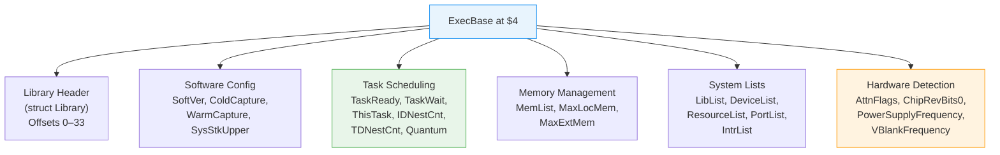

[← Home](../README.md) · [Exec Kernel](README.md)

# ExecBase — Full Structure Reference

## Overview

`ExecBase` is the root structure of AmigaOS, located at absolute address `$4`. It is a `struct Library` extended with all exec kernel state: memory lists, task queues, interrupt vectors, library lists, and hardware abstraction fields. Every system call goes through `ExecBase` — it is the single point of truth for the entire running system.

---

## Locating ExecBase

```c
/* C — standard method */
struct ExecBase *SysBase = *((struct ExecBase **)4);

/* Or use the auto-open variable (SAS/C, GCC): */
extern struct ExecBase *SysBase;  /* Linker resolves from startup code */
```

```asm
; Assembly — canonical method
    MOVEA.L  4.W,A6    ; A6 = SysBase (short absolute addressing)
    ; All exec LVO calls use JSR offset(A6)
```

> **Why address $4?** The 68000 stores the initial Program Counter at address $4 in the exception vector table. During cold boot, the CPU reads this address to find the ROM entry point. After boot, Exec overwrites it with a pointer to ExecBase. This is the one absolute address every Amiga program can rely on.

---

## Structure Layout



---

## Key Field Groups

### Library Header (Offset 0–33)

Every library starts with this — ExecBase is exec.library's own base:

```c
struct Library  LibNode;     /* ln_Name = "exec.library" */
                             /* lib_Version = 40 (OS 3.1), 45 (OS 3.2), 47 (OS 3.2.2) */
                             /* lib_OpenCnt = open count */
```

### Boot and Configuration

| Offset | Field | Type | Description |
|---|---|---|---|
| `$22` | `SoftVer` | `UWORD` | Kickstart software revision |
| `$24` | `LowMemChkSum` | `WORD` | Checksum of vectors $0–$200 |
| `$26` | `ChkBase` | `ULONG` | ExecBase self-checksum |
| `$2A` | `ColdCapture` | `APTR` | Cold reboot intercept vector |
| `$2E` | `CoolCapture` | `APTR` | Warm reboot intercept vector (after Diag) |
| `$32` | `WarmCapture` | `APTR` | Keyboard reset intercept vector |
| `$36` | `SysStkUpper` | `APTR` | Top of supervisor stack |
| `$3A` | `SysStkLower` | `APTR` | Bottom of supervisor stack |
| `$3E` | `MaxLocMem` | `ULONG` | Top of Chip RAM (e.g., `$200000` for 2 MB) |
| `$42` | `DebugEntry` | `APTR` | Entry point for ROM debugger (Wack) |
| `$46` | `DebugData` | `APTR` | Data area for ROM debugger |
| `$4A` | `AlertData` | `APTR` | Last Alert data |
| `$4E` | `MaxExtMem` | `APTR` | Top of Extended RAM (or NULL) |

### Task Scheduling

| Offset | Field | Type | Description |
|---|---|---|---|
| `$126` | `IDNestCnt` | `BYTE` | Interrupt disable nesting (−1 = enabled) |
| `$127` | `TDNestCnt` | `BYTE` | Task disable nesting (−1 = enabled) |
| `$128` | `ThisTask` | `APTR` | Pointer to currently running Task |
| `$12C` | `Quantum` | `UWORD` | Time slice for equal-priority round-robin |
| `$12E` | `Elapsed` | `UWORD` | Ticks elapsed in current quantum |
| `$130` | `SysFlags` | `UWORD` | Internal scheduler flags |
| `$132` | `TaskReady` | `List` | Tasks ready to run (sorted by priority) |
| `$146` | `TaskWait` | `List` | Tasks blocked on `Wait()` |

### Memory

| Offset | Field | Type | Description |
|---|---|---|---|
| `$15A` | `MemList` | `List` | All memory regions (`MemHeader` chain) |

### System Lists

| Offset | Field | Type | Description |
|---|---|---|---|
| `$17A` | `LibList` | `List` | Loaded libraries (`NT_LIBRARY`) |
| `$18E` | `DeviceList` | `List` | Loaded devices (`NT_DEVICE`) |
| `$1A2` | `IntrList` | `List` | Interrupt server lists |
| `$1B6` | `ResourceList` | `List` | System resources |
| `$1CA` | `PortList` | `List` | Public message ports |
| `$1DE` | `SemaphoreList` | `List` | Public semaphores |

### Hardware Detection

| Offset | Field | Type | Description |
|---|---|---|---|
| `$128` | `AttnFlags` | `UWORD` | CPU and FPU capability flags |
| `$212` | `VBlankFrequency` | `UBYTE` | VBL rate: 50 (PAL) or 60 (NTSC) |
| `$213` | `PowerSupplyFrequency` | `UBYTE` | Mains: 50 or 60 Hz |
| `$21E` | `ChipRevBits0` | `UBYTE` | Chip revision detection |

---

## AttnFlags — CPU Detection

| Bit | Constant | Meaning |
|---|---|---|
| 0 | `AFF_68010` | 68010 or better detected |
| 1 | `AFF_68020` | 68020 or better |
| 2 | `AFF_68030` | 68030 or better |
| 3 | `AFF_68040` | 68040 or better |
| 4 | `AFF_68881` | 68881 FPU detected |
| 5 | `AFF_68882` | 68882 FPU detected |
| 6 | `AFF_FPU40` | 68040 internal FPU |
| 7 | `AFF_68060` | 68060 detected (OS 3.1+) |
| 10 | `AFF_PRIVATE` | Exec private — do not use |

### Usage

```c
/* Check for 68020+ */
if (SysBase->AttnFlags & AFF_68020)
{
    /* Can use CACHE instructions, 32-bit multiply, etc. */
}

/* Check for FPU */
if (SysBase->AttnFlags & (AFF_68881 | AFF_68882 | AFF_FPU40))
{
    /* Floating-point hardware available */
}
```

---

## Detecting Chipset Revision

```c
/* via graphics.library */
struct GfxBase *gfx = (struct GfxBase *)OpenLibrary("graphics.library", 36);
if (gfx)
{
    if (gfx->ChipRevBits0 & GFXB_AA_ALICE)  /* AGA Alice */
    if (gfx->ChipRevBits0 & GFXB_AA_LISA)   /* AGA Lisa */
    if (gfx->ChipRevBits0 & GFXB_HR_AGNUS)  /* ECS Agnus */
    if (gfx->ChipRevBits0 & GFXB_HR_DENISE) /* ECS Denise */
}
```

---

## Enumerating System Lists

### Walking the Library List

```c
Forbid();
struct Node *node;
for (node = SysBase->LibList.lh_Head;
     node->ln_Succ != NULL;
     node = node->ln_Succ)
{
    struct Library *lib = (struct Library *)node;
    Printf("  %s V%ld.%ld (open: %ld)\n",
        lib->lib_Node.ln_Name,
        lib->lib_Version,
        lib->lib_Revision,
        lib->lib_OpenCnt);
}
Permit();
```

### Walking the Task Lists

```c
Forbid();

/* Currently running */
Printf("Running: %s\n", SysBase->ThisTask->tc_Node.ln_Name);

/* Ready to run */
for (node = SysBase->TaskReady.lh_Head;
     node->ln_Succ; node = node->ln_Succ)
{
    Printf("  Ready: %s (pri %ld)\n",
        node->ln_Name, node->ln_Pri);
}

/* Waiting */
for (node = SysBase->TaskWait.lh_Head;
     node->ln_Succ; node = node->ln_Succ)
{
    Printf("  Wait:  %s (pri %ld)\n",
        node->ln_Name, node->ln_Pri);
}

Permit();
```

---

## ExecBase Safety Rules

| Rule | Reason |
|---|---|
| **Never write to ExecBase fields** | Corrupts kernel state for all tasks |
| **Use `Forbid()` when walking lists** | Lists change as libraries open/close, tasks start/stop |
| **Don't cache pointers from lists** | Nodes may be removed between accesses |
| **Always use LVO functions** | Direct field manipulation bypasses safety checks |
| **Verify `SysBase` after warm reboot** | `ColdCapture`/`CoolCapture` may have altered it |

---

## ExecBase in IDA Pro / Ghidra

After loading Kickstart ROM:

1. **Create a segment** at `$000000–$000400` (exception vectors)
2. **Mark `$4` as a pointer** — follow it to the ExecBase in ROM
3. **Apply `struct ExecBase` type** from NDK39 headers
   - IDA: `File → Parse C header` with `exec/execbase.h`
   - Ghidra: Import C headers via Data Type Manager
4. **All `N(A6)` offsets** in exec code auto-annotate as field names
5. **Label the system lists** — `LibList`, `DeviceList`, `PortList` are entry points for understanding boot order

---

## References

- NDK39: `exec/execbase.h` — authoritative field definitions
- ADCD 2.1: exec.library autodoc
- See also: [Library System](library_system.md) — how libraries relate to ExecBase
- See also: [Multitasking](multitasking.md) — TaskReady/TaskWait and scheduler internals
- *Amiga ROM Kernel Reference Manual: Exec* — ExecBase chapter
